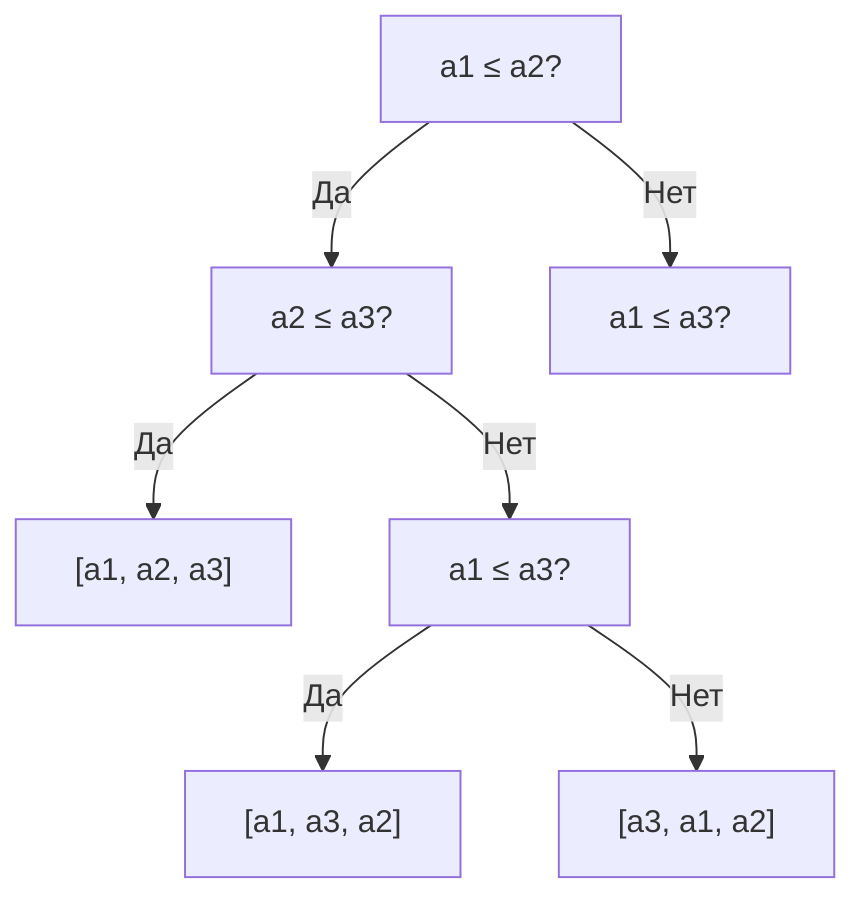
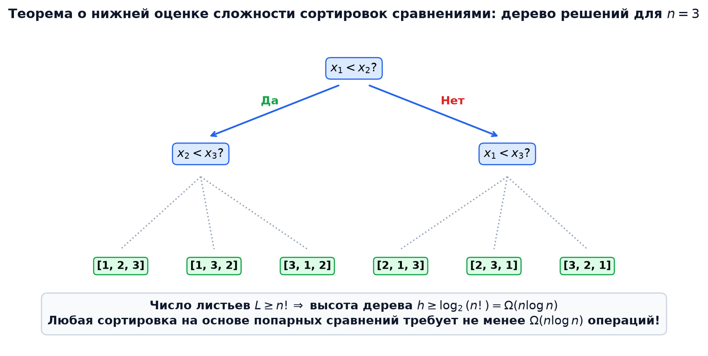
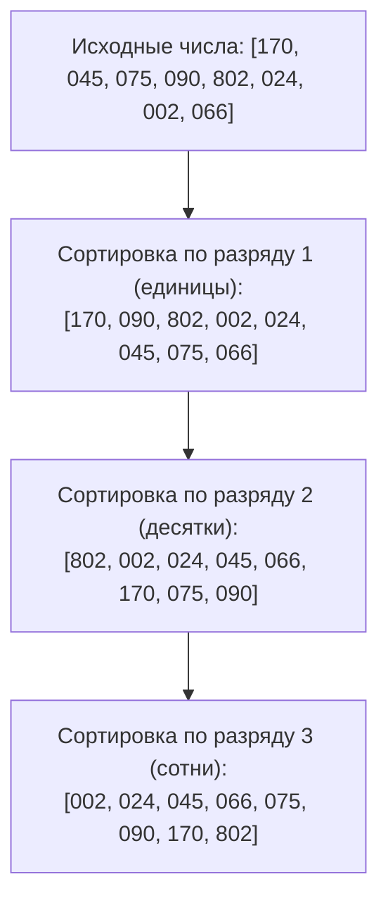

# 📌 Лекция 2: Линейные сортировки (Counting, Radix, Bucket Sort) и нижняя оценка сравнений

> [!abstract] О лекции
> - **Дисциплина:** [[Алгоритмы и структуры данных]] (1 семестр)
> - **Преподаватели:** Ткаченко / Лазарев / Пермяков
> - **Ключевые концепции:** Информационно-теоретический барьер сортировок сравнениями $\Omega(n \log n)$, дерево решений (Decision Tree), сортировка подсчетом (Counting Sort), префиксные суммы для обеспечения устойчивости, поразрядная сортировка (Radix Sort: LSD и MSD), карманная сортировка (Bucket Sort).

---

## 1. Нижняя оценка сложности сортировок сравнениями $\Omega(n \log n)$

Все алгоритмы сортировки, основывающиеся исключительно на парных операциях сравнения элементов ($a_i \le a_j$), имеют фундаментальное теоретическое ограничение на время работы в худшем случае.

### Модель дерева решений (Decision Tree)
Любой алгоритм сортировки сравнениями для входного массива из $n$ различных элементов можно представить в виде бинарного дерева решений:
- Каждый **внутренний узел** дерева представляет одно сравнение $a_i \le a_j$.
- Каждое **ребро** соответствует результату проверки: «Да» (левая ветвь) или «Нет» (правая ветвь).
- Каждый **лист** дерева соответствует однозначно определенной перестановке исходного массива $\pi = (p_1, p_2, \dots, p_n)$, упорядочивающей элементы.



### Доказательство теоремы
> [!important] Теорема (О нижней оценке сортировок сравнениями)
> Любой алгоритм сортировки сравнениями в худшем случае совершает не менее $\lceil \log_2(n!) \rceil = \Omega(n \log n)$ сравнений.

**Доказательство:**
1. Для массива размера $n$ существует ровно $n!$ возможных перестановок.
2. Чтобы алгоритм давал корректный ответ для любого входа, каждый из $n!$ исходов должен быть представлен хотя бы в одном листе дерева решений. Следовательно, количество листьев $L$:
   $$L \ge n!$$
3. В бинарном дереве высоты $h$ максимальное число листьев не превосходит $2^h$:
   $$2^h \ge L \ge n! \implies h \ge \log_2(n!)$$
4. Оценим $\log_2(n!)$ снизу, отбросив первую половину множителей:
   $$\log_2(n!) = \sum_{i=1}^n \log_2 i \ge \sum_{i=\lceil n/2 \rceil}^n \log_2 i \ge \frac{n}{2} \log_2\left(\frac{n}{2}\right) = \frac{n}{2}(\log_2 n - 1) = \Omega(n \log n)$$
   (По формуле Стирлинга: $n! \approx \sqrt{2\pi n}\left(\frac{n}{e}\right)^n \implies \log_2(n!) = n \log_2 n - n \log_2 e + O(\log n)$).
5. Высота дерева $h$ равна максимальному числу сравнений в худшем случае. Следовательно, $T(n) \ge h = \Omega(n \log n)$. $\blacksquare$



---

## 2. Сортировка подсчетом (Counting Sort)

Если элементы массива — целые числа из ограниченного диапазона $[0, K-1]$, мы можем отсортировать массив за время $O(n + K)$, полностью обойдя барьер $\Omega(n \log n)$, так как здесь не используются операции сравнения.

### Идея и алгоритм
1. Создаем массив счетчиков `cnt` размера $K$, заполненный нулями: $O(K)$.
2. Проходим по исходному массиву $A$ и подсчитываем частоту каждого ключа: $O(n)$.
3. Вычисляем префиксные суммы (Prefix Sums):
   $$cnt[i] = cnt[i] + cnt[i-1]$$
   Теперь $cnt[i]$ хранит число элементов, не превосходящих $i$, то есть индекс последней позиции элемента со значением $i$ в результирующем массиве.
4. Итерируемся по массиву $A$ **в обратном порядке** (справа налево от $n-1$ до $0$), размещая элементы в выходном массиве $B$:
   $$B[--cnt[A[i]]] = A[i]$$
   Обратный проход обеспечивает **устойчивость (stability)**: элементы с одинаковыми ключами сохраняют свой исходный относительный порядок.


### Реализация на C++20
```cpp
#include <vector>
#include <cstdint>

void countingSort(std::vector<int>& arr, int max_val) {
    int n = arr.size();
    if (n <= 1) return;

    std::vector<int> count(max_val + 1, 0);
    std::vector<int> output(n);

    // Шаг 1: Подсчет частот
    for (int x : arr) {
        count[x]++;
    }

    // Шаг 2: Префиксные суммы
    for (int i = 1; i <= max_val; ++i) {
        count[i] += count[i - 1];
    }

    // Шаг 3: Стабильное построение ответа (обратный ход)
    for (int i = n - 1; i >= 0; --i) {
        output[--count[arr[i]]] = arr[i];
    }

    arr = std::move(output);
}
```

### Анализ сложности:
- **Время:** $O(n + K)$ в лучшем, среднем и худшем случаях.
- **Память:** $O(n + K)$ дополнительной памяти под массив частот и выходной буфер.
- **Устойчивость:** ✅ Устойчива.

---

## 3. Поразрядная сортировка (Radix Sort)

Поразрядная сортировка предназначена для ключей большой длины (числа, строки, структуры), представляемых в виде кортежа разрядов:
$$x = (d_m, d_{m-1}, \dots, d_1)$$

### Подходы: LSD vs MSD
1. **LSD (Least Significant Digit first):** сортировка начинается с **младших разрядов** к старшим. Требует, чтобы алгоритм сортировки каждого разряда был **строго устойчивым** (используется Counting Sort).
2. **MSD (Most Significant Digit first):** сортировка начинается со **старших разрядов** к младшим (похожа на QuickSort / разбиение на корзины). Применяется для лексикографической сортировки строк переменной длины.

### Алгоритм Radix Sort (LSD)
Пусть числа представлены в системе счисления по основанию $B$ (например, $B = 256 = 2^8$, то есть побайтно), и максимальное число содержит $D$ разрядов.
Для каждого разряда $k$ от $0$ до $D-1$:
- Запускаем устойчивую `Counting Sort` по $k$-му разряду.




### Сложность:
- **Время:** $O(D \cdot (n + B))$.
  Для 32-битных чисел при $B = 2^8 = 256$, число разрядов $D = 4$.
  Сложность: $4 \times (n + 256) = O(n)$!
- **Память:** $O(n + B)$.

---

## 4. Карманная сортировка (Bucket Sort)

Применяется, когда входные данные равномерно распределены на непрерывном отрезке (например, вещественные числа в интервале $[0, 1)$).

1. Разбиваем отрезок $[0, 1)$ на $n$ одинаковых корзин (buckets).
2. Распределяем каждый элемент $x_i$ в корзину с индексом $b = \lfloor n \cdot x_i \rfloor$.
3. Каждую отдельную корзину сортируем (например, сортировкой вставками `Insertion Sort`).
4. Конкатенируем все корзины последовательно.

### Математическая оценка сложности:
Если величины независимы и равномерно распределены, то число элементов в каждой корзине подчиняется биномиальному распределению, и математическое ожидание квадрата размера корзины:
$$\mathbb{E}[n_i^2] = 2 - \frac{1}{n} = O(1)$$
Следовательно, суммарное матожидание времени работы:
$$\mathbb{E}[T(n)] = \sum_{i=0}^{n-1} O(\mathbb{E}[n_i^2]) = n \cdot O(1) = O(n)$$
В худшем случае (все элементы попали в одну корзину): $T(n) = O(n^2)$.

---

## 5. 🔬 Продвинутые теоретические основы и академические примеры

### Информационно-теоретический вывод барьера $\Omega(n \log n)$ через энтропию Шеннона
Исходная неопределенность перестановки задается информационной энтропией дискретного равномерного распределения на симметрической группе $S_n$:
$$H(X) = - \sum_{\pi \in S_n} \frac{1}{n!} \log_2\left(\frac{1}{n!}\right) = \log_2(n!) \text{ бит}$$
Каждое бинарное сравнение имеет два исхода, следовательно, доставляет в систему не более $\log_2 2 = 1$ бита информации. Чтобы устранить неопределенность $H(X)$, необходимо выполнить не менее:
$$T(n) \ge \frac{H(X)}{1} = \log_2(n!) = \Omega(n \log n) \text{ сравнений}$$
По формуле суммирования Эйлера-Маклорена:
$$\log_2(n!) = \sum_{k=1}^n \log_2 k = n \log_2 n - n \log_2 e + \frac{1}{2} \log_2 n + O(1)$$

---

### 💡 Научный пример 1: Поразрядная сортировка чисел с плавающей точкой IEEE 754 за $O(n)$
В стандарте IEEE 754 отрицательные вещественные числа упорядочены обратно значению их бит из-за дополнительного знакового бита.
Биективное $O(1)$ преобразование приводит `float` к эквивалентному беззнаковому целому, сохраняющему строгий порядок:
```cpp
uint32_t float_to_sortable_uint(float f) {
    uint32_t u = std::bit_cast<uint32_t>(f);
    uint32_t mask = (u & 0x80000000u) ? 0xFFFFFFFFu : 0x80000000u;
    return u ^ mask;
}
```
Это позволяет применять 4-проходный Radix Sort по 8 бит к вещественным массивам без единого сравнения за строгое время $\Theta(n)$!

---

### 💡 Научный пример 2: Линейное построение суффиксного массива (Алгоритм DC3)
В алгоритме DC3 (Kärkkäinen-Sanders) суффиксы позиций $i \not\equiv 0 \pmod 3$ кодируются тройками символов. Стабильная сортировка троек Radix Sort за $O(n)$ сводит задачу к рекурсии $T(n) = T(2n/3) + O(n) \implies T(n) = O(n)$, обеспечивая построение суффиксного массива за линейное время.

---

## 🚀 Фундаментальная связь с будущими дисциплинами и технологиями (ИТМО Curriculum)

1. **Колоночные СУБД и Аналитика Big Data (Сем 3, 6):**
   - В ClickHouse и DuckDB Radix Sort используется для построения Radix Hash Join и группировок, разбивая данные на бакеты, целиком помещающиеся в процессорный кэш L2/L3.
2. **Распределенные системы (Сем 7):**
   - Алгоритм Bucket Sort лежит в основе фазы Shuffle в Apache Spark и MapReduce при распределении ключей по узлам кластера.

---

## 🔗 Связанные материалы
- [[Алгоритмы и структуры данных]] — главная страница курса
- [[2026-09-12 - АиСД - Лекция 1, сложность алгоритмов, O-символика и сортировка вставками]]
- [[2026-09-12 - АиСД - Лекция 3, Сортировка слиянием (Merge Sort), Быстрая сортировка (Quick Sort) и анализ рекурсии]]
