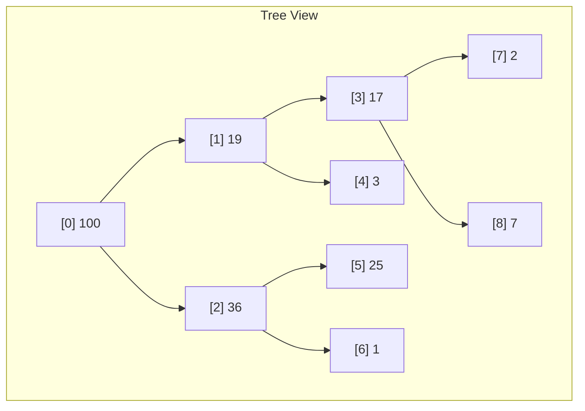
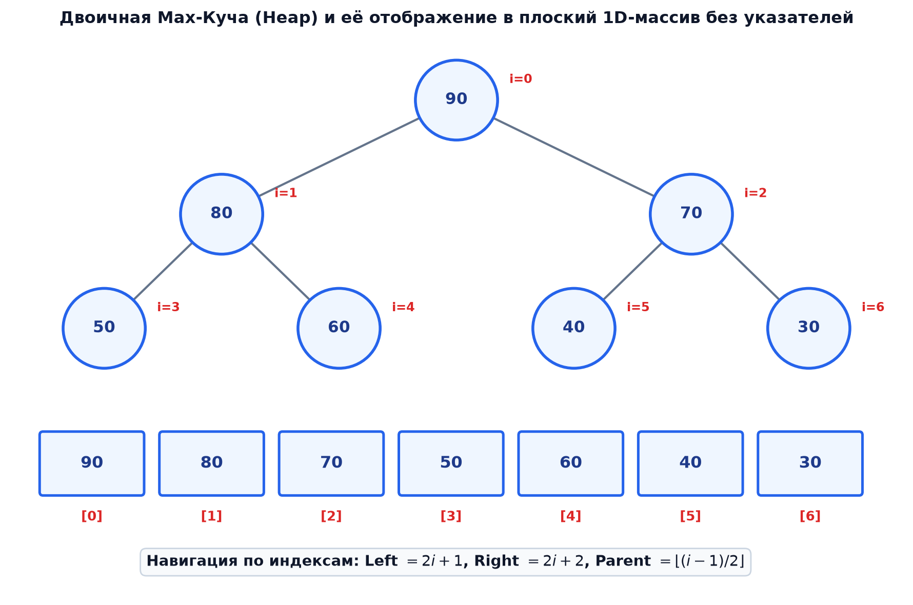
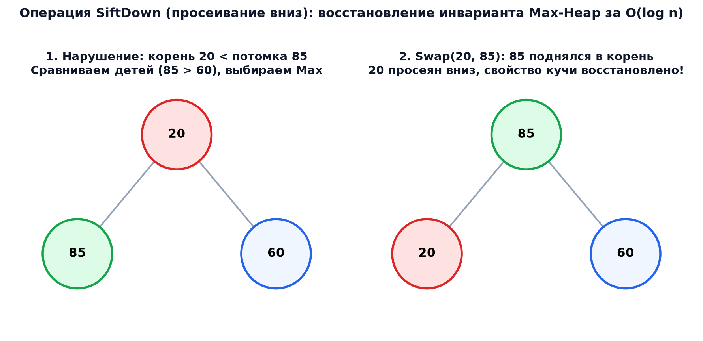

# 📌 Лекция 4: Двоичная куча (Binary Heap), пирамидальная сортировка (Heap Sort) и очередь с приоритетом

> [!abstract] О лекции
> - **Дисциплина:** [[Алгоритмы и структуры данных]] (1 семестр)
> - **Преподаватели:** Ткаченко / Лазарев / Пермяков
> - **Ключевые концепции:** Почти полное бинарное дерево, свойство кучи (Max-Heap / Min-Heap), адресация в 0-indexed массиве, операции просеивания вверх (`siftUp`) и вниз (`siftDown`), построение кучи за линейное время `buildHeap` ($O(n)$ доказательство через геометрическую прогрессию), пирамидальная сортировка `Heap Sort` ($O(n \log n)$ in-place), абстрактный тип данных Очередь с приоритетом (`std::priority_queue`).

---

## 1. Структура данных Двоичная куча (Binary Heap)

Двоичная куча — это структура данных, представляющая собой почти полное бинарное дерево (все уровни заполнены целиком, кроме, возможно, последнего, который заполняется строго слева направо), удовлетворяющее **основному свойству кучи**:

> [!info] Свойство Max-Heap
> Для каждого узла $i$, отличного от корня:
> $$\text{parent}(i) \ge \text{key}(i)$$
> В корне кучи всегда гарантированно находится глобальный максимум всего множества элементов!

### Представление в массиве (0-индексация)
Благодаря полноте дерева, куча компактно размещается в обычном одномерном массиве без накладных расходов на указатели:
Для узла с индексом $i$:
- **Родитель (Parent):** $\operatorname{parent}(i) = \lfloor (i - 1) / 2 \rfloor$
- **Левый потомок (Left Child):** $\operatorname{left}(i) = 2i + 1$
- **Правый потомок (Right Child):** $\operatorname{right}(i) = 2i + 2$





---

## 2. Базовые операции: `siftUp` и `siftDown`

### 1. Просеивание вверх (`siftUp`)
Применяется при добавлении нового элемента в конец массива. Если новый элемент больше своего родителя, он всплывает наверх с помощью серии обменов (`swap`):
$$T(n) = O(h) = O(\log n)$$

```cpp
void siftUp(std::vector<int>& heap, int i) {
    while (i > 0) {
        int parent = (i - 1) / 2;
        if (heap[i] <= heap[parent]) break;
        std::swap(heap[i], heap[parent]);
        i = parent;
    }
}
```

### 2. Просеивание вниз (`siftDown`)
Применяется при извлечении максимума (корень заменяется последним элементом). Нарушенный элемент погружается вниз, меняясь местами с **наибольшим из своих потомков**:
$$T(n) = O(h) = O(\log n)$$



```cpp
void siftDown(std::vector<int>& heap, int n, int i) {
    while (2 * i + 1 < n) {
        int left = 2 * i + 1;
        int right = 2 * i + 2;
        int largest = i;

        if (left < n && heap[left] > heap[largest]) largest = left;
        if (right < n && heap[right] > heap[largest]) largest = right;

        if (largest == i) break;
        std::swap(heap[i], heap[largest]);
        i = largest;
    }
}
```

---

## 3. Построение кучи за линейное время `buildHeap` за $O(n)$

Наивное построение через $n$ вызовов `insert` (`siftUp`) работает за $O(n \log n)$.
Однако алгоритм Флойда `buildHeap` строит кучу за строго линейное время $O(n)$:
- Заметим, что все элементы во второй половине массива ($\lfloor n/2 \rfloor \dots n-1$) являются листьями дерева и уже тривиально образуют корректные кучи размера 1.
- Мы итерируемся от $\lfloor n/2 \rfloor - 1$ назад к $0$ и вызываем `siftDown`:

```cpp
void buildHeap(std::vector<int>& arr) {
    int n = arr.size();
    for (int i = n / 2 - 1; i >= 0; --i) {
        siftDown(arr, n, i);
    }
}
```

### Строгое математическое доказательство оценки $O(n)$
В почти полном бинарном дереве высоты $h = \lfloor \log_2 n \rfloor$:
- Узлов на высоте $k$ от листьев не более $\lceil n / 2^{k+1} \rceil$.
- Стоимость вызова `siftDown` для узла на высоте $k$ составляет $O(k)$.
Суммарное время работы:
$$T(n) = \sum_{k=1}^h \left\lceil \frac{n}{2^{k+1}} \right\rceil O(k) \le O(n) \cdot \sum_{k=1}^\infty \frac{k}{2^k}$$
Ряд $\sum_{k=1}^\infty k x^k$ для $x = 1/2$:
$$\sum_{k=1}^\infty k x^k = x \frac{d}{dx} \left(\sum_{k=0}^\infty x^k\right) = x \frac{d}{dx}\left(\frac{1}{1-x}\right) = \frac{x}{(1-x)^2}$$
При $x = 1/2$:
$$\frac{1/2}{(1 - 1/2)^2} = \frac{1/2}{1/4} = 2$$
Следовательно:
$$T(n) \le O(n) \times 2 = O(n) \quad \blacksquare$$

---

## 4. Пирамидальная сортировка (Heap Sort)

1. Превращаем исходный массив в Max-Heap вызовом `buildHeap`: $O(n)$.
2. Для каждого $i$ от $n-1$ до $1$:
   - Меняем местами корень (максимум) `arr[0]` и последний элемент текущей кучи `arr[i]`.
   - Уменьшаем размер рассматриваемой кучи на 1.
   - Вызываем `siftDown(arr, i, 0)`: $O(\log n)$.

```cpp
void heapSort(std::vector<int>& arr) {
    int n = arr.size();
    buildHeap(arr);
    for (int i = n - 1; i > 0; --i) {
        std::swap(arr[0], arr[i]);
        siftDown(arr, i, 0);
    }
}
```

### Свойства Heap Sort:
- **Время:** $O(n \log n)$ в лучшем, среднем и худшем случаях!
- **Память:** $O(1)$ дополнительной памяти (**in-place** сортировка!).
- **Устойчивость:** ❌ Неустойчива (меняет местами далекие элементы через корень).

---

## 5. Очередь с приоритетом (Priority Queue)

Абстрактный тип данных, поддерживающий операции:
1. `push(x)` / `insert(x)` — добавление элемента за $O(\log n)$.
2. `top()` / `max()` — просмотр максимального элемента за $O(1)$.
3. `pop()` / `extractMax()` — удаление максимума за $O(\log n)$.

В стандартной библиотеке C++ реализована в заголовке `<queue>`:
```cpp
#include <queue>
std::priority_queue<int> max_pq; // По умолчанию Max-Heap
std::priority_queue<int, std::vector<int>, std::greater<int>> min_pq; // Min-Heap
```

---

## 4. 🔬 Аналитическое доказательство $O(n)$ и сравнительный анализ очередей

### Строгий вывод суммы ряда построения кучи методом Флойда
Число вершин на высоте $h$ не превосходит $\lceil n/2^{h+1} \rceil$. Время построения:
$$T(n) \le \frac{n}{2} \sum_{h=1}^\infty h \left(\frac{1}{2}\right)^h$$
Рассматривая производную суммы геометрической прогрессии:
$$f(x) = \sum_{h=0}^\infty x^h = \frac{1}{1 - x} \implies f'(x) = \sum_{h=1}^\infty h x^{h-1} = \frac{1}{(1 - x)^2}$$
Умножая на $x$:
$$S(x) = \sum_{h=1}^\infty h x^h = \frac{x}{(1 - x)^2} \implies S\left(\frac{1}{2}\right) = \frac{1/2}{(1/2)^2} = 2$$
Следовательно: $T(n) \le \frac{n}{2} \cdot 2 = n = \Theta(n)$!

---

### Сравнительный теоретический анализ очередей с приоритетом

| Структура | `find-min` | `insert` | `delete-min` | `decrease-key` |
| :--- | :---: | :---: | :---: | :---: |
| **Binary Heap** | $\Theta(1)$ | $O(\log n)$ | $O(\log n)$ | $O(\log n)$ |
| **$d$-ary Heap ($d=4$)** | $\Theta(1)$ | $O(\log_4 n)$ | $O(4 \log_4 n)$ | $O(\log_4 n)$ |
| **Fibonacci Heap** | $\Theta(1)$ | $\Theta(1)$ | $O(\log n)$ аморт. | $\mathbf{\Theta(1)}$ **аморт.** |

> [!note] Оптимальность $d=4$ для современных CPU
> При $d = 4$ дочерние узлы вершины занимают $4 \times 8 = 32$ байта, идеально помещаясь в **одну 64-байтную строку кэша L1**, что минимизирует кэш-промахи при просеивании вверх.

---

## 🚀 Фундаментальная связь с будущими дисциплинами и технологиями (ИТМО Curriculum)

1. **Операционные системы (Сем 4):**
   - Планировщик Completely Fair Scheduler (CFS) в Linux управляет очередью задач через красно-черные деревья и иерархические таймерные колеса (Timing Wheels) со свойствами очередей с приоритетом.
2. **Алгоритмы на графах (Сем 2):**
   - Алгоритм Дейкстры с Фибоначчиевой кучей достигает исторического оптимума сложности $O(|E| + |V| \log |V|)$ благодаря $O(1)$ на `decrease-key`.

---

## 🔗 Связанные материалы
- [[Алгоритмы и структуры данных]] — страница дисциплины
- [[2026-09-12 - АиСД - Лекция 1, сложность алгоритмов, O-символика и сортировка вставками]]
- [[2026-09-12 - АиСД - Лекция 3, Сортировка слиянием (Merge Sort), Быстрая сортировка (Quick Sort) и анализ рекурсии]]
- [[2026-09-12 - АиСД - Теорминимум и банк вопросов коллоквиума I семестра]]
