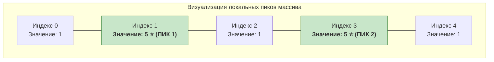

# ⚡ АиСД • Практика 0: Трассировка кода на C++, пошаговый анализ и разбор задачи «Локальные пики спроса»

> [!abstract] О занятии
> - **Дисциплина:** Алгоритмы и структуры данных (АиСД, 1 семестр)
> - **Формат:** Практикум по ручной трассировке и подготовке к защите лабораторных
> - **Группа:** G (преподаватель практики — Анастасия Забашта, ауд. 2414)
> - **Тестирующая платформа:** `sort-me.org` (Лабораторная 0, Задача C)
> - **Ключевые темы:** Методология трассировки кода («быть процессором»), ведение таблиц состояний переменных, корректные границы циклов при проверке соседей ($i \in [1, n-2]$), предотвращение выхода за границы массива (Out of Bounds), пошаговый разбор задачи «Локальные пики спроса», разбор частых багов и чек-лист для устной защиты.

---

## 1. 🔍 Что такое трассировка кода и зачем она нужна?

> [!important] Определение
> **Трассировка кода (Code Tracing)** — это ручное пошаговое выполнение инструкций программы человеком, при котором анализируется изменение значений всех переменных и условий ветвления на каждом шаге тактовки, как если бы вы сами были процессором (CPU).

### Зачем трассировать код вручную, если есть Debugger?
1. **Устная защита лабораторных:**
   На очной защите в ИТМО преподаватель не просто смотрит на зеленый вердикт `Accepted` на Sort-me. Преподаватель открывает ваш исходный код, тыкает пальцем в строку:
   *«Что находится в переменной `i` и в `mas[i-1]` на 3-й итерации при входном массиве `[1, 5, 1, 5, 1]`? Почему вы написали `i < n - 1`, а не `i < n`? Что произойдет при $n=2$?»*.
   Умение мгновенно провести трассировку в уме или на бумаге — это 100% залог успешной защиты.
2. **Поиск коварных багов на скрытых тестах:**
   Когда Sort-me возвращает `Wrong Answer` на тесте 14 или `Runtime Error` на тесте 7, вы не видите входных данных. Единственный способ найти ошибку — нарисовать таблицу трассировки для граничных случаев ($n=0, 1, 2$, одинаковые элементы, отсортированный массив).

---

## 2. 📝 Разбор задачи C: «Локальные пики спроса» (Лаба 0)

### Условие задачи
В аналитический отдел маркетплейса поступают почасовые данные о количестве заказов за сутки. Дан массив $a$ из $n$ целых положительных чисел ($a_0, a_1, \dots, a_{n-1}$).
Необходимо определить количество **локальных пиков спроса**.

**Локальным пиком** называется элемент массива, который:
1. Имеет обоих соседей — и левого, и правого (то есть элемент **не является первым** ($i > 0$) и **не является последним** ($i < n - 1$));
2. **Строго больше** соседа слева: $a_i > a_{i-1}$;
3. **Строго больше** соседа справа: $a_i > a_{i+1}$.

### Примеры из условия
- **Пример 1:**
  - Вход: `n = 5`, массив `1 2 3 4 5`
  - Выход: `0`
  - *Пояснение:* Массив монотонно возрастает. Последний элемент 5 больше соседа 4, но у него нет правого соседа (крайний элемент). Пиков нет.
- **Пример 2:**
  - Вход: `n = 5`, массив `1 5 1 5 1`
  - Выход: `2`
  - *Пояснение:* На индексе $1$ элемент $5 > 1$ и $5 > 1$ (первый пик). На индексе $3$ элемент $5 > 1$ и $5 > 1$ (второй пик). Итого 2 пика.

---

## 3. 💻 Исходный код решения на C++

```cpp
#include <iostream>
#include <vector>

int main() {
    // Ускорение стандартных потоков I/O для Sort-me
    std::ios::sync_with_stdio(false);
    std::cin.tie(nullptr);

    int n;
    if (!(std::cin >> n)) {
        return 0;
    }

    // Для n <= 2 локальных пиков существовать не может
    if (n <= 2) {
        std::cout << 0 << '\n';
        return 0;
    }

    std::vector<int> a(n);
    for (int i = 0; i < n; ++i) {
        std::cin >> a[i];
    }

    int peak_count = 0;

    // ВАЖНО: цикл идет строго от 1 до n - 2 включительно!
    for (int i = 1; i < n - 1; ++i) {
        if (a[i] > a[i - 1] && a[i] > a[i + 1]) {
            ++peak_count;
        }
    }

    std::cout << peak_count << '\n';

    return 0;
}
```

---

## 4. ⚠️ Границы цикла: почему строго `i = 1` и `i < n - 1`?

Это самый частый вопрос практиков на защите!

```
Индексы массива:   0     1     2    ...    n-2    n-1
Элементы:        a[0]  a[1]  a[2]         a[n-2] a[n-1]
                  ▲                               ▲
                  │                               │
            Крайний левый                   Крайний правый
            (нет соседа слева)              (нет соседа справа)
```

1. **Почему `i` начинается с 1, а не с 0?**
   - Если начать с `i = 0`, выражение `a[i - 1]` превратится в `a[-1]`.
   - В C++ обращение к отрицательному индексу массива — это **Undefined Behavior (UB)** и выход за границы выделенной памяти. Программа может выдать случайный мусор или упасть с `Segmentation Fault / Runtime Error (RE)`.
2. **Почему условие `i < n - 1`, а не `i < n`?**
   - Если условие будет `i < n`, то на последней итерации переменная `i` примет значение `n - 1`.
   - Тогда выражение `a[i + 1]` обратится к `a[n]`.
   - Поскольку массив имеет размер $n$, допустимые индексы лежат в диапазоне $[0, n-1]$. Обращение к `a[n]` — это опять выход за границы памяти (**Out of Bounds**) и гарантированный `RE`!
3. **Безопасный диапазон проверки:**
   - Переменная $i$ пробегает значения от $1$ до $n - 2$ включительно.
   - Для каждого такого $i$ левый сосед $i - 1 \ge 0$, а правый сосед $i + 1 \le n - 1$. Обе границы полностью безопасны!

---

## 5. 📊 Полная пошаговая трассировка на тесте `n = 5`, массив `1 5 1 5 1`

### Шаг 1: Инициализация и считывание
- `cin >> n` $\implies n = 5$.
- Создан вектор `a` размера 5.
- Вектор заполнен: `a[0] = 1, a[1] = 5, a[2] = 1, a[3] = 5, a[4] = 1`.
- Переменная `peak_count = 0`.

### Шаг 2: Выполнение цикла поиска пиков
Границы цикла: `i` от $1$ до $n - 2 = 3$ (условие `i < 4`).

| Итерация | $i$ | $i < 4$ | $a[i-1]$ | $a[i]$ | $a[i+1]$ | $a[i] > a[i-1]$ | $a[i] > a[i+1]$ | Условие `&&` | Действие | `peak_count` |
| :---: | :---: | :---: | :---: | :---: | :---: | :---: | :---: | :---: | :--- | :---: |
| **1** | **1** | `true` | $a[0] = 1$ | **$a[1] = 5$** | $a[2] = 1$ | $5 > 1$ (`true`) | $5 > 1$ (`true`) | `true` | `++peak_count` | **1** |
| **2** | **2** | `true` | $a[1] = 5$ | **$a[2] = 1$** | $a[3] = 5$ | $1 > 5$ (`false`) | *(не вычисляется)* | `false` | пропуск | **1** |
| **3** | **3** | `true` | $a[2] = 1$ | **$a[3] = 5$** | $a[4] = 1$ | $5 > 1$ (`true`) | $5 > 1$ (`true`) | `true` | `++peak_count` | **2** |
| **—** | **4** | `false` | — | — | — | — | — | — | **Выход из цикла** | **2** |

> [!note] Short-circuit evaluation в логическом `&&`
> На итерации 2 ($i = 2$): так как левое выражение $1 > 5$ ложно (`false`), правое выражение $a[i] > a[i+1]$ процессором **даже не вычисляется** благодаря ленивому вычислению логических связок в C++!

### Шаг 3: Вывод результата
`std::cout << peak_count << '
';` выводит число **`2`**.
Результат совпадает с эталонным ответом. ✅



---

## 6. 🧪 Проверка на втором тесте: `n = 5`, массив `1 2 3 4 5`

Трассировка цикла (`peak_count = 0`):

| $i$ | $a[i-1]$ | $a[i]$ | $a[i+1]$ | $a[i] > a[i-1]$ | $a[i] > a[i+1]$ | Итог `if` | `peak_count` |
| :---: | :---: | :---: | :---: | :---: | :---: | :---: | :---: |
| 1 | 1 | 2 | 3 | $2 > 1$ (`true`) | $2 > 3$ (`false`) | `false` | 0 |
| 2 | 2 | 3 | 4 | $3 > 2$ (`true`) | $3 > 4$ (`false`) | `false` | 0 |
| 3 | 3 | 4 | 5 | $4 > 3$ (`true`) | $4 > 5$ (`false`) | `false` | 0 |

Выход при $i = 4$. Итог: `0`.
Каждый внутренний элемент меньше своего правого соседа, поэтому пиков нет. Ответ верный ✅.

---

## 7. 🛡️ Анализ граничных случаев (Edge Cases)

Для сдачи на полный балл необходимо продемонстрировать понимание поведения программы на экстремальных тестах:

| Граничный тест | Входные данные | Ожидаемый ответ | Поведение программы |
| :--- | :--- | :---: | :--- |
| **Минимальный массив** | `n = 1`, `[10]` | `0` | Срабатывает проверка `if (n <= 2)`, выводится 0 без обращения к циклу. |
| **Два элемента** | `n = 2`, `[10, 20]` | `0` | Внутренних элементов нет. Срабатывает `if (n <= 2)` $\implies 0$. |
| **Все элементы равны** | `n = 4`, `[5, 5, 5, 5]` | `0` | Условие строгое: $5 > 5$ ложно. Пиков нет. |
| **Плантообразный пик** | `n = 4`, `[1, 5, 5, 1]` | `0` | Плато не является пиком, так как вершина должна быть строго больше обоих соседей. |
| **V-образный массив** | `n = 5`, `[5, 2, 1, 3, 7]` | `0` | Локальная яма (минимум), но нет локальных максимумов. |
| **Большие числа** | $a_i = 10^9$ | — | Числа помещаются в стандартный 32-битный знаковый `int` (до $2 \times 10^9$). Переполнения нет. |

---

## 8. 🚨 Каталог типичных багов новичков на Sort-me

1. **Неинициализированный счётчик:**
   ```cpp
   int peak_count; // ОШИБКА: в стеке лежит случайный мусор (например, -858993460)!
   ```
   *Следствие:* `Wrong Answer (WA)` даже при абсолютно правильной логике цикла. Всегда пишите `int peak_count = 0;`.
2. **Цикл до `i < n`:**
   ```cpp
   for (int i = 1; i < n; ++i) // ОШИБКА: при i = n-1 читается a[n]!
   ```
   *Следствие:* `Runtime Error (RE)` или `WA` из-за сравнения с мусором за пределами массива.
3. **Нестрогое неравенство:**
   ```cpp
   if (a[i] >= a[i - 1] && a[i] >= a[i + 1]) // ОШИБКА: плато посчитается за пик!
   ```
   *Следствие:* `WA` на тестах с одинаковыми числами (`[3, 3, 3]`).
4. **Лишние фразы в консоли:**
   ```cpp
   std::cout << "Введите размер массива: "; // ОШИБКА для Sort-me!
   ```
   *Следствие:* Тестирующая система сверяет поток вывода посимвольно. Любой лишний символ приводит к `Wrong Answer` или `Presentation Error`.

---

## 9. 📋 Чек-лист для устной защиты задачи перед практиком

- [ ] Могу объяснить каждую строчку кода программы от `#include` до `return 0`.
- [ ] Могу назвать временную сложность: $O(n)$, так как массив обходится за один линейный проход.
- [ ] Могу назвать пространственную сложность: $O(n)$ для сохранения массива (или $O(1)$ при решении «на лету» с хранением 3 переменных).
- [ ] Понимаю, почему цикл идет от $1$ до $n-2$ и что произойдет при изменении границ.
- [ ] Могу нарисовать трассировочную таблицу на доске для любого массива из 4-5 элементов.
- [ ] Знаю, что такое short-circuit evaluation в операторе `&&`.
- [ ] Могу модифицировать код на лету под задачу «посчитать количество локальных минимумов» (заменить `>` на `<`).

---

> [!abstract] Навигация
> ⚡ [[Алгоритмы и структуры данных|Хаб предмета АиСД]] • 📚 [[2026-09-12 - АиСД - Лекция 1, сложность алгоритмов, O-символика и сортировка вставками|Лекция 1: Асимптотика и сортировка вставками]] • 🏠 [[🏠 Главная]]
