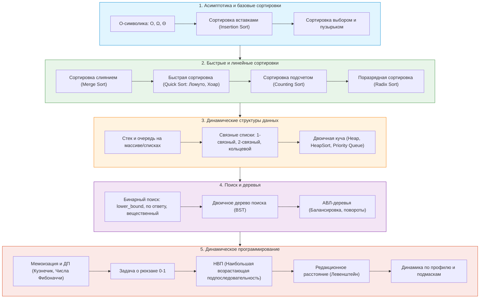

# ⚡ Алгоритмы и структуры данных (АиСД • 1 семестр)

> [!abstract] О предмете
> Фундаментальный практический курс по алгоритмизации и структурам данных на C++ в Университете ИТМО (4 з.е. / 144 акад. часа).
> Курс учит проектировать эффективные алгоритмы, строго доказывать их корректность, оценивать временную и пространственную сложность ($O, \Omega, \Theta$) и реализовывать низкоуровневые структуры данных с нуля.
> 
> 🔗 **Официальное пространство курса:** [Yonote: ITMO DM & AISD Space](https://dm-aisd.yonote.ru/share/itmo_dm_aisd)  
> 🧪 **Тестирующая платформа лаб:** [sort-me.org](https://sort-me.org) *(регистрация через Telegram из чата ИС)*

---

## 👥 Информация для группы G

> [!important] Расписание группы G
> - **Практические занятия:** **Суббота, 13:30 – 15:00**
> - **Аудитория:** **2414** (Кронверкский пр., 49)
> - **Преподаватель практики:** **Забашта Анастасия**
> 
> **Сетка лекций курса (по потокам):**
> - **1 поток:** Суббота, 09:50–11:20, ауд. 2342 — лектор Ткаченко Д. М.
> - **2 поток:** Суббота, 11:30–13:00, ауд. 2342 — лектор Ткаченко Д. М.
> - **3 поток:** Вторник, 11:30–13:00, ауд. 1229 — лектор Пермяков А. С.
> - **4 поток:** Суббота, 13:30–15:00, ауд. 2342 — лектор Лазарев А. А.
> - **5 поток:** Среда, 11:30–13:00, ауд. 1229 — лектор Пермяков А. С.

---

## ⚖️ Регламент оценивания и баллы БАРС (100 семестровых баллов)

> [!warning] КРИТИЧЕСКОЕ ПРАВИЛО КУРСА
> **Оценки «4» (Хорошо) и «5» (Отлично) зарабатываются ИСКЛЮЧИТЕЛЬНО работой в семестре!**
> Экзамен в сессию предназначен **только для закрытия курса на оценку «3» (Удовлетворительно, макс. 60 баллов / 3E)** для студентов с 40–59 баллами. Получить 4 или 5 на экзамене невозможно.

| Элемент контроля | Баллы БАРС | Формат и условия | Формула пересчета |
| :--- | :---: | :--- | :--- |
| 🧪 **Лабораторные работы** | **54** | Задачи на `sort-me.org` (дедлайн 2 недели) + **очная устная защита** кодовой базы практику. Запрет STL-контейнеров/алгоритмов. | $\text{Баллы} = 54 \times \frac{S}{N}$, где $N$ — число базовых задач семестра, $S$ — набранные первичные баллы. |
| 📝 **Письменные тесты** | **18** | 6–7 тестов по пройденным темам. 5 открытых теоретических вопросов на 20 минут в начале пары на листочках + устная защита. | $\text{Баллы} = 18 \times \frac{S}{K}$, где $K = 5N$ — максимум баллов за все тесты. |
| 🗣️ **Командный коллоквиум** | **10** | Очно в 1-й половине семестра (ноябрь). Команды по 4–6 человек. Преподаватель опрашивает команду по очереди с любого места алгоритма. | Все участники команды получают единый балл (до 10). |
| 🧠 **Коллоквиум: Теорминимум** | **10** | Персональный опрос в конце семестра (декабрь). 10 случайных вопросов из банка 100 вопросов по всему семестру. | **Порог сдачи: 7 баллов** (3–5 потоки) / **8 баллов** (1–2 потоки). |
| 💻 **Live Coding** | **8** | Дистанционный контест на 1 час на `sort-me.org` после коллоквиума (выбор сложной до 5 б. или простой до 3 б.) + очная защита. | До 8 баллов суммарно. |
| 🎯 **ИТОГО В СЕМЕСТРЕ** | **100** | **Полный максимум без экзамена!** | Полноценный автомат на любую оценку. |

### 🚨 Правило Теорминимума (Отсечка)
- Если студент **не преодолел порог теорминимума** (после 2 попыток: основной и пересдачи своему практику), его итоговый балл за семестр **блокируется на отметке не более 59 баллов**, и он отправляется на **дополнительную сессию (допсу)** вне зависимости от того, сколько баллов за лабы и тесты у него набрано!

### 📊 Шкала итоговых оценок

| Баллы БАРС | Буквенная оценка | Традиционная оценка | Примечание |
| :---: | :---: | :---: | :--- |
| **91 – 100** | **5A** | **Отлично** | Строго сдан теормин. Только за семестр! |
| **84 – 90** | **4B** | **Хорошо** | Строго сдан теормин. Только за семестр! |
| **74.1 – 83** | **4C** | **Хорошо** | Строго сдан теормин. Только за семестр! |
| **68 – 74** | **3D** | **Удовлетворительно** | Строго сдан теормин. Автомат без экзамена. |
| **60 – 67** | **3E** | **Удовлетворительно** | Строго сдан теормин. Автомат без экзамена. |
| **40 – 59** | **2FX-E** | **Допуск к экзамену «на тройку»** | При сданном теормине — сдача экзамена в сессию максимум до 60 баллов (3E). |
| **0 – 39** | **2FX** | **Неудовлетворительно** | Прямой выход на дополнительную сессию. |

---

## 🛡️ Правила сдачи лабораторных и Бан-Машина

### 1. Жизненный цикл задачи
$$\text{Условие} \longrightarrow \text{Идея} \longrightarrow \text{Код} \longrightarrow \text{Локальные тесты} \longrightarrow \text{Отладка} \longrightarrow \text{Отправка в Sort-me} \longrightarrow \text{Устная защита}$$

### 2. Запрет на готовые библиотеки
- В лабораторной на сортировки **категорически запрещен** `std::sort`, `std::stable_sort`, `qsort`.
- В лабораторной на стек/очередь **запрещены** `std::stack`, `std::queue`, `std::deque`, `std::list`.
- Все базовые алгоритмы и структуры данных пишутся **самостоятельно с нуля**.

### 3. Двусторонняя Бан-Машина
- В системе работает автоматический антиплагиат исходных кодов.
- При обнаружении списанного решения или передачи кода другому студенту **наступает двусторонний бан**: баллы за всю лабораторную аннулируются **и у того, кто списал, и у того, кто дал списать**.
- **Правило гигиены:** Все персональные Git-репозитории с решениями должны быть **строго приватными**. Не оставляйте ноутбук разблокированным в коворкингах.

### 4. Регламент устной защиты
- Получение вердикта `Accepted` в тестирующей системе — лишь необходимое условие допуска к защите.
- На очной защите преподаватель проверяет:
  1. Понимание алгоритма и его пошаговой работы.
  2. Теоретическую оценку сложности по времени и по памяти ($O, \Omega, \Theta$).
  3. Назначение каждой переменной, структуры и строки кода.
  4. Поведение программы на граничных тестах (пустой ввод, $n=1$, максимальные ограничения, переполнение типов).
  5. Способность модифицировать решение «на лету» под измененные требования.

---

## ⚙️ Тестирующая платформа Sort-me.org

### Вердикты тестирующей системы
- **Полное решение (Accepted / AC):** Все тесты успешно пройдены в рамках лимитов.
- **Неправильный ответ (Wrong Answer / WA):** Неверный вывод на одном из скрытых тестов.
- **Превышено время (Time Limit Exceeded / TL):** Неоптимальная асимптотика, бесконечный цикл или медленный ввод/вывод.
- **Превышена память (Memory Limit Exceeded / ML):** Слишком большие статические/динамические массивы, утечка памяти или глубокая рекурсия.
- **Ошибка выполнения (Runtime Error / RE):** Выход за границы массива, деление на ноль, разыменование nullptr/висячего указателя, переполнение стека (Stack Overflow).
- **Ошибка компиляции (Compilation Error / CE):** Синтаксическая ошибка или неверно выбранный компилятор.
- **Неправильный формат вывода (Presentation Error / PE):** Лишние пробелы, пропущенный перевод строки `\n`, вывод отладочных сообщений (`"Enter N:"`).

### 🚀 Трюки ускорения C++ I/O для Sort-me
```cpp
#include <iostream>

int main() {
    // Отключение синхронизации C++ потоков с C stdio и отвязка cin от cout
    std::ios::sync_with_stdio(false);
    std::cin.tie(nullptr);

    // ВАЖНО: Вместо std::endl использовать '\n'
    // std::endl принудительно вызывает flush буфера, что приводит к TLE на больших данных!
    return 0;
}
```

---

## 🗺️ Карта тем курса (1 семестр)



---

## 📝 Список конспектов и материалов по занятиям

| № | Дата | Тип | Тема занятия | Конспект |
| :---: | :---: | :---: | :--- | :---: |
| 0 | `2026-09-06` | Гайд | **Введение, регламент, платформа Sort-me.org, асимптотический анализ и базовый C++** | [Открыть ↗](./2026-09-06%20-%20АиСД%20-%20Введение,%20регламент,%20Sort-me%20и%20базовый%20C++.md) |

---

## 📚 Рекомендуемая литература

1. **Кормен Т., Лейзерсон Ч., Ривест Р., Штайн К.** — *«Алгоритмы: построение и анализ»* (CLRS, 3-е / 4-е изд.) ⭐ **Главная библия курса**
2. **Скиена С.** — *«Алгоритмы. Руководство по разработке»* (практический подход и каталог структур)
3. **Седжвик Р., Уэйн К.** — *«Алгоритмы на C++»*
4. **Лааксонен А.** — *«Олимпиадное программирование»* (Guide to Competitive Programming)
5. **Материалы e-maxx.ru / algo.itmo.ru** — алгоритмическая база Университета ИТМО.

---

> [!abstract] Навигация
> 🏠 [[🏠 Главная]] • 📚 [[README|Каталог 1 семестра]] • 🔢 [[Дискретная математика]]
