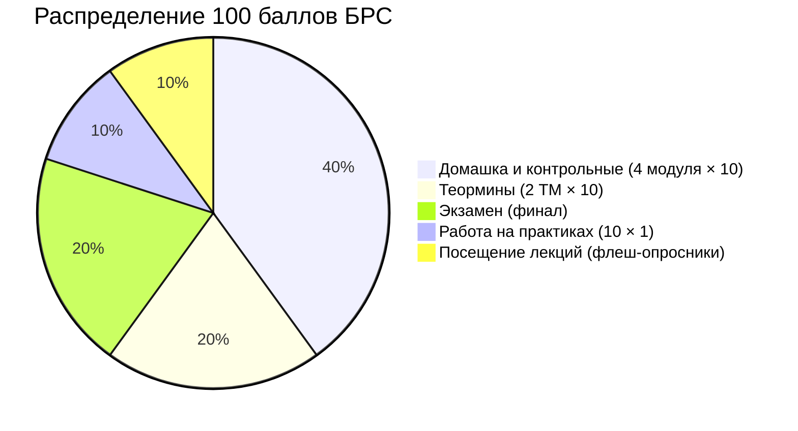
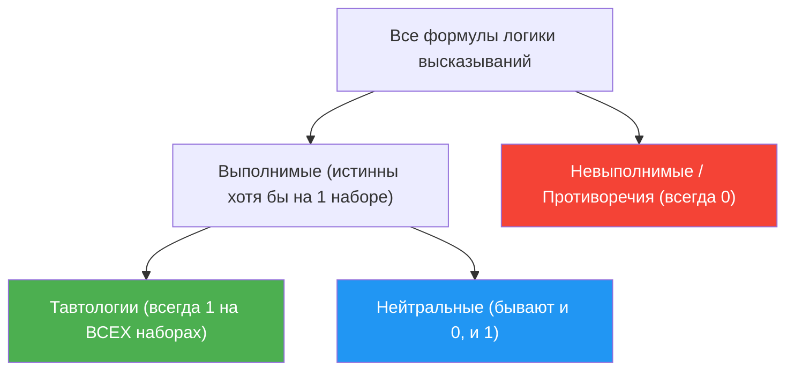

# 📝 Лекция 1: Высказывания, связки, таблицы истинности, законы логики и следствие

> **Дата:** `2026-09-09` (1-я неделя)  
> **Предмет:** Дискретная математика (1 семестр, 2026/27 уч. год)  
> **Преподаватель (лектор):** Константин Чухарев ([@Lipen](https://github.com/Lipen), Университет ИТМО)  
> **Модуль 1:** Множества и бинарные отношения (недели 1–8)  
> **Материалы курса:** [github.com/Lipen/discrete-math-course](https://github.com/Lipen/discrete-math-course) • Книга курса: `book.pdf` • Слайды: `s1-lec01-statements.pdf`

---

## 🧭 Навигация по конспекту
1. [Организация курса и регламент БРС](#организация-курса-и-регламент-брс)
2. [Введение: Зачем программисту математическая логика?](#1-введение-зачем-программисту-математическая-логика)
3. [Мотивирующие головоломки и парадоксы](#2-мотивирующие-головоломки-и-парадоксы)
   - [Головоломка острова рыцарей и лжецов](#21-головоломка-острова-рыцарей-и-лжецов)
   - [Парадокс лжеца и пределы логики](#22-парадокс-лжеца-и-пределы-логики)
   - [Задача о развилке дорог](#23-задача-о-развилке-дорог)
4. [Высказывание: атом рассуждения](#3-высказывание-атом-рассуждения)
5. [Логические связки и их таблицы](#4-логические-связки-и-их-таблицы)
   - [Отрицание (NOT, ¬)](#41-отрицание-not-neg)
   - [Конъюнкция (AND, ∧)](#42-конъюнкция-and-land)
   - [Дизъюнкция (OR, ∨)](#43-дизъюнкция-or-lor)
   - [Импликация (IF...THEN, ⇒): ловушки и вакуумная истинность](#44-импликация-ifthen-rightarrow-ловушки-и-вакуумная-истинность)
   - [Эквивалентность (IFF, ⇔)](#45-эквивалентность-iff-Leftrightarrow)
6. [Синтаксис формул и приоритет операций](#5-синтаксис-формул-и-приоритет-операций)
7. [Семантика, таблицы истинности и классификация формул](#6-семантика-таблицы-истинности-и-классификация-формул)
   - [Интерпретация формулы](#61-интерпретация-формулы)
   - [Классификация: тавтология, противоречие, выполнимость](#62-классификация-тавтология-противоречие-выполнимость)
8. [Логическая эквивалентность и логическое следствие](#7-логическая-эквивалентность-и-логическое-следствие)
   - [Эквивалентность как инструмент переписывания](#71-эквивалентность-как-инструмент-переписывания)
   - [Логическое следствие и правило Modus Ponens](#72-логическое-следствие-и-правило-modus-ponens)
   - [Теорема дедукции](#73-теорема-дедукции)
9. [Законы алгебры высказываний и законы де Моргана](#8-законы-алгебры-высказываний-и-законы-де-моргана)
   - [Свод законов алгебры логики](#81-свод-законов-алгебры-логики)
   - [Законы де Моргана: доказательство и смысл](#82-законы-де-моргана-доказательство-и-смысл)
   - [Пошаговое упрощение формул](#83-пошаговое-упрощение-формул)
10. [Логика в коде программиста](#9-логика-в-коде-программиста)
11. [Строгое формальное решение головоломки](#10-строгое-формальное-решение-головоломки)
12. [📖 Сводная шпаргалка лекции](#-сводная-шпаргалка-лекции)
13. [💡 Примеры и типовые задачи с решениями](#-примеры-и-типовые-задачи-с-решениями)
14. [❓ Вопросы для самопроверки (к флеш-опроснику и теормину)](#-вопросы-для-самопроверки-к-флеш-опроснику-и-теормину)

---

## 📌 Краткое резюме (TL;DR)
1. **Высказывание** — утверждение, принимающее ровно одно значение: истина ($1$) или ложь ($0$).
2. **Связки:** Отрицание $\neg$, конъюнкция $\land$, дизъюнкция $\lor$ (включающая!), импликация $\implies$, эквивалентность $\iff$.
3. **Импликация $P \implies Q$:** ложна **только** когда $P=1, Q=0$. Из лжи следует всё что угодно (**вакуумная истинность**). Отрицание импликации: $\neg(P \implies Q) \equiv P \land \neg Q$ (частая ошибка: путать с $P \implies \neg Q$).
4. **Таблицы истинности:** перебирают все $2^n$ интерпретаций формулы из $n$ переменных.
5. **Классификация формул:** **Тавтология** — истинна всегда ($P \lor \neg P$). **Противоречие** — ложна всегда ($P \land \neg P$). **Выполнимая** — истинна хотя бы на одной интерпретации (такая интерпретация называется **моделью**).
6. **Следствие:** $A_1, \dots, A_n \models B$ означает, что в любой модели посылок заключение $B$ истинно. По **теореме дедукции** это равносильно тавтологичности $(A_1 \land \ldots \land A_n) \implies B$.
7. **Законы де Моргана:** $\neg(P \land Q) \equiv \neg P \lor \neg Q$ и $\neg(P \lor Q) \equiv \neg P \land \neg Q$. Это главный инструмент инверсии сложных условий в коде.

---

## Организация курса и регламент БРС

> [!info] Ключевые параметры курса дискретной математики в ИТМО
> - **Продолжительность:** 2 семестра (144 ак. часа, 4 зачётные единицы).
> - **Семестр 1:** 7 сентября — 27 декабря 2026 года (16 лекций, 10 практик, 4 контрольные работы, 2 теормина).
> - **Преподаватель:** Константин Чухарев ([@Lipen](https://github.com/Lipen)).
> - **Репозиторий:** [Lipen/discrete-math-course](https://github.com/Lipen/discrete-math-course) (содержит книгу `book.pdf`, Typst-исходники, слайды, домашки).

### Структура 100 баллов за семестр



> [!danger] Правило подтверждения баллов: $c = \min(d, x)$
> - За каждый из 4 модулей семестра выдаётся домашнее задание $d$ (до 10 баллов).
> - В конце модуля пишется очная контрольная работа $x$ (до 10 баллов).
> - **В зачёт модуля идёт:**
>   $$c = \min(d, x)$$
> - *Вывод:* нельзя «выехать» только на домашке (без КР баллы сгорают) и нельзя прийти на КР с нулевой домашкой (баллов не будет). Нужно качественно решать ДЗ и подтверждать его в аудитории на КР!

> [!warning] Важные регламентные правила
> 1. **Флеш-опросники:** проводятся в первые 5 минут каждой лекции. Проверяют чтение заданной главы книги и материал прошлой пары. Дают баллы за посещение лекций (до 10 баллов за семестр).
> 2. **ДЗ №1 оформляется СТРОГО от руки** на бумаге, сканируется в один PDF и загружается в Dropbox группы. (За нечитаемый почерк — штраф до $-5$ баллов).
> 3. **Допуск к экзамену:** необходимо набрать $\geq 48$ баллов за семестр, при этом каждый модуль $\geq 4$ баллов и каждый теормин $\geq 4$ баллов.
> 4. **Автомат («хорошо»):** без экзамена максимум практической части равен $80$ баллам (оценка «хорошо»). Чтобы получить **«отлично» ($\geq 90$ баллов)**, сдача экзамена обязательна!
> 5. **Шкала оценок:**
>    - $0 \ldots 59$ — 🔴 Неудовлетворительно (долг)
>    - $60 \ldots 73$ — 🟡 Удовлетворительно
>    - $74 \ldots 89$ — 🟢 Хорошо
>    - $90 \ldots 100$ — 🟣 Отлично

---

## 1. Введение: Зачем программисту математическая логика?

> *«Книга природы написана на языке математики.»*  
> — **Галилео Галилей**

Математическое рассуждение обязано быть **однозначным**, **строгим** и **механически проверяемым**. Обычный разговорный язык для этого непригоден из-за его фатальной двусмысленности.

> [!example] Двусмысленность естественного языка
> Рассмотрим фразу:  
> *«Каждый студент знает хотя бы один язык программирования»*.
> 
> Что она означает?
> 1. $\forall s \in \text{Students} \; \exists \ell \in \text{Langs}: \text{Knows}(s, \ell)$ — у каждого студента есть *свой* язык (один знает C++, другой Python).
> 2. $\exists \ell \in \text{Langs} \; \forall s \in \text{Students}: \text{Knows}(s, \ell)$ — существует *один общий* язык, который знают абсолютно все студенты.
> 
> В разговорной речи эти два совершенно разных утверждения звучат одинаково! Математическая логика делает структуру мысли кристально прозрачной.

### Где логика применяется в Computer Science?

- **Верификация ПО:** математическое доказательство того, что критический код (авиапром, медицина, смарт-контракты) никогда не упадёт и не нарушит инварианты.
- **Теория типов и изоморфизм Карри — Говарда:** доказательства в интуиционистской логике — это в точности программы, а формулы — типы этих программ.
- **Базы данных (SQL):** условия в блоках `WHERE`, `JOIN ... ON` — это в точности логические формулы, которые СУБД оптимизирует по законам логики.
- **Схемотехника и процессоры:** цифровые интегральные схемы строятся из логических вентилей (AND, OR, NOT), вычисляющих булевы функции.
- **SAT-солверы:** автоматические решатели задач выполнимости булевых формул — фундамент современного анализа кода, синтеза схем и планирования.
- **Ассистенты доказательств (Proof Assistants):** современные системы вроде *Lean*, *Coq*, *Isabelle*, позволяющие компьютеру механически проверять математические доказательства.

---

## 2. Мотивирующие головоломки и парадоксы

### 2.1 Головоломка острова рыцарей и лжецов

> [!example] Условие задачи
> На острове живут только **рыцари** (всегда говорят правду) и **лжецы** (всегда лгут).  
> Вы встречаете двух жителей — $A$ и $B$.  
> Житель $A$ произносит фразу: **«Мы оба лжецы»**.  
> *Вопрос:* Кто из них рыцарь, а кто лжец?

Кажется, что нужно перебирать варианты наугад. Но логика высказываний позволяет решить это абсолютно строго за секунды (см. [раздел 10](#10-строгое-формальное-решение-головоломки)).

### 2.2 Парадокс лжеца и пределы логики

> [!danger] Парадокс лжеца
> Рассмотрим классическое высказывание:  
> $$S: \text{«Это утверждение ложно»}$$
> 
> Попробуем приписать ему истинностное значение:
> - Если $S$ истинно, то сказанное в нём правда $\implies S$ должно быть ложным. Противоречие!
> - Если $S$ ложно, то сказанное в нём неправда $\implies S$ не является ложным, то есть истинно. Снова противоречие!

> [!important] Почему это не головоломка, а парадокс?
> Формально утверждение записывается как:
> $$S \Longleftrightarrow \neg S$$
> Формула $S \iff \neg S$ является **тождественно ложной (противоречием)** — у неё не существует ни одной интерпретации!  
> **Самореференция** (ссылка высказывания на само себя) в дальнейшем приведёт Курта Гёделя к его знаменитым теоремам о неполноте, а Алана Тьюринга — к неразрешимости проблемы остановки.

### 2.3 Задача о развилке дорог

> [!example] Задача о проводнике
> Дорога раздваивается: одна ветка ведёт к сокровищу, другая — к гибели. На развилке стоит местный житель (рыцарь или лжец — неизвестно). Вам разрешено задать ему **ровно один вопрос**, требующий ответа «Да» или «Нет».
> 
> **Какой вопрос нужно задать?**

> [!tip] Решение через инверсию лжи
> Вопрос: *«Если я спрошу тебя, ведёт ли левая дорога к сокровищу, ты ответишь "Да"?»*
> 
> **Почему это работает?**
> - Пусть левая дорога действительно ведёт к сокровищу ($L = 1$).
>   - Рыцарь: на прямой вопрос ответил бы «Да», и на наш вопрос честно скажет: **«Да»**.
>   - Лжец: на прямой вопрос солгал бы («Нет»), но на вопрос о том, что он ответит, он солжёт снова (инвертирует ложь) и скажет: **«Да»**!
> - Пусть левая дорога ведёт к гибели ($L = 0$).
>   - Рыцарь скажет: **«Нет»**.
>   - Лжец на прямой вопрос ответил бы «Да», а на наш вопрос солжёт и скажет: **«Нет»**!
> 
> Ответ жителя **всегда совпадает** с истинным положением дел, независимо от того, кто перед нами! Двойное логическое отрицание нейтрализует ложь: $\neg(\neg P) \equiv P$.

---

## 3. Высказывание: атом рассуждения

> [!danger] Определение 1 (Высказывание)
> **Высказывание (statement / proposition)** — это повествовательное утверждение, о котором имеет смысл говорить, что оно либо **истинно** ($1$, $\text{True}$, $\top$), либо **ложно** ($0$, $\text{False}$, $\bot$), но не то и другое одновременно.

Высказывание — это неделимый **атом** логики высказываний. Обычно простые высказывания обозначают заглавными латинскими буквами: $P, Q, R, S, A, B, \ldots$

### Примеры и контрпримеры

| Предложение | Высказывание? | Истинностное значение / Причина |
| :--- | :---: | :--- |
| $2 + 2 = 4$ | ✅ Да | Истинно ($1$) |
| $5 < 3$ | ✅ Да | Ложно ($0$) |
| «Сегодня в Санкт-Петербурге идёт дождь» | ✅ Да | $1$ или $0$ (зависит от факта погоды) |
| «Который сейчас час?» | ❌ Нет | Вопрос (нет истинностного значения) |
| «Закрой за собой дверь!» | ❌ Нет | Команда / побуждение |
| $x + 2 > 10$ | ❌ Нет | Предикат (зависит от переменной $x$; станет высказыванием только после подстановки $x$ или навешивания квантора) |
| «Это предложение ложно» | ❌ Нет | Парадокс (самореференция нарушает двузначность) |

---

## 4. Логические связки и их таблицы

Из атомарных высказываний с помощью **логических связок (connectives)** строятся сложные составные высказывания (логические формулы).

### 4.1 Отрицание (NOT, $\neg$)

> [!danger] Определение (Отрицание)
> Отрицание высказывания $P$ (обозначается $\neg P$ или $\sim P$) истинно тогда и только тогда, когда $P$ ложно.

| $P$ | $\neg P$ |
| :---: | :---: |
| $0$ | $1$ |
| $1$ | $0$ |

### 4.2 Конъюнкция (AND, $\land$)

> [!danger] Определение (Конъюнкция)
> Конъюнкция $P \land Q$ истинна тогда и только тогда, когда **оба** высказывания $P$ и $Q$ истинны. Достаточно хотя бы одной лжи, чтобы вся конъюнкция стала ложной.

| $P$ | $Q$ | $P \land Q$ |
| :---: | :---: | :---: |
| $0$ | $0$ | $0$ |
| $0$ | $1$ | $0$ |
| $1$ | $0$ | $0$ |
| $1$ | $1$ | **1** |

### 4.3 Дизъюнкция (OR, $\lor$)

> [!danger] Определение (Дизъюнкция)
> Дизъюнкция $P \lor Q$ истинна тогда и только тогда, когда **хотя бы одно** из высказываний $P$ или $Q$ истинно.

| $P$ | $Q$ | $P \lor Q$ |
| :---: | :---: | :---: |
| $0$ | $0$ | $0$ |
| $0$ | $1$ | **1** |
| $1$ | $0$ | **1** |
| $1$ | $1$ | **1** |

> [!warning] Включающее «ИЛИ» vs Исключающее «XOR»
> В математической логике связка $\lor$ **всегда включающая**: если истинны и $P$, и $Q$, то $P \lor Q$ истинно!  
> В бытовой речи фраза «чай или кофе» часто означает строгий выбор одного из двух — это исключающее ИЛИ ($\oplus$, $\text{XOR}$). В классической логике по умолчанию используется только включающая дизъюнкция.

---

### 4.4 Импликация (IF...THEN, $\implies$): ловушки и вакуумная истинность

> [!danger] Определение (Импликация)
> Импликация $P \implies Q$ («если $P$, то $Q$») ложна **в единственном случае**: когда посылка (антецедент) $P$ истинна, а следствие (консеквент) $Q$ ложно. Во всех остальных трёх случаях импликация истинна.

| $P$ (посылка / антецедент) | $Q$ (следствие / консеквент) | $P \implies Q$ |
| :---: | :---: | :---: |
| $0$ | $0$ | **1** |
| $0$ | $1$ | **1** |
| $1$ | $0$ | **0** |
| $1$ | $1$ | **1** |

#### Вакуумная истинность (Vacuous Truth)
Если посылка $P$ ложна ($P = 0$), импликация $P \implies Q$ **автоматически истинна** независимо от содержания $Q$:
- *«Из лжи следует всё что угодно»* (лат. *Ex falso sequitur quodlibet*).
- **Житейская аналогия:** преподаватель пообещал: *«Если ты сдашь контрольную на 10, я поставлю тебе зачёт автоматом»*. Если студент **не** сдал контрольную на 10, нарушил ли преподаватель своё обещание? **Нет, не нарушил!** Обещание не было нарушено, поэтому высказывание истинно.
- Утверждение: *«Если $2 + 2 = 5$, то Луна сделана из зелёного сыра»* — математически абсолютно **истинно**!

> [!danger] Фатальная ловушка студентов: Отрицание импликации!
> Чему равно отрицание фразы: *«Если пойдёт дождь, я останусь дома»*?
> - ❌ **Неверно:** *«Если пойдёт дождь, я НЕ останусь дома»* ($P \implies \neg Q$).
> - ✅ **Математически строго:** *«Пошёл дождь, НО я НЕ остался дома»* ($P \land \neg Q$)!
> 
> $$\boxed{\neg(P \implies Q) \equiv P \land \neg Q}$$
> Проверьте по таблице: $P \implies Q$ ложно только при наборе $(1, 0)$, а этот набор как раз выделяется формулой $P \land \neg Q$.

---

### 4.5 Эквивалентность (IFF, $\iff$)

> [!danger] Определение (Эквивалентность)
> Эквивалентность $P \iff Q$ («$P$ тогда и только тогда, когда $Q$») истинна тогда и только тогда, когда $P$ и $Q$ имеют одинаковые значения истинности (оба истинны или оба ложны).

| $P$ | $Q$ | $P \iff Q$ |
| :---: | :---: | :---: |
| $0$ | $0$ | **1** |
| $0$ | $1$ | $0$ |
| $1$ | $0$ | $0$ |
| $1$ | $1$ | **1** |

> [!tip] Эквивалентность — это взаимная импликация
> $P \iff Q$ логически означает то же самое, что и две встречные импликации одновременно:
> $$P \iff Q \;\equiv\; (P \implies Q) \land (Q \implies P)$$

---

## 5. Синтаксис формул и приоритет операций

Чтобы не перегружать формулы бесконечными скобками, в логике принята строгая иерархия приоритетов:

| Приоритет | Связка | Название | Аналог в обычной алгебре |
| :---: | :---: | :--- | :--- |
| **1 (наивысший)** | $\neg$ | Отрицание | Унарный минус ($-x$) |
| **2** | $\land$ | Конъюнкция | Умножение ($\cdot$) |
| **3** | $\lor$ | Дизъюнкция | Сложение ($+$) |
| **4** | $\implies$ | Импликация | Отношение / функция |
| **5 (наизлейший)** | $\iff$ | Эквивалентность | Равенство ($=$) |

> [!warning] Правило скобок
> **Скобки всегда имеют наивысший приоритет!**  
> Например, в формуле $(P \lor Q) \land \neg P$:
> 1. Сначала вычисляется скобка $(P \lor Q)$.
> 2. Отдельно вычисляется $\neg P$.
> 3. В последнюю очередь вычисляется конъюнкция $\land$ между результатом скобки и $\neg P$.  
> Если скобки убрать: $P \lor Q \land \neg P \equiv P \lor (Q \land (\neg P))$.

---

## 6. Семантика, таблицы истинности и классификация формул

### 6.1 Интерпретация формулы

> [!danger] Определение 2 (Интерпретация)
> **Интерпретацией (или оценкой)** множества логических переменных $V = \{P_1, \ldots, P_n\}$ называется функция:
> $$\nu: V \longrightarrow \{0, 1\}$$
> приписывающая каждой переменной конкретное значение «истина» ($1$) или «ложь» ($0$).

Для формулы от $n$ переменных существует ровно:
$$2^n \text{ различных интерпретаций}$$
Каждая строка таблицы истинности — это одна фиксированная интерпретация $\nu$.

> [!example] Построение таблицы истинности для формулы $(P \lor Q) \land \neg P$
> Переменных две: $P, Q \implies 2^2 = 4$ строки.
> 
> | $P$ | $Q$ | $P \lor Q$ | $\neg P$ | $(P \lor Q) \land \neg P$ |
> | :---: | :---: | :---: | :---: | :---: |
> | $0$ | $0$ | $0$ | $1$ | **0** |
> | $0$ | $1$ | $1$ | $1$ | **1** |
> | $1$ | $0$ | $1$ | $0$ | **0** |
> | $1$ | $1$ | $1$ | $0$ | **0** |
> 
> Заметьте: итоговый столбец принимает значение $1$ ровно на одной строке — когда $P = 0, Q = 1$.

### 6.2 Классификация: тавтология, противоречие, выполнимость

> [!danger] Определение 3 (Классы формул)
> - **Тавтология (общезначимая формула):** формула, которая принимает значение $1$ при **всех** возможных интерпретациях. Обозначается $\models F$.
> - **Противоречие (тождественно ложная формула):** формула, принимающая значение $0$ при **всех** интерпретациях.
> - **Выполнимая формула (satisfiable):** формула, принимающая значение $1$ **хотя бы при одной** интерпретации.
> - **Модель формулы:** интерпретация $\nu$, на которой формула становится истинной ($\nu(F) = 1$).



| Формула | Класс | Пояснение |
| :--- | :---: | :--- |
| $P \lor \neg P$ | **Тавтология** | Закон исключённого третьего (всегда $1$) |
| $P \land \neg P$ | **Противоречие** | Нельзя быть истинным и ложным одновременно (всегда $0$) |
| $(P \lor Q) \land \neg P$ | **Выполнимая** | Истинна при $\nu(P)=0, \nu(Q)=1$ (модель), но ложна при $\nu(P)=1$ |
| $P \implies P$ | **Тавтология** | Из $P$ всегда следует $P$ |

---

## 7. Логическая эквивалентность и логическое следствие

### 7.1 Эквивалентность как инструмент переписывания

> [!danger] Определение 4 (Логическая эквивалентность)
> Две формулы $A$ и $B$ называются **логически эквивалентными** (обозначается $A \equiv B$ или $A \Leftrightarrow B$), если формула
> $$A \iff B$$
> является **тавтологией** (то есть значения формул $A$ и $B$ совпадают при любой интерпретации).

> [!important] Теорема о замене
> Если $A \equiv B$, то в любой сложной формуле $\Phi(\dots A \dots)$ подформулу $A$ можно заменить на $B$:
> $$\Phi(\dots A \dots) \equiv \Phi(\dots B \dots)$$
> Эквивалентность — это фундаментальный закон рефакторинга и оптимизации формул.

---

### 7.2 Логическое следствие и правило Modus Ponens

> [!danger] Определение 5 (Логическое следствие)
> Формула $B$ называется **логическим следствием** множества формул-посылок $\{A_1, \ldots, A_n\}$ (обозначается $A_1, \ldots, A_n \models B$), если при любой интерпретации, на которой **все** посылки $A_1, \ldots, A_n$ истинны, формула $B$ также обязательно **истинна**.

> [!example] Правило вывода Modus Ponens (с лат. «способ утверждающий»)
> $$P \implies Q, \quad P \;\models\; Q$$
> Если истинно правило «Если $P$, то $Q$», и истинна посылка $P$, то вывод $Q$ гарантированно истинен!
> 
> *Проверка:* если $P = 1$ и $P \implies Q = 1$, то по определению импликации $Q$ не может быть $0$, следовательно, $Q = 1$.

### 7.3 Теорема дедукции

> [!danger] Теорема (Дедукции для логики высказываний)
> Утверждение $B$ логически следует из посылок $A_1, \ldots, A_n$ тогда и только тогда, когда импликация
> $$(A_1 \land A_2 \land \ldots \land A_n) \implies B$$
> является **тавтологией**.
> 
> $$\boxed{A_1, \ldots, A_n \models B \quad \Longleftrightarrow \quad \models (A_1 \land \ldots \land A_n) \implies B}$$

Благодаря этой теореме семантический вопрос «следует ли утверждение из аксиом» сводится к механической проверке таблицы истинности одной формулы!

---

## 8. Законы алгебры высказываний и законы де Моргана

### 8.1 Свод законов алгебры логики

Связки $\land$ и $\lor$ подчиняются законам, во многом похожим на законы сложения и умножения:

| Закон | Формула для $\lor$ | Формула для $\land$ |
| :--- | :--- | :--- |
| **Идемпотентность** | $P \lor P \equiv P$ | $P \land P \equiv P$ |
| **Коммутативность** | $P \lor Q \equiv Q \lor P$ | $P \land Q \equiv Q \land P$ |
| **Ассоциативность** | $(P \lor Q) \lor R \equiv P \lor (Q \lor R)$ | $(P \land Q) \land R \equiv P \land (Q \land R)$ |
| **Дистрибутивность** | $P \lor (Q \land R) \equiv (P \lor Q) \land (P \lor R)$ | $P \land (Q \lor R) \equiv (P \land Q) \lor (P \land R)$ |
| **Поглощение** | $P \lor (P \land Q) \equiv P$ | $P \land (P \lor Q) \equiv P$ |
| **Двойное отрицание** | $\neg \neg P \equiv P$ | $\neg \neg P \equiv P$ |
| **Тождество (нейтральный элемент)**| $P \lor 0 \equiv P$ | $P \land 1 \equiv P$ |
| **Дополнение (противоречие/тавт.)**| $P \lor \neg P \equiv 1$ (исключ. третье) | $P \land \neg P \equiv 0$ (противоречие) |
| **Доминирование (аннулирование)** | $P \lor 1 \equiv 1$ | $P \land 0 \equiv 0$ |

> [!tip] В чём отличие от школьной арифметики?
> В обычной арифметике сложение не дистрибутивно относительно умножения ($a + bc \neq (a+b)(a+c)$).  
> В логике высказываний дистрибутивность **абсолютно симметрична**: и $\land$ дистрибутивен относительно $\lor$, и $\lor$ дистрибутивен относительно $\land$!

---

### 8.2 Законы де Моргана: доказательство и смысл

> [!danger] Теорема (Законы де Моргана)
> Отрицание конъюнкции есть дизъюнкция отрицаний, а отрицание дизъюнкции есть конъюнкция отрицаний:
> 1. $$\neg(P \land Q) \;\equiv\; \neg P \lor \neg Q$$
> 2. $$\neg(P \lor Q) \;\equiv\; \neg P \land \neg Q$$

**Интуиция:**
- Неверно, что верны и $P$, и $Q$ сразу $\iff$ хотя бы одно из них ложно ($\neg P$ или $\neg Q$).
- Неверно, что верно хотя бы одно из них $\iff$ ложны оба одновременно ($\neg P$ и $\neg Q$).

#### Доказательство закономерности таблицей истинности

| $P$ | $Q$ | $P \land Q$ | $\neg(P \land Q)$ | $\neg P$ | $\neg Q$ | $\neg P \lor \neg Q$ |
| :---: | :---: | :---: | :---: | :---: | :---: | :---: |
| $0$ | $0$ | $0$ | **1** | $1$ | $1$ | **1** |
| $0$ | $1$ | $0$ | **1** | $1$ | $0$ | **1** |
| $1$ | $0$ | $0$ | **1** | $0$ | $1$ | **1** |
| $1$ | $1$ | $1$ | **0** | $0$ | $0$ | **0** |

Столбцы $\neg(P \land Q)$ и $\neg P \lor \neg Q$ совпадают покомпонентно на всех 4 строках $\implies$ равенство доказано. $\blacksquare$

---

### 8.3 Пошаговое упрощение формул

Докажем алгебраически (без громоздких таблиц), что формула $\neg(P \land Q) \lor P$ является тавтологией:

$$\begin{aligned}
\neg(P \land Q) \lor P &\equiv (\neg P \lor \neg Q) \lor P && \text{[Закон де Моргана]} \\
&\equiv \neg P \lor (\neg Q \lor P) && \text{[Ассоциативность $\lor$]} \\
&\equiv \neg P \lor (P \lor \neg Q) && \text{[Коммутативность $\lor$]} \\
&\equiv (\neg P \lor P) \lor \neg Q && \text{[Ассоциативность $\lor$]} \\
&\equiv 1 \lor \neg Q && \text{[Закон исключённого третьего: $\neg P \lor P \equiv 1$]} \\
&\equiv 1 && \text{[Закон доминирования: $1 \lor X \equiv 1$]} \quad \blacksquare
\end{aligned}$$

---

## 9. Логика в коде программиста

Каждый день программист пишет `if`, `while`, `assert` и `filter`. Понимание логики спасает от багов и упрощает код.

### 9.1 Инвертирование условий в коде

Представьте условие проверки входа числа в диапазон:
```cpp
// Допустим, мы пускаем только корректные значения:
if (x >= 0 && x <= 100) {
    process(x);
}
```
Как написать защитное условие (guard clause) для выхода из функции при ошибке?  
Применим закон де Моргана к $\neg(x \ge 0 \land x \le 100)$:
$$\neg(x \geq 0 \land x \leq 100) \;\equiv\; \neg(x \geq 0) \lor \neg(x \leq 100) \;\equiv\; (x < 0) \lor (x > 100)$$

```cpp
// Идеальный Guard Clause по де Моргану:
if (x < 0 || x > 100) {
    return; // ошибка: вне диапазона
}
process(x);
```

### 9.2 Короткое замыкание (Short-circuit evaluation)

В языках программирования (C++, Python, Java, JS) операторы `&&` и `||` вычисляются слева направо:
- В `A && B`: если $A = 0$, то по закону доминирования $0 \land B \equiv 0$, поэтому выражение $B$ **вообще не вычисляется**!
  ```cpp
  // Безопасно, разыменования nullptr не произойдёт:
  if (ptr != nullptr && ptr->isValid()) { ... }
  ```
- В `A || B`: если $A = 1$, то $1 \lor B \equiv 1$, поэтому выражение $B$ не вычисляется.
  ```cpp
  if (isCached || calculateExpensiveValue()) { ... }
  ```

---

## 10. Строгое формальное решение головоломки

Вернёмся к жителям острова $A$ и $B$ из [раздела 2.1](#21-головоломка-острова-рыцарей-и-лжецов):
- Введём переменные:  
  $A = 1$ — «$A$ рыцарь» ($A = 0$ — «$A$ лжец»).  
  $B = 1$ — «$B$ рыцарь» ($B = 0$ — «$B$ лжец»).
- Слова $A$: *«Мы оба лжецы»* формально записываются как:
  $$\neg A \land \neg B$$
- Так как рыцарь говорит правду, а лжец врёт, истинность самого жителя $A$ должна быть эквивалентна истинности его высказывания:
  $$A \Longleftrightarrow (\neg A \land \neg B)$$

### Формальный разбор формулы

1. Предположим, что $A = 1$ ($A$ — рыцарь):
   - Тогда правая часть обязана быть истинной: $\neg A \land \neg B = 1$.
   - Но если $\neg A \land \neg B = 1$, то $\neg A = 1 \implies A = 0$.
   - Получили $A = 1$ и $A = 0$ — **противоречие!**
   - Значит, наше предположение неверно: $A$ не может быть рыцарем.
2. Следовательно:
   $$\boxed{A = 0 \quad (A \text{ — лжец})}$$
3. Раз $A = 0$, то левая часть эквивалентности ложна, значит, и правая часть ложна:
   $$\neg A \land \neg B = 0$$
4. Так как $A = 0$, то $\neg A = 1$.
5. Подставим $\neg A = 1$ в конъюнкцию:
   $$1 \land \neg B = 0 \implies \neg B = 0 \implies \boxed{B = 1 \quad (B \text{ — рыцарь})}$$

**Ответ:** Житель $A$ — лжец, житель $B$ — рыцарь! Задача решена строго и однозначно.

---

## 📖 Сводная шпаргалка лекции

| Понятие | Математическая запись | Смысл в программировании / логике |
| :--- | :---: | :--- |
| **Высказывание** | $P \in \{0, 1\}$ | Булева переменная (`bool flag`) |
| **Отрицание** | $\neg P$ | Логическое НЕ (`!P`) |
| **Конъюнкция** | $P \land Q$ | Логическое И (`P && Q`), оба истинны |
| **Дизъюнкция** | $P \lor Q$ | Включающее ИЛИ (`P \|\| Q`), хотя бы один |
| **Импликация** | $P \implies Q \equiv \neg P \lor Q$ | Предусловие $\implies$ постусловие |
| **Эквивалентность** | $P \iff Q$ | Сравнение булевых значений (`P == Q`) |
| **Де Морган 1** | $\neg(P \land Q) \equiv \neg P \lor \neg Q$ | Инверсия `!(A && B) ==> !A \|\| !B` |
| **Де Морган 2** | $\neg(P \lor Q) \equiv \neg P \land \neg Q$ | Инверсия `!(A \|\| B) ==> !A && !B` |
| **Тавтология** | $\models F$ | Условие, которое выполняется всегда (`true`) |
| **Следствие** | $A \models B$ | Гарантия: если верен `assert(A)`, то верен и `B` |

---

## 💡 Примеры и типовые задачи с решениями

> [!example] Задача 1: Построение таблицы истинности
> **Условие:** Постройте таблицу истинности для формулы $(P \implies Q) \land \neg Q$. Является ли она тавтологией?
> 
> **Решение:**
> 
> | $P$ | $Q$ | $P \implies Q$ | $\neg Q$ | $(P \implies Q) \land \neg Q$ |
> | :---: | :---: | :---: | :---: | :---: |
> | $0$ | $0$ | $1$ | $1$ | **1** |
> | $0$ | $1$ | $1$ | $0$ | **0** |
> | $1$ | $0$ | $0$ | $1$ | **0** |
> | $1$ | $1$ | $1$ | $0$ | **0** |
> 
> **Ответ:** Формула не тавтология, но **выполнима** (её единственная модель — набор $P = 0, Q = 0$). Обратите внимание: из $(P \implies Q) \land \neg Q$ следует $\neg P$ — это знаменитое правило вывода *Modus Tollens*!

> [!example] Задача 2: Проверка тавтологии
> **Условие:** Докажите таблицей или законами, что формула $(P \land Q) \implies P$ — тавтология.
> 
> **Решение:**  
> Раскроем импликацию по формуле $A \implies B \equiv \neg A \lor B$:
> $$(P \land Q) \implies P \;\equiv\; \neg(P \land Q) \lor P \;\equiv\; (\neg P \lor \neg Q) \lor P \;\equiv\; (\neg P \lor P) \lor \neg Q \;\equiv\; 1 \lor \neg Q \;\equiv\; 1$$
> Формула обращается в $1$ на всех интерпретациях $\implies$ это тавтология. $\blacksquare$

> [!example] Задача 3: Упрощение сложного логического выражения
> **Условие:** Упростите формулу $\neg(P \lor Q) \lor (\neg P \land Q)$.
> 
> **Решение:**
> 1. По закону де Моргана: $\neg(P \lor Q) \equiv \neg P \land \neg Q$.
> 2. Подставим: $(\neg P \land \neg Q) \lor (\neg P \land Q)$.
> 3. Вынесем общий множитель $\neg P$ за скобки по дистрибутивности:
>    $$\neg P \land (\neg Q \lor Q)$$
> 4. По закону исключённого третьего: $\neg Q \lor Q \equiv 1$.
> 5. Получаем: $\neg P \land 1 \equiv \neg P$.
> 
> **Ответ:** Исходная формула эквивалентна просто $\neg P$.

> [!example] Задача 4: Применение де Моргана к коду
> **Условие:** Упростите условие в цикле:
> `while (!(!hasData || isFinished))`
> 
> **Решение:**
> По второму закону де Моргана $\neg(A \lor B) \equiv \neg A \land \neg B$:
> `!(!hasData || isFinished)` $\equiv$ `!(!hasData) && !isFinished` $\equiv$ `hasData && !isFinished`.
> 
> **Ответ:** Цикл упрощается до элегантного `while (hasData && !isFinished)`.

---

## ❓ Вопросы для самопроверки (к флеш-опроснику и теормину)

- [ ] Что такое высказывание? Приведите 2 примера высказываний и 2 примера предложений, не являющихся высказываниями.
- [ ] В каком единственном случае импликация $P \implies Q$ ложна?
- [ ] Что такое «вакуумная истинность»? Почему из ложной посылки следует любая ложь и любая правда?
- [ ] Чему равно отрицание импликации $\neg(P \implies Q)$? В чём заключается частая ошибка студентов?
- [ ] Каков порядок приоритета логических связок при отсутствии скобок?
- [ ] Что такое интерпретация формулы? Сколько интерпретаций у формулы с $k$ переменными?
- [ ] Дайте определения тавтологии, противоречия и выполнимой формулы. Что такое модель формулы?
- [ ] Что означает запись $A \equiv B$? Как логическая эквивалентность связана с тавтологией?
- [ ] Дайте определение логического следствия $A_1, \dots, A_n \models B$.
- [ ] В чём суть правила вывода *Modus Ponens*?
- [ ] Сформулируйте теорему дедукции.
- [ ] Сформулируйте оба закона де Моргана и докажите один из них с помощью таблицы истинности.
- [ ] Перечислите основные законы алгебры высказываний (коммутативность, дистрибутивность, поглощение, дополнение).
- [ ] Как формулируется парадокс лжеца на языке формул и почему он не имеет решений?
- [ ] Как работает шорт-серкит (short-circuit evaluation) операторов `&&` и `||` в языках C++/Python?

---

> [!abstract] Навигация
> ⬅️ *Предыдущая:* *(вводная лекция курса)*
> 📚 **Хаб предмета:** [[Дискретная математика]]
> 🏠 **Главная:** [[🏠 Главная]]
> ➡️ *Следующая лекция:* [[2026-09-12 - Дискретная математика - Лекция 2, Бинарные отношения, свойства, матрицы отношений и транзитивное замыкание]] *(неделя 2)*
