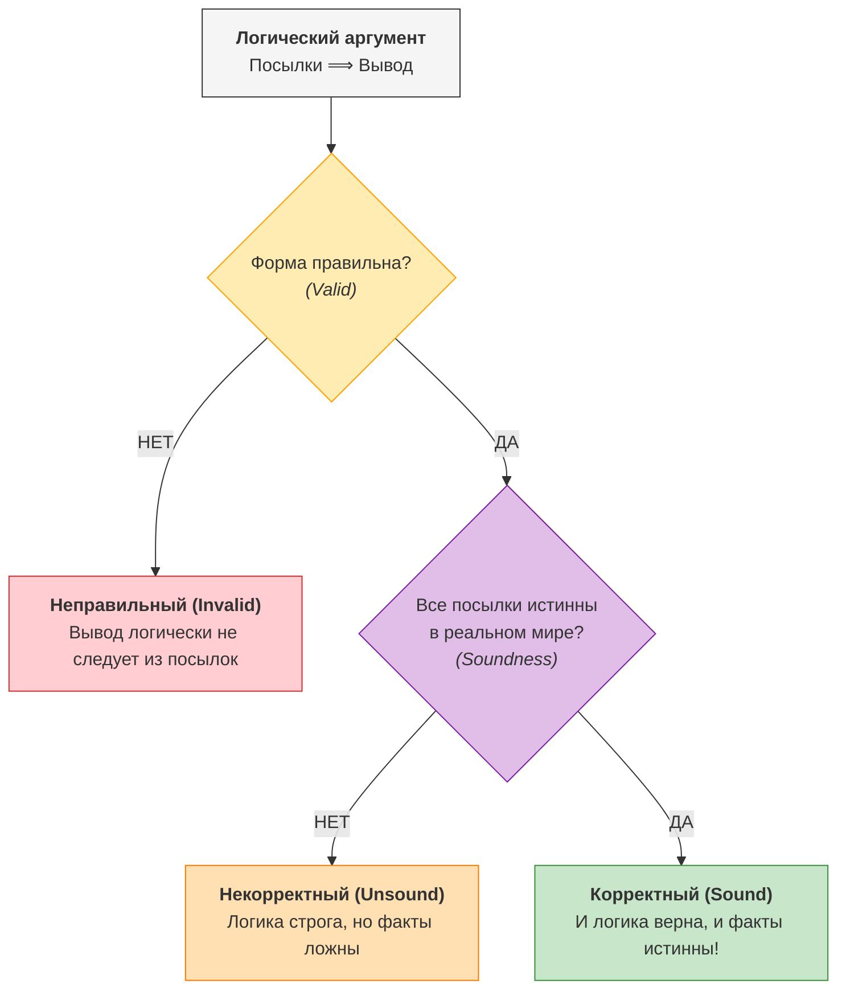
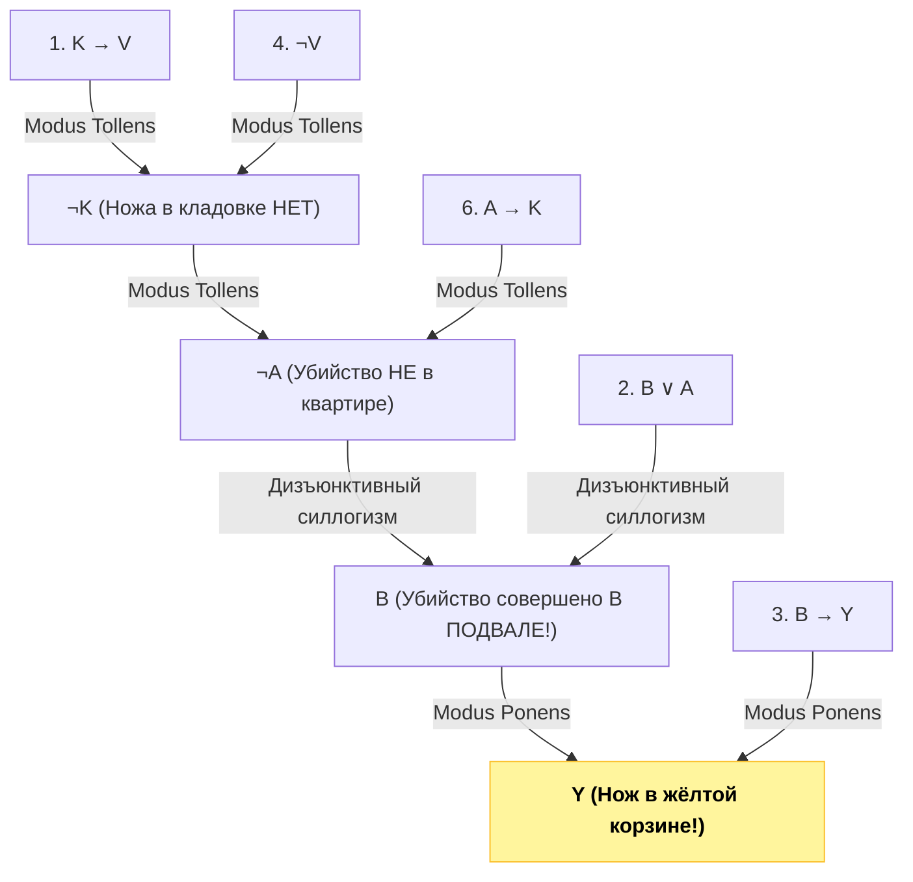

# 📝 Практика 1: Логическое следование, формулы (ППФ), выполнимость, логические задачи и силлогизмы

> **Дата проведения:** `2026-09-09` (1-я неделя)  
> **Предмет:** Дискретная математика (1 семестр, 2026/27 уч. год)  
> **Преподаватель (лектор):** Константин Чухарев ([@Lipen](https://github.com/Lipen), Университет ИТМО)  
> **Связанная лекция:** [[2026-09-09 - Дискретная математика - Лекция 1, высказывания, связки, таблицы истинности, законы логики и следствие]]  
> **Материалы:** Лист практических заданий №1 (Задания I.A – I.H, V.C, V.I – V.K)

---

## 🧭 Навигация по конспекту

1. [Теоретический фундамент семинара](#1-теоретический-фундамент-семинара)
   - [Индуктивное определение ППФ (WFF)](#11-индуктивное-определение-ппф-wff)
   - [Интерпретация и оценка формулы](#12-интерпретация-и-оценка-формулы)
   - [Семантическое следование и теорема о дедукции](#13-семантическое-следование-и-теорема-о-дедукции)
   - [Совместная выполнимость и модели](#14-совместная-выполнимость-и-модели)
   - [Правильность (Valid) против Корректности (Sound)](#15-правильность-valid-против-корректности-sound)
2. [Блок I: Формулы, синтаксис и следование](#2-блок-i-формулы-синтаксис-и-следование)
   - [Задание I.A: Доказательство следования и контрпримеры к обратному](#задание-ia-доказательство-следования-и-контрпримеры-к-обратному)
   - [Задание I.B: Проверка ППФ и вычисление при интерпретации](#задание-ib-проверка-ппф-и-вычисление-при-интерпретации)
   - [Задание I.C: Противоречие в базисе {→} и теорема о сохранении 1](#задание-ic-противоречие-в-базисе-to-и-теорема-о-сохранении-1)
3. [Блок II: Выполнимость, тавтологии и правила вывода](#3-блок-ii-выполнимость-тавтологии-и-правила-вывода)
   - [Задание I.D: Совместная выполнимость наборов формул](#задание-id-совместная-выполнимость-наборов-формул)
   - [Задание V.C: Проверка тавтологичности импликации P → Q](#задание-vc-проверка-тавтологичности-импликации-p-to-q)
   - [Задание I.E: Проверка семантического следования (6 задач)](#задание-ie-проверка-семантического-следования-6-задач)
4. [Блок III: Текстовые и логические головоломки](#4-блок-iii-текстовые-и-логические-головоломки)
   - [Задание I.F: Философские аргументы — Valid vs Sound](#задание-if-философские-аргументы--valid-vs-sound)
   - [Задание I.G: Макроэкономическая модель и метод от противного](#задание-ig-макроэкономическая-модель-и-метод-от-противного)
   - [Задание I.H: Детективное расследование: где орудие убийства?](#задание-ih-детективное-расследование-где-орудие-убийства)
5. [Блок IV: Введение в силлогистику и предикаты](#5-блок-iv-введение-в-силлогистику-и-предикаты)
   - [Задание V.I: Силлогизмы, диаграммы Эйлера и модусы Barbara, Celarent, Darii](#задание-vi-силлогизмы-диаграммы-эйлера-и-модусы-barbara-celarent-darii)
   - [Задание V.J: Истинность кванторов на доменах ℤ и ℝ](#задание-vj-истинность-кванторов-на-доменах-mathbbz-и-mathbbr)
   - [Задание V.K: Запись «ровно один студент в ровно один клуб» через ∃! и {∀, ∃}](#задание-vk-запись-ровно-один-студент-в-ровно-один-клуб-через-exists-и-forall-exists)
6. [Шпаргалка к первой контрольной и теорминимуму](#6-шпаргалка-к-первой-контрольной-и-теорминимуму)

---

## 1. Теоретический фундамент семинара

### 1.1. Индуктивное определение ППФ (WFF)

В математической логике выражение имеет смысл только тогда, когда оно синтаксически корректно построено. Такие выражения называются **правильно построенными формулами** (ППФ, англ. *Well-Formed Formula*, WFF).

> [!important] Индуктивное определение ППФ над алфавитом $\mathcal{L}$
> 1. **Базис индукции:**
>    - Любая пропозициональная переменная (атом) $P \in V = \{p, q, r, A, B, \dots\}$ является ППФ.
>    - Логические константы $T$ ($\top$, True, 1) и $F$ ($\bot$, False, 0) являются ППФ.
> 2. **Индуктивный шаг:**
>    - Если $\varphi$ — ППФ, то $(\neg \varphi)$ — ППФ.
>    - Если $\varphi$ и $\psi$ — ППФ, то:
>      - $(\varphi \land \psi)$ — ППФ (конъюнкция);
>      - $(\varphi \lor \psi)$ — ППФ (дизъюнкция);
>      - $(\varphi \to \psi)$ — ППФ (импликация);
>      - $(\varphi \leftrightarrow \psi)$ — ППФ (эквивалентность).
> 3. **Ограничение:** Никакие другие цепочки символов не являются ППФ.

*Соглашение об экономии скобок:* внешние скобки и скобки, определяемые старшинством связок ($\neg > \land > \lor > \to > \leftrightarrow$), в практической записи разрешается опускать.

---

### 1.2. Интерпретация и оценка формулы

Пусть $V$ — множество пропозициональных переменных, входящих в формулу $\varphi$.

> [!definition] Определение: Интерпретация (Evaluation)
> **Интерпретацией** (или означиванием) называется функция:
> $$v: V \to \{F, T\} \quad (\text{или } v: V \to \{0, 1\}),$$
> которая сопоставляет каждой атомарной переменной истинностное значение.

Значение произвольной формулы $\varphi$ при интерпретации $v$ обозначается $[\varphi]_v$ и вычисляется рекурсивно по дереву синтаксического разбора формулы согласно таблицам истинности логических связок:
- $[P]_v = v(P)$ для $P \in V$;
- $[T]_v = 1, \quad [F]_v = 0$;
- $[\neg \varphi]_v = 1 - [\varphi]_v$;
- $[\varphi \land \psi]_v = \min([\varphi]_v, [\psi]_v)$;
- $[\varphi \lor \psi]_v = \max([\varphi]_v, [\psi]_v)$;
- $[\varphi \to \psi]_v = \max(1 - [\varphi]_v, [\psi]_v)$;
- $[\varphi \leftrightarrow \psi]_v = 1 \iff [\varphi]_v = [\psi]_v$.

---

### 1.3. Семантическое следование и теорема о дедукции

> [!definition] Определение: Семантическое следование ($\vDash$)
> Пусть $\Gamma = \{\varphi_1, \varphi_2, \dots, \varphi_k\}$ — множество формул (посылок), а $\psi$ — формула (заключение).
> Говорят, что из $\Gamma$ **семантически следует** $\psi$ (обозначается $\Gamma \vDash \psi$), если:
> $$\forall v: \quad \Bigl(\forall \varphi \in \Gamma: [\varphi]_v = 1\Bigr) \implies [\psi]_v = 1.$$
> Иными словами: **в любой строке таблицы истинности, где ВСЕ посылки из $\Gamma$ одновременно истинны, формула $\psi$ также обязана быть истинной.**

> [!important] Теорема о дедукции (для семантического следования)
> Для любого множества формул $\Gamma$ и формул $\varphi, \psi$:
> $$\Gamma \cup \{\varphi\} \vDash \psi \iff \Gamma \vDash (\varphi \to \psi)$$
> В частности, при пустом множестве посылок $\Gamma = \varnothing$:
> $$\{\varphi\} \vDash \psi \iff \vDash (\varphi \to \psi) \quad (\text{импликация } \varphi \to \psi \text{ является тавтологией})$$

*Следствие о ложных посылках (Ex falso quodlibet):*  
Если множество посылок $\Gamma$ противоречиво (то есть не существует ни одной интерпретации $v$, где все формулы из $\Gamma$ истинны), то из $\Gamma$ семантически следует **абсолютно любая формула** $\psi$:
$$\Gamma \text{ невыполнимо} \implies \Gamma \vDash \psi \quad \forall \psi.$$

---

### 1.4. Совместная выполнимость и модели

> [!definition] Модель и выполнимость
> - Интерпретация $v$ называется **моделью** формулы $\varphi$, если $[\varphi]_v = 1$. Множество всех моделей формулы обозначается $\mathrm{Mod}(\varphi)$.
> - Интерпретация $v$ называется **моделью множества формул** $\Gamma$, если $v$ является моделью каждой формулы $\varphi \in \Gamma$, то есть $\mathrm{Mod}(\Gamma) = \bigcap_{\varphi \in \Gamma} \mathrm{Mod}(\varphi)$.
> - Множество формул $\Gamma$ называется **совместно выполнимым** (satisfiable), если $\mathrm{Mod}(\Gamma) \neq \varnothing$ (существует хотя бы одна общая модель).
> - Если $\mathrm{Mod}(\Gamma) = \varnothing$, то множество $\Gamma$ называется **несовместным** или **противоречивым**.

*Связь следования и моделей:*
$$\Gamma \vDash \psi \iff \mathrm{Mod}(\Gamma) \subseteq \mathrm{Mod}(\psi).$$

---

### 1.5. Правильность (Valid) против Корректности (Sound)

В формальной логике критически важно разделять истинность фактов о реальном мире и строгость логического вывода:



1. **Правильность (Validity):** свойство структуры рассуждения. Аргумент *valid*, если невозможно, чтобы все посылки были истинны, а вывод ложен. То есть $\Gamma \vDash \psi$.
2. **Корректность (Soundness):** аргумент *sound*, если он *valid* **И** все его посылки истинны в нашей реальности.

---

## 2. Блок I: Формулы, синтаксис и следование

### Задание I.A: Доказательство следования и контрпримеры к обратному

Требуется доказать прямое логическое следование $\Gamma \vDash \psi$ и показать, что обратное утверждение $\psi \vDash \Gamma$ верно не всегда (привести опровергающий контрпример).

---

#### Пункт a: $A \to B \vDash (A \lor C \to B \lor C)$

**1. Доказательство прямого следования:**  
Пусть дана произвольная интерпретация $v$, при которой посылка истинна: $[A \to B]_v = 1$.  
По определению импликации это означает: $[A]_v = 0$ либо $[B]_v = 1$.  
Рассмотрим заключение $(A \lor C) \to (B \lor C)$. Допустим, его антецедент истинен: $[A \lor C]_v = 1$.
- **Случай 1:** $[B]_v = 1$.  
  Тогда консеквент $[B \lor C]_v = 1 \lor [C]_v = 1$. Импликация $1 \to 1 = 1$.
- **Случай 2:** $[A]_v = 0$.  
  Так как антецедент $[A \lor C]_v = 1$, а $[A]_v = 0$, то обязательно $[C]_v = 1$.  
  Но если $[C]_v = 1$, то консеквент $[B \lor C]_v = [B]_v \lor 1 = 1$. Импликация снова $1 \to 1 = 1$.

Таким образом, при истинности посылки заключение истинно во всех возможных случаях. Следование доказано:
$$A \to B \vDash (A \lor C \to B \lor C).$$

**2. Опровержение обратного следования:**  
Проверим: верно ли $(A \lor C \to B \lor C) \vDash A \to B$?  
Для опровержения требуется найти набор $(A, B, C)$, где:
$$[A \lor C \to B \lor C]_v = 1, \quad \text{но} \quad [A \to B]_v = 0.$$
Ложность $A \to B$ однозначно фиксирует: $A = 1, B = 0$.  
Подставим эти значения в исходную формулу:
$$(1 \lor C) \to (0 \lor C) \equiv 1 \to C \equiv C.$$
Положим $C = 1$. Тогда:
- $[A \lor C \to B \lor C]_v = (1 \lor 1) \to (0 \lor 1) = 1 \to 1 = 1$ (посылка истинна);
- $[A \to B]_v = 1 \to 0 = 0$ (заключение ложно).

> [!done] Ответ по пункту a
> Прямое следование доказано. Обратное неверно: контрпример $A = 1, B = 0, C = 1$.

---

#### Пункт b: $A \to B \vDash (C \land \neg B \to C \land \neg A)$

**1. Доказательство прямого следования:**  
Вспомним закон контрапозиции: $A \to B \equiv \neg B \to \neg A$.  
Пусть $[A \to B]_v = 1$, следовательно $[\neg B \to \neg A]_v = 1$.  
Рассмотрим формулу $(C \land \neg B) \to (C \land \neg A)$.
- Если $[C \land \neg B]_v = 0$, то импликация истинна тривиально по вакуумности ($0 \to \dots \equiv 1$).
- Если $[C \land \neg B]_v = 1$, то по свойствам конъюнкции:
  $$[C]_v = 1 \quad \text{и} \quad [\neg B]_v = 1 \implies [B]_v = 0.$$
  Так как $[A \to B]_v = 1$ и $[B]_v = 0$, то по Modus Tollens получаем $[A]_v = 0$, а значит $[\neg A]_v = 1$.  
  Тогда консеквент $[C \land \neg A]_v = 1 \land 1 = 1$.  
  Импликация принимает вид $1 \to 1 = 1$.

Следование доказано: $A \to B \vDash (C \land \neg B \to C \land \neg A)$.

**2. Опровержение обратного следования:**  
Ищем контрпример, где $[C \land \neg B \to C \land \neg A]_v = 1$, но $[A \to B]_v = 0$.  
Снова требуем $[A \to B]_v = 0 \implies A = 1, B = 0$.  
Тогда $\neg B = 1, \neg A = 0$. Формула посылки превращается в:
$$(C \land 1) \to (C \land 0) \equiv C \to 0 \equiv \neg C.$$
Чтобы посылка была истинной, положим $C = 0$.  
Проверяем при наборе $(A = 1, B = 0, C = 0)$:
- Антецедент $C \land \neg B = 0 \land 1 = 0$. Импликация $0 \to \dots = 1$ (истина!).
- Заключение $A \to B = 1 \to 0 = 0$ (ложь!).

> [!done] Ответ по пункту b
> Прямое следование доказано. Обратное неверно: контрпример $A = 1, B = 0, C = 0$.

---

#### Пункт c: $\{(A \to C), (B \to C)\} \vDash (A \land B \to C)$

**1. Доказательство через таблицу истинности (из тетради семинара):**  
Составим полную таблицу истинности для 8 наборов переменных $A, B, C$:

| $A$ | $B$ | $C$ | $A \to C$ | $B \to C$ | Обе посылки $= 1$? | $(A \land B) \to C$ | Проверка |
| :-: | :-: | :-: | :-------: | :-------: | :----------------: | :-----------------: | :------: |
|  0  |  0  |  0  |     1     |     1     |       ⭐ ДА        |     $0 \to 0 = 1$   |    ✅    |
|  0  |  0  |  1  |     1     |     1     |       ⭐ ДА        |     $0 \to 1 = 1$   |    ✅    |
|  0  |  1  |  0  |     1     |     0     |        НЕТ         |     $0 \to 0 = 1$   |    —     |
|  0  |  1  |  1  |     1     |     1     |       ⭐ ДА        |     $0 \to 1 = 1$   |    ✅    |
|  1  |  0  |  0  |     0     |     1     |        НЕТ         |     $0 \to 0 = 1$   |    —     |
|  1  |  0  |  1  |     1     |     1     |       ⭐ ДА        |     $0 \to 1 = 1$   |    ✅    |
|  1  |  1  |  0  |     0     |     0     |        НЕТ         |     $1 \to 0 = 0$   |    —     |
|  1  |  1  |  1  |     1     |     1     |       ⭐ ДА        |     $1 \to 1 = 1$   |    ✅    |

В каждой строке, где обе посылки равны 1 (строки 1, 2, 4, 6, 8), формула $(A \land B) \to C$ строго равна 1. Следование выполняется!

**2. Опровержение обратного следования:**  
Проверим: $(A \land B \to C) \vDash \{A \to C, B \to C\}$?  
Ищем набор, где $(A \land B \to C) = 1$, но хотя бы одна из формул $\{A \to C, B \to C\}$ ложна.  
Пусть $A = 1, B = 0, C = 0$:
- $(A \land B) \to C = (1 \land 0) \to 0 = 0 \to 0 = 1$ (посылка истинна);
- $A \to C = 1 \to 0 = 0$ (первая формула заключения ложна!).

> [!done] Ответ по пункту c
> Прямое следование доказано. Обратное неверно: контрпример $A = 1, B = 0, C = 0$.

---

### Задание I.B: Проверка ППФ и вычисление при интерпретации

Определить, являются ли приведенные записи правильно построенными формулами (ППФ/WFF):

1. **$\neg\neg\neg\neg F$**  
   - **Анализ:** Константа $F$ — ППФ по базису. Четырёхкратное последовательное применение правила отрицания $(\neg \dots)$ порождает корректную цепочку.  
   - **Статус:** **Является ППФ**.  
   - *Значение:* $\neg\neg\neg\neg 0 = 0 = F$.

2. **$\neg \land S$**  
   - **Анализ:** Связка $\land$ является строго **бинарной** операцией. По индуктивному правилу конъюнкция требует наличия левой и правой подформулы: $(\varphi \land \psi)$. В данной записи перед $\land$ стоит унарная связка $\neg$, левый операнд отсутствует.  
   - **Статус:** **НЕ является ППФ** (грубая синтаксическая ошибка).

3. **$(G \land \neg G)$**  
   - **Анализ:** $G$ — атомарная переменная (ППФ) $\implies \neg G$ — ППФ $\implies (G \land \neg G)$ — ППФ.  
   - **Статус:** **Является ППФ** (тождественное противоречие).

4. **$\varphi_d = (A \to (A \land \neg F)) \lor (D \leftrightarrow A)$**  
   - **Анализ:** Все связки согласованы по арности, расстановка скобок однозначно задает дерево выражений.  
   - **Статус:** **Является ППФ**.

**Вычисление значения $\varphi_d$ при интерпретации $v(A) = T, v(F) = T, v(D) = T$:**
1. $[\neg F]_v = \neg T = F$;
2. $[A \land \neg F]_v = T \land F = F$;
3. $[A \to (A \land \neg F)]_v = T \to F = F$;
4. $[D \leftrightarrow A]_v = T \leftrightarrow T = T$;
5. $[\varphi_d]_v = F \lor T = \mathbf{T} \quad (\mathbf{1})$.

---

### Задание I.C: Противоречие в базисе {→} и теорема о сохранении 1

> [!question] Формулировка задачи
> Постройте формулу-противоречие (тождественно ложную), используя хотя бы по разу символы алфавита:
> $$\mathfrak{A} = \{p, q, r, ), (, \to\}.$$

На первый взгляд задача кажется стандартной, но на семинаре она вызвала бурную дискуссию. Давайте докажем фундаментальную теорему математической логики о функциональных свойствах импликации.

> [!important] Теорема о сохранении константы 1 (класса $T_1$) связкой импликации
> Любая правильно построенная формула $\varphi(p_1, \dots, p_n)$, построенная **исключительно** из пропозициональных переменных и логической связки $\to$, принимает значение $1$ на единичном наборе:
> $$v(p_1) = 1, \dots, v(p_n) = 1 \implies [\varphi]_v = 1.$$

**Доказательство (структурная индукция по построению формулы):**
1. **Базис:** если $\varphi = p_i$ — атомарная переменная, то по условию $v(p_i) = 1 \implies [\varphi]_v = 1$.
2. **Шаг индукции:** пусть $\varphi = (\psi \to \chi)$, где для подформул $\psi$ и $\chi$ утверждение уже верно (то есть $[\psi]_v = 1$ и $[\chi]_v = 1$).  
   Тогда по определению импликации:
   $$[\varphi]_v = [\psi \to \chi]_v = 1 \to 1 = 1.$$
Теорема доказана. $\blacksquare$

> [!warning] Главный логический вывод задачи
> Так как на наборе $(1, 1, 1)$ любая формула в алфавите $\{p, q, r, \to\}$ принимает значение **1**, в этом языке **в принципе невозможно построить тождественное противоречие** (формулу, тождественно равную 0 на всех наборах)!  
> 
> *Что же имелось в виду в задаче?*
> 1. Либо в алфавите неявно предполагалась константа лжи $\bot$ (тогда $\neg p \equiv p \to \bot$ и противоречие строится как $((p \to q) \to r) \to \bot$);
> 2. Либо требовалось построить **опровержимую формулу** (принимающую значение 0 хотя бы на одном наборе с участием всех переменных):  
>    Например: $\varphi = (p \to q) \to r$. При $p = 1, q = 1, r = 0$:
>    $$[\varphi]_v = (1 \to 1) \to 0 = 1 \to 0 = \mathbf{0}.$$
>    Или формула: $p \to (q \to (r \to p))$, которая ложна при $p = 1, q = 1, r = 1 \dots$ стоп, нет, она истинна. Опровержима именно $(p \to (q \to r))$, ложная при $p = 1, q = 1, r = 0$.

---

## 3. Блок II: Выполнимость, тавтологии и правила вывода

### Задание I.D: Совместная выполнимость наборов формул

Множество формул совместно выполнимо, если существует набор истинностных значений переменных, обращающий одновременно все формулы набора в 1.

#### Набор a: $\{A \lor B, \; A \to C, \; B \to C\}$
- Проверим набор $A = 1, B = 0, C = 1$:
  1. $A \lor B = 1 \lor 0 = 1$;
  2. $A \to C = 1 \to 1 = 1$;
  3. $B \to C = 0 \to 1 = 1$.
- Все три формулы истинны!
- **Ответ:** **Совместно выполним** (модели: $(1, 0, 1), (0, 1, 1), (1, 1, 1)$).

#### Набор b: $\{A \lor B, \; A \to C, \; B \to C, \; \neg C\}$
- Проведём анализ от противного: допустим, существует модель $v$, где все 4 формулы истинны:
  1. $[\neg C]_v = 1 \implies [C]_v = 0$.
  2. $[A \to C]_v = 1 \implies [A \to 0]_v = 1 \implies [A]_v = 0$.
  3. $[B \to C]_v = 1 \implies [B \to 0]_v = 1 \implies [B]_v = 0$.
  4. Но тогда первая формула: $[A \lor B]_v = 0 \lor 0 = 0$. Получили противоречие с требованием $[A \lor B]_v = 1$.
- **Ответ:** **Не выполним (противоречив)**. Общих моделей нет ($\mathrm{Mod} = \varnothing$).

#### Набор c: $\{A \leftrightarrow (B \lor C), \; C \to \neg A, \; A \to \neg B\}$
- Попробуем найти модель, перебрав значение переменной $A$:
  - **Если $A = 0$:**
    - Из $A \leftrightarrow (B \lor C)$ получаем $0 \leftrightarrow (B \lor C) \implies B \lor C = 0 \implies B = 0, C = 0$.
    - Проверим остальные формулы при $A = 0, B = 0, C = 0$:
      - $C \to \neg A = 0 \to 1 = 1$ (истина);
      - $A \to \neg B = 0 \to 1 = 1$ (истина).
    - Набор $(0, 0, 0)$ является моделью!
  - **Если $A = 1$:**
    - Из $A \to \neg B$ получаем $1 \to \neg B = 1 \implies \neg B = 1 \implies B = 0$.
    - Так как $A \leftrightarrow (B \lor C) = 1$, то $B \lor C = 1$. Так как $B = 0$, то $C = 1$.
    - Проверяем формулу $C \to \neg A$: получаем $1 \to \neg 1 = 1 \to 0 = 0$ (ложь!).
- **Ответ:** **Совместно выполним** (единственная модель: $A = 0, B = 0, C = 0$).

---

### Задание V.C: Проверка тавтологичности импликации P → Q

Дана целевая формула в форме ДНФ:
$$Q = (A\bar{B}) \lor (\bar{A}CD) \lor (A\bar{C}) \lor (\bar{A}B)$$
Требуется проверить, является ли импликация $P_i \to Q$ тавтологией для трех вариантов $P$:
1. $P_1 = BCD \lor \bar{A}BC$
2. $P_2 = B\bar{C}\bar{D} \lor AB\bar{C}$
3. $P_3 = \bar{A}\bar{B}D \lor \bar{A}B\bar{C}$

> [!tip] Метод проверки
> Импликация $P_i \to Q$ является тавтологией тогда и только тогда, когда любая элементарная конъюнкция из $P_i$ влечёт $Q$ (то есть при $P_i = 1$ обязательно $Q = 1$).
> Если найдется хотя бы один набор, где $P_i = 1$, но $Q = 0$, то $P_i \to Q$ опровержима.

Упростим структуру формулы $Q$, сгруппировав термы:
$$Q = \underbrace{(A\bar{B} \lor \bar{A}B)}_{A \oplus B} \lor (A\bar{C}) \lor (\bar{A}CD).$$
- Если $A = 1$: $Q = \bar{B} \lor \bar{C} = \overline{BC}$ (истинна, если не выполняется одновременно $B=1, C=1$).
- Если $A = 0$: $Q = B \lor CD$.

**Анализ вариантов:**

1. **Для $P_1 = BCD \lor \bar{A}BC$:**
   - Рассмотрим терм $BCD$: он равен 1, если $B = 1, C = 1, D = 1$.
   - Возьмём набор $A = 1, B = 1, C = 1, D = 1$:
     - $P_1 = (1 \cdot 1 \cdot 1) \lor \dots = 1$;
     - При $A = 1$ значение $Q = \overline{BC} = \overline{1 \cdot 1} = 0$.
     - Тогда $P_1 \to Q = 1 \to 0 = 0$!
   - **Вывод для $P_1$:** **НЕ тавтология** (контрпример $1111$).

2. **Для $P_2 = B\bar{C}\bar{D} \lor AB\bar{C}$:**
   - Первый терм $B\bar{C}\bar{D}$ ($B=1, C=0, D=0$):
     - Если $A = 1$: $C = 0 \implies \bar{C} = 1 \implies A\bar{C} = 1 \implies Q = 1$.
     - Если $A = 0$: $B = 1 \implies \bar{A}B = 1 \implies Q = 1$.
   - Второй терм $AB\bar{C}$ ($A=1, B=1, C=0$):
     - Здесь $A=1$ и $C=0 \implies A\bar{C} = 1 \implies Q = 1$.
   - Везде, где $P_2 = 1$, значение $Q = 1$!
   - **Вывод для $P_2$:** **ТАВТОЛОГИЯ** ($\vDash P_2 \to Q$).

3. **Для $P_3 = \bar{A}\bar{B}D \lor \bar{A}B\bar{C}$:**
   - Рассмотрим терм $\bar{A}\bar{B}D$: он равен 1 при $A = 0, B = 0, D = 1$.
   - Подставим эти значения в $Q$ при $A = 0$: формула $Q = B \lor CD = 0 \lor (C \cdot 1) = C$.
   - Если положить $C = 0$, то на наборе $(A=0, B=0, C=0, D=1)$:
     - $P_3 = (1 \cdot 1 \cdot 1) \lor \dots = 1$;
     - $Q = 0 \lor (0 \cdot 1) = 0$.
     - Импликация $P_3 \to Q = 1 \to 0 = 0$!
   - **Вывод для $P_3$:** **НЕ тавтология** (контрпример $0001$).

---

### Задание I.E: Проверка семантического следования (6 задач)

---

#### 1. $\{A \to (A \land \neg A)\} \vDash \neg A$
- $A \land \neg A \equiv 0$ (закон противоречия).
- Тогда посылка: $A \to 0 \equiv \neg A \lor 0 \equiv \neg A$.
- Посылка буквально совпадает с заключением.
- **Ответ:** **ВЫПОЛНЯЕТСЯ**.

---

#### 2. $\{A \lor B, \; A \to B, \; B \to A\} \vDash A \land B$
- Две посылки $A \to B$ и $B \to A$ равносильны эквивалентности: $A \leftrightarrow B$ ($A$ и $B$ имеют одинаковое значение).
- Посылка $A \lor B = 1$ в условиях $A = B$ дает: $A \lor A = 1 \implies A = 1$.
- Так как $A = B$, то и $B = 1$.
- Тогда $A \land B = 1 \land 1 = 1$.
- **Ответ:** **ВЫПОЛНЯЕТСЯ**.

---

#### 3. $\{S \leftrightarrow T\} \vDash S \leftrightarrow (T \lor S)$
- Если посылка истинна, то $[S]_v = [T]_v$. Возможны два случая:
  1. $S = 1, T = 1$: $T \lor S = 1 \lor 1 = 1$. Заключение: $1 \leftrightarrow 1 = 1$.
  2. $S = 0, T = 0$: $T \lor S = 0 \lor 0 = 0$. Заключение: $0 \leftrightarrow 0 = 1$.
- В обоих случаях заключение истинно.
- **Ответ:** **ВЫПОЛНЯЕТСЯ**.

---

#### 4. $\{\neg A \to B, \; \neg B \to C, \; \neg C \to A\} \vDash \neg A \to (\neg B \lor \neg C)$
- Проверим возможность опровержения: пусть заключение ложно!
  $$\neg A \to (\neg B \lor \neg C) = 0 \iff \neg A = 1 \quad \text{и} \quad (\neg B \lor \neg C) = 0.$$
  Отсюда: $A = 0$, $B = 1$, $C = 1$.
- Подставим этот набор $(A=0, B=1, C=1)$ во все три посылки:
  1. $\neg A \to B = 1 \to 1 = 1$ (истина);
  2. $\neg B \to C = 0 \to 1 = 1$ (истина);
  3. $\neg C \to A = 0 \to 0 = 1$ (истина).
- Все три посылки истинны, а заключение ложно!
- **Ответ:** **НЕ ВЫПОЛНЯЕТСЯ** (контрпример $A = 0, B = 1, C = 1$).

---

#### 5. $\{A \land (B \to C), \; \neg C \land (\neg B \to \neg A)\} \vDash C \land \neg C$
- Обратим внимание на заключение: $C \land \neg C \equiv 0$ (тождественная ложь).
- Может ли следовать ложь? Да, **только если множество посылок несовместно (противоречиво)**!
- Проверим совместность посылок:
  - Посылка 1 истинна $\implies A = 1$ и $B \to C = 1$.
  - Посылка 2 истинна $\implies \neg C = 1 \implies C = 0$, и $\neg B \to \neg A = 1$.
  - Так как $A = 1$, то $\neg A = 0$.
  - Тогда импликация $\neg B \to \neg A$ превращается в $\neg B \to 0 = 1$, откуда $\neg B = 0 \implies B = 1$.
  - Но мы получили: $B = 1$ и $C = 0$. При таких значениях посылка 1 содержит $B \to C = 1 \to 0 = 0$, что противоречит истинности посылки 1!
- Таким образом, множество посылок **не имеет ни одной модели** ($\mathrm{Mod}(\Gamma) = \varnothing$).
- По определению семантического следования (вакуумная истинность импликации):
  $$\varnothing \subseteq \mathrm{Mod}(C \land \neg C) \iff \Gamma \vDash C \land \neg C.$$
- **Ответ:** **ВЫПОЛНЯЕТСЯ** (тривиально, из противоречия следует всё что угодно).

---

#### 6. $\vDash (P \to Q) \to (\neg Q \to \neg P)$
- Применим теорему о дедукции дважды:
  $$\vDash (P \to Q) \to (\neg Q \to \neg P) \iff \{P \to Q\} \vDash (\neg Q \to \neg P) \iff \{P \to Q, \; \neg Q\} \vDash \neg P.$$
- Это в точности классическое правило вывода **Modus Tollens**:
  Если $P \to Q = 1$ и $Q = 0$, то при $P = 1$ мы получили бы $1 \to 0 = 0$ (противоречие). Значит, обязательно $P = 0$, то есть $\neg P = 1$.
- Таблица истинности (из тетради):

| $P$ | $Q$ | $P \to Q$ | $\neg Q$ | Обе посылки $= 1$? | $\neg P$ |
| :-: | :-: | :-------: | :------: | :----------------: | :------: |
|  0  |  0  |     1     |    1     |       ⭐ ДА        |    1     |
|  0  |  1  |     1     |    0     |        НЕТ         |    1     |
|  1  |  0  |     0     |    1     |        НЕТ         |    0     |
|  1  |  1  |     1     |    0     |        НЕТ         |    0     |

Единственная строка, где обе посылки истинны — $(0, 0)$. В ней $\neg P = 1$.
- **Ответ:** **ВЫПОЛНЯЕТСЯ** (закон контрапозиции является тавтологией).

---

## 4. Блок III: Текстовые и логические головоломки

### Задание I.F: Философские аргументы — Valid vs Sound

Определить для каждого рассуждения, является ли оно **правильным (valid)** и является ли оно **корректным (sound)**.

#### Рассуждение 1:
> 1. Socrates is a man. (Сократ — человек)  
> 2. All men are carrots. (Все люди — морковки)  
> $\therefore$ Socrates is a carrot. (Следовательно, Сократ — морковка)

- **Форма:** $M(s) \land \forall x (M(x) \to C(x)) \vdash C(s)$. Это классический Modus Ponens в логике первого порядка. Если бы посылки были истинны, вывод железно был бы истинным.
- **Valid?** **ДА** (форма вывода безупречна).
- **Sound?** **НЕТ** (посылка «Все люди — морковки» фактически ложна в реальном мире).

---

#### Рассуждение 2:
> 1. Joe is now 19 years old. (Джо сейчас 19 лет)  
> 2. Joe is now 87 years old. (Джо сейчас 87 лет)  
> $\therefore$ Bob is now 20 years old. (Следовательно, Бобу сейчас 20 лет)

- **Форма:** $P \land \neg P \vdash Q$.
- Посылки логически противоречивы (Джо не может одновременно иметь два взаимоисключающих возраста).
- Как доказано в задании I.E.5, из противоречия логически следует любое суждение (*ex contradictione sequitur quodlibet*). Следовательно, не существует мира, где посылки истинны, а вывод ложен (так как посылки ложны всегда).
- **Valid?** **ДА** (формально семантическое следование выполняется тривиально!).
- **Sound?** **НЕТ** (посылки не являются истинными в нашем мире).

---

#### Рассуждение 3:
> 1. If the world ends today, then I will not need to get up tomorrow morning.  
>    *(Если сегодня наступит конец света, мне не нужно будет вставать завтра утром)*  
> 2. I will need to get up tomorrow morning.  
>    *(Мне нужно будет вставать завтра утром)*  
> $\therefore$ The world will not end today.  
>    *(Следовательно, сегодня конца света не будет)*

- **Форма:** $E \to \neg U, \; U \vdash \neg E$.
- Это правило **Modus Tollens**: из $A \to B$ и $\neg B$ строго следует $\neg A$.
- **Valid?** **ДА**.
- **Sound?** **ДА!** Посылка 1 истинна по смыслу гибели мира; посылка 2 истинна (у студента завтра пары и дела); вывод также истинен в реальности.

---

### Задание I.G: Макроэкономическая модель и метод от противного

**Атомарные высказывания:**
- $A$ = капиталовложения останутся постоянными;
- $B$ = возрастут правительственные расходы;
- $C$ = возрастет безработица;
- $D$ = налоги будут снижены.

**Сложные формулы:**
- $\mathcal{A} = A \to (B \lor C)$: *«Если капиталовложения останутся постоянными, то либо возрастут правительственные расходы, либо возрастет безработица».*
- $\mathcal{B} = \neg B \to D$: *«Если правительственные расходы не возрастут, то налоги будут снижены».*
- $\mathcal{C} = (D \land A) \to \neg C$: *«Если налоги будут снижены при сохранении капиталовложений, то безработица не возрастет».*

**Требуется доказать семантическое следование:**
$$\{\mathcal{A}, \mathcal{B}, \mathcal{C}, A\} \vDash B$$

**Доказательство (методом от противного):**
1. Предположим, что все посылки истинны, но заключение ложно: $[B]_v = 0$.
2. Так как $[B]_v = 0$, то $[\neg B]_v = 1$.  
   По формуле $\mathcal{B} = (\neg B \to D) = 1$, по правилу Modus Ponens получаем:
   $$[D]_v = 1 \quad (\text{налоги обязательно будут снижены}).$$
3. По условию посылка $A$ истинна: $[A]_v = 1$.  
   Следовательно, антецедент формулы $\mathcal{C}$ истинен:
   $$[D \land A]_v = 1 \land 1 = 1.$$
4. Из формулы $\mathcal{C} = ((D \land A) \to \neg C) = 1$ по Modus Ponens получаем:
   $$[\neg C]_v = 1 \implies [C]_v = 0 \quad (\text{безработица не возрастет}).$$
5. Теперь обратимся к первой формуле $\mathcal{A} = (A \to (B \lor C)) = 1$.  
   Так как $[A]_v = 1$, консеквент обязан быть истинным:
   $$[B \lor C]_v = 1.$$
6. Однако на шагах 1 и 4 мы получили: $[B]_v = 0$ и $[C]_v = 0$.  
   Следовательно: $[B \lor C]_v = 0 \lor 0 = 0$.  
   Получили прямое противоречие: $1 = 0$!

Следовательно, предположение $[B]_v = 0$ ложно. При любых истинных посылках обязательно $[B]_v = 1$.  
Семантическое следование доказано! $\blacksquare$

---

### Задание I.H: Детективное расследование: где орудие убийства?

**Улики и факты расследования:**
1. *«Если нож в кладовке, то мы его увидели, когда просмотрели кладовку»*
2. *«Убийство совершено в подвале или в квартире»*
3. *«Если убийство совершено в подвале, то нож в желтой мусорной корзине»*
4. *«Мы не увидели ножа, когда просмотрели кладовку»*
5. *«Если убийство совершено вне здания, то нож нам не найти»*
6. *«Если убийство совершено в квартире, то нож в кладовке»*

**Шаг 1: Формализация на языке логики высказываний:**
- $K$ — нож находится в кладовке;
- $V$ — сыщики увидели нож при осмотре кладовки;
- $B$ — убийство совершено в подвале;
- $A$ — убийство совершено в квартире;
- $Y$ — нож находится в жёлтой мусорной корзине;
- $O$ — убийство совершено вне здания;
- $F$ — сыщикам удастся найти нож.

Посылки дела:
1. $K \to V$
2. $B \lor A$
3. $B \to Y$
4. $\neg V$
5. $O \to \neg F$
6. $A \to K$

**Шаг 2: Пошаговый логический вывод:**



1. Из (1) $K \to V$ и (4) $\neg V$ по правилу **Modus Tollens**:  
   $$\neg K \quad (\text{ножа в кладовке нет}).$$
2. Из (6) $A \to K$ и $\neg K$ по правилу **Modus Tollens**:  
   $$\neg A \quad (\text{убийство совершено НЕ в квартире}).$$
3. Из (2) $B \lor A$ и $\neg A$ по **дизъюнктивному силлогизму** ($(\varphi \lor \psi) \land \neg \psi \vdash \varphi$):  
   $$B \quad (\text{убийство совершено в подвале}).$$
4. Из (3) $B \to Y$ и $B$ по правилу **Modus Ponens**:  
   $$Y \quad (\text{нож находится в жёлтой мусорной корзине}).$$

*(Посылка 5 $O \to \neg F$ является избыточным фоновым фактом).*

> [!done] Итоговый ответ детектива
> Нож находится **в жёлтой мусорной корзине** (в подвале).

---

## 5. Блок IV: Введение в силлогистику и предикаты

### Задание V.I: Силлогизмы, диаграммы Эйлера и модусы Barbara, Celarent, Darii

В традиционной аристотелевской логике высказывания делятся на 4 типа (логический квадрат):
- **A (Общеутвердительное):** Все $S$ суть $P$ ($S \subseteq P$);
- **E (Общеотрицательное):** Ни одно $S$ не есть $P$ ($S \cap P = \varnothing$);
- **I (Частноутвердительное):** Некоторые $S$ суть $P$ ($S \cap P \neq \varnothing$);
- **O (Частноотрицательное):** Некоторые $S$ не суть $P$ ($S \setminus P \neq \varnothing$).

Классические форматы первой фигуры:
- **Barbara (AAA-1):** Все $M$ суть $P$; Все $S$ суть $M$ $\therefore$ Все $S$ суть $P$.
- **Celarent (EAE-1):** Ни одно $M$ не есть $P$; Все $S$ суть $M$ $\therefore$ Ни одно $S$ не есть $P$.
- **Darii (AII-1):** Все $M$ суть $P$; Некоторые $S$ суть $M$ $\therefore$ Некоторые $S$ суть $P$.

---

#### 1) «Некоторые адвокаты богаты. Некоторые врачи богаты. $\therefore$ Некоторые врачи — адвокаты»
- Множества: $A$ (адвокаты), $B$ (богатые люди), $V$ (врачи).
- Посылки: $A \cap B \neq \varnothing$ и $V \cap B \neq \varnothing$.
- **Диаграмма Эйлера:** Множество $B$ может пересекаться с $A$ в одной своей части, а с $V$ — в совершенно другой части, при этом $A \cap V = \varnothing$.
- **Статус:** **НЕВЕРНО (Invalid)**. Классическая логическая ошибка *нераспределённого среднего термина* (fallacy of the undistributed middle). Форматам Barbara/Celarent/Darii не принадлежит.

---

#### 2) «Все машины дорогие. Велосипед недорогой. $\therefore$ Велосипед — не машина»
- Множества: $M$ (машины), $D$ (дорогие вещи), $b$ (велосипед).
- Посылки: $M \subseteq D$; $b \notin D$.
- **Диаграмма Эйлера:** Так как $b$ лежит вне круга $D$, а круг $M$ полностью заключен внутри $D$, то $b$ заведомо лежит вне $M$.
- **Статус:** **ВЕРНО (Valid)**. Представляет собой форму Camestres / Baroco (вторая фигура силлогизма) или силлогистический аналог Modus Tollens.

---

#### 3) «Некоторые марсиане зеленые. Все елки зеленые. $\therefore$ Некоторые марсиане — елки»
- Посылки: $M \cap Z \neq \varnothing$ (марсиане и зеленые), $E \subseteq Z$ (елки лежат внутри зеленых).
- **Диаграмма Эйлера:** Круг $E$ может находиться в той части круга $Z$, где марсиан нет. Пересечение $M \cap E$ может быть пустым.
- **Статус:** **НЕВЕРНО (Invalid)**.

---

#### 4) «Все мужчины любят мясо. Некоторые учителя — мужчины. $\therefore$ Некоторые учителя любят мясо»
- Обозначения: $M$ — мужчины (средний термин), $P$ — любящие мясо (больший термин), $S$ — учителя (меньший термин).
- Посылка 1: *Все $M$ суть $P$* (тип **A**).
- Посылка 2: *Некоторые $S$ суть $M$* (тип **I**).
- Заключение: *Некоторые $S$ суть $P$* (тип **I**).
- **Диаграмма Эйлера:** Некоторая область круга $S$ лежит внутри $M$. Но весь круг $M$ целиком лежит внутри $P$. Следовательно, эта часть $S$ неизбежно лежит внутри $P$ ($S \cap P \neq \varnothing$).
- **Статус:** **ВЕРНО (Valid)**! Рассуждение строго принадлежит формату **Darii (AII-1)**.

---

### Задание V.J: Истинность кванторов на доменах ℤ и ℝ

Определить истинностное значение предикатных формул для множества целых чисел $\mathbb{Z}$ и множества вещественных чисел $\mathbb{R}$:

| № | Формула | Домен $\mathbb{Z}$ | Домен $\mathbb{R}$ | Математическое обоснование |
| :-: | :--- | :---: | :---: | :--- |
| 1 | $\forall x \exists y \; (x + y = 0)$ | **True (И)** | **True (И)** | Для любого $x$ существует противоположное число $y = -x$. Для любого целого $-x \in \mathbb{Z}$, для любого вещественного $-x \in \mathbb{R}$. |
| 2 | $\forall x \exists y \; (xy = 1)$ | **False (Л)** | **False (Л)** | Для $\mathbb{Z}$: при $x = 2$ требуется $y = 1/2 \notin \mathbb{Z}$. Кроме того, при $x = 0$ в обоих доменах $0 \cdot y = 0 \neq 1$. Формула опровергается контрпримером $x = 0$. |
| 3 | $\forall x \forall y \forall z \; (x(y + z) = xy + xz)$ | **True (И)** | **True (И)** | Закон дистрибутивности умножения относительно сложения — базовая аксиома кольца $\mathbb{Z}$ и поля $\mathbb{R}$. |
| 4 | $\exists x \forall y \; (x + y = x)$ | **False (Л)** | **False (Л)** | **Ловушка порядка кванторов!** Равенство $x + y = x \iff y = 0$. Формула утверждает: «существует $x$, такое что *любое* число $y$ равно нулю». Контрпример: для любого фиксированного $x$ возьмём $y = 1 \implies x + 1 \neq x$. *(Не путать с нейтральным элементом $\exists x \forall y (x + y = y)$, где $x = 0$ — истина).* |
| 5 | $\exists x \forall y \; (xy = x)$ | **True (И)** | **True (И)** | Равенство $xy = x \iff x(y - 1) = 0$. Выберем $x = 0$. Тогда для любого $y \in \mathbb{Z}$ (или $\mathbb{R}$) имеем $0 \cdot y = 0$. Такой $x$ существует ($x = 0$). |

---

### Задание V.K: Запись «ровно один студент в ровно один клуб» через ∃! и {∀, ∃}

> [!question] Условие
> Записать на языке логики предикатов высказывание:  
> *«В данной группе всего один студент зачислился в точности в один университетский клуб»*  
> 1) С использованием квантора существования и единственности $\exists!$;  
> 2) Затем раскрыть через базовые кванторы $\forall$ и $\exists$.

**Введём предикатную сигнатуру:**
- Домен $S$ — множество студентов группы;
- Домен $C$ — множество университетских клубов;
- Двуместный предикат $E(s, c)$ — «студент $s$ зачислился в клуб $c$».

---

#### 1. Запись с квантором $\exists!$:
Свойство студента $s$ «зачислиться ровно в один клуб»:
$$P(s) \equiv \exists! c \in C : E(s, c).$$
Тогда высказывание о том, что во всей группе ровно один такой студент:
$$\exists! s \in S : \bigl(\exists! c \in C : E(s, c)\bigr)$$

---

#### 2. Раскрытие через обычные кванторы $\forall$ и $\exists$:

Вспомним определение квантора единственности для произвольного свойства:
$$\exists! x : \varphi(x) \iff \exists x \Bigl(\varphi(x) \land \forall y \bigl(\varphi(y) \to y = x\bigr)\Bigr).$$

**Шаг 1: Раскрываем внутреннее утверждение $P(s)$ (ровно один клуб для студента $s$):**
$$P(s) \equiv \exists c \in C \Bigl(E(s, c) \land \forall c' \in C \bigl(E(s, c') \to c' = c\bigr)\Bigr).$$
*(Студент $s$ состоит в клубе $c$, и если он состоит в клубе $c'$, то это тот же самый клуб).*

**Шаг 2: Раскрываем внешнее утверждение (существует ровно один такой студент):**
$$\exists s \in S \Bigl(P(s) \land \forall s' \in S \bigl(P(s') \to s' = s\bigr)\Bigr).$$

Подставляя $P(s)$, получаем окончательную строгую формулу первого порядка:
$$\exists s \in S \Biggl(\Bigl(\exists c \in C \bigl(E(s, c) \land \forall c' (E(s, c') \to c' = c)\bigr)\Bigr) \land \forall s' \Bigl(\bigl(\exists c'' (E(s', c'') \land \forall c''' (E(s', c''') \to c''' = c''))\bigr) \to s' = s\Biggr).$$

---

## 6. Шпаргалка к первой контрольной и теорминимуму

```
┌─────────────────────────────────────────────────────────────────────────────────────────┐
│                               ТАБЛИЦА ПРАВИЛ ВЫВОДА                                    │
├──────────────────────┬─────────────────────────────┬────────────────────────────────────┤
│ Правило              │ Формальная запись           │ Смысл                              │
├──────────────────────┼─────────────────────────────┼────────────────────────────────────┤
│ Modus Ponens         │ P, P → Q ⊢ Q                │ Из утверждения и импликации        │
│ Modus Tollens        │ ¬Q, P → Q ⊢ ¬P              │ Из отрицания следствия             │
│ Теорема дедукции     │ Γ ∪ {φ} ⊨ ψ  ⟺  Γ ⊨ φ → ψ   │ Сведение следования к импликации   │
│ Дизъюнктивный силл.  │ P ∨ Q, ¬P ⊢ Q               │ Метод исключения альтернатив       │
│ Контрапозиция        │ P → Q  ≡  ¬Q → ¬P           │ Эквивалентная замена               │
│ Ex Falso Quodlibet   │ ⊥ ⊨ ψ   (для любой ψ)       │ Из противоречия следует всё        │
└──────────────────────┴─────────────────────────────┴────────────────────────────────────┘
```

---

## ❓ Вопросы для самопроверки к практике

1. **Чем отличаются понятия «валидное рассуждение» и «корректное рассуждение»?**
   > [!quote]- Показать ответ
   > Валидное (правильное) рассуждение означает, что логический вывод безупречен: если посылки истинны, вывод обязан быть истинным ($\Gamma \vDash \psi$). Корректное (sound) рассуждение — это валидное рассуждение, в котором посылки к тому же фактически истинны в нашем реальном мире.

2. **Почему из противоречивого набора посылок $\{A, \neg A\}$ логически следует утверждение «Луна сделана из сыра»?**
   > [!quote]- Показать ответ
   > По определению $\Gamma \vDash \psi$, заключение $\psi$ должно быть истинным во всех тех интерпретациях, где истинны все посылки из $\Gamma$. Но для $\{A, \neg A\}$ таких интерпретаций нет вообще ($\mathrm{Mod}(\Gamma) = \varnothing$). Условие импликации ложно, а значит, импликация «если $v \in \mathrm{Mod}(\Gamma)$, то $v \in \mathrm{Mod}(\psi)$» истинна тривиально (вакуумно) для любой формулы $\psi$.

3. **Можно ли выразить тождественную ложь ($\bot$) с помощью только переменных и связки $\to$?**
   > [!quote]- Показать ответ
   > Нет, нельзя. По теореме о сохранении единицы (класс $T_1$), любая формула над связкой $\to$ на единичном наборе переменных обязательно принимает значение 1 ($1 \to 1 = 1$). Поэтому она не может быть тождественно равной 0 на всех наборах.

4. **Как быстро доказать, что $\vDash (P \to Q) \to (\neg Q \to \neg P)$ без таблицы истинности на 4 строки?**
   > [!quote]- Показать ответ
   > По теореме о дедукции формула является тавтологией тогда и только тогда, когда $\{P \to Q, \neg Q\} \vDash \neg P$. А это в точности правило вывода Modus Tollens: если $P \to Q = 1$ и $Q = 0$, то для сохранения истинности импликации $P$ обязан быть 0, то есть $\neg P = 1$.

---

> [!abstract] Навигация
> ⬅️ [[2026-09-09 - Дискретная математика - Лекция 1, высказывания, связки, таблицы истинности, законы логики и следствие|Лекция 1: Высказывания и связки]]  
> 🔢 [[Дискретная математика|Хаб: Дискретная математика]] • 🏠 [[🏠 Главная]] • 📚 [[README|Каталог конспектов]]
