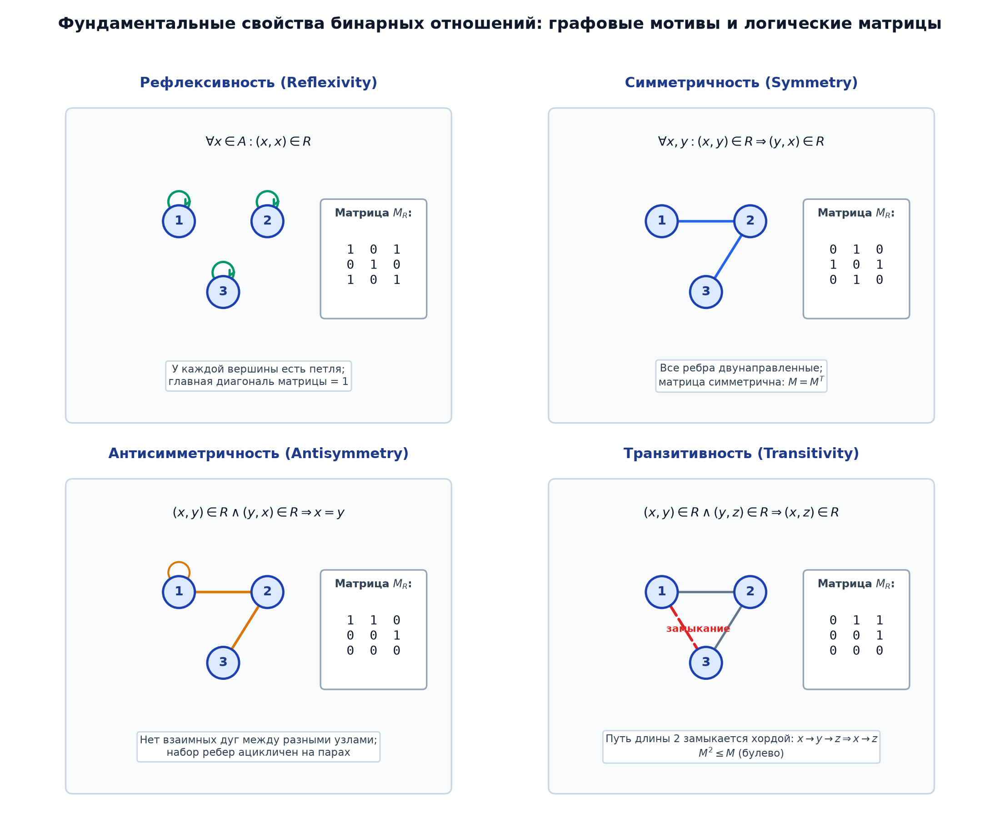

# 📌 Лекция 2: Бинарные отношения, свойства, матрицы отношений и транзитивное замыкание

> [!abstract] О лекции
> - **Дисциплина:** [[Дискретная математика]] (1 семестр)
> - **Лектор:** Константин Чухарев (@Lipen)
> - **Ключевые концепции:** Определение бинарного отношения $R \subseteq A \times B$, отношение на множестве $A$, способы задания (графы, матрицы инцидентности), фундаментальные свойства отношений (рефлексивность, антирефлексивность, симметричность, антисимметричность, асимметричность, транзитивность), композиция отношений $R \circ S$, обратное отношение $R^{-1}$, замыкания отношений (рефлексивное, симметричное, транзитивное), алгоритм Уоршелла (Warshall's Algorithm).

---

## 1. Определение и способы представления отношений

> [!info] Бинарное отношение
> **Бинарным отношением** $R$ между множествами $A$ и $B$ называется любое подмножество их декартова произведения:
> $$R \subseteq A \times B$$
> Если $(a, b) \in R$, то пишут $a \, R \, b$ («$a$ находится в отношении $R$ с $b$»).
> Если $A = B$, то $R \subseteq A^2$ называется **бинарным отношением на множестве $A$**.

### Способы задания отношений (для конечных множеств):
1. **Список пар:** явное перечисление элементов подмножества $R = \{(1, 1), (1, 2), (2, 3)\}$.
2. **Ориентированный граф (Диграф):** вершины — элементы множества $A$, направленная дуга $u \to v$ существует тогда и только тогда, когда $(u, v) \in R$.
3. **Логическая матрица отношения (Матрица смежности):**
   Матрица $M_R$ размера $|A| \times |B|$ над булевым полукольцом $(\{0, 1\}, \lor, \land)$:
   $$M_R[i, j] = \begin{cases} 1, & (a_i, b_j) \in R \\ 0, & (a_i, b_j) \notin R \end{cases}$$

---

## 2. Фундаментальные свойства бинарных отношений на множестве $A$

Пусть $R \subseteq A \times A$. Отношение $R$ может обладать следующими свойствами:

| Свойство | Формальное кванторное определение | Вид на матрице $M_R$ | Вид на графе |
| :--- | :--- | :--- | :--- |
| **Рефлексивность** | $\forall x \in A : (x, x) \in R$ | Главная диагональ состоит только из $1$ | У каждой вершины есть петля |
| **Антирефлексивность** | $\forall x \in A : (x, x) \notin R$ | Главная диагональ состоит только из $0$ | Нет ни одной петли |
| **Симметричность** | $\forall x, y \in A : (x, y) \in R \implies (y, x) \in R$ | Симметричная матрица: $M_R = M_R^T$ | Все дуги взаимные ($u \leftrightarrow v$) |
| **Антисимметричность** | $\forall x, y : (x, y) \in R \land (y, x) \in R \implies x = y$ | Если $i \ne j$, то $M[i,j]$ и $M[j,i]$ не могут быть одновременно $1$ | Нет двусторонних циклов длины 2 |
| **Асимметричность** | $\forall x, y : (x, y) \in R \implies (y, x) \notin R$ | Антисимметричность + антирефлексивность | Нет петель и нет двусторонних ребер |
| **Транзитивность** | $\forall x, y, z : (x, y) \in R \land (y, z) \in R \implies (x, z) \in R$ | $M_R^2 \le M_R$ (в булевом умножении) | Если есть путь $u \to v \to w$, то есть и ребро $u \to w$ |



> [!warning] Важные различия терминов:
> 1. Антирефлексивность — это **не** «отсутствие рефлексивности». Бывают отношения, не являющиеся ни рефлексивными, ни антирефлексивными (где петли есть лишь у некоторых вершин).
> 2. Антисимметричность допускает наличие петель ($(x, x) \in R$), а асимметричность **строго запрещает** любые петли!
>    $$\text{Асимметричность} \iff \text{Антисимметричность} \land \text{Антирефлексивность}$$

---

## 3. Операции над отношениями и композиция

Так как отношения являются множествами, к ним применимы все теоретико-множественные операции:
- Объединение $R \cup S$, пересечение $R \cap S$, разность $R \setminus S$, дополнение $\overline{R} = (A \times B) \setminus R$.

### Обратное отношение ($R^{-1}$)
$$R^{-1} = \{(b, a) \in B \times A \mid (a, b) \in R\}$$
Матрица обратного отношения является транспонированной: $M_{R^{-1}} = M_R^T$.

### Композиция отношений
> [!info] Определение композиции
> Пусть $R \subseteq A \times B$ и $S \subseteq B \times C$. **Композицией отношений** $R \circ S$ (или $S \circ R$ в зависимости от нотации) называется отношение:
> $$R \circ S = \{(a, c) \in A \times C \mid \exists b \in B : (a, b) \in R \land (b, c) \in S\}$$

### Связь с умножением булевых матриц:
$$M_{R \circ S} = M_R \odot M_S$$
где булево произведение матриц определяется через дизъюнкцию конъюнкций:
$$M_{R \circ S}[i, j] = \bigvee_{k} (M_R[i, k] \land M_S[k, j])$$

### Свойства композиции:
1. **Ассоциативность:** $(R \circ S) \circ T = R \circ (S \circ T)$.
2. **Обращение композиции:** $(R \circ S)^{-1} = S^{-1} \circ R^{-1}$.
3. **Критерий транзитивности через композицию:**
   $$R \text{ транзитивно} \iff R \circ R \subseteq R$$

---

## 4. Замыкания отношений и алгоритм Уоршелла

Замыканием отношения $R$ относительно некоторого свойства $P$ называется минимальное отношение $R_P$, содержащее $R$ и обладающее свойством $P$:
1. **Рефлексивное замыкание:** $r(R) = R \cup I_A$, где $I_A = \{(x, x) \mid x \in A\}$ — тождественное отношение (диагональ).
2. **Симметричное замыкание:** $s(R) = R \cup R^{-1}$.
3. **Транзитивное замыкание:**
   $$R^+ = \bigcup_{k=1}^\infty R^k = R \cup R^2 \cup R^3 \cup \dots$$
   Для конечного множества мощности $n$ достаточно взять объединение до $n$-й степени: $R^+ = \bigcup_{k=1}^n R^k$.
4. **Рефлексивно-транзитивное замыкание:** $R^* = R^+ \cup I_A = \bigcup_{k=0}^n R^k$.

### Алгоритм Уоршелла (Warshall's Algorithm) за $O(n^3)$
Вычисляет матрицу транзитивного замыкания $T$ графа на месте методом динамического программирования:

```cpp
void warshall(std::vector<std::vector<bool>>& reach, int n) {
    for (int k = 0; k < n; ++k) {
        for (int i = 0; i < n; ++i) {
            for (int j = 0; j < n; ++j) {
                reach[i][j] = reach[i][j] || (reach[i][k] && reach[k][j]);
            }
        }
    }
}
```

---

## 5. 🔬 Алгебра полуколец Клини и анализ потоков управления

Множество бинарных отношений $\mathcal{P}(X \times X)$ с операциями $\cup$ и $\circ$ образует **полукольцо Клини**.  
Матричное произведение отношений $M_{R \circ S} = M_R \odot M_S$ вычисляется над булевым полукольцом $\langle \{0, 1\}, \vee, \wedge, 0, 1 \rangle$:
$$(M_R \odot M_S)_{i, j} = \bigvee_{k=1}^n ((M_R)_{i, k} \wedge (M_S)_{k, j})$$

> [!example] Научный пример: Анализ достижимости мертвого кода в компиляторах
> Граф потока управления программы $G = (V, E)$ задает бинарное отношение переходов. Рефлексивно-транзитивное замыкание $E^* = \Delta_V \cup E^+$ определяет все достижимые инструкции. Инструкция $w$ является мертвым кодом $\iff (\text{entry}, w) \notin E^*$. Алгоритм Роя-Уоршелла с битовыми шкалами вычисляет $E^*$ за $O(|V|^3/w)$, удаляя недостижимый машинный код.

---

## 🚀 Фундаментальная связь с будущими дисциплинами и технологиями (ИТМО Curriculum)

1. **Реляционные СУБД (Сем 3, 4):**
   - Реляционная алгебра Э. Кодда строится на $n$-арных отношениях, декартовых произведениях и проекциях.
2. **Распределенные вычисления (Сем 7):**
   - Отношение «happened-before» Лэмпорта является строгим частичным порядком, полученным транзитивным замыканием локальных событий и отправки сообщений.

---

## 🔗 Связанные материалы
- [[Дискретная математика]] — главная страница курса
- [[2026-09-09 - Дискретная математика - Лекция 1, высказывания, связки, таблицы истинности, законы логики и следствие]]
- [[2026-09-12 - Дискретная математика - Лекция 3, Отношения эквивалентности, фактор-множества, разбиения и теорема о факторизации]]
- [[2026-09-12 - Дискретная математика - Лекция 4, Отношения частичного и линейного порядка, диаграммы Хассе, цепи, антицепи и решетки]]
