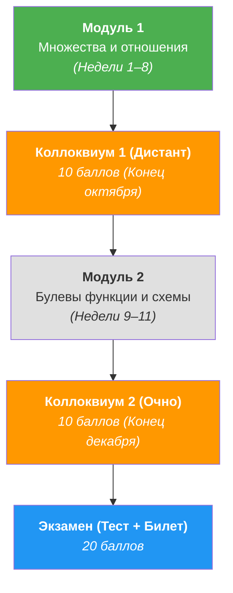

# 🔢 Дискретная математика (1 семестр)

> [!abstract] О предмете
> Фундаментальный теоретический курс дискретной математики для Software Engineering в Университете ИТМО (4 з.е. / 144 акад. часа). Охватывает математическую логику, наивную теорию множеств, бинарные отношения, булевы функции, функциональную полноту, комбинаторику и теорию графов.
> 
> **Преподаватель (лектор):** Константин Чухарев ([@Lipen](https://github.com/Lipen), Университет ИТМО)  
> **Официальный репозиторий курса:** [github.com/Lipen/discrete-math-course](https://github.com/Lipen/discrete-math-course)  
> **Основной учебник:** `book.pdf` (в репозитории курса)  
> 🔗 **Официальное пространство курса:** [Yonote: ITMO DM & AISD Space](https://dm-aisd.yonote.ru/share/itmo_dm_aisd)

---

## 👥 Сетка занятий и расписание потоков

> [!important] Расписание лекций потоков
> - **3 поток:** Вторник, 09:50–11:20, ауд. 1229 — лектор Пермяков Антон Сергеевич
> - **4 поток:** Вторник, 09:50–11:20, ауд. 1419 — лектор Страдина Марина Владимировна
> - **5 поток:** Вторник, 09:50–11:20, ауд. 1229 — лектор Пермяков Антон Сергеевич

---

## ⚖️ Регламент аттестации и баллы БРС (100 баллов)

> [!info] Распределение 100 баллов курса
> - **40 баллов — Практика:**
>   - Контрольные работы (КР) по пройденным модулям.
>   - **Опросники (5–7 минут в начале пары):** краткий теоретический срез по лекциям (2–4 открытых вопроса: дать определение на кванторах, привести пример, сформулировать критерий). Пишутся на листочках, не переписываются. Неразборчивый почерк = 0 баллов.
>   - **Домашние задания:** выдаются практиком, оформляются **строго рукописно от руки на бумаге**. Обязательно подробное решение с указанием теорем и свойств («ну это же очевидно» оценивается в 0).
>   - Устная защита ДЗ менторам/практикам.
> - **20 баллов — Коллоквиумы (2 по 10 баллов):**
>   - *Коллоквиум 1 (10 б.):* 2-я половина октября (дистанционно). Темы: Теория множеств, бинарные отношения. Устный блиц-ответ на 10 случайных вопросов (определения и формулировки теорем).
>   - *Коллоквиум 2 (10 б.):* 2-я половина декабря (очно). Темы: Булева алгебра, кодирование, функциональная полнота.
>   - ⚠️ Пересдавать коллоквиум нельзя (1 попытка).
> - **20 баллов — Типовые расчеты (2 по 10 баллов):**
>   - *Типовик 1 (10 б.):* Выдача в конце сентября. Темы: Теория множеств, бинарные отношения.
>   - *Типовик 2 (10 б.):* Выдача в конце октября. Темы: Булева алгебра, кодирование, функциональная полнота.
>   - Требования: рукописное чистовое оформление на бумаге, дублирование условий + обязательная **очная устная защита** практической части и определений.
> - **20 баллов — Экзамен (2 этапа):**
>   - 1 этап: *Экзаменационный тест-допуск*.
>   - 2 этап: *Очный экзамен по билетам*:
>     - **Экзамен НА ТРИ (3):** Блиц (3 определения из теормина без права на ошибку) + 2–3 практические задачи. Разрешены только рукописные конспекты.
>     - **Экзамен НА ЧЕТЫРЕ И ПЯТЬ (4 и 5):** Блиц-допуск + 40 минут подготовки + полная теория, практические задачи и не менее 2 строгих доказательств теорем.
> 
> 🚨 **Критическое правило Теорминимума:**
> Если студент не преодолел порог теорминимума после двух попыток, его итоговый рейтинг **блокируется на отметке не более 59 баллов (2FX-E)**, и он отправляется на допсессию!

---

## 📝 Список занятий (лекции и практики)

| № | Дата | Тип | Тема занятия | Материалы и слайды | Конспект |
| :---: | :---: | :---: | :--- | :--- | :---: |
| 1 | `2026-09-09` | Лекция | **Высказывания, связки, таблицы истинности, законы логики и следствие** | `s1-lec01-statements.typ` | [Открыть ↗](./2026-09-09%20-%20Дискретная%20математика%20-%20Лекция%201,%20высказывания,%20связки,%20таблицы%20истинности,%20законы%20логики%20и%20следствие.md) |
| 1 | `2026-09-09` | Практика | **Логическое следование, ППФ, выполнимость, логические задачи и силлогизмы** | Лист заданий №1 | [Открыть ↗](./2026-09-09%20-%20Дискретная%20математика%20-%20Практика%201,%20логическое%20следование,%20ППФ,%20выполнимость,%20силлогизмы%20и%20кванторы.md) |

---

## 📖 Программа курса (1 семестр)

---

## 🗺️ Ключевые темы по модулям

### Модуль 1: Множества и бинарные отношения (Недели 1–8)
- ✅ **Лекция 1:** Высказывания, логические связки ($\neg, \land, \lor, \implies, \iff$), таблицы истинности, тавтологии, законы логики, Modus Ponens, теорема дедукции.
- ✅ **Практика 1:** Индуктивное определение ППФ (WFF), семантическое следование $\Gamma \vDash \psi$ и его проверка, опровержение обратного контрпримерами, невыразимость противоречия в $\{\to\}$, совместная выполнимость $\mathrm{Mod}(\Gamma)$, тавтологии импликации $P_i \to Q$, Valid vs Sound, детективная задача, силлогизмы Barbara/Darii и кванторы на $\mathbb{Z}, \mathbb{R}$.
- ⏳ **Лекция 2:** Логика предикатов, кванторы ($\forall, \exists, \exists!$), свободные и связанные переменные, правила отрицания кванторов.
- ⏳ **Лекции 3–4:** Наивная теория множеств, операции над множествами, парадокс Рассела, булеан, декартово произведение, разбиения.
- ⏳ **Лекции 5–6:** Бинарные отношения: рефлексивность, симметричность, антисимметричность, транзитивность. Отношение эквивалентности и фактормножество.
- ⏳ **Лекции 7–8:** Отношения частичного и линейного порядка. Решётки. Отображения, инъекции/сюръекции/биекции, мощности множеств и теорема Кантора.

### Модуль 2: Булева алгебра и булевы функции (Недели 9–11)
- Булевы функции от $n$ переменных, двойственность, самодвойственные функции.
- ДНФ, КНФ, совершенные нормальные формы (СДНФ, СКНФ), полиномы Жегалкина.
- Замкнутые классы Поста ($T_0, T_1, S, M, L$) и теорема Поста о функциональной полноте.

---

## 📚 Рекомендуемая литература

1. **Чухарев К.** — *«Конспект лекций по дискретной математике»* (`book.pdf`), Университет ИТМО. ⭐ **Основной источник**
2. **Верещагин Н. К., Шень А.** — *«Языки и исчисления»* — М.: МЦНМО. (Логика высказываний и предикатов).
3. **Верещагин Н. К., Шень А.** — *«Начала теории множеств»* — М.: МЦНМО.
4. **Новиков Ф. А.** — *«Дискретная математика для программистов»* — СПб.: Питер.
5. **Судоплатов С. В., Овчинникова Е. В.** — *«Элементы дискретной математики»* — М.: ИНФРА-М.
6. **Андерсон Дж. А.** — *«Дискретная математика и комбинаторика»* — М.: Вильямс.

---

> [!abstract] Навигация
> 🏠 [[🏠 Главная]] • 📚 [[README|Каталог 1 семестра]] • ⚡ [[Алгоритмы и структуры данных]]
