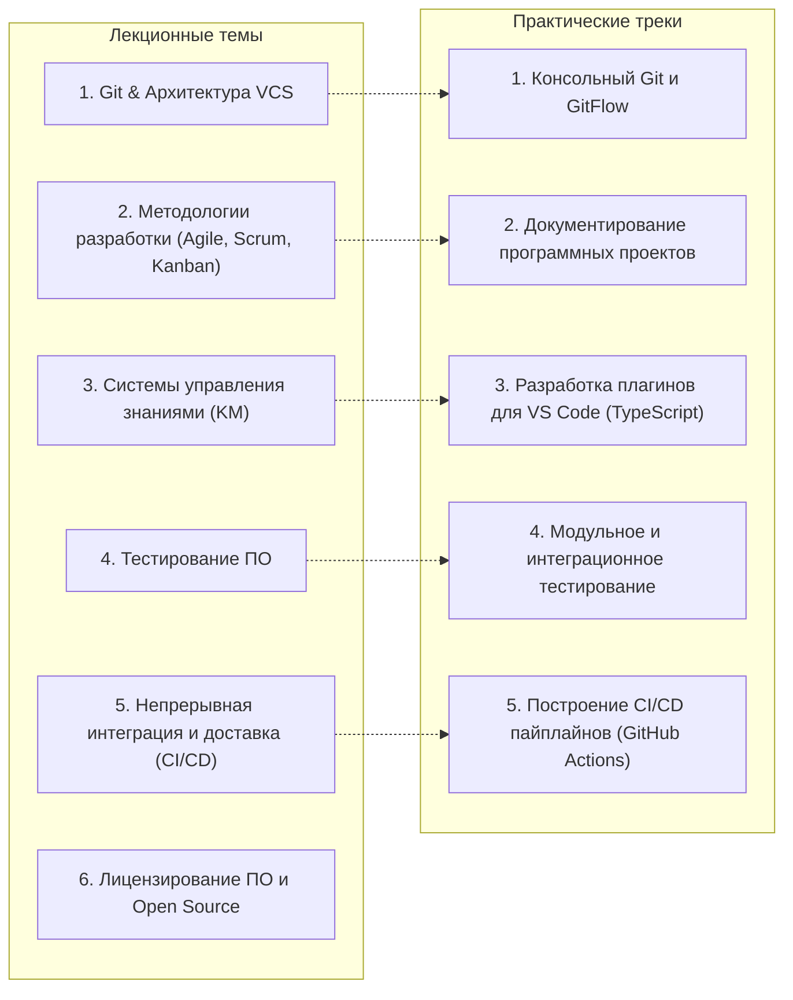

# 🛠️ Инструментальные средства разработки ПО (ИСРПО)

> [!abstract] О дисциплине
> Практико-ориентированный курс кафедры вычислительной техники / программной инженерии ИТМО. Формирует у студентов инженерную культуру и знакомит с базовым промышленным стеком инструментов разработки: от систем контроля версий и расширения IDE до систем управления знаниями, автоматизированного тестирования и CI/CD.
>
> - **Семестр:** 1 семестр (бакалавриат)
> - **Трудоемкость:** 3 зачетные единицы (108 академических часов)
> - **Преподаватель:** Кайнов Руслан Владимирович
> - **Форма контроля:** Дифференцированный зачет (**60+ баллов** для зачета)
> - **Контрольные точки:** 2 рубежные контрольные работы (РК)

---

## 🗺️ Программа курса

---

## 📝 Список занятий и материалов

### 📖 Лекции
- [[2026-09-11 - ИСРПО - Лекция 1, введение в курс, системы контроля версий, архитектура Git и модель GitFlow|Лекция 1: Введение в курс ИСРПО, эволюция систем контроля версий, архитектура Git и модель GitFlow]] *(2026-09-11)*
  - Регламент курса (60+ баллов, 2 РК, разработка плагина для VS Code)
  - Хронология VCS: SCCS (1972) $\to$ RCS (1982) $\to$ CVS (1986) $\to$ SVN & BitKeeper (2000) $\to$ Git & Mercurial (2005)
  - Архитектура Git: Content-Addressable Storage, хэш SHA-1/SHA-256, 4 типа объектов (`blob`, `tree`, `commit`, `tag`), три дерева Git
  - Консольный рабочий процесс, правила гигиены `.gitignore` (только исходный код)
  - Модель ветвления GitFlow (`main`, `develop`, `feature`, `release`, `hotfix`)
  - Аварийное спасение: `git reflog`, `git reset` (`--soft`, `--mixed`, `--hard`), `git revert`

### 💻 Практики
*(Практические занятия будут добавляться по мере проведения)*

---

## 📚 Рекомендуемая литература и ресурсы

- **Скотт Чакон, Бен Штрауб** — *«Pro Git»* (официальная книга по Git, доступна бесплатно на [git-scm.com/book/ru/v2](https://git-scm.com/book/ru/v2))
- **Документация VS Code Extension API** — [code.visualstudio.com/api](https://code.visualstudio.com/api) (руководство по созданию плагинов)
- **Vincent Driessen** — *«A successful Git branching model»* (первоисточник GitFlow)
- **Semantic Versioning 2.0.0** — [semver.org/lang/ru/](https://semver.org/lang/ru/) (спецификация семантического версионирования)
- **Conventional Commits 1.0.0** — [conventionalcommits.org](https://www.conventionalcommits.org/ru/v1.0.0/) (соглашение о структуре коммитов)
