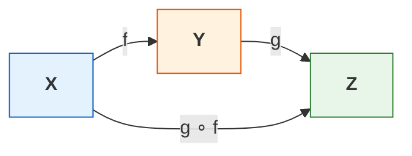
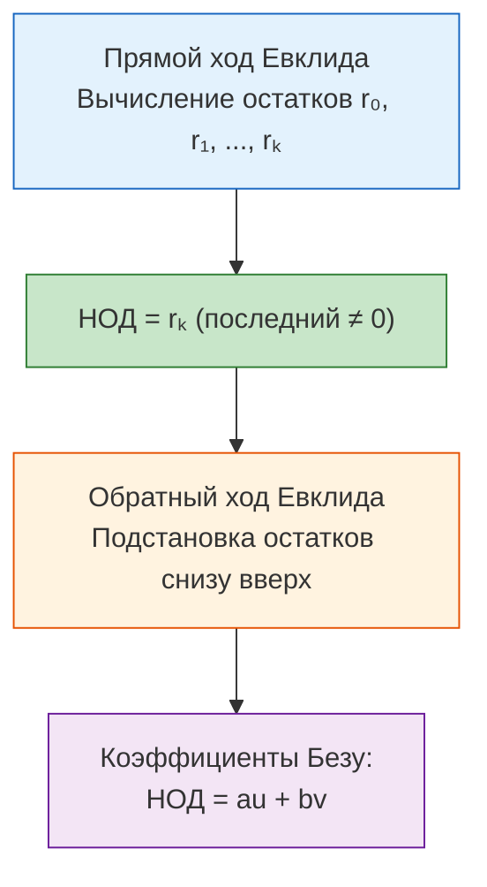

# 📝 Лекция 2: Арифметика в ℤ, деление с остатком, НОД, соотношение Безу и алгоритм Евклида

> **Дата проведения:** `2026-09-10` (2-я неделя)  
> **Предмет:** Линейная алгебра и геометрия / Алгебра-1 (1 семестр, 2026/27 уч. год)  
> **Предыдущая лекция:** [[2026-09-03 - Линейная алгебра - Введение, теория множеств и отображения|Лекция 1: Введение, теория множеств и отображения]]  
> **Предыдущая практика:** [[2026-09-04 - Линейная алгебра - Практика, обратимость, мощности, порядки и лемма Цорна|Практика 1: Обратимость, мощности множеств, порядки и лемма Цорна]]  
> **Хаб дисциплины:** [[Линейная алгебра]]

---

## 🧭 Навигация по лекции

1. [Дополнение к отображениям: композиция и сохранение свойств](#1-дополнение-к-отображениям-композиция-и-сохранение-свойств)
2. [Введение в элементарную теорию чисел: уравнения в ℤ](#2-введение-в-элементарную-теорию-чисел-уравнения-в-z)
3. [Отношение делимости в кольце целых чисел](#3-отношение-делимости-в-кольце-целых-чисел)
   - [Определение делимости](#31-определение-делимости)
   - [Конвенция о нуле: почему 0 делит только 0?](#32-конвенция-о-нуле-почему-0-делит-только-0)
4. [Теорема о делении с остатком](#4-теорема-о-делении-с-остатком)
   - [Формулировка теоремы](#41-формулировка-теоремы)
   - [Доказательство существования (метод математической индукции)](#42-доказательство-существования-метод-математической-индукции)
   - [Доказательство единственности представления](#43-доказательство-единственности-представления)
5. [Наибольший общий делитель (НОД) и соотношение Безу](#5-наибольший-общий-делитель-нод-и-соотношение-безу)
   - [Алгебраическое определение НОД](#51-алгебраическое-определение-нод)
   - [Соотношение Безу: линейное представление НОД](#52-соотношение-безу-линейное-представление-нод)
   - [Доказательство Безу через наименьший положительный элемент идеала](#53-доказательство-безу-через-наименьший-положительный-элемент-идеала)
6. [Алгоритм Евклида](#6-алгоритм-евклида)
   - [Цепочка делений с остатком](#61-цепочка-делений-с-остатком)
   - [Лемма о сохранении НОД](#62-лемма-о-сохранении-нод)
   - [Расширенный алгоритм Евклида (поиск коэффициентов Безу)](#63-расширенный-алгоритм-евклида-поиск-коэффициентов-безу)
7. [Оценка числа шагов: теорема Ламе и числа Фибоначчи](#7-оценка-числа-шагов-теорема-ламе-и-числа-фибоначчи)
   - [Числа Фибоначчи и золотое сечение φ](#71-числа-фибоначчи-и-золотое-сечение-varphi)
   - [Лемма о росте чисел Фибоначчи](#72-лемма-о-росте-чисел-фибоначчи)
   - [Теорема Ламе о логарифмической сложности](#73-теорема-ламе-о-логарифмической-сложности)
8. [Вопросы для самопроверки и коллоквиума](#8-вопросы-для-самопроверки-и-коллоквиума)

---

## 1. Дополнение к отображениям: композиция и сохранение свойств

Перед переходом к арифметике зафиксируем фундаментальные факты об отображениях, связывающие композицию со свойствами её компонентов.

Пусть заданы отображения $f: X \to Y$ и $g: Y \to Z$. Композиция обозначается $(g \circ f): X \to Z$, где $(g \circ f)(x) = g(f(x))$.

> [!important] Теорема: Свойства компонентов композиции
> 1. Если композиция $(g \circ f)$ **инъективна**, то внутреннее отображение $f$ **обязательно инъективно**.
> 2. Если композиция $(g \circ f)$ **сюръективна**, то внешнее отображение $g$ **обязательно сюръективно**.
> 3. Если $(g \circ f)$ **биективна**, то $f$ инъективна, а $g$ сюръективна.

### Строгие доказательства:

**1. Инъективность $g \circ f \implies$ инъективность $f$:**
- Пусть $x_1, x_2 \in X$ таковы, что $f(x_1) = f(x_2)$.
- Применим к обеим частям равенства отображение $g$:
  $$g(f(x_1)) = g(f(x_2)) \iff (g \circ f)(x_1) = (g \circ f)(x_2).$$
- Так как по условию композиция $g \circ f$ инъективна, из равенства образов следует равенство прообразов: $x_1 = x_2$.
- Следовательно, $f$ инъективна. $\blacksquare$

> [!note] Контрпример: почему $g$ не обязана быть инъективной?
> Пусть $X = \{1\}, Y = \{a, b\}, Z = \{*\}$.  
> Зададим $f(1) = a$, и $g(a) = *, g(b) = *$.  
> Тогда $(g \circ f)(1) = *$, композиция очевидно инъективна (и биективна из $\{1\}$ в $\{*\}$). Однако $g$ склеивает элементы $a \neq b$ и потому неинъективна.

**2. Сюръективность $g \circ f \implies$ сюръективность $g$:**
- Возьмём произвольный элемент $z \in Z$.
- Так как $g \circ f$ сюръективна, существует прообраз $x \in X$ такой, что $(g \circ f)(x) = z$.
- По определению композиции: $g(f(x)) = z$.
- Обозначим $y = f(x) \in Y$. Тогда $g(y) = z$.
- Для любого $z \in Z$ найден элемент $y \in Y$, переводящийся в $z$. Значит, $g$ сюръективна. $\blacksquare$

---

## 2. Введение в элементарную теорию чисел: уравнения в ℤ

В курсе линейной алгебры и общей алгебры числовые системы изучаются с точки зрения их алгебраической структуры.  
Рассмотрим простейшее линейное уравнение с одной переменной:
$$ax = b, \quad \text{где } a, b \in \mathbb{K}.$$

- **В поле $\mathbb{Q}$ (или $\mathbb{R}, \mathbb{C}$):** при $a \neq 0$ решение существует всегда и единственно: $x = a^{-1}b = \frac{b}{a}$. Каждый ненулевой элемент обратим.
- **В кольце целых чисел $\mathbb{Z}$:** обратимыми элементами являются только $\pm 1$ ($\mathbb{Z}^\times = \{-1, 1\}$). Поэтому уравнение $ax = b$ разрешимо в целых числах **только тогда, когда $a$ делит $b$**.

Это мотивирует глубокое изучение делимости целых чисел.

---

## 3. Отношение делимости в кольце целых чисел

### 3.1. Определение делимости

> [!definition] Определение: Делимость
> Пусть $a, b \in \mathbb{Z}$. Говорят, что **$a$ делит $b$** (или «$b$ кратно $a$», обозначается $a \mid b$), если:
> $$\exists c \in \mathbb{Z}: \quad b = a \cdot c.$$

**Свойства отношения делимости:**
1. **Рефлексивность:** $\forall a \in \mathbb{Z}: a \mid a$ (так как $a = a \cdot 1$).
2. **Транзитивность:** $a \mid b \land b \mid c \implies a \mid c$ ($b = ak, c = bm \implies c = a(km)$).
3. **Линейность:** если $a \mid b$ и $a \mid c$, то для любых $u, v \in \mathbb{Z}$ выполнено $a \mid (bu + cv)$.

---

### 3.2. Конвенция о нуле: почему 0 делит только 0?

> [!warning] Конвенция о нуле
> $$0 \mid x \iff x = 0$$

**Строгое математическое обоснование:**
- По определению делимости, $0 \mid x$ означает существование $c \in \mathbb{Z}$ такого, что:
  $$x = 0 \cdot c.$$
- В любом кольце умножение любого элемента на ноль даёт ноль: $0 \cdot c = 0$.
- Следовательно, единственным числом $x$, удовлетворяющим этому уравнению, является $x = 0$.
- При этом **любое число $a \in \mathbb{Z}$ делит $0$**, поскольку $0 = a \cdot 0$.  
  Таким образом: $0 \mid 0$ — истина, но $0 \mid 5$ — ложь.

---

## 4. Теорема о делении с остатком

Деление с остатком (деление по Евклиду) — ключевой инструмент дискретной математики, алгоритмов и алгебры.

### 4.1. Формулировка теоремы

> [!important] Теорема: О делении с остатком (Деление по Евклиду)
> Для любых $a, b \in \mathbb{Z}$, где $b \neq 0$, существуют и единственны такие целые числа $q, r \in \mathbb{Z}$, что:
> $$a = bq + r, \quad \text{где} \quad 0 \le r < |b|.$$
> Число $q$ называется **неполным частным**, а $r$ — **остатком**.

---

### 4.2. Доказательство существования (метод математической индукции)

Разобьём доказательство на три последовательных случая в зависимости от знаков $a$ и $b$.

#### Случай 1: $a \ge 0, \; b > 0$ (доказательство по индукции по $a$)
- **База индукции ($a < b$):**  
  Если $0 \le a < b$, то полагаем $q = 0, r = a$.  
  Тогда $a = b \cdot 0 + a$, причём условие $0 \le r < b$ выполнено автоматически.
- **Индукционный переход ($a \ge b$):**  
  Предположим, что теорема верна для всех неотрицательных чисел, строго меньших $a$.  
  Рассмотрим число $a' = a - b$. Так как $a \ge b$, то $0 \le a' < a$.  
  По индукционному предположению для числа $a'$ существуют $q', r' \in \mathbb{Z}$ такие, что:
  $$a - b = bq' + r', \quad \text{где } 0 \le r' < b.$$
  Прибавим $b$ к обеим частям равенства:
  $$a = b(q' + 1) + r'.$$
  Положив $q = q' + 1$ и $r = r'$, получаем корректное представление числа $a$ с остатком $0 \le r < b$.  
  По принципу математической индукции существование для всех $a \ge 0, b > 0$ доказано.

#### Случай 2: $a < 0, \; b > 0$ (сведение к положительному числу)
- Если $a < 0$, то число $-a > 0$. Применим к нему результат Случая 1:
  $$-a = b q_0 + r_0, \quad \text{где } 0 \le r_0 < b.$$
- Умножим обе части равенства на $-1$:
  $$a = -b q_0 - r_0 = b(-q_0) - r_0.$$
- Разберём два подслучая в зависимости от остатка $r_0$:
  1. Если $r_0 = 0$, то $a = b(-q_0) + 0$. Полагаем $q = -q_0, r = 0$. Условие $0 \le r < b$ соблюдено.
  2. Если $r_0 > 0$, то $1 \le r_0 < b \implies -1 \ge -r_0 > -b$.  
     Преобразуем выражение, вычтя и прибавив $b$:
     $$a = b(-q_0) - b + (b - r_0) = b(-q_0 - 1) + (b - r_0).$$
     Положим:
     $$q = -q_0 - 1, \quad r = b - r_0.$$
     Так как $0 < r_0 < b$, то $0 < b - r_0 < b$, то есть $0 \le r < b$. Существование доказано!

> [!example] Пример деления отрицательного числа
> Разделим $a = -17$ на $b = 5$:  
> $-17 = 5 \cdot (-4) + 3$, где остаток $r = 3 \in [0, 5)$.  
> *(Внимание: запись $-17 = 5 \cdot (-3) - 2$ неверна, так как остаток не может быть отрицательным!)*

#### Случай 3: $b < 0$
- Положим $b' = -b = |b| > 0$.
- По доказанному выше существуют $q', r$ такие, что:
  $$a = b' q' + r = (-b) q' + r = b(-q') + r, \quad \text{где } 0 \le r < b' = |b|.$$
- Полагаем $q = -q'$. Существование доказано в общем виде для любых $a \in \mathbb{Z}, b \neq 0$. $\blacksquare$

---

### 4.3. Доказательство единственности представления

Допустим, существуют два различных представления числа $a$:
$$a = bq + r = b\tilde{q} + \tilde{r}, \quad \text{где } 0 \le r, \tilde{r} < |b|.$$
Перенесём слагаемые с $b$ влево, а остатки вправо:
$$b(q - \tilde{q}) = \tilde{r} - r.$$
Возьмём абсолютную величину обеих частей:
$$|b| \cdot |q - \tilde{q}| = |\tilde{r} - r|.$$

- **Случай 1:** $q = \tilde{q}$.  
  Тогда $|b| \cdot 0 = 0 \implies |\tilde{r} - r| = 0 \implies r = \tilde{r}$. Представления совпадают.
- **Случай 2:** $q \neq \tilde{q}$.  
  Так как $q, \tilde{q} \in \mathbb{Z}$, то $|q - \tilde{q}| \ge 1$.  
  Следовательно, левая часть неравенства удовлетворяет:
  $$\text{LHS} = |b| \cdot |q - \tilde{q}| \ge |b| \cdot 1 = |b|.$$
  Однако, поскольку $0 \le r < |b|$ и $0 \le \tilde{r} < |b|$, разность двух чисел из полуинтервала $[0, |b|)$ строго меньше длины интервала:
  $$\text{RHS} = |\tilde{r} - r| < |b|.$$
  Получаем противоречивую цепочку:
  $$|b| \le \text{LHS} = \text{RHS} < |b| \implies |b| < |b|,$$
  что невозможно.

Следовательно, предположение $q \neq \tilde{q}$ неверно. Всегда $q = \tilde{q}$ и $r = \tilde{r}$. Единственность доказана! $\blacksquare$

---

## 5. Наибольший общий делитель (НОД) и соотношение Безу

### 5.1. Алгебраическое определение НОД

В школьной математике НОД определяется через порядок («самый большой среди делителей»). В высшей алгебре НОД определяется **через отношение делимости**.

> [!definition] Алгебраическое определение НОД
> Пусть $a, b \in \mathbb{Z}$. Число $d \in \mathbb{Z}$ называется **наибольшим общим делителем** чисел $a$ и $b$ (обозначается $\gcd(a, b)$ или $(a, b)$), если:
> 1. $d \mid a$ и $d \mid b$ ($d$ является общим делителем);
> 2. Для любого другого общего делителя $d'$ выполняется:
>    $$d' \mid a \land d' \mid b \implies d' \mid d.$$

> [!note] О точности до знака
> Если $d$ удовлетворяет определению НОД, то $-d$ также ему удовлетворяет (делители одни и те же).  
> Поэтому в $\mathbb{Z}$ НОД определён **с точностью до умножения на обратимый элемент (знак $\pm 1$)**. По общепринятому соглашению выбирают неотрицательное значение: $d \ge 0$.  
> В частности: $\gcd(a, 0) = |a|$, $\gcd(0, 0) = 0$.

---

### 5.2. Соотношение Безу: линейное представление НОД

> [!important] Теорема: Соотношение Безу (Тождество Безу)
> Пусть $a, b \in \mathbb{Z}$ (не равные нулю одновременно).  
> Тогда $\gcd(a, b)$ существует, и существуют такие целые коэффициенты $u, v \in \mathbb{Z}$, что:
> $$\gcd(a, b) = a \cdot u + b \cdot v$$
> Числа $u, v$ называются **коэффициентами Безу**.

---

### 5.3. Доказательство Безу через наименьший положительный элемент идеала

Докажем теорему конструктивным алгебраическим методом через рассмотрение линейных комбинаций.

Рассмотрим множество всех целых линейных комбинаций чисел $a$ и $b$:
$$S = \{au + bv \mid u, v \in \mathbb{Z}\}.$$

1. **Непустота положительной части:**  
   Так как $a$ и $b$ не равны нулю одновременно, в множестве $S$ гарантированно есть строго положительные элементы.  
   Например, если $a \neq 0$, то взяв $u = \mathrm{sgn}(a)$ и $v = 0$, получаем $a \cdot \mathrm{sgn}(a) = |a| > 0 \in S$.  
   Следовательно, множество $S_{>0} = S \cap \mathbb{N}$ не пусто.
2. **Выбор минимального элемента:**  
   По **принципу наименьшего элемента** (аксиома вполне упорядоченности множества $\mathbb{N}$), в непустом подмножестве $S_{>0}$ существует **наименьший элемент**. Обозначим его:
   $$d = a u_0 + b v_0 \in S_{>0}.$$
3. **Докажем, что $d \mid a$:**  
   Разделим $a$ на $d$ с остатком:
   $$a = dq + r, \quad \text{где } 0 \le r < d.$$
   Выразим остаток $r$, подставив выражение для $d$:
   $$r = a - dq = a - (a u_0 + b v_0)q = a(1 - u_0 q) + b(-v_0 q).$$
   Видим, что $r$ также имеет вид линейной комбинации $au + bv$, следовательно, $r \in S$!  
   Если предположить, что $r > 0$, то $r$ является положительным элементом $S$, строго меньшим $d$ ($r < d$). Но $d$ выбирался как *наименьший* положительный элемент $S$! Противоречие.  
   Следовательно, $r = 0$, а значит $a = dq$, то есть $d \mid a$.
4. **Докажем, что $d \mid b$:**  
   Абсолютно аналогично делим $b$ на $d$ с остатком и получаем $d \mid b$.
5. **Докажем свойство максимума (пункт 2 определения НОД):**  
   Пусть $d'$ — произвольный общий делитель $a$ и $b$, то есть $a = d' k_1$ и $b = d' k_2$.  
   Тогда:
   $$d = a u_0 + b v_0 = (d' k_1)u_0 + (d' k_2)v_0 = d'(k_1 u_0 + k_2 v_0).$$
   Отсюда непосредственно следует, что $d' \mid d$.

Все пункты определения выполнены: $d = \gcd(a, b)$ и представим в виде $a u_0 + b v_0$. $\blacksquare$

---

## 6. Алгоритм Евклида

Теорема Безу гарантирует существование $\gcd(a, b)$ и коэффициентов, но не дает эффективного рецепта их нахождения. Таким рецептом является **Алгоритм Евклида**.

### 6.1. Цепочка делений с остатком

Без ограничения общности положим $a \ge b > 0$ (так как $\gcd(a, b) = \gcd(|a|, |b|)$).  
Выполняем последовательное деление с остатком:
$$\begin{aligned}
a &= b q_0 + r_0, \quad &0 \le r_0 < b \\
b &= r_0 q_1 + r_1, \quad &0 \le r_1 < r_0 \\
r_0 &= r_1 q_2 + r_2, \quad &0 \le r_2 < r_1 \\
&\ \ \vdots \\
r_{k-2} &= r_{k-1} q_k + r_k, \quad &0 \le r_k < r_{k-1} \\
r_{k-1} &= r_k q_{k+1} + 0.
\end{aligned}$$

Последовательность остатков строго убывает в целых неотрицательных числах:
$$b > r_0 > r_1 > r_2 > \dots > r_k > r_{k+1} = 0.$$
Так как число целых чисел на отрезке $[0, b]$ конечно, процесс обязан завершиться за конечное число шагов $k+1$.

---

### 6.2. Лемма о сохранении НОД

> [!lemma] Лемма: Сохранение НОД при делении с остатком
> Если $a = bq + r$, то:
> $$\gcd(a, b) = \gcd(b, r)$$

**Доказательство:**
- Обозначим $d_1 = \gcd(a, b)$ и $d_2 = \gcd(b, r)$.
- Так как $d_1 \mid a$ и $d_1 \mid b$, то $d_1$ делит линейную комбинацию $r = a - bq$. Значит, $d_1$ является общим делителем $b$ и $r$. По определению НОД: $d_1 \mid d_2$.
- Наоборот: так как $d_2 \mid b$ и $d_2 \mid r$, то $d_2$ делит $a = bq + r$. Значит, $d_2$ является общим делителем $a$ и $b$. По определению НОД: $d_2 \mid d_1$.
- Так как $d_1 \mid d_2$ и $d_2 \mid d_1$, а оба числа положительны, получаем $d_1 = d_2$. $\blacksquare$

**Вывод:**
$$\gcd(a, b) = \gcd(b, r_0) = \gcd(r_0, r_1) = \dots = \gcd(r_{k-1}, r_k) = \gcd(r_k, 0) = \mathbf{r_k}.$$

> [!important] Итог алгоритма Евклида
> **Наибольший общий делитель двух чисел равен последнему ненулевому остатку в алгоритме Евклида:**
> $$\gcd(a, b) = r_k$$

---

### 6.3. Расширенный алгоритм Евклида (поиск коэффициентов Безу)

Двигаясь по цепочке равенств алгоритма Евклида **снизу вверх**, можно выразить остаток $r_k$ через предыдущие остатки и в итоге через исходные $a$ и $b$:
$$r_k = r_{k-2} - r_{k-1} q_k = \dots = a \cdot u + b \cdot v.$$

---

## 7. Оценка числа шагов: теорема Ламе и числа Фибоначчи

Сколько шагов (делений) делает алгоритм Евклида? Оказывается, алгоритм Евклида работает поразительно быстро (логарифмическое время), а его худший случай связан с **числами Фибоначчи**!

### 7.1. Числа Фибоначчи и золотое сечение φ

Последовательность Фибоначчи определяется рекуррентно:
$$f_0 = 0, \quad f_1 = 1, \quad f_{n+1} = f_n + f_{n-1} \quad (\forall n \ge 1).$$
Первые члены: $0, 1, 1, 2, 3, 5, 8, 13, 21, 34, 55, 89, \dots$

Характеристическое уравнение рекуррентности:
$$x^2 - x - 1 = 0 \implies \varphi = \frac{1 + \sqrt{5}}{2} \approx 1.6180339887\dots$$
Ключевое тождество: $\varphi^2 = \varphi + 1$.

---

### 7.2. Лемма о росте чисел Фибоначчи

> [!lemma] Лемма
> Для всех целых неотрицательных $n \ge 0$:
> $$f_{n+2} \ge \varphi^n$$

**Доказательство (по математической индукции):**
- **База индукции:**
  - При $n = 0$: $f_2 = 1 \ge \varphi^0 = 1$. Верно!
  - При $n = 1$: $f_3 = 2 \ge \varphi^1 \approx 1.618$. Верно!
- **Индукционный переход:**  
  Пусть неравенство верно для всех значений до $n$ включительно. Докажем для $n+1$:
  $$f_{(n+1)+2} = f_{n+3} = f_{n+2} + f_{n+1}.$$
  Применяем предположение индукции:
  $$f_{n+2} + f_{n+1} \ge \varphi^n + \varphi^{n-1} = \varphi^{n-1}(\varphi + 1).$$
  Используя тождество $\varphi + 1 = \varphi^2$:
  $$\varphi^{n-1}(\varphi + 1) = \varphi^{n-1} \cdot \varphi^2 = \varphi^{n+1}.$$
  Следовательно, $f_{n+3} \ge \varphi^{n+1}$. Переход доказан. $\blacksquare$

---

### 7.3. Теорема Ламе о логарифмической сложности

> [!important] Теорема Ламе (Gabriel Lamé, 1844)
> Пусть $0 < b \le a \le N$.  
> Тогда число делений с остатком в алгоритме Евклида для пары $(a, b)$ не превосходит:
> $$1 + \log_\varphi(N) \approx 1 + 4.785 \log_{10}(N)$$
> Иными словами, число шагов алгоритма Евклида не превосходит **пятикратного количества десятичных знаков меньшего числа**!

**Доказательство:**
Рассмотрим алгоритм Евклида с $k+1$ делениями:
$$\begin{aligned}
a &= b q_0 + r_0 \\
b &= r_0 q_1 + r_1 \\
r_0 &= r_1 q_2 + r_2 \\
&\ \ \vdots \\
r_{k-2} &= r_{k-1} q_k + r_k \\
r_{k-1} &= r_k q_{k+1} + 0
\end{aligned}$$

Все неполные частные $q_i \ge 1$. Кроме того, так как $r_{k-1} > r_k > 0$, на последнем шаге частное $q_{k+1} = \frac{r_{k-1}}{r_k} \ge 2$.  
Оценим остатки снизу:
- $r_k \ge 1 = f_2$;
- $r_{k-1} = q_{k+1} r_k \ge 2 \cdot 1 = 2 = f_3$;
- $r_{k-2} = q_k r_{k-1} + r_k \ge 1 \cdot r_{k-1} + r_k \ge f_3 + f_2 = f_4$;
- $\dots$
- По индукции: $r_{k-i} \ge f_{i+2}$;
- Для $i = k$: $b = r_0 \ge f_{k+2}$.

Применяя лемму о росте чисел Фибоначчи:
$$N \ge b \ge f_{k+2} \ge \varphi^k.$$
Логарифмируя обе части по основанию $\varphi$:
$$k \le \log_\varphi(N) = \frac{\ln N}{\ln \varphi}.$$
Общее число делений равно $k + 1 \le 1 + \log_\varphi(N)$.  
Так как $\frac{1}{\log_{10} \varphi} = \frac{1}{\log_{10} 1.618} \approx 4.785 < 5$, то $k \le 5 \cdot (\text{число цифр числа } b)$. $\blacksquare$

> [!tip] Худший случай алгоритма Евклида
> Худшим случаем для алгоритма Евклида являются **соседние числа Фибоначчи** $(f_{n+1}, f_n)$, так как для них все неполные частные строго равны единице ($q_i = 1$).

---

## 8. Вопросы для самопроверки и коллоквиума

1. **Почему утверждение $0 \mid 0$ истинно, а $0 \mid 7$ ложно?**
   > [!quote]- Показать ответ
   > По определению делимости $a \mid b \iff \exists c \in \mathbb{Z}: b = a \cdot c$. Для $a = 0, b = 0$ равенство $0 = 0 \cdot c$ выполнено при любом $c \in \mathbb{Z}$. Для $a = 0, b = 7$ равенство $7 = 0 \cdot c = 0$ невозможно.

2. **Как найти неполное частное и остаток при делении $a = -23$ на $b = 7$?**
   > [!quote]- Показать ответ
   > По теореме дедукции $0 \le r < 7$. Ближайшее кратное 7, меньшее либо равное $-23$, это $-28 = 7 \cdot (-4)$. Тогда $-23 = 7 \cdot (-4) + 5$. Неполное частное $q = -4$, остаток $r = 5$.

3. **В чём заключается идея доказательства соотношения Безу через наименьший элемент?**
   > [!quote]- Показать ответ
   > Рассматривается множество всех линейных комбинаций $S = \{au + bv \mid u, v \in \mathbb{Z}\}$. В его положительной части выбирается наименьший элемент $d$. Если бы $d$ не делил $a$, то остаток $r = a \pmod d$ был бы строго положительным элементом множества $S$, меньшим $d$, что противоречит минимальности $d$. Значит, $d$ делит $a$ и $b$, и любой общий делитель делит $d$.

4. **Какова асимптотическая сложность алгоритма Евклида?**
   > [!quote]- Показать ответ
   > Сложность алгоритма логарифмическая: $O(\log(\min(a, b)))$. По теореме Ламе число шагов ограничено $1 + \log_\varphi(\min(a, b))$.

---

---

## 6. 🔬 Продвинутая теория чисел: Теорема Ламе и Китайская теорема об остатках

### Сложность алгоритма Евклида: Теорема Ламе
> [!theorem] Теорема Габриэля Ламе (Lamé's Theorem, 1844)
> Число делений с остатком при вычислении $\gcd(a, b)$ для $a > b > 0$ по алгоритму Евклида не превосходит пятикратного числа десятичных цифр меньшего числа $b$:
> $$N_{\text{steps}} \le 5 \log_{10} b = O(\log b)$$
> Худшим случаем алгоритма Евклида являются два последовательных числа Фибоначчи: $a = F_{n+1}, b = F_n$, для которых на каждом шаге частное $q_k = 1$, а остаток равен $F_{n-1}$.

---

### Китайская теорема об остатках (Chinese Remainder Theorem, CRT)
> [!theorem] Китайская теорема об остатках (Алгебраическая формулировка)
> Пусть $m_1, m_2, \dots, m_k$ — попарно взаимно простые натуральные числа ($\gcd(m_i, m_j) = 1$ при $i \neq j$), и $M = \prod_{i=1}^k m_i$.  
> Тогда система сравнений:
> $$\begin{cases} x \equiv a_1 \pmod{m_1} \\ x \equiv a_2 \pmod{m_2} \\ \dots \\ x \equiv a_k \pmod{m_k} \end{cases}$$
> имеет единственное решение по модулю $M$:
> $$x = \sum_{i=1}^k a_i M_i M_i^{-1} \pmod{M}$$
> где $M_i = M / m_i$, а $M_i^{-1}$ — мультипликативный обратный к $M_i$ по модулю $m_i$ ($M_i M_i^{-1} \equiv 1 \pmod{m_i}$).
> Более того, отображение редукции задает изоморфизм колец:
> $$\mathbb{Z}/M\mathbb{Z} \cong \mathbb{Z}/m_1\mathbb{Z} \times \mathbb{Z}/m_2\mathbb{Z} \times \dots \times \mathbb{Z}/m_k\mathbb{Z}$$

---

### 💡 Научный пример: Система остаточных классов (СОК / RNS) в параллельных процессорах
> [!example] Научный пример: Безпереносная арифметика над сверхдлинными числами
> В традиционных АЛУ сложение и умножение 1024-битных чисел ограничены распространением бита переноса (Carry Propagation Delay).  
> **Инженерное решение через CRT:**  
> Выберем набор попарно простых модулей $m_1, \dots, m_{32}$, помещающихся в 32-битное машинное слово, с $M = \prod m_i > 2^{1024}$.  
> Любое 1024-битное число $X$ представляется кортежем остатков $(r_1, \dots, r_{32})$, где $r_i = X \bmod m_i$.  
> Сложение и умножение чисел выполняются **параллельно на 32 независимых ядрах CPU/FPGA без каких-либо межпоточных блокировок и переносов**:
> $$(X \star Y)_i = (r_i \star r_i') \bmod m_i, \quad \star \in \{+, \times\}$$
> Восстановление результата в позиционную систему производится в конце по формуле CRT. Это используется в аппаратных криптографических процессорах и алгоритмах обработки больших данных.

---

## 🚀 Фундаментальная связь с будущими дисциплинами и технологиями (ИТМО Curriculum)

1. **Криптографические алгоритмы и Защита информации (Сем 3, 8):**
   - Алгоритм Евклида лежит в основе генерации ключей в криптосистеме RSA (вычисление закрытой экспоненты $d = e^{-1} \bmod \varphi(N)$) и алгоритма цифровой подписи ECDSA.
2. **Квантовые вычисления (Сем 7):**
   - Квантовый алгоритм Шора находит порядок элемента в мультипликативной группе $\mathbb{Z}_N^*$, взламывая RSA за полиномиальное время $O((\log N)^3)$ благодаря свойствам цепных дробей, эквивалентных расширенному алгоритму Евклида.

> [!abstract] Навигация
> ⬅️ [[2026-09-03 - Линейная алгебра - Введение, теория множеств и отображения|Лекция 1: Введение, множества и отображения]] • ➡️ [[Линейная алгебра|Хаб линейной алгебры]]  
> 🏠 [[🏠 Главная]] • 📚 [[README|Каталог конспектов]]
