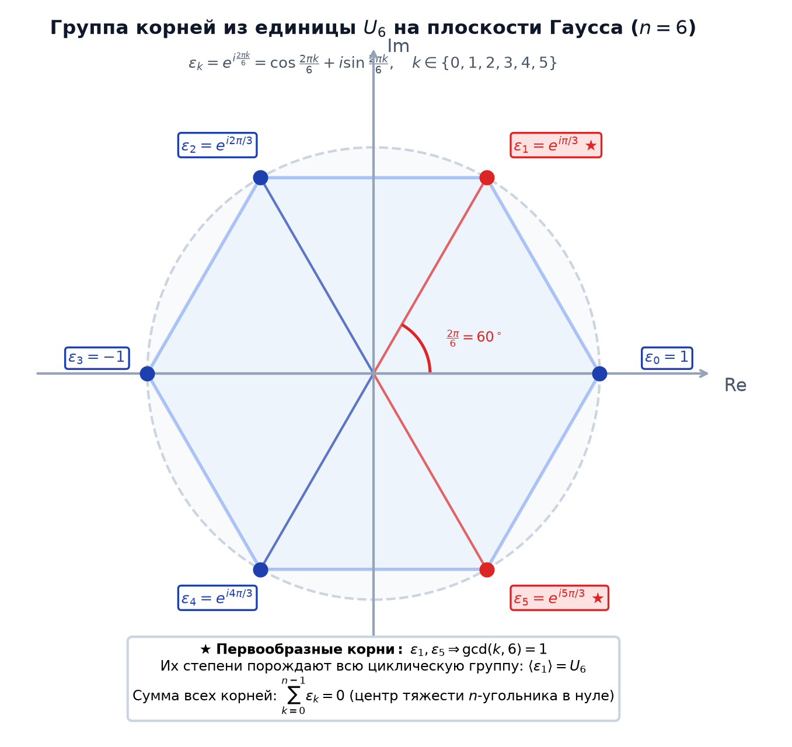

# 📌 Лекция 3: Комплексные числа, формы записи, формула Муавра и корни из единицы

> [!abstract] О лекции
> - **Дисциплина:** [[Линейная алгебра]] (1 семестр)
> - **Ключевые концепции:** Поле комплексных чисел $\mathbb{C}$, мнимая единица $i^2 = -1$, алгебраическая форма $z = x + iy$, сопряжение, тригонометрическая и показательная (эйлерова) формы, модуль $|z|$ и аргумент $\operatorname{Arg}(z)$, геометрическая интерпретация на плоскости Гаусса, умножение и деление комплексных чисел, формула Муавра, вычисление корней $n$-й степени из комплексного числа, группа корней из единицы $U_n$, первообразные корни.

---

## 1. Алгебраическая форма комплексных чисел

> [!info] Определение
> Множество комплексных чисел $\mathbb{C}$ — это поле упорядоченных пар действительных чисел $(x, y) \in \mathbb{R}^2$ с операциями:
> - Сложение: $(x_1, y_1) + (x_2, y_2) = (x_1 + x_2, y_1 + y_2)$
> - Умножение: $(x_1, y_1) \cdot (x_2, y_2) = (x_1 x_2 - y_1 y_2, x_1 y_2 + x_2 y_1)$

Вводя мнимую единицу $i = (0, 1)$, для которой $i^2 = (0, 1) \cdot (0, 1) = (-1, 0) = -1$, любое комплексное число однозначно записывается в **алгебраической форме**:
$$z = x + i y \quad (x, y \in \mathbb{R})$$
- $x = \operatorname{Re}(z)$ — действительная часть (Real part).
- $y = \operatorname{Im}(z)$ — мнимая часть (Imaginary part).

### Комплексное сопряжение:
Число $\bar{z} = x - i y$ называется **комплексно-сопряженным** к $z$.
Свойства сопряжения:
1. $\overline{z_1 \pm z_2} = \bar{z}_1 \pm \bar{z}_2$
2. $\overline{z_1 \cdot z_2} = \bar{z}_1 \cdot \bar{z}_2$
3. $z \cdot \bar{z} = (x + iy)(x - iy) = x^2 + y^2 = |z|^2 \ge 0$
4. Обратный элемент: $z^{-1} = \frac{\bar{z}}{|z|^2} = \frac{x - iy}{x^2 + y^2}$.

---

## 2. Геометрическая, тригонометрическая и показательная формы

Каждому числу $z = x + iy$ сопоставляется точка на декартовой плоскости (комплексной плоскости Гаусса) с координатами $(x, y)$ или радиус-вектор:

```mermaid
graph LR
    subgraph Комплексная плоскость Гаусса
        O["(0, 0)"] -->|r = |z|| P["z = x + iy = r(cos φ + i sin φ)"]
        O -->|x = Re(z)| X["Ось Re"]
        O -->|y = Im(z)| Y["Ось Im"]
    end
```

### Полярные координаты:
- **Модуль:** $r = |z| = \sqrt{x^2 + y^2} \ge 0$.
- **Главный аргумент:** $\varphi = \operatorname{arg}(z) \in (-\pi, \pi]$ (или $[0, 2\pi)$):
  $$\operatorname{arg}(z) = \begin{cases} \operatorname{arctg}(y/x), & x > 0 \\ \operatorname{arctg}(y/x) + \pi, & x < 0, y \ge 0 \\ \operatorname{arctg}(y/x) - \pi, & x < 0, y < 0 \\ \pi/2, & x = 0, y > 0 \\ -\pi/2, & x = 0, y < 0 \end{cases}$$

### Формы записи:
1. **Тригонометрическая форма:**
   $$z = r (\cos \varphi + i \sin \varphi)$$
2. **Показательная форма (формула Эйлера $e^{i\varphi} = \cos \varphi + i \sin \varphi$):**
   $$z = r e^{i \varphi}$$

### Умножение и деление:
При умножении комплексных чисел **модули перемножаются, а аргументы складываются**:
$$z_1 \cdot z_2 = (r_1 e^{i\varphi_1}) \cdot (r_2 e^{i\varphi_2}) = (r_1 r_2) e^{i(\varphi_1 + \varphi_2)}$$
$$\frac{z_1}{z_2} = \left(\frac{r_1}{r_2}\right) e^{i(\varphi_1 - \varphi_2)}$$

---

## 3. Формула Муавра

> [!important] Теорема (Формула Муавра)
> Для любого натурального $n \in \mathbb{N}$ и любого действительного $\varphi$:
> $$(\cos \varphi + i \sin \varphi)^n = \cos(n\varphi) + i \sin(n\varphi)$$
> В показательной форме: $(r e^{i\varphi})^n = r^n e^{i n \varphi}$.

---

## 4. Корни $n$-й степени из комплексного числа

> [!important] Теорема (Об извлечении корней)
> Для любого ненулевого комплексного числа $z = r e^{i\varphi}$ существует ровно $n$ различных комплексных корней $n$-й степени:
> $$w_k = \sqrt[n]{z} = \sqrt[n]{r} \left(\cos \frac{\varphi + 2\pi k}{n} + i \sin \frac{\varphi + 2\pi k}{n}\right), \quad k = 0, 1, 2, \dots, n-1$$

### Геометрический смысл:
Все $n$ корней лежат на окружности радиуса $\sqrt[n]{r}$ с центром в начале координат и образуют вершины **правильного $n$-угольника**!



### Группа корней из единицы ($U_n$):
При $z = 1$ ($r = 1, \varphi = 0$):
$$\varepsilon_k = \cos \frac{2\pi k}{n} + i \sin \frac{2\pi k}{n} = e^{i \frac{2\pi k}{n}}, \quad k = 0, 1, \dots, n-1$$
Множество $U_n = \{\varepsilon_0, \dots, \varepsilon_{n-1}\}$ образует циклическую группу по умножению порядка $n$.

> [!info] Первообразный (примитивный) корень
> Корень $\varepsilon_k$ называется **первообразным корнем $n$-й степени**, если его степени порождают всю группу $U_n$:
> $$\langle \varepsilon_k \rangle = U_n \iff \gcd(k, n) = 1$$
> Количество первообразных корней равно функции Эйлера $\varphi(n)$.

---

## 5. 🔬 Алгебраическая структура $\mathbb{C}$, круговые многочлены и БПФ

### Алгебраическое построение поля $\mathbb{C}$
Поле комплексных чисел строится как фактор-кольцо:
$$\mathbb{C} \cong \mathbb{R}[x] / \langle x^2 + 1 \rangle$$
Матричная модель реализует $\mathbb{C}$ через матрицы поворота и масштабирования:
$$a + bi \mapsto \begin{pmatrix} a & -b \\ b & a \end{pmatrix}, \quad \det \begin{pmatrix} a & -b \\ b & a \end{pmatrix} = a^2 + b^2 = |z|^2$$

---

### Круговые многочлены и алгоритм БПФ Кули-Тьюки
Многочлены деления круга $\Phi_n(x) = \prod_{\gcd(k, n) = 1} (x - e^{i \frac{2\pi k}{n}})$ неприводимы над $\mathbb{Q}$.  
Матрица дискретного преобразования Фурье $\mathcal{F}_n = \frac{1}{\sqrt{n}} (\omega_n^{j k})_{j, k=0}^{n-1}$ осуществляет переход между коэффициентами многочлена и его значениями. Алгоритм Кули-Тьюки за счет симметрии корней $(\omega_n^{k + n/2})^2 = \omega_{n/2}^k$ вычисляет преобразование за $O(n \log n)$, позволяя перемножать числа из миллиона цифр за доли секунды.

---

## 🚀 Фундаментальная связь с будущими дисциплинами и технологиями (ИТМО Curriculum)

1. **Обработка сигналов и Компьютерное зрение (Сем 4, 6):**
   - 2D-FFT лежит в основе сжатия JPEG, фильтрации радиосигналов и сверточных слоев нейросетей.
2. **Компьютерная графика (Сем 5):**
   - Комплексные числа обобщаются до кватернионов Гамильтона $\mathbb{H}$, используемых для интерполяции 3D-вращений в игровых движках (Unreal Engine).

---

## 🔗 Связанные материалы
- [[Линейная алгебра]] — страница дисциплины
- [[2026-09-03 - Линейная алгебра - Введение, теория множеств и отображения]]
- [[2026-09-12 - Линейная алгебра - Лекция 4, Кольцо многочленов, теорема Безу, схема Горнера и Основная теорема алгебры]]
- [[2026-09-12 - Линейная алгебра - Лекция 5, Векторные пространства, линейная зависимость, базис и размерность]]
