# 📐 Линейная алгебра: Лекция 6 (15.09.2026)
## Вещественные числа: аксиоматика, полнота, сечения Дедекинда, морфизмы, архимедовость, последовательности и неравенство Бернулли

> [!abstract] Навигация по конспекту
> **Как устроен этот конспект:**
> Высшая алгебра и математический анализ начинаются с фундаментального вопроса: *что такое вещественное число?*
> Ответ строится двумя путями:
> 1. **Аксиоматически (разделы 3–7):** мы не говорим, «из чего сделаны» числа, а формулируем строгий свод законов, которым они подчиняются. Всё, что им подчиняется, называется *полным упорядоченным полем*.
> 2. **Конструктивно (раздел 9):** мы берём уже известные рациональные числа $\mathbb{Q}$ и конструируем из них $\mathbb{R}$ через сечения Дедекинда (нижние множества).
>
> Фундаментальная **теорема об изоморфизме (раздел 10)** доказывает, что оба подхода приводят к единственному с точностью до изоморфизма математическому объекту — числовой прямой $\mathbb{R}$. На этом фундаменте строго доказываются принцип Архимеда, теория пределов и неравенство Бернулли.
>
> **Цветовая кодировка блоков:**
> - 🟦 **Синий (`[!definition]`):** Строгие математические определения с кванторами.
> - 🟪 **Фиолетовый (`[!theorem]`):** Формулировки теорем, лемм и критериев.
> - ⬜ **Серый (`[!proof]`):** Полные доказательства без пропусков рассуждений.
> - 🟩 **Зелёный (`[!example]`):** Численные примеры, вычисления и разборы задач.
> - 🟧 **Оранжевый (`[!tip]`):** Интуитивные аналогии из реальной жизни.
> - 🟥 **Красный (`[!danger]`):** Типичные ловушки, контрпримеры и частые ошибки на экзаменах.

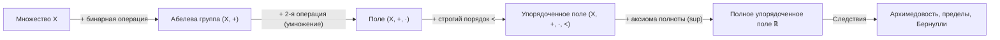

---

## 2. Язык теории множеств: строгий минимум

### 2.1. Символика и кванторы

| Символ | Читается | Строгий математический пример |
| :---: | :--- | :--- |
| $x \in A$ | $x$ принадлежит $A$ | $2 \in \mathbb{N}, \quad \sqrt{2} \notin \mathbb{Q}$ |
| $A \subset B$ | $A$ — подмножество $B$ | $\mathbb{N} \subset \mathbb{Z} \subset \mathbb{Q} \subset \mathbb{R} \subset \mathbb{C}$ |
| $A \cup B, \ A \cap B$ | объединение, пересечение | $[0, 2] \cap [1, 3] = [1, 2]$ |
| $A \setminus B$ | разность множеств | $\mathbb{R} \setminus \mathbb{Q}$ — иррациональные числа |
| $A \times B$ | декартово произведение (пары) | $\mathbb{R} \times \mathbb{R} = \mathbb{R}^2$ — координатная плоскость |
| $\forall$ | для любого (квантор всеобщности) | $\forall x \in \mathbb{R}: \ x^2 \ge 0$ |
| $\exists$ | существует (квантор существования) | $\exists x \in \mathbb{R}: \ x^2 = 2$ |
| $\exists!$ | существует ровно один (единственность) | $\exists! x \in \mathbb{R}: \ x + 5 = 7$ |
| $\implies, \iff$ | влечет (следует), равносильно | $x > 2 \implies x^2 > 4$ |

> [!danger] ⚠️ Критическая ловушка: порядок кванторов
> - $\forall x \ \exists y : y > x$ — *«для каждого числа найдётся большее число»* (**истина** в $\mathbb{R}$).
> - $\exists y \ \forall x : y > x$ — *«существует число, превосходящее вообще все числа»* (**ложь** в $\mathbb{R}$).
>
> Перестановка двух кванторов полностью переворачивает смысл утверждения! Все базовые понятия анализа ($\sup, \inf, \lim$) держатся исключительно на строгом порядке кванторов.

> [!tip] 💡 Аналогия: ключ и замок
> - $\forall \text{ замок } \exists \text{ ключ}$ — *«у каждого замка есть свой ключ»* (обычная связка ключей от квартир).
> - $\exists \text{ ключ } \forall \text{ замок}$ — *«существует один универсальный ключ, открывающий абсолютно любой замок»* (отмычка).

### 2.2. Отображения (инъекция, сюръекция, биекция)

> [!definition] Отображение
> Отображение $f: X \to Y$ сопоставляет каждому элементу $x \in X$ ровно один элемент $f(x) \in Y$:
> - **Инъекция («разные в разные»):** $x_1 \neq x_2 \implies f(x_1) \neq f(x_2)$.
> - **Сюръекция («всё покрыто»):** $\forall y \in Y \ \exists x \in X: f(x) = y$.
> - **Биекция (взаимно однозначное соответствие):** инъекция и сюръекция одновременно. У биекции существует корректно определённое обратное отображение $f^{-1}: Y \to X$.

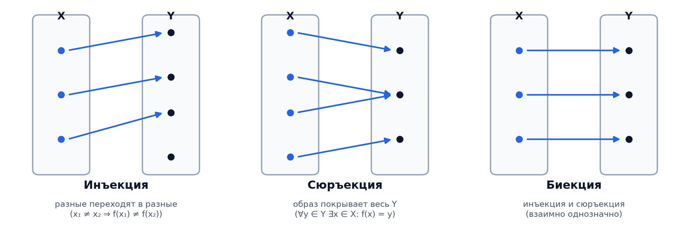

> [!tip] 💡 Аналогия: гардероб в театре
> - **Инъекция:** Каждому сданному пальто достаётся отдельный крючок (два разных пальто никогда не вешают на один крючок).
> - **Сюръекция:** На абсолютно каждом крючке висит пальто (свободных крючков не осталось).
> - **Биекция:** Выданы все номерки, и на каждом крючке строго по одному пальто. По номерку однозначно находится пальто, а по пальто — номерок.

> [!example] Зависимость свойств от области задания
> - $f(x) = x^2, \ f: \mathbb{R} \to \mathbb{R}$ — **не инъекция** ($f(-2) = f(2) = 4$) и **не сюръекция** (отрицательные числа не покрыты).
> - $f(x) = x^2, \ f: [0, +\infty) \to [0, +\infty)$ — **биекция**, обратное отображение $f^{-1}(x) = \sqrt{x}$.
>
> *Вывод:* Свойства отображения зависят не только от аналитической формулы, но и от областей определения и значений!

### 2.3. Бинарная операция против бинарного отношения

- **Бинарная операция на $X$:** отображение $*: X \times X \to X$. Берём два элемента множества — получаем третий элемент **того же** множества ($2 + 3 = 5 \in \mathbb{N}$).
- **Бинарное отношение на $X$:** подмножество пар $\rho \subseteq X \times X$. Отношение не создаёт новые элементы, а отвечает «да/нет» на вопрос: верно ли, что $x \ \rho \ y$? (Например, $2 < 5$ — «да», $5 < 2$ — «нет»).

---

## 3. Группы и абелевы группы

> [!definition] Группа и абелева группа
> Множество $G$ с бинарной операцией $*$ называется **группой** $(G, *)$, если:
> 1. **(G1) Ассоциативность:** $\forall a, b, c \in G: \ (a * b) * c = a * (b * c)$;
> 2. **(G2) Существование нейтрального элемента:** $\exists e \in G \ \forall a \in G: \ a * e = e * a = a$;
> 3. **(G3) Существование обратного элемента:** $\forall a \in G \ \exists a^{-1} \in G: \ a * a^{-1} = a^{-1} * a = e$.
>
> Если дополнительно выполнена **коммутативность** ($a * b = b * a$), группа называется **абелевой** (в честь Нильса Хенрика Абеля).

> [!tip] 💡 Аналогия: коммутативность
> - **Абелево (коммутативно):** положить в рюкзак яблоко, потом грушу — результат тот же, что положить сначала грушу, потом яблоко.
> - **Не абелево (некоммутативно):** надеть носки, потом ботинки $\neq$ надеть ботинки, потом носки. Вращения граней кубика Рубика не коммутируют: поворот верхней грани, затем правой даёт совсем другое состояние, чем поворот правой, затем верхней!

### Сравнительная таблица числовых и геометрических систем

| Множество, операция | (G1) Ассоциативность | (G2) Нейтраль | (G3) Обратный | Коммутативность | Итог |
| :--- | :---: | :---: | :---: | :---: | :--- |
| $(\mathbb{Z}, +)$ | да | $0$ | $-a$ | да | **Абелева группа** |
| $(\mathbb{N}, +)$ | да | нет $0$ | нет | да | не группа (полугруппа) |
| $(\mathbb{Q} \setminus \{0\}, \cdot)$ | да | $1$ | $1/a$ | да | **Абелева группа** |
| $(\mathbb{Z} \setminus \{0\}, \cdot)$ | да | $1$ | нет ($1/2 \notin \mathbb{Z}$) | да | не группа |
| $(\mathbb{R}_{>0}, \cdot)$ | да | $1$ | $1/a$ | да | **Абелева группа** |
| Повороты квадрата вокруг центра | да | $0^\circ$ | поворот на $-k \cdot 90^\circ$ | да | **Абелева группа** ($\mathbb{Z}_4$) |
| Симметрии правильного треугольника | да | тождественное | обратное движение | **нет** | **Неабелева группа** ($D_3 \cong S_3$) |

> [!example] Пример: Таблица Кэли группы вычетов $\mathbb{Z}_3 = \{0, 1, 2\}$ по сложению
> Операция сложения по модулю 3:
>
> | $+$ | 0 | 1 | 2 |
> | :---: | :---: | :---: | :---: |
> | **0** | 0 | 1 | 2 |
> | **1** | 1 | 2 | 0 |
> | **2** | 2 | 0 | 1 |
>
> *Свойства:* нейтральный элемент равен $0$. Обратный к $1$ — это $2$ (т.к. $1 + 2 = 3 \equiv 0 \pmod 3$). Таблица строго симметрична относительно главной диагонали, что подтверждает коммутативность.

> [!theorem] Единственность нейтрального и обратного элементов
> В любой группе $(G, *)$:
> 1. Нейтральный элемент единственен.
> 2. Обратный элемент к каждому фиксированному элементу единственен.

> [!proof]
> 1. Пусть $e$ и $e'$ — нейтральные элементы. Тогда $e = e * e'$ (т.к. $e'$ нейтрален) и $e * e' = e'$ (т.к. $e$ нейтрален). Отсюда $e = e'$.
> 2. Пусть $b$ и $c$ — обратные к $a$. Тогда $b = b * e = b * (a * c) = (b * a) * c = e * c = c$. $\blacksquare$

---

## 4. Поле: четыре действия без ограничений

> [!definition] Поле
> Множество $F$ с двумя операциями $+$ и $\cdot$ называется **полем**, если:
> 1. **(A) $(F, +)$ — абелева группа** с нейтральным элементом $0$ и противоположным $-x$;
> 2. **(M) $(F \setminus \{0\}, \cdot)$ — абелева группа** с нейтральным элементом $1 \neq 0$ и обратным $x^{-1}$;
> 3. **(D) Дистрибутивность умножения относительно сложения:**
>    $$x \cdot (y + z) = x \cdot y + x \cdot z$$

| Свойство | По сложению ($+$) | По умножению ($\cdot$) |
| :--- | :--- | :--- |
| **Ассоциативность** | $(x + y) + z = x + (y + z)$ | $(xy)z = x(yz)$ |
| **Коммутативность** | $x + y = y + x$ | $xy = yx$ |
| **Нейтральный элемент** | $x + 0 = x$ | $x \cdot 1 = x, \quad 1 \neq 0$ |
| **Обратный элемент** | $x + (-x) = 0$ | $x \neq 0 \implies x \cdot x^{-1} = 1$ |
| **Связующий мост** | \multicolumn{2}{c|}{**Дистрибутивность:** $x(y + z) = xy + xz$} |

> [!tip] 💡 Аналогия: поле и четыре действия
> Поле — это математическое пространство, где можно свободно выполнять все 4 действия арифметики (сложение, вычитание, умножение, деление на ненулевые элементы) и никогда не вылететь за границы множества. Дистрибутивность — это фундаментальный «клей» между сложением и умножением: без неё это были бы две изолированные игры на одном множестве.

> [!theorem] Строгие следствия аксиом поля (Арифметика без договоренностей)
> В любом поле $F$:
> 1. $0 \cdot x = 0$;
> 2. $(-1) \cdot x = -x$;
> 3. $(-x)(-y) = xy$ *(«минус на минус даёт плюс»)*;
> 4. $xy = 0 \implies x = 0 \lor y = 0$ *(отсутствие делителей нуля)*.

> [!proof]
> 1. $0 \cdot x = (0 + 0) \cdot x = 0 \cdot x + 0 \cdot x$. Прибавим $-(0 \cdot x)$ к обеим частям: $0 = 0 \cdot x$.
> 2. $x + (-1)x = 1 \cdot x + (-1)x = (1 + (-1))x = 0 \cdot x = 0$. Значит, элемент $(-1)x$ является противоположным к $x$. По единственности противоположного $(-1)x = -x$.
> 3. $(-x)(-y) = [(-1)x][(-1)y] = (-1)(-1)xy$. Но по предыдущему свойству $(-1)(-1) = -(-1) = 1$. Значит, $(-x)(-y) = 1 \cdot xy = xy$.
> 4. Пусть $xy = 0$ и $x \neq 0$. Тогда существует $x^{-1}$. Умножим: $y = 1 \cdot y = (x^{-1}x)y = x^{-1}(xy) = x^{-1} \cdot 0 = 0$. $\blacksquare$

---

## 5. Порядок: строгий линейный порядок и трихотомия

> [!definition] Строгий линейный порядок
> Бинарное отношение $<$ на множестве $X$ называется **строгим линейным порядком**, если:
> 1. **Антирефлексивность (иррефлексивность):** $\forall x \in X: \ x \nless x$;
> 2. **Транзитивность:** $\forall x, y, z \in X: \ (x < y \land y < z) \implies x < z$;
> 3. **Закон трихотомии:** $\forall x, y \in X$ истинно ровно одно из трёх:
>    $$x < y \quad \lor \quad x = y \quad \lor \quad y < x$$

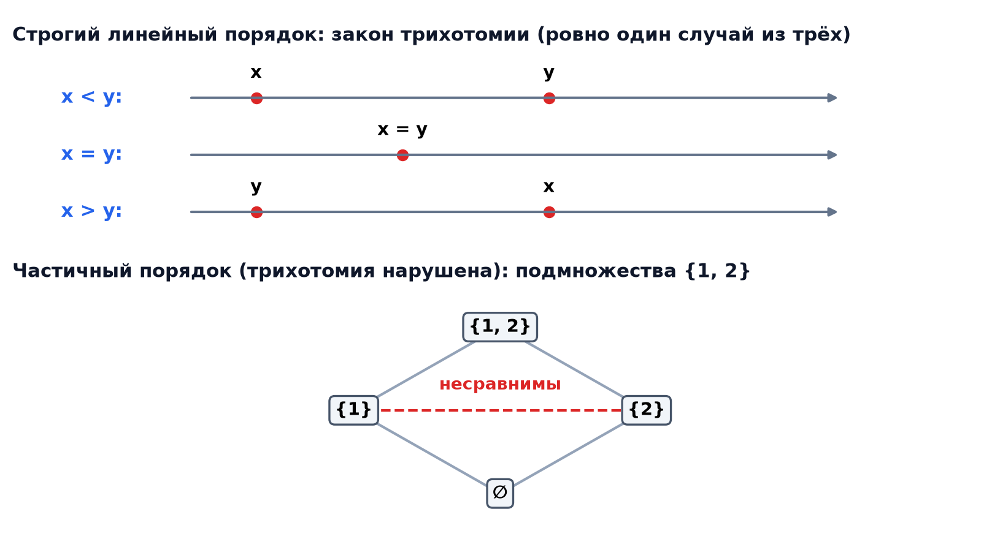

> [!example] Пример частичного порядка, где трихотомия нарушена
> На подмножествах $\{1, 2\}$ рассмотрим отношение строгого включения $A \subsetneq B$:
> Множества $\{1\}$ и $\{2\}$ несравнимы: $\{1\} \not\subset \{2\}$, $\{2\} \not\subset \{1\}$ и $\{1\} \neq \{2\}$. Закон трихотомии нарушен — это *частичный*, а не линейный порядок.

> [!definition] Упорядоченное поле
> Поле $F$ со строгим линейным порядком $<$ называется **упорядоченным полем**, если выполнены две аксиомы согласованности:
> - **(O1) Монотонность сложения:** $x < y \implies x + z < y + z$;
> - **(O2) Сохранение знака произведения:** $(0 < x \land 0 < y) \implies 0 < xy$.

> [!theorem] Фундаментальные свойства порядка
> 1. $x < y \land z > 0 \implies xz < yz$;
> 2. $x < y \land z < 0 \implies xz > yz$ *(при умножении на отрицательное знак переворачивается)*;
> 3. $\forall x \neq 0: \ x^2 > 0$;
> 4. $1 > 0$.

> [!proof]
> 1. Из $x < y$ по (O1) следует $0 < y - x$. По (O2) умножим на $z > 0$: $0 < z(y - x) = zy - zx$. Прибавим $zx$: $zx < zy$.
> 2. Если $z < 0$, то по (O1) $-z > 0$. Тогда по пункту 1: $x(-z) < y(-z) \implies -xz < -yz \implies yz < xz$.
> 3. Если $x > 0$, то $x^2 = x \cdot x > 0$ по (O2). Если $x < 0$, то $-x > 0$, тогда $x^2 = (-x)(-x) > 0$.
> 4. Так как $1 \neq 0$, то $1 = 1^2 > 0$. $\blacksquare$

> [!danger] ⚠️ Комплексные числа $\mathbb{C}$ и конечные поля $\mathbb{Z}_p$ упорядочить нельзя!
> 1. **В поле $\mathbb{C}$:** мнимая единица $i \neq 0$. Если бы $\mathbb{C}$ было упорядоченным, то по теореме $i^2 > 0 \implies -1 > 0$. Но $1 > 0 \implies -1 < 0$. Противоречие с трихотомией! Поэтому выражение *$«2 + 3i > 1 + i»$ не имеет никакого математического смысла*.
> 2. **В поле $\mathbb{Z}_p$:** из $1 > 0$ следовало бы $0 < 1 < 1+1 < \dots < \underbrace{1 + \dots + 1}_{p \text{ раз}} = 0 \implies 0 < 0$.

---

## 6. Ограниченность, супремум и инфимум

> [!definition] Грани множеств
> Пусть $A \subset \mathbb{R}, \ A \neq \emptyset$:
> - $M$ — **верхняя грань** (мажоранта), если $\forall a \in A: a \le M$. Множество всех верхних граней обозначается $U(A)$.
> - $m$ — **нижняя грань** (миноранта), если $\forall a \in A: m \le a$. Множество всех нижних граней обозначается $L(A)$.
> - **Супремум (точная верхняя грань):** $\sup A = \min U(A)$ — наименьшая среди всех верхних граней.
> - **Инфимум (точная нижняя грань):** $\inf A = \max L(A)$ — наибольшая среди всех нижних граней.
> - $\max A$ — верхняя грань, принадлежащая самому множеству $A$. Если $\sup A \in A$, то $\sup A = \max A$.

> [!tip] 💡 Разрешение парадокса: «Как верхняя грань может быть наименьшим элементом?»
> Путаница исчезает, если понять: речь идёт о двух совершенно разных множествах!
> - По отношению к множеству $A$ супремум — это **граница сверху** (все элементы $A$ не больше него).
> - Но если собрать все верхние границы в отдельное множество $U(A)$, то супремум — это **самый маленький элемент** этого нового множества.

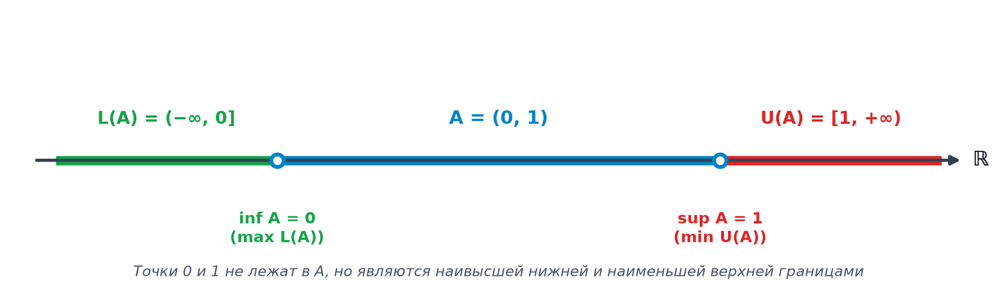

> [!tip] 💡 Аналогия: дверной проём и скорость света
> - **Дверной проём:** Рост учеников в классе от 158 до 185 см. Верхние границы — это все двери, в которые ученики проходят не пригибаясь: 185 см, 190 см, 200 см... Супремум — самая низкая из подходящих дверей (185 см). Она наименьшая среди дверей, но ограничивает сверху весь класс.
> - **Скорость света:** Множество скоростей массивных частиц — $[0, c)$. Супремум равен $c$. Но максимума нет: как бы быстро частица ни летела, всегда можно разогнаться чуть быстрее, не достигая $c$. *Супремум — это предел возможностей, максимум — реально достигнутая точка.*

### Сводная таблица примеров

| Множество $A$ | $U(A)$ | $\sup A$ | $\max A$ | $\inf A$ | $\min A$ |
| :--- | :---: | :---: | :---: | :---: | :---: |
| $[0, 1]$ | $[1, +\infty)$ | $1$ | $1$ | $0$ | $0$ |
| $(0, 1)$ | $[1, +\infty)$ | $1$ | нет | $0$ | нет |
| $\{1/n : n \in \mathbb{N}\} = \{1, 1/2, 1/3, \dots\}$ | $[1, +\infty)$ | $1$ | $1$ | $0$ | нет |
| $\{(-1)^n + 1/n\}$ | $[3/2, +\infty)$ | $3/2$ | $3/2$ | $-1$ | нет |
| $\mathbb{N} = \{1, 2, 3, \dots\}$ | $\emptyset$ | нет ($+\infty$) | нет | $1$ | $1$ |
| $\{x \in \mathbb{R} : x^2 < 2\}$ | $[\sqrt{2}, +\infty)$ | $\sqrt{2}$ | нет | $-\sqrt{2}$ | нет |
| $\{x \in \mathbb{Q} : x^2 < 2\}$ *(внутри $\mathbb{Q}$)* | $\{q \in \mathbb{Q} : q > 0, q^2 > 2\}$ | **нет в $\mathbb{Q}$** | нет | **нет в $\mathbb{Q}$** | нет |

> [!theorem] Рабочий $\varepsilon$-критерий супремума и инфимума
> Число $s \in \mathbb{R}$ является $\sup A$ тогда и только тогда, когда:
> 1. $\forall a \in A: a \le s$ *(условие мажоранты — крыша)*;
> 2. $\forall \varepsilon > 0 \ \exists a \in A: a > s - \varepsilon$ *(условие неулучшаемости — при опускании крыши хоть на миллиметр под ней найдётся точка)*.
>
> Для инфимума $i = \inf A$: $\forall a \in A: a \ge i \quad \land \quad \forall \varepsilon > 0 \ \exists a \in A: a < i + \varepsilon$.

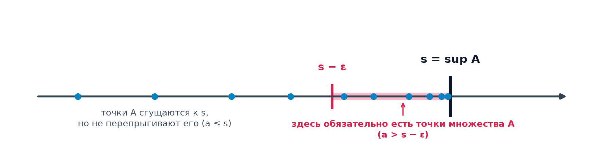

---

## 7. Полнота: две формы аксиомы и сечения

> [!definition] Две формы аксиомы полноты
> - **Форма супремума:** Всякое непустое ограниченное сверху подмножество $A \subset \mathbb{R}$ имеет супремум в $\mathbb{R}$.
> - **Форма Дедекинда (аксиома отделимости):** Если непустые подмножества $A, B \subset \mathbb{R}$ таковы, что $\forall a \in A, b \in B: a \le b$, то:
>   $$\exists c \in \mathbb{R}: \quad a \le c \le b \quad \forall a \in A, b \in B$$

> [!theorem] Эквивалентность двух форм
> В любом упорядоченном поле: аксиома супремума $\iff$ аксиома Дедекинда.

> [!proof]
> - $(\implies)$ Пусть выполнена форма супремума. Множество $A$ непусто и ограничено сверху любым $b \in B$. Положим $c = \sup A$. Тогда $a \le c$ для всех $a \in A$. Поскольку каждое $b \in B$ — верхняя грань, а $c$ — наименьшая, то $c \le b$. Разделяющая точка $c$ найдена.
> - $(\impliedby)$ Пусть выполнена форма Дедекинда. Пусть $A \neq \emptyset$ ограничено сверху. Множество всех его верхних граней $B = U(A) \neq \emptyset$. По построению $a \le b$ для всех $a \in A, b \in B$. По аксиоме Дедекинда найдётся $c$ такое, что $a \le c \le b$. Неравенство $a \le c$ означает, что $c \in U(A)$. Неравенство $c \le b$ означает, что $c$ меньше или равен любой верхней грани. Следовательно, $c = \min U(A) = \sup A$. $\blacksquare$

### Классификация сечений и виды упорядоченных множеств

| Ситуация в сечении $X = A \sqcup B$ | Есть $\max A$? | Есть $\min B$? | Название | Пример в множествах |
| :---: | :---: | :---: | :--- | :--- |
| 1 | да | да | **Скачок** | $\mathbb{Z}: A = \{\dots, 2, 3\}, B = \{4, 5, \dots\}$ |
| 2 | да | нет | **Нормальное сечение** | $\mathbb{R}: A = (-\infty, 1], B = (1, +\infty)$ |
| 3 | нет | да | **Нормальное сечение** | $\mathbb{R}: A = (-\infty, 1), B = [1, +\infty)$ |
| 4 | **нет** | **нет** | **Щель («дырка»)** | $\mathbb{Q}: A = \{q : q < 0 \lor q^2 < 2\}, B = \{q > 0 : q^2 > 2\}$ |

> [!tip] 💡 Аналогия: лестница, решето и канат
> - $\mathbb{Z}$ — **лестница:** между ступеньками пустота (скачки), но сами ступени дискретны и цельны.
> - $\mathbb{Q}$ — **решето:** дырочки сколь угодно малы и плотны повсюду, но числовая ось вся в микроскопических «дырах».
> - $\mathbb{R}$ — **сплошной канат:** где его ни разрежь, лезвие гарантированно рассечёт ровно одно конкретное вещественное число.

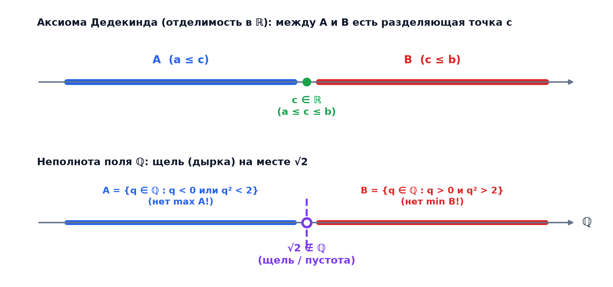

---

## 8. Конструктивное доказательство неполноты $\mathbb{Q}$

Рассматривается множество $A = \{x \in \mathbb{Q} \mid x^2 < 2\}$.

> [!theorem] Шаг вверх: у $A$ нет наибольшего элемента
> Пусть $x \in A, x \ge 0$, то есть $x^2 < 2$. Подберём такое рациональное $\varepsilon > 0$, чтобы $(x + \varepsilon)^2 < 2$.
> Ограничивая $\varepsilon \le 1$:
> $$(x + \varepsilon)^2 = x^2 + 2x\varepsilon + \varepsilon^2 \le x^2 + \varepsilon(2x + 1) < 2 \iff \varepsilon < \frac{2 - x^2}{2x + 1}$$
> Выбираем с запасом:
> $$\varepsilon = \frac{2 - x^2}{2x + 2} \in \mathbb{Q}_{>0}$$
> Тогда $s = x + \varepsilon \in \mathbb{Q}$ удовлетворяет $s^2 < 2$ и $s > x$. Значит, наибольшего элемента в $A$ нет!

### Численный шаг приближения к $\sqrt{2}$ снизу

| $x$ | $2 - x^2$ | $\varepsilon = \frac{2 - x^2}{2x + 2}$ | $s = x + \varepsilon$ | $s^2$ |
| :---: | :---: | :---: | :---: | :---: |
| $1$ | $1$ | $0{,}25$ | $1{,}25$ | $1{,}5625 < 2$ |
| $1{,}4$ | $0{,}04$ | $0{,}008333\dots$ | $1{,}408333\dots$ | $1{,}98340\dots < 2$ |
| $1{,}41$ | $0{,}0119$ | $0{,}0024689\dots$ | $1{,}4124689\dots$ | $1{,}99507\dots < 2$ |
| $1{,}414$ | $0{,}000604$ | $0{,}00012510\dots$ | $1{,}4141251\dots$ | $1{,}99975\dots < 2$ |

> [!theorem] Шаг вниз и метод Ньютона-Герона
> Если $x \in \mathbb{Q}_{>0}$ и $x^2 > 2$, положим $\varepsilon = \frac{x^2 - 2}{2x} > 0$. Тогда:
> $$x - \varepsilon = \frac{1}{2}\left(x + \frac{2}{x}\right)$$
> Это знаменитый **алгоритм Герона**, скорость удвоения верных знаков которого квадратична:
> $$2 \to 1{,}5 \to 1{,}41667 \to 1{,}4142157 \to 1{,}41421356237$$

---

## 9. Построение $\mathbb{R}$ через сечения Дедекинда

> [!definition] Сечение Дедекинда
> Подмножество $\alpha \subset \mathbb{Q}$ называется **сечением** (вещественным числом), если:
> 1. **(S1)** $\alpha \neq \emptyset$ и $\alpha \neq \mathbb{Q}$;
> 2. **(S2) Замкнутость вниз:** если $p \in \alpha$ и $q < p$, то $q \in \alpha$;
> 3. **(S3) Отсутствие максимума:** $\forall p \in \alpha \ \exists r \in \alpha: r > p$.
>
> Множество вещественных чисел определяется как множество всех сечений: $\mathbb{R} := \{\alpha \subset \mathbb{Q} \mid \alpha \text{ — сечение}\}$.

> [!danger] ⚠️ Зачем строго необходимо условие (S3)?
> Без условия (S3) числу $1$ соответствовали бы два разных подмножества: $\{p < 1\}$ и $\{p \le 1\}$. Запрет наибольшего элемента гарантирует взаимооднозначное соответствие чисел и открытых лучей влево.

> [!theorem] Главное чудо Дедекинда: полнота как объединение
> Пусть $\mathcal{A}$ — семейство сечений, ограниченное сверху сечением $\gamma$. Тогда:
> $$\sup \mathcal{A} = \bigcup_{\alpha \in \mathcal{A}} \alpha$$
> *Супремум в модели Дедекинда — это обычное теоретико-множественное объединение! Полнота получается абсолютно бесплатно.*

---

## 10. Морфизмы и теорема о единственности $\mathbb{R}$

> [!definition] Морфизм
> **Морфизм** (греч. *morphé* — форма) — это отображение между математическими системами, сохраняющее их структуру.
> - **Мономорфизм:** инъективный гомоморфизм (структурное *вложение*, копия $X$ внутри $Y$).
> - **Эпиморфизм:** сюръективный гомоморфизм (*накрытие* всего $Y$).
> - **Изоморфизм:** биективный гомоморфизм ($X \cong Y$, объекты неотличимы с точностью до переименования).
> - **Эндоморфизм:** гомоморфизм в себя ($X \to X$).
> - **Автоморфизм:** изоморфизм в себя ($X \xrightarrow{\sim} X$, внутренняя *симметрия* структуры).

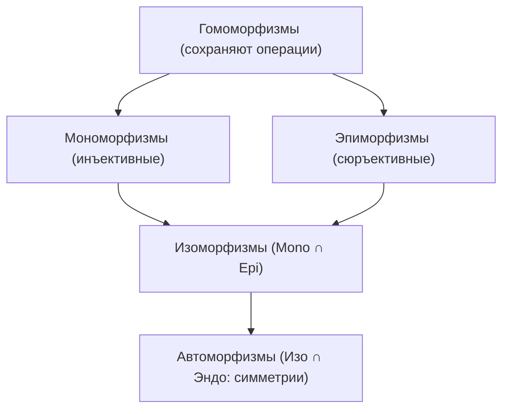

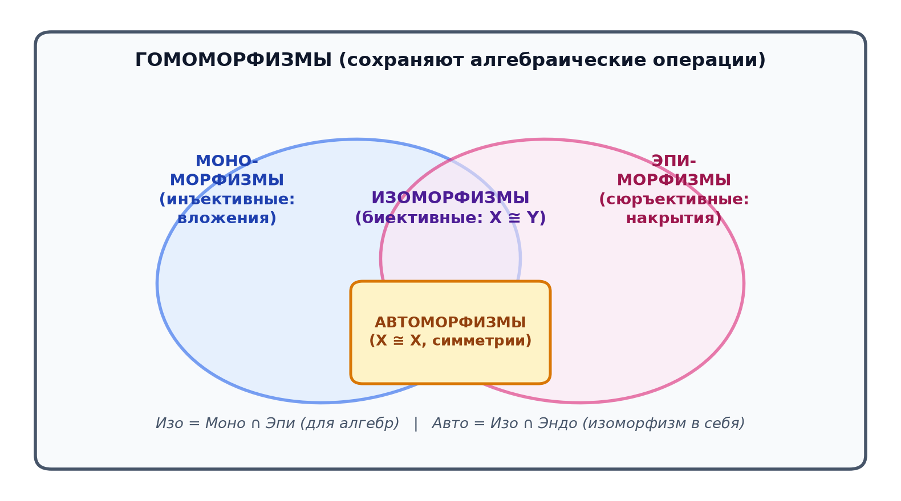

> [!theorem] Единственность числовой прямой $\mathbb{R}$
> Любые два полных упорядоченных поля $\mathbb{R}_1$ и $\mathbb{R}_2$ изоморфны, причём изоморфизм между ними **единственен**.
> Более того, у поля $\mathbb{R}$ **нет нетривиальных автоморфизмов**: единственный автоморфизм $\Phi: \mathbb{R} \to \mathbb{R}$ — тождественный $\Phi(x) \equiv x$.

> [!proof]
> Порядок сохраняется автоматически, так как $x \ge 0 \iff \exists t \in \mathbb{R}: x = t^2 \implies \Phi(x) = (\Phi(t))^2 \ge 0$.
> На $\mathbb{Q}$ отображение обязано быть тождественным ($\Phi(1)=1 \implies \Phi(q)=q$). Плотность $\mathbb{Q}$ в $\mathbb{R}$ однозначно фиксирует значения для всех вещественных чисел. $\blacksquare$

---

## 11. Свойство Архимеда и следствия

> [!theorem] Принцип Архимеда
> Для любого $x \in \mathbb{R}$ существует $n \in \mathbb{N}$ такое, что $n > x$.
> *Эквивалентные формы:*
> - $\forall \varepsilon > 0 \ \exists n \in \mathbb{N}: \frac{1}{n} < \varepsilon$;
> - $\forall h > 0 \ \forall x \in \mathbb{R} \ \exists n \in \mathbb{N}: n \cdot h > x$ *(«шагами длины $h$ можно обойти любое расстояние»)*.

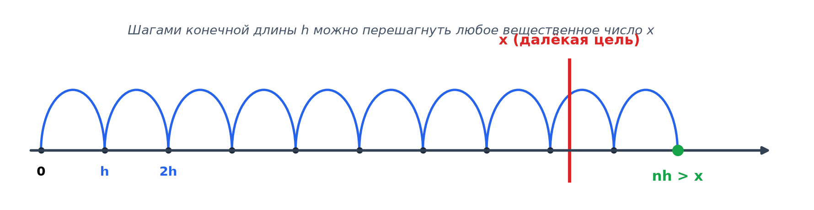

> [!tip] 💡 Аналогия: чайная ложка и океан
> Каким бы малым ни был шаг $h$ (объём чайной ложки) и каким бы колоссальным ни был ориентир $x$ (объём океана), конечного числа шагов гарантированно хватит, чтобы его перешагнуть. В поле вещественных чисел нет актуально бесконечно малых и бесконечно больших величин.

> [!example] Поиск рационального числа между $\sqrt{2} \approx 1{,}41421$ и $1{,}415$
> Разность $b - a \approx 0{,}00079$.
> Потребуем $\frac{1}{n} < 0{,}00079 \implies n = 10000$.
> Вычисляем $na \approx 14142{,}1 \implies m = \lfloor na \rfloor + 1 = 14143$.
> Искомое число $r = \frac{14143}{10000} = 1{,}4143$.
> Проверка: $1{,}41421 < 1{,}4143 < 1{,}415$ — строго лежит в интервале!

---

## 12. Последовательности и их пределы

> [!definition] Предел числовой последовательности
> Число $a \in \mathbb{R}$ называется **пределом последовательности** $(x_n)$, обозначается $\lim_{n \to \infty} x_n = a$, если:
> $$\forall \varepsilon > 0 \quad \exists N \in \mathbb{N} \quad \forall n \ge N: \quad |x_n - a| < \varepsilon$$

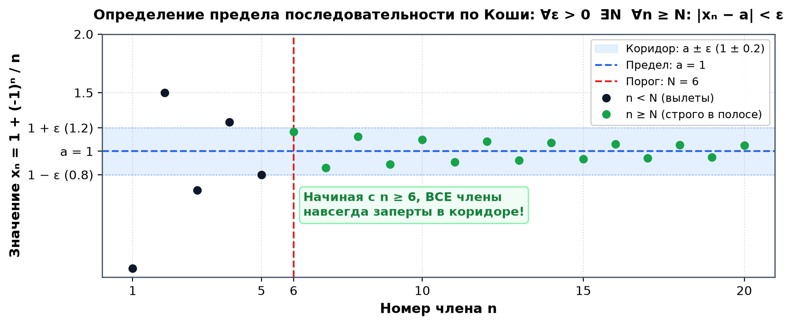

> [!tip] 💡 Аналогия: посадка самолёта на ВПП
> Диспетчер задаёт допустимое отклонение от оси полосы $\varepsilon$. Пилот отвечает: *«начиная с дистанции $N$, я гарантированно держусь в полосе $\pm \varepsilon$»*. Если пилот способен выполнить это требование для абсолютно любого, сколь угодно узкого коридора $\varepsilon$, траектория сходится к оси полосы.

> [!theorem] Теорема Вейерштрасса о монотонной последовательности
> Всякая монотонно возрастающая ограниченная сверху числовая последовательность имеет предел, равный её точной верхней грани:
> $$\lim_{n \to \infty} x_n = \sup \{x_n \mid n \in \mathbb{N}\}$$

> [!example] Типичные сценарии расходимости последовательностей
> Если последовательность не сходится, возможны различные типы поведения:
> 1. **Колебания (две точки сгущения):** $x_n = (-1)^n$ скачет между $-1$ и $+1$;
> 2. **Неограниченный рост (предел бесконечен):** $x_n = n \to +\infty$;
> 3. **Всюду плотное заполнение:** $x_n = \sin n$ заполняет отрезок $[-1, 1]$ без сходимости.

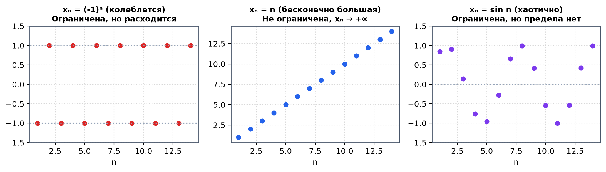

---

## 13. Неравенство Бернулли и приложения к пределам

> [!theorem] Неравенство Якоба Бернулли
> Для любого вещественного $x \ge -1$ и любого натурального $n \in \mathbb{N}$:
> $$(1 + x)^n \ge 1 + nx$$
> Равенство достигается тогда и только тогда, когда $n = 1$ или $x = 0$.

> [!proof] Доказательство методом математической индукции
> 1. **База ($n = 1$):** $(1 + x)^1 = 1 + 1 \cdot x$ — истинно.
> 2. **Шаг индукции ($n \to n + 1$):** Пусть $(1 + x)^n \ge 1 + nx$. Умножим обе части на $(1 + x) \ge 0$ (вот где критически необходимо условие $x \ge -1$!):
>    $$(1 + x)^{n+1} \ge (1 + nx)(1 + x) = 1 + (n+1)x + \underbrace{nx^2}_{\ge 0} \ge 1 + (n+1)x \quad \blacksquare$$

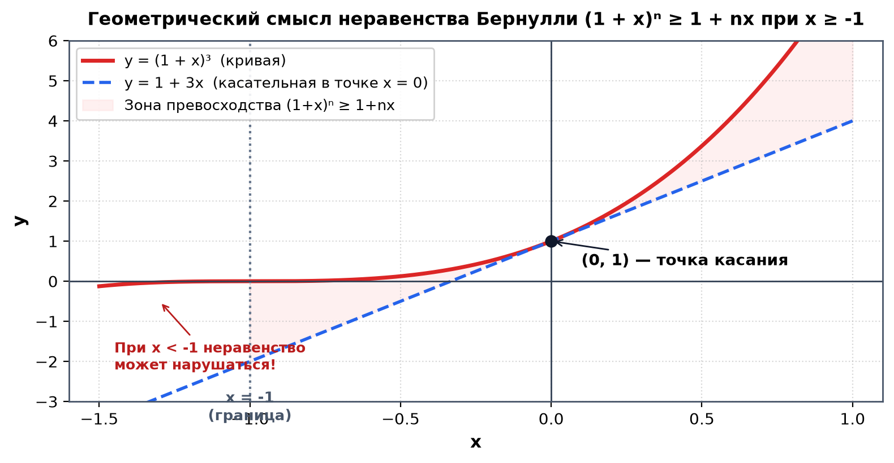

> [!tip] 💡 Аналогия: простые против сложных процентов
> Вклад 100 000 руб. под 10% годовых на 10 лет:
> - **Простые проценты:** $100\,000 \cdot (1 + 10 \cdot 0{,}1) = 200\,000$ руб. (правая часть $1 + nx$).
> - **Сложные проценты (капитализация):** $100\,000 \cdot (1{,}1)^{10} \approx 259\,374$ руб. (левая часть $(1+x)^n$).
> *Неравенство Бернулли утверждает: сложные проценты гарантированно не хуже простых!*

> [!theorem] Предел геометрической прогрессии $|q|^n \to 0$ при $|q| < 1$
> Запишем $\frac{1}{|q|} = 1 + h$, где $h > 0$. По неравенству Бернулли:
> $$\frac{1}{|q|^n} = (1 + h)^n \ge 1 + nh > nh \implies |q|^n < \frac{1}{nh}$$
> По теореме о двух милиционерах, так как $\frac{1}{nh} \to 0$ при $n \to \infty$, получаем $\lim_{n \to \infty} q^n = 0$.

---

## 14. Шпаргалка: все термины на одной странице

| Термин | Строгая математическая формулировка | Простое человеческое объяснение |
| :--- | :--- | :--- |
| **Абелева группа** | Ассоциативность, нейтраль $e$, обратный $a^{-1}$, коммутативность $ab=ba$ | Множество, где можно складывать и вычитать, а порядок слагаемых не важен |
| **Поле** | $(F, +)$ и $(F \setminus \{0\}, \cdot)$ — абелевы группы, дистрибутивность | Числовая система, где безупречно работают все 4 действия арифметики |
| **Трихотомия** | Ровно одно из трёх: $x < y \lor x = y \lor y < x$ | Любые два числа можно строго сравнить между собой |
| **Упорядоченное поле** | Поле со строгим порядком, где $x < y \implies x+z < y+z$ и $x,y > 0 \implies xy > 0$ | Порядок согласован со сложением и умножением |
| **Верхняя грань $U(A)$** | $\forall a \in A: a \le M$ | Любой «потолок», под которым целиком лежит множество $A$ |
| **Супремум $\sup A$** | $\min U(A)$ | Самый низкий из всех возможных потолков |
| **Инфимум $\inf A$** | $\max L(A)$ | Самый высокий из всех возможных полов |
| **Максимум $\max A$** | $s = \sup A \in A$ | Потолок, до которого реально дотягивается элемент множества |
| **Полнота по Дедекинду** | Всякое непустое ограниченное сверху подмножество имеет $\sup \in \mathbb{R}$ | На числовой прямой нет ни единой «дырки» или щели |
| **Сечение Дедекинда** | Непустое открытое снизу подмножество $\alpha \subset \mathbb{Q}$ без наибольшего элемента | Вещественное число как бесконечный луч влево из рациональных чисел |
| **Гомоморфизм** | $f(a * b) = f(a) \circ f(b)$ | Переводчик между системами, строго сохраняющий алгебраические операции |
| **Изоморфизм** | Биективный гомоморфизм ($f^{-1}$ также гомоморфизм) | Структурное зеркало: множества одинаковы с точностью до переименования |
| **Архимедовость** | $\forall x \in \mathbb{R} \ \exists n \in \mathbb{N}: n > x$ | Нет бесконечно больших чисел: конечным шагом можно дойти куда угодно |
| **Предел $\lim x_n = a$** | $\forall \varepsilon > 0 \ \exists N \ \forall n \ge N: |x_n - a| < \varepsilon$ | В любой сколь угодно узкий коридор вокруг $a$ попадает весь хвост последовательности |
| **Теорема Вейерштрасса**| Возрастающая + ограниченная сверху $\implies$ сходится к $\sup$ | Последовательность идёт в одну сторону и упирается в потолок |
| **Неравенство Бернулли** | $(1 + x)^n \ge 1 + nx \quad (\forall x \ge -1)$ | Сложные проценты всегда больше или равны простым процентам |

---

## 15. Упражнения для самопроверки с подробными ответами

> [!example] Задача 1
> Является ли множество $(\{-1, 1\}, \cdot)$ абелевой группой относительно обычного умножения?
>
> **Ответ:** Да. Замкнуто (произведения равны $\pm 1$), нейтральный элемент $1$, каждый элемент обратен сам себе ($1 \cdot 1 = 1$, $(-1) \cdot (-1) = 1$), ассоциативность и коммутативность унаследованы из $\mathbb{R}$.

> [!example] Задача 2
> Найдите $\sup, \inf, \max, \min$ числового множества $A = \left\{ \frac{n}{n+1} \;\middle|\; n \in \mathbb{N} \right\}$.
>
> **Ответ:** При $n=1$ получаем наименьший элемент $\min A = \inf A = \frac{1}{2}$. Дробь строго возрастает: $\frac{n}{n+1} = 1 - \frac{1}{n+1} < 1$. По критерию супремума $\sup A = 1$. Однако значение $1$ никогда не достигается при конечном $n$, поэтому $\max A$ не существует.

> [!example] Задача 3
> Найдите $\sup$ и $\inf$ множества $B = \{x \in \mathbb{R} \mid x^2 - 3x + 2 < 0\}$.
>
> **Ответ:** Неравенство $(x-1)(x-2) < 0$ задаёт открытый интервал $(1, 2)$. Значит, $\inf B = 1, \ \sup B = 2$. Максимума и минимума нет, так как концы не принадлежат интервалу.

> [!example] Задача 4
> Для $x = 1{,}8$ проверьте, что $x^2 > 3$, и найдите шаг $\varepsilon > 0$ такой, чтобы $(x - \varepsilon)^2 > 3$ (по аналогии с шагом вниз для $\sqrt{3}$).
>
> **Ответ:** $x^2 = 1{,}8^2 = 3{,}24 > 3$. По формуле шага вниз: $\varepsilon = \frac{x^2 - 3}{2x} = \frac{0{,}24}{3{,}6} = \frac{1}{15} \approx 0{,}0667$. Тогда $x - \varepsilon \approx 1{,}7333$, а $(1{,}7333)^2 \approx 3{,}0044 > 3$.

> [!example] Задача 5
> Докажите по определению предела, что $\lim_{n \to \infty} \frac{3n - 1}{n + 2} = 3$, и найдите номер $N(\varepsilon)$ для $\varepsilon = 0{,}01$.
>
> **Ответ:** Разность $\left| \frac{3n - 1}{n + 2} - 3 \right| = \left| \frac{3n - 1 - 3n - 6}{n + 2} \right| = \frac{7}{n + 2} < \varepsilon \iff n + 2 > \frac{7}{\varepsilon} \iff n > \frac{7}{\varepsilon} - 2$.
> Для $\varepsilon = 0{,}01$: $n > \frac{7}{0{,}01} - 2 = 700 - 2 = 698$. Полагаем $N = 699$.

> [!example] Задача 6
> Сходится ли последовательность $x_n = \frac{(-1)^n n}{n + 1}$?
>
> **Ответ:** Расходится. Подпоследовательность чётных членов $x_{2k} = \frac{2k}{2k+1} \to 1$, а нечётных $x_{2k-1} = -\frac{2k-1}{2k} \to -1$. Предельные точки различны, предела нет.

> [!example] Задача 7
> Является ли отображение $f(x) = -x$ автоморфизмом группы $(\mathbb{R}, +)$? А автоморфизмом поля $\mathbb{R}$?
>
> **Ответ:**
> - Для группы: Да, $f(x + y) = -(x + y) = -x + (-y) = f(x) + f(y)$, биекция.
> - Для поля: Нет, так как не сохраняется умножение единицы: $f(1) = -1 \neq 1$.

> [!example] Задача 8
> С помощью неравенства Бернулли докажите, что $2^n > n$ для всех $n \in \mathbb{N}$.
>
> **Ответ:** $2^n = (1 + 1)^n \ge 1 + n \cdot 1 = 1 + n > n$.

> [!example] Задача 9
> Опишите сечение Дедекинда, задающее число $\sqrt[3]{5}$.
>
> **Ответ:** $\alpha = \{p \in \mathbb{Q} \mid p^3 < 5\}$. В отличие от квадратных корней, кубическая функция $p \mapsto p^3$ строго монотонна на всей числовой оси $\mathbb{Q}$, поэтому дополнительное условие $p < 0$ не требуется.

> [!example] Задача 10
> Почему множество $C = \{p \in \mathbb{Q} \mid p < 0 \lor p^2 \le 4\}$ не является сечением Дедекинда?
>
> **Ответ:** Множество $C$ эквивалентно лучу $(-\infty, 2] \cap \mathbb{Q}$. В нём присутствует наибольший элемент — число $2$, что грубо нарушает аксиому (S3) сечений. Корректное сечение для двойки — это $\{p \in \mathbb{Q} \mid p < 2\}$.

---

## 16. План подготовки к коллоквиуму на 2 недели

- **Дни 1–2 (Определения с кванторами наизусть):** Выписать на отдельный лист и проговорить вслух точные формулировки с кванторами: $\sup, \inf, \lim$, ограниченность, полнота и — обязательно! — их логические отрицания.
- **Дни 3–4 (Ключевые доказательства без подглядывания):**
  1. Эквивалентность формы супремума и формы Дедекинда.
  2. Существование $\sqrt{2}$ в $\mathbb{R}$ и неполнота $\mathbb{Q}$.
  3. Теорема Архимеда из аксиомы полноты.
  4. Теорема Вейерштрасса о сходимости монотонной последовательности.
  5. Неравенство Бернулли и предел $|q|^n \to 0$.
- **Дни 5–8 (Практика $\varepsilon-N$ и $\sup/\inf$):** Прорешать 15 задач на определение предела последовательности по Коши и нахождение точных граней множеств (задачник Б. П. Демидовича, глава 1).
- **Дни 9–11 (Механика сечений Дедекинда):** Вручную доказать, что сумма сечений $\alpha + \beta$ удовлетворяет всем трем аксиомам (S1)-(S3), и проверить $\alpha + 0^* = \alpha$.
- **Дни 12–14 (Итоговая карта взаимосвязей):** Нарисовать общую причинно-следственную цепочку курса: *Полнота $\implies$ Архимедовость $\implies$ Плотность $\mathbb{Q} \implies$ Теорема Вейерштрасса $\implies$ Число $e$.*

> [!abstract] Рекомендуемая литература
> 1. **В. А. Зорич**, *«Математический анализ»*, т. 1, гл. 2 (Аксиоматика $\mathbb{R}$, полнота и её следствия).
> 2. **Г. М. Фихтенгольц**, *«Основы математического анализа»*, т. 1, введение (Теория сечений Дедекинда).
> 3. **У. Рудин**, *«Основы математического анализа»*, гл. 1 и Приложение (Построение вещественных чисел).
> 4. **Б. П. Демидович**, *«Сборник задач и упражнений по математическому анализу»*, отдел I.

---

## 🔗 Связанные материалы
- 📐 [[Линейная алгебра]] — навигатор по курсу
- 📚 [[2026-09-12 - Линейная алгебра - Лекция 5, Векторные пространства, линейная зависимость, базис и размерность]] — скалярные поля векторных пространств
- 🎯 [[2026-09-12 - Линейная алгебра - Экзаменационный трекер и банк тем I семестра]] — экзаменационные вопросы по структурам полей и изоморфизмам
- 📈 [[2026-09-08 - Математический анализ - Лекция 1, отношения, эквивалентность, порядок, индукция, мощности и счётность]] — смежные теоретико-множественные структуры
- 📈 [[2026-09-12 - Математический анализ - Лекция 2, Предел числовой последовательности, свойства, теорема Вейерштрасса и число e]] — предельный переход последовательностей
- 🗺️ [[🗺️ Карта знаний.canvas]] — единый интерактивный граф знаний
