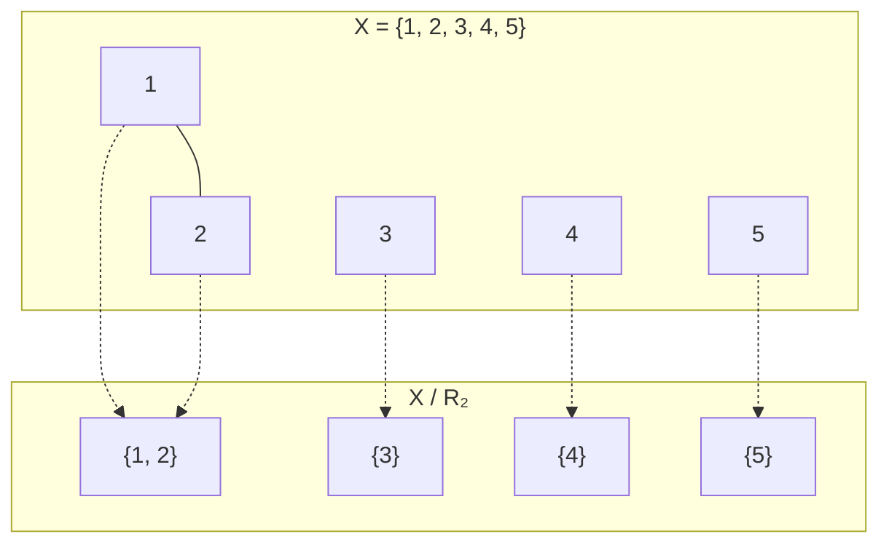
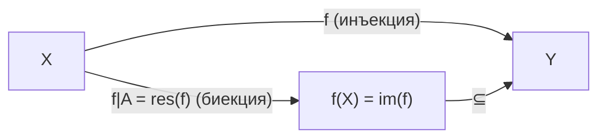

# 📝 Лекция 1: Отношения, эквивалентность, порядок, индукция, мощности и счётность

> **Дата:** `2026-09-08`  
> **Предмет:** Математический анализ (1 семестр)  
> **Преподаватель:** ИТМО  
> **Правила сдачи:** см. линейную алгебру (аналогичная БРС-система).  
> **Консультация:** Четверг, 17:00, с ментором.  
> **Рекомендуемая литература:**
> 1. *Зорич В. А.* — «Математический анализ» (основной учебник, фундаментальный двухтомник).
> 2. *Будин А.* — «Анализ» (компактное пособие).
> 3. *Ross K.* — «Elementary Calculus» (англоязычный вводный курс, хорош для интуиции).
> 4. *Виноградов И. М.* — «Математический анализ» (классический советский курс).
> 5. *Демидович Б. П.* — «Задачник» (обязательный сборник задач, без него невозможно сдать экзамен!).
> 6. *Макаров Б. М., Голузина М. Г., Подкорытов А. Н.* — «Избранные задачи по вещественному анализу» (**«самый лучший матан»** — цитата лектора).

---

## 🧭 Навигация по конспекту
1. [Организация курса и литература](#организация-курса-и-литература)
2. [Отношения: определение и примеры](#1-отношения-определение-и-примеры)
   - [Определение отношения](#11-определение-отношения)
   - [Семь примеров отношений](#12-семь-примеров-отношений)
3. [Отношения эквивалентности](#2-отношения-эквивалентности)
   - [Определение и три аксиомы](#21-определение-и-три-аксиомы)
   - [Классы эквивалентности](#22-классы-эквивалентности)
   - [Факторможество X/R](#23-факторможество-xr)
   - [Лемма корректности](#24-лемма-корректности-классы-не-перекрываются)
   - [Построение ℤ и ℚ через факторизацию](#25-построение-mathbbz-и-mathbbq-через-факторизацию)
4. [Отношения порядка](#3-отношения-порядка)
   - [Частичный порядок (ЧУМ)](#31-частичный-порядок-чум)
   - [Линейный порядок](#32-линейный-порядок)
5. [Принцип математической индукции](#4-принцип-математической-индукции)
   - [Формулировка принципа](#41-формулировка-принципа)
   - [Эквивалентная формулировка](#42-эквивалентная-формулировка-наименьший-элемент)
   - [Доказательство эквивалентности](#43-доказательство-эквивалентности-1-iff-2)
6. [Мощности множеств](#5-мощности-множеств)
   - [Равномощность и обозначения](#51-равномощность-и-обозначения)
   - [Начальные отрезки и конечные множества](#52-начальные-отрезки-и-конечные-множества)
   - [Лемма о конечности и равномощности](#53-лемма-о-конечности-и-равномощности)
7. [Счётность](#6-счётность)
   - [Определение счётного множества](#61-определение-счётного-множества)
   - [Теорема Кантора (X ≠ P(X))](#62-теорема-кантора)
   - [Свойства счётных множеств](#63-свойства-счётных-множеств)
   - [Диагональный процесс Кантора](#64-диагональный-процесс-кантора-mathbbn-times-mathbbn-счётно)
   - [Счётное объединение не более чем счётных](#65-счётное-объединение-не-более-чем-счётных-множеств)
8. [Примеры и типовые задачи](#-примеры-и-типовые-задачи)
9. [Вопросы для самопроверки к коллоквиуму / экзамену](#-вопросы-для-самопроверки-к-коллоквиуму--экзамену)

---

## 📌 Краткое резюме (TL;DR)
1. **Отношение** на $X$ — это любое подмножество $R \subseteq X \times X$. Отношение **эквивалентности** разбивает множество на непересекающиеся **классы** (примеры: равенство, «жить в одном доме», сравнимость $\pmod{n}$). Через факторизацию из $\mathbb{N}$ строятся $\mathbb{Z}$ и $\mathbb{Q}$.
2. **Отношение частичного порядка** $\preccurlyeq$ задаёт структуру ЧУМ (рефлексивность, антисимметричность, транзитивность). **Линейный** порядок — ЧУМ, в котором любые два элемента сравнимы.
3. **Принцип индукции**: если $P_0$ истинно и $P_k \Rightarrow P_{k+1}$, то $P_n$ истинно $\forall n \in \mathbb{N}$. Это **эквивалентно** тому, что в $\mathbb{N}$ каждое непустое подмножество имеет наименьший элемент.
4. **Мощность**: $|X| = |Y|$, если $\exists$ биекция $X \to Y$. Множество **конечно**, если $|X| = |\overline{n}|$ для некоторого $n \in \mathbb{N}$, и **счётно**, если $|X| = |\mathbb{N}|$.
5. **Теорема Кантора**: $|X| < |\mathcal{P}(X)|$ — множество строго «меньше» своего булеана (т.е. бесконечных мощностей — бесконечно много!).
6. **Счётные множества**: $\mathbb{N}, \mathbb{Z}, \mathbb{Q}$ — счётны. Счётное объединение не более чем счётных множеств счётно. $\mathbb{N} \times \mathbb{N}$ счётно (диагональный процесс Кантора).

---

## Организация курса и литература

> [!info] Организационные вопросы
> - **Правила сдачи** аналогичны линейной алгебре (см. [[Линейная алгебра]])
> - **Консультация с ментором**: четверг, 17:00
> - Лектор особо выделил задачник **Демидовича** — без него подготовка к экзамену практически невозможна
> - Сборник «Избранные задачи по вещественному анализу» (Макаров, Голузина, Подкорытов) охарактеризован как **«самый лучший матан»**

> [!tip] Совет по литературе
> Начинайте с **Зорича** (теория + упражнения) и параллельно решайте **Демидовича** (задачи). **Ross** — отличный вариант, если хотите разобраться в интуиции на английском языке. Для глубокого понимания и олимпиадного уровня — «Избранные задачи» Макарова.

---

## 1. Отношения: определение и примеры

### 1.1 Определение отношения

> [!danger] Определение 1 (Бинарное отношение)
> Пусть $X, Y$ — множества. **Бинарным отношением** между $X$ и $Y$ называется любое подмножество декартова произведения:
> $$R \subseteq X \times Y$$
> Если $X = Y$, то $R \subseteq X \times X$ называется **бинарным отношением на множестве $X$**.
> 
> Если $(x, y) \in R$, то говорят, что элементы $x$ и $y$ **находятся в отношении** $R$ (обозначают также $xRy$).

> [!note] Ремарка к рукописным заметкам
> В тетради на фото написано: *«$X, Y$ — множества, тогда отношения между $X, Y$ это $R \subseteq X \times X$»*. Это типичная описка при быстрой записи с доски: отношение между двумя *разными* множествами $X$ и $Y$ лежит в $X \times Y$, а отношение на *одном* множестве $X$ лежит в $X \times X$. Поскольку в дальнейшем изучаются отношения эквивалентности и порядка на одном множестве, лектор сразу сосредоточился на случае $X = Y$.

**Зачем это нужно?** Отношения — это абстрактный фундамент для понятий «равенство», «порядок», «эквивалентность», «делимость» и т.д. Всё, что мы знаем об арифметике, алгебре и анализе, опирается на отношения.

> [!info] Запись и обозначения
> Обычно пишут $xRy$ вместо $(x, y) \in R$ (например, $x = y$, $x \leq y$, $x \mid y$). В данном курсе используется запись с парой: $(x, y) \in R \overset{\text{def}}{\Longleftrightarrow} \text{некоторое свойство}$.

### 1.2 Семь примеров отношений

Лектор привёл **семь** конкретных примеров на лекции, разберём каждый подробно:

> [!example] Пример ① — Равенство (стандартное)
> $X$ — произвольное множество; $(x, y) \in R \overset{\text{def}}{\Longleftrightarrow} x = y$.
>
> **Частные случаи:** $X = \mathbb{N}, \mathbb{Z}, \mathbb{Q}, \mathbb{Q}_{\geq 0}, \mathbb{R}, \mathbb{C}$.
>
> Равенство — это «образцовое» отношение эквивалентности (рефлексивно, симметрично, транзитивно). Каждый класс эквивалентности — синглтон $\{x\}$.

> [!example] Пример ② — Аналогия (на множестве объектов)
> $X$ — множество некоторых объектов (абстрактных); $(A, B) \in R \overset{\text{def}}{\Longleftrightarrow} A$ аналогичен $B$.
>
> Если аналогия рефлексивна, симметрична и транзитивна, то это отношение эквивалентности.

> [!example] Пример ③ — Конкретные пары (на конечном множестве)
> $X = \{1, 2, 3, 4, 5\}$.
> - $R_1 = \{(1,1); (2,2); (3,3); (4,4); (5,5)\}$ — **диагональ** (отношение равенства на $X$).
> - $R_2 = \{(1,1); (2,2); (3,3); (4,4); (5,5); (1,2); (2,1)\}$ — диагональ + пара $(1,2)$ и обратная $(2,1)$. Это тоже отношение эквивалентности: классы $\{1,2\}$, $\{3\}$, $\{4\}$, $\{5\}$.

> [!example] Пример ④ — Сравнимость по модулю $n$ (фиксированному)
> $X = \mathbb{Z}$, $n \in \mathbb{Z}$ фиксировано.
> $$(a, b) \in R \overset{\text{def}}{\Longleftrightarrow} n \mid (a - b)$$
> т.е. «$(a - b)$ делится на $n$».
>
> **Это классическое отношение эквивалентности!** Оно порождает **классы вычетов** — фактормножество $\mathbb{Z}/n\mathbb{Z}$.

> [!tip] Что нужно знать: Арифметика остатков
> Для $n = 3$: классы вычетов — $[0] = \{\ldots, -3, 0, 3, 6, \ldots\}$, $[1] = \{\ldots, -2, 1, 4, 7, \ldots\}$, $[2] = \{\ldots, -1, 2, 5, 8, \ldots\}$.
> Фактормножество $\mathbb{Z}/3\mathbb{Z} = \{[0], [1], [2]\}$ — это кольцо вычетов, основа модулярной арифметики, криптографии (RSA) и теории чисел.

> [!example] Пример ⑤ — На парах натуральных чисел (будущие целые числа)
> $X = \mathbb{N} \times \mathbb{N}$, $R \subseteq X \times X$:
> $$((a,b), (c,d)) \in R \overset{\text{def}}{\Longleftrightarrow} a + d = b + c$$
> Проверим аксиомы:
> - **Рефлексивность:** $((a,b), (a,b)) \in R \Leftrightarrow a + b = b + a$ — верно.
> - **Симметричность:** $a + d = b + c \Leftrightarrow c + b = d + a$ — верно.
> - **Транзитивность:** пусть $((a,b), (c,d)) \in R$ и $((c,d), (e,f)) \in R$, то есть $a + d = b + c$ и $c + f = d + e$. Сложим равенства:
>   $$(a + d) + (c + f) = (b + c) + (d + e) \iff (a + f) + (c + d) = (b + e) + (c + d)$$
>   Сокращая на $c + d$, получаем $a + f = b + e$, то есть $((a,b), (e,f)) \in R$. ✓
> 
> Это отношение используется для **конструкции целых чисел** $\mathbb{Z}$ из $\mathbb{N}$ (см. раздел 2.5).

> [!example] Пример ⑥ — На парах (целое × натуральное положительное)
> $X = \mathbb{Z} \times (\mathbb{N} \setminus \{0\})$:
> $$((m, n), (p, q)) \in R \overset{\text{def}}{\Longleftrightarrow} mq = np$$
> Это классическое отношение равенства дробей: $\frac{m}{n} = \frac{p}{q} \Leftrightarrow mq = np$.
> - **Рефлексивность:** $mn = nm$ — верно.
> - **Симметричность:** $mq = np \Leftrightarrow pn = qm$ — верно.
> - **Транзитивность:** если $mq = np$ и $ps = qr$, то перемножив равенства, имеем:
>   $$(mq)(ps) = (np)(qr) \iff (ms)(pq) = (nr)(pq)$$
>   Если $p \neq 0$, сокращаем на $pq \neq 0$ и получаем $ms = nr$. Если $p = 0$, то $m = 0$ и $r = 0$, откуда $ms = nr = 0$. В обоих случаях $((m,n), (r,s)) \in R$. ✓
> 
> Это отношение лежит в основе **строгой конструкции рациональных чисел** $\mathbb{Q}$.

> [!example] Пример ⑦ — «Жить в одном доме» (бытовой пример с лекции)
> $X$ — множество жителей Санкт-Петербурга. $(a, b) \in R \overset{\text{def}}{\Longleftrightarrow}$ жители $a$ и $b$ живут в одном доме.
>
> - **Рефлексивность:** каждый живёт в том же доме, где живёт он сам ($a$ живёт в одном доме с $a$).
> - **Симметричность:** если $a$ живёт в одном доме с $b$, то $b$ живёт в одном доме с $a$.
> - **Транзитивность:** если $a$ и $b$ в одном доме, и $b$ и $c$ в одном доме, то $a$ и $c$ живут в том же самом доме.
> 
> *(Примечание: в строгой математической модели предполагается, что у каждого человека есть ровно один постоянный дом, иначе отношение потеряло бы транзитивность).*
>
> **Классы эквивалентности:** жители каждого конкретного здания.  
> **Фактормножество:** множество жилых домов Санкт-Петербурга!

---

## 2. Отношения эквивалентности

### 2.1 Определение и три аксиомы

> [!danger] Определение 2 (Отношение эквивалентности)
> Отношение $R \subseteq X \times X$ называется **отношением эквивалентности**, если выполнены три свойства:
>
> **(i) Рефлексивность:** $\quad \forall x \in X: \; (x, x) \in R$
> — каждый элемент эквивалентен самому себе.
>
> **(ii) Симметричность:** $\quad \forall x, y \in X: \; (x, y) \in R \Rightarrow (y, x) \in R$
> — если $x$ эквивалентен $y$, то и $y$ эквивалентен $x$.
>
> **(iii) Транзитивность:** $\quad \forall x, y, z \in X: \; (x, y) \in R \text{ и } (y, z) \in R \Rightarrow (x, z) \in R$
> — цепочка эквивалентностей замыкается.

> [!tip] Мнемоника «РСТ»
> Запомните три буквы: **Р**ефлексивность, **С**имметричность, **Т**ранзитивность. Каждый раз, когда вас просят «доказать, что это отношение эквивалентности», вы должны проверить все три свойства.

### 2.2 Классы эквивалентности

> [!danger] Определение 2a (Класс эквивалентности)
> Пусть $R \subseteq X \times X$ — отношение эквивалентности. Для каждого элемента $x \in X$ определим:
> $$[x] = \{y \in X \mid (y, x) \in R\} \subseteq X$$
> $[x]$ называется **классом эквивалентности** элемента $x$. Элемент $x$ называется **представителем** класса $[x]$.

Интуитивно: $[x]$ — это «облако» всех элементов, которые «неразличимы» от $x$ с точки зрения отношения $R$.

> [!info] Важное свойство
> $x \in [x]$ — представитель всегда лежит в своём классе (следствие рефлексивности).

### 2.3 Факторможество $X/R$

> [!danger] Определение 2b (Факторможество)
> $$X / R := \{[x] \mid x \in X\} \subseteq \mathcal{P}(X)$$
> **Факторможество** — это множество **всех** классов эквивалентности. Иначе говоря, мы «склеиваем» эквивалентные элементы в один класс.

### 2.4 Лемма корректности (классы не перекрываются)

> [!danger] Лемма (Корректность разбиения на классы эквивалентности)
> Любые два класса эквивалентности **либо не пересекаются, либо полностью совпадают**:
> $$\forall a, b \in X: \quad [a] \cap [b] \neq \varnothing \Longrightarrow [a] = [b]$$
> Культурная запись: $X = \bigsqcup_{[x] \in X/R} [x]$ — множество $X$ распадается в дизъюнктное (непересекающееся) объединение классов эквивалентности.

> [!note] Оговорка в рукописном конспекте
> В конспекте на фото 3 записано: *«Классы эквивалентности либо пересекаются либо не совпадают»*. Это случайная оговорка пера. Если бы классы «пересекались, но не совпадали», они могли бы частично накладываться друг на друга, что ломает всю структуру. Смысл теоремы именно противоположный: **частичных пересечений не бывает** — классы либо вообще не имеют общих точек ($[a] \cap [b] = \varnothing$), либо, если у них есть хоть один общий элемент, они абсолютно тождественны ($[a] = [b]$).

**Доказательство** (разобранное на лекции):
1. **Каждый элемент $x \in X$ лежит в своём классе:** по свойству рефлексивности $(x, x) \in R \implies x \in [x]$. Значит, объединение всех классов покрывает всё $X$.
2. **Пусть два класса пересеклись:** $[a] \cap [b] \neq \varnothing$, то есть найдётся общий элемент $c \in [a] \cap [b]$.
3. По определению класса эквивалентности: $(c, a) \in R$ и $(c, b) \in R$.
4. По свойству симметричности: $(a, c) \in R$.
5. По свойству транзитивности: из $(a, c) \in R$ и $(c, b) \in R$ получаем $(a, b) \in R$.
6. **Покажем включение $[a] \subseteq [b]$:**
   - Возьмём произвольный $t \in [a]$, то есть $(t, a) \in R$.
   - Так как $(a, b) \in R$, по транзитивности получаем $(t, b) \in R$, следовательно, $t \in [b]$. Значит, $[a] \subseteq [b]$.
7. Симметрично показывается, что $[b] \subseteq [a]$.
8. Из двух включений следует равенство множеств: $[a] = [b]$. $\blacksquare$

> [!tip] Зачем эта лемма?
> Она гарантирует, что отношение эквивалентности задаёт **разбиение (partition)** множества $X$ на непересекающиеся блоки. Понятия «отношение эквивалентности на $X$» и «разбиение множества $X$» математически абсолютно эквивалентны!

### 2.5 Построение $\mathbb{Z}$ и $\mathbb{Q}$ через факторизацию

Один из самых красивых примеров применения отношений эквивалентности — **строгое построение числовых систем** из более примитивных.

#### Построение $\mathbb{Z}$ (Пример ⑤ с лекции)

> [!danger] Определение (Целые числа)
> $$\mathbb{Z} \overset{\text{def}}{=} (\mathbb{N} \times \mathbb{N}) / R$$
> где $((a, b), (c, d)) \in R \Longleftrightarrow a + d = b + c$.
>
> Интуиция: пара $(a, b)$ кодирует формальную разность $a - b$.

| Пара $(a, b)$ | Интуитивное значение $a - b$ | Класс эквивалентности $[(a, b)]$ | Имя числа в $\mathbb{Z}$ |
| :---: | :---: | :---: | :---: |
| $(3, 0)$ | $3 - 0 = +3$ | $\{(3,0), (4,1), (5,2), (6,3), \ldots\}$ | $+3$ |
| $(0, 2)$ | $0 - 2 = -2$ | $\{(0,2), (1,3), (2,4), (3,5), \ldots\}$ | $-2$ |
| $(1, 1)$ | $1 - 1 = 0$ | $\{(0,0), (1,1), (2,2), (3,3), \ldots\}$ | $0$ |

#### Построение $\mathbb{Q}$ (Пример ⑥ с лекции)

> [!danger] Определение (Рациональные числа)
> $$\mathbb{Q} \overset{\text{def}}{=} (\mathbb{Z} \times (\mathbb{N} \setminus \{0\})) / R$$
> где $((m, n), (p, q)) \in R \Longleftrightarrow mq = np$.
>
> Интуиция: пара $(m, n)$ кодирует дробь $\frac{m}{n}$.

> [!question] Ответ на вопрос из конспекта: *«фактор множества $\simeq$ элементы множ... ???»*
> На фото 3 в тетради стоит вопрос: *«фактор множества $\simeq$ элементы множ... ???»*.
> 
> **В чём суть сомнения?** Кажется парадоксальным: как целое число $-2$ может быть *бесконечным множеством пар* $\{(0,2), (1,3), (2,4), \dots\}$?
> 
> **Математический ответ:** В основаниях математики (аксиоматике ZFC) нет заранее данных отрицательных или дробных чисел. Есть только натуральные числа (построенные из пустого множества). Чтобы строго ввести число $-2$, математики говорят: 
> > *«Мы не знаем, что такое $-2$ само по себе, но мы знаем, как ведут себя разности $0-2, 1-3, 2-4$. Все эти выражения равносильны. Поэтому мы объявим **самим числом $-2$** совокупность (класс эквивалентности) всех таких пар!»*
> 
> Арифметика на факторах задаётся через представителей:
> - Сложение в $\mathbb{Z}$: $[(a, b)] + [(c, d)] := [(a + c, b + d)]$
> - Умножение в $\mathbb{Z}$: $[(a, b)] \cdot [(c, d)] := [(ac + bd, ad + bc)]$
> 
> Корректность (независимость от выбора представителей $(a,b)$ и $(c,d)$) гарантируется свойствами отношения $R$!

---

## 3. Отношения порядка

### 3.1 Частичный порядок (ЧУМ)

> [!danger] Определение 3 (Отношение частичного порядка)
> Отношение $\preccurlyeq \; \subseteq X \times X$ называется **отношением частичного порядка**, если:
>
> **(i) Рефлексивность:** $\quad a \preccurlyeq a \quad (:= (a, a) \in \preccurlyeq)$
>
> **(ii) Антисимметричность:** $\quad a \preccurlyeq b \text{ и } b \preccurlyeq a \;\Rightarrow\; a = b \quad \forall a, b \in X$
>
> **(iii) Транзитивность:** $\quad a \preccurlyeq b \text{ и } b \preccurlyeq c \;\Rightarrow\; a \preccurlyeq c$
>
> Пара $(X, \preccurlyeq)$ называется **частично упорядоченным множеством** (ЧУМ).

> [!warning] Отличие от эквивалентности!
> | Свойство | Эквивалентность | Порядок |
> | :--- | :---: | :---: |
> | Рефлексивность | ✅ | ✅ |
> | Симметричность | ✅ | ❌ |
> | **Анти**симметричность | ❌ | ✅ |
> | Транзитивность | ✅ | ✅ |
>
> Ключевое отличие: в порядке из $a \preccurlyeq b$ и $b \preccurlyeq a$ следует $a = b$ (антисимметричность), а в эквивалентности — наоборот, $(a,b) \in R$ обязывает $(b,a) \in R$ (симметричность).

### Примеры ЧУМ

> [!example] Примеры частичных порядков
> **①** $\mathbb{N}, \mathbb{Z}, \mathbb{Q}, \mathbb{R}$ с обычным $\leq$. Здесь все подмножества сравнимы — это на самом деле **линейный** порядок (см. далее).
>
> **②** $X = \mathcal{P}(A)$ — множество всех подмножеств $A$; $\preccurlyeq \; := \; \subseteq$ (включение множеств). Это ЧУМ, но **не** линейный порядок: например, $\{1\}$ и $\{2\}$ несравнимы ($\{1\} \not\subseteq \{2\}$ и $\{2\} \not\subseteq \{1\}$).
> Заметьте: $A \preccurlyeq B$ и $B \preccurlyeq A$ $\Rightarrow$ $A = B$ — это антисимметричность.
>
> **③** $\mathbb{N}$; $a \preccurlyeq b \overset{\text{def}}{\Longleftrightarrow} a \mid b$ (делимость). Это ЧУМ: делимость рефлексивна ($a \mid a$), антисимметрична (для натуральных чисел $a \mid b$ и $b \mid a$ $\Rightarrow$ $a = b$), транзитивна. Но **не линейный**: 2 и 3 несравнимы.

### 3.2 Линейный порядок

> [!danger] Определение (Линейный порядок)
> ЧУМ $(X, \preccurlyeq)$ называется **линейно упорядоченным** (или **линейным порядком**, **цепью**), если любые два его элемента сравнимы:
> $$\forall a, b \in X: \quad a \preccurlyeq b \;\text{ или }\; b \preccurlyeq a$$

> [!note] Ремарка к записи на доске
> В конспекте на фото 4 написано: *«Если $\forall a, b$ выполнено $a \preccurlyeq b$, $b \preccurlyeq a$ или $a = b$, то $\preccurlyeq$ называется линейным»*.
> Для нестрогого порядка часть «или $a = b$» логически избыточна, так как при $a = b$ условие $a \preccurlyeq b$ уже выполнено в силу рефлексивности ($a \preccurlyeq a$). Если бы порядок был строгим ($\prec$), то закон трихотомии звучал бы так: ровно одно из трёх — $a \prec b$, $b \prec a$ или $a = b$.

> [!example] Примеры линейных порядков
> - $(\mathbb{N}, \leq)$, $(\mathbb{Z}, \leq)$, $(\mathbb{Q}, \leq)$, $(\mathbb{R}, \leq)$ — стандартные числовые множества с естественным порядком.
> - Лексикографический порядок на строках (словарный порядок).

> [!info] Зачёркнутый пример с лекции (почему прямое произведение не линейно?)
> На фото 4 внизу лектор начал писать пример $A \times B$. Если взять два линейно упорядоченных множества (например, $A = \{0, 1, 2, 3, 4, 5\}$ и $B = \{0, 2, 4, 5\}$ с обычным $\le$), то их прямое произведение $A \times B$ с **покомпонентным порядком**:
> $$(a_1, b_1) \preccurlyeq (a_2, b_2) \overset{\text{def}}{\Longleftrightarrow} a_1 \leq a_2 \;\text{ и }\; b_1 \leq b_2$$
> является ЧУМ, но **не является линейным порядком**! Например, пары $(0, 2)$ и $(1, 0)$ несравнимы: $0 \le 1$, но $2 \not\le 0$.

---

## 4. Принцип математической индукции

### 4.1 Формулировка принципа

> [!danger] Определение / Аксиома (Принцип математической индукции)
> Пусть $\{P_n\}_{n \in \mathbb{N}}$ — семейство математических утверждений, занумерованное натуральными числами $\mathbb{N} = \{0, 1, 2, \ldots\}$. Предположим:
> 1. **База индукции:** $P_0$ истинно;
> 2. **Индукционный переход (шаг):** $\forall k \in \mathbb{N}: \; (P_k \text{ истинно} \Longrightarrow P_{k+1} \text{ истинно})$.
>
> **Тогда** $P_n$ истинно для всех $n \in \mathbb{N}$.

> [!tip] Аналогия с костяшками домино
> Представьте бесконечный ряд костяшек домино:
> - **База**: вы толкаете первую костяшку (она падает = $P_0$ истинно).
> - **Шаг**: каждая падающая костяшка гарантированно сбивает следующую ($P_k \Rightarrow P_{k+1}$).
> - **Вывод**: абсолютно все костяшки упадут ($P_n$ истинно $\forall n$).

### 4.2 Эквивалентная формулировка (наименьший элемент)

> [!danger] Утверждение (Эквивалентность индукции и вполне упорядоченности $\mathbb{N}$)
> Следующие два утверждения о множестве натуральных чисел $\mathbb{N}$ логически эквивалентны:
>
> **(1) Принцип математической индукции.**
>
> **(2) Принцип наименьшего элемента (аксиома вполне упорядоченности):**  
> Любое непустое подмножество натуральных чисел содержит наименьший элемент:
> $$\forall A \subseteq \mathbb{N}, \; A \neq \varnothing \Longrightarrow \exists m \in A \; \forall x \in A: \; m \leq x$$
>
> $$\boxed{(1) \Longleftrightarrow (2)}$$

> [!info] Что говорит свойство (2)?
> Это фундаментальное свойство $\mathbb{N}$, которое **не выполняется** для $\mathbb{Z}$ (у $\mathbb{Z}$ нет минимума) и тем более для $\mathbb{R}_{>0}$ (у интервала $(0, 1)$ нет наименьшего элемента).

### 4.3 Доказательство эквивалентности $(1) \Leftrightarrow (2)$

> [!example] Доказательство $(1) \Rightarrow (2)$: от противного
> Пусть верен принцип индукции (1). Предположим, что существует непустое подмножество $A \subseteq \mathbb{N}$, в котором **нет наименьшего элемента**.
> 
> Определим для каждого $n \in \mathbb{N}$ утверждение $Q_n$:
> $$Q_n \overset{\text{def}}{\equiv} \{0, 1, \ldots, n\} \cap A = \varnothing \quad (\text{то есть все числа } \leq n \text{ не принадлежат } A)$$
>
> Докажем истинность $Q_n$ для всех $n \in \mathbb{N}$ по индукции:
> 1. **База ($n = 0$):** $0 \notin A$. Если бы $0 \in A$, то $0$ был бы наименьшим элементом $A$ (так как $\forall x \in \mathbb{N}: 0 \leq x$). Но в $A$ нет наименьшего элемента, значит, $0 \notin A$. База доказана ($Q_0$ истинно).
> 2. **Шаг индукции ($Q_k \Rightarrow Q_{k+1}$):** пусть $Q_k$ истинно, то есть $0, 1, \ldots, k \notin A$.
>    Может ли $k + 1$ принадлежать $A$? Если $(k + 1) \in A$, то $k + 1$ обязан быть наименьшим элементом $A$, поскольку никаких меньших элементов в $A$ уже нет. Но в $A$ нет наименьшего элемента! Следовательно, $(k + 1) \notin A$. Это означает, что $Q_{k+1}$ истинно.
> 
> По принципу индукции $Q_n$ истинно $\forall n \in \mathbb{N}$. Это означает, что ни одно натуральное число не лежит в $A$, то есть $A = \varnothing$. Но по условию $A \neq \varnothing$ — **противоречие!** Следовательно, в $A$ есть наименьший элемент. $\blacksquare$

> [!example] Доказательство $(2) \Rightarrow (1)$: от противного
> Пусть любое непустое подмножество $\mathbb{N}$ содержит наименьший элемент. Предположим, что для некоторого семейства утверждений $\{P_n\}$ выполнены база $P_0$ и шаг $P_k \Rightarrow P_{k+1}$, но само утверждение ложно, то есть нашлось натуральное число $n$, для которого $P_n$ ложно.
>
> Рассмотрим множество всех «контрпримеров»:
> $$B = \{n \in \mathbb{N} \mid P_n \text{ ложно}\}$$
> По нашему предположению $B \neq \varnothing$.
> 
> По свойству (2) в $B$ существует **наименьший элемент** $b = \min B$.
> - Так как база $P_0$ истинна, $0 \notin B$, следовательно, $b > 0$.
> - Тогда число $b - 1$ является натуральным: $(b - 1) \in \mathbb{N}$.
> - Так как $b - 1 < b$, а $b$ — наименьший элемент $B$, число $b - 1$ не может принадлежать $B$. Это значит, что **$P_{b-1}$ истинно**!
> - Но по условию шага индукции из истинности $P_{b-1}$ следует истинность $P_{(b-1)+1} = P_b$.
> - Получаем, что $P_b$ истинно, что прямо противоречит тому, что $b \in B$ ($P_b$ ложно). **Противоречие!**
> 
> Следовательно, множество контрпримеров $B$ пусто, и $P_n$ истинно для всех $n \in \mathbb{N}$. $\blacksquare$

> [!tip] Практическое применение
> На экзамене и в задачах **обе формулировки** абсолютно равноправны. Принцип наименьшего элемента («метод наименьшего контрпримера», или метод бесконечного спуска Ферма) часто оказывается гораздо нагляднее стандартного индукционного перехода (например, при доказательстве однозначности разложения на простые множители или иррациональности $\sqrt{2}$).

---

## 5. Мощности множеств

### 5.1 Равномощность и обозначения

> [!danger] Определение 4 (Равномощность)
> Множества $X$ и $Y$ называются **равномощными** (equinumerous), если между ними существует биекция $f: X \to Y$.
>
> **Обозначение:** $|X| = |Y|$ (или $X \sim Y$).

> [!info] Сравнение мощностей
> Для множеств $X$ и $Y$:
> 
> - $|X| \leq |Y| \quad \overset{\text{def}}{\Longleftrightarrow} \quad \exists \text{ инъекция } f: X \to Y$
> - $|X| < |Y| \quad \overset{\text{def}}{\Longleftrightarrow} \quad |X| \leq |Y| \;\text{ и }\; |X| \neq |Y|$  
>   *(то есть существует инъекция $X \to Y$, но **не существует ни одной биекции** между $X$ и $Y$)*

> [!note] Диаграмма сужения (в верхнем углу фото 6)
> На фото 6 нарисована коммутативная диаграмма: если $f: X \to Y$ — инъекция, то, сужая область значений до образа $\operatorname{im} f = f(X) \subseteq Y$, мы получаем биекцию $X \xrightarrow{\sim} f(X)$. Это сужение часто обозначают $\operatorname{res}(f)$ (от англ. *restriction*).
> 
> Отсюда сразу видно: $|X| \leq |Y| \iff X$ равномощно некоторому подмножеству в $Y$.

> [!tip] Что нужно знать: Теорема Кантора — Бернштейна
> Если $|X| \leq |Y|$ и $|Y| \leq |X|$, то $|X| = |Y|$. Эта теорема гарантирует, что отношение $\leq$ на мощностях антисимметрично (является отношением порядка). Доказывается отдельно и позволяет доказывать равномощность без прямого построения сложной биекции.

### 5.2 Начальные отрезки и конечные множества

> [!danger] Определение (Начальный отрезок $\Gamma_n$)
> Для каждого $n \in \mathbb{N}$ определим **начальный отрезок** натурального ряда:
> $$\Gamma_n \overset{\text{def}}{=} \{k \in \mathbb{N} \mid k < n\} = \{0, 1, \ldots, n - 1\}$$
> В частности:
> $$\Gamma_0 = \varnothing, \quad \Gamma_1 = \{0\}, \quad \Gamma_2 = \{0, 1\}, \quad \Gamma_3 = \{0, 1, 2\}$$
> *(В литературе также используются обозначения $\overline{n}$ или $[n]$).*

> [!danger] Лемма (О начальных отрезках)
> Если $|\Gamma_n| = |\Gamma_m|$ (то есть существует биекция $\Gamma_n \to \Gamma_m$), то $n = m$.

**Доказательство** (индукция по $n$):
- **База ($n = 0$):** $\Gamma_0 = \varnothing$. Если существует биекция $\varnothing \to \Gamma_m$, то $\Gamma_m = \varnothing$, откуда $m = 0$. База доказана. ✓
- **Индукционный переход:** пусть утверждение верно для $n$. Дана биекция $f: \Gamma_{n+1} \to \Gamma_m$.
  1. Заметим, что $m > 0$ (иначе $\Gamma_m = \varnothing$, а $\Gamma_{n+1} \neq \varnothing$).
  2. Рассмотрим ограничение $f$ на $\Gamma_{n+1} \setminus \{n\} = \Gamma_n$.
  3. Функция $f|_{\Gamma_n}$ взаимно однозначно отображает $\Gamma_n$ на $\Gamma_m \setminus \{f(n)\}$.
  4. Множество $\Gamma_m \setminus \{f(n)\}$ получается выбрасыванием одного элемента $f(n) \in \{0, 1, \ldots, m-1\}$. Отображение:
     $$g: \Gamma_m \setminus \{f(n)\} \longrightarrow \Gamma_{m-1}, \quad g(y) = \begin{cases} y, & y < f(n) \\ y - 1, & y > f(n) \end{cases}$$
     является строгой биекцией (оно просто «схлопывает» пропущенную позицию $f(n)$).
  5. Тогда композиция $g \circ f|_{\Gamma_n}: \Gamma_n \longrightarrow \Gamma_{m-1}$ является биекцией!
  6. По предположению индукции получаем: $n = m - 1 \Longrightarrow n + 1 = m$. $\blacksquare$

### 5.3 Определение конечности и мощности

> [!danger] Определение (Конечное множество и его мощность)
> Множество $X$ называется **конечным**, если оно равномощно некоторому начальному отрезку $\Gamma_n$:
> $$\exists n \in \mathbb{N}: \quad |X| = |\Gamma_n|$$
> Число $n$ называется **количеством элементов** (или **мощностью**) множества $X$ и обозначается $|X| = n$.
>
> **По лемме выше это определение корректно:** число $n$ определяется единственным образом!

> [!info] Замечание об эквивалентности
> Равномощность множеств рефлексивна ($|X| = |X|$ через тождественное отображение $\operatorname{id}_X$), симметрична (если $f$ — биекция, то $f^{-1}$ — биекция) и транзитивна (композиция биекций — биекция). То есть равномощность — это **отношение эквивалентности** на совокупности множеств.

---

## 6. Счётность

### 6.1 Определение счётного множества

> [!danger] Определение 5 (Счётность)
> Множество $X$ называется **счётным**, если оно равномощно множеству натуральных чисел:
> $$|X| = |\mathbb{N}| \quad (\text{существует биекция } f: X \longrightarrow \mathbb{N})$$
> 
> Множество $X$ называется **не более чем счётным** (сокращённо: **н.б.с.**), если оно конечно или счётно.

> [!example] Базовые примеры счётных множеств
> - $\mathbb{N}$ — счётно (тождественная биекция $\operatorname{id}_{\mathbb{N}}$).
> - $\mathbb{Z}$ — счётно: биекция задаётся чередованием знаков:
>   $$f(n) = \begin{cases} 2n, & n \geq 0 \\ -2n - 1, & n < 0 \end{cases} \quad \implies \quad (0 \mapsto 0, \; 1 \mapsto 2, \; -1 \mapsto 1, \; 2 \mapsto 4, \; -2 \mapsto 3, \ldots)$$
> - $\mathbb{Q}$ — счётно (строго доказывается ниже через счётность $\mathbb{N} \times \mathbb{N}$).

### 6.2 Пример Кантора: несчётное множество $\{0, 1\}^\infty$

Перед общей теоремой лектор разобрал знаменитый **диагональный метод Кантора** (фото 7 в конспекте).

> [!example] Теорема Кантора о бинарных последовательностях
> Множество $X = \{0, 1\}^\infty$ всех бесконечных последовательностей из нулей и единиц:
> $$X = \{(a_0, a_1, a_2, \ldots) \mid a_i \in \{0, 1\}\}$$
> является **несчётным**.

**Доказательство (Диагональный процесс Кантора):**
1. Предположим противное: пусть множество $X$ счётно.
2. Тогда все его элементы можно занумеровать натуральными числами и выписать в бесконечный список:
   $$\begin{aligned}
   a^{(0)} &= (\mathbf{a_{0,0}}, \; a_{0,1}, \; a_{0,2}, \; \ldots) \\
   a^{(1)} &= (a_{1,0}, \; \mathbf{a_{1,1}}, \; a_{1,2}, \; \ldots) \\
   a^{(2)} &= (a_{2,0}, \; a_{2,1}, \; \mathbf{a_{2,2}}, \; \ldots) \\
   &\;\;\vdots
   \end{aligned}$$
3. Построим новую последовательность $b = (b_0, b_1, b_2, \ldots)$, инвертируя элементы на **главной диагонали**:
   $$b_m \overset{\text{def}}{=} 1 - a_{m,m} = \begin{cases} 1, & \text{если } a_{m,m} = 0 \\ 0, & \text{если } a_{m,m} = 1 \end{cases}$$
4. Очевидно, $b \in X$ (это корректная бесконечная последовательность из 0 и 1).
5. Спросим: под каким номером последовательность $b$ стоит в нашем списке?
   - Пусть $b = a^{(m)}$ для некоторого $m \in \mathbb{N}$.
   - Сравним их $m$-е компоненты: $b_m = a_{m,m}$.
   - Но по определению $b$: $b_m = 1 - a_{m,m} \neq a_{m,m}$!
   - Получили $a_{m,m} \neq a_{m,m}$ — **противоречие!**
6. Следовательно, последовательность $b$ не входит в список. Список не содержит все элементы $X$, значит, $X$ невозможно пересчитать. $X$ — **несчётно!** $\blacksquare$

> [!tip] Связь с вещественными числами $\mathbb{R}$
> Каждую такую последовательность $(a_0, a_1, a_2, \dots)$ можно сопоставить числу из отрезка $[0, 1]$ в двоичной системе счисления:
> $$x = \sum_{k=0}^{\infty} \frac{a_k}{2^{k+1}} = 0.a_0 a_1 a_2 \ldots_{(2)}$$
> Из несчётности $\{0, 1\}^\infty$ сразу следует **несчётность континуума $\mathbb{R}$**!

### 6.3 Теорема Кантора (в общей форме)

> [!danger] Теорема (Кантор, 1891)
> Для любого множества $X$ не существует сюръекции $f: X \longrightarrow \mathcal{P}(X)$ на множество всех его подмножеств (булеан).
>
> **Следствие:** $|X| < |\mathcal{P}(X)|$ — мощность булеана **строго больше** мощности самого множества.

**Доказательство:**
1. Предположим от противного, что существует сюръекция $f: X \to \mathcal{P}(X)$.
2. Рассмотрим «диагональное» подмножество элементов, которые не принадлежат своему образу:
   $$D \overset{\text{def}}{=} \{x \in X \mid x \notin f(x)\} \subseteq X$$
3. Так как $D \in \mathcal{P}(X)$, а отображение $f$ сюръективно, у множества $D$ обязан найтись прообраз:
   $$\exists d \in X: \quad f(d) = D$$
4. Проверим, принадлежит ли элемент $d$ множеству $D$:
   - Если $d \in D$, то по определению $D$ должно быть $d \notin f(d) = D$ — противоречие!
   - Если $d \notin D$, то $d$ не удовлетворяет условию невключения, то есть $d \in f(d) = D$ — снова противоречие!
5. Получили равносильность $d \in D \Longleftrightarrow d \notin D$, что невозможно. Значит, сюръекции не существует.
6. При этом отображение $\iota: X \hookrightarrow \mathcal{P}(X)$, $x \mapsto \{x\}$ является инъекцией, поэтому $|X| \leq |\mathcal{P}(X)|$. Объединяя с отсутствием биекции, получаем $|X| < |\mathcal{P}(X)|$. $\blacksquare$

> [!tip] «Канторова лестница» мощностей
> Теорема Кантора доказывает, что **наибольшей бесконечности не существует**:
> $$|\mathbb{N}| < |\mathcal{P}(\mathbb{N})| < |\mathcal{P}(\mathcal{P}(\mathbb{N}))| < |\mathcal{P}(\mathcal{P}(\mathcal{P}(\mathbb{N})))| < \ldots$$
> Иерархия бесконечных мощностей бесконечна!

### 6.4 Свойства счётных множеств

> [!danger] Свойство 1 (Подмножество счётного множества)
> Всякое подмножество множества натуральных чисел $A \subseteq \mathbb{N}$ является **не более чем счётным** (конечным или счётным).
> 
> *(Следствие: любое подмножество любого счётного множества не более чем счётно).*

**Доказательство:**
1. Если $A$ конечно, утверждение доказано.
2. Пусть $A$ бесконечно. Построим биекцию $\mathbb{N} \to A$:
   - По принципу наименьшего элемента (раздел 4.2) в $A$ есть минимум: $n_0 = \min A$.
   - Во множестве $A \setminus \{n_0\}$ снова есть минимум: $n_1 = \min(A \setminus \{n_0\})$.
   - По индукции определяем: $n_k = \min(A \setminus \{n_0, n_1, \ldots, n_{k-1}\})$.
3. По построению $n_0 < n_1 < n_2 < \ldots$, откуда по индукции $n_k \geq k$ для всех $k \in \mathbb{N}$.
4. Отображение $\varphi: \mathbb{N} \to A$, $k \mapsto n_k$ строго монотонно возрастает, а значит, инъективно.
5. Покажем сюръективность: пусть найдётся элемент $a \in A$, не попавший в последовательность ($a \neq n_k$ $\forall k$).
   - Так как $a$ не выбран ни на одном шаге, он всегда оставался кандидатом, то есть $a > n_k$ для всех $k$.
   - Но для $k = a + 1$ имеем $n_{a+1} \geq a + 1 > a$.
   - Получаем $a > n_{a+1} > a$ — противоречие!
   - Значит, каждый элемент $a \in A$ будет выбран за конечное число шагов. Отображение $\varphi$ сюръективно, а значит, является биекцией $\mathbb{N} \to A$. $\blacksquare$

---

### 6.5 Диагональный процесс Кантора ($\mathbb{N} \times \mathbb{N}$ счётно)

> [!danger] Свойство 2
> Декартово произведение $\mathbb{N} \times \mathbb{N}$ **счётно**.
> 
> *Следствие:* конечное прямое произведение $\mathbb{N}^m = \underbrace{\mathbb{N} \times \ldots \times \mathbb{N}}_{m}$ счётно для любого $m \geq 1$.

**Конструкция биекции (обход по диагоналям):**
Расположим пары $(k, \ell) \in \mathbb{N} \times \mathbb{N}$ в бесконечную матрицу (где $k$ — номер строки, $\ell$ — номер столбца):

| | $\ell = 0$ | $\ell = 1$ | $\ell = 2$ | $\ell = 3$ | $\ldots$ |
| :---: | :---: | :---: | :---: | :---: | :---: |
| **$k = 0$** | $(0,0)_0$ | $(0,1)_1$ | $(0,2)_3$ | $(0,3)_6$ | $\ldots$ |
| **$k = 1$** | $(1,0)_2$ | $(1,1)_4$ | $(1,2)_7$ | $(1,3)_{11}$ | $\ldots$ |
| **$k = 2$** | $(2,0)_5$ | $(2,1)_8$ | $(2,2)_{12}$ | $\ldots$ | $\ldots$ |
| **$k = 3$** | $(3,0)_9$ | $(3,1)_{13}$ | $\ldots$ | $\ldots$ | $\ldots$ |

Будем обходить таблицу по последовательным **диагоналям**, на которых сумма $m = k + \ell$ постоянна:
- $m = 0$: пара $(0,0)$ — $1$ штука.
- $m = 1$: пары $(0,1), (1,0)$ — $2$ штуки.
- $m = 2$: пары $(0,2), (1,1), (2,0)$ — $3$ штуки.
- Диагональ с суммой $m$ содержит ровно $m + 1$ пару.

> [!danger] Формула канторовой нумерации пар
> Число пар на всех предыдущих диагоналях с суммами $0, 1, \ldots, m-1$ равно:
> $$1 + 2 + 3 + \ldots + m = \frac{m(m + 1)}{2} = \frac{(k + \ell)(k + \ell + 1)}{2}$$
> С учётом смещения на $+k$ внутри диагонали получаем явную биекцию $t: \mathbb{N} \times \mathbb{N} \longrightarrow \mathbb{N}$:
> $$\boxed{t(k, \ell) = \frac{(k + \ell)(k + \ell + 1)}{2} + k}$$

> [!note] Разбор сомнения из конспекта: *«диагональный процесс Кантора может быть неверен»*
> На фото 8 в рамке студент написал: *«диагональный процесс Кантора может быть неверен»*, а рядом начата формула $\frac{(k+\ell-1)(k+\ell)}{2}$.
> 
> **Почему возникло сомнение?** Студент перепутал формулу суммы первых $m$ чисел:
> - Если бы диагонали нумеровались с $1$ до $m-1$ с длинами $1, 2, \dots, m-1$, сумма была бы $\frac{(m-1)m}{2} = \frac{(k+\ell-1)(k+\ell)}{2}$.
> - Но при $k = 0, \ell = 1$ (сумма $m = 1$) эта ошибочная формула даёт $\frac{0 \cdot 1}{2} + 0 = 0$, то есть склеивает пары $(0, 0)$ и $(0, 1)$ в один номер $0$!
> - **Правильная формула** опирается на то, что на $j$-й диагонали лежит $j + 1$ элементов, поэтому до диагонали $m$ лежит $\sum_{j=0}^{m-1} (j+1) = \sum_{i=1}^m i = \frac{m(m+1)}{2}$ элементов. С ней всё работает идеально!

---

### 6.6 Счётное объединение не более чем счётных множеств

> [!danger] Предложение (Счётное объединение н.б.с. множеств)
> Пусть $\{A_s\}_{s \in S}$ — семейство множеств, занумерованное множеством $S$.
> 
> Если множество индексов $S$ **не более чем счётно**, и каждое множество $A_s$ **не более чем счётно**, то их объединение:
> $$\bigcup_{s \in S} A_s \quad \text{также не более чем счётно.}$$

**Доказательство (с фото 9):**
1. Без ограничения общности считаем, что все $A_s$ непусты и $S \neq \varnothing$ (пустые слагаемые не влияют на объединение).
2. Так как $S$ не более чем счётно, существует сюръекция:
   $$\alpha: \mathbb{N} \twoheadrightarrow S$$
3. Так как каждое $A_s$ не более чем счётно, для каждого $s \in S$ существует сюръекция:
   $$w_s: \mathbb{N} \twoheadrightarrow A_s$$
4. Построим отображение $\Phi: \mathbb{N} \times \mathbb{N} \longrightarrow \bigcup_{s \in S} A_s$:
   $$\Phi(m, n) \overset{\text{def}}{=} w_{\alpha(m)}(n)$$
5. **Проверим, что $\Phi$ — сюръекция:**
   - Возьмём любой элемент $x \in \bigcup_{s \in S} A_s$.
   - По определению объединения найдётся такой индекс $\tilde{s} \in S$, что $x \in A_{\tilde{s}}$.
   - Так как $\alpha$ сюръективно, найдётся номер $m \in \mathbb{N}$, для которого $\alpha(m) = \tilde{s}$.
   - Так как $w_{\tilde{s}}$ сюръективно, найдётся номер $n \in \mathbb{N}$, для которого $w_{\tilde{s}}(n) = x$.
   - Тогда $\Phi(m, n) = w_{\alpha(m)}(n) = w_{\tilde{s}}(n) = x$. Значит, $\Phi$ сюръективно!
6. Так как $\mathbb{N} \times \mathbb{N}$ счётно, существует биекция $t^{-1}: \mathbb{N} \to \mathbb{N} \times \mathbb{N}$.
7. Тогда композиция $\Phi \circ t^{-1}: \mathbb{N} \twoheadrightarrow \bigcup_{s \in S} A_s$ сюръективна.
8. Сюръекция из $\mathbb{N}$ на множество означает, что это множество **не более чем счётно**. $\blacksquare$

> [!tip] Главное следствие: Счётность рациональных чисел $\mathbb{Q}$
> Представим $\mathbb{Q}$ как объединение множеств дробей со знаменателем $n \in \mathbb{N} \setminus \{0\}$:
> $$\mathbb{Q} = \bigcup_{n=1}^{\infty} \left\{ \frac{m}{n} \;\middle|\; m \in \mathbb{Z} \right\}$$
> При каждом фиксированном $n$ множество $\{\frac{m}{n} \mid m \in \mathbb{Z}\}$ счётно (равномощно $\mathbb{Z}$).  
> Множество знаменателей $\mathbb{N} \setminus \{0\}$ счётно.  
> По доказанному предложению, $\mathbb{Q}$ — **счётное объединение счётных множеств**, следовательно, **$\mathbb{Q}$ счётно!**

---

## 📖 Сводная таблица понятий лекции

| Понятие | Определение | Ключевые свойства |
| :--- | :--- | :--- |
| **Отношение** | $R \subseteq X \times Y$ (на $X$: $R \subseteq X \times X$) | Любое подмножество декартова произведения |
| **Эквивалентность** | Рефл. + Симм. + Транз. | Задаёт разбиение $X$ на непересекающиеся классы |
| **Класс $[x]$** | $\{y \in X \mid (y,x) \in R\}$ | Не пересекаются либо полностью совпадают |
| **Факторможество** | $X/R = \{[x] \mid x \in X\}$ | Лежит в основе конструкции $\mathbb{Z}, \mathbb{Q}$ |
| **ЧУМ** | Рефл. + Антисимм. + Транз. | Отношение частичного порядка |
| **Линейный порядок** | ЧУМ + любые два элемента сравнимы | $\forall a, b: a \preccurlyeq b \lor b \preccurlyeq a$ |
| **Индукция** | $P_0 \wedge (P_k \Rightarrow P_{k+1}) \Rightarrow \forall n P_n$ | $\Longleftrightarrow$ аксиома вполне упорядоченности $\mathbb{N}$ |
| **Равномощность** | $\exists$ биекция $X \to Y$ | Отношение эквивалентности на множествах ($|X| = |Y|$) |
| **Конечность** | $|X| = |\Gamma_n|$ для $n \in \mathbb{N}$ | Мощность $n$ корректно определена и единственна |
| **Счётность** | $|X| = |\mathbb{N}|$ | $\mathbb{N}, \mathbb{Z}, \mathbb{Q}, \mathbb{N}^m$ — счётны |
| **Несчётность $\{0, 1\}^\infty$** | Диагональный метод Кантора | Инвертирование элементов на диагонали |
| **Теорема Кантора** | $\nexists$ сюръекция $X \twoheadrightarrow \mathcal{P}(X)$ | $|X| < |\mathcal{P}(X)|$ всегда строго больше |
| **Объединение н.б.с.** | $\bigcup_{s \in S} A_s$ при $S$ н.б.с. и $A_s$ н.б.с. | Снова не более чем счётно |

---

## 💡 Примеры и типовые задачи

> [!example] Задача 1: Проверка эквивалентности
> **Условие:** Пусть $X = \mathbb{Z}$, $(a, b) \in R \Leftrightarrow 5 \mid (a - b)$. Докажите, что $R$ — отношение эквивалентности. Перечислите классы.
>
> **Решение:**
> - *Рефлексивность:* $5 \mid (a - a) = 0$ ✓
> - *Симметричность:* $5 \mid (a - b) \Rightarrow 5 \mid (-(a-b)) = (b - a)$ ✓
> - *Транзитивность:* $5 \mid (a-b)$ и $5 \mid (b-c) \Rightarrow 5 \mid (a-b) + (b-c) = (a-c)$ ✓
>
> Классы: $[0] = \{\ldots, -5, 0, 5, 10, \ldots\}$, $[1] = \{\ldots, -4, 1, 6, 11, \ldots\}$, $[2], [3], [4]$.
> Факторможество: $\mathbb{Z}/5\mathbb{Z} = \{[0], [1], [2], [3], [4]\}$ — кольцо вычетов $\mathbb{Z}_5$.

> [!example] Задача 2: Индукция
> **Условие:** Докажите, что $1 + 2 + \ldots + n = \frac{n(n+1)}{2}$ для всех $n \geq 1$.
>
> **Решение:**
> - *База* ($n = 1$): $1 = \frac{1 \cdot 2}{2} = 1$ ✓
> - *Шаг:* Пусть $1 + 2 + \ldots + k = \frac{k(k+1)}{2}$ (предположение индукции). Тогда:
> $$1 + 2 + \ldots + k + (k+1) = \frac{k(k+1)}{2} + (k+1) = \frac{k(k+1) + 2(k+1)}{2} = \frac{(k+1)(k+2)}{2}$$
> что совпадает с формулой для $n = k + 1$. $\blacksquare$

> [!example] Задача 3: Теорема Кантора (применение)
> **Условие:** Докажите, что множество $\{0, 1\}^{\mathbb{N}}$ (всех бесконечных бинарных последовательностей) несчётно.
>
> **Решение:** Множество $\{0,1\}^{\mathbb{N}}$ находится в биекции с $\mathcal{P}(\mathbb{N})$: каждому подмножеству $A \subseteq \mathbb{N}$ сопоставим его **характеристическую функцию** $\chi_A: \mathbb{N} \to \{0,1\}$, где $\chi_A(n) = 1 \Leftrightarrow n \in A$.
>
> По теореме Кантора: $|\mathcal{P}(\mathbb{N})| > |\mathbb{N}|$, поэтому $\{0,1\}^{\mathbb{N}}$ несчётно. $\blacksquare$

> [!example] Задача 4: Диагональный процесс
> **Условие:** Используя канторову нумерацию $t(k, \ell) = \frac{(k+\ell)(k+\ell+1)}{2} + k$, найдите номер пары $(2, 1)$.
>
> **Решение:** $k = 2$, $\ell = 1$, $m = k + \ell = 3$.
> $$t(2, 1) = \frac{3 \cdot 4}{2} + 2 = 6 + 2 = 8$$

---

## ❓ Вопросы для самопроверки к коллоквиуму / экзамену

- [ ] Дайте определение бинарного отношения между множествами $X$ и $Y$, а также отношения на множестве $X$.
- [ ] Перечислите и объясните три аксиомы отношения эквивалентности (рефлексивность, симметричность, транзитивность).
- [ ] Что такое класс эквивалентности $[x]$? Что такое фактормножество $X/R$?
- [ ] Сформулируйте и докажите лемму о корректности разбиения на классы эквивалентности ($[a] \cap [b] \neq \varnothing \implies [a] = [b]$).
- [ ] Как из $\mathbb{N}$ строятся $\mathbb{Z}$ и $\mathbb{Q}$ через факторизацию? Напишите точные формулы эквивалентности.
- [ ] Дайте определение отношения частичного порядка (ЧУМ). Чем антисимметричность отличается от симметричности?
- [ ] Приведите пример ЧУМ, не являющегося линейным порядком (делимость на $\mathbb{N}$, прямое произведение, включение подмножеств).
- [ ] Что такое линейный порядок? В чём отличие от частичного?
- [ ] Сформулируйте принцип математической индукции. Какое свойство множества $\mathbb{N}$ ему эквивалентно?
- [ ] Докажите равносильность принципа индукции и принципа наименьшего элемента (в обе стороны).
- [ ] Дайте определение равномощности множеств. Что означают записи $|X| \leq |Y|$ и $|X| < |Y|$?
- [ ] Что такое начальный отрезок $\Gamma_n$? Докажите, что $|\Gamma_n| = |\Gamma_m| \implies n = m$.
- [ ] Как строго определяется конечное множество и его мощность?
- [ ] Дайте определение счётного множества и не более чем счётного множества. Приведите примеры.
- [ ] Докажите методом диагонального процесса Кантора несчётность множества $\{0, 1\}^\infty$.
- [ ] Сформулируйте и докажите теорему Кантора о мощности булеана ($|X| < |\mathcal{P}(X)|$).
- [ ] Докажите, что всякое подмножество множества $\mathbb{N}$ конечно или счётно.
- [ ] Объясните диагональный процесс Кантора для $\mathbb{N} \times \mathbb{N}$ и выведите формулу $t(k, \ell)$.
- [ ] Сформулируйте и докажите теорему о счётном объединении не более чем счётных множеств.
- [ ] Докажите, что множество рациональных чисел $\mathbb{Q}$ счётно.

---

> [!abstract] Навигация
> ⬅️ *Предыдущая:* *(первая лекция по матанализу)*
> 📚 **Хаб предмета:** [[Математический анализ]]
> 🏠 **Главная:** [[🏠 Главная]]
> ➡️ *Следующая:* *(будет добавлена)*
