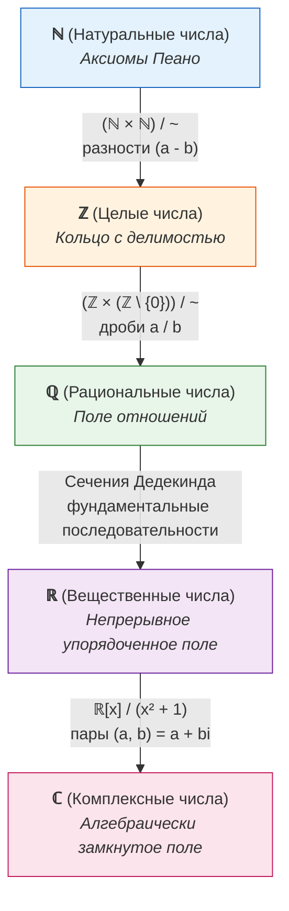

# 📝 Практика 1: Отношения эквивалентности, фактор-множества, построение числовых систем и кольца вычетов

> **Дата проведения:** `2026-09-10` (2-я неделя)  
> **Предмет:** Математический анализ (1 семестр, 2026/27 уч. год)  
> **Связанная лекция:** [[2026-09-08 - Математический анализ - Лекция 1, отношения, эквивалентность, порядок, индукция, мощности и счётность|Лекция 1: Отношения, эквивалентность, порядок, индукция, мощности и счётность]]  
> **Хаб дисциплины:** [[Математический анализ]]

---

## 🧭 Навигация по конспекту

1. [Бинарные отношения и три аксиомы эквивалентности (РСТ)](#1-бинарные-отношения-и-три-аксиомы-эквивалентности-рст)
2. [Геометрические примеры отношений эквивалентности](#2-геометрические-примеры-отношений-эквивалентности)
   - [Равенство свободных векторов](#21-равенство-свободных-векторов)
   - [Равенство (конгруэнтность) треугольников](#22-равенство-конгруэнтность-треугольников)
3. [Классы эквивалентности и фактор-множество](#3-классы-эквивалентности-и-фактор-множество)
   - [Определение класса эквивалентности](#31-определение-класса-эквивалентности)
   - [Теорема о разбиении: классы либо совпадают, либо не пересекаются](#32-теорема-о-разбиении-классы-либо-совпадают-либо-не-пересекаются)
   - [Понятие фактор-множества X/~ и наглядный пример](#33-понятие-фактор-множества-x-и-наглядный-пример)
4. [Конструкция числовых систем через факторизацию: ℕ → ℤ → ℚ → ℝ → ℂ](#4-конструкция-числовых-систем-через-факторизацию-mathbbn-to-mathbbz-to-mathbbq-to-mathbbr-to-mathbbc)
   - [Конструкция ℤ из ℕ × ℕ](#41-конструкция-mathbbz-из-mathbbn-times-mathbbn)
   - [Конструкция ℚ из ℤ × (ℤ \ {0}) и корректность операций](#42-конструкция-mathbbq-из-mathbbz-times-mathbbz-setminus-0-и-корректность-операций)
   - [Конструкция ℝ через сечения Дедекинда (пример √2)](#43-конструкция-mathbbr-через-сечения-дедекинда-пример-sqrt2)
5. [Сравнение по модулю n и кольцо вычетов ℤₙ](#5-сравнение-по-модулю-n-и-кольцо-вычетов-mathbbz_n)
   - [Отношение сравнимости по модулю n](#51-отношение-сравнимости-по-модулю-n)
   - [Кольцо классов вычетов ℤₙ = ℤ / nℤ](#52-кольцо-классов-вычетов-mathbbz_n--mathbbz--nmathbbz)
   - [Корректность операций сложения и умножения вычетов](#53-корректность-операций-сложения-и-умножения-вычетов)
6. [Вопросы для самопроверки и тренировочные задачи](#6-вопросы-для-самопроверки-и-тренировочные-задачи)

---

## 1. Бинарные отношения и три аксиомы эквивалентности (РСТ)

Пусть $X$ — произвольное непустое множество.

> [!definition] Определение: Бинарное отношение
> **Бинарным отношением** $R$ на множестве $X$ называется любое подмножество декартова произведения:
> $$R \subseteq X \times X.$$
> Если пара $(x, y) \in R$, то пишут:
> $$x R y \quad \text{или} \quad x \sim y.$$

> [!important] Три аксиомы отношения эквивалентности (РСТ)
> Отношение $\sim$ на множестве $X$ называется **отношением эквивалентности**, если для всех элементов $x, y, z \in X$ выполнены три условия:
> 1. **Рефлексивность (Р):**
>    $$\forall x \in X: \quad x \sim x$$
>    *(каждый элемент эквивалентен самому себе)*.
> 2. **Симметричность (С):**
>    $$\forall x, y \in X: \quad x \sim y \implies y \sim x$$
>    *(если $x$ эквивалентен $y$, то и $y$ эквивалентен $x$)*.
> 3. **Транзитивность (Т):**
>    $$\forall x, y, z \in X: \quad (x \sim y \land y \sim z) \implies x \sim z$$
>    *(эквивалентность передаётся по цепочке)*.

---

## 2. Геометрические примеры отношений эквивалентности

На семинаре лектор подчеркнул, что математические абстракции эквивалентности родились из практической геометрии:

### 2.1. Равенство свободных векторов
- **Исходное множество:** множество всех направленных отрезков на плоскости $\vec{AB}$.
- **Отношение:** $\vec{AB} \sim \vec{CD}$, если они имеют одинаковую длину, параллельны и направлены в одну сторону (совмещаются параллельным переносом).
- **Проверка РСТ:**
  - Рефлексивность: $\vec{AB}$ совмещается сам с собой тождественным сдвигом ($\checkmark$).
  - Симметричность: если $\vec{AB}$ сдвигается в $\vec{CD}$, то обратный сдвиг переводит $\vec{CD}$ в $\vec{AB}$ ($\checkmark$).
  - Транзитивность: композиция двух параллельных переносов есть параллельный перенос ($\checkmark$).
- **Факторизация:** класс эквивалентности направленных отрезков — это и есть **свободный вектор** $\vec{v}$.

### 2.2. Равенство (конгруэнтность) треугольников
- **Множество:** множество всех треугольников на евклидовой плоскости.
- **Отношение:** $\triangle_1 \sim \triangle_2$, если существует движение плоскости (изометрия), переводящее $\triangle_1$ в $\triangle_2$.
- Признаки равенства треугольников (по трем сторонам, двум сторонам и углу и т.д.) — это конкретные вычислительные критерии проверки отношения эквивалентности.

---

## 3. Классы эквивалентности и фактор-множество

### 3.1. Определение класса эквивалентности

> [!definition] Определение: Класс эквивалентности
> Пусть $\sim$ — отношение эквивалентности на множестве $X$.  
> **Классом эквивалентности** элемента $x \in X$ называется подмножество всех элементов множества $X$, эквивалентных $x$:
> $$[x] = \bar{x} = \{y \in X \mid x \sim y\}.$$
> Сам элемент $x$ называется **представителем** этого класса.

В силу рефлексивности ($x \sim x$), класс эквивалентности любого элемента **всегда не пуст**: $x \in [x]$.

---

### 3.2. Теорема о разбиении: классы либо совпадают, либо не пересекаются

> [!important] Теорема о фундаментальном свойстве классов эквивалентности
> Пусть $\sim$ — отношение эквивалентности на $X$. Для любых двух элементов $x, y \in X$:
> $$\bar{x} = \bar{y} \quad \text{либо} \quad \bar{x} \cap \bar{y} = \varnothing.$$
> При этом $\bar{x} = \bar{y} \iff x \sim y$.

**Строгое доказательство:**
1. Предположим, что классы $\bar{x}$ и $\bar{y}$ пересекаются: пусть существует элемент $z \in \bar{x} \cap \bar{y}$.
2. По определению классов: $x \sim z$ и $y \sim z$.
3. По свойству симметричности: $y \sim z \implies z \sim y$.
4. По свойству транзитивности: так как $x \sim z$ и $z \sim y$, получаем $x \sim y$.
5. Теперь докажем, что $\bar{x} \subseteq \bar{y}$:  
   Возьмём произвольный элемент $w \in \bar{x} \implies x \sim w \implies w \sim x$.  
   Так как $w \sim x$ и $x \sim y$, по транзитивности $w \sim y \implies y \sim w \implies w \in \bar{y}$.
6. Аналогично $\bar{y} \subseteq \bar{x}$. Следовательно, $\bar{x} = \bar{y}$. $\blacksquare$

> [!tip] Геометрическая суть
> Любое отношение эквивалентности **разбивает** множество $X$ на семейство попарно непересекающихся «кусков» (классов), объединение которых даёт всё множество $X$:
> $$X = \bigsqcup_{i \in I} \bar{x}_i.$$

---

### 3.3. Понятие фактор-множества X/~ и наглядный пример

> [!definition] Определение: Фактор-множество
> **Фактор-множеством** множества $X$ по отношению эквивалентности $\sim$ называется множество, элементами которого являются **сами классы эквивалентности**:
> $$X / \sim \; = \{\bar{x} \mid x \in X\}.$$

#### Разбор примера из конспекта семинара:
Пусть дано конечное множество:
$$X = \{1, 2, 3\}.$$
Зададим на нём отношение $\sim$ так, что элементы $1$ и $3$ эквивалентны ($1 \sim 3$), а элемент $2$ эквивалентен только самому себе:
- Класс элемента $1$: $\bar{1} = \{1, 3\}$.
- Класс элемента $3$: $\bar{3} = \{1, 3\} = \bar{1}$.
- Класс элемента $2$: $\bar{2} = \{2\}$.

Тогда фактор-множество состоит из двух элементов-классов:
$$X / \sim \; = \{\bar{1}, \bar{2}\} = \{\{1, 3\}, \{2\}\}.$$

> [!warning] Важнейшее замечание (акцент семинара):
> **$X / \sim \; \neq X$!**  
> Элементами множества $X$ являются числа ($1, 2, 3$).  
> Элементами же фактор-множества $X / \sim$ являются **подмножества** ($\{1, 3\}$ и $\{2\}$).  
> Число элементов в $X$ равно 3, а мощность $|X / \sim| = 2$.

---

## 4. Конструкция числовых систем через факторизацию: ℕ → ℤ → ℚ → ℝ → ℂ

Центральная идея математического анализа — строгое построение чисел снизу вверх через факторизацию.

---

### 4.1. Конструкция ℤ из ℕ × ℕ

В натуральных числах $\mathbb{N}$ вычитание $a - b$ определено не всегда (только при $a > b$). Чтобы ввести отрицательные числа и ноль, формализуем число как разность двух натуральных:

1. **Множество пар:** рассмотрим декартово произведение $\mathbb{N} \times \mathbb{N}$, где пара $(a, b)$ мыслится как разность $a - b$.
2. **Отношение эквивалентности:** разности $a - b$ и $c - d$ равны, если $a + d = b + c$.  
   Поэтому определяем на $\mathbb{N} \times \mathbb{N}$:
   $$(a, b) \sim (c, d) \iff a + d = b + c.$$
3. **Проверка РСТ:**
   - Рефлексивность: $a + b = b + a$ ($\checkmark$).
   - Симметричность: $a + d = b + c \iff c + b = d + a$ ($\checkmark$).
   - Транзитивность: если $a + d = b + c$ и $c + f = d + e$, сложим равенства:  
     $(a + d) + (c + f) = (b + c) + (d + e) \implies a + f = b + e \implies (a, b) \sim (e, f)$ ($\checkmark$).
4. **Представители целых чисел:**
   - **Положительное число $+n$ ($n \in \mathbb{N}$):** класс $[(n+1, 1)]$;
   - **Ноль $0$:** класс $[(1, 1)] = [(k, k)]$;
   - **Отрицательное число $-n$:** класс $[(1, n+1)]$.
5. **Определение целых чисел:**
   $$\mathbb{Z} = (\mathbb{N} \times \mathbb{N}) / \sim$$

---

### 4.2. Конструкция ℚ из ℤ × (ℤ \ {0}) и корректность операций

В кольце $\mathbb{Z}$ деление $a / b$ выполнено не всегда. Строим поле рациональных чисел:

1. **Множество пар:** $\mathbb{Z} \times (\mathbb{Z} \setminus \{0\})$, где пара $(a, b)$ обозначает дробь $\frac{a}{b}$ ($b \neq 0$).
2. **Отношение эквивалентности (равенство дробей «крест-накрест»):**
   $$(a, b) \sim (c, d) \iff a \cdot d = b \cdot c.$$
3. **Определение операций сложения и умножения:**
   - **Сложение:** $(a, b) + (c, d) = (ad + bc, \; bd)$;
   - **Умножение:** $(a, b) \cdot (c, d) = (ac, \; bd)$.
   *(Заметим, что так как $b \neq 0$ и $d \neq 0$, то знаменатель $bd \neq 0$).*

> [!important] Корректность определения операций (Well-definedness)
> Результат операции над классами **не должен зависеть от того, каких именно представителей мы выбрали** из классов!  
> Если $(a, b) \sim (a', b')$ (то есть $ab' = a'b$), то:
> $$(a, b) \cdot (c, d) \sim (a', b') \cdot (c, d).$$
> Действительно: $(ac)(b'd) = (ab')(cd) = (a'b)(cd) = (a'c)(bd)$, откуда $(ac, bd) \sim (a'c, b'd)$. Корректность доказана!

---

### 4.3. Конструкция ℝ через сечения Дедекинда (пример √2)

Рациональные числа $\mathbb{Q}$ содержат «дыры» (например, число $\sqrt{2} \notin \mathbb{Q}$, что доказали пифагорейцы).  
Рихард Дедекинд предложил отождествить вещественное число с разбиением множества $\mathbb{Q}$ на два класса — нижний $A$ и верхний $B$.

> [!definition] Нижнее сечение Дедекинда
> Подмножество $A \subset \mathbb{Q}$ называется вещественным числом, если:
> 1. $A \neq \varnothing$ и $A \neq \mathbb{Q}$;
> 2. Если $x \in A$ и $y < x$, то $y \in A$ (замкнутость вниз);
> 3. В $A$ нет наибольшего элемента: $\forall x \in A \; \exists y \in A : y > x$.

#### Запись числа $\sqrt{2}$ из конспекта:
Множество рациональных чисел, квадрат которых строго меньше 2 (вместе со всеми отрицательными числами):
$$A_{\sqrt{2}} = \{a \in \mathbb{Q} \mid a \le 0 \lor a^2 < 2\} = \{a \in \mathbb{Q} \mid a < \sqrt{2}\}.$$
В $\mathbb{Q}$ это множество не имеет точной верхней грани (супремума). Но в пространстве сечений оно определяет вещественное число $\sqrt{2} \in \mathbb{R}$!

---

## 5. Сравнение по модулю n и кольцо вычетов ℤₙ

### 5.1. Отношение сравнимости по модулю n

Пусть зафиксировано натуральное число $n \in \mathbb{N}, n \ge 2$.

> [!definition] Сравнение по модулю
> Два целых числа $a, b \in \mathbb{Z}$ называются **сравнимыми по модулю $n$** (записывается $a \equiv b \pmod n$), если их разность делится на $n$:
> $$a \equiv b \pmod n \iff n \mid (a - b).$$

**Доказательство того, что сравнимость по модулю есть отношение эквивалентности (РСТ):**
1. **Рефлексивность:** $\forall a \in \mathbb{Z}: a - a = 0 = 0 \cdot n \implies n \mid (a - a) \implies a \equiv a \pmod n$.
2. **Симметричность:** если $a \equiv b \pmod n$, то $a - b = kn$.  
   Тогда $b - a = -(a - b) = (-k)n \implies n \mid (b - a) \implies b \equiv a \pmod n$.
3. **Транзитивность:** если $a \equiv b \pmod n$ и $b \equiv c \pmod n$, то $a - b = k_1 n$ и $b - c = k_2 n$.  
   Сложим: $(a - b) + (b - c) = a - c = (k_1 + k_2)n \implies n \mid (a - c) \implies a \equiv c \pmod n$. $\blacksquare$

---

### 5.2. Кольцо классов вычетов ℤₙ = ℤ / nℤ

Так как отношение $\equiv \pmod n$ является отношением эквивалентности, оно разбивает всё бесконечное множество $\mathbb{Z}$ на ровно $n$ непересекающихся классов остатков:
- Класс $\bar{0} = \{\dots, -2n, -n, 0, n, 2n, \dots\}$;
- Класс $\bar{1} = \{\dots, 1 - n, 1, 1 + n, 1 + 2n, \dots\}$;
- $\dots$
- Класс $\overline{n-1} = \{\dots, -1, n-1, 2n-1, \dots\}$.

> [!definition] Кольцо вычетов $\mathbb{Z}_n$
> Фактор-множество $\mathbb{Z} / n\mathbb{Z}$ состоит из $n$ элементов:
> $$\mathbb{Z}_n = \mathbb{Z} / n\mathbb{Z} = \{\bar{0}, \bar{1}, \bar{2}, \dots, \overline{n-1}\}.$$

---

### 5.3. Корректность операций сложения и умножения вычетов

На классах вычетов естественным образом задаются операции:
$$\bar{a} + \bar{b} = \overline{a + b}, \qquad \bar{a} \cdot \bar{b} = \overline{a \cdot b}.$$

**Строгое доказательство корректности:**  
Пусть $\bar{a} = \bar{a}'$ и $\bar{b} = \bar{b}'$, то есть $a' = a + k_1 n$ и $b' = b + k_2 n$.
1. **Для сложения:**
   $$a' + b' = (a + k_1 n) + (b + k_2 n) = (a + b) + (k_1 + k_2)n \implies a' + b' \equiv a + b \pmod n.$$
   Следовательно, $\overline{a' + b'} = \overline{a + b}$.
2. **Для умножения:**
   $$a' b' = (a + k_1 n)(b + k_2 n) = ab + n(ak_2 + bk_1 + k_1 k_2 n) \equiv ab \pmod n.$$
   Следовательно, $\overline{a' b'} = \overline{ab}$.

> [!important] Итог
> Операции сложения и умножения на фактормножестве $\mathbb{Z}_n$ заданы корректно и превращают $\mathbb{Z}_n$ в коммутативное ассоциативное кольцо с единицей!  
> Если $n = p$ — простое число, то $\mathbb{Z}_p$ является **полем** (каждый ненулевой элемент обратим благодаря соотношению Безу!).

---

## 6. Вопросы для самопроверки и тренировочные задачи

1. **В чём принципиальная разница между элементами множества $X$ и элементами фактор-множества $X/\sim$?**
   > [!quote]- Показать ответ
   > Элементами множества $X$ являются исходные объекты (числа, точки, векторы). Элементами же фактормножества $X/\sim$ являются **подмножества** $X$ (классы эквивалентности). В примере $X = \{1, 2, 3\}$, элементы $X$ — числа 1, 2, 3, а элементы $X/\sim$ — множества $\{1, 3\}$ и $\{2\}$.

2. **Как в конструкции целых чисел $\mathbb{Z} = (\mathbb{N} \times \mathbb{N})/\sim$ складываются два числа?**
   > [!quote]- Показать ответ
   > Покомпонентно: $[(a, b)] + [(c, d)] = [(a + c, b + d)]$. Действительно, $(a - b) + (c - d) = (a + c) - (b + d)$.

3. **Почему при определении рациональных чисел требуется условие $ad = bc$, а не $a/b = c/d$?**
   > [!quote]- Показать ответ
   > Потому что операция деления $a/b$ в кольце целых чисел $\mathbb{Z}$ ещё **не определена**! Мы как раз и строим числа $\mathbb{Q}$, используя только уже доступную операцию умножения в $\mathbb{Z}$. Запись $ad = bc$ использует строго корректное умножение в $\mathbb{Z}$.

4. **Найдите обратный элемент к $\bar{3}$ в поле вычетов $\mathbb{Z}_7$.**
   > [!quote]- Показать ответ
   > Ищем $x \in \{0, \dots, 6\}$ такое, что $3x \equiv 1 \pmod 7$. По алгоритму Евклида или перебором: $3 \cdot 5 = 15 = 2 \cdot 7 + 1 \equiv 1 \pmod 7$. Значит, $\bar{3}^{-1} = \bar{5}$ в $\mathbb{Z}_7$.

---

> [!abstract] Навигация
> ⬅️ [[2026-09-08 - Математический анализ - Лекция 1, отношения, эквивалентность, порядок, индукция, мощности и счётность|Лекция 1: Отношения, эквивалентность и счётность]]  
> 📈 [[Математический анализ|Хаб математического анализа]] • 🏠 [[🏠 Главная]] • 📚 [[README|Каталог конспектов]]
