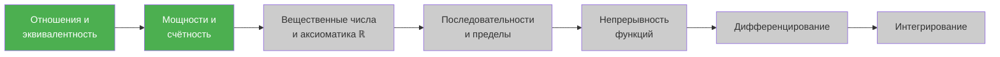

# 📈 Математический анализ (1 семестр)

> [!abstract] О предмете
> Теория пределов, дифференциальное исчисление функций одной переменной, ряды и интегралы. Но сначала — строгие основы: отношения, множества, мощности и аксиоматика $\mathbb{R}$.

> [!info] Организация курса
> - **Правила аттестации (БРС):** аналогичны линейной алгебре
> - **Консультации:** четверг, 17:00, с ментором

---

## 📝 Список лекций

| № | Дата | Тема лекции | Файл |
| :---: | :---: | :--- | :---: |
| 1 | `2026-09-08` | [Отношения, эквивалентность, порядок, индукция, мощности и счётность](./2026-09-08%20-%20Математический%20анализ%20-%20Лекция%201,%20отношения,%20эквивалентность,%20порядок,%20индукция,%20мощности%20и%20счётность.md) | [Открыть ↗](./2026-09-08%20-%20Математический%20анализ%20-%20Лекция%201,%20отношения,%20эквивалентность,%20порядок,%20индукция,%20мощности%20и%20счётность.md) |

---

## 📖 Ключевые темы 1 семестра

> [!tip] Зелёным выделены пройденные темы

---

## 📚 Литература

### Основные учебники
1. **Зорич В. А.** — *«Математический анализ»* (основной фундаментальный двухтомник)
2. **Будин А.** — *«Анализ»* (компактное пособие)
3. **Ross K.** — *«Elementary Calculus»* (англоязычный вводный курс)
4. **Виноградов И. М.** — *«Математический анализ»* (классический советский курс)

### Задачники
5. **Демидович Б. П.** — *«Сборник задач и упражнений по математическому анализу»* ⭐ **Обязательно!**
6. **Макаров Б. М., Голузина М. Г., Подкорытов А. Н.** — *«Избранные задачи по вещественному анализу»* ⭐ **«Самый лучший матан»** (по словам лектора)

---

> [!abstract] Навигация
> 🏠 [[🏠 Главная]] • 📚 [[README|Каталог конспектов]]
