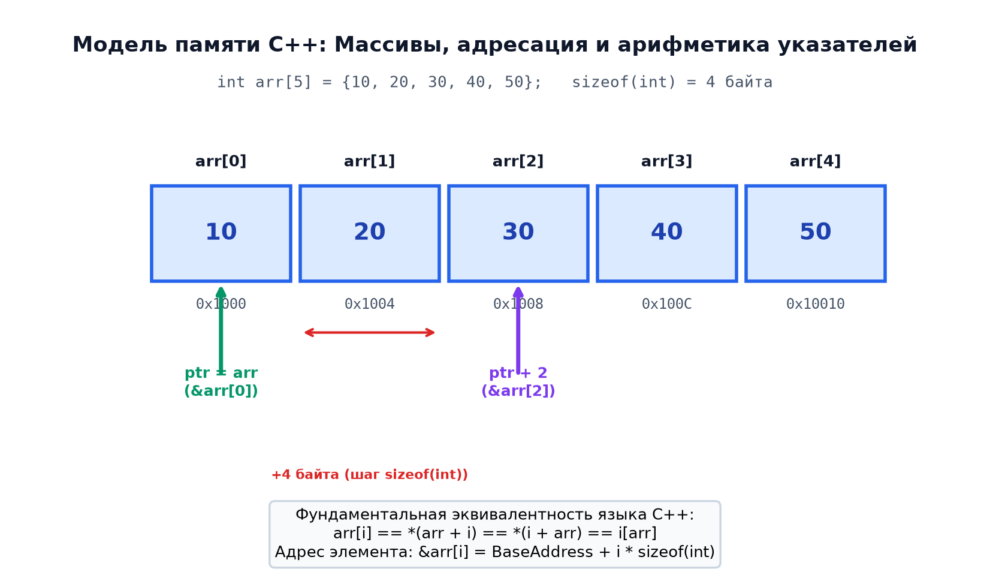

# 📌 Лекция 2: Указатели, массивы, арифметика указателей, строки и константность в C++

> [!abstract] О лекции
> - **Дисциплина:** [[Основы программирования]] (1 семестр)
> - **Преподаватели:** Александр Хвастунов / Александр Фадеев
> - **Ключевые концепции:** Адресация памяти, операторы `&` и `*`, нетипизированный указатель `void*`, `nullptr`, арифметика указателей, статические массивы и их деградация (decay) в указатели, нуль-терминированные C-строки (`const char*`), константность (указатель на константу vs константный указатель), квалификатор `constexpr`.

---

## 1. Адресация памяти и понятие указателя

Память современного компьютера с точки зрения языка C++ представляет собой непрерывную последовательность байтов, каждый из которых имеет свой уникальный беззнаковый целочисленный адрес:
$$	ext{Address} \in [0, 2^{64}-1] \quad (	ext{для 64-битной архитектуры x86-64})$$

### Определение указателя
> [!info] Указатель (Pointer)
> **Указатель** — это переменная, значением которой является адрес в оперативной памяти некоторого объекта (переменной, массива, функции или структуры).

```cpp
int x = 42;
int* ptr = &x; // ptr содержит адрес переменной x
```

- **Оператор взятия адреса (`&`)** — унарный оператор, возвращающий адрес lvalue-выражения:
  ```cpp
  std::cout << "Адрес x: " << &x << std::endl;
  std::cout << "Значение ptr: " << ptr << std::endl; // Равны
  ```
- **Оператор разыменования (`*`)** — обращается к объекту, на который указывает данный адрес:
  ```cpp
  *ptr = 100; // x теперь равен 100
  std::cout << x << std::endl; // 100
  ```

### Размер указателя
Размер любого указателя на объект не зависит от типа данных, на который он указывает, и определяется исключительно разрядностью адресной шины целевой платформы:
- 32-битные системы: $\operatorname{sizeof}(T*) = 4 	ext{ байта}$
- 64-битные системы: $\operatorname{sizeof}(T*) = 8 	ext{ байт}$

```cpp
static_assert(sizeof(char*) == sizeof(double*));
static_assert(sizeof(int*) == 8); // На 64-битных ОС
```

---

## 2. Нулевой указатель: `nullptr` vs `NULL` vs `0`

В классическом языке C и ранних стандартах C++ нулевой указатель обозначался макросом `NULL` (определяемым как `0` или `((void*)0)`). Это приводило к неоднозначности при перегрузке функций:

```cpp
void foo(int x)   { std::cout << "int\n"; }
void foo(char* p) { std::cout << "pointer\n"; }

foo(NULL); // Ошибка неоднозначности или вызов foo(int) в зависимости от компилятора!
```

> [!tip] Стандарт C++11 и ключевое слово `nullptr`
> В C++11 введен литерал `nullptr` типа `std::nullptr_t`. Он неявно приводится к любому типу указателя, но **не приводится** к целочисленным типам (кроме `bool`):
> ```cpp
> foo(nullptr); // Однозначно вызывает foo(char*)
> ```

---

## 3. Нетипизированный указатель `void*`

Указатель типа `void*` способен хранить адрес объекта любого типа, однако:
1. К `void*` **нельзя применить оператор разыменования `*`**, так как размер указуемого типа неизвестен компилятору.
2. К `void*` **не применима адресная арифметика** (в стандартном C++).

```cpp
int a = 10;
void* vptr = &a;
// *vptr = 20; // ОШИБКА КОМПИЛЯЦИИ: invalid use of void expression
int* iptr = static_cast<int*>(vptr); // Явное приведение
*iptr = 20; // Корректно
```

---

## 4. Массивы и арифметика указателей

### Объявление и размещение в памяти
Массив в C++ — это непрерывная последовательность однотипных элементов в памяти:
```cpp
int arr[5] = {10, 20, 30, 40, 50};
```

В памяти элементы располагаются строго подряд:
$$\&arr[i] = 	ext{base\_address} + i 	imes \operatorname{sizeof}(T)$$



### Затухание массива (Array Decay)
При передаче массива в функцию или в большинстве выражений имя массива неявно преобразуется (деградирует) в указатель на его первый элемент:
$$	ext{arr} \implies \&	ext{arr}[0]$$

```cpp
void printArray(const int* ptr, size_t n); // Сигнатура функции
printArray(arr, 5); // arr неявно приводится к int*
```

> [!warning] Потеря информации о размере
> Указатель `int*` не несет информации о количестве элементов в массиве. Функции, принимающие Си-массивы, обязаны явно принимать параметр длины `size_t n` (либо использовать `std::span` из C++20).

### Арифметика указателей
К указателям применимы следующие операции:
1. **Сложение указателя с целым числом:** `ptr + k`. Адрес сдвигается на $k 	imes \operatorname{sizeof}(T)$ байт:
   $$\operatorname{address}(ptr + k) = \operatorname{address}(ptr) + k \cdot \operatorname{sizeof}(T)$$
2. **Вычитание указателя и целого числа:** `ptr - k`.
3. **Разность двух указателей одного типа:** `ptr2 - ptr1`. Возвращает знаковое целое число типа `std::ptrdiff_t` — количество элементов между ними:
   $$ptr_2 - ptr_1 = rac{\operatorname{address}(ptr_2) - \operatorname{address}(ptr_1)}{\operatorname{sizeof}(T)}$$

> [!important] Тождество индексации
> По стандарту языка C/C++ операция индексации массива определяется через арифметику указателей:
> $$arr[i] \equiv *(arr + i) \equiv *(i + arr) \equiv i[arr]$$
> Запись `3[arr]` синтаксически корректна в C++, хотя категорически запрещена правилами Google Style Guide!

---

## 5. Строки в стиле Си (`C-strings`)

Строка в Си (`const char*`) — это одномерный массив символов `char`, заканчивающийся нулевым байтом (терминатором) `\0` (ASCII код 0):

```cpp
const char str[] = "Hello";
// В памяти: ['H', 'e', 'l', 'l', 'o', '\0'] (размер 6 байт!)
static_assert(sizeof(str) == 6);
```

### Стандартные функции работы со строками (`<cstring>`)
- `strlen(s)` — возвращает количество символов до `\0` (сложность $O(n)$).
- `strcpy(dest, src)` / `strncpy(dest, src, n)` — копирование строки.
- `strcmp(s1, s2)` — лексикографическое сравнение ($<0, ==0, >0$).
- `strcat(dest, src)` — конкатенация строк.

> [!danger] Уязвимости переполнения буфера
> Использование непроверяющих длину функций `strcpy`, `strcat`, `gets` приводит к выходу за границы выделенного буфера (Buffer Overflow) — критической уязвимости в информационной безопасности. Рекомендуется использовать безопасные аналоги либо переходить на `std::string` / `std::string_view`.

---

## 6. Константность и указатели: разбор комбинаций

В C++ ключевое слово `const` связывается с тем, что находится **слева** от него (если слева ничего нет — то справа):

| Объявление | Что константно? | Можно менять адрес? (`ptr = ...`) | Можно менять значение? (`*ptr = ...`) |
| :--- | :--- | :---: | :---: |
| `int* ptr` | Ничего | ✅ Да | ✅ Да |
| `const int* ptr` (или `int const* ptr`) | Данные (указатель на константу) | ✅ Да | ❌ Нет |
| `int* const ptr` | Сам указатель (константный указатель) | ❌ Нет | ✅ Да |
| `const int* const ptr` | И указатель, и данные | ❌ Нет | ❌ Нет |

### Мнемоническое правило чтения: «Справа налево»
- `const int* p` $	o$ «$p$ — это указатель (`*`) на целое число (`int`), которое является константой (`const`)».
- `int* const p` $	o$ «$p$ — это константа (`const`), которая является указателем (`*`) на целое число (`int`)».

---

## 7. Двумерные массивы и указатели на указатели

### Статический двумерный массив
```cpp
int mat[3][4]; // Выделяется непрерывно в памяти как 3*4 = 12 целых чисел
```
Адресация в `Row-Major Order`:
$$\&mat[i][j] = 	ext{base} + (i \cdot 4 + j) \cdot \operatorname{sizeof}(	ext{int})$$

### Указатель на указатель (`int**`)
Используется для динамических матриц или массивов строк:
```cpp
int** dynamic_matrix = new int*[rows];
for (size_t i = 0; i < rows; ++i) {
    dynamic_matrix[i] = new int[cols];
}
```
Такой массив фрагментирован в памяти: каждая строка лежит в своем участке кучи.

---

## 8. Типичные ошибки и Undefined Behavior

1. **Разыменование неинициализированного указателя (Wild Pointer):**
   ```cpp
   int* p; // Мусорное значение адреса
   *p = 10; // Segfault / Memory Corruption!
   ```
2. **Разыменование `nullptr`:**
   ```cpp
   int* p = nullptr;
   std::cout << *p; // UB, аварийное завершение процесса
   ```
3. **Висячий указатель (Dangling Pointer):**
   Указатель, ссылающийся на уже освобожденный участок памяти или локальную переменную, вышедшую из области видимости:
   ```cpp
   int* get_dangling() {
       int local = 42;
       return &local; // ОШИБКА: стек уничтожен при выходе из функции!
   }
   ```
4. **Выход за границы массива (Buffer Overrun):**
   ```cpp
   int a[5];
   a[5] = 100; // UB: допустимы только индексы от 0 до 4
   ```

---

## 5. 🔬 Strict Aliasing Rule, Type Punning и виртуальные таблицы

### Правило строгого алиасинга (ISO C++ [basic.lval])
Компилятор полагает, что указатели несовместимых типов не указывают на одну область памяти. Каст `(int*)&float_var` — тяжелейшее UB!  
Единственный стандартный способ (C++20): `std::bit_cast<int>(f)` или `std::memcpy`.

---

### Устройство vtable в Itanium C++ ABI
Объект полиморфного класса хранит скрытый указатель `__vptr` на таблицу адресов методов в сегменте `.rodata`. Вызов `obj->method()` преобразуется в косвенный вызов `call [rax + 16]`, что создает нагрузку на блок предсказания переходов CPU (Branch Predictor).

---

## 🚀 Фундаментальная связь с будущими дисциплинами и технологиями (ИТМО Curriculum)

1. **Операционные системы (Сем 4):**
   - Указатели являются виртуальными адресами в пространстве процесса. Драйверы ОС оперируют физическими адресами через IOMMU.
2. **Информационная безопасность (Сем 8):**
   - Атаки Return-Oriented Programming (ROP) и vptr hijacking, защита через ASLR и аппаратный Shadow Stack.

---

## 🔗 Связанные материалы
- [[Основы программирования]] — главная страница дисциплины
- [[2026-09-05 - Основы программирования - Лекция 1, типы данных, представление чисел, операторы и функции]]
- [[2026-09-12 - Основы программирования - Лекция 3, Структуры, объединения, выравнивание в памяти (padding) и побитовые поля]]
- [[2026-09-12 - Основы программирования - Лекция 4, Управление памятью, сегменты, стек и куча, динамическое выделение malloc и free, new и delete]]
