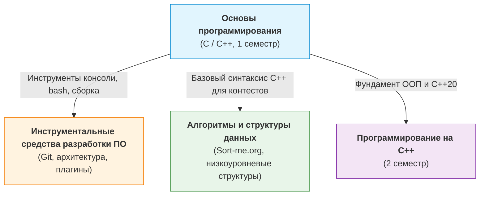

# 💻 Основы программирования (1 семестр: C / C++)

> [!abstract] О предмете
> Фундаментальный курс по языкам C и C++ (стандарты C++20 / C++23): модель памяти, система типов, представление чисел в памяти, указатели и арифметика адресов, ручное и автоматическое управление ресурсами (RAII), структуры данных, объектно-ориентированное и обобщенное программирование, автоматизация сборки (CMake), тестирование (GoogleTest), санитайзеры (ASan/UBSan) и культура разработки.
> В официальном учебном плане ИТМО дисциплина входит в профессиональный модуль «Программирование» и весит 4 з.е. (144 акад. часа).

> [!info] Преподаватели и аттестация (БРС)
> - **Преподаватели:** Хвастунов Александр Павлович, Фадеев Сергей Викторович (команда ~30 преподавателей и менторов).
> - **Сайт курса:** [is-itmo-c-26.github.io/lectures](https://is-itmo-c-26.github.io/lectures/)
> - **Формула оценки:** Максимум 100 баллов = 60 баллов за 5 лабораторных работ + 10 за Live Coding + 30 за дифференцированный зачет.
> - **Порог зачета:** не менее 60 баллов.

---

## 📝 Список лекций и учебных материалов

| Дата | Номер / Тип | Тема | Ключевые понятия | Конспект |
| :---: | :---: | :--- | :--- | :---: |
| `2026-09-02` | **Вводная** | [Организация курса, история и стандарты C и C++](./2026-09-02%20-%20Основы%20программирования%20-%20Вводная%20лекция,%20организация%20курса,%20история%20и%20стандарты%20C%20и%20C++.md) | БРС, дедлайны, Bell Labs, UNIX, K&R, C89-C23, C++98-C++26, Zero-Overhead, Clang, CMake, ASan/UBSan | [[2026-09-02 - Основы программирования - Вводная лекция, организация курса, история и стандарты C и C++\|Открыть ↗]] |
| `2026-09-02` | **Практика** | [Настройка окружения (VS Code, Clang, CMake, WSL, Санитайзеры)](./2026-09-02%20-%20Основы%20программирования%20-%20Практическое%20руководство%20по%20настройке%20окружения%20(VS%20Code,%20Clang,%20CMake,%20WSL,%20Санитайзеры).md) | WSL Ubuntu, VS Code + clangd, CMakeLists.txt, Ninja, .clang-format, CodeLLDB, санитайзеры | [[2026-09-02 - Основы программирования - Практическое руководство по настройке окружения (VS Code, Clang, CMake, WSL, Санитайзеры)\|Открыть ↗]] |
| `2026-09-05` | **Лекция 1** | [Типы данных, представление чисел, операторы и функции](./2026-09-05%20-%20Основы%20программирования%20-%20Лекция%201,%20типы%20данных,%20представление%20чисел,%20операторы%20и%20функции.md) | LP64/LLP64, unsigned mod $2^N$, доп. код (Two's Complement), знаковое переполнение (UB), IEEE 754 (5.75), литералы, enum class, 15 уровней приоритетов, dangling else, continue в for vs while, switch jump table, argc/argv, рекурсия vs итерация, name shadowing | [[2026-09-05 - Основы программирования - Лекция 1, типы данных, представление чисел, операторы и функции\|Открыть ↗]] |
| `2026-09-07` | **Семинар** | [Работа с консолью и Linux-окружение для C++](./2026-09-07%20-%20Основы%20программирования%20-%20Семинар,%20работа%20с%20консолью%20и%20Linux%20окружение%20для%20C++.md) | Терминал vs Shell, навигация, файловые операции, потоки stdin/stdout/stderr, перенаправления, конвейеры `\|`, права доступа chmod, сборка через Clang, коды возврата `$?` *(тесно связан с курсом ИСРПО)* | [[2026-09-07 - Основы программирования - Семинар, работа с консолью и Linux окружение для C++\|Открыть ↗]] |

> 📌 **Интерактивный трекер тем с чекбоксами:** [[Чек-лист изучения материалов по предметам|Открыть чек-лист по всем предметам ↗]]

---

## 🔗 Междисциплинарные связи курса

---

## 🧪 Лабораторные работы и правила сдачи

В течение семестра выполняется **5 лабораторных работ**:
- **Репозиторий:** Для каждой лабы генерируется отдельный персональный Git-репозиторий.
- **Ветки дедлайнов:** Сдача ведется через ветку `deadline_N` (начиная с `deadline_0`).
- **Сдача через Pull Request:** Решение оформляется как PR в ветку `main` (самостоятельно не мержить!).
- **Мягкие дедлайны (Soft Deadlines):** 2 недели на выполнение. Просрочка на 1 неделю снижает балл до $	imes 0.8$, на 2 недели — до $	imes 0.65$, на 3+ недели — до $	imes 0.5$.
- **Требования к коду:** Google C++ Style Guide, сборка через CMake, покрытие тестами GoogleTest, отсутствие ошибок в ASan и UBSan.
- **Code Review:** Предварительное ревью менторов доступно через специальную Google Форму курса.

---

## 📚 Ресурсы и литература

### Основные учебники
- **Стенли Липпман, Жози Лажойе, Барбара Му** — *«C++ Primer» (5-е издание)*
- **Бьёрн Страуструп** — *«Язык программирования C++»*
- **Брайан Керниган, Деннис Ритчи** — *«Язык программирования C»*
- **Николай Джосаттис** — *«Стандартная библиотека C++»*
- **Скотт Мейерс** — *«Эффективный и современный С++»*

### Интернет-ресурсы и каналы
- 📖 [cppreference.com](https://en.cppreference.com/) — официальная документация C and C++
- 💻 [Godbolt Compiler Explorer](https://godbolt.org/) — исследование компиляции и ассемблера
- 💬 [Telegram-чат курса ITMO C++ 26/27](https://t.me/+KC_tNYHlmLBhNWFi)
- 📢 [Telegram-канал с объявлениями курса](https://t.me/+FbV6Q3VFRZYxNDky)
- 🎥 [YouTube-канал Александра Хвастунова](https://www.youtube.com/@hvastunovalexandr)

---

> [!abstract] Навигация
> 🏠 [[🏠 Главная]] • 📚 [[README|Каталог 1 семестра]] • 🛠️ [[Инструментальные средства разработки ПО]] • ⚡ [[Алгоритмы и структуры данных]]
