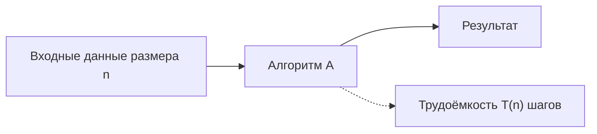
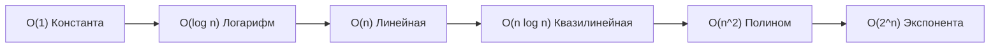

# 01. Лекция - Асимптотический анализ алгоритмов и функция времени (2026-09-05)

> [!info] Метаданные занятия
> **Дисциплина:** [[Алгоритмы и структуры данных]]  
> **Поток:** 1 поток (Software Engineering)  
> **Дата:** 5 сентября 2026  
> **Формат:** Лекция 1  
> **Предыдущая тема:** Вводное занятие  
> **Следующая тема:** [[02. Лекция - Асимптотические нотации и базовые сортировки (2026-09-12)|02. Лекция - Асимптотические нотации и базовые сортировки]]

---

## 1. Понятие алгоритма и атомарные операции

> [!abstract] Определение алгоритма
> **Алгоритм** — это точная и детерминированная последовательность действий (инструкций), преобразующая входные данные (ввод) в выходные данные (вывод) за конечное число шагов.

Чтобы теоретически анализировать время работы алгоритма независимо от тактовой частоты процессора, компилятора или архитектуры памяти, работу алгоритма разбивают на **атомарные операции** (элементарные шаги).

К элементарным операциям относятся:
- Арифметические действия над машинными числами фиксированного размера ($+$, $-$, $\times$, $/$, $\%$).
- Битовые операции (`&`, `|`, `^`, `<<`, `>>`).
- Сравнение двух чисел ($<$, $\le$, $==$, $\ne$, $>$, $\ge$).
- Присваивание значения переменной и разыменование указателя/индексация массива ($a[i]$).
- Переход по условию (`if`) и одна итерация цикла.

Считается, что каждая атомарная операция выполняется за **постоянное время** $t = \text{const}$, не зависящее от общего объёма входных данных $n$.

---

## 2. Функция трудоёмкости $T(n)$

Для количественной оценки вычислительной сложности вводится функция трудоёмкости $T(n)$:

$$T(n) = \text{число элементарных операций, выполняемых алгоритмом на входе размера } n$$



### Пример: Суммирование элементов массива
Рассмотрим простейший алгоритм:

```c
long long sum = 0;           // 1 операция инициализации
for (int i = 0; i < n; ++i) { // n проверок и n инкрементов
    sum += a[i];             // n сложений и n обращений к памяти
}
```

Точное число операций выражается линейной функцией:
$$T(n) = c_1 n + c_0$$
где $c_1$ и $c_0$ — платформенно-зависимые константы.

---

## 3. Мотивация асимптотического анализа: почему важен порядок роста

Пусть для одной и той же задачи разработаны два алгоритма со следующими функциями трудоёмкости:

$$T_1(n) = n^3 + 15n^2 + 72$$
$$T_2(n) = 550\,000n^2 + 352n + 4$$

На малых размерах входных данных коэффициент $550\,000$ делает алгоритм $T_2$ несоизмеримо медленнее. Однако при увеличении $n$ ситуация кардинально меняется:

| Размер входа $n$ | $T_1(n) = n^3 + 15n^2 + 72$ | $T_2(n) = 550\,000n^2 + 352n + 4$ | Победитель |
|---|---|---|---|
| $n = 10$ | $2\,572$ | $\approx 5.5 \times 10^7$ | $T_1$ быстрее в $21\,000$ раз |
| $n = 100$ | $\approx 1.15 \times 10^6$ | $\approx 5.5 \times 10^9$ | $T_1$ быстрее в $4\,780$ раз |
| $n = 1\,000$ | $\approx 1.015 \times 10^9$ | $\approx 5.5 \times 10^{11}$ | $T_1$ быстрее в $540$ раз |
| $n = 10\,000$ | $\approx 1.0015 \times 10^{12}$ | $\approx 5.5 \times 10^{13}$ | $T_1$ быстрее в $55$ раз |
| $n = 600\,000$ | $\approx 2.16 \times 10^{17}$ | $\approx 1.98 \times 10^{17}$ | **Точка перегиба:** $T_2$ обгоняет $T_1$ |
| $n = 10^7$ | $10^{21}$ | $\approx 5.5 \times 10^{19}$ | **$T_2$ быстрее в $18$ раз** |

> [!important] Фундаментальный закон асимптотики
> При $n \to \infty$ поведение функции трудоёмкости целиком и полностью определяется её **старшим (доминирующим) слагаемым**.
> Любые постоянные коэффициенты и младшие члены при больших $n$ становятся пренебрежимо малыми по сравнению с разницей в показателе степени.

---

## 4. Классические асимптотические классы

Для классификации функций роста в математической информатике используется шкала порядков:

$$O(1) \ll O(\log n) \ll O(\sqrt{n}) \ll O(n) \ll O(n \log n) \ll O(n^2) \ll O(n^3) \ll O(2^n) \ll O(n!)$$



---

## 5. Анализ типовых циклических конструкций

### 5.1. Константный цикл
```c
for (int i = 0; i < 100; ++i) {
    // тело цикла O(1)
}
```
Число шагов не зависит от размера входных данных $n$: $T(n) = 100 \times O(1) = O(1)$.

### 5.2. Линейный цикл
```c
for (int i = 0; i < n; ++i) {
    // тело цикла O(1)
}
```
Итераций ровно $n$: $T(n) = O(n)$.

### 5.3. Независимый вложенный цикл с константой
```c
for (int i = 0; i < 100; ++i) {
    for (int j = 0; j < n; ++j) {
        // тело цикла O(1)
    }
}
```
Итераций $100n$. Константа $100$ поглощается: $T(n) = O(n)$.

### 5.4. Корневой цикл
```c
for (int i = 0; i * i < n; ++i) {
    // тело цикла O(1)
}
```
Условие остановки $i^2 \ge n \iff i \ge \sqrt{n}$. Число шагов $\approx \sqrt{n}$, следовательно $T(n) = O(\sqrt{n})$.

---

## 6. Введение в алгоритм сортировки вставками (Insertion Sort)

**Сортировка вставками** моделирует раскладывание игральных карт в руке:
1. Массив делится на отсортированную часть $a[0 \dots i-1]$ и неотсортированную $a[i \dots n-1]$.
2. Элемент $a[i]$ извлекается в переменную `key`.
3. Все элементы отсортированной части, большие `key`, сдвигаются вправо на 1 позицию.
4. `key` помещается на освободившуюся позицию.

```c
void InsertionSort(int* a, int n) {
    for (int i = 1; i < n; ++i) {
        int key = a[i];
        int j = i - 1;
        while (j >= 0 && a[j] > key) {
            a[j + 1] = a[j];
            j = j - 1;
        }
        a[j + 1] = key;
    }
}
```

### Анализ трудоёмкости:
- **Худший случай** (массив отсортирован по убыванию):
  $$T(n) = \sum_{i=1}^{n-1} i = 1 + 2 + \dots + (n-1) = \frac{n(n-1)}{2} = \frac{n^2 - n}{2} = O(n^2)$$
- **Лучший случай** (массив уже упорядочен):
  $$T(n) = n - 1 = O(n)$$
- **Память:** алгоритм выполняется «на месте» (*in-place*), дополнительная память $O(1)$.

---

## 🔗 Связанные материалы
- ➡️ Следующая лекция: [[02. Лекция - Асимптотические нотации и базовые сортировки (2026-09-12)]]
- 🏠 Хаб дисциплины: [[Алгоритмы и структуры данных]]
