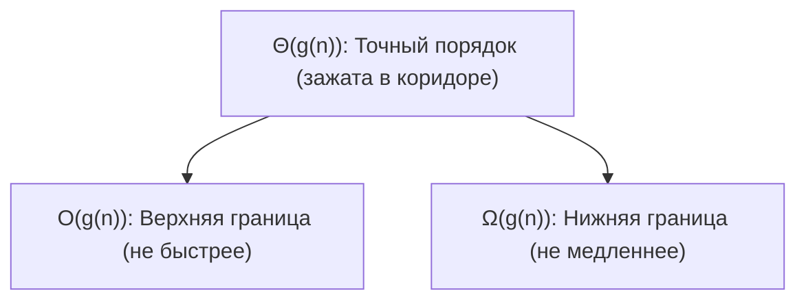
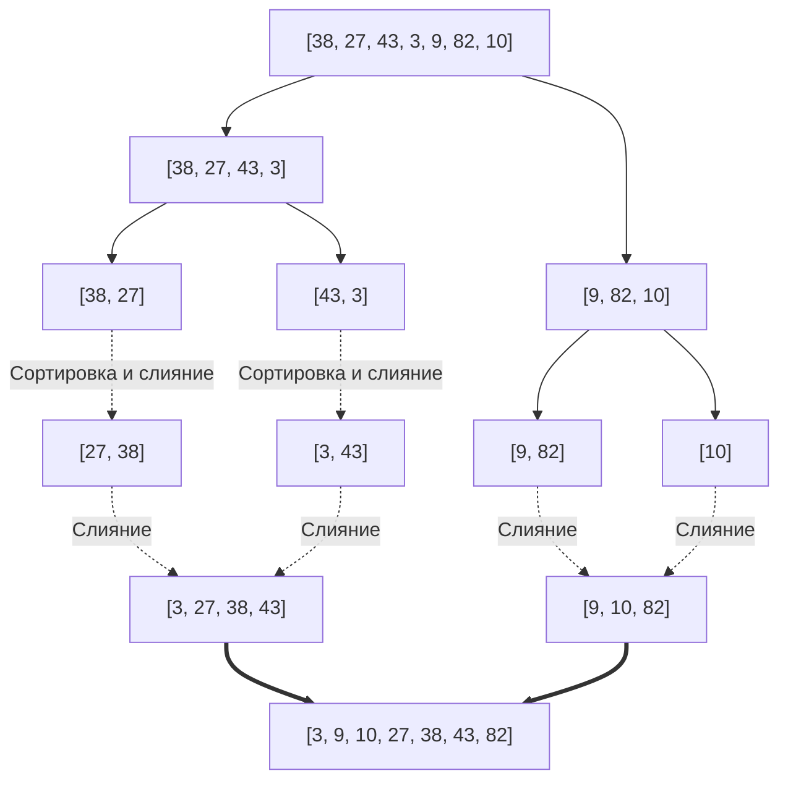

# 02. Лекция - Асимптотические нотации и базовые сортировки (2026-09-12)

> [!info] Метаданные занятия
> **Дисциплина:** [[Алгоритмы и структуры данных]]  
> **Поток:** 1 поток (Software Engineering)  
> **Дата:** 12 сентября 2026  
> **Формат:** Лекция 2  
> **Предыдущая тема:** [[01. Лекция - Асимптотический анализ алгоритмов и функция времени (2026-09-05)|01. Лекция - Асимптотический анализ алгоритмов и функция времени]]  
> **Следующая тема:** Сортировки разделяй и властвуй (Quicksort, линейные сортировки)

---

## 1. Строгие математические определения асимптотических нотаций

Асимптотические обозначения Бахмана — Ландау строго формализуют порядок роста функций при $n \to \infty$.



### 1.1. $O$-нотация (Верхняя асимптотическая оценка)
> [!abstract] Определение $O(g(n))$
> Функция $f(n) \in O(g(n))$, если существуют строго положительные константы $c > 0$ и $n_0 > 0$, такие что:
> $$\forall n > n_0: \quad 0 \le f(n) \le c \cdot g(n)$$

**Интуиция:** График $c \cdot g(n)$ служит неустранимым «потолком» для $f(n)$ при всех достаточно больших $n > n_0$.

### 1.2. $\Omega$-нотация (Нижняя асимптотическая оценка)
> [!abstract] Определение $\Omega(g(n))$
> Функция $f(n) \in \Omega(g(n))$, если существуют константы $c > 0$ и $n_0 > 0$, такие что:
> $$\forall n > n_0: \quad 0 \le c \cdot g(n) \le f(n)$$

**Интуиция:** График $c \cdot g(n)$ образует «пол», ниже которого $f(n)$ никогда не опускается при $n > n_0$.

### 1.3. $\Theta$-нотация (Точная двусторонняя оценка)
> [!abstract] Определение $\Theta(g(n))$
> Функция $f(n) \in \Theta(g(n))$, если существуют константы $c_1 > 0$, $c_2 > 0$ и $n_0 > 0$, такие что:
> $$\forall n > n_0: \quad 0 \le c_1 \cdot g(n) \le f(n) \le c_2 \cdot g(n)$$

$$f(n) \in \Theta(g(n)) \iff f(n) \in O(g(n)) \land f(n) \in \Omega(g(n))$$

---

## 2. Различие между нотациями и случаями алгоритма

> [!caution] Распространённая ошибка
> Никогда не отождествляйте нотацию $O$ с худшим случаем (*worst case*), а $\Omega$ — с лучшим (*best case*)!
> - $O, \Omega, \Theta$ — это **математические формы описания функции**.
> - Worst, Best, Average — это **семейства входных данных**.

Для любого алгоритма можно рассматривать $O, \Omega, \Theta$ в каждом из случаев:
- Для Insertion Sort в худшем случае: $T_{\text{worst}}(n) = \Theta(n^2)$.
- Для Insertion Sort в лучшем случае: $T_{\text{best}}(n) = \Theta(n)$.
- В целом для произвольного входа: $T(n) = O(n^2)$ и $T(n) = \Omega(n)$.

---

## 3. Алгебраические свойства асимптотических оценок

1. **Сложение (доминирование):**
   $$O(f(n)) + O(g(n)) = O(\max(f(n), g(n)))$$
   *Пример:* $O(n) + O(n^2) = O(n^2)$.
2. **Умножение (вложенность):**
   $$O(f(n)) \cdot O(g(n)) = O(f(n) \cdot g(n))$$
   *Пример:* внешний цикл $O(n)$ и внутренний $O(\log n)$ дают $O(n \log n)$.
3. **Поглощение константного множителя:**
   $$c \cdot O(f(n)) = O(f(n)) \quad (c > 0)$$
4. **Транзитивность:**
   $$f \in O(g) \land g \in O(h) \implies f \in O(h)$$

---

## 4. Свойства алгоритмов сортировки: Устойчивость и Память

### 4.1. Ключ сортировки (Sort Key)
Атрибут элемента данных, по которому производится отношение линейного порядка. Если сортируются составные записи (например, `struct Student { string name; int score; int age; };`), сортировка может вестись по `score`, а при равенстве — по `age`.

### 4.2. Устойчивость (Stability)
> [!abstract] Определение устойчивой сортировки
> Сортировка называется **устойчивой** (*stable*), если она сохраняет исходный взаимный порядок элементов с эквивалентными ключами:
> $$\text{если } a[i].\text{key} == a[j].\text{key} \text{ и } i < j, \text{ то в отсортированном массиве } a[i] \text{ предшествует } a[j].$$

Устойчивость критически необходима при многостадийной сортировке (например, сначала по имени, затем по курсу).

| Алгоритм | Худшее время | Среднее время | Лучшее время | Память | Устойчивость |
|---|---|---|---|---|---|
| **Insertion Sort** | $O(n^2)$ | $O(n^2)$ | $O(n)$ | $O(1)$ in-place | **Да (Stable)** |
| **Selection Sort** | $O(n^2)$ | $O(n^2)$ | $O(n^2)$ | $O(1)$ in-place | **Нет** |
| **Bubble Sort** | $O(n^2)$ | $O(n^2)$ | $O(n)$ | $O(1)$ in-place | **Да (Stable)** |
| **Merge Sort** | $O(n \log n)$ | $O(n \log n)$ | $O(n \log n)$ | $O(n)$ | **Да (Stable)** |

---

## 5. Парадигма «Разделяй и властвуй» (Divide and Conquer)

Метод декомпозиции состоит из трёх обязательных фаз:
1. **Divide (Разделяй):** разбиение исходной задачи размера $n$ на несколько меньших подзадач того же типа.
2. **Conquer (Властвуй):** рекурсивное решение подзадач. При достижении базового размера (размер 1 или 0) решение тривиально.
3. **Combine (Объединяй):** слияние решений подзадач в единый результат для исходной задачи.

---

## 6. Сортировка слиянием (Merge Sort)



### 6.1. Реализация на C++ (полуоткрытый интервал $[l, r)$)

```cpp
#include <vector>

void Merge(std::vector<int>& a, int l, int mid, int r) {
    std::vector<int> temp;
    temp.reserve(r - l);
    int it1 = l;
    int it2 = mid;

    while (it1 < mid && it2 < r) {
        if (a[it1] <= a[it2]) { // <= гарантирует устойчивость (stability)
            temp.push_back(a[it1++]);
        } else {
            temp.push_back(a[it2++]);
        }
    }
    while (it1 < mid) temp.push_back(a[it1++]);
    while (it2 < r)   temp.push_back(a[it2++]);

    for (int i = 0; i < static_cast<int>(temp.size()); ++i) {
        a[l + i] = temp[i];
    }
}

void MergeSort(std::vector<int>& a, int l, int r) {
    if (r - l <= 1) return; // базовый случай: 0 или 1 элемент
    int mid = l + (r - l) / 2;
    MergeSort(a, l, mid);
    MergeSort(a, mid, r);
    Merge(a, l, mid, r);
}
```

### 6.2. Рекуррентное уравнение и дерево рекурсии
Трудоёмкость алгоритма описывается соотношением:
$$T(n) = 2T\left(\frac{n}{2}\right) + O(n)$$

Глубина дерева рекурсии составляет $\log_2 n$ уровней. На каждом уровне суммарно для слияния всех подмассивов выполняется ровно $O(n)$ операций:
$$T(n) = \sum_{k=0}^{\log_2 n} O(n) = O(n \log n)$$

- **Временная сложность:** $\Theta(n \log n)$ во всех случаях (худший, средний, лучший).
- **Пространственная сложность:** $O(n)$ дополнительной памяти для временного буфера слияния.

---

## 🔗 Связанные материалы
- ⬅️ Предыдущая лекция: [[01. Лекция - Асимптотический анализ алгоритмов и функция времени (2026-09-05)]]
- 🏠 Хаб дисциплины: [[Алгоритмы и структуры данных]]
