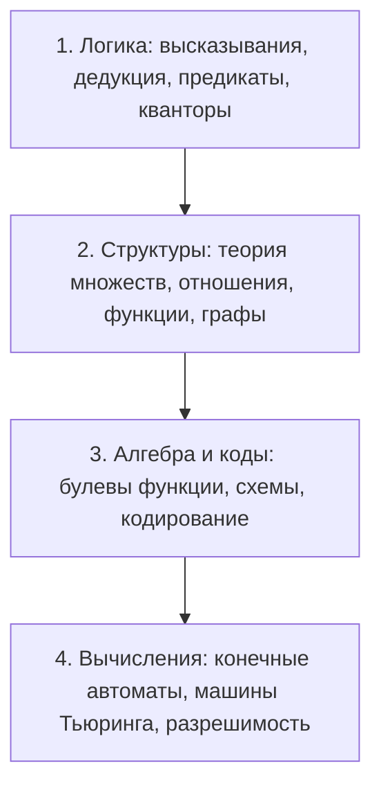

# 🔢 Дискретная математика (Поток 1)

> [!info] Академический статус курса
> **Семестр:** 1 семестр (Осень 2026)  
> **Трудоёмкость:** 4 з.е.  
> **Форма итогового контроля:** Экзамен (дифференцированный зачёт / экзамен, 100 баллов)  
> **Формат:** Еженедельные лекции и практики, 5-минутные тесты в начале лекций, домашние задания (База / Челлендж / Бонус), 4 контрольные работы, 2 теоретических минимума

---

## 🏛️ Архитектура курса

Программа дискретной математики разбита на 4 фундаментальных блока:

---

## 📊 Формы контроля и баллы

| Компонент | Баллы / Регламент | Описание |
|---|---|---|
| **Мини-тесты на лекциях** | $+1$ балл за тест | Проводятся в начале каждой лекции (5 минут) для проверки понимания предшествующего материала. |
| **Домашние задания** | $\approx 40$ задач за семестр | Трёхуровневая система: **База** (обязательна), **Челлендж** (повышенная сложность), **Бонус** (дополнительные баллы). |
| **Контрольные работы** | 4 работы по 1.5 часа | Проводятся по завершении ключевых модулей семестра. |
| **Теоретические минимумы** | 2 теормина | Проверка точных формулировок определений, аксиом и теорем. |
| **Экзамен** | $12 - 20$ баллов | Итоговая проверка теоретической подготовки и решения синтетических задач. |

---

## 📚 Конспекты лекций и практик

| № | Название занятия | Дата | Формат | Ключевые понятия |
|---|---|---|---|---|
| 01 | [[01. Лекция - Вводная лекция и логика высказываний (2026-09-02)\|Вводная лекция и логика высказываний]] | 2026-09-02 | Лекция | Высказывания, пропозициональные переменные, связки $\neg, \land, \lor, \to, \leftrightarrow$, таблицы истинности |
| 01 | [[01. Практика - Теория множеств и аксиоматические конструкции чисел (2026-09-02)\|Теория множеств и конструкции чисел]] | 2026-09-02 | Практика | Множества, принадлежность, булеан, операции $\cup, \cap, \setminus, \triangle$, парадокс Рассела, конструкция фон Неймана |
| 02 | [[02. Лекция - Предикаты и кванторы (2026-09-09)\|Предикаты и кванторы]] | 2026-09-09 | Лекция | Предикаты $P(x)$, кванторы $\forall, \exists, \exists!$, область истинности, законы де Моргана для кванторов |

---

## 🧭 Навигация
- ⬅️ [[Конспекты/1 семестр/Поток 1/README|Общий навигатор 1 потока]]
- 📚 [[Конспекты/1 семестр/README|Все потоки 1 семестра]]
