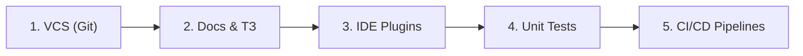

# 01. Лекция - Введение в инструменты разработки и культуру отчетности (2026-09-02)

> [!info] Метаданные занятия
> **Дисциплина:** [[Инструментальные средства разработки ПО]]  
> **Поток:** 1 поток (Software Engineering)  
> **Дата:** 2 сентября 2026  
> **Формат:** Лекция 1  
> **Предыдущая тема:** —  
> **Следующая тема:** [[01. Практикум - Основы работы с консольным Git (2026-09-09)|01. Практикум - Основы работы с консольным Git]]

---

## 1. Назначение курса и инженерный стек

Программная инженерия отличается от теоретического программирования тем, что реальные проекты создаются командами людей и развиваются годами. Для этого необходим профессиональный инструментарий:

---

## 2. Модули лабораторных работ

1. **Модуль 1: Распределённые системы контроля версий (Git)**
   - Освоение консольного Git CLI.
   - Управление ветками, работа с удалёнными репозиториями, разрешение конфликтов слияния.
2. **Модуль 2: Проектирование и документирование ПО**
   - Разработка формального Технического Задания (ТЗ).
   - Ведение документации в парадигме *Docs-as-Code* (Markdown, диаграммы).
3. **Модуль 3: Расширение среды разработки (IDE Plugins)**
   - Изучение архитектуры IDE (AST, события редактора).
   - Создание расширения для автоматизации рутинных задач.
4. **Модуль 4: Модульное тестирование (Unit Testing)**
   - Философия юнит-тестов, изоляция зависимостей.
   - Тестирование граничных условий, метрики покрытия (LCOV).
5. **Модуль 5: Непрерывная интеграция и доставка (CI/CD)**
   - Создание автоматизированных пайплайнов сборки и тестирования в облачной инфраструктуре.

---

## 3. Инженерные стандарты оформления отчётов

Отчёт по инженерной практике — это документ, подтверждающий не только результат, но и правильность процесса разработки:
- **Шаг 1:** Постановка задачи и обоснование выбранной команды/подхода.
- **Шаг 2:** Терминальная команда и параметры запуска.
- **Шаг 3:** Листинг вывода консоли или скриншот состояния системы.
- **Шаг 4:** Анализ полученного результата и выводы.

---

## 4. Регламент дедлайнов и использование ассистивного ИИ

> [!important] Принципы работы
> - **Ритмичность:** Лабораторные сдаются последовательно (цикл — 2 недели). Сдать все работы за один день в конце семестра невозможно.
> - **Болезни и пропуски:** Предусмотрена возможность продления сроков по уважительным причинам без критической потери баллов.
> - **Роль ИИ:** Искусственный интеллект допустим как вспомогательный инструмент поиска информации и рефакторинга. Студент обязан лично защищать каждое архитектурное решение и каждую строчку кода перед преподавателем.

---

## 🔗 Связанные материалы
- 👥 Практикум: [[01. Практикум - Основы работы с консольным Git (2026-09-09)]]
- 🏠 Хаб дисциплины: [[Инструментальные средства разработки ПО]]
