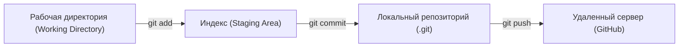

# 01. Практикум - Основы работы с консольным Git (2026-09-09)

> [!info] Метаданные занятия
> **Дисциплина:** [[Инструментальные средства разработки ПО]]  
> **Поток:** 1 поток (Software Engineering)  
> **Дата:** 9 сентября 2026  
> **Формат:** Практикум 1  
> **Предыдущая тема:** [[01. Лекция - Введение в инструменты разработки и культуру отчетности (2026-09-02)|01. Лекция - Введение в инструменты разработки и культуру отчетности]]  
> **Следующая тема:** Документирование и разработка ТЗ

---

## 1. Архитектура Git: три состояния файлов

Git оперирует тремя основными локальными зонами:


1. **Working Tree:** физические файлы на диске, в которых программист вносит изменения.
2. **Staging Area (Index):** снимок подготовленных к коммиту изменений.
3. **Repository (HEAD):** неизменяемая цепочка снимков (коммитов), идентифицируемых криптографическими хешами SHA-1 / SHA-256.

---

## 2. Базовый рабочий цикл в терминале

### 2.1. Клонирование существующего репозитория
```bash
git clone https://github.com/example/project.git
cd project
```

### 2.2. Создание ветки новой функциональности
```bash
# Создание ветки и мгновенное переключение
git checkout -b feature/new-geometry-module

# Современная альтернатива в Git 2.23+:
git switch -c feature/new-geometry-module
```

### 2.3. Добавление изменений и создание коммита
```bash
# Проверка текущего статуса
git status

# Индексация нового файла
git add geometry.py

# Фиксация изменений с информативным сообщением
git commit -m "feat(geometry): add rectangle perimeter and area calculation"
```

---

## 3. Навигация и визуализация графа коммитов

Чтобы понимать историю репозитория без графических оболочек, используются расширенные флаги `git log`:

```bash
# Однострочный граф всей истории репозитория:
git log --graph --oneline --all --decorate

# История только текущей рабочей ветки:
git log --graph --oneline -n 5
```

```text
* 30f0993 (HEAD -> feature/geometry) fix: correct perimeter arithmetic bug
* 9c6e8e9 feat: add rectangle module
* a1b2c3d (origin/main, main) Initial commit
```

### Анализ конкретного коммита:
```bash
# Просмотр метаданных коммита и его diff:
git show <COMMIT_HASH>

# Сравнение рабочей копии с последним коммитом:
git diff
```

---

## 4. Управление ветками

```bash
# Список всех локальных веток (* указывает на активную):
git branch

# Удаление слитой ветки:
git branch -d feature/name

# Принудительное удаление неслитой ветки (с осторожностью):
git branch -D feature/name
```

---

## 🔗 Связанные материалы
- 📖 Лекция: [[01. Лекция - Введение в инструменты разработки и культуру отчетности (2026-09-02)]]
- 🏠 Хаб дисциплины: [[Инструментальные средства разработки ПО]]
