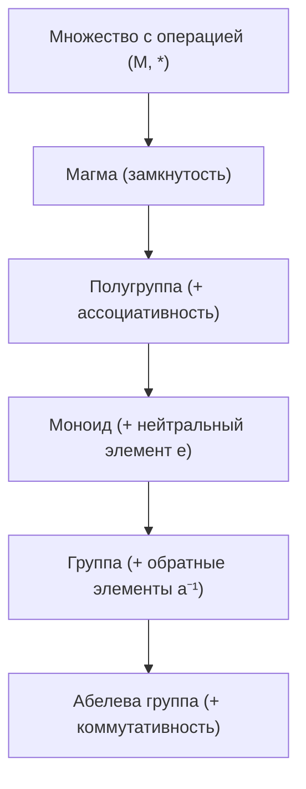

# 01. Лекция - Основные алгебраические структуры и бинарные операции (2026-09-03)

> [!info] Метаданные занятия
> **Дисциплина:** [[Линейная алгебра и геометрия]]  
> **Поток:** 1 поток (Software Engineering)  
> **Дата:** 3 сентября 2026  
> **Формат:** Лекция 1  
> **Предыдущая тема:** —  
> **Следующая тема:** [[02. Лекция - Поле комплексных чисел и тригонометрическая форма (2026-09-10)|02. Лекция - Поле комплексных чисел и тригонометрическая форма]]

---

## 1. Бинарные операции на множестве

> [!abstract] Определение бинарной операции
> Пусть $M$ — непустое множество. **Бинарной операцией** на $M$ называется отображение декартова произведения $M \times M$ в само множество $M$:
> $$*: M \times M \to M, \qquad (a, b) \longmapsto a * b \in M$$

Ключевым фундаментальным требованием является **замкнутость**: результат операции над любыми элементами $a, b \in M$ обязан принадлежать множеству $M$.

### Аксиомы бинарных операций:
1. **Ассоциативность:** $\forall a, b, c \in M: \quad (a * b) * c = a * (b * c)$.
2. **Коммутативность:** $\forall a, b \in M: \quad a * b = b * a$.
3. **Существование нейтрального элемента ($e$):**
   $$\exists e \in M : \forall a \in M \quad a * e = e * a = a$$
4. **Существование обратного элемента ($a^{-1}$):**
   $$\forall a \in M \; \exists a^{-1} \in M : \quad a * a^{-1} = a^{-1} * a = e$$

---

## 2. Иерархия алгебраических структур с одной операцией

| Алгебраическая структура | Замкнутость | Ассоциативность | Нейтральный элемент | Обратный элемент | Коммутативность |
|---|:---:|:---:|:---:|:---:|:---:|
| **Полугруппа** | ✅ | ✅ | ❌ | ❌ | ❌ |
| **Моноид** | ✅ | ✅ | ✅ | ❌ | ❌ |
| **Группа** | ✅ | ✅ | ✅ | ✅ | ❌ |
| **Абелева группа** | ✅ | ✅ | ✅ | ✅ | ✅ |

### Примеры:
- $(\mathbb{N}, +)$ — коммутативная полугруппа (нет нейтрального нуля в классическом $\mathbb{N}$).
- $(\mathbb{Z}, +)$ — абелева группа (нейтральный $0$, обратный $-a$).
- $(\mathbb{Q} \setminus \{0\}, \cdot)$ — абелева группа (нейтральная $1$, обратный $1/a$).
- $(M_n(\mathbb{R}), \cdot)$ — некоммутативный моноид с единичной матрицей $I$ (для обратимых матриц — группа $GL_n(\mathbb{R})$).

---

## 3. Структуры с двумя операциями: Кольца и Поля

В линейной алгебре центральное место занимают множества, наделённые сразу двумя согласованными операциями — сложением ($+$) и умножением ($\cdot$).

### 3.1. Кольцо (Ring)
> [!abstract] Определение кольца
> Множество $R$ с операциями $+$ и $\cdot$ называется **кольцом**, если:
> 1. $(R, +)$ — абелева группа (с нейтральным нулём $0$).
> 2. $(R, \cdot)$ — полугруппа (ассоциативность умножения).
> 3. Выполняются законы **дистрибутивности** умножения относительно сложения:
>    $$a \cdot (b + c) = a \cdot b + a \cdot c$$
>    $$(a + b) \cdot c = a \cdot c + b \cdot c$$

### 3.2. Поле (Field)
> [!abstract] Определение поля
> Множество $\mathbb{F}$ с операциями $+$ и $\cdot$ называется **полем**, если:
> 1. $(\mathbb{F}, +)$ — абелева группа.
> 2. $(\mathbb{F} \setminus \{0\}, \cdot)$ — **абелева группа** (умножение ассоциативно, коммутативно, существует единица $1 \ne 0$, и для каждого ненулевого элемента существует обратный $a^{-1}$).
> 3. Выполняется закон дистрибутивности.

**Классические числовые поля:**
$$\mathbb{Q} \subset \mathbb{R} \subset \mathbb{C}$$
Кольцо целых чисел $\mathbb{Z}$ **не является полем**, так как у чисел $\pm 2, \pm 3, \dots$ нет мультипликативно обратных элементов внутри $\mathbb{Z}$.

---

## 🔗 Связанные материалы
- 👥 Практика этой недели: [[01. Практика - Комплексные числа и арифметические операции (2026-09-04)]]
- ➡️ Следующая лекция: [[02. Лекция - Поле комплексных чисел и тригонометрическая форма (2026-09-10)]]
- 🏠 Хаб дисциплины: [[Линейная алгебра и геометрия]]
