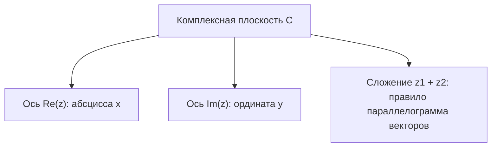

# 01. Практика - Комплексные числа и арифметические операции (2026-09-04)

> [!info] Метаданные занятия
> **Дисциплина:** [[Линейная алгебра и геометрия]]  
> **Поток:** 1 поток (Software Engineering)  
> **Дата:** 4 сентября 2026  
> **Формат:** Практика 1  
> **Предыдущая тема:** —  
> **Связанная лекция:** [[01. Лекция - Основные алгебраические структуры и бинарные операции (2026-09-03)]]

---

## 1. Алгебраическая форма комплексного числа

> [!abstract] Определение
> **Комплексным числом** $z$ называется выражение вида:
> $$z = a + bi$$
> где $a, b \in \mathbb{R}$, а $i$ — мнимая единица, удовлетворяющая равенству $i^2 = -1$.
> - $a = \operatorname{Re}(z)$ — вещественная часть (*real part*).
> - $b = \operatorname{Im}(z)$ — мнимая часть (*imaginary part*).

### Критерий равенства:
$$z_1 = z_2 \iff \begin{cases} \operatorname{Re}(z_1) = \operatorname{Re}(z_2) \\ \operatorname{Im}(z_1) = \operatorname{Im}(z_2) \end{cases}$$

---

## 2. Арифметические операции над $z = a + bi$

Пусть $z_1 = x_1 + y_1 i$ и $z_2 = x_2 + y_2 i$:

### 2.1. Сложение и вычитание
$$z_1 \pm z_2 = (x_1 \pm x_2) + (y_1 \pm y_2) i$$

### 2.2. Умножение
$$z_1 \cdot z_2 = (x_1 + y_1 i)(x_2 + y_2 i) = (x_1 x_2 - y_1 y_2) + (x_1 y_2 + y_1 x_2)i$$

### 2.3. Комплексное сопряжение
Для числа $z = x + yi$ сопряжённым называется $\overline{z} = x - yi$.
Важнейшее тождество:
$$z \cdot \overline{z} = (x + yi)(x - yi) = x^2 - y^2 i^2 = x^2 + y^2 = |z|^2 \in \mathbb{R}_{\ge 0}$$

### 2.4. Деление
Деление реализуется домножением числителя и знаменателя на сопряжённое к знаменателю:
$$\frac{z_1}{z_2} = \frac{z_1 \cdot \overline{z_2}}{z_2 \cdot \overline{z_2}} = \frac{(x_1 + y_1 i)(x_2 - y_2 i)}{x_2^2 + y_2^2} = \frac{x_1 x_2 + y_1 y_2}{x_2^2 + y_2^2} + i \, \frac{y_1 x_2 - x_1 y_2}{x_2^2 + y_2^2}$$

---

## 3. Геометрическая интерпретация (Комплексная плоскость Гаусса)

Каждое комплексное число $z = x + yi$ взаимно однозначно сопоставляется точке $(x, y)$ на декартовой плоскости или радиус-вектору $\vec{r} = (x, y)$:
- Горизонтальная ось — вещественная ось $\operatorname{Re}(z)$.
- Вертикальная ось — мнимая ось $\operatorname{Im}(z)$.

### Модуль комплексного числа:
$$r = |z| = \sqrt{x^2 + y^2}$$

---

## 🔗 Связанные материалы
- 📖 Лекция: [[01. Лекция - Основные алгебраические структуры и бинарные операции (2026-09-03)]]
- ➡️ Следующая лекция: [[02. Лекция - Поле комплексных чисел и тригонометрическая форма (2026-09-10)]]
- 🏠 Хаб дисциплины: [[Линейная алгебра и геометрия]]
