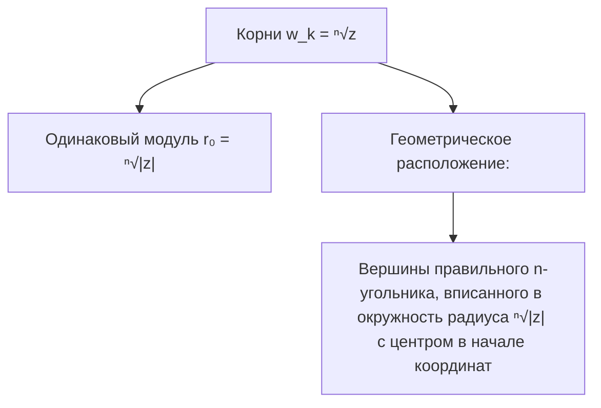

# 02. Лекция - Поле комплексных чисел и тригонометрическая форма (2026-09-10)

> [!info] Метаданные занятия
> **Дисциплина:** [[Линейная алгебра и геометрия]]  
> **Поток:** 1 поток (Software Engineering)  
> **Дата:** 10 сентября 2026  
> **Формат:** Лекция 2  
> **Предыдущая тема:** [[01. Лекция - Основные алгебраические структуры и бинарные операции (2026-09-03)|01. Лекция - Основные алгебраические структуры и бинарные операции]]  
> **Следующая тема:** Системы линейных уравнений, матрицы и метод Гаусса

---

## 1. Строгое аксиоматическое построение поля $\mathbb{C}$

Исторически мнимая единица вводилась как формальный символ $i = \sqrt{-1}$. Строгое математическое построение (У. Гамильтон) определяет поле $\mathbb{C}$ без мистических «мнимостей».

> [!abstract] Определение Гамильтона
> Поле комплексных чисел $\mathbb{C}$ — это множество упорядоченных пар вещественных чисел $(a, b) \in \mathbb{R}^2$ с операциями:
> 1. **Сложение:** $(a, b) + (c, d) = (a + c, \; b + d)$
> 2. **Умножение:** $(a, b) \cdot (c, d) = (ac - bd, \; ad + bc)$

### Нейтральные элементы поля $\mathbb{C}$:
- Нейтральный по сложению (ноль): $\mathbf{0} = (0, 0)$.
- Нейтральный по умножению (единица): $\mathbf{1} = (1, 0)$.

### Мнимая единица:
Определим элемент $i = (0, 1)$. Вычислим его квадрат:
$$i^2 = (0, 1) \cdot (0, 1) = (0 \cdot 0 - 1 \cdot 1, \; 0 \cdot 1 + 1 \cdot 0) = (-1, 0) = -\mathbf{1}$$
Таким образом, равенство $i^2 = -1$ является строгой алгебраической теоремой!

---

## 2. Тригонометрическая и показательная формы

Перейдём от декартовых координат $(x, y)$ к полярным координатам $(r, \varphi)$:
$$x = r \cos \varphi, \qquad y = r \sin \varphi$$
где $r = |z| = \sqrt{x^2 + y^2}$, а $\varphi = \operatorname{Arg}(z)$ — аргумент комплексного числа.

### Тригонометрическая форма:
$$z = r (\cos \varphi + i \sin \varphi)$$

### Показательная форма (Формула Эйлера):
$$e^{i\varphi} = \cos \varphi + i \sin \varphi \implies z = r e^{i\varphi}$$

### Геометрический смысл умножения:
При перемножении комплексных чисел их **модули перемножаются**, а **аргументы складываются**:
$$z_1 \cdot z_2 = r_1 e^{i\varphi_1} \cdot r_2 e^{i\varphi_2} = (r_1 r_2) e^{i(\varphi_1 + \varphi_2)}$$

---

## 3. Формула Муавра и возведение в степень

Для любого целого $n \in \mathbb{Z}$:
$$z^n = [r (\cos \varphi + i \sin \varphi)]^n = r^n (\cos n\varphi + i \sin n\varphi)$$

---

## 4. Извлечение корней $n$-й степени из комплексного числа

Уравнение $w^n = z$ в поле $\mathbb{C}$ имеет ровно $n$ различных комплексных корней:

$$w_k = \sqrt[n]{r} \left( \cos \frac{\varphi + 2\pi k}{n} + i \sin \frac{\varphi + 2\pi k}{n} \right), \qquad k = 0, 1, 2, \dots, n-1$$

---

## 🔗 Связанные материалы
- ⬅️ Предыдущая лекция: [[01. Лекция - Основные алгебраические структуры и бинарные операции (2026-09-03)]]
- 🏠 Хаб дисциплины: [[Линейная алгебра и геометрия]]
