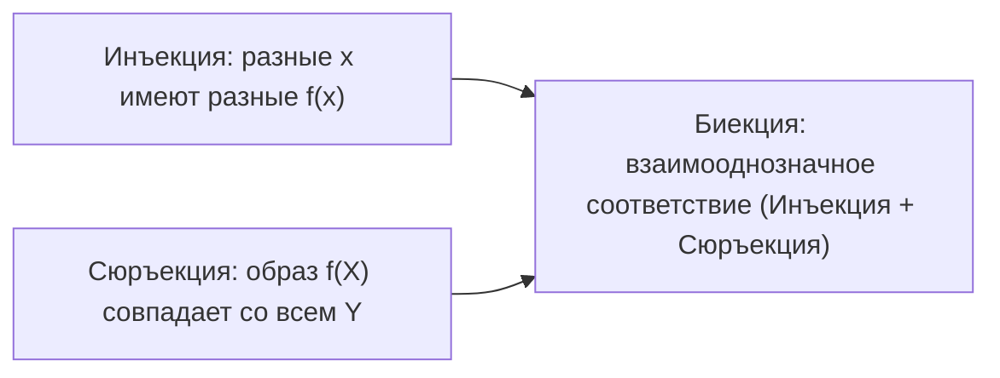

# 02. Лекция - Отображения, математическая индукция и мощности множеств (2026-09-08)

> [!info] Метаданные занятия
> **Дисциплина:** [[Математический анализ]]  
> **Поток:** 1 поток (Software Engineering)  
> **Дата:** 8 сентября 2026  
> **Формат:** Лекция 2  
> **Предыдущая тема:** [[01. Лекция - Вещественные числа и непрерывность числовой прямой (2026-09-01)|01. Лекция - Вещественные числа и непрерывность числовой прямой]]  
> **Следующая тема:** Числовые последовательности и предел последовательности

---

## 1. Отображения (функции)

> [!abstract] Определение
> **Отображением** (функцией) $f: X \to Y$ из множества $X$ в множество $Y$ называется закон (правило), который каждому элементу $x \in X$ ставит в соответствие **единственный** элемент $y = f(x) \in Y$.
> - $X = D(f)$ — область определения (*domain*).
> - $Y$ — область прибытия (*codomain*).
> - $f(X) = \{f(x) \mid x \in X\} \subseteq Y$ — образ множества $X$ (*range / image*).

### Классификация отображений:

| Тип отображения | Формальное условие | Геометрический смысл (для графиков) |
|---|---|---|
| **Инъективное** (*1-to-1*) | $f(x_1) = f(x_2) \implies x_1 = x_2$ | Любая горизонтальная прямая $y = y_0$ пересекает график **не более одного раза**. |
| **Сюръективное** (*на*) | $\forall y \in Y \; \exists x \in X : f(x) = y$ | Любая горизонтальная прямая $y = y_0$ пересекает график **хотя бы один раз**. |
| **Биективное** (*взаимно однозначное*) | Инъективно и сюръективно | Любая горизонтальная прямая $y = y_0$ пересекает график **ровно один раз**. |

> [!tip] Обратимость
> Отображение $f: X \to Y$ обратимо ($f^{-1}: Y \to X$) тогда и только тогда, когда $f$ **биективно**.

---

## 2. Принцип математической индукции

Множество натуральных чисел $\mathbb{N}$ задаётся аксиомами Джузеппе Пеано. Ключевая аксиома — аксиома индукции:

> [!abstract] Теорема индукции
> Пусть $P(n)$ — высказывание, зависящее от $n \in \mathbb{N}$. Если:
> 1. **База индукции:** $P(1)$ истинно.
> 2. **Индукционный переход:** для любого $k \ge 1$ из истинности $P(k)$ следует истинность $P(k+1)$:
>    $$\forall k \ge 1: \quad P(k) \implies P(k+1)$$
> то утверждение $P(n)$ истинно для **всех** $n \in \mathbb{N}$.

---

## 3. Мощности множеств по Кантору

Георг Кантор обобщил понятие количества элементов на бесконечные множества через биекции.

> [!abstract] Эквипотентность (равномощность)
> Два множества $A$ и $B$ называются **равномощными** ($A \sim B$ или $|A| = |B|$), если существует биективное отображение $f: A \to B$.

### 3.1. Счётные множества
Множество $A$ называется **счётным**, если оно равномощно множеству натуральных чисел:
$$|A| = |\mathbb{N}| = \aleph_0 \quad (\text{алеф-ноль})$$

**Свойства счётных множеств:**
- Любое бесконечное подмножество счётного множества счётно.
- Объединение счётного числа счётных множеств счётно:
  $$|\mathbb{Z}| = \aleph_0, \qquad |\mathbb{Q}| = \aleph_0$$
  *(Множество всех рациональных дробей счётно!)*

### 3.2. Несчётность отрезка $[0, 1]$ и множества $\mathbb{R}$
> [!important] Теорема Кантора
> Множество вещественных чисел $\mathbb{R}$ **несчётно**:
> $$|\mathbb{R}| = \mathfrak{c} > \aleph_0 \quad (\text{мощность континуума})$$

#### Диагональный метод Кантора (Идея доказательства):
Предположим от противного, что все вещественные числа отрезка $[0, 1]$ удалось перенумеровать в бесконечный список:
$$x_1 = 0.\alpha_{11}\alpha_{12}\alpha_{13}\dots$$
$$x_2 = 0.\alpha_{21}\alpha_{22}\alpha_{23}\dots$$
$$x_3 = 0.\alpha_{31}\alpha_{32}\alpha_{33}\dots$$

Построим новое число $y = 0.\beta_1\beta_2\beta_3\dots$, выбирая цифру $\beta_k \ne \alpha_{kk}$ (по диагонали).
Тогда число $y$ отличается от $x_1$ в первой цифре, от $x_2$ — во второй, ..., от любого $x_k$ — в $k$-й цифре. Следовательно, числа $y$ нет в списке! Противоречие.

### Теорема о мощности булеана:
$$|2^X| > |X| \implies \mathfrak{c} = 2^{\aleph_0} > \aleph_0$$

---

## 🔗 Связанные материалы
- ⬅️ Предыдущая лекция: [[01. Лекция - Вещественные числа и непрерывность числовой прямой (2026-09-01)]]
- 🏠 Хаб дисциплины: [[Математический анализ]]
