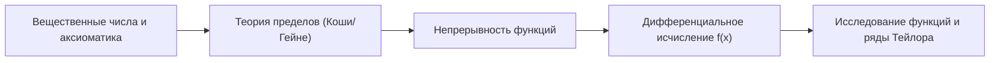

# 📈 Математический анализ (Поток 1)

> [!info] Академический статус курса
> **Семестр:** 1 семестр (Осень 2026)  
> **Трудоёмкость:** 5 з.е.  
> **Форма итогового контроля:** Экзамен (100 баллов)  
> **Формат:** Еженедельные лекции и практические занятия, коллоквиумы, экзамен в конце семестра

---

## 🏛️ Программа и цели 1 семестра

Курс математического анализа рассчитан на 4 семестра. Первый семестр закладывает теоретический фундамент всего цикла:

---

## 📖 Рекомендуемая литература

1. **В. А. Зорич** — *Математический анализ (Части 1 и 2)*. Фундаментальный университетский учебник с современным теоретико-множественным изложением.
2. **Г. М. Фихтенгольц** — *Курс дифференциального и интегрального исчисления (Тома 1, 2, 3)*. Классическая энциклопедия анализа с глубоким разбором практических примеров и вычислительных техник.

---

## 📚 Конспекты лекций и семинаров

| № | Название темы | Дата | Формат | Ключевые понятия |
|---|---|---|---|---|
| 01 | [[01. Лекция - Вещественные числа и непрерывность числовой прямой (2026-09-01)\|Вещественные числа и непрерывность числовой прямой]] | 2026-09-01 | Лекция | Историческая мотивация, аксиоматика $\mathbb{R}$, аксиома полноты (Дедекинд/супремум), операции над множествами |
| 02 | [[02. Лекция - Отображения, математическая индукция и мощности множеств (2026-09-08)\|Отображения, индукция и мощности множеств]] | 2026-09-08 | Лекция | Инъекция, сюръекция, биекция, композиция, аксиомы Пеано, счётные множества, несчётность $\mathbb{R}$, диагональный метод Кантора |

---

## 🧭 Навигация
- ⬅️ [[Конспекты/1 семестр/Поток 1/README|Общий навигатор 1 потока]]
- 📚 [[Конспекты/1 семестр/README|Все потоки 1 семестра]]
