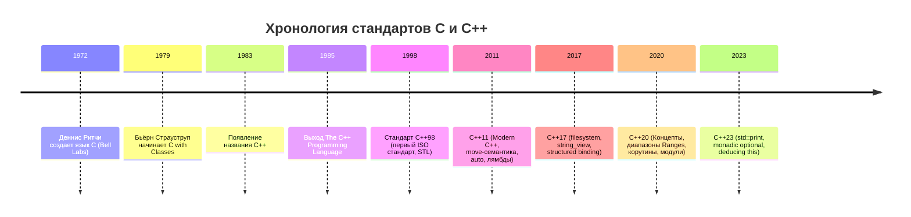
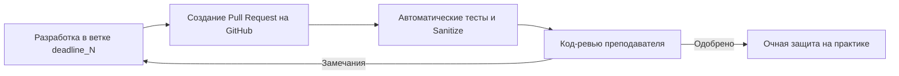

# 01. Лекция - Введение в курс C++ и стандарты разработки (2026-09-04)

> [!info] Метаданные занятия
> **Дисциплина:** [[Основы программирования]]  
> **Поток:** 1 поток (Software Engineering)  
> **Дата:** 4 сентября 2026  
> **Формат:** Лекция 1  
> **Предыдущая тема:** —  
> **Следующая тема:** [[02. Лекция - Идентификаторы, типы данных и операторы C++ (2026-09-11)|02. Лекция - Идентификаторы, типы данных и операторы C++]]

---

## 1. Цели курса и философия C++

Главная цель курса — научиться **точно и алгоритмически выражать мысли на машинном уровне**, создавая эффективный, масштабируемый и типобезопасный код.

C++ сочетает:
1. **Низкоуровневый контроль:** прямой доступ к аппаратным ресурсам, памяти и инструкциям процессора.
2. **Абстракции нулевой стоимости (Zero-overhead principle):** то, что вы не используете, вы за это не платите; то, что вы используете, вы не смогли бы написать вручную лучше, чем компилятор.

---

## 2. Эволюция языка C и C++

---

## 3. Регламент лабораторных работ и процесс код-ревью

1. **Изоляция веток:** Для каждого дедлайна используется строго своя ветка (`deadline_1`, `deadline_2` и т.д.). Слияние (`merge`) делать не нужно, чтобы сохранять историю разработки.
2. **Многократные итерации:** Лабораторную можно и нужно дорабатывать по комментариям ревьюера.
3. **Автоматический контроль:** Код валидируется на соответствие стандарту Google C++ Style через `clang-format` и проверяется статическим анализатором `clang-tidy`.

---

## 4. Рекомендуемая литература

- **Основы языка:** Стенли Липпман — *C++ Primer*; Бьёрн Страуструп — *Язык программирования C++*.
- **Современный C++:** Скотт Мейерс — *Эффективный и современный С++ (Effective Modern C++)*.
- **Справочник по стандартной библиотеке:** [cppreference.com](https://en.cppreference.com).

---

## 🔗 Связанные материалы
- ➡️ Следующая лекция: [[02. Лекция - Идентификаторы, типы данных и операторы C++ (2026-09-11)]]
- 🏠 Хаб дисциплины: [[Основы программирования]]
