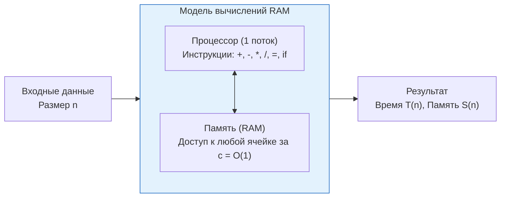
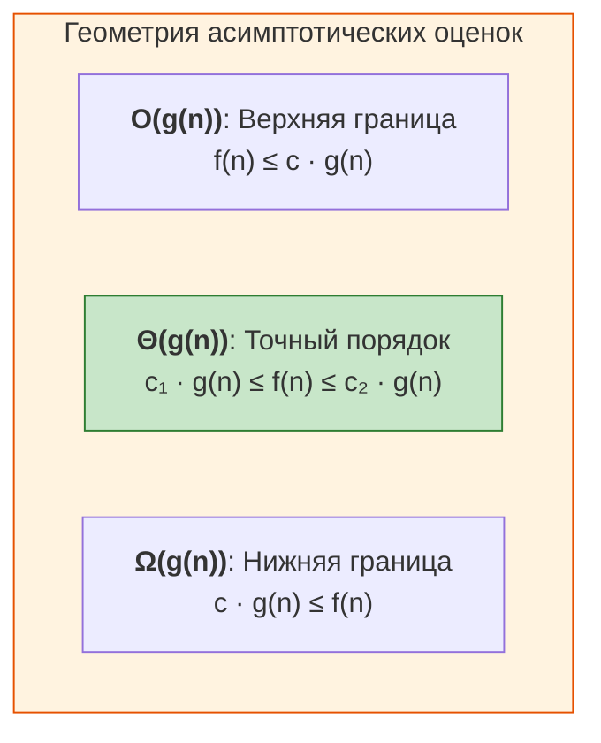

# ⚡ АиСД • Лекция 1: Оценка сложности алгоритмов, асимптотический анализ и сортировка вставками (Insertion Sort)

> [!abstract] О занятии
> - **Дисциплина:** Алгоритмы и структуры данных (АиСД, 1 семестр)
> - **Базовый учебник:** Томас Кормен, Чарльз Лейзерсон, Рональд Ривест, Клиффорд Штайн — *«Алгоритмы: построение и анализ»* (CLRS, главы 1, 2, 3)
> - **Ключевые темы:** Модель вычислений RAM, понятие размера входа, верхние, нижние и точные асимптотические границы ($O, \Omega, \Theta, o, \omega$), теорема о связи $O, \Omega$ и $\Theta$, алгебраические свойства $O$-символики, алгоритм сортировки вставками (Insertion Sort), доказательство корректности через инвариант цикла, худший/лучший/средний случай, связь со счетом инверсий и устойчивость (stability).

---

## 1. 🖥️ Модель вычислений RAM и необходимость асимптотики

### Что такое алгоритм?
**Алгоритм** — это точная, однозначная и конечная последовательность вычислительных инструкций, которая принимает некоторый набор данных на входе (input) и преобразует его в требуемый результат на выходе (output).

Свойства любого корректного алгоритма:
1. **Дискретность** — процесс разбит на отдельные элементарные шаги.
2. **Детерминированность (определенность)** — на каждом шаге дальнейшее действие однозначно определено состоянием памяти.
3. **Конечность** — для любого допустимого входа выполнение завершается за конечное число шагов.
4. **Массовость** — применимость к целому классу входных задач с одинаковой структурой данных.
5. **Результативность** — получение осмысленного выхода или диагностического сообщения.

### Вычислительная модель RAM (Random Access Machine)
Для теоретического анализа времени работы и памяти алгоритмов мы не можем привязываться к конкретному процессору Intel/AMD/Apple Silicon, тактовой частоте в гигагерцах, особенностям кэша L1/L2/L3, операционной системе или уровню оптимизации компилятора (`-O2`, `-O3`).

В теоретической информатике принимается универсальная модель вычислений **RAM**:
- **Один процессор:** инструкции выполняются строго последовательно, без параллелизма.
- **Память с произвольным доступом:** чтение или запись любой ячейки памяти по её адресу занимает ровно **$O(1)$ времени (одну условную единицу)**.
- **Элементарные операции:** арифметические операции ($+, -, *, /, \%$), побитовые операции, сравнения, логические связки, присваивание и вызовы функций занимают фиксированное константное время $c$.
- **Размер машинного слова:** предполагается, что для размера входа $n$ целое число помещается в машинное слово длиной порядка $\log_2 n$ бит (что исключает читерство со сверхдлинной арифметикой за $O(1)$).



---

## 2. 📐 Математический аппарат асимптотического анализа

Функция времени работы алгоритма $T(n)$ описывает точное количество элементарных операций в зависимости от размера входных данных $n$ (например, длины массива). При больших $n$ главную роль играет **порядок предельного роста функции**, а коэффициенты при низших степенях и постоянные множители несущественны.

### 1. «О»-большое — Верхняя асимптотическая оценка ($O$)
Описывает поведение алгоритма **сверху** (гарантированное максимальное время, в худшем случае):

> [!important] Определение $O$-символики
> Множество функций $O(g(n))$ определяется как:
> $$O(g(n)) = \left\{ f(n) : \exists c > 0, \exists n_0 \in \mathbb{N} \;\text{такие, что}\; \forall n \ge n_0 \quad 0 \le f(n) \le c \cdot g(n) \right\}$$
> 
> *Интуиция:* Начиная с порога $n_0$, график $f(n)$ не поднимается выше масштабированного графика $c \cdot g(n)$.

### 2. «Омега»-большое — Нижняя асимптотическая оценка ($\Omega$)
Описывает гарантированное поведение алгоритма **снизу** (лучший случай или теоретический барьер сложности задачи):

> [!important] Определение $\Omega$-символики
> $$\Omega(g(n)) = \left\{ f(n) : \exists c > 0, \exists n_0 \in \mathbb{N} \;\text{такие, что}\; \forall n \ge n_0 \quad 0 \le c \cdot g(n) \le f(n) \right\}$$
> 
> *Интуиция:* Начиная с $n_0$, алгоритм требует не менее $c \cdot g(n)$ элементарных действий.

### 3. «Тета»-большое — Точная асимптотическая оценка ($\Theta$)
Описывает порядок роста функции, зажатый между двумя постоянными множителями:

> [!important] Определение $\Theta$-символики
> $$\Theta(g(n)) = \left\{ f(n) : \exists c_1 > 0, \exists c_2 > 0, \exists n_0 \in \mathbb{N} \;\text{такие, что}\; \forall n \ge n_0 \quad 0 \le c_1 \cdot g(n) \le f(n) \le c_2 \cdot g(n) \right\}$$



### 4. Строгие оценки: «о»-малое ($o$) и «омега»-малое ($\omega$)
Используются, когда оценка сверху или снизу не является асимптотически точной:
- **$f(n) = o(g(n))$:** для любого (сколь угодно малого) $c > 0$ существует $n_0$, начиная с которого $f(n) < c \cdot g(n)$. Предельно:
  $$\lim_{n \to \infty} \frac{f(n)}{g(n)} = 0$$
  *Пример:* $2n = o(n^2)$, но $2n^2 \neq o(n^2)$.
- **$f(n) = \omega(g(n))$:** отношение стремится к бесконечности:
  $$\lim_{n \to \infty} \frac{f(n)}{g(n)} = \infty$$
  *Пример:* $n^2 = \omega(n)$.

### ⚖️ Сводная аналогия с числовыми отношениями
| Асимптотическое отношение | Аналог среди действительных чисел | Смысл |
| :---: | :---: | :--- |
| $f(n) = O(g(n))$ | $a \le b$ | Порядок роста $f$ не превосходит порядок $g$ |
| $f(n) = \Omega(g(n))$ | $a \ge b$ | Порядок роста $f$ не меньше порядка $g$ |
| $f(n) = \Theta(g(n))$ | $a = b$ | Функции имеют строго одинаковый порядок роста |
| $f(n) = o(g(n))$ | $a < b$ | Порядок роста $f$ строго меньше порядка $g$ |
| $f(n) = \omega(g(n))$ | $a > b$ | Порядок роста $f$ строго больше порядка $g$ |

---

## 3. 🎯 Фундаментальные теоремы и алгебра свойств $O$-символики

### Теорема о связи $O$, $\Omega$ и $\Theta$

> [!tip] Формулировка теоремы
> Для любых двух положительных функций $f(n)$ и $g(n)$:
> $$f(n) = \Theta(g(n)) \iff \Big( f(n) = O(g(n)) \quad\text{и}\quad f(n) = \Omega(g(n)) \Big)$$

**Доказательство:**
1. **Необходимость ($\implies$):** Если $f(n) = \Theta(g(n))$, то по определению существуют $c_1, c_2 > 0$ и $n_0$, такие что для всех $n \ge n_0$:
   $$c_1 g(n) \le f(n) \le c_2 g(n)$$
   - Неравенство $f(n) \le c_2 g(n)$ означает, что $f(n) = O(g(n))$ с константой $c = c_2$.
   - Неравенство $c_1 g(n) \le f(n)$ означает, что $f(n) = \Omega(g(n))$ с константой $c = c_1$.
2. **Достаточность ($\impliedby$):** Пусть $f(n) = O(g(n))$ с константами $c_2$ и $n_1$, и $f(n) = \Omega(g(n))$ с константами $c_1$ и $n_2$.
   Выберем $n_0 = \max(n_1, n_2)$. Тогда для любого $n \ge n_0$ одновременно выполнены оба неравенства:
   $$0 \le c_1 g(n) \le f(n) \le c_2 g(n)$$
   Следовательно, $f(n) = \Theta(g(n))$. $\blacksquare$

---

### Алгебраические свойства $O$-символики (с доказательствами)

#### 1. Правило сумм (доминирование высшего порядка):
$$O(f(n)) + O(g(n)) = O(\max(f(n), g(n)))$$

*Доказательство:* Пусть $h_1(n) \le c_1 f(n)$ при $n \ge n_1$ и $h_2(n) \le c_2 g(n)$ при $n \ge n_2$. Для $n \ge \max(n_1, n_2)$:
$$h_1(n) + h_2(n) \le c_1 f(n) + c_2 g(n) \le (c_1 + c_2) \max(f(n), g(n))$$
Полагая $c_3 = c_1 + c_2$, получаем $h_1(n) + h_2(n) = O(\max(f(n), g(n)))$. $\blacksquare$

#### 2. Правило произведений:
$$O(f(n)) \cdot O(g(n)) = O(f(n) \cdot g(n))$$

*Доказательство:* Пусть $h_1(n) \le c_1 f(n)$ и $h_2(n) \le c_2 g(n)$. Перемножая положительные части, получаем:
$$h_1(n) \cdot h_2(n) \le (c_1 c_2) \cdot (f(n) \cdot g(n))$$
С константой $c_3 = c_1 c_2$ получаем требуемое утверждение. $\blacksquare$

#### 3. Поглощение константного множителя:
$$k \cdot O(f(n)) = O(f(n)) \quad \forall k > 0$$

#### 4. Транзитивность:
$$f(n) = O(g(n)) \;\land\; g(n) = O(h(n)) \implies f(n) = O(h(n))$$

#### 5. Рефлексивность и симметричность для $\Theta$:
- Рефлексивность: $f(n) = \Theta(f(n))$.
- Симметричность: $f(n) = \Theta(g(n)) \iff g(n) = \Theta(f(n))$.
- Транзитивность: $f(n) = \Theta(g(n)) \land g(n) = \Theta(h(n)) \implies f(n) = \Theta(h(n))$.
> [!note] Следствие
> Отношение $\Theta$ является **отношением эквивалентности** на множестве неотрицательных функций, разбивающим пространство алгоритмических функций на непересекающиеся классы асимптотической сложности!

---

## 4. 📊 Иерархия классов сложности и лимиты времени

$$O(1) \subset O(\log \log n) \subset O(\log n) \subset O(\sqrt{n}) \subset O(n) \subset O(n \log n) \subset O(n^2) \subset O(n^3) \subset O(2^n) \subset O(n!)$$

### Практическое правило $10^8$ операций в секунду
На тестирующей системе `sort-me.org` процессор обычно выполняет около **$10^8$ элементарных операций за 1.0 секунду**. Исходя из этого подбирается допустимый алгоритм под ограничения задачи $n$:

| Ограничение на $n$ | Ожидаемая сложность | Допустимые алгоритмы |
| :---: | :---: | :--- |
| $n \le 10 - 11$ | $O(n!)$ или $O(n^2 \cdot 2^n)$ | Полный перебор перестановок (`std::next_permutation`) |
| $n \le 20 - 24$ | $O(2^n)$ или $O(n \cdot 2^n)$ | Перебор подмножеств, динамика по подмаскам |
| $n \le 500$ | $O(n^3)$ | Алгоритм Флойда-Уоршалла, наивное умножение матриц |
| $n \le 5\,000$ | $O(n^2)$ | **Insertion Sort**, Bubble Sort, два вложенных цикла |
| $n \le 10^5 - 10^6$ | $O(n \log n)$ | Merge Sort, Quick Sort, HeapSort, дерево отрезков |
| $n \le 10^7 - 10^8$ | $O(n)$ | Counting Sort, линейный поиск, два указателя |
| $n \le 10^{18}$ | $O(\log n)$ или $O(1)$ | Бинарный поиск по ответу, быстрое возведение в степень |


---

## 5. 🃏 Алгоритм сортировки вставками (Insertion Sort)

### Формальная модель работы алгоритма
Сортировка вставками последовательно поддерживает префикс массива $A[0..i-1]$ в строго отсортированном состоянии. На шаге $i$ очередной ключевой элемент $\text{key} = A[i]$ инкрементно внедряется в упорядоченную последовательность $A[0..i-1]$ путем сдвига элементов, строго превосходящих $\text{key}$, вправо на одну позицию.

В отличие от наивных переборных алгоритмов, Insertion Sort адаптивен: его вычислительная трудоемкость напрямую определяется количеством **инверсий** в исходном массиве.


---

### Псевдокод (по CLRS)
```python
def insertion_sort(A, n):
    for i in range(1, n):
        key = A[i]
        # Вставка A[i] в отсортированную последовательность A[0..i-1]
        j = i - 1
        while j >= 0 and A[j] > key:
            A[j + 1] = A[j]
            j -= 1
        A[j + 1] = key
```

---

### Реализация на C++ (Production-Ready)
```cpp
#include <vector>
#include <iostream>
#include <utility>

template <typename T>
void insertion_sort(std::vector<T>& a) {
    const int n = static_cast<int>(a.size());
    for (int i = 1; i < n; ++i) {
        T key = a[i];
        int j = i - 1;

        // Важно: строгое неравенство a[j] > key гарантирует УСТОЙЧИВОСТЬ сортировки!
        while (j >= 0 && a[j] > key) {
            a[j + 1] = a[j];
            --j;
        }
        a[j + 1] = key;
    }
}
```

---

## 6. 🛡️ Доказательство корректности: Инвариант цикла

Чтобы строго доказать, что цикл `for` действительно приводит к правильному результату, используется техника **инварианта цикла**.

> [!important] Инвариант цикла для Insertion Sort
> Перед началом каждой итерации внешнего цикла `for` (индексируемого переменной $i$) подмассив $A[0 .. i-1]$ состоит из тех же элементов, которые изначально находились в позициях от $0$ до $i-1$, но **уже упорядочены по неубыванию**:
> $$A[0] \le A[1] \le \dots \le A[i-1]$$

Доказательство состоит из трех этапов:

### 1. Инициализация (База индукции)
Перед первой итерацией внешнего цикла $i = 1$. Подмассив $A[0 .. i-1]$ состоит из единственного элемента $A[0]$. Любой массив из одного элемента тривиально отсортирован. Инвариант истинен перед входом в цикл.

### 2. Сохранение (Индукционный переход)
Предположим, что перед итерацией $i$ подмассив $A[0 .. i-1]$ упорядочен.
Тело внешнего цикла сдвигает элементы $A[i-1], A[i-2], \dots$, которые строго больше, чем `key = A[i]`, на одну позицию вправо (на места $A[i], A[i-1], \dots$).
Цикл `while` завершается, когда либо $j < 0$, либо найден элемент $A[j] \le \text{key}$.
Строка $A[j+1] = \text{key}$ помещает `key` на позицию $j+1$.
В результате:
- Все элементы левее позиции $j+1$ не превосходят `key` (так как $A[j] \le \text{key}$ и левая часть была отсортирована).
- Все элементы правее позиции $j+1$ строго больше `key` (так как они были сдвинуты).
- Состав элементов подмассива $A[0 .. i]$ остался прежним (произошла лишь перестановка).
Таким образом, подмассив $A[0 .. i]$ теперь отсортирован. При переходе к итерации $i+1$ инвариант сохраняется!

### 3. Завершение
Цикл завершается, когда $i$ достигает значения $n$.
Подставляя $i = n$ в формулировку инварианта цикла, получаем: подмассив $A[0 .. n-1]$ состоит из исходных элементов массива $A$, но расположенных в порядке неубывания:
$$A[0] \le A[1] \le \dots \le A[n-1]$$
Поскольку $A[0 .. n-1]$ — это весь исходный массив целиком, массив полностью отсортирован. Корректность доказана! $\blacksquare$

---

## 7. ⏱️ Точный анализ времени работы Insertion Sort

Рассчитаем общее время работы алгоритма $T(n)$, обозначив стоимость каждой инструкции как $c_k$:

| Строка кода | Стоимость | Количество выполнений |
| :--- | :---: | :---: |
| `for i = 1 to n - 1:` | $c_1$ | $n$ |
| `    key = A[i]` | $c_2$ | $n - 1$ |
| `    j = i - 1` | $c_3$ | $n - 1$ |
| `    while j >= 0 and A[j] > key:` | $c_4$ | $\sum_{i=1}^{n-1} t_i$ |
| `        A[j + 1] = A[j]` | $c_5$ | $\sum_{i=1}^{n-1} (t_i - 1)$ |
| `        j = j - 1` | $c_6$ | $\sum_{i=1}^{n-1} (t_i - 1)$ |
| `    A[j + 1] = key` | $c_7$ | $n - 1$ |

Здесь $t_i$ — количество проверок условия в цикле `while` для конкретного значения $i$.

Общее время работы:
$$T(n) = c_1 n + (c_2 + c_3 + c_7)(n-1) + c_4 \sum_{i=1}^{n-1} t_i + (c_5 + c_6) \sum_{i=1}^{n-1} (t_i - 1)$$

---

### Сценарий 1: Лучший случай (Best Case) — $\Theta(n)$
Массив **уже отсортирован по неубыванию** ($A[0] \le A[1] \le \dots \le A[n-1]$).
- В каждой итерации при первой же проверке $A[i-1] > key$ условие ложно ($A[i-1] \le key$).
- Значит, цикл `while` ни разу не входит в тело: $t_i = 1$ для всех $i$.
- $\sum_{i=1}^{n-1} t_i = n - 1$, а $\sum_{i=1}^{n-1} (t_i - 1) = 0$.
- Подставляем:
  $$T(n) = c_1 n + (c_2 + c_3 + c_4 + c_7)(n - 1) = k_1 n - k_2 = \Theta(n)$$

> [!tip] Вывод
> В лучшем случае Insertion Sort работает за **линейное время $\Theta(n)$**. Алгоритм адаптивен: на почти отсортированных массивах он работает исключительно быстро!

---

### Сценарий 2: Худший случай (Worst Case) — $\Theta(n^2)$
Массив **отсортирован в строго обратном порядке** ($A[0] > A[1] > \dots > A[n-1]$).
- Каждый новый элемент $A[i]$ меньше всех элементов в $A[0 .. i-1]$.
- Цикл `while` сдвигает все $i$ элементов: проверка выполняется $i+1$ раз ($t_i = i + 1$).
- Сумма проверок:
  $$\sum_{i=1}^{n-1} (i + 1) = \sum_{i=2}^{n} i = \frac{n(n+1)}{2} - 1 = \Theta(n^2)$$
- Сумма сдвигов:
  $$\sum_{i=1}^{n-1} i = \frac{n(n-1)}{2} = \Theta(n^2)$$
- В результате:
  $$T(n) = a n^2 + b n + c = \Theta(n^2)$$

---

### Сценарий 3: Средний случай (Average Case) — $\Theta(n^2)$
Предположим, что все перестановки $n$ элементов равновероятны.
В среднем элемент `key` оказывается больше половины предшествующих элементов $A[0..i-1]$ и меньше второй половины. Следовательно, внутренний цикл делает в среднем $i / 2$ сдвигов:
$$\sum_{i=1}^{n-1} \frac{i}{2} = \frac{1}{2} \cdot \frac{n(n-1)}{2} = \frac{n(n-1)}{4} = \Theta(n^2)$$
Поэтому среднее время работы также составляет **$\Theta(n^2)$**.

---

### 🔀 Связь с понятием инверсий
> [!important] Определение инверсии
> **Инверсией** в массиве $A$ называется пара индексов $(i, j)$, такая что:
> $$i < j \quad\text{и}\quad A[i] > A[j]$$

- Каждая операция сдвига элемента вправо в цикле `while` алгоритма Insertion Sort устраняет **ровно одну инверсию**.
- Следовательно, суммарное число сдвигов равно числу инверсий во входном массиве $I(A)$:
  $$T(n) = \Theta(n + I(A))$$
- Если число инверсий $I(A) = O(n)$ (массив почти упорядочен), то Insertion Sort работает за **линейное время $O(n)$**!

---

## 8. 🔍 Свойства: память, устойчивость и сравнение сортировок

### 1. Дополнительная память: In-place
Алгоритм требует лишь пару вспомогательных скалярных переменных (`key`, `i`, `j`). Исходный массив модифицируется на месте.
$$\text{Memory Complexity} = O(1)$$

### 2. Устойчивость (Stability)
> [!important] Определение устойчивости
> Сортировка называется **устойчивой (stable)**, если она сохраняет относительный взаимный порядок элементов с одинаковыми ключами.
> Если $i < j$ и $A[i].key == A[j].key$, то после сортировки элемент $A[i]$ обязательно будет расположен левее элемента $A[j]$.

**Почему Insertion Sort устойчив?**
Обратите внимание на условие цикла:
```cpp
while (j >= 0 && a[j] > key)
```
Поскольку проверка строгая (`>`), а не нестрогая (`>=`), сдвиг прекращается, как только мы встречаем элемент $A[j] == key$. Новый элемент `key` вставляется **справа** от равного ему элемента. Относительный порядок одинаковых элементов не меняется!

> [!caution] Внимание на очных защитах!
> Если заменить строгое неравенство `a[j] > key` на `a[j] >= key`, алгоритм продолжит корректно сортировать массив за то же время, но **потеряет свойство устойчивости**! За этот вопрос преподаватели часто снижают баллы на защите.

---

### 🥊 Сравнительная таблица квадратичных сортировок

| Алгоритм | Худшее время | Лучшее время | Среднее время | Память | Устойчивость | Особенности |
| :--- | :---: | :---: | :---: | :---: | :---: | :--- |
| **Insertion Sort (Вставками)** | $\Theta(n^2)$ | **$\Theta(n)$** | $\Theta(n^2)$ | **$O(1)$** | **Да (Stable)** | Идеален для почти упорядоченных массивов и малых $n \le 16-32$. База Timsort. |
| **Bubble Sort (Пузырьком)** | $\Theta(n^2)$ | $\Theta(n)^*$ | $\Theta(n^2)$ | **$O(1)$** | **Да (Stable)** | Большое число свопов (3 операции на обмен), проигрывает по константе. |
| **Selection Sort (Выбором)** | $\Theta(n^2)$ | $\Theta(n^2)$ | $\Theta(n^2)$ | **$O(1)$** | **Нет (Unstable)** | Делает минимальное число перестановок ($O(n)$ свопов), но всегда сравнивает все пары. |

*\* При наличии флага досрочного выхода `swapped == false`.*

---

## 9. 🧠 Вопросы для самопроверки и сдачи теорминимума

- [ ] Дать строгое определение $O, \Omega, \Theta$ через кванторы ($\exists c, n_0$).
- [ ] Доказать теорему о связи $O, \Omega$ и $\Theta$.
- [ ] Доказать правило сумм для $O$-символики: $O(f) + O(g) = O(\max(f, g))$.
- [ ] Почему отношение $\Theta$ образует отношение эквивалентности?
- [ ] Сформулировать инвариант цикла для алгоритма сортировки вставками.
- [ ] Показать три шага доказательства инварианта (инициализация, сохранение, завершение).
- [ ] Привести пример входного массива длины 5, на котором Insertion Sort сделает ровно 0 сдвигов.
- [ ] Привести пример входного массива длины 5, на котором Insertion Sort сделает максимальное число сдвигов ($\frac{5 \times 4}{2} = 10$).
- [ ] Что такое инверсия в массиве и как число инверсий связано со временем работы Insertion Sort?
- [ ] Является ли Insertion Sort устойчивым алгоритмом? Что изменится при замене `>` на `>=` во внутреннем цикле?
- [ ] Почему в промышленной гибридной сортировке `std::sort` (Introsort) и Python Timsort на малых подмассивах переключаются именно на Insertion Sort?

---


---

## 🚀 Фундаментальная связь с будущими дисциплинами и технологиями (ИТМО Curriculum)

1. **Операционные системы (Сем 4) и Системное программирование:**
   - Модель RAM является упрощением физической архитектуры фон Неймана. На реальном CPU время доступа к памяти не константно: обращение к регистру занимает $\approx 1$ цикл, к L1-кэшу — $\approx 4$ цикла, к L2 — $\approx 12$ циклов, к L3 — $\approx 40$ циклов, а промах в RAM — $150-200$ циклов.
   - Благодаря линейному локальному проходу памяти и отсутствию накладных расходов на вызовы функций, **Insertion Sort на практике в разы опережает QuickSort и MergeSort при $n \le 16-32$**. Именно поэтому гибридные промышленные алгоритмы (`std::sort` в GCC/Clang, `Timsort` в Python/Java) используют Insertion Sort как базовый уровень рекурсии!
2. **Базы данных и Хранилища (Сем 3, 4, 6):**
   - Концепция инверсий лежит в основе метрик оценки близости ранжированных списков (Kendall tau distance).
   - Асимптотический анализ алгоритмов внешнего слияния (External Merge Sort) опирается на модель блочной памяти с внешними носителями (I/O Model Aggarwal-Vitter).
3. **Вычислительная сложность и Машинное обучение (Сем 5, 6):**
   - Полиномиальные классы $\mathcal{P} = \bigcup_{k} O(n^k)$ инвариантны относительно выбора детерминированной модели вычислений (RAM, машина Тьюринга, RAM с логарифмической ценой слова).

> [!abstract] Навигация
> ⚡ [[Алгоритмы и структуры данных|Хаб предмета АиСД]] • 📝 [[00. Введение - Регламент курса, платформа Sort-me и базовый C++ (2026-09-06)|Вводный конспект]] • 💻 [[00. Практика - Трассировка кода на C++, задача Локальные пики спроса (2026-09-12)|Практика 0: Трассировка]] • 🏠 [[README|Главная]]
