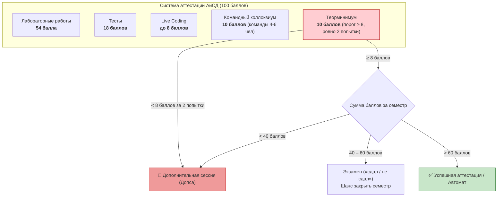
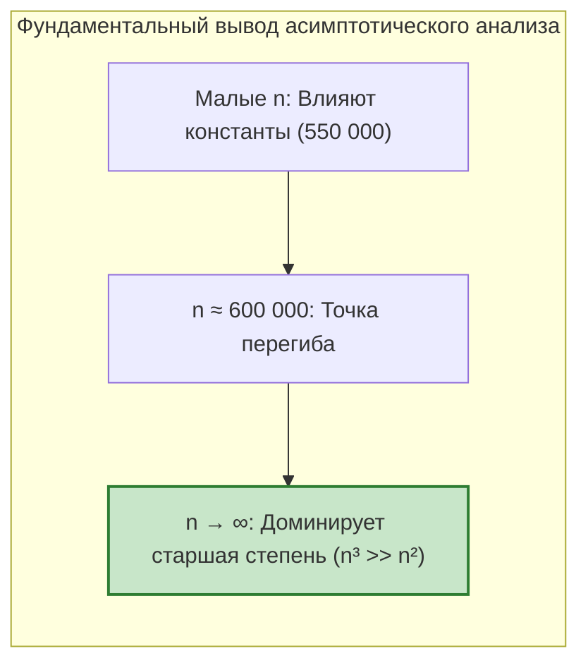
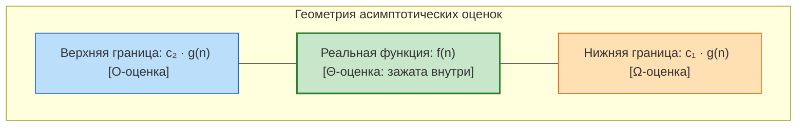
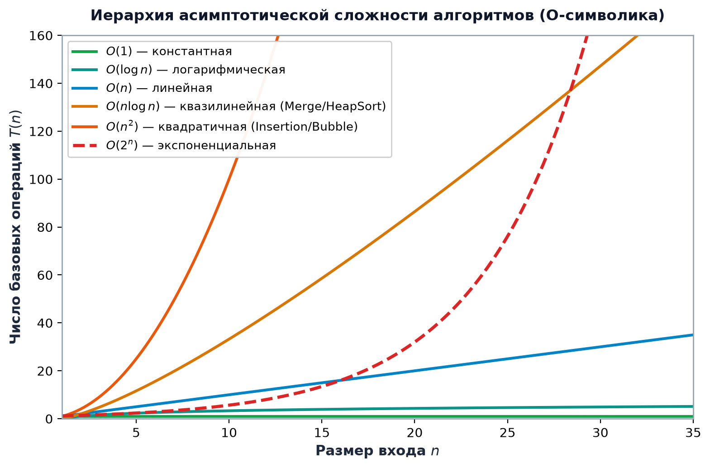
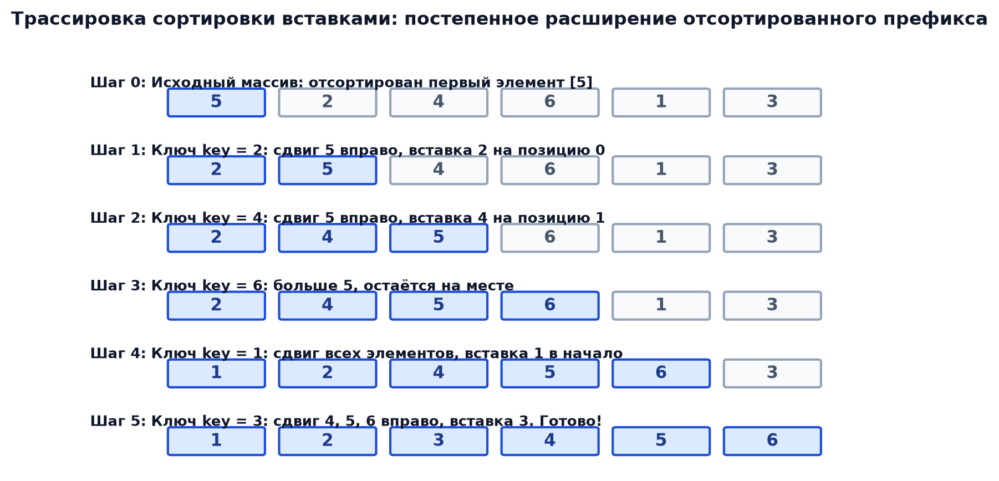

# ⚡ АиСД • Лекция 1: Оценка сложности алгоритмов, асимптотический анализ и сортировка вставками (Insertion Sort)

> [!abstract] О занятии
> - **Дисциплина:** [[Алгоритмы и структуры данных]] (1 семестр, Поток 2)
> - **Лектор:** Ткаченко Даниил Михайлович (системный архитектор, 8+ лет в IT, 7+ лет преподавания в ИТМО)
> - **Базовые источники:** 
>   - Материалы курса АиСД ИТМО (лекции Ткаченко Д.М., 2026)
>   - Томас Кормен, Чарльз Лейзерсон, Рональд Ривест, Клиффорд Штайн — *«Алгоритмы: построение и анализ»* (CLRS, 3-е/4-е изд., главы 1, 2, 3)
> - **Ключевые темы:** Регламент курса и система оценивания (100 баллов, теорминимум), модель вычислений RAM, атомарные операции и функция трудоемкости $T(n)$, мотивация асимптотики ($T_1$ vs $T_2$), нотации Бахмана — Ландау ($O, \Omega, \Theta, o, \omega$), кванторный разбор и формальные доказательства, ортогональность нотаций и сценариев входа, сложность типовых циклов ($O(1), O(n), O(\sqrt{n})$), алгебраические свойства $O$-символики, устойчивость (stability) и сортировка по ключам, алгоритм сортировки вставками (Insertion Sort), инвариант цикла, пошаговая числовая трассировка, строгий вывод $O(n^2)$ с отбрасыванием констант, связь с инверсиями и промышленное применение (Introsort, Timsort).

---

## 🏛️ 0. Организационный регламент курса и система аттестации

Курс читается системным архитектором **Ткаченко Даниилом Михайловичем**. Главное требование курса — бескомпромиссное качество знаний и глубокое понимание каждой строчки алгоритма. Если у студентов возникают вопросы по качеству лекций, практик или условий лабораторных, рекомендуется напрямую обращаться к лектору.

### 💯 Разбалловка семестра (Всего: 100 баллов)
Все 100 баллов набираются в течение семестра. Традиционного классического экзамена с нуля нет — баллы определяют итоговую аттестацию:

| № | Элемент контроля | Баллы | Описание и регламент |
| :---: | :--- | :---: | :--- |
| **1** | **Лабораторные работы** | **54** | Итоговый балл рассчитывается пропорционально: $\text{Балл} = \frac{\text{набранные баллы}}{\text{максимум}} \times 54$. Все задачи сдаются в тестирующую систему `sort-me.org` в строгие дедлайны. |
| **2** | **Теоретические тесты** | **18** | Регулярные тесты по лекционному материалу в течение семестра. |
| **3** | **Live Coding** | **до 8** | Очное решение задач на скорость перед преподавателем во время практик. |
| **4** | **Командный коллоквиум** | **10** | Очный устный коллоквиум в командах по **4–6 человек**. Проверяется умение коллективно рассуждать и строго доказывать теоремы. |
| **5** | **Теорминимум** | **10** | Фундаментальный барьер: **минимум 8 баллов из 10 для зачета**. На сдачу дается строго **2 попытки**! |



> [!danger] Критическое правило теорминимума и экзамена
> 1. **Две попытки на теормин:** Если студент не сдает теорминимум за 2 попытки (набрав меньше 8 баллов), он **автоматически направляется на дополнительную сессию (допсу)** независимо от количества баллов за лабораторные!
> 2. **Допуск к экзамену (40–60 баллов):** Если к концу семестра набрано от **40 до 60 баллов** и теорминимум успешно сдан ($\ge 8$), студент допускается к сдаче экзамена.
> 3. **Оценка за экзамен:** Экзамен оценивается исключительно по бинарной системе: **«сдал / не сдал»** (без добавления дифференцированных баллов).

---

## 1. 🖥️ Понятие алгоритма, RAM-модель и атомарные операции

### Что такое алгоритм?
> [!important] Определение алгоритма
> **Алгоритм** — это формально определенный, детерминированный вычислительный метод преобразования входных данных (ввода) в требуемые выходные данные (вывод) за конечное число элементарных шагов.

Свойства любого корректного вычислительного алгоритма:
1. **Дискретность** — процесс вычисления распадается на последовательность отдельных шагов.
2. **Детерминированность** — на каждом шаге следующее действие однозначно определено текущим состоянием памяти и входными данными.
3. **Конечность (завершаемость)** — для любого допустимого входа алгоритм гарантированно завершает работу за конечное число инструкций.
4. **Массовость** — применимость ко всем экземплярам задачи из заданной предметной области.
5. **Результативность** — получение определенного осмысленного ответа либо явного сообщения о невозможности решения.

---

### Вычислительная модель RAM (Random Access Machine)
Чтобы оценивать вычислительную сложность теоретически — абстрагируясь от частоты процессора (ГГц), архитектуры кэша L1/L2/L3, компилятора (`gcc`, `clang`, `-O3`) и типа операционной системы, — в Computer Science используется стандартная модель **RAM**:
- **Один процессор:** инструкции исполняются строго последовательно.
- **Память с произвольным доступом:** чтение или запись в любую ячейку памяти по адресу выполняется за **одну условную единицу времени ($O(1)$)**.
- **Машинное слово:** предполагается, что целое число или адрес ячейки помещается в слово размером порядка $\Theta(\log n)$ бит.

---

### Атомарные операции
Действия алгоритма раскладываются на **атомарные операции** — элементарные действия, каждое из которых требует ровно **одну условную единицу работы (время $O(1)$)**:
1. Базовые арифметические операции: $+$, $-$, $*$, $/$, $\%$.
2. Битовые логические операции: `&`, `|`, `^`, `~`, `<<`, `>>`.
3. Операции сравнения: `<`, `<=`, `==`, `!=`, `>`, `>=`.
4. Индексация и обращение к элементу массива / разыменование указателя: `a[i]`, `*ptr`.
5. Присваивание значения переменной: `x = y`.
6. Одна итерация цикла: проверка условия выхода + шаг инкремента/декремента счетчика + переход к началу тела.

Каждая такая операция считается выполняющейся за константное время, не зависящее от общего размера входа $n$.

---

### Функция трудоемкости $T(n)$
Для количественной оценки скорости работы алгоритма вводится **функция трудоемкости** $T(n)$:
$$T(n) = \text{суммарное количество атомарных операций, выполняемых на входе размера } n.$$

#### Пример: Суммирование элементов массива
Рассмотрим простейший алгоритм нахождения суммы элементов вектора размера $n$:
```c
sum = 0;                     // 1 атомарная инициализация
for (i = 0; i < n; ++i) {    // n проверок условия и n переходов
    sum = sum + a[i];        // n сложений и n чтений из памяти
}
```
Каждая итерация выполняет фиксированное число атомарных действий. При увеличении размера массива в 2 раза число операций вырастет ровно в 2 раза:
$$T(n) = c_1 \cdot n + c_0 \implies T(n) \sim n$$

Функция $T(n)$ описывает точный рост объема работы при росте размера задачи.

---

## 2. 📈 Зачем нужна асимптотика: Числовое сравнение двух алгоритмов

Предположим, для решения одной и той же прикладной задачи разработаны два конкурирующих алгоритма со следующими точными функциями трудоемкости:

$$T_1(n) = n^3 + 15n^2 + 72$$
$$T_2(n) = 550\,000n^2 + 352n + 4$$

На первый взгляд, у алгоритма $T_2(n)$ коэффициент $550\,000$ кажется катастрофически огромным, в то время как у $T_1(n)$ все коэффициенты малы ($1$, $15$, $72$). Начинающему программисту кажется, что алгоритм $T_1$ всегда быстрее.

Вычислим реальное число элементарных операций для различных масштабов входа $n$:

| Размер входа $n$ | $T_1(n) = n^3 + 15n^2 + 72$ | $T_2(n) = 550\,000n^2 + 352n + 4$ | Сравнение производительности |
| :---: | :---: | :---: | :--- |
| **$n = 10$** | $1\,000 + 1\,500 + 72 = \mathbf{2\,572}$ | $55\,000\,000 + 3\,520 + 4 \approx \mathbf{5.5 \cdot 10^7}$ | **$T_1$ быстрее в $21\,380$ раз!** Константа $550\,000$ полностью подавляет $T_2$. |
| **$n = 100$** | $1\,000\,000 + 150\,000 + 72 \approx \mathbf{1.15 \cdot 10^6}$ | $5\,500\,000\,000 + \dots \approx \mathbf{5.5 \cdot 10^9}$ | **$T_1$ быстрее в $4\,780$ раз.** |
| **$n = 1\,000$** | $\approx \mathbf{1.015 \cdot 10^9}$ | $\approx \mathbf{5.5 \cdot 10^{11}}$ | **$T_1$ быстрее в $540$ раз.** Разрыв стремительно сокращается! |
| **$n = 10\,000$** | $\approx \mathbf{1.0015 \cdot 10^{12}}$ | $\approx \mathbf{5.5 \cdot 10^{13}}$ | **$T_1$ быстрее всего в $55$ раз.** |
| **$n = 600\,000$** | $\approx \mathbf{2.16 \cdot 10^{17}}$ | $\approx \mathbf{1.98 \cdot 10^{17}}$ | **⚡ ТОЧКА ПЕРЕГИБА!** Алгоритм $T_2$ догнал и обогнал $T_1$. |
| **$n = 10^7$** | $\mathbf{10^{21}}$ | $\approx \mathbf{5.5 \cdot 10^{16}}$ | **🚀 $T_2$ БЫСТРЕЕ В $18\,180$ РАЗ!** Кубический алгоритм $T_1$ безнадежно зависает. |



> [!important] Главный закон асимптотического анализа
> При $n \to \infty$ поведение функции трудоемкости $T(n)$ **целиком и полностью определяется ее старшим (доминирующим) слагаемым**. 
> 
> Все постоянные множители (даже величиной в полмиллиона) и младшие слагаемые низших порядков рано или поздно нивелируются разницей в показателе степени. 
> 
> Именно поэтому в асимптотическом анализе мы **отбрасываем константы и младшие члены**, классифицируя алгоритмы по предельному порядку роста.

---

## 3. 📐 Асимптотические нотации Бахмана — Ландау ($O, \Omega, \Theta$)

### Происхождение обозначения
Символ **$O$** происходит от немецкого слова **Ordnung** — *«порядок»*. Обозначение $O(g(n))$ буквально означает *«функция порядка роста $g(n)$»* (растущая не быстрее $g(n)$ с точностью до постоянного коэффициента).

### Аналогия с асимптотами из математического анализа
В математическом анализе **асимптота** — это прямая или кривая, к которой график функции приближается на бесконечности, задавая очертания и границы ее поведения. 
Аналогично в теории сложности:
- Функция $c \cdot g(n)$ в оценке $O(g(n))$ служит **непреодолимым потолком**, ограничивающим реальную трудоемкость $T(n)$ сверху.
- Функция $c \cdot g(n)$ в оценке $\Omega(g(n))$ служит **непробиваемым полом**, ограничивающим $T(n)$ снизу.
- Оценка $\Theta(g(n))$ задает **двусторонний коридор**, зажимая функцию в точных границах порядка $g(n)$.

---

### 3.1. «О»-большое — Верхняя асимптотическая оценка ($O$)

> [!important] Строгое определение $O$-символики через кванторы
> Функция $f(n)$ принадлежит классу $O(g(n))$ (пишут $f(n) \in O(g(n))$ или $f(n) = O(g(n))$), если:
> $$\exists\, c > 0,\ \exists\, n_0 \in \mathbb{N} \quad : \quad \forall\, n > n_0 \implies 0 \le f(n) \le c \cdot g(n)$$

#### Пошаговый разбор кванторов:
- $\mathbf{\exists\, c > 0}$ — существует хотя бы одна фиксированная положительная константа $c$. Она может быть равной $2$, $100$ или $0.001$, главное — она **не зависит от $n$**. Наличие константы позволяет абстрагироваться от тактовой частоты процессора и постоянных коэффициентов: функции $5n$ и $1000n$ принадлежат одному классу $O(n)$.
- $\mathbf{\exists\, n_0 > 0}$ — существует точка отсечения (порог по размеру входа). Нас не интересуют аномалии и накладные расходы при малых размерах входа ($n=1, 2, 3$). Важно лишь поведение на асимптотике — начиная с некоторого $n_0$.
- $\mathbf{\forall\, n > n_0}$ — условие обязано выполняться абсолютно для **всех** значений $n$, превосходящих порог $n_0$, без единого исключения.
- $\mathbf{0 \le f(n) \le c \cdot g(n)}$ — функция $c \cdot g(n)$ образует верхний предел (потолок) для $f(n)$.

> [!warning] Важная ловушка $O$-нотации!
> Запись $f(n) = O(n^2)$ означает лишь, что $f$ растет **не быстрее**, чем $n^2$.
> Из этого **не следует**, что $f$ растет ровно как $n^2$! Например, функция $f(n) = 5n$ математически строго удовлетворяет условию $5n \in O(n^2)$ (ведь $5n \le 1 \cdot n^2$ при всех $n \ge 5$).

#### Пример формального доказательства: Докажем, что $3n + 5 \in O(n)$
1. По определению нам необходимо подобрать константу $c > 0$ и порог $n_0$, при которых выполняется неравенство:
   $$3n + 5 \le c \cdot n$$
2. Выберем константу с запасом: пусть $c = 4$.
3. Решим неравенство относительно $n$:
   $$3n + 5 \le 4n \iff 5 \le n$$
4. Следовательно, положив $n_0 = 5$, получаем: для всех $n > 5$ неравенство $3n + 5 \le 4n$ выполняется тождественно.
5. Пара $(c = 4, n_0 = 5)$ найдена. Утверждение $3n + 5 \in O(n)$ доказано строго по определению! $\blacksquare$

---

### 3.2. «Омега»-большое — Нижняя асимптотическая оценка ($\Omega$)

> [!important] Строгое определение $\Omega$-символики через кванторы
> Функция $f(n) \in \Omega(g(n))$, если:
> $$\exists\, c > 0,\ \exists\, n_0 \in \mathbb{N} \quad : \quad \forall\, n > n_0 \implies 0 \le c \cdot g(n) \le f(n)$$

**Геометрический смысл:** График $c \cdot g(n)$, начиная с точки $n_0$, лежит **не выше** графика $f(n)$, образуя неустранимый нижний порог трудоемкости («не быстрее, чем $g(n)$»).

$O$ и $\Omega$ взаимно двойственны:
$$f(n) \in O(g(n)) \iff g(n) \in \Omega(f(n))$$

---

### 3.3. «Тета»-большое — Точная асимптотическая оценка ($\Theta$)

> [!important] Строгое определение $\Theta$-символики через кванторы
> Функция $f(n) \in \Theta(g(n))$, если:
> $$\exists\, c_1 > 0,\ \exists\, c_2 > 0,\ \exists\, n_0 \in \mathbb{N} \quad : \quad \forall\, n > n_0 \implies 0 \le c_1 \cdot g(n) \le f(n) \le c_2 \cdot g(n)$$

**Геометрический смысл:** Начиная с $n_0$, функция $f(n)$ заключена в «коридор» между двумя масштабированными версиями $g(n)$: снизу ее подпирает $c_1 \cdot g(n)$, а сверху ограничивает $c_2 \cdot g(n)$. Функция $f(n)$ имеет **строго тот же порядок роста**, что и $g(n)$.



---

### 3.4. Теорема об эквивалентности $\Theta$, $O$ и $\Omega$

> [!tip] Фундаментальная теорема
> Для любых положительных функций $f(n)$ и $g(n)$:
> $$f(n) \in \Theta(g(n)) \iff \Big( f(n) \in O(g(n)) \quad\text{и}\quad f(n) \in \Omega(g(n)) \Big)$$

**Доказательство:**
1. **Необходимость ($\implies$):**
   Пусть $f(n) \in \Theta(g(n))$. По определению существуют $c_1, c_2 > 0$ и $n_0$, такие что для всех $n > n_0$:
   $$c_1 g(n) \le f(n) \le c_2 g(n)$$
   - Неравенство $f(n) \le c_2 g(n)$ означает, что $f(n) \in O(g(n))$ с константой $c = c_2$.
   - Неравенство $c_1 g(n) \le f(n)$ означает, что $f(n) \in \Omega(g(n))$ с константой $c = c_1$.
2. **Достаточность ($\impliedby$):**
   Пусть $f(n) \in O(g(n))$ с константами $c_2 > 0, n_1$ и $f(n) \in \Omega(g(n))$ с константами $c_1 > 0, n_2$.
   Положим $n_0 = \max(n_1, n_2)$. Тогда для всех $n > n_0$ одновременно выполнены оба неравенства:
   $$c_1 g(n) \le f(n) \le c_2 g(n)$$
   Следовательно, $f(n) \in \Theta(g(n))$. $\blacksquare$

---

### 3.5. Строгие оценки: «о»-малое ($o$) и «омега»-малое ($\omega$)
Если $O$ и $\Omega$ допускают равенство порядков роста (аналог нестрогих неравенств $\le$ и $\ge$), то $o$ и $\omega$ соответствуют **строгим неравенствам** ($<$ и $>$):
- **$f(n) \in o(g(n))$:** порядок роста $f$ строго меньше $g$:
  $$\lim_{n \to \infty} \frac{f(n)}{g(n)} = 0 \quad (\text{например: } 2n \in o(n^2), \text{ но } 2n^2 \notin o(n^2))$$
- **$f(n) \in \omega(g(n))$:** порядок роста $f$ строго больше $g$:
  $$\lim_{n \to \infty} \frac{f(n)}{g(n)} = \infty \quad (\text{например: } n^2 \in \omega(n))$$

| Нотация | Аналог в действительных числах | Смысл на обычном языке |
| :---: | :---: | :--- |
| $f(n) \in O(g(n))$ | $a \le b$ | $f$ растет **не быстрее**, чем $g$ (гарантия сверху) |
| $f(n) \in \Omega(g(n))$ | $a \ge b$ | $f$ растет **не медленнее**, чем $g$ (гарантия снизу) |
| $f(n) \in \Theta(g(n))$ | $a = b$ | $f$ и $g$ имеют **строго одинаковый порядок роста** |
| $f(n) \in o(g(n))$ | $a < b$ | $f$ растет **строго медленнее**, чем $g$ |
| $f(n) \in \omega(g(n))$ | $a > b$ | $f$ растет **строго быстрее**, чем $g$ |

---

## 4. 🔀 Ортогональность: Нотации ($O/\Omega/\Theta$) vs Сценарии входа (Worst / Best / Average)

> [!danger] Грубейшая и самая частая ошибка на экзамене и защитах!
> **НИКОГДА НЕ ПУТАЙТЕ АСИМПТОТИЧЕСКИЕ НОТАЦИИ СО СЦЕНАРИЯМИ РАБОТЫ АЛГОРИТМА!**
> 
> Часто студенты говорят: *«$O$ — это худший случай, а $\Omega$ — это лучший случай»*. **ЭТО АБСОЛЮТНО НЕВЕРНО!**

Это **две абсолютно независимые (ортогональные) оси**:
1. **Сценарии входа (Worst / Best / Average case):** описывают, **какие именно данные** подали на вход алгоритма (например, уже отсортированный массив, массив в обратном порядке или случайная перестановка).
2. **Асимптотические нотации ($O, \Omega, \Theta$):** описывают **математическую форму роста** функции трудоемкости (верхняя граница, нижняя граница или точный порядок).

Каждый сценарий входа порождает свою собственную функцию $T(n)$, и к **каждой** из этих функций можно применять $O$, $\Omega$ и $\Theta$:

| Сценарий входа | Что означает для алгоритма | Оценка в терминах $\Theta$ | Оценка в терминах $O$ |
| :--- | :--- | :---: | :---: |
| **Лучший случай (Best Case)** | Самый удобный для алгоритма вход (например, уже отсортированный массив для Insertion Sort) | $T_{\text{best}}(n) = \Theta(n)$ | $T_{\text{best}}(n) = O(n)$ |
| **Худший случай (Worst Case)** | Самый неудобный вход (массив в обратном порядке для Insertion Sort) | $T_{\text{worst}}(n) = \Theta(n^2)$ | $T_{\text{worst}}(n) = O(n^2)$ |
| **Средний случай (Average Case)** | Математическое ожидание числа операций по всем равновероятным перестановкам | $T_{\text{avg}}(n) = \Theta(n^2)$ | $T_{\text{avg}}(n) = O(n^2)$ |

Если мы говорим про алгоритм в целом (без уточнения случая), то для Insertion Sort:
- $T(n) = O(n^2)$ (время работы на **любом** входе не превысит квадратичного);
- $T(n) = \Omega(n)$ (на **любом** входе потребуется хотя бы линейное число операций, чтобы просмотреть массив).

---

## 5. 🔄 Анализ сложности типовых циклов (с кодом на C++)

Разберем стандартные конструкции циклов, которые регулярно встречаются в алгоритмах и на защитах лабораторных работ:

### 5.1. Цикл с фиксированным числом итераций
```cpp
for (int i = 0; i < 100; ++i) {
    // атомарные действия O(1)
}
```
Количество итераций строго равно $100$ и абсолютно **не зависит от размера входа $n$**:
$$T(n) = 100 \cdot O(1) = O(1) \quad (\text{константная сложность})$$

---

### 5.2. Простой линейный цикл
```cpp
for (int i = 0; i < n; ++i) {
    // атомарные действия O(1)
}
```
Цикл выполняет ровно $n$ итераций, трудоемкость линейно пропорциональна размеру задачи:
$$T(n) = n \cdot O(1) = O(n) \quad (\text{линейная сложность})$$

---

### 5.3. Вложенный константно-линейный цикл
```cpp
for (int i = 0; i < 100; ++i) {
    for (int j = 0; j < n; ++j) {
        // атомарные действия O(1)
    }
}
```
Внутренний цикл выполняется $n$ раз, а внешний — ровно $100$ раз. Суммарно тело исполняется $100 \cdot n$ раз:
$$T(n) = 100 \cdot n = O(n)$$
> [!tip] Важное наблюдение
> **Вложенность циклов сама по себе не увеличивает порядок сложности**, если количество повторений одного из циклов константно и не зависит от $n$! Константа $100$ поглощается в $O$-нотации.

---

### 5.4. Цикл с условием по квадрату счетчика
```cpp
for (int i = 0; i * i < n; ++i) {
    // атомарные действия O(1)
}
```
Цикл продолжается до тех пор, пока $i^2 < n$, то есть пока $i < \sqrt{n}$. Количество шагов равно $\lfloor\sqrt{n}\rfloor$:
$$T(n) = O(\sqrt{n}) \quad (\text{сублинейная сложность})$$
Такой цикл встречается, например, в алгоритме проверки числа на простоту (перебор потенциальных делителей до $\sqrt{n}$).

---

## 6. 🧮 Алгебраические свойства асимптотических нотаций

Арифметические свойства позволяют находить итоговую сложность составных программ (последовательных и вложенных блоков) без повторного вывода через кванторы:

### 1. Правило сумм (доминирование высшего порядка):
$$O(f(n)) + O(g(n)) = O(\max(f(n), g(n)))$$

**Доказательство:** 
Пусть $h_1(n) \le c_1 f(n)$ при $n > n_1$ и $h_2(n) \le c_2 g(n)$ при $n > n_2$.
Для всех $n > \max(n_1, n_2)$:
$$h_1(n) + h_2(n) \le c_1 f(n) + c_2 g(n) \le (c_1 + c_2) \cdot \max(f(n), g(n))$$
Положив константу $c_3 = c_1 + c_2$, получаем $h_1(n) + h_2(n) = O(\max(f(n), g(n)))$. $\blacksquare$

*Пример:* Если программа сначала выполняет линейный проход $O(n)$, а затем квадратичную сортировку $O(n^2)$, то суммарное время:
$$O(n) + O(n^2) = O(n^2)$$

### 2. Правило произведений (вложенные блоки):
$$O(f(n)) \cdot O(g(n)) = O(f(n) \cdot g(n))$$
*Пример:* Внешний цикл на $n$ итераций содержит внутренний цикл на $\log n$ шагов $\implies O(n \log n)$.

### 3. Поглощение константного множителя:
$$c \cdot O(f(n)) = O(f(n)) \quad (\forall c > 0)$$
Константы $3n$ и $500\,000n$ обе имеют сложность $O(n)$.

### 4. Прибавление константы:
$$f(n) + c = O(f(n)) \quad (\text{для неубывающих функций } f(n))$$
Накладные расходы в 10 операций на выделение памяти не влияют на асимптотику.

### 5. Свойства эквивалентности отношения $\Theta$:
- **Транзитивность:** $f \in \Theta(g) \land g \in \Theta(h) \implies f \in \Theta(h)$ (верно также для $O$ и $\Omega$).
- **Рефлексивность:** $f \in \Theta(f)$ (достаточно взять $c_1 = c_2 = 1$).
- **Симметричность:** $f \in \Theta(g) \iff g \in \Theta(f)$ (характерно **только** для $\Theta$!).
> [!note] Следствие
> Отношение $\Theta$ является **отношением эквивалентности**, разбивающим всё пространство вычислительных функций на непересекающиеся классы сложности!

---

## 7. 📊 Иерархия классов сложности и лимиты времени

Стандартный спектр скоростей роста от самого медленного к катасторофически быстрому:

$$O(1) \ll O(\log\log n) \ll O(\log n) \ll O(\sqrt{n}) \ll O(n) \ll O(n \log n) \ll O(n^2) \ll O(n^3) \ll O(2^n) \ll O(n!)$$



- **Полиномиальные алгоритмы ($O(n^k)$):** класс $\mathcal{P}$ — задачи, которые считаются эффективно разрешимыми на практике при адекватных размерах входа.
- **Экспоненциальные ($O(2^n)$) и факториальные ($O(n!)$):** алгоритмы полного перебора (NP-трудные задачи, задача коммивояжера). При $n \ge 30-50$ время работы превышает время существования Вселенной!

### Практическое правило $10^8$ операций в секунду
На тестирующей системе `sort-me.org` современное процессорное ядро успевает выполнить порядка **$10^8$ элементарных операций за $1.0$ секунду**:

| Ограничение на размер $n$ | Допустимая асимптотика | Примеры алгоритмов |
| :---: | :---: | :--- |
| $n \le 10 - 11$ | $O(n!)$ | Перебор всех перестановок (`std::next_permutation`) |
| $n \le 20 - 24$ | $O(2^n)$ или $O(n \cdot 2^n)$ | Перебор подмножеств, динамическое программирование по маскам |
| $n \le 400 - 500$ | $O(n^3)$ | Алгоритм Флойда-Уоршалла, наивное умножение матриц |
| $n \le 5\,000$ | $O(n^2)$ | **Insertion Sort**, Bubble Sort, два вложенных цикла |
| $n \le 2 \cdot 10^5 - 10^6$ | $O(n \log n)$ | **Merge Sort**, Quick Sort, Heap Sort, деревья отрезков |
| $n \le 10^7 - 10^8$ | $O(n)$ | Counting Sort, Radix Sort, линейный поиск |
| $n \le 10^{18}$ | $O(\log n)$ или $O(1)$ | Бинарный поиск, быстрое возведение в степень |

---

### Пространственная сложность (Space Complexity $S(n)$)
Помимо времени $T(n)$, критически важно учитывать дополнительную оперативную память $S(n)$, требуемую алгоритму сверх исходных данных:
- **In-place ($O(1)$ памяти):** алгоритм производит перестановки непосредственно внутри исходного массива, используя лишь пару скалярных переменных (пример: **Insertion Sort**).
- **С дополнительной памятью ($O(n)$ памяти):** алгоритм создает вспомогательные массивы того же размера (пример: **Merge Sort**).

---

## 8. 🎯 Теория сортировок и Устойчивость (Stability)

### Ключ сортировки (Sort Key)
**Ключ сортировки** — это атрибут (поле) элемента данных, по которому производится отношение порядка. Элементы могут представлять собой сложные структуры (`struct Student { string name; int age; int grade; };`). При сортировке по ключу `age` сравниваются только значения возраста, а остальные поля перемещаются вместе с элементом.

---

### Определение устойчивости (Stable Sort)
> [!important] Определение устойчивой сортировки
> Алгоритм сортировки называется **устойчивым (stable)**, если он **гарантированно сохраняет исходный относительный порядок элементов с одинаковыми значениями ключа**.
> 
> Если в исходном массиве $A[i].key == A[j].key$ и при этом $i < j$ ($A[i]$ стоял раньше $A[j]$), то в отсортированном массиве элемент $A[i]$ обязательно останется левее $A[j]$.

---

### 👨‍🎓 Сквозной пример: Почему устойчивость критически необходима в реальной разработке

Представим базу данных студентов с полями `(Имя, Возраст, Оценка)`. 
Изначально массив уже упорядочен **по оценкам** (отличники первыми):

| Исходный индекс | Имя | Возраст | Оценка |
| :---: | :---: | :---: | :---: |
| 0 | **Аня** | 20 | **5** |
| 1 | **Боря** | 20 | **4** |
| 2 | **Витя** | 19 | **3** |

Теперь мы хотим отсортировать этот список **по Возрасту**. Обратите внимание: у Ани и Бори возраст одинаковый ($20$), но Аня имеет оценку 5 и стоит выше Бори с оценкой 4.

#### Сценарий А: Сортировка УСТОЙЧИВА (Stable Sort)
Устойчивый алгоритм видит, что у Ани и Бори ключи равны (`20 == 20`), и **сохраняет их исходный порядок**:
1. Витя (19 лет, оценка 3)
2. **Аня (20 лет, оценка 5)** $\leftarrow$ *Аня осталась первой!*
3. **Боря (20 лет, оценка 4)**

> [!tip] Результат устойчивой сортировки
> Внутри группы ровесников (20 лет) студенты **остались автоматически отсортированы по оценкам**! Устойчивость позволяет последовательно сортировать данные по нескольким колонкам (многоключевая сортировка).

#### Сценарий Б: Сортировка НЕУСТОЙЧИВА (Unstable Sort)
Неустойчивый алгоритм (например, наивный QuickSort) не гарантирует сохранение порядка равных элементов и может переставить их местами:
1. Витя (19 лет, оценка 3)
2. **Боря (20 лет, оценка 4)** $\leftarrow$ *Порядок разрушен случайным образом!*
3. **Аня (20 лет, оценка 5)**

Весь предыдущий труд по сортировке оценок уничтожен. Чтобы многостадийная сортировка работала предсказуемо, **устойчивость алгоритма жизненно необходима**.

---

## 9. 🃏 Алгоритм сортировки вставками (Insertion Sort)

### Интуиция алгоритма: Карты в руке
Представьте, что вы держите игральные карты в руке веером. Левая часть карт уже аккуратно разложена по возрастанию достоинства. Вы берете следующую карту со стола (`key`), сравниваете ее с картами в руке справа налево, сдвигаете бóльшие карты вправо и вставляете новую карту на освободившееся законное место.



---

### Академический псевдокод (CLRS)
```text
INSERTION-SORT(A, n)
1  for i = 1 to n - 1
2      key = A[i]
3      // Вставка A[i] в уже упорядоченную последовательность A[0 .. i-1]
4      j = i - 1
5      while j >= 0 and A[j] > key
6          A[j + 1] = A[j]
7          j = j - 1
8      A[j + 1] = key
```

---

### Построчный анатомический разбор алгоритма:
1. `for i = 1 to n - 1` — почему начинаем с индекса $1$ (со второго элемента)? Потому что подмассив из одного первого элемента $A[0..0]$ **уже тривиально отсортирован** сам по себе!
2. `key = A[i]` — почему необходимо сохранять значение в отдельную переменную `key`? Потому что на шаге сдвига мы будем перезаписывать ячейку $A[i]$ предыдущими элементами, и без сохранения значение $A[i]$ будет безвозвратно утеряно.
3. `j = i - 1` — указатель `j` устанавливается на крайний правый элемент уже отсортированного префикса. Сравнение идет строго **справа налево**.
4. `while j >= 0 and A[j] > key` — пока не дошли до начала массива и пока текущий элемент префикса строго больше `key`.
5. `A[j + 1] = A[j]` — сдвигаем больший элемент на одну позицию вправо, освобождая свободное место для `key`.
6. `A[j + 1] = key` — как только цикл `while` завершился (встретился элемент $\le key$ либо $j = -1$), позиция $j + 1$ является единственно верным местом для вставки `key`.

---

### Production-Ready реализация на C++20
```cpp
#include <vector>
#include <iostream>
#include <utility>

template <typename T>
void insertion_sort(std::vector<T>& a) {
    const int n = static_cast<int>(a.size());
    if (n <= 1) return;

    for (int i = 1; i < n; ++i) {
        T key = std::move(a[i]); // move-семантика для минимизации копирований
        int j = i - 1;

        // ВНИМАНИЕ: Строгое неравенство a[j] > key гарантирует УСТОЙЧИВОСТЬ!
        while (j >= 0 && a[j] > key) {
            a[j + 1] = std::move(a[j]);
            --j;
        }
        a[j + 1] = std::move(key);
    }
}
```

---

### 🎲 Полная пошаговая числовая трассировка (Step-by-Step Trace)

Проследим работу алгоритма на массиве $A = [5, 2, 4, 6, 1, 3]$ ($n = 6$):

| Итерация $i$ | Вставляемый `key` | Процесс сдвигов во внутреннем цикле `while` | Состояние массива в конце шага | Описание шага |
| :---: | :---: | :--- | :--- | :--- |
| **Старт** | — | — | $[5 \mid 2, 4, 6, 1, 3]$ | Префикс $[5]$ тривиально упорядочен. |
| **$i = 1$** | `key = 2` | $5 > 2 \implies$ сдвиг $5$ на позицию 1. Цикл `while` завершен ($j = -1$). Вставка $2$ в индекс $0$. | $[\mathbf{2, 5} \mid 4, 6, 1, 3]$ | Префикс $[2, 5]$ упорядочен (1 сдвиг). |
| **$i = 2$** | `key = 4` | $5 > 4 \implies$ сдвиг $5$ на позицию 2. $2 \le 4 \implies$ стоп ($j = 0$). Вставка $4$ в индекс $1$. | $[\mathbf{2, 4, 5} \mid 6, 1, 3]$ | Префикс $[2, 4, 5]$ упорядочен (1 сдвиг). |
| **$i = 3$** | `key = 6` | $5 \le 6 \implies$ проверка ложна сразу ($j = 2$). Сдвигов ноль! Вставка $6$ на место. | $[\mathbf{2, 4, 5, 6} \mid 1, 3]$ | Префикс $[2, 4, 5, 6]$ упорядочен (0 сдвигов). |
| **$i = 4$** | `key = 1` | $6 > 1, 5 > 1, 4 > 1, 2 > 1 \implies$ все 4 элемента сдвигаются вправо. Вставка $1$ в индекс $0$. | $[\mathbf{1, 2, 4, 5, 6} \mid 3]$ | Префикс $[1, 2, 4, 5, 6]$ упорядочен (4 сдвига). |
| **$i = 5$** | `key = 3` | $6 > 3, 5 > 3, 4 > 3 \implies$ сдвиг 3 элементов. $2 \le 3 \implies$ стоп. Вставка $3$ в индекс $2$. | $[\mathbf{1, 2, 3, 4, 5, 6}]$ | Массив полностью отсортирован! (3 сдвига). |

Всего выполнено: $1 + 1 + 0 + 4 + 3 = 9$ операций сдвига.

---

### 🛡️ Доказательство корректности: Инвариант цикла

> [!important] Формулировка инварианта цикла
> Перед началом каждой итерации внешнего цикла `for` с индексом $i$ подмассив $A[0 .. i-1]$ состоит из тех же элементов, которые изначально находились на позициях от $0$ до $i-1$, но **уже расположены в порядке неубывания**:
> $$A[0] \le A[1] \le \dots \le A[i-1]$$

Доказательство состоит из трех строгих шагов математической индукции:
1. **Инициализация (База):** Перед первой итерацией $i = 1$. Подмассив $A[0..0]$ состоит из одного элемента $A[0]$. Любой массив из одного элемента отсортирован. База индукции истинна.
2. **Сохранение (Индукционный переход):** Предположим, что подмассив $A[0..i-1]$ упорядочен. Тело цикла сдвигает элементы $A[i-1], A[i-2], \dots$, строго превосходящие `key = A[i]`, на одну позицию вправо. Цикл `while` останавливается, когда найден элемент $A[j] \le key$ либо $j = -1$. Запись $A[j+1] = key$ помещает элемент в позицию, где все элементы слева не превосходят его, а все справа — строго больше. Подмассив $A[0..i]$ оказывается упорядоченным. Инвариант сохраняется при переходе к $i+1$.
3. **Завершение:** Цикл завершается при $i = n$. Подставляя $i = n$ в инвариант, получаем: подмассив $A[0..n-1]$ содержит все исходные элементы и упорядочен по неубыванию. Весь массив отсортирован! Корректность доказана. $\blacksquare$

---

### ⏱️ Точный математический анализ времени работы

#### 1. Худший случай (Worst Case) — $\Theta(n^2)$
Массив отсортирован **в строго обратном порядке** ($A[0] > A[1] > \dots > A[n-1]$).
На каждом шаге $i$ новый элемент меньше всех предыдущих, поэтому внутренний цикл выполняет ровно $i$ сдвигов.
Суммарное число операций:
$$T(n) = \sum_{i=1}^{n-1} i = 1 + 2 + \dots + (n-1) = \frac{(n-1) \cdot n}{2} = \frac{n^2 - n}{2}$$

#### 📐 Формальное доказательство отбрасывания констант: $\frac{n^2-n}{2} \in O(n^2)$
Чтобы строго обосновать переход к $O(n^2)$, подберем $c > 0$ и $n_0$:
$$\frac{n^2 - n}{2} \le c \cdot n^2$$
Возьмем $c = 1$:
$$\frac{n^2 - n}{2} \le n^2 \iff n^2 - n \le 2n^2 \iff -n \le n^2$$
Неравенство $-n \le n^2$ выполняется тождественно для всех $n \ge 0$! Следовательно, при $c = 1$ и $n_0 = 0$ определение $O$-символики выполняется строго:
$$\frac{n^2 - n}{2} \in O(n^2)$$

#### 2. Лучший случай (Best Case) — $\Theta(n)$
Массив **уже отсортирован по возрастанию**.
При каждом шаге $i$ условие `A[j] > key` оказывается ложным сразу же при первом сравнении ($j = i-1$). Тело цикла `while` ни разу не выполняется. На каждый элемент тратится $O(1)$ операций:
$$T(n) = \sum_{i=1}^{n-1} 1 = n - 1 = \Theta(n)$$

#### 3. Средний случай (Average Case) — $\Theta(n^2)$
Если все перестановки равновероятны, элемент `key` в среднем оказывается больше половины элементов префикса. Внутренний цикл выполняет в среднем $i / 2$ сдвигов:
$$T(n) = \sum_{i=1}^{n-1} \frac{i}{2} = \frac{1}{2} \cdot \frac{n(n-1)}{2} = \frac{n(n-1)}{4} = \Theta(n^2)$$

---

### 🔀 Связь со счетом инверсий
> [!important] Определение инверсии
> **Инверсией** в массиве $A$ называется пара индексов $(i, j)$, такая что $i < j$, но при этом $A[i] > A[j]$.

Каждая операция сдвига элемента во внутреннем цикле `while` алгоритма Insertion Sort уменьшает общее число инверсий в массиве **ровно на единицу**.
Отсюда вытекает точная адаптивная формула трудоемкости:
$$T(n) = \Theta(n + I(A))$$
где $I(A)$ — суммарное число инверсий во входном массиве. Если массив «почти отсортирован» ($I(A) = O(n)$), Insertion Sort работает за потрясающее **линейное время $O(n)$**!

---

### 🛡️ Анализ устойчивости: почему `>` критически важно
В условии цикла стоит:
```cpp
while (j >= 0 && a[j] > key)
```
Поскольку проверка строго больше (`>`), как только указатель $j$ встречает элемент, равный `key` ($a[j] == key$), цикл немедленно прерывается. Элемент `key` помещается **справа** от равного ему элемента, сохраняя их исходный взаимный порядок. Сортировка **устойчива (Stable)**!

> [!caution] Ловушка на защите лабораторных!
> Если заменить строгое неравенство `a[j] > key` на нестрогое `a[j] >= key`, алгоритм продолжит правильно упорядочивать числа за то же время, но **потеряет свойство устойчивости**! Равные элементы будут перескакивать друг через друга.

---

### 🚀 Промышленное применение: Introsort и Timsort
Почему квадратичная сортировка Insertion Sort изучается в университете и до сих пор используется в промышленном коде?
1. **Кэш-локальность процессора (L1/L2):** Insertion Sort работает последовательно с соседними ячейками памяти. На реальном железе за счет предвыборки строк кэша (Cache Prefetching) он в разы опережает сложные рекурсивные алгоритмы на малых массивах.
2. **`std::sort` в C++ (Introsort):** В библиотеках GCC `libstdc++` и Clang `libc++` алгоритм `std::sort` использует гибрид: пока массив большой — работает QuickSort; если глубина рекурсии превысила $2 \log n$ — переключается на HeapSort; а когда размер подмассива падает до $n \le 16$, **вызывается Insertion Sort**!
3. **Timsort (Python / Java):** Стандартные алгоритмы сортировки Python (`list.sort`) и Java (`Arrays.sort`) основаны на комбинации Merge Sort и Insertion Sort.

---

## 🥊 Сравнительная таблица элементарных квадратичных сортировок

| Алгоритм | Худшее время | Среднее время | Лучшее время | Память | Устойчивость | Особенности и применимость |
| :--- | :---: | :---: | :---: | :---: | :---: | :--- |
| **Insertion Sort (Вставками)** | $\Theta(n^2)$ | $\Theta(n^2)$ | **$\Theta(n)$** | **$O(1)$** | **Да (Stable)** | **Чемпион на почти отсортированных данных** и на малых $n \le 16-32$. База Timsort и Introsort. |
| **Bubble Sort (Пузырьком)** | $\Theta(n^2)$ | $\Theta(n^2)$ | $\Theta(n)^*$ | **$O(1)$** | **Да (Stable)** | Медленный из-за 3 операций присваивания на каждый `swap`. Учебный алгоритм. |
| **Selection Sort (Выбором)** | $\Theta(n^2)$ | $\Theta(n^2)$ | $\Theta(n^2)$ | **$O(1)$** | **Нет (Unstable)** | Делает минимальное число обменов ($O(n)$ свопов), но всегда выполняет $\Theta(n^2)$ сравнений. |

*\* При наличии флага оптимизации досрочного выхода `swapped == false`.*

---

## 🧠 Вопросы для сдачи теорминимума и коллоквиума

- [ ] Назвать регламент курса: сколько баллов весит теорминимум, какой проходной балл и сколько попыток дается?
- [ ] Что происходит, если студент не сдает теорминимум за 2 попытки?
- [ ] Дать строгое определение $O$-символики через кванторы ($\exists c, n_0$).
- [ ] Доказать, что $3n + 5 \in O(n)$, найдя подходящие константы $c$ и $n_0$.
- [ ] В чем состоит различие между нотацией $O$ и понятием «худший случай» алгоритма? Привести пример $O$-оценки для лучшего случая.
- [ ] Доказать теорему о связи $O, \Omega$ и $\Theta$.
- [ ] Какова сложность цикла `for (int i = 0; i * i < n; ++i)`? Обоснуйте.
- [ ] Сформулировать инвариант цикла для алгоритма Insertion Sort и провести три шага доказательства.
- [ ] Вывести точную формулу числа операций для худшего случая Insertion Sort и строго доказать, что $(n^2 - n) / 2 \in O(n^2)$.
- [ ] Что такое устойчивость сортировки? Привести пример со студентами (возраст и оценка), где неустойчивость дает некорректный результат.
- [ ] Почему замена `a[j] > key` на `a[j] >= key` ломает устойчивость Insertion Sort?
- [ ] Что такое инверсия в массиве и как число инверсий связано со временем работы Insertion Sort?

---

> [!abstract] Навигация
> ⚡ [[Алгоритмы и структуры данных|Хаб предмета АиСД]] • 📝 [[00. Введение - Регламент курса, платформа Sort-me и базовый C++ (2026-09-06)|Вводный конспект]] • 💻 [[00. Практика - Трассировка кода на C++, задача Локальные пики спроса (2026-09-12)|Практика 0: Трассировка]] • ➡️ [[02. Лекция - Линейные сортировки (Counting, Radix, Bucket) и нижняя оценка сравнений (2026-09-19)|02. Лекция - Линейные сортировки]] • 🏠 [[README|Главная]]
