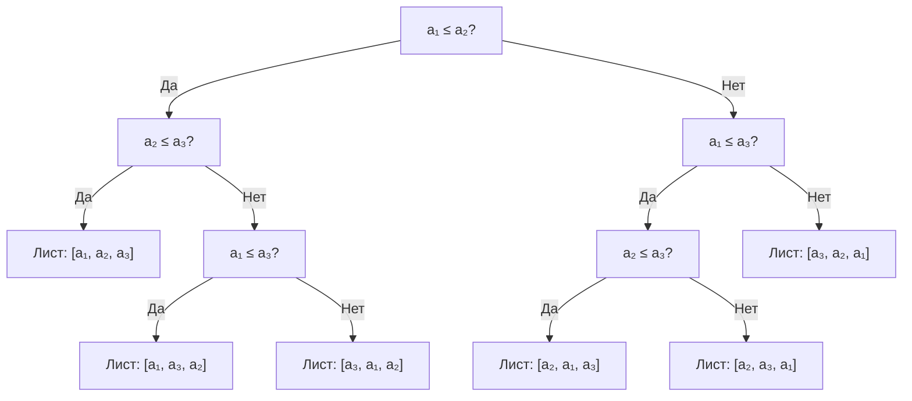
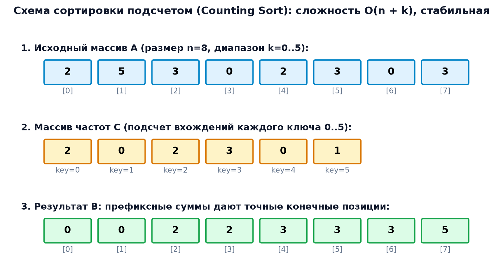
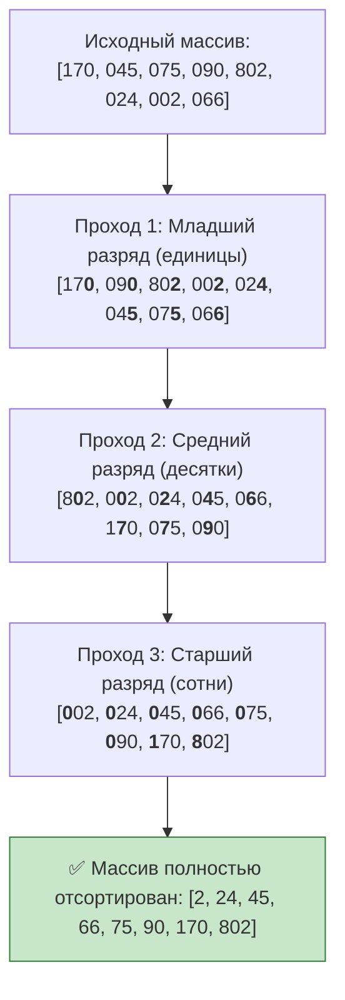
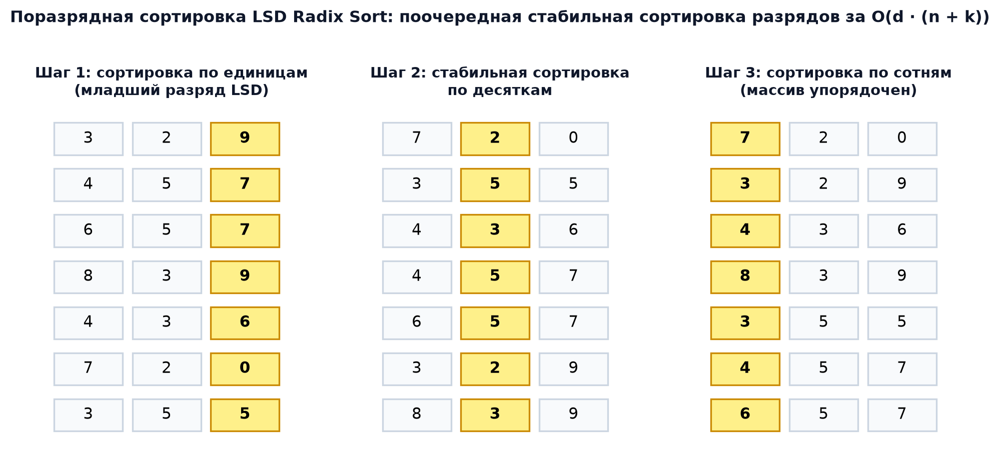

# ⚡ АиСД • Лекция 2: Линейные сортировки (Counting, Radix, Bucket Sort) и нижняя оценка сравнений

> [!abstract] О занятии
> - **Дисциплина:** [[Алгоритмы и структуры данных]] (1 семестр, Поток 2)
> - **Лектор:** Ткаченко Даниил Михайлович
> - **Базовые источники:**
>   - Материалы курса АиСД ИТМО (2026)
>   - Томас Кормен, Чарльз Лейзерсон, Рональд Ривест, Клиффорд Штайн — *«Алгоритмы: построение и анализ»* (CLRS, 3-е/4-е изд., глава 8)
> - **Ключевые концепции:** Информационно-теоретический барьер сортировок сравнениями $\Omega(n \log n)$, модель дерева решений (Decision Tree), вывод через энтропию Шеннона, сортировка подсчетом (Counting Sort) с префиксными суммами и доказательством устойчивости при обратном проходе, поразрядная сортировка (Radix Sort: LSD и MSD), побайтовый Radix Sort на битовых масках для 32-битных чисел, трюк сортировки вещественных чисел IEEE 754 за $O(n)$, карманная сортировка (Bucket Sort) с доказательством среднего времени $O(n)$ через матожидание квадрата размера корзины $\mathbb{E}[n_i^2] = 2 - 1/n$.

---

## 1. 🛡️ Нижняя оценка сложности сортировок сравнениями $\Omega(n \log n)$

Все алгоритмы сортировки, основывающиеся исключительно на парных операциях сравнения элементов ($a_i \le a_j$), имеют фундаментальное математическое ограничение: **в худшем случае они не могут работать быстрее, чем $\Omega(n \log n)$**.

### Модель дерева решений (Decision Tree)
Любой детерминированный алгоритм сортировки сравнениями для входного массива из $n$ различных элементов можно представить в виде бинарного дерева решений:
- Каждый **внутренний узел** дерева представляет одну операцию сравнения: $a_i \le a_j$.
- Каждое **ребро** соответствует результату проверки: «Да» (левая ветвь) или «Нет» (правая ветвь).
- Каждый **лист** дерева соответствует однозначно определенной перестановке исходного массива $\pi = (p_1, p_2, \dots, p_n)$, восстанавливающей правильный порядок элементов.



---

### Математическое доказательство теоремы
> [!important] Теорема (О нижней оценке сортировок сравнениями)
> Любой алгоритм сортировки сравнениями в худшем случае совершает не менее:
> $$T(n) \ge \lceil \log_2(n!) \rceil = \Omega(n \log n) \text{ операций сравнения.}$$

**Доказательство:**
1. Для входного массива из $n$ различных элементов существует ровно $n!$ возможных перестановок.
2. Чтобы алгоритм давал гарантированно правильный ответ для **любой** исходной перестановки, каждый из $n!$ вариантов обязан присутствовать хотя бы в одном листе дерева решений. Следовательно, общее число листьев $L$:
   $$L \ge n!$$
3. В бинарном дереве высоты $h$ максимальное количество листьев не превосходит $2^h$:
   $$2^h \ge L \ge n! \implies h \ge \log_2(n!)$$
4. Оценим $\log_2(n!)$ снизу, отбросив первую половину множителей факториала:
   $$\log_2(n!) = \sum_{i=1}^n \log_2 i \ge \sum_{i=\lceil n/2 \rceil}^n \log_2 i \ge \frac{n}{2} \log_2\left(\frac{n}{2}\right) = \frac{n}{2} (\log_2 n - 1) = \Omega(n \log n)$$
   *(По формуле Стирлинга: $n! \approx \sqrt{2\pi n}\left(\frac{n}{e}\right)^n \implies \log_2(n!) = n \log_2 n - n \log_2 e + O(\log n)$).*
5. Высота дерева $h$ в точности равна максимальному числу сравнений на пути от корня к листу (то есть худшему времени работы алгоритма). 
   Следовательно, $T_{\text{worst}}(n) \ge h = \Omega(n \log n)$. $\blacksquare$


---

### Информационно-теоретический вывод через энтропию Шеннона
Исходная неопределенность перестановки задается информационной энтропией дискретного равномерного распределения на симметрической группе $S_n$:
$$H(X) = - \sum_{\pi \in S_n} \frac{1}{n!} \log_2\left(\frac{1}{n!}\right) = \log_2(n!) \text{ бит}$$
Каждое бинарное сравнение имеет ровно два исхода («Да» / «Нет»), следовательно, доставляет в вычислительную систему **не более 1 бита информации** ($\log_2 2 = 1$). 
Чтобы полностью устранить энтропию $H(X)$ и однозначно идентифицировать правильную перестановку, необходимо получить не менее $\log_2(n!)$ бит:
$$T(n) \ge \frac{H(X)}{1} = \log_2(n!) = \Omega(n \log n) \text{ сравнений.}$$

> [!tip] Как обойти теоретический барьер $\Omega(n \log n)$?
> Барьер $\Omega(n \log n)$ действует **только на алгоритмы, основанные на сравнениях**.
> Если использовать внутреннюю структуру ключей (индексацию по значению, битовые разряды, разбиение на диапазоны), можно отсортировать данные за строго **линейное время $\Theta(n)$**!

---

## 2. 🔢 Сортировка подсчетом (Counting Sort)

Если сортируемые элементы представляют собой целые неотрицательные числа из ограниченного диапазона $[0, K-1]$, мы можем отсортировать массив за время **$O(n + K)$**, используя значения самих элементов как прямые индексы в массиве частот.

### Интуитивный принцип и алгоритм
1. **Подсчет частот:** Создаем массив счетчиков `cnt` размера $K$, заполненный нулями ($O(K)$). Проходим по входному массиву $A$ и для каждого числа $x$ инкрементируем `cnt[x]++` ($O(n)$).
2. **Префиксные суммы (Prefix Sums):**
   Преобразуем массив частот в префиксные суммы:
   $$cnt[i] = cnt[i] + cnt[i-1]$$
   Теперь значение `cnt[i]` указывает суммарное число элементов, **меньших либо равных $i$**. Это означает, что последний элемент со значением $i$ должен стоять на позиции $cnt[i] - 1$ в выходном массиве!
3. **Устойчивое размещение (Обратный проход):**
   Итерируемся по исходному массиву $A$ **строго справа налево** (от $n-1$ до $0$):
   - Берем элемент $x = A[i]$;
   - Декрементируем счетчик: `--cnt[x]`;
   - Записываем элемент на вычисленную позицию: $B[cnt[x]] = x$.



> [!important] Почему обратный проход гарантирует устойчивость (Stability)?
> Предположим, в исходном массиве есть два одинаковых элемента $A[p] == A[q] == x$, причем $p < q$ ($A[p]$ стоит левее $A[q]$).
> При обратном проходе мы сначала встретим правый элемент $A[q]$. Он займет более правую позицию в выходном массиве $B$.
> Затем мы встретим левый элемент $A[p]$. Счетчик `cnt[x]` к этому моменту уже уменьшился, поэтому $A[p]$ будет записан левее $A[q]$.
> Относительный порядок одинаковых элементов сохранен строго!

---

### 🎲 Полная пошаговая числовая трассировка Counting Sort

Пусть входной массив $A = [2, 5, 3, 0, 2, 3, 0, 3]$, размер $n = 8$, максимальное значение $K = 6$ (диапазон $[0, 5]$).

#### Шаг 1: Подсчет частот
| Значение ключа $x$ | $0$ | $1$ | $2$ | $3$ | $4$ | $5$ |
| :---: | :---: | :---: | :---: | :---: | :---: | :---: |
| **`cnt[x]`** | $2$ | $0$ | $2$ | $3$ | $0$ | $1$ |

#### Шаг 2: Накопление префиксных сумм
| Значение ключа $x$ | $0$ | $1$ | $2$ | $3$ | $4$ | $5$ |
| :---: | :---: | :---: | :---: | :---: | :---: | :---: |
| **`cnt[x]` (префиксные суммы)** | $\mathbf{2}$ | $\mathbf{2}$ | $\mathbf{4}$ | $\mathbf{7}$ | $\mathbf{7}$ | $\mathbf{8}$ |

*Смысл:* Числа $\le 0$ занимают позиции до $2$ (индексы $0..1$). Числа $\le 2$ — позиции до $4$ (индексы $0..3$). Числа $\le 3$ — позиции до $7$ (индексы $0..6$).

#### Шаг 3: Обратный проход по $A$ и заполнение $B$
- Изучаем $A[7] = 3$: позиция $B[--cnt[3]] = B[6] = 3$. Счетчик $cnt[3]$ стал $6$.
- Изучаем $A[6] = 0$: позиция $B[--cnt[0]] = B[1] = 0$. Счетчик $cnt[0]$ стал $1$.
- Изучаем $A[5] = 3$: позиция $B[--cnt[3]] = B[5] = 3$. Счетчик $cnt[3]$ стал $5$.
- Изучаем $A[4] = 2$: позиция $B[--cnt[2]] = B[3] = 2$. Счетчик $cnt[2]$ стал $3$.
- Изучаем $A[3] = 0$: позиция $B[--cnt[0]] = B[0] = 0$. Счетчик $cnt[0]$ стал $0$.
- Изучаем $A[2] = 3$: позиция $B[--cnt[3]] = B[4] = 3$. Счетчик $cnt[3]$ стал $4$.
- Изучаем $A[1] = 5$: позиция $B[--cnt[5]] = B[7] = 5$. Счетчик $cnt[5]$ стал $7$.
- Изучаем $A[0] = 2$: позиция $B[--cnt[2]] = B[2] = 2$. Счетчик $cnt[2]$ стал $2$.

Итоговый массив $B = [0, 0, 2, 2, 3, 3, 3, 5]$. Все тройки и нули сохранили исходный взаимный порядок!

---

### Production-Ready реализация на C++20
```cpp
#include <vector>
#include <cstdint>
#include <algorithm>

template <typename T>
void counting_sort(std::vector<T>& a, int max_val) {
    const int n = static_cast<int>(a.size());
    if (n <= 1) return;

    std::vector<int> cnt(max_val + 1, 0);
    std::vector<T> output(n);

    // 1. Подсчет частот ключей
    for (int i = 0; i < n; ++i) {
        ++cnt[a[i]];
    }

    // 2. Построение префиксных сумм
    for (int i = 1; i <= max_val; ++i) {
        cnt[i] += cnt[i - 1];
    }

    // 3. Обратный проход для обеспечения УСТОЙЧИВОСТИ
    for (int i = n - 1; i >= 0; --i) {
        output[--cnt[a[i]]] = std::move(a[i]);
    }

    a = std::move(output);
}
```

- **Временная сложность:** $\Theta(n + K)$ во всех случаях (лучший, худший, средний).
- **Пространственная сложность:** $\Theta(n + K)$ дополнительной памяти (буфер вывода + массив частот).
- **Устойчивость:** ✅ Строго устойчива.
- **Ограничение:** Применимо, только если $K = O(n)$. Если числа лежат в диапазоне до $10^9$, массив частот потребует гигабайты памяти и $O(10^9)$ времени на инициализацию, что сделает алгоритм непригодным.

---

## 3. 🏷️ Поразрядная сортировка (Radix Sort)

Поразрядная сортировка позволяет эффективно сортировать числа из сколь угодно больших диапазонов (например, 32- и 64-битные целые числа), представляя каждое число как кортеж из $D$ разрядов в системе счисления по основанию $B$:
$$x = (d_{D-1}, d_{D-2}, \dots, d_1, d_0)_B$$

### Подходы: LSD vs MSD
1. **LSD (Least Significant Digit first):** Сортировка ведется от **младших разрядов к старшим**. На каждом разряде применяется **строго устойчивая** сортировка (Counting Sort).
2. **MSD (Most Significant Digit first):** Сортировка ведется от **старших разрядов к младшим** (рекурсивное разделение на корзины). Идеально для строк переменной длины.

---

### Почему LSD Radix Sort работает корректно?
Благодаря **устойчивости** Counting Sort, сортируя массив по более старшему разряду, мы гарантированно сохраняем относительный порядок элементов, у которых этот старший разряд совпадает. А этот порядок был сформирован предыдущими проходами по младшим разрядам!





---

### 💻 Высокопроизводительный побайтовый Radix Sort на C++20 (4 прохода по 8 бит)
В компьютерных архитектурах оптимально выбирать основание системы счисления равным степени двойки: $B = 2^8 = 256$ (1 байт).
Тогда для любого 32-битного беззнакового числа `uint32_t` требуется ровно $D = 4$ прохода, а извлечение разряда выполняется быстрейшей битовой операцией:
$$\text{digit}_k(x) = (x \gg (8 \cdot k)) \ \& \ \text{0xFF}$$

```cpp
#include <vector>
#include <cstdint>
#include <utility>

void radix_sort_u32(std::vector<uint32_t>& a) {
    const int n = static_cast<int>(a.size());
    if (n <= 1) return;

    std::vector<uint32_t> temp(n);
    const int BITS = 8;
    const int BUCKETS = 1 << BITS; // 256
    const uint32_t MASK = BUCKETS - 1; // 0xFF

    // 4 прохода: по 8 бит на каждый байт 32-битного числа
    for (int shift = 0; shift < 32; shift += BITS) {
        int cnt[BUCKETS] = {0};

        // 1. Подсчет частот текущего байта
        for (int i = 0; i < n; ++i) {
            uint32_t byte_val = (a[i] >> shift) & MASK;
            ++cnt[byte_val];
        }

        // 2. Префиксные суммы
        for (int i = 1; i < BUCKETS; ++i) {
            cnt[i] += cnt[i - 1];
        }

        // 3. Стабильный перенос (обратный ход)
        for (int i = n - 1; i >= 0; --i) {
            uint32_t byte_val = (a[i] >> shift) & MASK;
            temp[--cnt[byte_val]] = a[i];
        }

        a = temp; // Перекладываем результат прохода
    }
}
```

- **Сложность по времени:** $O(D \cdot (n + B))$. Для 32-битных чисел: $4 \times (n + 256) = \mathbf{\Theta(n)}$!
- **Память:** $\Theta(n + B)$ (буфер `temp` + массив частот на 256 элементов).
- **Скорость:** Работает в $2-3$ раза быстрее `std::sort` на массивах от $10^5$ элементов!

---

### 💡 Промышленный трюк: Сортировка вещественных чисел `float` за $O(n)$
В стандарте IEEE 754 отрицательные числа `float` имеют единичный знаковый бит, из-за чего их прямое бинарное представление инвертировано относительно положительных. 
С помощью простого преобразования за $O(1)$ можно привести `float` к беззнаковому `uint32_t`, сохраняющему естественный порядок:
```cpp
uint32_t float_to_sortable_uint(float f) {
    uint32_t u = std::bit_cast<uint32_t>(f);
    // Если знаковый бит равен 1 — инвертируем все биты, иначе инвертируем только знаковый
    uint32_t mask = (u & 0x80000000u) ? 0xFFFFFFFFu : 0x80000000u;
    return u ^ mask;
}
```
Это позволяет сортировать миллионы вещественных чисел побайтовым Radix Sort за строгое время $\Theta(n)$ без единого сравнения!

---

## 4. 🪣 Карманная сортировка (Bucket Sort)

Применяется, когда входные данные представляют собой вещественные числа, непрерывно и **равномерно распределенные** на отрезке $[0, 1)$.

### Принцип работы
1. Разбиваем отрезок $[0, 1)$ на $n$ одинаковых непересекающихся корзин (интервалов) шириной $1/n$.
2. Проходим по массиву и раскладываем каждый элемент $x_i$ в корзину с индексом:
   $$b_i = \lfloor n \cdot x_i \rfloor$$
3. Сортируем каждую отдельную корзину простым алгоритмом (например, **Insertion Sort**).
4. Последовательно конкатенируем содержимое всех корзин от $0$ до $n-1$.

---

### 🎓 Строгое математическое доказательство среднего времени $\Theta(n)$

Пусть $n_i$ — случайная величина, равная числу элементов, попавших в $i$-ю корзину.
Время сортировки $i$-й корзины алгоритмом Insertion Sort составляет $O(n_i^2)$.
Суммарное матожидание времени работы:
$$\mathbb{E}[T(n)] = \Theta(n) + \sum_{i=0}^{n-1} O(\mathbb{E}[n_i^2])$$

Поскольку каждый элемент попадает в $i$-ю корзину с вероятностью $p = 1/n$, случайная величина $n_i$ имеет биномиальное распределение: $n_i \sim \text{Binom}(n, 1/n)$.
Для биномиального распределения:
$$\mathbb{E}[n_i] = n \cdot p = n \cdot \frac{1}{n} = 1$$
$$\mathbb{D}[n_i] = n \cdot p \cdot (1 - p) = 1 - \frac{1}{n}$$
Используя формулу связи дисперсии и матожидания квадрата $\mathbb{E}[n_i^2] = \mathbb{D}[n_i] + (\mathbb{E}[n_i])^2$:
$$\mathbb{E}[n_i^2] = \left(1 - \frac{1}{n}\right) + 1^2 = 2 - \frac{1}{n} = O(1)$$

Подставляя это в общую сумму:
$$\mathbb{E}[T(n)] = \Theta(n) + \sum_{i=0}^{n-1} O(1) = \Theta(n) + n \cdot O(1) = \mathbf{\Theta(n)} \quad \blacksquare$$

> [!warning] Худший случай Bucket Sort
> Если все элементы входного массива скучкованы в одной корзине (равномерность нарушена), алгоритм деградирует до худшего случая сортировки вставками:
> $$T_{\text{worst}}(n) = \Theta(n^2)$$

---

### Реализация Bucket Sort на C++20
```cpp
#include <vector>
#include <algorithm>

void bucket_sort(std::vector<float>& a) {
    const int n = static_cast<int>(a.size());
    if (n <= 1) return;

    // Создаем n корзин
    std::vector<std::vector<float>> buckets(n);

    // 1. Распределение по корзинам
    for (int i = 0; i < n; ++i) {
        int idx = static_cast<int>(n * a[i]);
        if (idx >= n) idx = n - 1; // Защита от границы 1.0
        buckets[idx].push_back(a[i]);
    }

    // 2. Сортировка каждой корзины (вставками / std::sort)
    for (int i = 0; i < n; ++i) {
        std::sort(buckets[i].begin(), buckets[i].end());
    }

    // 3. Конкатенация результатов
    int cur = 0;
    for (int i = 0; i < n; ++i) {
        for (float val : buckets[i]) {
            a[cur++] = val;
        }
    }
}
```

---

## 🥊 Сводная таблица линейных сортировок

| Алгоритм | Худшее время | Среднее время | Лучшее время | Память | Устойчивость | Ограничения на входные данные |
| :--- | :---: | :---: | :---: | :---: | :---: | :--- |
| **Counting Sort** | $\Theta(n + K)$ | $\Theta(n + K)$ | $\Theta(n + K)$ | $\Theta(n + K)$ | **Да (Stable)** | Целые числа из небольшого диапазона $K \le 10^7$. |
| **Radix Sort (LSD)** | $\Theta(D(n + B))$ | $\Theta(D(n + B))$ | $\Theta(D(n + B))$ | $\Theta(n + B)$ | **Да (Stable)** | Фиксированная разрядность ключей (числа, строки равной длины). |
| **Bucket Sort** | $\Theta(n^2)$ | $\mathbf{\Theta(n)}$ | $\Theta(n)$ | $\Theta(n)$ | **Да (Stable)** | Непрерывное **равномерное** распределение на отрезке. |

---

## 🧠 Вопросы для сдачи теорминимума и коллоквиума

- [ ] Почему дерево решений для массива размера $n$ обязано содержать не менее $n!$ листьев?
- [ ] Доказать, что высота бинарного дерева с $n!$ листьями составляет не менее $\Omega(n \log n)$.
- [ ] Каким образом алгоритмы Counting Sort и Radix Sort обходят теоретический барьер $\Omega(n \log n)$?
- [ ] Почему при заполнении результирующего массива в Counting Sort необходимо идти справа налево?
- [ ] Какое свойство промежуточной сортировки является критически необходимым для корректности LSD Radix Sort?
- [ ] Почему в побайтовом Radix Sort выгодно брать основание $B = 256$?
- [ ] Доказать, что матожидание квадрата размера корзины в Bucket Sort равно $O(1)$ при равномерном распределении.
- [ ] Привести пример входных данных, на которых Bucket Sort деградирует до $\Theta(n^2)$.

---

> [!abstract] Навигация
> ⚡ [[Алгоритмы и структуры данных|Хаб предмета АиСД]] • ⬅️ [[01. Лекция - Сложность алгоритмов, O-символика и сортировка вставками (2026-09-12)|01. Лекция - Сложность алгоритмов]] • ➡️ [[03. Лекция - Сортировка слиянием (Merge Sort), Быстрая сортировка (Quick Sort) (2026-09-26)|03. Лекция - Merge Sort и Quick Sort]] • 🏠 [[README|Главная]]
