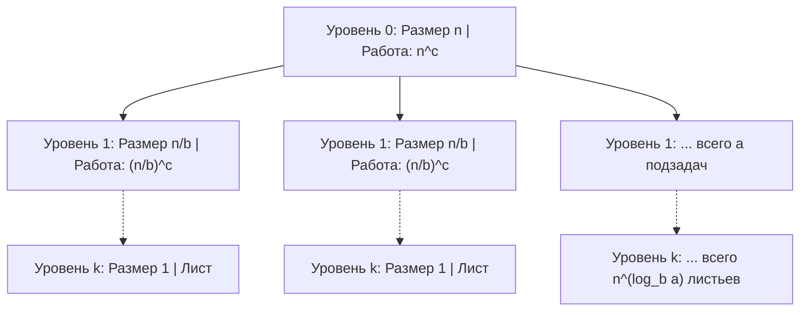
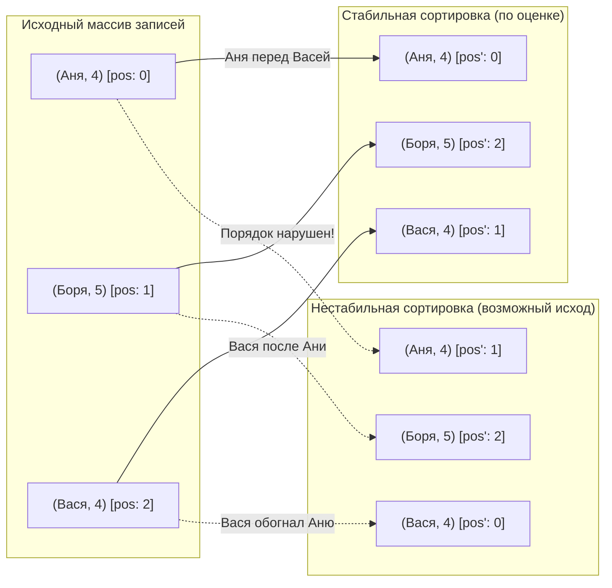

# ⚡ АиСД • Практика 2: Мастер-теорема, стабильность сортировок и псевдокод

> [!abstract] О занятии
> - **Дисциплина:** [[Алгоритмы и структуры данных]] (1 семестр, Поток 2)
> - **Преподаватель практики:** Забашта Анастасия Сергеевна (ауд. 2414)
> - **Дата проведения:** 19 сентября 2026 г. (суббота, 13:30 — 15:00)
> - **Базовые источники:**
>   - Материалы курса АиСД ИТМО (2026)
>   - Томас Кормен, Чарльз Лейзерсон, Рональд Ривест, Клиффорд Штайн — *«Алгоритмы: построение и анализ»* (CLRS, 3-е/4-е изд., главы 2, 4, 7, 8)
> - **Ключевые темы:** Мастер-теорема (Master Theorem) для решения рекуррентных соотношений «разделяй и властвуй», дерево рекурсии и 3 фундаментальных случая; математический анализ стабильности (устойчивости) алгоритмов сортировки (почему Merge Sort стабильна, а Quick Sort нестабильна, сравнительный разбор и сводная таблица); общепринятые соглашения и стандарты записи алгоритмов на псевдокоде (стиль CLRS).

---

## 📌 Краткое резюме (TL;DR)

1. **Мастер-теорема:** Позволяет мгновенно находить точную асимптотику $T(n)$ для рекуррент вида $T(n) = a \cdot T(n/b) + \Theta(n^c)$. Решающий фактор — сравнение показателя работы вне рекурсии $c$ с показателем роста числа листьев $\log_b a$:
   - $c < \log_b a \implies T(n) = \Theta(n^{\log_b a})$ (рекурсия доминирует, львиная доля времени в листьях);
   - $c = \log_b a \implies T(n) = \Theta(n^c \log n)$ (работа по всем уровням рекурсии сбалансирована);
   - $c > \log_b a \implies T(n) = \Theta(n^c)$ (работа на верхнем уровне доминирует).
2. **Стабильность сортировок:** Сортировка называется стабильной, если она сохраняет исходный взаимный порядок элементов с равными ключами. 
   - **Merge Sort стабильна**, так как при слиянии равных ключей мы строго отдаем приоритет элементу из левой половины (`<=`).
   - **Quick Sort нестабильна**, поскольку фаза разбиения (`Partition`) совершает далекие обмены (`swap`) через опорный элемент (`pivot`), перемешивая равные ключи.
3. **Псевдокод:** Универсальный язык описания алгоритмов для человека. В стиле CLRS используются отступы вместо скобок, оператор присваивания `<-` (или `:=`), явное указание диапазонов индексов и отсутствие платформозависимого низкоуровневого шума.

---

## 1. 🧮 Мастер-теорема (Master Theorem)

Мастер-теорема — фундаментальный метод математического анализа асимптотической сложности рекурсивных алгоритмов, основанных на парадигме **«Разделяй и властвуй» (Divide and Conquer)**.

### Формулировка рекуррентного соотношения

Алгоритм разбивает задачу размера $n$ на $a$ подзадач меньшего размера, каждая из которых имеет размер $n/b$. Суммарная стоимость этапов разделения задачи и объединения решений подзадач составляет функцию $f(n) = \Theta(n^c)$:

$$T(n) = a \cdot T\!\left(\frac{n}{b}\right) + \Theta(n^c)$$

где параметры удовлетворяют ограничениям:
- $a \ge 1$ — целое число подзадач, вызываемых рекурсивно;
- $b > 1$ — вещественная константа сжатия размера входа;
- $c \ge 0$ — степень полиномиальной функции затрат вне рекурсии;
- Базовый случай: $T(n) = \Theta(1)$ при $n \le n_0$.

> [!important] Ключевой показатель: $\log_b a$
> Величина $\log_b a$ задает **показатель степени количества листьев** в полном дереве рекурсии.  
> На глубине $k = \log_b n$ размер подзадачи уменьшается до $1$, а суммарное количество листьев составляет:
> $$a^{\log_b n} = n^{\log_b a}$$
> Поведение функции $T(n)$ определяется соревнованием между ростом числа листьев ($n^{\log_b a}$) и стоимостью работы на верхних уровнях ($n^c$).

---

### Анализ через дерево рекурсии



Суммарная работа на уровне $k$ дерева рекурсии равна:
$$\text{Cost}(k) = a^k \cdot \left(\frac{n}{b^k}\right)^c = n^c \cdot \left(\frac{a}{b^c}\right)^k$$

Сумма по всем уровням от $k = 0$ до $k = \log_b n$ образует геометрическую прогрессию со знаменателем $q = \frac{a}{b^c}$:

$$\sum_{k=0}^{\log_b n} n^c \cdot \left(\frac{a}{b^c}\right)^k$$

Знаменатель $q = \frac{a}{b^c}$ определяет, какой из трех сценариев реализуется:

---

### Три случая Мастер-теоремы

#### Случай 1: $c < \log_b a$ — Рекурсия доминирует (Листья побеждают)

- **Знаменатель прогрессии:** $q = \frac{a}{b^c} > 1$. Работа экспоненциально возрастает при спуске по дереву.
- **Главный вклад:** Листья дерева рекурсии.
- **Асимптотический итог:**
  $$T(n) = \Theta(n^{\log_b a})$$

#### Случай 2: $c = \log_b a$ — Идеальный баланс уровней

- **Знаменатель прогрессии:** $q = \frac{a}{b^c} = 1$. Работа на каждом уровне одинакова и равна $\Theta(n^c)$.
- **Главный вклад:** Все уровни вносят равный вклад. Всего уровней $\log_b n + 1$.
- **Асимптотический итог:**
  $$T(n) = \Theta(n^c \log n) = \Theta(n^{\log_b a} \log n)$$

#### Случай 3: $c > \log_b a$ — Верхний уровень доминирует (Корень побеждает)

- **Знаменатель прогрессии:** $q = \frac{a}{b^c} < 1$. Работа убывает в геометрической прогрессии при спуске вглубь.
- **Главный вклад:** Корневой узел дерева (исходное разделение и финальное слияние).
- **Условие регулярности:** $a \cdot f(n/b) \le d \cdot f(n)$ для некоторой константы $d < 1$ при больших $n$ (для полиномов выполняется автоматически).
- **Асимптотический итог:**
  $$T(n) = \Theta(n^c)$$

---

### Разбор типовых примеров с практики

> [!example] Пример 1: Merge Sort (Сортировка слиянием)
> $$T(n) = 2 \cdot T\!\left(\frac{n}{2}\right) + \Theta(n)$$
> - $a = 2, b = 2, c = 1$.
> - $\log_b a = \log_2 2 = 1$.
> - Сравнение: $c = 1 = \log_b a \implies$ **Случай 2**.
> - **Результат:** $T(n) = \Theta(n^1 \log n) = \Theta(n \log n)$.

> [!example] Пример 2: Двоичный поиск (Binary Search)
> $$T(n) = 1 \cdot T\!\left(\frac{n}{2}\right) + \Theta(1)$$
> - $a = 1, b = 2, c = 0$ (так как $\Theta(1) = \Theta(n^0)$).
> - $\log_b a = \log_2 1 = 0$.
> - Сравнение: $c = 0 = \log_b a \implies$ **Случай 2**.
> - **Результат:** $T(n) = \Theta(n^0 \log n) = \Theta(\log n)$.

> [!example] Пример 3: Алгоритм Штрассена (Быстрое умножение матриц $n \times n$)
> Алгоритм делит каждую матрицу на 4 блока и вычисляет 7 вспомогательных матричных произведений размера $n/2$:
> $$T(n) = 7 \cdot T\!\left(\frac{n}{2}\right) + \Theta(n^2)$$
> - $a = 7, b = 2, c = 2$.
> - $\log_b a = \log_2 7 \approx 2{,}807$.
> - Сравнение: $c = 2 < 2{,}807 = \log_b a \implies$ **Случай 1**.
> - **Результат:** $T(n) = \Theta(n^{\log_2 7}) \approx \Theta(n^{2{,}81})$ (быстрее классического наивного $\Theta(n^3)$).

> [!example] Пример 4: Алгоритм Карацубы (Быстрое умножение длинных чисел)
> Умножение двух $n$-значных чисел через 3 рекурсивных умножения чисел длины $n/2$:
> $$T(n) = 3 \cdot T\!\left(\frac{n}{2}\right) + \Theta(n)$$
> - $a = 3, b = 2, c = 1$.
> - $\log_b a = \log_2 3 \approx 1{,}585$.
> - Сравнение: $c = 1 < 1{,}585 = \log_b a \implies$ **Случай 1**.
> - **Результат:** $T(n) = \Theta(n^{\log_2 3}) \approx \Theta(n^{1{,}585})$ (быстрее наивного умножения «в столбик» $\Theta(n^2)$).

> [!example] Пример 5: Алгоритм с доминированием корня
> $$T(n) = 3 \cdot T\!\left(\frac{n}{4}\right) + \Theta(n^2)$$
> - $a = 3, b = 4, c = 2$.
> - $\log_b a = \log_4 3 \approx 0{,}793$.
> - Сравнение: $c = 2 > 0{,}793 = \log_b a \implies$ **Случай 3**.
> - Проверка регулярности: $3 \cdot (n/4)^2 = \frac{3}{16} n^2 \le d \cdot n^2$ при $d = \frac{3}{16} < 1$ (выполняется).
> - **Результат:** $T(n) = \Theta(n^2)$.

> [!example] Пример 6: Наивное разбиение на 4 подзадачи с линейным слиянием
> $$T(n) = 4 \cdot T\!\left(\frac{n}{2}\right) + \Theta(n)$$
> - $a = 4, b = 2, c = 1$.
> - $\log_b a = \log_2 4 = 2$.
> - Сравнение: $c = 1 < 2 = \log_b a \implies$ **Случай 1** (рекурсия доминирует, львиная доля времени уходит на обработку листьев).
> - **Результат:** $T(n) = \Theta(n^{\log_2 4}) = \Theta(n^2)$.
> - *Интуиция:* несмотря на то, что на каждом уровне разделение и слияние происходят за линейное время $\Theta(n)$, быстрое учетверение количества подзадач ($4^k$) полностью нивелирует преимущества парадигмы «разделяй и властвуй», возвращая асимптотику к квадратичной сложности.

---

### Границы применимости: когда Мастер-теорема НЕ работает

> [!warning] Ограничения теоремы
> Мастер-теорема неприменима в следующих ситуациях:
> 1. **Разные размеры подзадач:**
>    $$T(n) = T\!\left(\frac{n}{3}\right) + T\!\left(\frac{2n}{3}\right) + \Theta(n)$$
>    Здесь нет единого параметра $b$. Применяется метод дерева рекурсии или более мощная **теорема Акра–Бацци (Akra–Bazzi theorem)**.
> 2. **Попадание в асимптотический «зазор» (неполиномиальное различие):**
>    $$T(n) = 2 \cdot T\!\left(\frac{n}{2}\right) + \Theta(n \log n)$$
>    Здесь $\log_2 2 = 1$, но $f(n) = n \log n$ растет быстрее $n^1$, однако не полиномиально быстрее (не существует $\varepsilon > 0$ такого, что $n \log n = \Omega(n^{1+\varepsilon})$).  
>    *Решение по обобщенной мастер-теореме:* $T(n) = \Theta(n \log^2 n)$.
> 3. **Вычитательные соотношения:**
>    $$T(n) = T(n - 1) + \Theta(n)$$
>    Это сдвиг размера на константу, а не деление на $b$. Задача решается непосредственным суммированием арифметической прогрессии: $T(n) = \Theta(n^2)$.

---

## 2. 🎯 Стабильность (устойчивость) алгоритмов сортировки

### Определение стабильности

> [!important] Формальное определение
> Алгоритм сортировки называется **стабильным (устойчивым, stable)**, если он гарантированно сохраняет **исходный относительный порядок** элементов, имеющих равные ключи сортировки.
> 
> Если до сортировки элемент $A$ предшествовал элементу $B$ ($\operatorname{pos}(A) < \operatorname{pos}(B)$) и их ключи совпадают ($\operatorname{key}(A) = \operatorname{key}(B)$), то после выполнения стабильной сортировки новое положение элемента $A$ обязано быть строго левее нового положения элемента $B$:
> $$\operatorname{pos}'(A) < \operatorname{pos}'(B)$$



### Зачем нужна стабильность на практике?

1. **Многоуровневая сортировка по нескольким атрибутам:**
   Классическая задача: отсортировать список сотрудников сначала по отделам, а внутри каждого отдела — по фамилии.
   - Шаг 1: сортируем по вторичному ключу (по фамилии).
   - Шаг 2: сортируем **стабильным алгоритмом** по первичному ключу (по отделу).  
   В результате внутри каждого отдела сотрудники останутся идеально отсортированными по алфавиту без дополнительных сравнений!
2. **Поразрядная сортировка (Radix Sort):**
   Корректность алгоритма Radix Sort математически базируется на абсолютной стабильности сортировки по каждому отдельному разряду (обычно применяется Counting Sort). Если промежуточная сортировка будет нестабильной, обработка старших разрядов безвозвратно разрушит порядок, установленный младшими разрядами.
3. **Предсказуемость в пользовательском интерфейсе и базах данных:**
   Пользователь ожидает, что повторный клик по заголовку столбца таблицы не приведет к случайному перемешиванию строк с одинаковыми значениями.

---

### Почему Merge Sort СТАБИЛЬНА?

Архитектура сортировки слиянием опирается на вспомогательную процедуру объединения двух уже упорядоченных подмассивов `Merge`. При слиянии элементы сравниваются попарно:

#### 1. Академический псевдокод процедуры слияния (стиль CLRS)
```text
MERGE(A, p, q, r)
    n1 <- q - p + 1
    n2 <- r - q
    Создать временные массивы L[0 .. n1 - 1] и R[0 .. n2 - 1]
    
    FOR i <- 0 TO n1 - 1 DO
        L[i] <- A[p + i]
    FOR j <- 0 TO n2 - 1 DO
        R[j] <- A[q + 1 + j]
        
    i <- 0
    j <- 0
    k <- p
    
    WHILE i < n1 AND j < n2 DO
        // КЛЮЧ К СТАБИЛЬНОСТИ: нестрогое неравенство <=
        IF L[i] <= R[j] THEN
            A[k] <- L[i]
            i <- i + 1
        ELSE
            A[k] <- R[j]
            j <- j + 1
        k <- k + 1
        
    WHILE i < n1 DO
        A[k] <- L[i]
        i <- i + 1
        k <- k + 1
        
    WHILE j < n2 DO
        A[k] <- R[j]
        j <- j + 1
        k <- k + 1
```

#### 2. Эталонная реализация на C++20
```cpp
#include <vector>
#include <span>
#include <concepts>
#include <utility>

// Концепт std::totally_ordered гарантирует строгое слабое упорядочение
template <std::totally_ordered T>
void Merge(std::span<T> arr, size_t left, size_t mid, size_t right) {
    const size_t n1 = mid - left + 1;
    const size_t n2 = right - mid;

    std::vector<T> L(arr.begin() + left, arr.begin() + mid + 1);
    std::vector<T> R(arr.begin() + mid + 1, arr.begin() + right + 1);

    size_t i = 0;
    size_t j = 0;
    size_t k = left;

    while (i < n1 && j < n2) {
        // ФУНДАМЕНТАЛЬНОЕ УСЛОВИЕ СТАБИЛЬНОСТИ: <=
        // При равенстве ключей приоритет ВСЕГДА отдается элементу из L (левой половины).
        if (L[i] <= R[j]) {
            arr[k] = std::move(L[i]);
            ++i;
        } else {
            arr[k] = std::move(R[j]);
            ++j;
        }
        ++k;
    }

    while (i < n1) {
        arr[k++] = std::move(L[i++]);
    }
    while (j < n2) {
        arr[k++] = std::move(R[j++]);
    }
}
```

> [!important] Секрет стабильности Merge Sort
> При равенстве ключей (`L[i] == R[j]`) условие `L[i] <= R[j]` **всегда отдает предпочтение элементу из левого подмассива**.  
> Поскольку все элементы массива `L` в исходном массиве физически располагались левее элементов массива `R`, их относительный порядок никогда не инвертируется.
> 
> **Внимание:** Если программист случайно заменит `<=` на строгое `<`, алгоритм Merge Sort мгновенно станет **нестабильным**, так как при равенстве первым будет браться элемент из правой половины!

---

### Почему Quick Sort НЕСТАБИЛЬНА?

В основе алгоритма лежит процедура разделения **Partition** относительно опорного элемента (`pivot`). 

В классических схемах (разбиение Ломуто или Хоара) для достижения максимальной производительности элементы перемещаются методом взаимного обмена (**swap**) на большие расстояния через опорный элемент.

#### Наглядный контрпример нестабильности (Схема Хоара)

Рассмотрим массив элементов с одинаковым числовым ключом $5$, но с сохранением исходной маркировки их порядка ($a, b, c$):

$$\text{Входной массив: } [\, 5_a,\; 3,\; 5_b,\; 2,\; 5_c \,]$$

Выбираем опорный элемент $\text{pivot} = 5_b$ (центральный элемент, индекс 2).

| Шаг трассировки | Указатели и операция | Состояние массива | Результат и инвариант |
| :---: | :--- | :---: | :--- |
| **0. Исходное состояние** | $i = 0$ (на $5_a$), $j = 4$ (на $5_c$), $\text{pivot} = 5_b$ | $[\, \mathbf{5_a},\; 3,\; 5_b,\; 2,\; \mathbf{5_c} \,]$ | Начало разбиения Хоара |
| **1. Поиск инверсий** | Указатель $i$ находит $A[0] = 5_a \ge \text{pivot}$,<br>указатель $j$ находит $A[4] = 5_c \le \text{pivot}$ | $[\, \mathbf{5_a},\; 3,\; 5_b,\; 2,\; \mathbf{5_c} \,]$ | Оба указателя остановились на элементах для обмена |
| **2. Далекий обмен (`swap`)** | $\text{SWAP}(A[0], A[4])$ | $[\, \mathbf{5_c},\; 3,\; 5_b,\; 2,\; \mathbf{5_a} \,]$ | Элемент $5_c$ переброшен влево, а $5_a$ — вправо через весь массив! |
| **3. Финал шага** | Завершение разбиения | $[\, 2,\; 3,\; \mathbf{5_c},\; 5_b,\; \mathbf{5_a} \,]$ | Порядок нарушен: $5_c$ оказался раньше $5_a$! |

> [!warning] Доказательство нестабильности
> В исходном массиве $5_a$ предшествовал $5_c$ ($\operatorname{pos}(5_a) = 0 < 4 = \operatorname{pos}(5_c)$).  
> После далекого обмена через опорный элемент $5_c$ встал левее $5_a$ ($\operatorname{pos}'(5_c) < \operatorname{pos}'(5_a)$). Это строго подтверждает фундаментальную **нестабильность алгоритма Quick Sort in-place**.

> [!tip] Можно ли сделать Quick Sort стабильной?
> Теоретически да, но с неприемлемыми потерями:
> 1. **Выделение $O(n)$ дополнительной памяти:** разделение не in-place, а через 3 отдельных массива `less`, `equal`, `greater`. Это уничтожает главное практическое достоинство Quick Sort — работу in-place в $O(\log n)$ дополнительной памяти стека.
> 2. **Вторичный ключ (исходный индекс):** хранить каждый элемент как пару `(value, original_index)`. Это удваивает расход памяти и накладные расходы на сравнения.
> 
> Поэтому на практике, если требуется стабильность и гарантированное время $O(n \log n)$, выбирают **Merge Sort** или **Tim Sort**.

---

### Сводная аналитическая таблица алгоритмов сортировки

| Алгоритм | Стабильность | Время (лучшее) | Время (среднее) | Время (худшее) | Доп. память | Принцип обеспечения стабильности / Причина нестабильности |
| :--- | :---: | :---: | :---: | :---: | :---: | :--- |
| **Merge Sort** | ✅ **Да** | $\Theta(n \log n)$ | $\Theta(n \log n)$ | $\Theta(n \log n)$ | $O(n)$ | При равенстве приоритет отдается левой половине (`<=`). |
| **Quick Sort** | ❌ **Нет** | $\Theta(n \log n)$ | $\Theta(n \log n)$ | $\Theta(n^2)$ | $O(\log n)$ | Далекие обмены (`swap`) через опорный элемент в `Partition`. |
| **Insertion Sort** | ✅ **Да** | $\Theta(n)$ | $\Theta(n^2)$ | $\Theta(n^2)$ | $O(1)$ | Элемент сдвигается влево только пока строго меньше соседа. |
| **Bubble Sort** | ✅ **Да** | $\Theta(n)$ | $\Theta(n^2)$ | $\Theta(n^2)$ | $O(1)$ | Обмен происходит строго при `arr[j] > arr[j+1]`. |
| **Selection Sort** | ❌ **Нет** | $\Theta(n^2)$ | $\Theta(n^2)$ | $\Theta(n^2)$ | $O(1)$ | Swap найденного минимума перебрасывает элемент через равный ему. |
| **Heap Sort** | ❌ **Нет** | $\Theta(n \log n)$ | $\Theta(n \log n)$ | $\Theta(n \log n)$ | $O(1)$ | Просеивание по куче (`sift-down`) и извлечение из корня нарушают порядок. |
| **Counting Sort** | ✅ **Да** | $\Theta(n + k)$ | $\Theta(n + k)$ | $\Theta(n + k)$ | $O(n + k)$ | При заполнении выхода справа налево с использованием префиксных сумм. |
| **Radix Sort** | ✅ **Да** | $\Theta(d(n+k))$ | $\Theta(d(n+k))$ | $\Theta(d(n+k))$ | $O(n + k)$ | Корректность опирается на стабильный внутренний `Counting Sort`. |
| **Tim Sort** | ✅ **Да** | $\Theta(n)$ | $\Theta(n \log n)$ | $\Theta(n \log n)$ | $O(n)$ | Гибрид стабильных `Insertion Sort` и `Merge Sort` (дефолт в Python и Java). |

---

## 3. 📝 Псевдокод и стандарты алгоритмической записи

### Зачем нужен псевдокод?

**Псевдокод** — формализованный, но не привязанный к конкретному языку программирования способ записи алгоритмов, оптимизированный для восприятия человеком.

1. **Абстракция от синтаксического шума:** Псевдокод позволяет сосредоточиться на **логике, математических инвариантах и асимптотике** алгоритма, опуская детали конкретного окружения (управление памятью, директивы препроцессора, приведение типов, специфику компилятора).
2. **Языковая независимость:** Описание алгоритма на псевдокоде в равной степени понятно разработчикам на C++, Python, Java, Go или Rust.
3. **Стандарт научных публикаций:** Академические книги (включая классический учебник Кормена CLRS) и статьи публикуют алгоритмы исключительно на псевдокоде.
4. **Алгоритмические собеседования и экзамены:** На очных защитах и технических интервью часто требуют изложить логику решения именно на чистом псевдокоде.

---

### Общепринятые соглашения (стиль CLRS)

- **Блочная структура через отступы:** Логические блоки кода выделяются отступами (отступ в 4 пробела), исключая загромождение фигурными скобками `{ ... }` или конструкциями `begin ... end`.
- **Оператор присваивания:** Обозначается стрелкой влево `<-` (или `:=`), чтобы визуально отличать присваивание от математического равенства `=` и логической проверки `==`:
  $$x \leftarrow 5$$
  $$\text{max\_val} \leftarrow A[0]$$
- **Условные ветвления:**
  ```text
  IF condition THEN
      statements
  ELSE IF condition THEN
      statements
  ELSE
      statements
  ```
- **Циклы:**
  ```text
  FOR variable <- start TO end DO
      statements

  WHILE condition DO
      statements

  FOR EACH element IN collection DO
      statements
  ```
- **Функции и процедуры:**
  ```text
  FUNCTION Name(parameters)
      statements
      RETURN result
  ```
- **Индексация массивов:** В математических алгоритмах традиционно принята 1-индексация ($1 \dots n$), а в системном программировании — 0-индексация ($0 \dots n-1$). На псевдокоде рекомендуется **всегда явно указывать границы** диапазона цикла (например, `FOR i <- 0 TO n - 1 DO`).

---

### Эталонные примеры алгоритмов на псевдокоде и C++20

#### 1. Поиск максимального элемента (FindMax)

##### Псевдокод (стиль CLRS)
```text
FUNCTION FindMax(A, n)
    max_val <- A[0]
    
    FOR i <- 1 TO n - 1 DO
        IF A[i] > max_val THEN
            max_val <- A[i]
            
    RETURN max_val
```

##### Идиоматический C++20
```cpp
#include <span>
#include <concepts>
#include <stdexcept>

template <std::totally_ordered T>
[[nodiscard]] constexpr T FindMax(std::span<const T> arr) {
    if (arr.empty()) {
        throw std::invalid_argument("Массив не должен быть пустым");
    }
    T max_val = arr[0];
    for (size_t i = 1; i < arr.size(); ++i) {
        if (arr[i] > max_val) {
            max_val = arr[i];
        }
    }
    return max_val;
}
```

---

#### 2. Двоичный поиск в отсортированном массиве (BinarySearch)

##### Псевдокод (стиль CLRS)
```text
FUNCTION BinarySearch(A, n, target)
    low <- 0
    high <- n - 1
    
    WHILE low <= high DO
        // Защита от переполнения целочисленного диапазона (вместо (low + high) / 2)
        mid <- low + (high - low) / 2
        
        IF A[mid] == target THEN
            RETURN mid
        ELSE IF A[mid] < target THEN
            low <- mid + 1
        ELSE
            high <- mid - 1
            
    RETURN -1   // Элемент не найден
```

##### Идиоматический C++20
```cpp
#include <span>
#include <concepts>
#include <optional>
#include <numeric> // std::midpoint

template <std::totally_ordered T>
[[nodiscard]] constexpr std::optional<size_t> BinarySearch(std::span<const T> arr, const T& target) noexcept {
    if (arr.empty()) return std::nullopt;

    size_t low = 0;
    size_t high = arr.size() - 1;

    while (low <= high) {
        // В C++20 std::midpoint гарантирует вычисление среднего без риска переполнения
        const size_t mid = std::midpoint(low, high);

        if (arr[mid] == target) {
            return mid;
        } else if (arr[mid] < target) {
            low = mid + 1;
        } else {
            if (mid == 0) break; // Защита от underflow для беззнакового size_t
            high = mid - 1;
        }
    }
    return std::nullopt;
}
```

---

#### 3. Быстрая сортировка (QuickSort): схемы Ломуто и Хоара

##### Псевдокод: разбиение Ломуто (Lomuto Partition)
```text
ALGORITHM QuickSortLomuto(A, low, high)
    IF low < high THEN
        p <- PartitionLomuto(A, low, high)
        QuickSortLomuto(A, low, p - 1)
        QuickSortLomuto(A, p + 1, high)

ALGORITHM PartitionLomuto(A, low, high)
    pivot <- A[high]
    i <- low - 1
    
    FOR j <- low TO high - 1 DO
        IF A[j] <= pivot THEN
            i <- i + 1
            SWAP(A[i], A[j])
            
    SWAP(A[i + 1], A[high])
    RETURN i + 1
```

##### Псевдокод: разбиение Хоара (Hoare Partition)
```text
ALGORITHM QuickSortHoare(A, low, high)
    IF low < high THEN
        p <- PartitionHoare(A, low, high)
        // Внимание: p разделяет диапазон на A[low .. p] и A[p + 1 .. high]
        QuickSortHoare(A, low, p)
        QuickSortHoare(A, p + 1, high)

ALGORITHM PartitionHoare(A, low, high)
    pivot <- A[low + (high - low) / 2]
    i <- low - 1
    j <- high + 1
    
    WHILE TRUE DO
        REPEAT i <- i + 1 UNTIL A[i] >= pivot
        REPEAT j <- j - 1 UNTIL A[j] <= pivot
        
        IF i >= j THEN
            RETURN j
        SWAP(A[i], A[j])
```

##### Идиоматический C++20 (Схема Ломуто)
```cpp
#include <span>
#include <concepts>
#include <utility>

template <std::totally_ordered T>
size_t PartitionLomuto(std::span<T> arr, size_t low, size_t high) {
    const T& pivot = arr[high];
    size_t i = low;

    for (size_t j = low; j < high; ++j) {
        if (arr[j] <= pivot) {
            std::swap(arr[i], arr[j]);
            ++i;
        }
    }
    std::swap(arr[i], arr[high]);
    return i;
}

template <std::totally_ordered T>
void QuickSortLomuto(std::span<T> arr, size_t low, size_t high) {
    if (low < high) {
        size_t p = PartitionLomuto(arr, low, high);
        if (p > 0) QuickSortLomuto(arr, low, p - 1);
        QuickSortLomuto(arr, p + 1, high);
    }
}
```

> [!tip] Сравнение разбиений Ломуто и Хоара
> - **Схема Ломуто:** проще в реализации и строгом доказательстве инварианта, но выполняет в среднем в $3$ раза больше операций `swap`, чем схема Хоара.
> - **Схема Хоара:** более производительна на практике за счет встречных указателей и совершает минимальное число перестановок, однако требует осторожности с границами рекурсии ($p$ и $p+1$, а не $p-1$ и $p+1$).

---

### 📋 Чек-лист чистого стиля псевдокода (CLRS Standards)

> [!check] Критерии качества записи алгоритмов
> - [x] **Отсутствие синтаксического шума:** в псевдокоде нет специфики компилятора (`#include`, `namespace`, приведений типов, явного управления памятью `malloc`/`free`).
> - [x] **Стрелка присваивания $\leftarrow$:** строго отделяет оператор присваивания `x <- y` от математического равенства `=` и проверки равенства `==`.
> - [x] **Явные границы диапазонов:** во всех циклах явно зафиксированы границы обхода (`FOR i <- 0 TO n - 1 DO` или `1 TO n`).
> - [x] **Семантическое именование:** имена процедур задаются в понятном стиле PascalCase (`BinarySearch`, `Partition`), переменные отражают назначение (`low`, `high`, `mid`, `pivot`).
> - [x] **Отражение инварианта:** комментарии поясняют не тривиальный синтаксис, а математический инвариант цикла и обоснование корректности.

---

## ❓ Вопросы для самопроверки к коллоквиуму / экзамену

- [ ] Как формулируется рекуррентное соотношение в Мастер-теореме и какой физический смысл имеет величина $\log_b a$?
- [ ] В каком случае Мастер-теоремы итоговая сложность приобретает множитель $\log n$? Почему этот множитель равен ровно высоте дерева рекурсии?
- [ ] Почему алгоритм с рекуррентой $T(n) = 2T(n/2) + \Theta(n \log n)$ формально нельзя решить по стандартной Мастер-теореме?
- [ ] Дайте строгое определение стабильности сортировки. Приведите пример массива, на котором нестабильность Quick Sort приводит к изменению порядка равных элементов.
- [ ] Почему в алгоритме `Merge Sort` замена условия `left[i] <= right[j]` на `left[i] < right[j]` приводит к потере стабильности?
