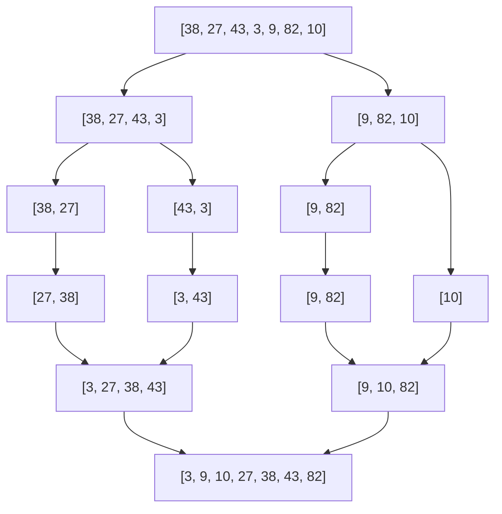

# 📌 Лекция 3: Сортировка слиянием (Merge Sort), Быстрая сортировка (Quick Sort) и анализ рекурсии

> [!abstract] О лекции
> - **Дисциплина:** [[Алгоритмы и структуры данных]] (1 семестр)
> - **Ключевые концепции:** Парадигма «Разделяй и властвуй» (Divide and Conquer), рекуррентные уравнения и Основная теорема о рекуррентах (Master Theorem), алгоритм Merge Sort и слияние за $O(n)$, Quick Sort, выбор опорного элемента (pivot), схемы разбиения Ломуто и Хоара, рандомизация, наихудший случай $O(n^2)$ и средний случай $O(n \log n)$, порядковые статистики (Quick Select).

---

## 1. Парадигма «Разделяй и властвуй» и Master Theorem

Парадигма Divide and Conquer состоит из 3 этапов:
1. **Разделение (Divide):** задача разбивается на $a$ подзадач меньшего размера $\frac{n}{b}$.
2. **Властвование (Conquer):** рекурсивное решение подзадач.
3. **Объединение (Combine):** комбинирование решений подзадач в единый ответ за время $f(n)$.

Рекуррентное уравнение времени работы:
$$T(n) = a \cdot T\left(\frac{n}{b}\right) + f(n)$$

### Основная теорема о рекуррентных соотношениях (Master Theorem)
Пусть $c_{\text{crit}} = \log_b a$.
1. **Случай 1:** Если $f(n) = O(n^{c_{\text{crit}} - \varepsilon})$ для $\varepsilon > 0$, то:
   $$T(n) = \Theta(n^{\log_b a})$$
2. **Случай 2:** Если $f(n) = \Theta(n^{c_{\text{crit}}} \log^k n)$ для $k \ge 0$, то:
   $$T(n) = \Theta(n^{\log_b a} \log^{k+1} n)$$
3. **Случай 3:** Если $f(n) = \Omega(n^{c_{\text{crit}} + \varepsilon})$ и выполняется условие регулярности $a f(n/b) \le c f(n)$ при $c < 1$, то:
   $$T(n) = \Theta(f(n))$$

---

## 2. Сортировка слиянием (Merge Sort)

### Идея алгоритма
1. Массив делится пополам: $m = \lfloor (l + r) / 2 \rfloor$.
2. Рекурсивно сортируются левая половина $[l, m]$ и правая половина $[m+1, r]$.
3. Два отсортированных подмассива сливаются в один отсортированный массив за линейное время $O(n)$ с помощью двух указателей.



### Анализ сложности:
- Рекуррента: $T(n) = 2 T(n/2) + \Theta(n)$.
  Здесь $a = 2, b = 2 \implies \log_b a = 1$. Так как $f(n) = \Theta(n^1)$, применим Случай 2 Master Theorem при $k = 0$:
  $$T(n) = \Theta(n \log n) \quad \text{во всех случаях (худший, лучший, средний)!}$$
- **Память:** Требует дополнительный буфер размера $O(n)$ для процедуры слияния.
- **Устойчивость:** ✅ Устойчива при условии нестрогого сравнения $A[i] \le B[j]$ (элементы из левой половины берутся первыми).


---

## 3. Быстрая сортировка (Quick Sort)

Разработана Чарльзом Хоаром в 1960 году. Является самым эффективным на практике алгоритмом сортировки общего назначения (входит в основу `std::sort`).

### Идея
1. Выбирается опорный элемент (**pivot**).
2. Массив переупорядочивается (**Partition**) так, чтобы:
   - Все элементы, меньшие либо равные pivot, оказались слева от него.
   - Все элементы, большие либо равные pivot, оказались справа от него.
3. Рекурсивно сортируются левая и правая части.


### Схемы разбиения: Ломуто vs Хоара
1. **Схема Ломуто:**
   Простой указатель $i$, идущий слева направо. Делает больше перестановок (swaps), менее эффективна при дубликатах.
2. **Схема Хоара:**
   Два указателя $i$ и $j$, бегущие навстречу друг другу. Делает примерно в 3 раза меньше свопов, чем схема Ломуто, и устойчива к массивам из одинаковых элементов.

```cpp
// Разбиение по схеме Хоара
int partitionHoare(std::vector<int>& a, int low, int high) {
    int pivot = a[low + (high - low) / 2];
    int i = low - 1;
    int j = high + 1;
    while (true) {
        do { i++; } while (a[i] < pivot);
        do { j--; } while (a[j] > pivot);
        if (i >= j) return j;
        std::swap(a[i], a[j]);
    }
}
```

### Анализ сложности:
- **Худший случай:** Если pivot всегда оказывается минимальным или максимальным элементом (например, при сортировке уже отсортированного массива с фиксацией pivot на крайнем элементе):
  $$T(n) = T(n-1) + O(n) = O(n^2)$$
- **Лучший случай:** Pivot делит массив ровно пополам:
  $$T(n) = 2 T(n/2) + O(n) = O(n \log n)$$
- **Средний случай:** Для случайных данных или рандомизированного выбора pivot:
  $$T(n) = 2n \ln n + O(n) \approx 1.39 n \log_2 n = O(n \log n)$$
- **Память:** $O(\log n)$ дополнительной памяти на стек вызовов при оптимизации хвостовой рекурсии (Tail Call Optimization) по меньшей половине.
- **Устойчивость:** ❌ Неустойчива из-за далеких перестановок через pivot.

---

## 4. Порядковые статистики за $O(n)$: QuickSelect

Задача: найти $k$-й по величине элемент в массиве без полной сортировки.
- В QuickSort мы рекурсивно идем в обе половины.
- В QuickSelect мы спускаемся **только в ту половину**, где лежит индекс $k$:
  $$T(n) = T(n/2) + O(n) = O(n) \quad (\text{в среднем!})$$
  В C++ стандартная библиотека предоставляет готовый алгоритм `std::nth_element`.

---

## 4. 🔬 Обобщенный анализ рекурсии и архитектурные оптимизации

### Теорема Акры-Бацци (Akra-Bazzi Theorem)
Для неравномерных рекуррентных соотношений вида $T(x) = g(x) + \sum_{i=1}^k a_i T(b_i x)$ с $a_i > 0, b_i \in (0, 1)$:
1. Находится единственный корень $p$ уравнения:
   $$\sum_{i=1}^k a_i b_i^p = 1$$
2. Асимптотика выражается интегралом:
   $$T(x) = \Theta\left( x^p \left( 1 + \int_1^x \frac{g(u)}{u^{p+1}} \, du \right) \right)$$

---

### Точный аналитический расчет среднего времени QuickSort
Математическое ожидание числа сравнений при случайном выборе pivot выражается через гармонические числа:
$$C_n = 2(n + 1) H_n - 4n = 2n \ln n + (2\gamma - 4)n + 2\ln n + O(1) \approx 1.3863 \, n \log_2 n$$
где $H_n = \sum_{k=1}^n 1/k$, а $\gamma \approx 0.5772$ — постоянная Эйлера.

---

### Архитектурные модификации: Dual-Pivot и Cache-Oblivious
- **Dual-Pivot QuickSort (Ярославский):** Использование двух опорных элементов делит массив на 3 части, сокращая число чтений из памяти на 20% и уменьшая нагрузку на шину памяти (стандарт в Java 7+).
- **Cache-Oblivious Funnelsort:** Достигает оптимального числа кэш-промахов $Q(n) = O\left( \frac{n}{B} \log_{M/B} \frac{n}{B} \right)$ без предварительного знания параметров кэша $M$ и размера строки $B$.

---

## 🚀 Фундаментальная связь с будущими дисциплинами и технологиями (ИТМО Curriculum)

1. **Высоконагруженные распределенные системы (Сем 6, 7):**
   - Параллельные алгоритмы слияния (Parallel Multiway Merge Sort) на основе OpenMP и MPI обеспечивают эффективное масштабирование на серверах с десятками ядер CPU.
2. **Теория алгоритмической сложности (Сем 5):**
   - Рандомизированный QuickSort демонстрирует принадлежность к классу ZPP (Zero-Error Probabilistic Polynomial Time).

---

## 🔗 Связанные материалы
- [[Алгоритмы и структуры данных]] — страница дисциплины
- [[02. Лекция - Линейные сортировки (Counting, Radix, Bucket) и нижняя оценка сравнений (2026-09-19)]]
- [[04. Лекция - Двоичная куча (Binary Heap), пирамидальная сортировка (Heap Sort) (2026-10-03)]]
