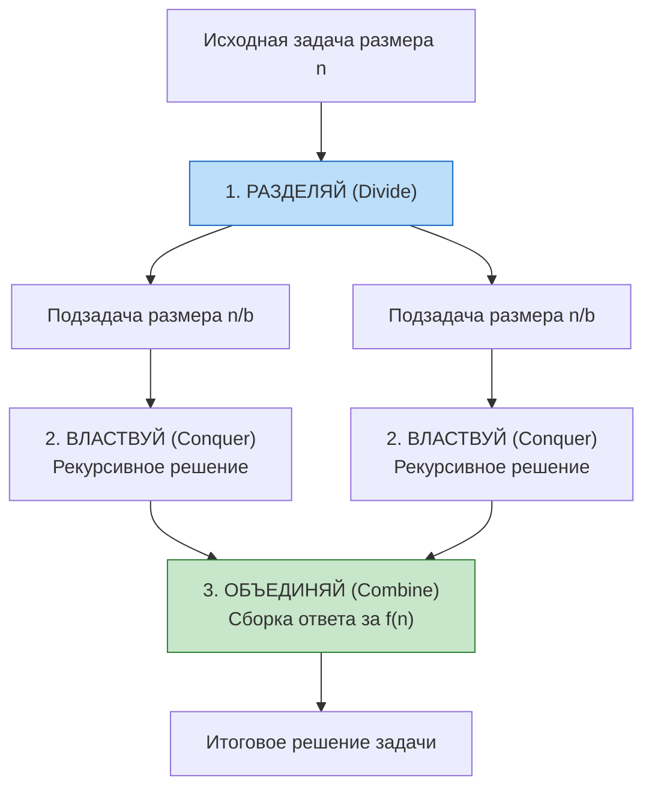
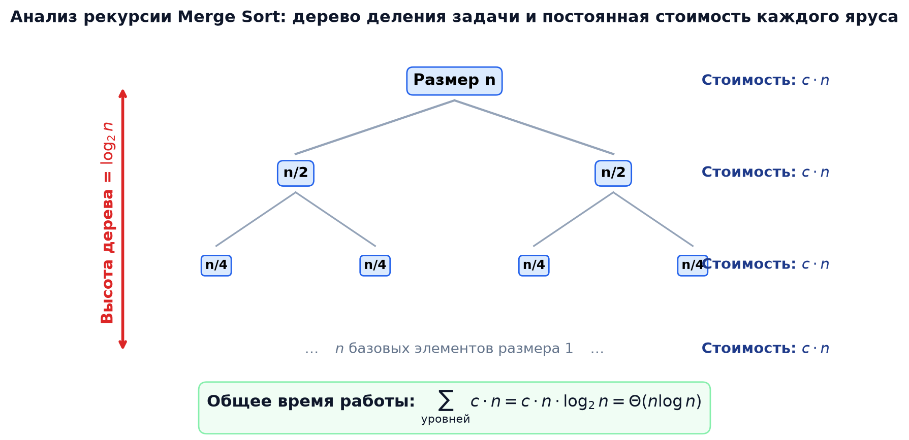
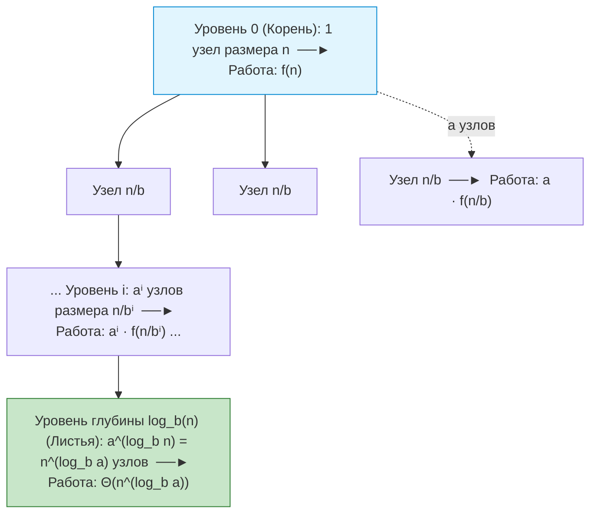
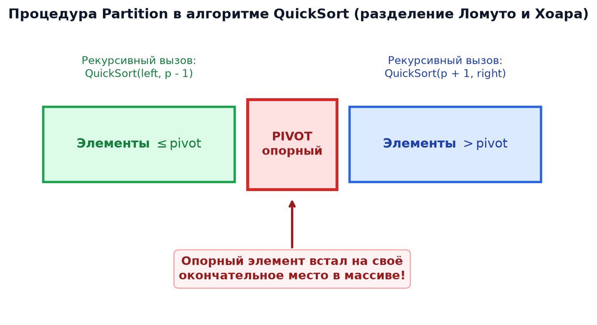

# ⚡ АиСД • Лекция 3: Сортировка слиянием (Merge Sort), Быстрая сортировка (Quick Sort) и Мастер-теорема

> [!abstract] О занятии
> - **Дисциплина:** [[Алгоритмы и структуры данных]] (1 семестр, Поток 2)
> - **Лектор:** Ткаченко Даниил Михайлович
> - **Базовые источники:**
>   - Материалы курса АиСД ИТМО (лекции Ткаченко Д.М., 2026)
>   - Томас Кормен, Чарльз Лейзерсон, Рональд Ривест, Клиффорд Штайн — *«Алгоритмы: построение и анализ»* (CLRS, 3-е/4-е изд., главы 2, 4, 7, 9)
> - **Ключевые темы:** Парадигма декомпозиции «Разделяй и властвуй» (Divide and Conquer), соглашение о полуоткрытом диапазоне $[l, r)$, алгоритм Merge Sort и исправление типичных ошибок в коде, процедура слияния Merge с доказательством устойчивости, пошаговая числовая трассировка слияния, основная теорема о рекуррентах (Master Theorem), исчерпывающее доказательство Master Theorem через дерево рекурсии (уровни, узлы $a^i$, листья $a^{\log_b n} = n^{\log_b a}$, суммирование геометрической прогрессии), алгоритм Quick Sort, сравнение схем разбиения Ломуто и Хоара, аналитический расчет среднего времени $1.39 n \log_2 n$, устранение хвостовой рекурсии, порядковые статистики QuickSelect за $O(n)$ и теорема Акры-Бацци.

---

## 1. 🧩 Парадигма декомпозиции: «Разделяй и властвуй» (Divide and Conquer)

Большинство эффективных алгоритмов обработки данных построены на фундаментальной парадигме **«Разделяй и властвуй»**. Идея заключается в том, чтобы свести решение сложной крупной задачи к решению нескольких аналогичных подзадач меньшего размера.

Метод декомпозиции строго состоит из **трех шагов**:
1. **Разделяй (Divide):** Разбиение исходной задачи размера $n$ на несколько подзадач меньшего размера (обычно того же типа и примерно равного объема $n/b$).
2. **Властвуй (Conquer):** Рекурсивное решение каждой из подзадач. Если размер подзадачи становится достаточно мал ($n \le 1$ или размер константен), наступает **базовый случай рекурсии**, где решение тривиально и возвращается напрямую.
3. **Объединяй (Combine):** Слияние (комбинирование) результатов решения меньших подзадач в единый целостный ответ для исходной задачи.



---

## 2. 🔀 Сортировка слиянием (Merge Sort)

### Интуиция алгоритма
Представьте, что у вас есть огромная стопка из 1000 экзаменационных работ, которую нужно отсортировать по алфавиту. Сортировать всю тысячу сразу вставками очень долго ($O(n^2)$). Вы делите стопку пополам (по 500), каждую половину отдаете коллегам, которые делят их дальше до единичных листов. Лист из одной работы уже тривиально отсортирован. Затем вы берете две уже упорядоченные стопки и аккуратно сливаете их в одну, просто сравнивая верхние листы обеих стопок.



---

### Соглашение о полуоткрытом диапазоне $[l, r)$
В профессиональном программировании (включая C++ STL) диапазоны массивов принято задавать **полуоткрытым интервалом $[l, r)$**:
- Индекс $l$ **включается** в диапазон.
- Индекс $r$ **НЕ включается** в диапазон (это позиция, следующая за последним элементом).

#### Почему полуоткрытый интервал идеален:
1. **Количество элементов:** вычисляется мгновенно без раздражающих $+1$:
   $$\text{Размер} = r - l$$
2. **Бесшовное разбиение на две половины:** если $mid = l + (r - l) / 2$, то:
   - Левая половина: $[l, mid)$;
   - Правая половина: $[mid, r)$.
   Индекс $mid$ не дублируется и не теряется: левый интервал заканчивается ровно там, где начинается правый!

---

### Анатомический разбор и исправление типичных студенческих ошибок

В студенческих конспектах и коде часто встречается наивная реализация:
```c
// ОШИБОЧНЫЙ ВАРИАНТ!
void mergeSort(int a[], int l, int r) {
    if (l + 1 == r) return; // ОШИБКА 1!
    int mid = (l + r) / 2;
    mergeSort(a, l, mid);
    mergeSort(a, mid, r);
    Merge(a, l, r);         // ОШИБКА 2!
}
```

> [!caution] Разбор двух критических ошибок
> 1. **Ошибка 1 (Базовый случай):** Условие `if (l + 1 == r) return;` срабатывает, только если в отрезке ровно один элемент ($r - l = 1$). Однако, если на вход случайно поступит пустой диапазон ($r = l$, то есть $r - l = 0$), произойдет бесконечная рекурсия и падение программы по переполнению стека (Stack Overflow)!
>    - **Исправление:** Безопасное условие: `if (r - l <= 1) return;` — защищает и от отрезка из 1 элемента, и от пустого отрезка.
> 2. **Ошибка 2 (Вызов Merge):** Вызов `Merge(a, l, r)` передает только крайние границы, скрывая информацию о том, где именно проходит граница между двумя половинами! Процедуре `Merge` жизненно необходимо знать позицию $mid$, чтобы правильно перебирать элементы левой и правой половин.
>    - **Исправление:** Обязательная явная передача середины: `Merge(a, l, mid, r)`.

---

### Академический псевдокод (Корректный)
```text
MERGE-SORT(A, l, r)
1  if r - l <= 1
2      return                       // Базовый случай: 0 или 1 элемент уже упорядочены
3  mid = l + (r - l) / 2            // Вычисление середины (без целочисленного переполнения)
4  MERGE-SORT(A, l, mid)            // Рекурсивная сортировка левой половины [l, mid)
5  MERGE-SORT(A, mid, r)            // Рекурсивная сортировка правой половины [mid, r)
6  MERGE(A, l, mid, r)              // Слияние двух отсортированных половин
```

---

### Построчный анатомический разбор процедуры `Merge(a, l, mid, r)`

К моменту запуска `Merge(a, l, mid, r)` нам гарантировано, что:
- Подмассив $A[l .. mid-1]$ уже упорядочен по возрастанию;
- Подмассив $A[mid .. r-1]$ также уже упорядочен по возрастанию.

#### Алгоритм слияния:
1. Создаем вспомогательный буфер `temp` размера $r - l$. Мы не можем производить слияние «на месте» без сдвигов, иначе перезапишем еще не прочитанные элементы.
2. Заводим два бегущих указателя:
   - $i = l$ — бежит по левой половине $[l, mid)$;
   - $j = mid$ — бежит по правой половине $[mid, r)$.
   Указатель $k = 0$ указывает на свободное место в `temp`.
3. **Основной цикл сравнения:** пока $i < mid$ и $j < r$:
   - Сравниваем $A[i]$ и $A[j]$;
   - **Устойчивость (Stability):** если $A[i] \le A[j]$, мы **обязаны взять элемент из левой половины** $A[i]$. Так как в исходном массиве элементы левой половины стояли левее равных им элементов правой половины, это гарантирует сохранение их относительного порядка!
   - Меньший элемент копируется в `temp[k]`, соответствующий указатель ($i$ или $j$) и $k$ сдвигаются на $1$.
4. **Сброс остатков (Draining leftovers):** когда одна из половин исчерпана, во второй половине еще могут остаться элементы. Поскольку они уже упорядочены между собой и больше всех ранее записанных в `temp`, мы просто докопируем их в `temp` как есть.
5. **Копирование обратно:** весь буфер `temp` копируется назад в исходный массив $A[l .. r-1]$.

---

### 🎲 Пошаговая числовая трассировка процедуры Merge (Step-by-Step Trace)

Сливаем две уже отсортированные половины диапазона:
- Левая половина ($[l, mid)$): $A_{\text{left}} = [\mathbf{2, 5, 8}]$ ($i$ указывает на $2$)
- Правая половина ($[mid, r)$): $A_{\text{right}} = [\mathbf{1, 6, 7}]$ ($j$ указывает на $1$)

| Шаг $k$ | Указатель $i$ | Указатель $j$ | Сравнение | Выбранный элемент | Состояние буфера `temp` | Описание действия |
| :---: | :---: | :---: | :---: | :---: | :--- | :--- |
| **0** | $A[i] = 2$ | $A[j] = 1$ | $2 > 1$ | $1$ (справа) | $[1]$ | $1$ меньше, забираем из правой половины. $j$ сдвигается на $6$. |
| **1** | $A[i] = 2$ | $A[j] = 6$ | $2 \le 6$ | $2$ (слева) | $[1, 2]$ | $2$ меньше, забираем из левой половины. $i$ сдвигается на $5$. |
| **2** | $A[i] = 5$ | $A[j] = 6$ | $5 \le 6$ | $5$ (слева) | $[1, 2, 5]$ | $5$ меньше, забираем из левой половины. $i$ сдвигается на $8$. |
| **3** | $A[i] = 8$ | $A[j] = 6$ | $8 > 6$ | $6$ (справа) | $[1, 2, 5, 6]$ | $6$ меньше, забираем из правой половины. $j$ сдвигается на $7$. |
| **4** | $A[i] = 8$ | $A[j] = 7$ | $8 > 7$ | $7$ (справа) | $[1, 2, 5, 6, 7]$ | $7$ меньше, забираем из правой половины. Правая часть исчерпана! |
| **5** | $A[i] = 8$ | исчерпан | — | $8$ (остаток) | $[\mathbf{1, 2, 5, 6, 7, 8}]$ | Докопируем остаток левой половины. |

Итоговый буфер `temp = [1, 2, 5, 6, 7, 8]` переносится в исходный массив. Массив отсортирован идеально!

---

### Production-Ready реализация на C++20
```cpp
#include <vector>
#include <iostream>
#include <utility>

template <typename T>
void merge(std::vector<T>& a, int l, int mid, int r) {
    std::vector<T> temp;
    temp.reserve(r - l); // Резервируем память один раз, избегая реаллокаций

    int i = l;
    int j = mid;

    // Слияние двух отсортированных половин
    while (i < mid && j < r) {
        // Условие <= критически важно для сохранения УСТОЙЧИВОСТИ (Stability)
        if (a[i] <= a[j]) {
            temp.push_back(std::move(a[i++]));
        } else {
            temp.push_back(std::move(a[j++]));
        }
    }

    // Докопирование оставшихся элементов левой половины
    while (i < mid) {
        temp.push_back(std::move(a[i++]));
    }
    // Докопирование оставшихся элементов правой половины
    while (j < r) {
        temp.push_back(std::move(a[j++]));
    }

    // Перенос из буфера обратно в исходный вектор
    for (int k = 0; k < static_cast<int>(temp.size()); ++k) {
        a[l + k] = std::move(temp[k]);
    }
}

template <typename T>
void merge_sort(std::vector<T>& a, int l, int r) {
    // Базовый случай: отрезок из 0 или 1 элемента уже упорядочен
    if (r - l <= 1) return;

    int mid = l + (r - l) / 2;

    // Рекурсивное деление
    merge_sort(a, l, mid);
    merge_sort(a, mid, r);

    // Слияние решений
    merge(a, l, mid, r);
}

// Удобная перегрузка для вызова одной строчкой: merge_sort(vec)
template <typename T>
void merge_sort(std::vector<T>& a) {
    merge_sort(a, 0, static_cast<int>(a.size()));
}
```

---

### ⏱️ Анализ сложности Merge Sort

1. **Рекуррентное уравнение времени работы:**
   $$T(n) = 2 \cdot T\left(\frac{n}{2}\right) + \Theta(n)$$
   где:
   - $2 \cdot T(n/2)$ — затраты на рекурсивную сортировку двух половин размера $n/2$;
   - $\Theta(n)$ — время работы процедуры `Merge` (каждый элемент сравнивается и перемещается в буфер константное число раз).
2. **Точная асимптотика:**
   $$T(n) = \Theta(n \log n)$$
3. **Уникальная стабильность по времени:**
   В отличие от Insertion Sort и Quick Sort, у Merge Sort **лучший, худший и средний случаи асимптотически строго одинаковы**:
   $$T_{\text{best}}(n) = T_{\text{avg}}(n) = T_{\text{worst}}(n) = \Theta(n \log n)$$
   Алгоритм гарантированно никогда не деградирует до $\Theta(n^2)$, независимо от начальной перестановки данных!
4. **Плата за скорость — Пространственная сложность:**
   Сортировка слиянием требует **$O(n)$ дополнительной оперативной памяти** для буфера `temp`. Это классический компромисс CS: мы получаем гарантированные $O(n \log n)$ ценой расхода дополнительной памяти.
5. **Устойчивость:** ✅ Алгоритм **строго устойчив** (Stable), если при $a[i] == a[j]$ приоритет отдается левому элементу.

---

## 3. 👑 Мастер-теорема (Основная теорема о рекуррентных соотношениях)

При анализе алгоритмов типа «Разделяй и властвуй» постоянно возникают рекуррентные уравнения. Чтобы каждый раз не расписывать дерево рекурсии вручную, используется мощнейший аналитический аппарат — **Мастер-теорема (Master Theorem)**.

### 3.1. Каноническая постановка задачи
Рассматривается рекуррентное уравнение вида:
$$T(n) = a \cdot T\left(\frac{n}{b}\right) + f(n)$$
где:
- $n$ — размер исходной задачи;
- $a \ge 1$ — **количество рекурсивных подзадач**, порождаемых на каждом шаге декомпозиции;
- $b > 1$ — **коэффициент уменьшения размера**: каждая подзадача имеет размер $n/b$;
- $f(n)$ — асимптотически положительная функция стоимости «внешней работы»: затраты на фазу Divide (разбиение задачи) и фазу Combine (слияние результатов).

#### В чем состоит интуитивная борьба?
Итоговая асимптотика $T(n)$ определяется соревнованием двух сил:
1. **Стоимость рекурсии (размножение задач):** если спуститься до самого низа дерева рекурсии (до тривиальных листьев размера $1$), суммарное количество листьев вырастет до величины **$n^{\log_b a}$**. Это «стоимость чистой рекурсии».
2. **Стоимость внешней работы $f(n)$:** насколько дорого обходится слияние на верхних уровнях.

Мастер-теорема формализует, кто из этих двух соперников побеждает асимптотически.

---

### 3.2. Формулировка Мастер-теоремы

Пусть $T(n) = a T(n/b) + f(n)$, где $a \ge 1$, $b > 1$ — константы. Тогда справедливы 3 фундаментальных случая:

#### Случай 1: Доминирует стоимость листьев рекурсии
Если $f(n) = O\left(n^{\log_b a - \varepsilon}\right)$ для некоторой константы $\varepsilon > 0$ (то есть $f(n)$ растет **полиномиально медленнее**, чем $n^{\log_b a}$), то:
$$T(n) = \Theta\left(n^{\log_b a}\right)$$

#### Случай 2: Баланс между рекурсией и внешней работой
Если $f(n) = \Theta\left(n^{\log_b a}\right)$ (то есть $f(n)$ имеет **строго тот же порядок роста**, что и $n^{\log_b a}$), то:
$$T(n) = \Theta\left(n^{\log_b a} \log n\right)$$
*(Множитель $\log n$ появляется из-за суммирования одинакового вклада по всем уровням дерева!)*

*Расширение случая 2 (CLRS):* Если $f(n) = \Theta(n^{\log_b a} \log^k n)$ при $k \ge 0$, то $T(n) = \Theta(n^{\log_b a} \log^{k+1} n)$.

#### Случай 3: Доминирует внешняя работа в корне дерева
Если $f(n) = \Omega\left(n^{\log_b a + \varepsilon}\right)$ для некоторой константы $\varepsilon > 0$ (то есть $f(n)$ растет **полиномиально быстрее**, чем $n^{\log_b a}$), и дополнительно выполняется **условие регулярности**:
$$a \cdot f\left(\frac{n}{b}\right) \le c \cdot f(n) \quad \text{для некоторой константы } c < 1 \text{ и всех достаточно больших } n,$$
то:
$$T(n) = \Theta(f(n))$$

---

### 3.3. 🎓 ПОЛНОЕ МАТЕМАТИЧЕСКОЕ ДОКАЗАТЕЛЬСТВО (Через дерево рекурсии)

Докажем Мастер-теорему, явно построив дерево рекурсии и просуммировав вычислительную работу по всем его ярусам.

#### 1. Структура уровней дерева рекурсии
Пусть корень дерева находится на уровне $i = 0$.
- **Уровень 0 (Корень):** 1 узел с размером задачи $n$. Внешняя работа равна $f(n)$.
- **Уровень 1:** $a$ узлов, каждый с задачей размера $n/b$. Работа в каждом узле: $f(n/b)$. Суммарная работа: $a \cdot f(n/b)$.
- **Уровень $i$:** 
  - Количество узлов: $a^i$ (на каждом шаге число узлов умножается на $a$).
  - Размер задачи в каждом узле: $n / b^i$.
  - Суммарная внешняя работа на уровне $i$:
    $$W_i = a^i \cdot f\left(\frac{n}{b^i}\right)$$



#### 2. Глубина дерева и число листьев
Рекурсивное деление останавливается, когда размер подзадачи уменьшается до базового случая размера $1$:
$$\frac{n}{b^i} = 1 \iff b^i = n \iff i = \log_b n$$
Следовательно, глубина дерева равна $h = \log_b n$, а всего в дереве $\log_b n + 1$ уровней (от $i = 0$ до $i = \log_b n$).

#### 3. Подсчет количества листьев: Тождество $a^{\log_b n} = n^{\log_b a}$
На последнем уровне ($i = \log_b n$) число узлов-листьев равно $a^{\log_b n}$.
Докажем фундаментальное логарифмическое тождество:
$$a^{\log_b n} = n^{\log_b a}$$
*Доказательство:*
Воспользуемся основным логарифмическим тождеством: $a = b^{\log_b a}$.
$$a^{\log_b n} = \left(b^{\log_b a}\right)^{\log_b n} = b^{\log_b a \cdot \log_b n} = \left(b^{\log_b n}\right)^{\log_b a}$$
Так как $b^{\log_b n} = n$, получаем:
$$\left(b^{\log_b n}\right)^{\log_b a} = n^{\log_b a} \quad \blacksquare$$

Каждый лист соответствует базовому случаю с константной стоимостью $\Theta(1)$.
Следовательно, суммарная стоимость всех листьев на дне дерева равна:
$$W_{\text{leaves}} = \Theta(1) \cdot n^{\log_b a} = \Theta\left(n^{\log_b a}\right)$$

#### 4. Общая сумма работы всего дерева
Суммарная трудоемкость алгоритма равна сумме внешней работы внутренних узлов плюс стоимость листьев:
$$T(n) = \Theta\left(n^{\log_b a}\right) + \sum_{i=0}^{\log_b n - 1} a^i \cdot f\left(\frac{n}{b^i}\right)$$

#### 5. Вывод трех случаев через геометрические прогрессии
Поведение суммы $\sum_{i=0}^{\log_b n - 1} a^i f(n/b^i)$ зависит от соотношения между $a^i$ и $f(n/b^i)$:

- **Доказательство Случая 1 ($f(n) = O(n^{\log_b a - \varepsilon})$):**
  Подставляя оценку $f$, получаем, что члены суммы образуют **убывающую геометрическую прогрессию** со знаменателем меньше $1$. Сумма бесконечно убывающей геометрической прогрессии ограничена величиной своего старшего (последнего) члена, то есть стоимостью листьев $\Theta(n^{\log_b a})$. Работа внутренних узлов пренебрежимо мала по сравнению с листьями:
  $$T(n) = \Theta\left(n^{\log_b a}\right) + O\left(n^{\log_b a}\right) = \Theta\left(n^{\log_b a}\right) \quad \blacksquare$$

- **Доказательство Случая 2 ($f(n) = \Theta(n^{\log_b a})$):**
  Подставим $f(n/b^i)$ в слагаемое уровня $i$:
  $$a^i f\left(\frac{n}{b^i}\right) = a^i \cdot \Theta\left(\left(\frac{n}{b^i}\right)^{\log_b a}\right) = a^i \cdot \frac{\Theta\left(n^{\log_b a}\right)}{(b^{\log_b a})^i} = a^i \cdot \frac{\Theta\left(n^{\log_b a}\right)}{a^i} = \Theta\left(n^{\log_b a}\right)$$
  Коэффициент $a^i$ **полностью сократился**! 
  Это означает, что **на каждом из $\log_b n$ уровней дерева выполняется строго одинаковый объем работы $\Theta(n^{\log_b a})$**!
  Суммируя одинаковую величину по всем $\log_b n$ уровням:
  $$T(n) = \Theta\left(n^{\log_b a}\right) + \sum_{i=0}^{\log_b n - 1} \Theta\left(n^{\log_b a}\right) = \Theta\left(n^{\log_b a}\right) + \log_b n \cdot \Theta\left(n^{\log_b a}\right) = \Theta\left(n^{\log_b a} \log n\right) \quad \blacksquare$$

- **Доказательство Случая 3 ($f(n) = \Omega(n^{\log_b a + \varepsilon})$ с условием регулярности):**
  Условие регулярности $a f(n/b) \le c f(n)$ при $c < 1$ гарантирует, что при движении от корня вниз к листьям работа на каждом следующем уровне **убывает как минимум в $1/c$ раз**. Следовательно, сумма по уровням образует геометрическую прогрессию, убывающую от корня к листьям. В такой прогрессии сумма всех уровней ограничена константой, умноженной на самое первое слагаемое — работу в корне $f(n)$:
  $$\sum_{i=0}^{\log_b n - 1} a^i f\left(\frac{n}{b^i}\right) \le f(n) \sum_{i=0}^{\infty} c^i = f(n) \cdot \frac{1}{1 - c} = O(f(n))$$
  Таким образом, вклад корня $f(n)$ полностью доминирует над всем остальным деревом:
  $$T(n) = \Theta\left(n^{\log_b a}\right) + \Theta(f(n)) = \Theta(f(n)) \quad \blacksquare$$

Мастер-теорема полностью доказана!

---

### 3.4. Мгновенное применение к Merge Sort
Проверим сортировку слиянием по Мастер-теореме:
$$T(n) = 2 \cdot T\left(\frac{n}{2}\right) + \Theta(n)$$
1. Параметры: $a = 2$, $b = 2$, $f(n) = \Theta(n)$.
2. Вычисляем опорную функцию рекурсии:
   $$n^{\log_b a} = n^{\log_2 2} = n^1 = n$$
3. Сравниваем $f(n)$ и $n^{\log_b a}$:
   $$f(n) = \Theta(n) \quad\text{и}\quad n^{\log_b a} = n \implies f(n) = \Theta\left(n^{\log_b a}\right)$$
   Это в точности **Случай 2 Мастер-теоремы**!
4. Готовый вердикт:
   $$T(n) = \Theta\left(n^{\log_2 2} \log n\right) = \Theta(n \log n)$$
Теорема дает точный ответ за секунды без ручных построений!

---

### 3.5. Границы применимости Мастер-теоремы (Ловушки и «зазоры»)
> [!warning] Важное предостережение
> Мастер-теорема применима **не ко всем** рекуррентным соотношениям! Между случаями 1, 2 и 3 существуют неперекрываемые зазоры:
> 1. **Неполиномиальный зазор:** Разница между $f(n)$ и $n^{\log_b a}$ обязана быть **полиномиальной** (множитель вида $n^\varepsilon$ при $\varepsilon > 0$).
>    *Пример неприменимости:* $T(n) = 2T(n/2) + n \log n$.
>    Здесь $n^{\log_2 2} = n$, а $f(n) = n \log n$. Функция $f(n)$ асимптотически больше $n$, но отношение $f(n)/n = \log n$ растет медленнее, чем любая степень $n^\varepsilon$! Базовая теорема здесь неприменима (нужна расширенная версия случая 2, дающая $\Theta(n \log^2 n)$).
> 2. **Нарушение условия регулярности:** В случае 3 условие $a f(n/b) \le c f(n)$ может не выполняться для сильно осциллирующих функций.
> 3. **Непостоянные коэффициенты:** Если размеры подзадач делятся неравномерно (например, $T(n) = T(n/3) + T(2n/3) + O(n)$), Мастер-теорема бессильна — требуется **теорема Акры-Бацци** (см. раздел 6).

---

## 4. ⚡ Быстрая сортировка (Quick Sort)

Разработана британским ученым сэром Чарльзом Хоаром в 1960 году. На сегодняшний день является самым быстрым на практике алгоритмом сортировки сравнениями общего назначения на массивах в оперативной памяти.

### 4.1. Принцип работы
1. **Выбор опорного элемента (Pivot):** Из массива выбирается некоторый элемент $p = A[\text{pivot}]$.
2. **Разделение (Partition):** Массив реорганизуется таким образом, чтобы:
   - Все элементы, меньшие либо равные $p$, оказались слева от границы разделения;
   - Все элементы, большие либо равные $p$, оказались справа от границы разделения.
3. **Рекурсия:** Рекурсивно запускаем QuickSort для левой и правой частей.



---

### 4.2. Схемы разбиения: Ломуто vs Хоара

| Характеристика | Схема Ломуто (Lomuto Partition) | Схема Хоара (Hoare Partition) |
| :--- | :--- | :--- |
| **Количество указателей** | 1 рабочий указатель $j$, бегущий слева направо | 2 встречных указателя $i$ и $j$, бегущих навстречу друг другу |
| **Позиция Pivot** | Обычно фиксируется в конце отрезка $A[r-1]$ | Обычно выбирается в середине $A[l + (r-l)/2]$ |
| **Количество обменов (Swaps)** | Большое (делает обмен почти на каждый меньший элемент) | **В среднем в 3 раза меньше обменов!** |
| **Массивы из одинаковых элементов** | Худший случай $\Theta(n^2)$ (деление $1$ к $n-1$) | **Идеальный случай $\Theta(n \log n)$** (делит строго пополам) |

#### Реализация разбиения по схеме Хоара на C++20:
```cpp
template <typename T>
int partition_hoare(std::vector<T>& a, int low, int high) {
    // Выбираем опорный элемент в середине диапазона
    T pivot = a[low + (high - low) / 2];
    int i = low - 1;
    int j = high + 1;

    while (true) {
        // Двигаем левый указатель вправо, пока a[i] < pivot
        do { ++i; } while (a[i] < pivot);

        // Двигаем правый указатель влево, пока a[j] > pivot
        do { --j; } while (a[j] > pivot);

        // Если указатели встретились или пересеклись — разбиение завершено
        if (i >= j) return j;

        // Меняем местами элементы, нарушающие порядок относительно pivot
        std::swap(a[i], a[j]);
    }
}
```

---

### 4.3. 🎲 Пошаговая числовая трассировка разбиения Хоара

Пусть массив: $A = [8, 4, 7, 3, 5, 2, 6]$, диапазон `low = 0`, `high = 6`.
Выбираем серединный pivot: $\text{mid} = 3 \implies \text{pivot} = A[3] = 3$.
Указатели: $i = -1$, $j = 7$.

1. `do { ++i; } while (a[i] < 3)`: $A[0] = 8 \not< 3 \implies$ стоп на $i = 0$.
2. `do { --j; } while (a[j] > 3)`: $A[6]=6 > 3$, $A[5]=2 \not> 3 \implies$ стоп на $j = 5$.
3. $i < j$ ($0 < 5$) $\implies$ `std::swap(a[0], a[5])`. Массив: $[\mathbf{2}, 4, 7, 3, 5, \mathbf{8}, 6]$.
4. Следующий шаг:
   - $i$ идет вправо: $A[1] = 4 \not< 3 \implies$ стоп на $i = 1$.
   - $j$ идет влево: $A[4]=5 > 3$, $A[3]=3 \not> 3 \implies$ стоп на $j = 3$.
   - $i < j$ ($1 < 3$) $\implies$ `std::swap(a[1], a[3])`. Массив: $[2, \mathbf{3}, 7, \mathbf{4}, 5, 8, 6]$.
5. Следующий шаг:
   - $i$ идет вправо: $A[2] = 7 \not< 3 \implies$ стоп на $i = 2$.
   - $j$ идет влево: $A[2] = 7 > 3$, $A[1] = 3 \not> 3 \implies$ стоп на $j = 1$.
   - $i \ge j$ ($2 \ge 1$) $\implies$ указатели пересеклись! Возвращаем точку раздела $j = 1$.

Массив распался на две независимые части: $[2, 3]$ (все $\le 3$) и $[7, 4, 5, 8, 6]$ (все $\ge 3$).

---

### 4.4. Анализ сложности и математический расчет среднего времени

1. **Худший случай (Worst Case) — $\Theta(n^2)$:**
   Возникает, если на каждом шаге pivot оказывается минимальным или максимальным элементом (например, при наивном выборе первого элемента на уже отсортированном массиве). Рекуррента:
   $$T(n) = T(n-1) + \Theta(n) = \Theta(n^2)$$
2. **Лучший случай (Best Case) — $\Theta(n \log n)$:**
   Pivot всегда делит отрезок ровно пополам:
   $$T(n) = 2 T(n/2) + \Theta(n) = \Theta(n \log n)$$
3. **Средний случай (Average Case) — $\Theta(n \log n)$:**
   Для случайных входных данных точное математическое ожидание числа сравнений $C_n$ выражается через гармонические числа $H_n = \sum_{k=1}^n \frac{1}{k} = \ln n + \gamma + O(1/n)$:
   $$C_n = 2(n + 1) H_n - 4n \approx 2n \ln n \approx 2n \cdot (\ln 2 \cdot \log_2 n) \approx 2 \cdot 0.6931 \cdot n \log_2 n \approx \mathbf{1.3863 \cdot n \log_2 n}$$
   > [!tip] Замечательный факт
   > В среднем QuickSort делает всего на **$39\%$ больше сравнений**, чем теоретически идеальный алгоритм! При этом константа времени на одну операцию у QuickSort рекордно мала благодаря компактному внутреннему циклу.

---

### 4.5. Устранение хвостовой рекурсии (Ограничение памяти стека $O(\log n)$)
При наивной рекурсии в худшем случае глубина стека вызовов может составить $\Theta(n)$, что приведет к переполнению стека (Stack Overflow).
**Решение:** Сортировать меньшую из двух половин рекурсивно, а большую — циклом (`while`):
```cpp
template <typename T>
void quick_sort_optimized(std::vector<T>& a, int low, int high) {
    while (low < high) {
        int p = partition_hoare(a, low, high);
        // Рекурсивно вызываем для МЕНЬШЕЙ части, большую крутим в цикле:
        if (p - low < high - p) {
            quick_sort_optimized(a, low, p);
            low = p + 1;
        } else {
            quick_sort_optimized(a, p + 1, high);
            high = p;
        }
    }
}
```
Это строго гарантирует глубину стека не более $\lceil\log_2 n\rceil$ вызовов ($S(n) = O(\log n)$ памяти)!

---

## 5. 🎯 Порядковые статистики за линейное время: QuickSelect

Задача: найти $k$-й по величине элемент в неотсортированном массиве из $n$ элементов (например, найти медиану за линейное время).

### Принцип алгоритма
В отличие от QuickSort, где мы рекурсивно идем в **обе** половины, в алгоритме QuickSelect (Хоар, 1961) мы после процедуры `partition` спускаемся **только в ту одну половину**, в которую попадает целевой индекс $k$:
$$T(n) = T(n/2) + \Theta(n) = n + \frac{n}{2} + \frac{n}{4} + \dots \le 2n = \Theta(n) \quad (\text{в среднем!})$$

В C++ стандартная библиотека предоставляет этот алгоритм «из коробки»: `std::nth_element`.

---

## 6. 🔬 Обобщенный анализ: Теорема Акры-Бацци (Akra-Bazzi Theorem)

Для рекуррентных соотношений с неравными коэффициентами дробления (когда подзадачи имеют разный размер, например $T(n) = T(n/5) + T(7n/10) + O(n)$), Мастер-теорема неприменима.
В 1996 году Мохамад Акра и Луай Бацци доказали обобщающую теорему:

Для рекурренты $T(x) = g(x) + \sum_{i=1}^k a_i T(b_i x)$ с $a_i > 0, b_i \in (0, 1)$:
1. Находится вещественный корень $p$ характеристического уравнения:
   $$\sum_{i=1}^k a_i b_i^p = 1$$
2. Асимптотика выражается интегралом:
   $$T(x) = \Theta\left( x^p \left( 1 + \int_1^x \frac{g(u)}{u^{p+1}} \, du \right) \right)$$

---

## 🥊 Сводная сравнительная таблица алгоритмов сортировки

| Алгоритм | Худшее время | Среднее время | Лучшее время | Память | Устойчивость | Где применяется в индустрии |
| :--- | :---: | :---: | :---: | :---: | :---: | :--- |
| **Insertion Sort** | $\Theta(n^2)$ | $\Theta(n^2)$ | $\mathbf{\Theta(n)}$ | $\mathbf{O(1)}$ in-place | **Да (Stable)** | Малые массивы $n \le 16-32$, почти упорядоченные данные, база Introsort и Timsort. |
| **Merge Sort** | $\mathbf{\Theta(n \log n)}$ | $\mathbf{\Theta(n \log n)}$ | $\mathbf{\Theta(n \log n)}$ | $O(n)$ буфер | **Да (Stable)** | Внешняя сортировка терабайтных файлов (External Sort), связные списки, `std::stable_sort`. |
| **Quick Sort** | $\Theta(n^2)$ | $\mathbf{\Theta(n \log n)}$ | $\mathbf{\Theta(n \log n)}$ | $O(\log n)$ стек | **Нет (Unstable)** | Стандартная сортировка в памяти общего назначения, основа `std::sort` (Introsort). |

---

## 🧠 Вопросы для подготовки к теорминимуму и коллоквиуму

- [ ] Назвать 3 обязательных этапа метода «Разделяй и властвуй».
- [ ] В чем преимущество соглашения о полуоткрытом диапазоне $[l, r)$?
- [ ] Почему в условии остановки MergeSort пишется `r - l <= 1`, а не `l + 1 == r`?
- [ ] Почему при процедуре `Merge` равенство $a[i] == a[j]$ требует взятия элемента из левой половины? Какое свойство нарушится иначе?
- [ ] Сформулировать 3 случая Мастер-теоремы. Каков физический смысл функции $n^{\log_b a}$?
- [ ] Доказать равенство $a^{\log_b n} = n^{\log_b a}$.
- [ ] Привести полное доказательство Случая 2 Мастер-теоремы через суммирование ярусов дерева рекурсии.
- [ ] К какому случаю Мастер-теоремы относится сортировка слиянием?
- [ ] В чем преимущество схемы разбиения Хоара перед схемой Ломуто на массиве из одинаковых чисел?
- [ ] Каково точное матожидание числа сравнений в среднем случае QuickSort?
- [ ] Как ограничить стек вызовов QuickSort глубиной $O(\log n)$?
- [ ] Какова асимптотическая сложность алгоритма QuickSelect в среднем и худшем случаях?

---

> [!abstract] Навигация
> ⚡ [[Алгоритмы и структуры данных|Хаб предмета АиСД]] • ⬅️ [[02. Лекция - Линейные сортировки (Counting, Radix, Bucket) и нижняя оценка сравнений (2026-09-19)|02. Лекция - Линейные сортировки]] • ➡️ [[04. Лекция - Двоичная куча (Binary Heap), пирамидальная сортировка (Heap Sort) (2026-10-03)|04. Лекция - Двоичная куча]] • 🏠 [[README|Главная]]
