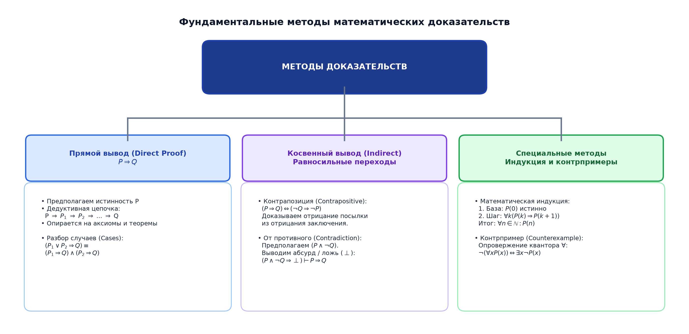
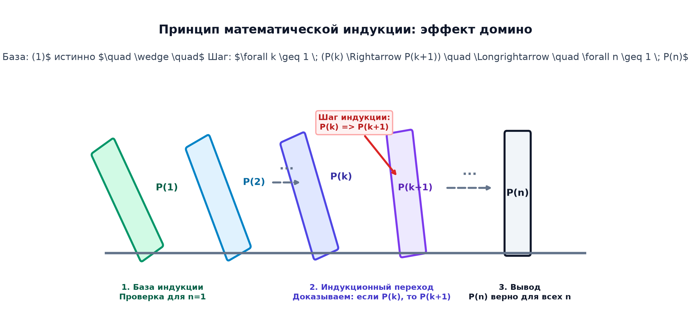
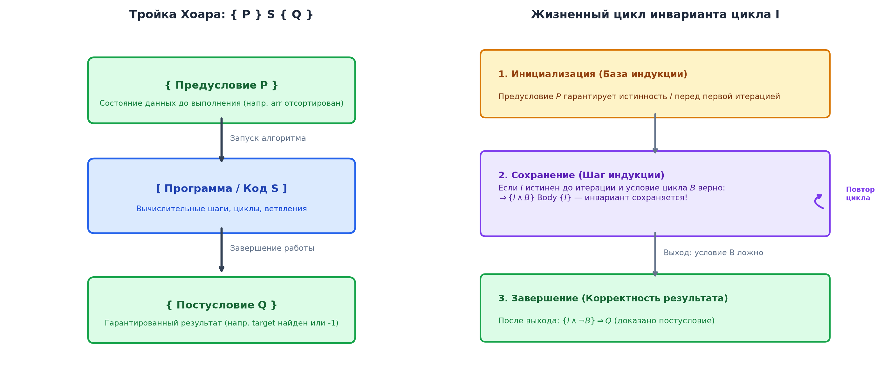

# 📝 Лекция 2: Предикаты, кванторы, методы доказательств, математическая индукция и инварианты программ

> **Дата:** `2026-09-12` (2-я неделя)  
> **Предмет:** Дискретная математика (1 семестр, 2026/27 уч. год)  
> **Преподаватель (лектор):** Константин Чухарев ([@Lipen](https://github.com/Lipen), Университет ИТМО)  
> **Модуль 1:** Множества и методы доказательств  
> **Материалы курса:** [github.com/Lipen/discrete-math-course](https://github.com/Lipen/discrete-math-course) • Главы книги: `m01`, `m03` • Слайды: `s1-lec02-predicates.pdf`

---

## 🧭 Навигация по лекции
1. [Введение: От атомарных высказываний к предикатам](#1-введение-от-атомарных-высказываний-к-предикатам)
2. [Предикаты и предметная область](#2-предикаты-и-предметная-область)
3. [Кванторы всеобщности и существования](#3-кванторы-всеобщности-и-существования)
4. [Отрицание кванторов (Законы де Моргана для предикатов)](#4-отрицание-кванторов)
5. [Порядок нескольких кванторов и смысловые различия](#5-порядок-нескольких-кванторов)
6. [Фундаментальные методы математических доказательств](#6-фундаментальные-методы-математических-доказательств)
   - [Прямое доказательство](#61-прямое-доказательство)
   - [Доказательство через контрапозицию](#62-доказательство-через-контрапозицию)
   - [Доказательство от противного (Reductio ad Absurdum)](#63-доказательство-от-противного-reductio-ad-absurdum)
   - [Разбор случаев и опровержение контрпримером](#64-разбор-случаев-и-контрпримеры)
7. [Принцип математической индукции](#7-принцип-математической-индукции)
   - [Эффект домино и визуализация](#71-эффект-домино-и-визуализация)
   - [Классическая индукция: суммы прогрессий и кубов](#72-классическая-индукция)
   - [Сильная индукция (Strong Induction)](#73-сильная-индукция-strong-induction)
   - [Принцип наименьшего числа (Well-Ordering Principle)](#74-принцип-наименьшего-числа-well-ordering-principle)
   - [Ловушки индукции: разбор софизма «Все лошади одного цвета»](#75-ловушки-индукции-разбор-софизма-все-лошади-одного-цвета)
8. [Связь с Computer Science: Тройки Хоара и инварианты циклов](#8-связь-с-computer-science-тройки-хоара-и-инварианты-циклов)
9. [Вопросы для самопроверки](#9-вопросы-для-самопроверки)

---

## 1. Введение: От атомарных высказываний к предикатам

В [[01. Лекция - Высказывания, связки, таблицы истинности, законы логики и следствие (2026-09-09)|Лекции 1]] мы определили *высказывание* как утверждение, которое безусловно истинно либо ложно (например, «7 — простое число»). 

Однако математика и программирование оперируют утверждениями, содержащими переменные:
* «Число $x$ делится на 5».
* «Массив `arr[0..n-1]` отсортирован по возрастанию».
* «$x^2 \ge 0$».

Истинность фразы «$x > 3$» невозможно оценить в вакууме — она зависит от значения переменной $x$. Чтобы строго описывать параметризованные свойства объектов, вводится аппарат **логики первого порядка (First-Order Logic)**: *предикаты* и *кванторы*.

---

## 2. Предикаты и предметная область

> [!definition] Определение: Предикат
> **Предикатом** $P(x_1, x_2, \dots, x_n)$ от $n$ переменных называется логическая функция, отображающая кортеж объектов в истинностное значение $\{\text{True}, \text{False}\}$.  
> Предикат можно понимать как «высказывание с пропусками (шаблонами)», которое становится высказыванием при подстановке конкретных значений аргументов.

> [!definition] Определение: Предметная область (Domain of Discourse)
> **Предметной областью** (универсумом, domain of discourse) называется множество $D$, из которого допустимо выбирать значения переменных $x \in D$.

> [!example] Наглядный пример: Превращение предиката в высказывание
> Пусть на универсуме целых чисел $\mathbb{Z}$ задан предикат $P(x) \equiv \text{«}x \text{ — четное число»}$ (логический шаблон с параметром):
> 
> * **Подстановка конкретного значения $x = 4$:**
>   $$P(x) \xrightarrow{x = 4} P(4) \equiv \text{«}4 \text{ — четное»} \quad \implies \quad \mathbf{True} \text{ (Истина)}$$
> * **Подстановка конкретного значения $x = 7$:**
>   $$P(x) \xrightarrow{x = 7} P(7) \equiv \text{«}7 \text{ — четное»} \quad \implies \quad \mathbf{False} \text{ (Ложь)}$$
> 
> *Вывод:* Сам по себе предикат $P(x)$ не является ни истинным, ни ложным. Он становится высказыванием с определенным значением истинности только после подстановки конкретного элемента $x \in D$.

### Свободные и связанные переменные
* **Свободная переменная:** переменная, значение которой не зафиксировано и не связано квантором. Выражение со свободными переменными является *предикатом*.
* **Связанная переменная:** переменная, над которой навешен квантор ($\forall x$ или $\exists x$). Связанная переменная играет роль фиктивного индекса (dummy variable), её имя можно заменить: $\forall x P(x) \equiv \forall y P(y)$.
* **Область действия квантора (Scope):** синтаксическая часть формулы, на которую распространяется действие квантора.

---

## 3. Кванторы всеобщности и существования

Для превращения предиката в высказывание не обязательно подставлять единичное значение: можно охарактеризовать поведение предиката на **всей** предметной области.

### 1. Квантор всеобщности ($\forall$, Universal Quantifier)
Символ $\forall$ происходит от первой буквы немецкого слова *Alle* (все) и читается как: *«для любого»*, *«для всякого»*, *«для каждого»*.

$$\forall x \in D \; P(x) \iff \text{предикат } P(x) \text{ истинен для абсолютно каждого элемента } x \in D.$$

Если предметная область конечна $D = \{d_1, d_2, \dots, d_n\}$, квантор всеобщности эквивалентен длинной **конъюнкции**:
$$\forall x P(x) \equiv P(d_1) \land P(d_2) \land \dots \land P(d_n).$$

### 2. Квантор существования ($\exists$, Existential Quantifier)
Символ $\exists$ происходит от первой буквы слова *Exist* (существовать) и читается как: *«существует»*, *«найдется хотя бы один»*.

$$\exists x \in D \; P(x) \iff \text{найдется хотя бы один объект } x \in D, \text{ для которого } P(x) \text{ истинен}.$$

Для конечной предметной области квантор существования эквивалентен длинной **дизъюнкции**:
$$\exists x P(x) \equiv P(d_1) \lor P(d_2) \lor \dots \lor P(d_n).$$

---

## 4. Отрицание кванторов

Правило проноса отрицания через кванторы представляет собой прямое обобщение [[01. Лекция - Высказывания, связки, таблицы истинности, законы логики и следствие (2026-09-09)#82-законы-де-моргана-доказательство-и-смысл|законов де Моргана]] на случай бесконечных конъюнкций и дизъюнкций.

> [!theorem] Теорема: Законы де Моргана для кванторов
> Для любого предиката $P(x)$ на области $D$ справедливы логические эквивалентности:
> 1. $\neg (\forall x P(x)) \equiv \exists x \, (\neg P(x))$
> 2. $\neg (\exists x P(x)) \equiv \forall x \, (\neg P(x))$

### Интуиция и практический смысл:
1. Опровергнуть утверждение «*Все студенты сдали сессию на отлично*» означает доказать, что «*Существует хотя бы один студент, не сдавший сессию на отлично*».
2. Опровергнуть утверждение «*В аудитории есть человек ростом 3 метра*» означает доказать, что «*Каждый человек в аудитории имеет рост, отличный от 3 метров*».

---

## 5. Порядок нескольких кванторов

Когда в высказывании участвуют несколько переменных, порядок одноименных кванторов можно менять, но **порядок разноименных кванторов менять категорически запрещено**:

$$\forall x \forall y P(x, y) \equiv \forall y \forall x P(x, y)$$
$$\exists x \exists y P(x, y) \equiv \exists y \exists x P(x, y)$$
$$\exists y \forall x P(x, y) \implies \forall x \exists y P(x, y), \quad \text{но в обратную сторону импликация ложна!}$$

> [!warning] Ловушка порядка кванторов: $\forall x \exists y$ против $\exists y \forall x$
> Рассмотрим предметную область людей $H$ и предикат $M(x, y)$: «$y$ является биологической матерью $x$».
> * **$\forall x \exists y M(x, y)$:** «Для каждого человека $x$ найдется женщина $y$, которая является его матерью». (ИСТИНА: у каждого свой родитель).
> * **$\exists y \forall x M(x, y)$:** «Существует единая женщина $y$, которая является матерью абсолютно всех людей на планете». (ЛОЖЬ).

### Пример из Математического анализа: Непрерывность
Различие между поточечной и равномерной непрерывностью функции $f: \mathbb{R} \to \mathbb{R}$ иллюстрирует критическую роль порядка кванторов:
* **Непрерывность в каждой точке:**
  $$\forall x \, \forall \varepsilon > 0 \, \exists \delta > 0 \, \forall x' \, (|x - x'| < \delta \implies |f(x) - f(x')| < \varepsilon)$$
  Здесь $\delta$ зависит и от $\varepsilon$, и от конкретной точки $x$.
* **Равномерная непрерывность на отрезке:**
  $$\forall \varepsilon > 0 \, \exists \delta > 0 \, \forall x \, \forall x' \, (|x - x'| < \delta \implies |f(x) - f(x')| < \varepsilon)$$
  Здесь $\delta$ выбирается один раз сразу для всех точек $x$.

---

## 6. Фундаментальные методы математических доказательств

Математическое доказательство — это конечная последовательность логически безупречных шагов, выводящая утверждение из аксиом и ранее доказанных теорем.


### 6.1. Прямое доказательство
Для доказательства импликации $P \implies Q$ предполагаем, что посылка $P$ истинна, и с помощью определений и алгебраических преобразований выводим истинность $Q$.

> [!example] Пример: Четность квадрата
> **Утверждение:** Если целое число $n$ четно, то $n^2$ также четно.  
> **Доказательство:**
> 1. По предположению, $n$ четно $\implies \exists k \in \mathbb{Z} : n = 2k$.
> 2. Возведем обе части в квадрат: $n^2 = (2k)^2 = 4k^2 = 2 \cdot (2k^2)$.
> 3. Обозначим $m = 2k^2 \in \mathbb{Z}$. Тогда $n^2 = 2m$, что по определению означает четность $n^2$. $\blacksquare$

### 6.2. Доказательство через контрапозицию
Основано на тавтологии закона контрапозиции:
$$(P \implies Q) \iff (\neg Q \implies \neg P).$$
Метод идеален, когда отрицание заключения $\neg Q$ дает гораздо более осязаемую алгебраическую форму, чем исходная посылка $P$.

> [!example] Пример через контрапозицию
> **Утверждение:** Если $n^2$ нечетно, то $n$ нечетно.  
> **Доказательство:**
> Докажем эквивалентное контрапозитивное утверждение: «Если $n$ четно, то $n^2$ четно».  
> Это утверждение уже строго доказано в пункте 6.1. Следовательно, исходное утверждение истинно. $\blacksquare$

### 6.3. Доказательство от противного (Reductio ad Absurdum)
Для доказательства утверждения $P$ предполагаем его отрицание $\neg P$ и дедуктивно приходим к логическому противоречию ($\bot$) вида $R \land \neg R$ или очевидному абсурду (например, $0 = 1$).

> [!theorem] Классическая теорема: Иррациональность $\sqrt{2}$
> Число $\sqrt{2}$ не является рациональным ($\sqrt{2} \notin \mathbb{Q}$).

> [!proof] Доказательство от противного
> 1. **Предположение от противного:** пусть $\sqrt{2} \in \mathbb{Q}$.
> 2. Тогда существуют взаимно простые целые числа $p, q \in \mathbb{Z}$ ($q \ne 0, \gcd(p, q) = 1$), такие что:
>    $$\sqrt{2} = \frac{p}{q}.$$
> 3. Возведем в квадрат: $2 = \frac{p^2}{q^2} \implies p^2 = 2q^2$.
> 4. Из этого следует, что $p^2$ четно $\implies$ по правилу контрапозиции число $p$ также четно: $p = 2k$ для некоторого $k \in \mathbb{Z}$.
> 5. Подставим $p = 2k$ в исходное уравнение:
>    $$(2k)^2 = 2q^2 \implies 4k^2 = 2q^2 \implies q^2 = 2k^2.$$
> 6. Следовательно, $q^2$ четно $\implies$ число $q$ также четно.
> 7. **Полученное противоречие:** оба числа $p$ и $q$ делятся на 2, что противоречит исходному условию несократимости дроби $\gcd(p, q) = 1$.  
> 8. Исходное предположение неверно, следовательно, $\sqrt{2}$ иррационально. $\blacksquare$

### 6.4. Разбор случаев и контрпримеры
* **Разбор случаев (Proof by Cases):** если условие распадается на исчерпывающее объединение вариантов ($P_1 \lor P_2 \lor \dots \lor P_k$), доказывается каждая ветка $P_i \implies Q$ отдельно (например, рассмотрение $x \ge 0$ и $x < 0$ при раскрытии модуля $|x|$).
* **Опровержение контрпримером:** чтобы опровергнуть квантор всеобщности $\forall x P(x)$, достаточно предъявить **ровно один** объект $x_0$, на котором предикат ложен: $P(x_0) = \text{False}$.
  * *Гипотеза:* «Все простые числа нечетные».
  * *Контрпример:* Число $2$ — простое и четное. Гипотеза опровергнута.

---

## 7. Принцип математической индукции

Математическая индукция — это фундамент дискретной математики, позволяющий доказать справедливость свойства $P(n)$ для **всех** натуральных чисел $n \ge n_0$.

### 7.1. Эффект домино и визуализация



> [!definition] Аксиома математической индукции
> Пусть $P(n)$ — предикат, зависящий от $n \in \mathbb{N}$. Если:
> 1. **База индукции (Base Case):** $P(n_0)$ истинно (первая костяшка домино падает).
> 2. **Индукционный переход (Inductive Step):** Для любого целого $k \ge n_0$ из предположения об истинности $P(k)$ (*индукционная гипотеза*) строго следует истинность $P(k+1)$:
>    $$\forall k \ge n_0 \; (P(k) \implies P(k+1)).$$
> 
> Тогда утверждение $P(n)$ истинно для всех целых чисел $n \ge n_0$.

### 7.2. Классическая индукция

> [!theorem] Теорема: Сумма первых $n$ натуральных чисел
> Для любого $n \ge 1$:
> $$\sum_{i=1}^n i = 1 + 2 + 3 + \dots + n = \frac{n(n+1)}{2}.$$

> [!proof] Доказательство
> 1. **База индукции ($n = 1$):**
>    $$\text{LHS} = 1, \quad \text{RHS} = \frac{1(1+1)}{2} = 1 \implies 1 = 1 \quad \text{(База доказана)}.$$
> 2. **Индукционный шаг:** Предположим, что формула верна для $n = k$:
>    $$1 + 2 + \dots + k = \frac{k(k+1)}{2} \quad \text{(Индукционная гипотеза)}.$$
>    Докажем формулу для $n = k + 1$:
>    $$1 + 2 + \dots + k + (k+1) \stackrel{?}{=} \frac{(k+1)((k+1)+1)}{2} = \frac{(k+1)(k+2)}{2}.$$
>    Преобразуем левую часть, используя гипотезу индукции:
>    $$(1 + 2 + \dots + k) + (k+1) = \frac{k(k+1)}{2} + (k+1) = (k+1) \left(\frac{k}{2} + 1\right) = \frac{(k+1)(k+2)}{2}.$$
>    Правая и левая части совпали. Шаг индукции доказан. По принципу математической индукции равенство верно для всех $n \ge 1$. $\blacksquare$

### 7.3. Сильная индукция (Strong Induction)

В обычной индукции для шага $k \to k+1$ используется только истинность непосредственно предшествующего утверждения $P(k)$. В **сильной индукции** мы опираемся на истинность **всех** предшествующих шагов от $n_0$ до $k$:

> [!definition] Схема сильной индукции
> 1. **База:** $P(n_0)$ истинно.
> 2. **Шаг:** $\forall k \ge n_0 \; \Big(\big(P(n_0) \land P(n_0+1) \land \dots \land P(k)\big) \implies P(k+1)\Big)$.
> 
> *Замечание:* Обычная и сильная индукция логически полностью эквивалентны. Сильная индукция незаменима в доказательствах, где рекурсия ветвится (например, разложение на множители или деревья).

> [!example] Пример: Разложение на простые множители
> **Теорема:** Любое целое число $n \ge 2$ представимо в виде произведения простых чисел.  
> *База ($n = 2$):* 2 — само по себе простое число.  
> *Шаг:* Пусть любое число $i \in [2, k]$ раскладывается на простые. Рассмотрим $k+1$:
> * Если $k+1$ простое — утверждение доказано.
> * Если $k+1$ составное — существуют числа $a, b$, такие что $k+1 = a \cdot b$, причем $2 \le a, b \le k$. По сильной гипотезе индукции оба числа $a$ и $b$ раскладываются на простые множители. Перемножение их разложений дает простое разложение для $k+1$. $\blacksquare$

### 7.4. Принцип наименьшего числа (Well-Ordering Principle)

> [!definition] Принцип вполне упорядоченности $\mathbb{N}$
> Всякое непустое подмножество натуральных чисел $S \subseteq \mathbb{N}$ ($S \ne \emptyset$) содержит наименьший элемент:
> $$\exists m \in S \; \forall x \in S \; (m \le x).$$

Принцип наименьшего числа часто применяется в доказательствах методом **минимального контрпримера**:
1. Предполагаем от противного, что теорема ложна.
2. Рассмотрим множество контрпримеров $C = \{n \in \mathbb{N} \mid \neg P(n)\}$.
3. По принципу наименьшего числа в $C$ обязан существовать минимальный контрпример $m = \min C$.
4. Показываем, что из свойств структуры конструируется еще меньший контрпример $m' < m$, что противоречит минимальности $m$.

### 7.5. Ловушки индукции: разбор софизма «Все лошади одного цвета»

Классический софизм Джорджа Пойа демонстрирует, почему индукционный переход обязан быть корректным для **всех без исключения** $k \ge n_0$:
* **Псевдо-утверждение:** «В любом табуне из $n$ лошадей все лошади имеют одинаковый цвет».
* **База ($n = 1$):** Табун из одной лошади очевидно одноцветен.
* **Ложный шаг ($k \to k+1$):** Возьмем табун из $k+1$ лошадей: $\{h_1, h_2, \dots, h_k, h_{k+1}\}$.
  * Группа из первых $k$ лошадей $\{h_1, \dots, h_k\}$ одноцветна по индукционному предположению (пусть они белые).
  * Группа из последних $k$ лошадей $\{h_2, \dots, h_{k+1}\}$ также одноцветна.
  * Логический обман: утверждается, что поскольку множества пересекаются по средним лошадям $h_2, \dots, h_k$, то лошадь $h_{k+1}$ того же цвета, что и $h_1$.
* **Где ошибка?** Шаг полностью ломается при переходе от $k=1$ к $k+1=2$!
  При $k=1$: первая группа $\{h_1\}$, вторая группа $\{h_2\}$. Их пересечение $\{h_1\} \cap \{h_2\} = \emptyset$ **пусто**, связующего звена нет!

---

## 8. Связь с Computer Science: Тройки Хоара и инварианты циклов

В теоретическом программировании доказательство корректности алгоритмов опирается на **логику Хоара (Hoare Logic)**.


> [!definition] Определение: Тройка Хоара
> Запись $\{P\} \; S \; \{Q\}$ означает: если перед выполнением участка кода $S$ истинно предусловие $P$, и программа $S$ завершает работу, то после ее завершения обязательно истинно постусловие $Q$.

### Инвариант цикла (Loop Invariant)
Инвариант цикла — это предикат $I$, который:
1. **Инициализация (База):** Истинен непосредственно перед входом в цикл.
2. **Сохранение (Шаг индукции):** Если он истинен перед началом итерации и условие цикла выполняется, то он гарантированно остается истинным после завершения тела цикла.
3. **Завершение (Результат):** Когда цикл завершается (условие цикла ложно), инвариант $I$ вместе с условием выхода гарантирует желаемое постусловие алгоритма.

```python
def binary_search(arr, target):
    # Предусловие: arr отсортирован по возрастанию
    left = 0
    right = len(arr) - 1
    
    # ИНВАРИАНТ ЦИКЛА I: если target есть в arr, то target находится в срезе arr[left..right]
    while left <= right:
        mid = (left + right) // 2
        if arr[mid] == target:
            return mid
        elif arr[mid] < target:
            left = mid + 1      # Сохранение инварианта: target точно правее mid
        else:
            right = mid - 1     # Сохранение инварианта: target точно левее mid
            
    # Завершение: left > right (диапазон пуст) ∧ I истинен => target отсутствует в массиве
    return -1
```

---

## 9. Вопросы для самопроверки

1. Запишите с помощью кванторов высказывание: *«В любом непустом списке есть хотя бы один четный элемент»*.
2. Постройте строгое логическое отрицание формулы $\forall x \, (P(x) \implies \exists y \, Q(x, y))$.
3. В чем заключается фундаментальная смысловая разница между утверждениями $\forall x \exists y \, (x + y = 0)$ и $\exists y \forall x \, (x + y = 0)$ на множестве вещественных чисел $\mathbb{R}$?
4. Докажите методом от противного, что сумма рационального и иррационального чисел всегда иррациональна.
5. С помощью метода математической индукции докажите формулу для суммы квадратов:
   $$1^2 + 2^2 + \dots + n^2 = \frac{n(n+1)(2n+1)}{6}.$$
6. Сформулируйте инвариант цикла для алгоритма нахождения максимального элемента в массиве.
