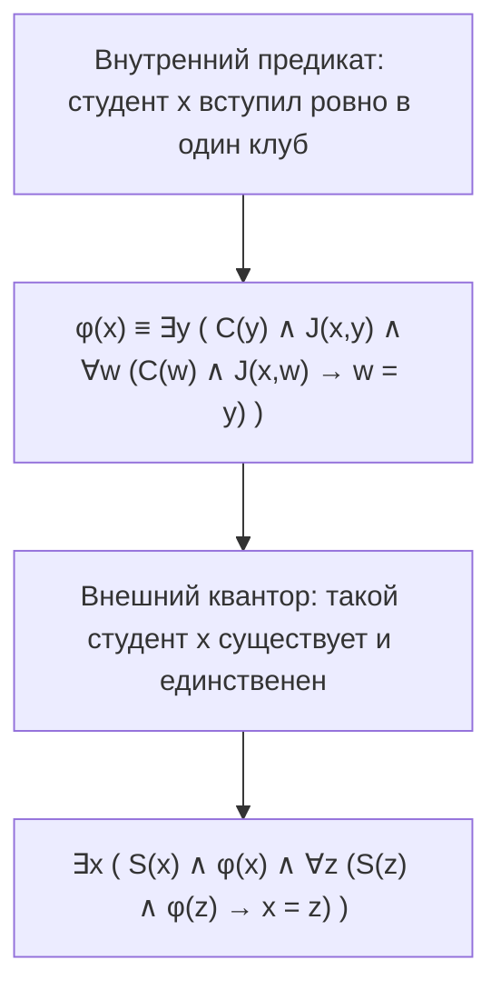
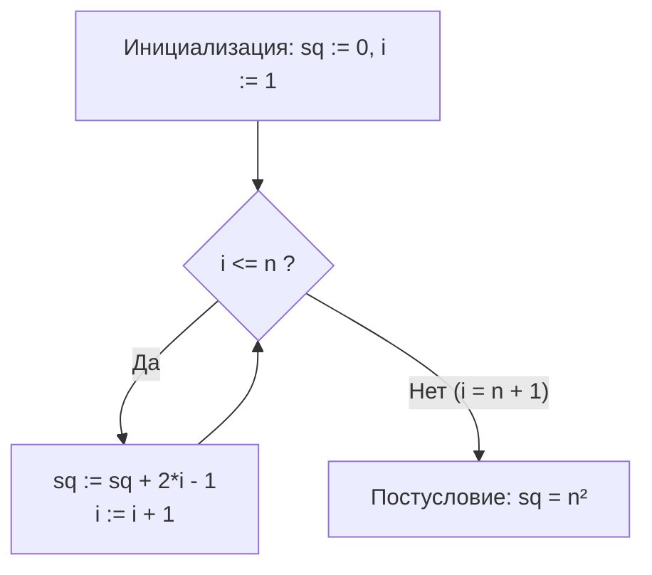

# 📝 Практика 2: Предикаты, кванторы, принцип наименьшего числа (WOP), индукция, ПНФ и тройки Хоара

> **Дата проведения:** `2026-09-16` (2-я неделя, среда, 13:30)  
> **Предмет:** Дискретная математика (1 семестр, 2026/27 уч. год)  
> **Поток:** Поток 2 (Software Engineering, Университет ИТМО)  
> **Связанная лекция:** [[02. Лекция - Предикаты, кванторы, методы доказательств, индукция и инварианты программ (2026-09-16)]]  
> **Материалы занятия:** Практический листок №1 (Задания 1.J – 1.X, разбор доски)

---

## 🧭 Навигация по занятию

1. [Семантика предикатов и влияние предметной области (Задание 1.J)](#1-семантика-предикатов-и-влияние-предметной-области-задание-1j)
2. [Квантор единственности ∃! и его формальное раскрытие (Задание 1.K)](#2-квантор-единственности-и-его-формальное-раскрытие-задание-1k)
3. [Принцип наименьшего числа (WOP) в дискретных задачах (Задание 1.L)](#3-принцип-наименьшего-числа-wop-в-дискретных-задачах-задание-1l)
4. [Математическая индукция: делимость и двумерные рекурсии](#4-математическая-индукция-делимость-и-двумерные-рекурсии)
   - [Задание 1.M: Индукция делимости степенных сумм](#задание-1m-индукция-делимости-степенных-сумм)
   - [Задание 1.N: Двумерное рекуррентное соотношение](#задание-1n-двумерное-рекуррентное-соотношение)
   - [Задание 1.O: Оценка гармонических чисел и группировка Коши](#задание-1o-оценка-гармонических-чисел-и-группировка-коши)
5. [Принцип Дирихле и скрытые посылки в логике (Задание 1.P)](#5-принцип-дирихле-и-скрытые-посылки-в-логике-задание-1p)
6. [Законы де Моргана, эквивалентности и формализация языка](#6-законы-де-моргана-эквивалентности-и-формализация-языка)
   - [Задание 1.Q: Отрицание конъюнктивных предикатов](#задание-1q-отрицание-конъюнктивных-предикатов)
   - [Задание 1.R: Доказательство эквивалентности предикатов](#задание-1r-доказательство-эквивалентности-предикатов)
   - [Задание 1.S: Формализация естественного языка через кванторы](#задание-1s-формализация-естественного-языка-через-кванторы)
   - [Задание 1.T': Поиск контр-модели и вакуумная истинность](#задание-1t-поиск-контр-модели-и-вакуумная-истинность)
7. [Свободные и связанные переменные, перестановка кванторов и ПНФ](#7-свободные-и-связанные-переменные-перестановка-кванторов-и-пнф)
   - [Задание 1.T: Сдвиг кванторов и порядок следования](#задание-1t-сдвиг-кванторов-и-порядок-следования)
   - [Задание 1.U: Анализ областей видимости и альфа-конверсия](#задание-1u-анализ-областей-видимости-и-альфа-конверсия)
   - [Задание 1.V: Алгоритм построения предварённой нормальной формы (ПНФ)](#задание-1v-алгоритм-построения-предварённой-нормальной-формы-пнф)
8. [Верификация программ: Тройки Хоара и инварианты циклов](#8-верификация-программ-тройки-хоара-и-инварианты-циклов)
   - [Задание 1.W: Корректность ветвления (Вычисление модуля)](#задание-1w-корректность-ветвления-вычисление-модуля)
   - [Задание 1.X: Инвариант цикла for (Алгоритм «Квадрат»)](#задание-1x-инвариант-цикла-for-алгоритм-квадрат)

---

## 1. Семантика предикатов и влияние предметной области (Задание 1.J)

> [!important] Определение предметной области (домена)
> Значение истинности формулы с кванторами существенно зависит от **носителя** (универсума / домена рассуждения $D$).
> Одно и то же синтаксическое выражение может быть тождественно истинным в одной числовой системе и ложным в другой.

В задании исследуется истинность пяти формул логики первого порядка на двух предметных областях: кольце целых чисел $D = \mathbb{Z}$ и поле вещественных чисел $D = \mathbb{R}$.

| № | Формула логики предикатов | Значение на $D = \mathbb{Z}$ | Значение на $D = \mathbb{R}$ | Математическое обоснование и контрпримеры |
| :-: | :--- | :-: | :-: | :--- |
| **1** | $\forall x \exists y (x + y = 0)$ | **True** | **True** | Для любого $x$ существует противоположный элемент $y = -x$. В обоих множествах операция вычитания замкнута. |
| **2** | $\forall x \exists y (x \cdot y = 1)$ | **False** | **False** | В $\mathbb{Z}$: для $x = 2$ обратный элемент $y = 1/2 \notin \mathbb{Z}$. В $\mathbb{R}$: для $x = 0$ не существует $y$, так как $0 \cdot y = 0 \ne 1$. |
| **3** | $\forall x \forall y \forall z \big(x(y+z) = xy + xz\big)$ | **True** | **True** | Свойство дистрибутивности умножения относительно сложения выполняется тождественно и в $\mathbb{Z}$, и в $\mathbb{R}$. |
| **4** | $\exists x \forall y (x + y = x)$ | **False** | **False** | Равенство $x + y = x$ в группе по сложению равносильно $y = 0$. Утверждение требует, чтобы **любое** $y$ равнялось нулю ($\forall y (y = 0)$), что ложно для обоих бесконечных множеств. *(Примечание: если бы формула имела вид $\exists x \forall y (x + y = y)$, она утверждала бы существование нейтрального элемента $x = 0$ и была бы True).* |
| **5** | $\exists x \forall y (x \cdot y = x)$ | **True** | **True** | Элемент $x = 0$ является поглощающим элементом (нулём кольца): для любого $y$ выполняется $0 \cdot y = 0$. |

---

## 2. Квантор единственности $\exists!$ и его формальное раскрытие (Задание 1.K)

### Постановка задачи
Записать на языке логики предикатов высказывание:  
> *«Ровно один студент вступил ровно в один клуб».*

Введем предикаты:
- $S(x)$ — «$x$ является студентом»;
- $C(y)$ — «$y$ является клубом» ($C$ — Club);
- $J(x, y)$ — «$x$ вступил в $y$» ($J$ — Joined).

### Решение через квантор единственности $\exists!$
Квантор $\exists!$ обозначает «существует и единственен»:
$$\exists! x \Big( S(x) \land \exists! y \big( C(y) \land J(x, y) \big) \Big)$$

> [!warning] Важное семантическое различие
> Формула $\exists! x \exists! y \big( S(x) \land C(y) \land J(x, y) \big)$ означает: *«Существует ровно одна пара $(x, y)$, где $x$ — студент, $y$ — клуб, и $x$ вступил в $y$»*.  
> Это исключает ситуацию, когда другие студенты вообще никуда не вступили. Вложенная же запись $\exists! x (S(x) \land \dots)$ допускает наличие других студентов, не вступивших ни в один клуб.

### Раскрытие $\exists!$ в базовом базисе $\{\forall, \exists, \land, \to, =\}$
Стандартная эквивалентность логики первого порядка для квантора единственности:
$$\exists! v. P(v) \iff \exists v \Big( P(v) \land \forall w \big( P(w) \to w = v \big) \Big)$$

Раскроем формулу пошагово изнутри наружу:



1. **Внутренняя часть $\varphi(x)$** (студент $x$ вступил в клуб $y$, и любой другой клуб $w$, в который он вступил, совпадает с $y$):
   $$\varphi(x) \equiv \exists y \Big( C(y) \land J(x, y) \land \forall w \big( C(w) \land J(x, w) \to w = y \big) \Big)$$

2. **Внешняя часть** (существует студент $x$, удовлетворяющий свойству $\varphi(x)$, и любой студент $z$, обладающий свойством $\varphi(z)$, совпадает с $x$):
   $$\exists x \Big( S(x) \land \varphi(x) \land \forall z \big( S(z) \land \varphi(z) \to x = z \big) \Big)$$

---

## 3. Принцип наименьшего числа (WOP) в дискретных задачах (Задание 1.L)

> [!info] Принцип вполне упорядоченности (Well Ordering Principle, WOP)
> Всякое непустое подмножество натуральных чисел $S \subseteq \mathbb{N}$ ($S \ne \varnothing$) содержит наименьший элемент:
> $$\exists c \in S.\, \forall x \in S \ (c \le x)$$
> Метод доказательства от противного с помощью WOP: предполагаем, что утверждение ложно, образуем множество контрпримеров $S \ne \varnothing$, берем минимальный контрпример $c = \min S$ и выводим противоречие, построив еще меньший контрпример $y < c$, принадлежащий $S$.

### Условие задачи о фужерах
Показать с помощью WOP, что на любое число персон $3n \ge 60$ ($n \in \mathbb{N}$) можно набрать одноразовых фужеров без остатка, если в продаже имеются только упаковки по **15** и по **18** штук.

### Строгое доказательство методом WOP

1. **Формализация:**
   - Предметная область: $D = \{3n \mid n \in \mathbb{N} \land 3n \ge 60\} = \{60, 63, 66, 69, 72, \dots\}$.
   - Предикат возможности составления:
     $$P(x) \equiv \exists m, k \in \mathbb{Z}_{\ge 0}.\, 15m + 18k = x$$
   - Отрицание предиката:
     $$\neg P(x) \equiv \forall m, k \in \mathbb{Z}_{\ge 0}.\, 15m + 18k \ne x$$

2. **Предположение от противного:**
   Пусть утверждение неверно, то есть множество контрпримеров непусто:
   $$S = \{x \in D \mid \neg P(x)\} = \{3n \mid n \in \mathbb{N} \land 3n \ge 60 \land \neg P(3n)\} \ne \varnothing$$

3. **Выбор минимального контрпримера по WOP:**
   Поскольку $S \ne \varnothing$ и $S \subseteq \mathbb{N}$, по принципу наименьшего числа существует:
   $$c = \min S \implies c \in S \quad \text{и} \quad \forall y \in D \ (y < c \implies y \notin S)$$
   Следовательно, для всех $y \in D$, меньших $c$, предикат $P(y)$ истинен: $y = 15m + 18k$.

4. **Анализ значения минимального контрпримера $c$:**
   - **Случай 1 ($c = 60$):**
     $$60 = 15 \cdot 4 + 18 \cdot 0$$
     Здесь $m = 4 \ge 0, k = 0 \ge 0$. Следовательно, $P(60)$ истинно, то есть $60 \notin S$.  
     Получаем противоречие с условием $c \in S$.

   - **Случай 2 ($c > 60$):**
     Так как $c \in D$, число $c$ делится на 3. Рассмотрим число:
     $$y = c - 3$$
     Поскольку $c > 60$ и $c \mathrel{\vdots} 3$, число $y \ge 60$ и также делится на 3. Значит, $y \in D$.  
     При этом $y < c$. В силу минимальности $c$ как контрпримера, число $y \notin S$, то есть оно представимо в виде:
     $$y = 15m + 18k \quad (m, k \ge 0)$$
     Тогда для $c$ получаем:
     $$c = y + 3 = 15m + 18k + 3$$

     Разберем возможные значения коэффициента $m$:
     - **Подслучай 2а ($m > 0$, то есть $m \ge 1$):**
       Перегруппируем слагаемые, забрав одну упаковку по 15 и заменив ее на упаковку по 18:
       $$c = 15(m - 1) + 15 + 18k + 3 = 15(m - 1) + 18k + 18 = 15(m - 1) + 18(k + 1)$$
       Так как $m \ge 1$, то $m - 1 \ge 0$, а $k + 1 \ge 1 \ge 0$.  
       Мы получили корректное неотрицательное целочисленное разложение для $c$.  
       Следовательно, $P(c)$ истинно $\implies c \notin S$. Противоречие с $c \in S$!

     - **Подслучай 2б ($m = 0$):**
       Тогда $y = 18k$. Так как $y \ge 60$, находим ограничение на $k$:
       $$18 \cdot 3 = 54 < 60 \implies k \ge 4$$
       Рассмотрим варианты для $k$:
       - Если $k = 4$:
         $$c = 18 \cdot 4 + 3 = 72 + 3 = 75 = 15 \cdot 5 + 18 \cdot 0$$
         Получили представление при $m' = 5, k' = 0 \implies P(75)$ истинно $\implies c \notin S$. Противоречие!
       - Если $k > 4$, представим $k = 4 + t$, где $t \in \mathbb{N}$ ($t \ge 1$):
         $$c = 18(4 + t) + 3 = (18 \cdot 4 + 3) + 18t = 75 + 18t = 15 \cdot 5 + 18 \cdot t$$
         Так как $5 \ge 0$ и $t \ge 0$, число $c$ снова представимо $\implies P(c)$ истинно $\implies c \notin S$. Противоречие!

5. **Заключение:**
   Во всех возможных случаях получено противоречие с утверждением $c \in S$.  
   Следовательно, исходное предположение неверно, множество контрпримеров пусто: $S = \varnothing$.  
   Для любого $3n \ge 60$ требуемое количество фужеров набирается без остатка. $\blacksquare$

---

## 4. Математическая индукция: делимость и двумерные рекурсии

### Задание 1.M: Индукция делимости степенных сумм
**Условие:** Доказать, что для любого $n \in \mathbb{N}$ ($n \ge 1$) выражение $3^{3n+2} + 2^{4n+1}$ кратно 11.

#### Доказательство методом математической индукции
1. **База индукции ($n = 1$):**
   $$3^{3(1)+2} + 2^{4(1)+1} = 3^5 + 2^5 = 243 + 32 = 275$$
   $$275 = 11 \cdot 25 \implies 275 \mathrel{\vdots} 11$$
   База доказана.

2. **Индукционное предположение:**  
   Пусть для $n = k$ утверждение верно:
   $$3^{3k+2} + 2^{4k+1} = 11 \cdot M \quad (M \in \mathbb{Z})$$

3. **Индукционный переход ($n = k + 1$):**  
   Рассмотрим выражение при $n = k + 1$:
   $$3^{3(k+1)+2} + 2^{4(k+1)+1} = 3^{3k+5} + 2^{4k+5} = 3^3 \cdot 3^{3k+2} + 2^4 \cdot 2^{4k+1} = 27 \cdot 3^{3k+2} + 16 \cdot 2^{4k+1}$$
   Представим коэффициент $27$ как $16 + 11$:
   $$27 \cdot 3^{3k+2} + 16 \cdot 2^{4k+1} = (16 + 11) \cdot 3^{3k+2} + 16 \cdot 2^{4k+1}$$
   $$= 11 \cdot 3^{3k+2} + 16 \cdot \underbrace{\big(3^{3k+2} + 2^{4k+1}\big)}_{= 11M \text{ по предположению}}$$
   $$= 11 \cdot 3^{3k+2} + 16 \cdot 11M = 11 \cdot \big(3^{3k+2} + 16M\big)$$
   Поскольку $3^{3k+2} + 16M \in \mathbb{Z}$, все выражение делится на 11. Переход доказан.  
   Следовательно, по принципу математической индукции делимость верна для всех $n \in \mathbb{N}$. $\blacksquare$

> [!tip] Альтернативное решение через кольцо вычетов $\mathbb{Z}_{11}$
> $$3^{3n+2} = 3^2 \cdot (3^3)^n = 9 \cdot 27^n \equiv 9 \cdot 5^n \pmod{11}$$
> $$2^{4n+1} = 2^1 \cdot (2^4)^n = 2 \cdot 16^n \equiv 2 \cdot 5^n \pmod{11}$$
> $$9 \cdot 5^n + 2 \cdot 5^n = (9 + 2) \cdot 5^n = 11 \cdot 5^n \equiv 0 \pmod{11}$$

---

### Задание 1.N: Двумерное рекуррентное соотношение
**Условие:** Последовательность $a_{m,n}$ задана рекуррентно для неотрицательных целых чисел $m, n \ge 0$:
$$\begin{cases}
a_{m,n} = a_{m-1,n} + 1, & n = 0, \ m > 0 \\
a_{m,n} = a_{m,n-1} + n, & n > 0 \\
a_{0,0} = 0
\end{cases}$$
Доказать, что $a_{m,n} = m + \frac{n(n+1)}{2}$ для всех пар $(m, n) \in \mathbb{Z}_{\ge 0}^2$.

#### Доказательство
1. **Шаг 1: Вычисление базовой строки $a_{m,0}$:**
   По условию, при $n = 0$: $a_{m,0} = a_{m-1,0} + 1$.
   Так как $a_{0,0} = 0$, индукцией по $m$ тривиально получаем:
   $$a_{m,0} = a_{0,0} + \underbrace{1 + 1 + \dots + 1}_{m \text{ раз}} = m$$

2. **Шаг 2: Индукция по второму аргументу $n$ при фиксированном $m$:**
   Зафиксируем произвольное $m \ge 0$. Докажем утверждение $P(n) \equiv \big(a_{m,n} = m + \frac{n(n+1)}{2}\big)$ индукцией по $n$:
   - **База ($n = 0$):**
     $$a_{m,0} = m = m + \frac{0 \cdot (0 + 1)}{2}$$
     Равенство справедливо.
   - **Индукционное предположение:** пусть для $n = k \ge 0$ верно:
     $$a_{m,k} = m + \frac{k(k+1)}{2}$$
   - **Индукционный переход ($n = k + 1$):**
     Используем второе рекуррентное правило для $n = k + 1 > 0$:
     $$a_{m,k+1} = a_{m,k} + (k + 1)$$
     Подставляем индукционное предположение вместо $a_{m,k}$:
     $$a_{m,k+1} = \left(m + \frac{k(k+1)}{2}\right) + (k + 1) = m + (k + 1)\left(\frac{k}{2} + 1\right) = m + (k + 1)\frac{k + 2}{2} = m + \frac{(k+1)(k+2)}{2}$$
     Полученная формула в точности соответствует общему виду $m + \frac{n(n+1)}{2}$ при подстановке $n = k + 1$.  
   Индукционный переход доказан. Формула справедлива для всех $m, n \ge 0$. $\blacksquare$

---

### Задание 1.O: Оценка гармонических чисел и группировка Коши
**Условие:** Пусть $H_t = \sum_{i=1}^t \frac{1}{i} = 1 + \frac{1}{2} + \frac{1}{3} + \dots + \frac{1}{t}$ — $t$-е гармоническое число.  
Доказать, что для любого $n \in \mathbb{Z}_{\ge 0}$:
$$H_{2^n} \ge 1 + \frac{n}{2}$$

#### Доказательство по индукции
1. **База ($n = 0$):**
   $$H_{2^0} = H_1 = 1 \ge 1 + \frac{0}{2} = 1 \quad (\text{верно})$$
2. **Индукционный переход ($n \to n + 1$):**  
   Предположим, что $H_{2^k} \ge 1 + \frac{k}{2}$. Рассмотрим $H_{2^{k+1}}$:
   $$H_{2^{k+1}} = \sum_{i=1}^{2^{k+1}} \frac{1}{i} = \sum_{i=1}^{2^k} \frac{1}{i} + \sum_{i=2^k+1}^{2^{k+1}} \frac{1}{i} = H_{2^k} + \left(\frac{1}{2^k + 1} + \frac{1}{2^k + 2} + \dots + \frac{1}{2^{k+1}}\right)$$
   Оценим вторую сумму. В ней содержится ровно $2^{k+1} - 2^k = 2^k$ слагаемых, и каждое слагаемое не меньше наименьшего, то есть $\frac{1}{2^{k+1}}$:
   $$\sum_{i=2^k+1}^{2^{k+1}} \frac{1}{i} \ge \underbrace{\frac{1}{2^{k+1}} + \frac{1}{2^{k+1}} + \dots + \frac{1}{2^{k+1}}}_{2^k \text{ слагаемых}} = 2^k \cdot \frac{1}{2^{k+1}} = \frac{2^k}{2 \cdot 2^k} = \frac{1}{2}$$
   Тогда:
   $$H_{2^{k+1}} \ge H_{2^k} + \frac{1}{2} \ge \left(1 + \frac{k}{2}\right) + \frac{1}{2} = 1 + \frac{k+1}{2}$$
   Переход доказан. Из неравенства напрямую следует расходимость гармонического ряда при $n \to \infty$. $\blacksquare$

---

## 5. Принцип Дирихле и скрытые посылки в логике (Задание 1.P)

### Условие задачи
Доказать:
$$\exists x \in \mathbb{N}.\, \exists y \in \mathbb{N}.\, \big(2^x - 2^y \mathrel{\vdots} 2025\big)$$
*Вопрос: Где здесь посылка?*

### Доказательство через принцип Дирихле (Pigeonhole Principle)
1. Рассмотрим набор из $2026$ последовательных степеней двойки:
   $$A = \big\{2^1, 2^2, 2^3, \dots, 2^{2026}\big\}$$
2. При делении целого числа на $2025$ возможно ровно $2025$ различных остатков:
   $$R = \{0, 1, 2, \dots, 2024\}$$
3. Сопоставим каждому числу $2^k \in A$ его остаток $r_k = 2^k \bmod 2025$.  
   У нас имеется **2026 элементов** («кроликов») и **2025 возможных остатков** («клеток»).
4. По принципу Дирихле найдутся хотя бы два различных показателя $x, y \in \{1, 2, \dots, 2026\}$ ($x > y$), дающие одинаковый остаток при делении на 2025:
   $$2^x \equiv 2^y \pmod{2025} \iff 2^x - 2^y \equiv 0 \pmod{2025} \iff \big(2^x - 2^y\big) \mathrel{\vdots} 2025$$
   Утверждение существования доказано. $\blacksquare$

> [!important] Логический анализ: «Где здесь посылка?»
> Формально утверждение записано как экзистенциальное суждение без явной импликации.  
> **Скрытая посылка (фоновая теория / аксиоматика):**
> 1. Конечность множества остатков вычетов $\mathbb{Z}_{2025}$ ($|\mathbb{Z}_{2025}| = 2025$).
> 2. Бесконечность (или мощность $\ge 2026$) предметной области натуральных чисел $\mathbb{N}$.
> Без аксиомы мощности универсума принцип Дирихле неприменим.

---

## 6. Законы де Моргана, эквивалентности и формализация языка

### Задание 1.Q: Отрицание конъюнктивных предикатов
**Условие:** Пусть $P(x)$ = «$x$ высокий», $Q(x)$ = «$x$ толстый».  
Прочитайте высказывание $(\forall x)\big(P(x) \land Q(x)\big)$ и найдите его строгое отрицание в символьной и вербальной форме.

- **Исходное высказывание:** «Каждый человек является одновременно высоким и толстым».
- **Отрицание по правилам логики первого порядка:**
  $$\neg (\forall x)\big(P(x) \land Q(x)\big) \equiv (\exists x)\neg \big(P(x) \land Q(x)\big) \equiv (\exists x)\big(\neg P(x) \lor \neg Q(x)\big)$$
- **Анализ предложенных формулировок:**
  - (а) *«Найдется некто короткий и толстый»* $\equiv \exists x (\neg P(x) \land Q(x))$ — неверно (конъюнкция сильнее дизъюнкции).
  - (б) *«Нет никого высокого и худого»* $\equiv \neg \exists x (P(x) \land \neg Q(x))$ — неверно.
  - (в) *«Найдется некто короткий или худой»* $\equiv \exists x (\neg P(x) \lor \neg Q(x))$ — **ВЕРНО**.

---

### Задание 1.R: Доказательство эквивалентности предикатов
**Условие:** Показать эквивалентность:
$$\forall x (x \in B \to x \notin A) \equiv \neg (\exists x \in A.\, x \in B)$$

#### Цепочка эквивалентных преобразований
$$\forall x (x \in B \to x \notin A)$$
1. Избавляемся от импликации ($p \to q \equiv \neg p \lor q$):
   $$\equiv \forall x (x \notin B \lor x \notin A)$$
2. Применяем закон де Моргана к бескванторной части ($\neg p \lor \neg q \equiv \neg (p \land q)$):
   $$\equiv \forall x \neg (x \in B \land x \in A)$$
3. Применяем отрицание квантора существования ($\forall x \neg \Phi(x) \equiv \neg \exists x \Phi(x)$):
   $$\equiv \neg \exists x (x \in A \land x \in B)$$
4. Сворачиваем ограниченный квантор существования:
   $$\equiv \neg (\exists x \in A.\, x \in B) \quad \blacksquare$$

> [!note] Теоретико-множественный смысл
> Обе части формулы утверждают, что множества $A$ и $B$ **не пересекаются**: $A \cap B = \varnothing$.

---

### Задание 1.S: Формализация естественного языка через кванторы
Введем предикаты: $P(x)$ — «$x$ приятная вещь», $S(x)$ — «$x$ безопасная вещь», $D(x) = \neg S(x)$ — «$x$ опасная вещь».

- **a) «Если что-то приятно и все приятные вещи безопасны, то что-нибудь безопасно»:**
  $$\Big(\exists x P(x) \land \forall y \big(P(y) \to S(y)\big)\Big) \implies \exists z S(z)$$
- **b) «Если что-то приятно и некоторые приятные вещи опасны, то что-нибудь опасно»:**
  $$\Big(\exists x P(x) \land \exists y \big(P(y) \land D(y)\big)\Big) \implies \exists z D(z)$$
- **c) «Если что-то приятно и все приятные вещи безопасны, то это безопасно»:**
  Слово «это» относится к конкретному рассматриваемому объекту $x$:
  $$\forall x \Big( \big(P(x) \land \forall y (P(y) \to S(y))\big) \implies S(x) \Big)$$
- **d) «Если что-то приятно и некоторые приятные вещи опасны, то это опасно»:**
  $$\forall x \Big( \big(P(x) \land \exists y (P(y) \land D(y))\big) \implies D(x) \Big)$$
  *(Примечание: данное утверждение логически ложно / необщезначимо, так как из опасности некоторых приятных вещей не следует опасность любого конкретного приятного $x$).*
- **e) «Только горы являются золотыми горами»:**  
  Пусть $M(x)$ — «$x$ — гора», $G(x)$ — «$x$ — золотая гора».  
  Конструкция «Только $A$ являются $B$» логически эквивалентна «Всякий $B$ является $A$» ($B \subseteq A$):
  $$\forall x \big(G(x) \to M(x)\big)$$

---

### Задание 1.T': Поиск контр-модели и вакуумная истинность
**Условие:** Предложить носитель из 3 элементов, на котором истинно высказывание:  
> *«Всякое четное целое число одновременно и больше нуля, и меньше нуля».*

Формальная запись:
$$\forall x \in D \Big( (x \in \mathbb{Z} \land x \mathrel{\vdots} 2) \to (x > 0 \land x < 0) \Big)$$

- Заключение импликации $(x > 0 \land x < 0)$ тождественно ложно ($\text{False}$) для любого числа.
- Импликация $A \to \text{False}$ истинна тогда и только тогда, когда посылка $A$ **ложна** ($A = \text{False}$).
- Следовательно, посылка $(x \in \mathbb{Z} \land x \mathrel{\vdots} 2)$ должна быть ложной для **всех** элементов предметной области $D$.
- В качестве носителя $D$ из 3 элементов достаточно выбрать любые элементы, среди которых нет ни одного четного целого числа:
  $$D = \{1, 3, 5\} \quad \text{или} \quad D = \{1, \pi, \text{"ИТМО"}\}$$
- Для любого $x \in D$ посылка ложна $\implies$ импликация $\text{False} \to \text{False}$ дает $\text{True}$.  
  Высказывание **вакуумно истинно** (Vacuously True).

---

## 7. Свободные и связанные переменные, перестановка кванторов и ПНФ

### Задание 1.T: Сдвиг кванторов и порядок следования

1. **Вынесение $\exists y$ наружу:**
   $$\text{Исходная:} \quad \forall x \big(S(x) \to \exists y (L(y) \land Z(x,y))\big)$$
   $$\text{С вынесением:} \quad \exists y \forall x \big(S(x) \to (L(y) \land Z(x,y))\big)$$
   - *В чем различие:* В исходной формуле $y$ выбирается **после** $x$ (для каждого студента $x$ может быть свой ментор $y$, то есть $y = f(x)$). В формуле с вынесением квантора наружу утверждается существование **одного единого** $y$, общего сразу для всех студентов $x$.  
   - Вынесение квантора существования из-под квантора всеобщности усиливает утверждение: $\exists y \forall x \Phi \implies \forall x \exists y \Phi$, но обратная импликация в общем случае неверна!

2. **Занесение $\exists y$ внутрь импликации:**
   $$\forall x \exists y \big(P(x,y) \to P(y,x)\big)$$
   При занесении квантора в антецедент импликации он меняет свой тип на двойственный (так как $A \to B \equiv \neg A \lor B$):
   $$\exists y (A(y) \to B(y)) \equiv \big(\forall y A(y) \to \exists y B(y)\big)$$
   Это коренным образом меняет смысл утверждения.

---

### Задание 1.U: Анализ областей видимости и альфа-конверсия

| Формула | Свободные переменные | Связанные переменные | Области действия кванторов | Пояснение и устранение коллизий |
| :--- | :---: | :---: | :--- | :--- |
| **1) $\forall x (P(x,y)) \to \exists x (R(x,y))$** | $y$ | $x$ (в обоих вхождениях) | Первый $\forall x$ действует на $P(x,y)$; второй $\exists x$ действует на $R(x,y)$. | Переменная $x$ затенена дважды в независимых подформулах. Альфа-конверсия: $\forall x_1 (P(x_1, y)) \to \exists x_2 (R(x_2, y))$. |
| **2) $\forall x \big(P(x,y) \to \forall y (Q(y))\big)$** | $y$ (в $P(x,y)$) | $x$ (связан $\forall x$), $y$ (в $Q(y)$ связана $\forall y$) | $\forall x$ охватывает всю формулу; $\forall y$ охватывает только $Q(y)$. | Буква $y$ используется в двух разных ролях. Альфа-конверсия: $\forall x \big(P(x,y) \to \forall z Q(z)\big)$. |
| **3) $\exists x \big(T(x) \land \forall y (P(x,y) \to R(y,z))\big) \lor \forall x. Z(x)$** | $z$ | $x$ (связан $\exists x$ и $\forall x$), $y$ (связан $\forall y$) | $\exists x$ охватывает левый дизъюнкт; $\forall y$ охватывает импликацию; второй $\forall x$ охватывает $Z(x)$. | Формула **не замкнута**, так как $z$ свободна. |

> [!question] Почему переименование свободного вхождения переменной недопустимо?
> Свободная переменная является **внешним параметром** предиката (как аргумент функции $f(z)$). Ее значение задается извне оценкой модели. Если заменить свободную $z$ на $w$, формула начнет зависеть от другого параметра и изменит свое логическое значение в модели. В то же время переименование связанной переменной (альфа-конверсия) внутри области действия квантора не меняет семантику формулы.

#### Построение инверсии (отрицания) формулы (3):
$$\neg \Big[ \exists x \big(T(x) \land \forall y (P(x,y) \to R(y,z))\big) \lor \forall x. Z(x) \Big]$$
Применяем де Морган для дизъюнкции:
$$\equiv \neg \exists x \big(T(x) \land \forall y (P(x,y) \to R(y,z))\big) \land \neg \forall x. Z(x)$$
Проталкиваем отрицания сквозь кванторы:
$$\equiv \forall x \neg \big(T(x) \land \forall y (P(x,y) \to R(y,z))\big) \land \exists x. \neg Z(x)$$
$$\equiv \forall x \Big(\neg T(x) \lor \exists y \big(P(x,y) \land \neg R(y,z)\big)\Big) \land \exists x. \neg Z(x)$$

---

### Задание 1.V: Алгоритм построения предварённой нормальной формы (ПНФ)

> [!important] Определение ПНФ (Prenex Normal Form)
> Формула находится в **предварённой нормальной форме**, если все кванторы вынесены в начало формулы (префикс), а за ними следует бескванторная часть (матрица):
> $$Q_1 x_1 Q_2 x_2 \dots Q_k x_k \ M(x_1, x_2, \dots, x_k)$$
> где $Q_i \in \{\forall, \exists\}$, а матрица $M$ содержит только связки $\{\land, \lor, \neg\}$.

**Дана формула:**
$$\forall x \Big( P(x) \to \exists y \big( Q(x,y) \land \neg \forall z. R(z,x) \big) \Big)$$

#### Пошаговый алгоритм:

1. **Шаг 1: Устранение импликаций ($A \to B \equiv \neg A \lor B$):**
   $$\forall x \Big( \neg P(x) \lor \exists y \big( Q(x,y) \land \neg \forall z. R(z,x) \big) \Big)$$

2. **Шаг 2: Внесение отрицаний непосредственно к атомарным формулам:**
   Преобразуем $\neg \forall z. R(z,x) \equiv \exists z \neg R(z,x)$:
   $$\forall x \Big( \neg P(x) \lor \exists y \big( Q(x,y) \land \exists z \neg R(z,x) \big) \Big)$$

3. **Шаг 3: Переименование связанных переменных (стандартизация):**
   Все кванторные переменные ($x, y, z$) уже имеют различные имена, коллизий нет.

4. **Шаг 4: Вынесение кванторов в префикс:**
   - Переменная $z$ не входит свободно в $Q(x,y)$, поэтому:
     $$Q(x,y) \land \exists z \neg R(z,x) \equiv \exists z \big(Q(x,y) \land \neg R(z,x)\big)$$
   - Подставляем:
     $$\forall x \Big( \neg P(x) \lor \exists y \exists z \big( Q(x,y) \land \neg R(z,x) \big) \Big)$$
   - Переменные $y$ и $z$ не входят в $\neg P(x)$, поэтому выносим $\exists y \exists z$ из дизъюнкции:
     $$\neg P(x) \lor \exists y \exists z \Phi(x,y,z) \equiv \exists y \exists z \big(\neg P(x) \lor \Phi(x,y,z)\big)$$

5. **Результат в ПНФ:**
   $$\forall x \exists y \exists z \Big( \neg P(x) \lor \big( Q(x,y) \land \neg R(z,x) \big) \Big)$$
   *Кванторный префикс:* $\forall x \exists y \exists z$  
   *Бескванторная матрица:* $\neg P(x) \lor \big( Q(x,y) \land \neg R(z,x) \big)$  
   *(Или в эквивалентной форме с импликацией: $\forall x \exists y \exists z \big( P(x) \to (Q(x,y) \land \neg R(z,x)) \big)$).*

---

## 8. Верификация программ: Тройки Хоара и инварианты циклов

> [!abstract] Тройка Хоара (Hoare Triple)
> Запись $\{P\} A \{Q\}$ означает: если перед выполнением программы $A$ истинно предусловие $P$ и программа $A$ завершает свою работу, то после ее завершения истинно постусловие $Q$.

---

### Задание 1.W: Корректность ветвления (Вычисление модуля)

**Условие:** Доказать частичную корректность алгоритма вычисления абсолютного значения:
- Предусловие $P$: $\{x = x_1 \text{ — действительное число}\}$
- Программа $A$:
  ```pascal
  if x >= 0 then
      abs := x;
  else
      abs := -x;
  ```
- Постусловие $Q$: $\{abs = |x_1|\}$

#### Доказательство через правило Хоара для условного оператора
Правило ветвления гласит:
$$\frac{\{P \land B\} S_1 \{Q\}, \quad \{P \land \neg B\} S_2 \{Q\}}{\{P\} \text{ if } B \text{ then } S_1 \text{ else } S_2 \{Q\}}$$

1. **Ветка Then ($B \equiv x \ge 0$):**
   - Предусловие: $x = x_1 \land x \ge 0 \implies x_1 \ge 0$.
   - Оператор $S_1$: `abs := x`.
   - По аксиоме присваивания: после выполнения $abs = x = x_1$.
   - По определению модуля для неотрицательных чисел: если $x_1 \ge 0$, то $|x_1| = x_1$.
   - Следовательно, $abs = |x_1|$ выполняется. Тройка $\{P \land B\} S_1 \{Q\}$ верна.

2. **Ветка Else ($\neg B \equiv x < 0$):**
   - Предусловие: $x = x_1 \land x < 0 \implies x_1 < 0$.
   - Оператор $S_2$: `abs := -x`.
   - По аксиоме присваивания: после выполнения $abs = -x = -x_1$.
   - По определению модуля для отрицательных чисел: если $x_1 < 0$, то $|x_1| = -x_1$.
   - Следовательно, $abs = |x_1|$ выполняется. Тройка $\{P \land \neg B\} S_2 \{Q\}$ верна.

Обе предпосылки правила ветвления доказаны. Алгоритм корректен. $\blacksquare$

---

### Задание 1.X: Инвариант цикла for (Алгоритм «Квадрат»)

**Условие:** Доказать корректность алгоритма вычисления квадрата числа через сумму первых $n$ нечетных чисел:
- Предусловие $P$: $\{n = n_1 \text{ — натуральное число}, n_1 \ge 1\}$
- Программа:
  ```pascal
  sq := 0;
  for i := 1 to n do
      sq := sq + 2*i - 1;
  ```
- Постусловие $Q$: $\{sq = n_1^2\}$

#### Теоретическая база алгоритма
Известное тождество для суммы первых $n$ нечетных чисел:
$$\sum_{i=1}^n (2i - 1) = 1 + 3 + 5 + \dots + (2n - 1) = n^2$$

#### Формулировка инварианта цикла
Инвариант цикла $Inv(i)$ — предикат, истинный перед началом каждой $i$-й итерации цикла ($1 \le i \le n + 1$):
$$Inv(i) \equiv \Big( sq = (i - 1)^2 \Big) \land \big(1 \le i \le n + 1\big)$$



#### Доказательство шагов инварианта:

1. **Инициализация (Initialization / База индукции):**
   Перед входом в цикл выполнено присваивание `sq := 0`, а счетчик `i := 1`.
   Проверяем инвариант при $i = 1$:
   $$sq = (1 - 1)^2 = 0^2 = 0$$
   Условие $sq = (i - 1)^2$ истинно. $Inv(1)$ выполняется.

2. **Сохранение (Maintenance / Индукционный переход):**
   Пусть инвариант $Inv(i)$ истинен перед началом $i$-й итерации, то есть $sq = (i - 1)^2$ и $i \le n$.
   Выполняется тело цикла:
   $$sq_{\text{новое}} = sq + (2i - 1)$$
   Подставляем старое значение $sq$:
   $$sq_{\text{новое}} = (i - 1)^2 + 2i - 1 = (i^2 - 2i + 1) + 2i - 1 = i^2$$
   В конце итерации счетчик цикла автоматически инкрементируется: $i_{\text{новое}} = i + 1$.  
   Выразим $sq_{\text{новое}}$ через $i_{\text{новое}}$:
   $$sq_{\text{новое}} = i^2 = (i_{\text{новое}} - 1)^2$$
   Инвариант сохранился перед началом следующей $(i+1)$-й итерации!

3. **Завершение (Termination):**
   Цикл `for i := 1 to n` завершает выполнение, когда счетчик становится строго больше границы диапазона, то есть при выходе из цикла:
   $$i = n + 1$$
   Поскольку инвариант сохранялся на каждом шаге, он истинен и в момент остановки:
   $$sq = (i - 1)^2 = \big((n + 1) - 1\big)^2 = n^2$$
   Учитывая предусловие $n = n_1$, получаем:
   $$sq = n_1^2$$
   Это в точности совпадает с постусловием $Q$.  
Алгоритм полностью доказан и корректен. $\blacksquare$

---

## 🎯 Сводная таблица кванторных эквивалентностей для экспресс-подготовки

| Базовое правило / Закон | Формула логики предикатов | Область применения |
| :--- | :--- | :--- |
| **Отрицание квантора $\forall$** | $\neg \forall x. P(x) \equiv \exists x. \neg P(x)$ | Поиск контрпримеров, законы де Моргана |
| **Отрицание квантора $\exists$** | $\neg \exists x. P(x) \equiv \forall x. \neg P(x)$ | Доказательство несуществования |
| **Дистрибутивность $\forall$ по $\land$** | $\forall x (P(x) \land Q(x)) \equiv \forall x P(x) \land \forall x Q(x)$ | Разделение независимых условий |
| **Дистрибутивность $\exists$ по $\lor$** | $\exists x (P(x) \lor Q(x)) \equiv \exists x P(x) \lor \exists x Q(x)$ | Разделение альтернатив |
| **Вынесение независимого квантора** | $\forall x (P(x) \lor Q) \equiv \forall x P(x) \lor Q \quad (x \notin FV(Q))$ | Построение ПНФ |
| **Квантор в посылке импликации** | $\forall x P(x) \to Q \equiv \exists x (P(x) \to Q) \quad (x \notin FV(Q))$ | Преобразование антецедента к ПНФ |
| **Принцип WOP** | $\forall S \subseteq \mathbb{N} \ (S \ne \varnothing \implies \exists c \in S \ \forall x \in S \ c \le x)$ | Доказательства дискретной разрешимости |
| **Инвариант цикла Хоара** | $\{Inv \land B\} S \{Inv\} \implies \{Inv\} \text{ while } B \text{ do } S \{Inv \land \neg B\}$ | Формальная верификация алгоритмов |
