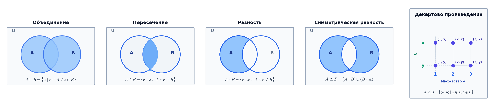

# 📝 Лекция 3: Множества, операции над множествами, булеан, декартово произведение, парадокс Рассела и ZFC

> **Дата:** `2026-09-12` (3-я неделя)  
> **Предмет:** Дискретная математика (1 семестр, 2026/27 уч. год)  
> **Преподаватель (лектор):** Константин Чухарев ([@Lipen](https://github.com/Lipen), Университет ИТМО)  
> **Модуль 1:** Множества и методы доказательств  
> **Материалы курса:** [github.com/Lipen/discrete-math-course](https://github.com/Lipen/discrete-math-course) • Главы книги: `m04` • Слайды: `s1-lec03-sets.pdf`

---

## 🧭 Навигация по лекции
1. [Введение: Множество на языке логики](#1-введение-множество-на-языке-логики)
2. [Способы задания и аксиома экстенсиональности](#2-способы-задания-и-аксиома-экстенсиональности)
3. [Отношение подмножества и пустое множество](#3-отношение-подмножества-и-пустое-множество)
4. [Булеан (множество всех подмножеств)](#4-булеан-множество-всех-подмножеств)
5. [Операции над множествами и законы алгебры множеств](#5-операции-над-множествами)
6. [Декартово произведение и кортежи](#6-декартово-произведение-и-кортежи)
7. [Разбиение множества](#7-разбиение-множества)
8. [Кризис наивной теории множеств: Парадокс Рассела и ZFC](#8-кризис-наивной-теории-множеств-парадокс-рассела-и-zfc)
9. [Связь с Computer Science: SQL, алгебраические типы данных и битовые маски](#9-связь-с-computer-science)
10. [Вопросы для самопроверки](#10-вопросы-для-самопроверки)

---

## 1. Введение: Множество на языке логики

В [[01. Лекция - Высказывания, связки, таблицы истинности, законы логики и следствие (2026-09-09)|Лекции 1]] и [[02. Лекция - Предикаты, кванторы, методы доказательств, индукция и инварианты программ (2026-09-16)|Лекции 2]] мы выстроили формальный язык логики высказываний и предикатов. Теперь мы переходим к изучению фундаментальных объектов, на которых базируется весь фундамент современной математики и Computer Science — **множествам**.

> [!important] Тезис лекции
> Элементарная теория множеств — это логика предикатов, примененная к предикату принадлежности. Каждая теоретико-множественная операция в точности соответствует знакомой логической связке.

Зафиксируем *универсум* $U$ (все рассматриваемые объекты в рамках задачи). Тогда запись $x \in A$ представляет собой одноместный предикат $P(x)$, который истинен, если объект $x$ входит в состав множества $A$, и ложен в противном случае.

---

## 2. Способы задания и аксиома экстенсиональности

Существует три классических способа описать множество:
1. **Явным перечислением элементов:** $A = \{1, 2, 3, 5, 8\}$.
2. **Предикатом выделения (характеристическим свойством):**
   $$A = \{x \in U \mid P(x)\}.$$
   Например, $\{x \in \mathbb{N} \mid x \text{ четно и } x < 10\} = \{0, 2, 4, 6, 8\}$.
3. **Индуктивным (рекурсивным) определением:** указанием базисных элементов и правил порождения новых (так строятся формулы, списки и деревья).

> [!definition] Аксиома экстенсиональности (объёмности)
> Два множества $A$ и $B$ равны тогда и только тогда, когда они состоят из одних и тех же элементов:
> $$A = B \iff \forall x \; (x \in A \iff x \in B).$$

### Важные следствия аксиомы экстенсиональности:
* **Порядок следования элементов не имеет значения:** $\{1, 2, 3\} = \{3, 1, 2\}$.
* **Дублирование элементов не создает новых элементов:** $\{2, 2, 3, 3, 3\} = \{2, 3\}$. Множество фиксирует лишь факт наличия или отсутствия объекта, а не кратность его вхождения (в отличие от *мультимножеств*).

---

## 3. Отношение подмножества и пустое множество

> [!definition] Определение: Подмножество
> Множество $A$ называется **подмножеством** множества $B$ (обозначается $A \subseteq B$), если каждый элемент множества $A$ является элементом множества $B$:
> $$A \subseteq B \iff \forall x \; (x \in A \implies x \in B).$$
> Если $A \subseteq B$ и $A \ne B$, то подмножество называется **собственным (строгим)**: $A \subset B$ или $A \subsetneq B$.

### Равенство через двойное включение
Аксиома экстенсиональности эквивалентна взаимному включению:
$$A = B \iff (A \subseteq B \land B \subseteq A).$$
Именно эта эквивалентность является главным рабочим методом доказательства теоретико-множественных тождеств.

### Пустое множество ($\emptyset$) и вакуумная истинность
**Пустым множеством** называется множество, не содержащее ни одного элемента:
$$\emptyset = \{x \in U \mid \text{False}\}.$$

> [!theorem] Теорема: Пустое множество есть подмножество любого множества
> Для абсолютно любого множества $A$ верно: $\emptyset \subseteq A$.

> [!proof] Доказательство через вакуумную истинность
> По определению подмножества необходимо проверить:
> $$\forall x \; (x \in \emptyset \implies x \in A).$$
> Поскольку высказывание $x \in \emptyset$ тождественно **ложно** для любого объекта $x$, посылка импликации ложна ($\text{False} \implies Q \equiv \text{True}$). Следовательно, импликация истинна для всех $x$. $\blacksquare$

---

## 4. Булеан (множество всех подмножеств)

> [!definition] Определение: Булеан (Power Set)
> **Булеаном** (множеством подмножеств) множества $A$ называется множество, элементами которого являются все возможные подмножества множества $A$:
> $$\mathcal{P}(A) = 2^A = \{S \mid S \subseteq A\}.$$

> [!example] Пример вычисления булеана
> Для множества $A = \{a, b\}$:
> $$\mathcal{P}(A) = \{\emptyset, \{a\}, \{b\}, \{a, b\}\}.$$
> Для пустого множества: $\mathcal{P}(\emptyset) = \{\emptyset\}$ (содержит 1 элемент, а не пусто!).

> [!theorem] Теорема: Мощность булеана конечного множества
> Если конечное множество $A$ содержит $n$ элементов ($|A| = n$), то его булеан содержит ровно $2^n$ элементов:
> $$|\mathcal{P}(A)| = 2^{|A|} = 2^n.$$

> [!proof] Комбинаторное доказательство (бинарное кодирование)
> Чтобы однозначно задать любое подмножество $S \subseteq A$, для каждого из $n$ элементов $a_i \in A$ мы должны принять независимое бинарное решение:
> * $1$ — элемент $a_i$ включается в $S$;
> * $0$ — элемент $a_i$ не включается в $S$.
> 
> Всего существует $2 \times 2 \times \dots \times 2 = 2^n$ различных двоичных векторов длины $n$. Каждому вектору взаимно-однозначно соответствует ровно одно подмножество. $\blacksquare$

---

## 5. Операции над множествами



Основные операции над множествами являются прямым отражением связок логики высказываний:

| Операция над множествами | Математическое определение | Логический эквивалент | Название связки |
|---|---|:---:|---|
| **Объединение ($A \cup B$)** | $\{x \mid x \in A \lor x \in B\}$ | $\lor$ | Дизъюнкция (OR) |
| **Пересечение ($A \cap B$)** | $\{x \mid x \in A \land x \in B\}$ | $\land$ | Конъюнкция (AND) |
| **Разность ($A \setminus B$)** | $\{x \mid x \in A \land x \notin B\}$ | $P \land \neg Q$ | Отрицание принадлежности |
| **Симметрическая разность ($A \triangle B$)** | $(A \setminus B) \cup (B \setminus A)$ | $\oplus$ | Исключающее ИЛИ (XOR) |
| **Дополнение ($\overline{A}$)** | $\{x \in U \mid x \notin A\} = U \setminus A$ | $\neg$ | Отрицание (NOT) |

### Законы алгебры множеств (Двойственность)
Так как операции порождены логическими связками, все законы логики переносятся на теорию множеств:
1. **Коммутативность:** $A \cup B = B \cup A, \quad A \cap B = B \cap A$.
2. **Ассоциативность:** $(A \cup B) \cup C = A \cup (B \cup C), \quad (A \cap B) \cap C = A \cap (B \cap C)$.
3. **Дистрибутивность:**
   $$A \cap (B \cup C) = (A \cap B) \cup (A \cap C)$$
   $$A \cup (B \cap C) = (A \cup B) \cap (A \cup C)$$
4. **Законы де Моргана:**
   $$\overline{A \cup B} = \overline{A} \cap \overline{B}, \qquad \overline{A \cap B} = \overline{A} \cup \overline{B}$$
5. **Поглощение:** $A \cup (A \cap B) = A, \quad A \cap (A \cup B) = A$.

---

## 6. Декартово произведение и кортежи

В отличие от множеств, где порядок элементов несущественен, в математике и программировании критически необходимы **упорядоченные пары** $(a, b)$, где $(a, b) \ne (b, a)$ при $a \ne b$.

> [!definition] Определение Куратовского (строго теоретико-множественное)
> Упорядоченная пара моделируется как специальное множество:
> $$(a, b) \stackrel{\text{def}}{=} \{\{a\}, \{a, b\}\}.$$
> *Свойство:* $(a, b) = (c, d) \iff a = c \land b = d$.

> [!definition] Определение: Декартово произведение (Прямое произведение)
> **Декартовым произведением** множеств $A$ и $B$ (обозначается $A \times B$) называется множество всех упорядоченных пар, первая компонента которых принадлежит $A$, а вторая — $B$:
> $$A \times B = \{(a, b) \mid a \in A \land b \in B\}.$$

### Свойства декартова произведения:
* **Мощность:** для конечных множеств $|A \times B| = |A| \cdot |B|$.
* **Некоммутативность:** $A \times B \ne B \times A$ (если $A \ne B$ и $A, B \ne \emptyset$).
* **Кортежи длины $n$:** $A_1 \times A_2 \times \dots \times A_n = \{(x_1, \dots, x_n) \mid x_i \in A_i\}$.

---

## 7. Разбиение множества

> [!definition] Определение: Разбиение (Partition)
> **Разбиением** множества $X$ называется семейство непустых подмножеств $\mathcal{P} = \{A_i\}_{i \in I}$, удовлетворяющее трем условиям:
> 1. Все блоки непусты: $\forall i \in I \; (A_i \ne \emptyset)$.
> 2. Блоки попарно не пересекаются: $\forall i \ne j \; (A_i \cap A_j = \emptyset)$.
> 3. Блоки полностью покрывают $X$: $\bigcup_{i \in I} A_i = X$.

*Пример:* Множество целых чисел $\mathbb{Z}$ разбивается на классы четных $2\mathbb{Z}$ и нечетных $2\mathbb{Z}+1$ чисел:
$$\mathbb{Z} = 2\mathbb{Z} \cup (2\mathbb{Z}+1), \quad 2\mathbb{Z} \cap (2\mathbb{Z}+1) = \emptyset.$$
*Значение в курсе:* Как будет показано в [[05. Лекция - Отношения эквивалентности, фактор-множества, разбиения и факторизация (2026-10-07)|Лекции 5]], понятия разбиения множества и отношения эквивалентности взаимно-однозначны.

---

## 8. Кризис наивной теории множеств: Парадокс Рассела и ZFC

В наивной теории множеств Георга Кантора предполагалось, что любое логическое свойство $P(x)$ задает множество $\{x \mid P(x)\}$. В 1901 году Бертран Рассел обнаружил, что эта посылка приводит к сокрушительному противоречию в основаниях математики.

> [!theorem] Парадокс Рассела (1901)
> Рассмотрим свойство множества «не содержать самого себя в качестве элемента»: $X \notin X$.  
> Сформируем множество $R$ всех таких множеств:
> $$R = \{X \mid X \notin X\}.$$
> Зададим вопрос: принадлежит ли само множество $R$ множеству $R$?

> [!proof] Анализ противоречия
> По определению множества $R$, для любого объекта $X$ выполнено: $X \in R \iff X \notin X$.  
> Подставим $X = R$:
> $$R \in R \iff R \notin R.$$
> Получено тождественное логическое противоречие $A \iff \neg A$, доказывающее, что совокупность $R$ **не может быть множеством**.

### Разрешение парадокса: Аксиоматика ZFC
Чтобы устранить подобные парадоксы («множество всех множеств», парадокс Бурали-Форти), Цермело и Френкель сформулировали аксиоматическую теорию множеств **ZFC (Zermelo-Fraenkel + Choice)**:
1. **Разделение на множества и собственные классы:** совокупности объектов, являющиеся «слишком большими» (такие как универсум всех множеств или класс Рассела $R$), называются *собственными классами* (Proper Classes) и не могут выступать элементами других множеств.
2. **Ограниченная схема выделения (Axiom Schema of Separation):** запрещено создавать множество $\{x \mid P(x)\}$. Разрешено лишь вырезать подмножество из **уже существующего множества** $A$:
   $$\{x \in A \mid P(x)\}.$$
3. **Аксиома регулярности (Axiom of Regularity / Foundation):**
   $$\forall x \; (x \ne \emptyset \implies \exists y \in x \; (y \cap x = \emptyset)).$$
   Эта аксиома запрещает множествам содержать самих себя ($x \in x$) и исключает бесконечные нисходящие цепочки принадлежности $\dots \in x_2 \in x_1 \in x_0$.

---

## 9. Связь с Computer Science

### 1. Реляционные базы данных и реляционная алгебра Эдгара Кодда
* **Отношение (таблица SQL):** подмножество декартова произведения доменов атрибутов $R \subseteq D_1 \times D_2 \times \dots \times D_k$.
* **Строка (Record / Row):** кортеж $(d_1, \dots, d_k)$.
* **Операция `JOIN`:** декартово произведение таблиц $T_1 \times T_2$, отфильтрованное предикатом `WHERE` (`ON`).
* **Операции над выборками:** `UNION`, `INTERSECT`, `EXCEPT` реализуют теоретико-множественные операции $\cup, \cap, \setminus$.

```sql
-- Теоретико-множественное пересечение (общие компетенции разработчиков)
SELECT skill FROM dev_skills WHERE dev_id = 101
INTERSECT
SELECT skill FROM dev_skills WHERE dev_id = 102;
```

### 2. Алгебраические типы данных (Algebraic Data Types, ADT)
В теории типов (Rust, Haskell, Scala, TypeScript) типы интерпретируются как множества значений:
* **Тип-произведение (Product Type):** структуры (`struct`, `tuple`). Число возможных состояний `struct { a: u8, b: bool }` равно $|u8| \cdot |bool| = 256 \times 2 = 512$ (декартово произведение).
* **Тип-сумма (Sum Type / Tagged Union):** перечисления `enum`. Число состояний равно сумме мощностей альтернатив: $|Option\langle T \rangle| = 1 + |T|$.

### 3. Битовые маски (Bitmasks)
Подмножество $S \subseteq \{0, 1, \dots, n-1\}$ взаимно-однозначно кодируется целым числом от $0$ до $2^n - 1$:
* $i \in S \iff ((\text{mask} \gg i) \ \& \ 1) == 1$.
* Объединение $A \cup B \iff A \mid B$ (побитовое OR).
* Пересечение $A \cap B \iff A \ \& \ B$ (побитовое AND).
* Разность $A \setminus B \iff A \ \& \ (\sim B)$.
* Проверка подмножества $A \subseteq B \iff (A \ \& \ B) == A$.

---

## 10. Вопросы для самопроверки

1. Верно ли, что $\emptyset \in \emptyset$? Верно ли, что $\emptyset \subseteq \emptyset$?
2. Найдите булеан множества $\mathcal{P}(\{\emptyset\})$. Сколько элементов он содержит?
3. Докажите закон де Моргана $\overline{A \cup B} = \overline{A} \cap \overline{B}$ методом двух включений.
4. Пусть $|A| = 4, |B| = 3$. Сколько элементов содержится в множестве $\mathcal{P}(A \times B)$?
5. В чем заключается суть парадокса Рассела и каким образом аксиома выделения ZFC предотвращает его возникновение?
6. Запишите в виде битовой операции нахождение симметрической разности множеств $A \triangle B$.
