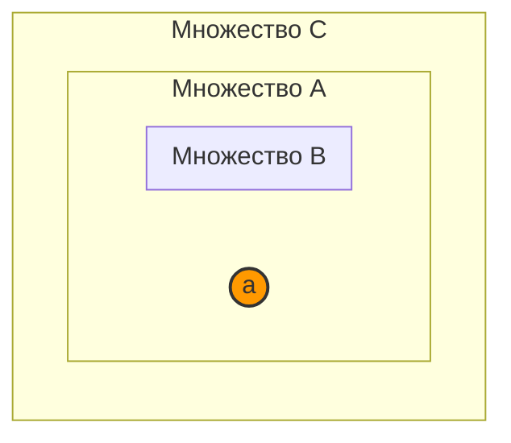

# 📝 Практика 3: Теория множеств, операции, диаграммы Эйлера-Венна, булеан и прямое произведение

> **Дата проведения:** `2026-09-23` (3-я неделя, среда, 13:30–15:00)  
> **Предмет:** Дискретная математика (1 семестр, 2026/27 уч. год)  
> **Поток:** Поток 2 (Software Engineering, Университет ИТМО, группы M3107)  
> **Преподаватель практики:** Бебяков Артем Михайлович (ауд. 2412 / 2316)  
> **Связанная лекция:** [[03. Лекция - Множества, операции, булеан, декартово произведение, парадокс Рассела и ZFC (2026-09-23)]]  
> **Материалы занятия:** Практический листок №1 (Часть 2: Задания 1.AA – 1.BC)

---

## 📌 Краткое резюме (TL;DR)

1. **Принадлежность vs Включение:** Отношение $\in$ связывает элемент и множество ($x \in A$), а отношение $\subseteq$ связывает два множества ($A \subseteq B \iff \forall x (x \in A \to x \in B)$). Объект $\{a\}$ не равен элементу $a$. Пустое множество $\emptyset$ является подмножеством любого множества ($\emptyset \subseteq A$), но принадлежит ему ($\emptyset \in A$) только тогда, когда явно объявлено его элементом.
2. **Аксиома экстенсиональности (объёмности):** Множества равны тогда и только тогда, когда они состоят из одних и тех же элементов. Порядок перечисления и повторения элементов не влияют на экстенсионал: $\{1, 2, \{1\}, 1\} = \{1, \{1\}, 2\}$.
3. **Алгебра множеств:** Доказательства равенств проводятся либо методом двух взаимных включений ($X \subseteq Y$ и $Y \subseteq X$), либо через эквивалентные логические преобразования индикаторных предикатов.
4. **Симметрическая разность ($\Delta$):** $A \Delta B = (A \setminus B) \cup (B \setminus A) = (A \cup B) \setminus (A \cap B)$. Операция $\Delta$ коммутативна, ассоциативна ($A \Delta (B \Delta C) = (A \Delta B) \Delta C$) и дистрибутивна относительно пересечения ($A \cap (B \Delta C) = (A \cap B) \Delta (A \cap C)$), однако $\Delta$ **не дистрибутивна** относительно $\cap$ (контрпример разобран в 1.AK).
5. **Булеан ($2^A$ или $\mathcal{P}(A)$):** Множество всех подмножеств. Для конечного множества $|A| = n$ мощность булеана равна $|2^A| = 2^n$.
6. **Декартово произведение ($A \times B$):** Множество упорядоченных пар $\{(a, b) \mid a \in A, b \in B\}$. Мощность $|A \times B| = |A| \cdot |B|$. Произведение дистрибутивно относительно объединения и пересечения слева и справа, но $(A \cup B) \times (C \cup D) \ne (A \times C) \cup (B \times D)$.
7. **Нечеткие множества (Fuzzy Sets):** Операции определяются через функции принадлежности $\mu(x) \in [0, 1]$. Из-за непрерывности функции принадлежности классические законы исключенного третьего ($F \cup \overline{F} = U$) и противоречия ($F \cap \overline{F} = \emptyset$, $F \setminus F = \emptyset$) в нечеткой логике **нарушаются**.

---

## 🧭 Навигация по конспекту

- [1. Базовые концепции теории множеств (Задания 1.AA — 1.AC)](#1-базовые-концепции-теории-множеств-задания-1aa--1ac)
  - [Задание 1.AA: Отношения принадлежности и включения](#задание-1aa-отношения-принадлежности-и-включения)
  - [Задание 1.AB: Аксиома экстенсиональности и факторизация мультимножеств](#задание-1ab-аксиома-экстенсиональности-и-факторизация-мультимножеств)
  - [Задание 1.AC: Принадлежность элементу объединения семейств](#задание-1ac-принадлежность-элементу-объединения-семейств)
- [2. Алгебра множеств и условия включения (Задания 1.AD — 1.AG)](#2-алгебра-множеств-и-условия-включения-задания-1ad--1ag)
  - [Задание 1.AD: Свойства при цепочке включений B ⊆ A ⊆ C](#задание-1ad-свойства-при-цепочке-включений-b--a--c)
  - [Задание 1.AE: Доказательства методом двух включений](#задание-1ae-доказательства-методом-двух-включений)
  - [Задание 1.AF: Логическая импликация и включение множеств](#задание-1af-логическая-импликация-и-включение-множеств)
  - [Задание 1.AG: Уравнение пересечения и объединения A ∩ B = A ∪ B](#задание-1ag-уравнение-пересечения-и-объединения-a--b--a--b)
- [3. Вычисления, булеаны и теоретико-числовые множества (Задания 1.AH — 1.AJ)](#3-вычисления-булеаны-и-теоретико-числовые-множества-задания-1ah--1aj)
  - [Задание 1.AH: Вычисления над конечным универсумом и булеанами](#задание-1ah-вычисления-над-конечным-универсумом-и-булеанами)
  - [Задание 1.AI: Алгебра делимости чисел через множества кратных](#задание-1ai-алгебра-делимости-чисел-через-множества-кратных)
  - [Задание 1.AJ: Индуктивное порождение множеств](#задание-1aj-индуктивное-порождение-множеств)
- [4. Диаграммы Эйлера-Венна и законы алгебры множеств (Задания 1.AK — 1.AM)](#4-диаграммы-эйлера-венна-и-законы-алгебры-множеств-задания-1ak--1am)
  - [Задание 1.AK: Диаграммы Эйлера-Венна для трех множеств](#задание-1ak-диаграммы-эйлера-венна-для-трех-множеств)
  - [Задание 1.AL: Минимизация и склеивание теоретико-множественных формул](#задание-1al-минимизация-и-склеивание-теоретико-множественных-формул)
  - [Задание 1.AM: Упрощение формул в условиях монотонной иерархии](#задание-1am-упрощение-формул-в-условиях-монотонной-иерархии)
- [5. Декартово произведение и мощности (Задания 1.AN — 1.AT)](#5-декартово-произведение-и-мощности-задания-1an--1at)
  - [Задание 1.AN: Обратная задача факторизации прямого произведения](#задание-1an-обратная-задача-факторизации-прямого-произведения)
  - [Задание 1.AO: Экстремумы мощностей объединения и пересечения](#задание-1ao-экстремумы-мощностей-объединения-и-пересечения)
  - [Задание 1.AP: Транзитивные множества по фон Нейману](#задание-1ap-транзитивные-множества-по-фон-нейману)
  - [Задание 1.AQ: Автореферентный парадокс мощности A = {2, |A|}](#задание-1aq-автореферентный-парадокс-мощности-a--2-a)
  - [Задание 1.AR: Мощности булеанов и ограниченных семейств](#задание-1ar-мощности-булеанов-и-ограниченных-семейств)
  - [Задание 1.AS: Мощность трехкомпонентного декартова произведения](#задание-1as-мощность-трехкомпонентного-декартова-произведения)
  - [Задание 1.AT: Мощность декартовых степеней](#задание-1at-мощность-декартовых-степеней)
- [6. Геометрия множеств и графики на плоскости в ПСК R² (Задания 1.AU — 1.AV)](#6-геометрия-множеств-и-графики-на-плоскости-в-пск-r-задания-1au--1av)
  - [Задание 1.AU: Дискретные декартовы произведения в ПСК](#задание-1au-дискретные-декартовы-произведения-в-пск)
  - [Задание 1.AV: Непрерывные и дискретно-непрерывные множества в R²](#задание-1av-непрерывные-и-дискретно-непрерывные-множества-в-r)
- [7. Семейства множеств, пределы и матричные структуры (Задания 1.AW — 1.AY)](#7-семейства-множеств-пределы-и-матричные-структуры-задания-1aw--1ay)
  - [Задание 1.AW: Алгебра координатных срезов матриц](#задание-1aw-алгебра-координатных-срезов-матриц)
  - [Задание 1.AX: Бесконечные скользящие семейства по нечетным индексам](#задание-1ax-бесконечные-скользящие-семейства-по-нечетным-индексам)
  - [Задание 1.AY: Счетные пересечения и объединения лучей и интервалов](#задание-1ay-счетные-пересечения-и-объединения-лучей-и-интервалов)
- [8. Анализ тождеств и нечеткие множества (Задания 1.AZ — 1.BC)](#8-анализ-тождеств-и-нечеткие-множества-задания-1az--1bc)
  - [Задание 1.AZ: Число подмножеств ортогонального сомножителя](#задание-1az-число-подмножеств-ортогонального-сомножителя)
  - [Задание 1.BA: Проверка истинности теоретико-множественных тождеств](#задание-1ba-проверка-истинности-теоретико-множественных-тождеств)
  - [Задание 1.BC: Доказательства законов теории множеств и анализ нечетких множеств](#задание-1bc-доказательства-законов-теории-множеств-и-анализ-нечетких-множеств)
- [❓ Вопросы для самопроверки к коллоквиуму / экзамену](#-вопросы-для-самопроверки-к-коллоквиуму--экзамену)

---

## 1. Базовые концепции теории множеств (Задания 1.AA — 1.AC)

### Задание 1.AA: Отношения принадлежности и включения

Пусть задано конечное множество $A = \{a, b, c, d\}$.  
Проанализируем истинность двенадцати приведенных записей с позиций строгой теории множеств ZFC.

| № | Запись | Статус | Подробный теоретический анализ |
| :-: | :--- | :---: | :--- |
| **1** | $a \in A$ | **Верно** | Элемент $a$ явно входит в список элементов множества $A$. |
| **2** | $d \subset A$ | **Неверно** | Символ $\subset$ обозначает отношение строгого подмножества между множествами. Объект $d$ является неделимым элементом (не множеством). Корректная запись: $d \in A$ или $\{d\} \subset A$. |
| **3** | $\emptyset \in A$ | **Неверно** | Пустое множество $\emptyset$ не содержится среди элементов $\{a, b, c, d\}$. Элементами являются только $a, b, c, d$. |
| **4** | $\{a, b, c, d\} \subseteq A$ | **Верно** | Множество $\{a, b, c, d\}$ тождественно равно $A$. По рефлексивности нестрогого включения $\forall X (X \subseteq X)$. |
| **5** | $\{a, b\} \subset \{a, b, c\}$ | **Верно** | Каждый элемент левого множества ($a$ и $b$) входит в правое, при этом правое множество содержит дополнительный элемент $c$, следовательно, включение строгое. |
| **6** | $\{c\} \subseteq \{c\}$ | **Верно** | Рефлексивность отношения включения для одноэлементного множества (синглетона). |
| **7** | $a, b \subseteq \{a, b\}$ | **Неверно** | Синтаксическая ошибка типизации: слева от знака включения $\subseteq$ обязано стоять множество, а не последовательность неделимых элементов. Корректная запись: $\{a, b\} \subseteq \{a, b\}$. |
| **8** | $a, b \in \{a, b, c\}$ | **Условно** / **Неверно** | В строгом формальном синтаксисе логики предикатов отношение $\in$ является бинарным ($x \in S$). Запись вида $x, y \in S$ представляет собой естественное сокращение конъюнкции $(a \in \{a, b, c\}) \land (b \in \{a, b, c\})$, которая семантически истинна. Однако как атомарная формула ZFC синтаксически невалидна. |
| **9** | $\emptyset \in \{\emptyset\}$ | **Верно** | Множество $\{\emptyset\}$ — это синглетон, единственным элементом которого является пустое множество $\emptyset$. |
| **10** | $\emptyset \subset \{\emptyset\}$ | **Верно** | Пустое множество $\emptyset$ является подмножеством любого множества ($\forall X (\emptyset \subseteq X)$). Поскольку $|\emptyset| = 0$, а $|\{\emptyset\}| = 1$, равенство исключено, включение строгое: $\emptyset \subset \{\emptyset\}$. |
| **11** | $a = \{a\}$ | **Неверно** | Элемент не тождественен синглетону, его содержащему. В ZFC равенство $a = \{a\}$ означало бы $a \in a$, что напрямую нарушает Аксиому регулярности (аксиому фундирования). |
| **12** | $\emptyset = \{0\}$ | **Неверно** | Мощность пустого множества $|\emptyset| = 0$. Множество $\{0\}$ является непустым синглетоном мощности $|\{0\}| = 1$, содержащим число 0. |

---

### Задание 1.AB: Аксиома экстенсиональности и факторизация мультимножеств

**Условие:** Доказать равенство множеств:
$$\{1, 2, \{1\}, 1, \{1\}\} = \{1, \{1\}, 2\}$$

**Доказательство:**
По **Аксиоме экстенсиональности (объёмности)** в аксиоматической теории множеств ZFC:
$$\forall A \forall B \Big( A = B \iff \forall x (x \in A \iff x \in B) \Big)$$
Два множества признаются равными тогда и только тогда, когда они содержат ровно одни и те же элементы.

Обозначим левое множество через $L = \{1, 2, \{1\}, 1, \{1\}\}$, а правое — через $R = \{1, \{1\}, 2\}$.
1. Найдем предикат принадлежности для произвольного объекта $x$ к множеству $L$:
   $$x \in L \iff (x = 1) \lor (x = 2) \lor (x = \{1\}) \lor (x = 1) \lor (x = \{1\})$$
   В силу закона идемпотентности дизъюнкции ($P \lor P \equiv P$) и коммутативности дизъюнкции:
   $$x \in L \iff (x = 1) \lor (x = \{1\}) \lor (x = 2)$$
2. Найдем предикат принадлежности к множеству $R$:
   $$x \in R \iff (x = 1) \lor (x = \{1\}) \lor (x = 2)$$
3. Предикаты истинности тождественны:
   $$\forall x (x \in L \iff x \in R) \implies L = R$$

> [!important] Следствие
> В классической теории множеств порядок перечисления элементов и их дублирование несущественны. Множество полностью определяется своим характеристическим свойством принадлежности.

---

### Задание 1.AC: Принадлежность элементу объединения семейств

**Условие:** Доказать, что $x \in \bigcup_{i \in I} A_i$, где $x = 2$, $A_1 = \{1, 4\}$, $A_2 = \{2, 5, 7\}$, $A_3 = \{3, 6, 9\}$, $I = \{1, 2, 3\}$.

**Доказательство:**
По определению объединения произвольного индексированного семейства множеств:
$$x \in \bigcup_{i \in I} A_i \iff \exists i \in I : x \in A_i$$

Для доказательства экзистенциального утверждения достаточно предъявить свидетеля (правило введения квантора существования $\exists\text{-Intro}$):
1. Выберем индекс $i = 2$.
2. Проверим условие принадлежности индекса: $2 \in I$, так как $I = \{1, 2, 3\}$ (истинно).
3. Проверим принадлежность элемента: $x = 2 \in A_2$, поскольку $A_2 = \{2, 5, 7\}$ (истинно, так как $2 = 2$).
4. Следовательно, предикат $\exists i \in I (2 \in A_i)$ истинен, откуда $2 \in \bigcup_{i \in I} A_i$. $\blacksquare$

---

## 2. Алгебра множеств и условия включения (Задания 1.AD — 1.AG)

### Задание 1.AD: Свойства при цепочке включений $B \subseteq A \subseteq C$

**Условие:** Известно, что $B \subseteq A \subseteq C$, при этом фиксирован элемент $a$, удовлетворяющий условиям $a \in A$ и $a \notin B$.  
Выясним истинность следующих 12 утверждений:

1. **$a \notin C$ — ЛОЖНО.**  
   По условию $a \in A$ и $A \subseteq C$. По определению подмножества: $\forall x (x \in A \to x \in C)$. Следовательно, $a \in C$.
2. **$a \in A \cap B$ — ЛОЖНО.**  
   $a \in A \cap B \iff a \in A \land a \in B$. Так как $a \notin B$, конъюнкция ложна.
3. **$a \in A \cup B$ — ИСТИННО.**  
   $a \in A \cup B \iff a \in A \lor a \in B$. Так как $a \in A$, дизъюнкция истинна.
4. **$a \in A \setminus B$ — ИСТИННО.**  
   По определению разности: $x \in A \setminus B \iff x \in A \land x \notin B$. Оба условия даны явно.
5. **$a \in B \setminus A$ — ЛОЖНО.**  
   Поскольку $B \subseteq A$, разность $B \setminus A = \emptyset$. Никакой элемент не может принадлежать пустому множеству. Кроме того, $a \notin B$.
6. **$a \in A \Delta B$ — ИСТИННО.**  
   $A \Delta B = (A \setminus B) \cup (B \setminus A) = (A \setminus B) \cup \emptyset = A \setminus B$. Из п. 4 следует, что $a \in A \setminus B$, значит $a \in A \Delta B$.
7. **$\{a\} \subseteq A \cap C$ — ИСТИННО.**  
   Так как $A \subseteq C$, то $A \cap C = A$. Условие $a \in A$ эквивалентно $\{a\} \subseteq A$.
8. **$\{a\} \subseteq A \setminus C$ — ЛОЖНО.**  
   Поскольку $A \subseteq C$, разность $A \setminus C = \emptyset$. Одноэлементное множество $\{a\}$ не может быть подмножеством пустого множества ($\{a\} \nsubseteq \emptyset$).
9. **$\{a\} \subseteq A \Delta C$ — ЛОЖНО.**  
   Так как $A \subseteq C$, симметрическая разность равна $A \Delta C = (C \setminus A) \cup (A \setminus C) = C \setminus A$. Но $a \in A$, следовательно $a \notin C \setminus A$.
10. **$\{a\} \subseteq A \cap (B \cup C)$ — ИСТИННО.**  
    Поскольку $B \subseteq C$, объединение $B \cup C = C$. Тогда $A \cap (B \cup C) = A \cap C = A$. Так как $a \in A$, то $\{a\} \subseteq A$.
11. **$\{a\} \subseteq B \cup (C \setminus A)$ — ЛОЖНО.**  
    Для выполнения $\{a\} \subseteq X$ необходимо $a \in X$. Здесь $a \notin B$ (по условию) и $a \notin (C \setminus A)$ (так как $a \in A$). Значит, $a \notin B \cup (C \setminus A)$.
12. **$\{a\} \subseteq B \Delta (A \setminus C)$ — ЛОЖНО.**  
    Так как $A \subseteq C$, $A \setminus C = \emptyset$. Тогда $B \Delta \emptyset = B$. Но по условию $a \notin B$, следовательно, $\{a\} \nsubseteq B$.

---

### Задание 1.AE: Доказательства методом двух включений

#### Пункт I: Доказать, что $A \setminus B = A \cap \overline{B}$

1. **Докажем прямое включение $A \setminus B \subseteq A \cap \overline{B}$:**
   - Пусть $x \in A \setminus B$.
   - По определению разности множеств: $x \in A \land x \notin B$.
   - По определению абсолютного дополнения относительно универсума $U$: $x \notin B \iff x \in \overline{B}$.
   - Следовательно, $x \in A \land x \in \overline{B}$.
   - По определению пересечения: $x \in A \cap \overline{B}$.
   - Таким образом, $A \setminus B \subseteq A \cap \overline{B}$.

2. **Докажем обратное включение $A \cap \overline{B} \subseteq A \setminus B$:**
   - Пусть $x \in A \cap \overline{B}$.
   - По определению пересечения: $x \in A \land x \in \overline{B}$.
   - Из $x \in \overline{B}$ следует, что $x \notin B$.
   - Получаем: $x \in A \land x \notin B$.
   - По определению разности: $x \in A \setminus B$.
   - Таким образом, $A \cap \overline{B} \subseteq A \setminus B$.

Из пунктов 1 и 2 по аксиоме экстенсиональности следует:
$$A \setminus B = A \cap \overline{B} \quad \blacksquare$$

---

#### Пункт II: Доказать, что $\overline{A} = B \iff A \cap B = \emptyset \land A \cup B = U$

1. **Необходимость ($\implies$):**
   - Дано: $B = \overline{A}$.
   - Пересечение: $A \cap B = A \cap \overline{A}$. По закону противоречия для любого $x \in U$ высказывание $(x \in A \land x \notin A)$ тождественно ложно, значит $A \cap \overline{A} = \emptyset$.
   - Объединение: $A \cup B = A \cup \overline{A}$. По закону исключенного третьего для любого $x \in U$ высказывание $(x \in A \lor x \notin A)$ тождественно истинно, значит $A \cup \overline{A} = U$.
   - Необходимость доказана.

2. **Достаточность ($\impliedby$):**
   - Дано: $A \cap B = \emptyset$ и $A \cup B = U$. Докажем, что $B = \overline{A}$ методом двух включений.
   - **$B \subseteq \overline{A}$:** Пусть $x \in B$. Так как $A \cap B = \emptyset$, элемент $x$ не может принадлежать $A$ (иначе $x \in A \cap B$). Значит, $x \notin A$, что влечет $x \in \overline{A}$. Включение доказано.
   - **$\overline{A} \subseteq B$:** Пусть $x \in \overline{A} \implies x \notin A$. Поскольку $x \in U$, а по условию $U = A \cup B$, получаем $x \in (A \cup B) \iff (x \in A \lor x \in B)$. Так как $x \notin A$, по правилу дизъюнктивного силлогизма обязательно $x \in B$. Включение доказано.

Из взаимных включений $B \subseteq \overline{A}$ и $\overline{A} \subseteq B$ получаем $B = \overline{A}$. $\blacksquare$

---

### Задание 1.AF: Логическая импликация и включение множеств

**Условие:** Используя тавтологию логики высказываний $(A \to B) \lor (A \to C) \equiv A \to (B \lor C)$, доказать утверждение:
$$A \subseteq B \lor A \subseteq C \implies A \subseteq B \cup C$$
Показать, что обратная импликация верна не всегда.

> [!warning] Тонкость логики первого порядка: Независимость связанных переменных
> В посылке $A \subseteq B \lor A \subseteq C$ формулы включения квантифицируются **независимо**:
> $$\Big(\forall x (x \in A \to x \in B)\Big) \lor \Big(\forall y (y \in A \to y \in C)\Big)$$
> Переменные $x$ и $y$ связаны своими кванторами в разных областях видимости (scopes).  
> **Грубая синтаксическая ошибка** — пытаться «вынести» квантор всеобщности за скобку как $\forall x [ (x \in A \to x \in B) \lor (x \in A \to x \in C) ]$:  
> - Операция $(\forall x \Phi(x)) \lor (\forall y \Psi(y))$ при приведении к ПНФ дает формулу с **двумя** кванторами: $\forall x \forall y (\Phi(x) \lor \Psi(y))$, так как значения $x$ и $y$ выбираются независимо!
> - Квантор всеобщности $\forall$ **не дистрибутивен** относительно дизъюнкции: формула $\forall x (\Phi(x) \lor \Psi(x))$ не эквивалентна $(\forall x \Phi(x)) \lor (\forall x \Psi(x))$.  
> Доказательство обязано опираться на правило специализации ($\forall\text{-Elim}$) для одного фиксированного элемента и разбор случаев посылки.

**Корректное доказательство прямой импликации:**
1. Зафиксируем произвольный объект предметной области $z \in U$ и докажем импликацию:
   $$z \in A \to z \in (B \cup C)$$
2. Посылка теоремы есть дизъюнкция двух высказываний: $S_1 \lor S_2$, где:
   $$S_1 \equiv \forall x (x \in A \to x \in B), \qquad S_2 \equiv \forall y (y \in A \to y \in C)$$
3. Применим правило удаления дизъюнкции (рассуждение по случаям):
   - **Случай 1 (истинно $S_1$):**  
     Так как для любого $x$ верно $x \in A \to x \in B$, специализируем квантор на наш фиксированный элемент $x = z$:
     $$z \in A \to z \in B$$
     По правилу введения дизъюнкции ($\lor\text{-Intro}$) для высказываний получаем:
     $$(z \in A \to z \in B) \lor (z \in A \to z \in C)$$
   - **Случай 2 (истинно $S_2$):**  
     Специализируем квантор на $y = z$:
     $$z \in A \to z \in C$$
     Аналогично по правилу введения дизъюнкции:
     $$(z \in A \to z \in B) \lor (z \in A \to z \in C)$$
4. В обоих случаях для фиксированного элемента $z$ выведено высказывание:
   $$(z \in A \to z \in B) \lor (z \in A \to z \in C)$$
5. **Применение эквивалентности из условия:**  
   Положим элементарные пропозициональные высказывания для элемента $z$:
   $$P \equiv (z \in A), \quad Q \equiv (z \in B), \quad R \equiv (z \in C)$$
   По заданной тавтологии $(P \to Q) \lor (P \to R) \equiv P \to (Q \lor R)$ имеем:
   $$z \in A \to (z \in B \lor z \in C)$$
   По определению теоретико-множественного объединения $(z \in B \lor z \in C) \equiv z \in (B \cup C)$:
   $$z \in A \to z \in (B \cup C)$$
6. Поскольку элемент $z$ был выбран абсолютно произвольно, по правилу обобщения ($\forall\text{-Intro}$):
   $$\forall z \big( z \in A \to z \in (B \cup C) \big) \equiv A \subseteq B \cup C \quad \blacksquare$$

---

**Опровержение обратного утверждения: почему обратный вынос невозможен**

Требуется показать, что $A \subseteq B \cup C \;\not\kern-0.5em\implies A \subseteq B \lor A \subseteq C$.

> [!important] Почему обратная импликация разрушается в предикатах
> Если дано $A \subseteq B \cup C$, то для каждого $z$ действительно выполняется:
> $$\forall z \Big( (z \in A \to z \in B) \lor (z \in A \to z \in C) \Big)$$
> Но здесь для каждого конкретного элемента $z$ истинным может оказываться **разный** дизъюнкт!
> - Для одних элементов $z_1 \in A$ истинно $z_1 \in B$ (левый дизъюнкт);
> - Для других элементов $z_2 \in A$ истинно $z_2 \in C$ (правый дизъюнкт).
> 
> Распределить квантор всеобщности внутрь дизъюнкции категорически **нельзя**:
> $$\forall z (\Phi(z) \lor \Psi(z)) \;\not\kern-0.5em\implies (\forall x \Phi(x)) \lor (\forall y \Psi(y))$$

**Численный контрпример:**
- Пусть $B = \{1\}$, $C = \{2\}$, а $A = \{1, 2\}$.
- Объединение $B \cup C = \{1, 2\}$.
- Проверим посылку: $A \subseteq B \cup C \iff \{1, 2\} \subseteq \{1, 2\}$ — **Истинно**.  
  *(Для каждого $z \in A$: при $z=1$ истинно $1 \in B$, при $z=2$ истинно $2 \in C$)*.
- Проверим следствие:
  - $A \subseteq B \iff \{1, 2\} \subseteq \{1\}$ — **Ложно** (элемент $2 \in A$, но $2 \notin B$);
  - $A \subseteq C \iff \{1, 2\} \subseteq \{2\}$ — **Ложно** (элемент $1 \in A$, но $1 \notin C$);
  - Дизъюнкция: $\text{False} \lor \text{False} \equiv \text{False}$.
- Посылка истинна, следствие ложно ($1 \to 0 = 0$). Обратная импликация неверна.

---

### Задание 1.AG: Уравнение пересечения и объединения $A \cap B = A \cup B$

**Условие:** Пусть $U = \{1, 2, 3, 4, 5, 6\}$, $A = \{1, 2, 5\}$. Найти множество $B$ такое, что $A \cap B = A \cup B$.

**Решение:**
Для любых подмножеств $A, B \subseteq U$ всегда выполняются фундаментальные включения:
$$A \cap B \subseteq A \subseteq A \cup B$$
По условию левая и правая границы этой цепочки совпадают: $A \cap B = A \cup B$.  
Следовательно, все включения в цепочке обращаются в равенства:
$$A \cap B = A \quad \text{и} \quad A \cup B = A$$
1. Из $A \cup B = A$ следует, что $B \subseteq A$.
2. Из $A \cap B = A$ следует, что $A \subseteq B$.
3. По свойству антисимметричности отношения включения:
   $$(B \subseteq A) \land (A \subseteq B) \implies B = A$$

**Ответ:** Единственным решением является $B = A = \{1, 2, 5\}$.

---

## 3. Вычисления, булеаны и теоретико-числовые множества (Задания 1.AH — 1.AJ)

### Задание 1.AH: Вычисления над конечным универсумом и булеанами

Дан универсум $U = \{1, 2, 3, 4, 5, 6, 7, 8\}$ и его подмножества:
- $A = \{x \in U \mid x \text{ четно}\} = \{2, 4, 6, 8\}$
- $B = \{x \in U \mid x \text{ кратно 4}\} = \{4, 8\}$
- $C = \{x \in U \mid x \text{ простое}\} = \{2, 3, 5, 7\}$ *(число 1 не является простым)*
- $D = \{1, 3, 5\}$

Вычислим требуемые теоретико-множественные конструкции:

#### 1. $A \Delta B$
$$A \Delta B = (A \setminus B) \cup (B \setminus A) = \{2, 6\} \cup \emptyset = \{2, 6\}$$

#### 2. $A \cap (B \cup C \cup D)$
- Найдем $B \cup C \cup D = \{4, 8\} \cup \{2, 3, 5, 7\} \cup \{1, 3, 5\} = \{1, 2, 3, 4, 5, 7, 8\}$.
- Пересечение с $A$:
  $$A \cap \{1, 2, 3, 4, 5, 7, 8\} = \{2, 4, 6, 8\} \cap \{1, 2, 3, 4, 5, 7, 8\} = \{2, 4, 8\}$$

#### 3. $2^A \cap 2^B$
Воспользуемся фундаментальным свойством булеана: $2^X \cap 2^Y = 2^{X \cap Y}$.  
Поскольку $B \subseteq A$, имеем $A \cap B = B = \{4, 8\}$.
$$2^A \cap 2^B = 2^{\{4, 8\}} = \big\{ \emptyset, \{4\}, \{8\}, \{4, 8\} \big\}$$

#### 4. $(C \setminus A) \Delta D$
- $C \setminus A = \{2, 3, 5, 7\} \setminus \{2, 4, 6, 8\} = \{3, 5, 7\}$.
- Симметрическая разность с $D = \{1, 3, 5\}$:
  $$\{3, 5, 7\} \Delta \{1, 3, 5\} = \big(\{3, 5, 7\} \setminus \{1, 3, 5\}\big) \cup \big(\{1, 3, 5\} \setminus \{3, 5, 7\}\big) = \{7\} \cup \{1\} = \{1, 7\}$$

#### 5. $(A \setminus B) \cup (C \setminus D)$
- $A \setminus B = \{2, 4, 6, 8\} \setminus \{4, 8\} = \{2, 6\}$.
- $C \setminus D = \{2, 3, 5, 7\} \setminus \{1, 3, 5\} = \{2, 7\}$.
- Объединение:
  $$\{2, 6\} \cup \{2, 7\} = \{2, 6, 7\}$$

#### 6. $2^D \setminus 2^C$
- Множество $2^D$ — булеан множества $D = \{1, 3, 5\}$, содержащий $2^3 = 8$ элементов:
  $$2^D = \big\{ \emptyset, \{1\}, \{3\}, \{5\}, \{1, 3\}, \{1, 5\}, \{3, 5\}, \{1, 3, 5\} \big\}$$
- Подмножества из $2^D$, принадлежащие $2^C$, обязаны состоять только из элементов $C = \{2, 3, 5, 7\}$. То есть они являются подмножествами $D \cap C = \{3, 5\}$:
  $$2^D \cap 2^C = 2^{D \cap C} = 2^{\{3, 5\}} = \big\{ \emptyset, \{3\}, \{5\}, \{3, 5\} \big\}$$
- Разность $2^D \setminus 2^C$ состоит из тех подмножеств $D$, которые содержат элемент 1 (поскольку $1 \notin C$):
  $$2^D \setminus 2^C = \big\{ \{1\}, \{1, 3\}, \{1, 5\}, \{1, 3, 5\} \big\}$$

---

### Задание 1.AI: Алгебра делимости чисел через множества кратных

Пусть универсум $U = \mathbb{Z}^+$ (множество натуральных чисел).  
Определены подмножества:
- $M_2 = \{n \in \mathbb{Z}^+ \mid 2 \mid n\}$ — числа, кратные 2;
- $M_3 = \{n \in \mathbb{Z}^+ \mid 3 \mid n\}$ — числа, кратные 3;
- $M_5 = \{n \in \mathbb{Z}^+ \mid 5 \mid n\}$ — числа, кратные 5.

Выразим целевые множества через $M_2, M_3, M_5$ с помощью теоретико-множественных операций:

1. **Множество чисел, делящихся на 6:**  
   Поскольку $\text{НОК}(2, 3) = 6$, число делится на 6 тогда и только тогда, когда оно делится одновременно на 2 и на 3:
   $$M_6 = M_2 \cap M_3$$

2. **Множество чисел, делящихся на 30:**  
   Поскольку $2, 3, 5$ попарно взаимно просты, $\text{НОК}(2, 3, 5) = 30$:
   $$M_{30} = M_2 \cap M_3 \cap M_5$$

3. **Множество чисел, взаимно простых с 30:**  
   Число взаимно просто с $30 = 2 \cdot 3 \cdot 5$ тогда и только тогда, когда оно не делится ни на 2, ни на 3, ни на 5. Это дополнение объединения всех кратных:
   $$\overline{M_2 \cup M_3 \cup M_5} = \overline{M_2} \cap \overline{M_3} \cap \overline{M_5} = \mathbb{Z}^+ \setminus (M_2 \cup M_3 \cup M_5)$$

4. **Множество чисел, делящихся на 10, но не делящихся на 3:**  
   Число делится на 10 $\iff n \in M_2 \cap M_5$. Условие неделимости на 3 означает вычитание множества $M_3$:
   $$(M_2 \cap M_5) \setminus M_3 \quad \text{или} \quad M_2 \cap M_5 \cap \overline{M_3}$$

---

### Задание 1.AJ: Индуктивное порождение множеств

**Условие:** Пусть начальное множество $X_0 = \{1\}$, и для всех $i \ge 0$ задано рекуррентное правило:
$$\forall x \in X_i \implies \big(x \in X_{i+1} \land (x + 2) \in X_{i+1}\big)$$
Требуется найти $X_4$ и задать его характеристическим свойством.

**Решение:**
Из условия следует минимальное индуктивное порождение:
$$X_{i+1} = X_i \cup \{x + 2 \mid x \in X_i\}$$
Вычислим последовательные поколения:
- $X_0 = \{1\}$;
- $X_1 = \{1\} \cup \{3\} = \{1, 3\}$;
- $X_2 = \{1, 3\} \cup \{3, 5\} = \{1, 3, 5\}$;
- $X_3 = \{1, 3, 5\} \cup \{3, 5, 7\} = \{1, 3, 5, 7\}$;
- $X_4 = \{1, 3, 5, 7\} \cup \{3, 5, 7, 9\} = \{1, 3, 5, 7, 9\}$.

**Задание характеристическим свойством:**
$$X_4 = \{x \in \mathbb{N} \mid x \text{ нечетно} \land 1 \le x \le 9\} = \{2k + 1 \mid k \in \mathbb{Z}, 0 \le k \le 4\}$$

---

## 4. Диаграммы Эйлера-Венна и законы алгебры множеств (Задания 1.AK — 1.AM)

### Задание 1.AK: Диаграммы Эйлера-Венна для трех множеств

Диаграмма Эйлера-Венна для трех множеств $A, B, C$ в общем положении разбивает универсум на $2^3 = 8$ непересекающихся элементарных областей (минтермов), которые удобно кодировать битовыми масками $b_A b_B b_C \in \{0, 1\}^3$:
- $m_0 = \overline{A} \cap \overline{B} \cap \overline{C}$ (фон универсума)
- $m_1 = \overline{A} \cap \overline{B} \cap C$
- $m_2 = \overline{A} \cap B \cap \overline{C}$
- $m_3 = \overline{A} \cap B \cap C$
- $m_4 = A \cap \overline{B} \cap \overline{C}$
- $m_5 = A \cap \overline{B} \cap C$
- $m_6 = A \cap B \cap \overline{C}$
- $m_7 = A \cap B \cap C$

Проанализируем четыре соотношения:

| Тождество | Состав левой части (минтермы) | Состав правой части (минтермы) | Статус |
| :--- | :---: | :---: | :---: |
| **a) $A \setminus (B \setminus C) = (A \setminus B) \cup (A \cap C)$** | $m_4, m_5, m_7$ | $(m_4, m_5) \cup (m_5, m_7) = m_4, m_5, m_7$ | **Тождественно верно** |
| **b) $A \Delta (B \Delta C) = (A \Delta B) \Delta C$** | $m_1, m_2, m_4, m_7$ | $m_1, m_2, m_4, m_7$ | **Тождественно верно** (Ассоциативность) |
| **c) $A \cap (B \Delta C) = (A \cap B) \Delta (A \cap C)$** | $m_5, m_6$ | $m_6 \Delta m_5 = m_5, m_6$ | **Тождественно верно** (Дистрибутивность $\cap$ над $\Delta$) |
| **d) $A \Delta (B \cap C) = (A \Delta B) \cap (A \Delta C)$** | $m_4, m_5, m_6$ | $(m_2, m_3, m_4, m_5) \cap (m_1, m_3, m_4, m_6) = m_3, m_4$ | **НЕВЕРНО в общем случае** |

> [!warning] Контрпример для пункта (d)
> Пусть $A = \{1\}$, $B = \{1\}$, $C = \emptyset$.
> - Левая часть: $B \cap C = \emptyset \implies A \Delta \emptyset = \{1\}$.
> - Правая часть: $A \Delta B = \{1\} \Delta \{1\} = \emptyset$, $A \Delta C = \{1\} \Delta \emptyset = \{1\}$.
>   Их пересечение: $\emptyset \cap \{1\} = \emptyset$.
> - Получаем: $\{1\} \ne \emptyset$. Тождество нарушается.

---

### Задание 1.AL: Минимизация и склеивание теоретико-множественных формул

**Условие:** Упростить выражение:
$$E = (\overline{A} \cap \overline{B}) \cup (A \cap \overline{B}) \cup (\overline{A} \cap B)$$

**Решение методом алгебраических преобразований:**
1. Применим дистрибутивность пересечения относительно объединения к первым двум скобкам:
   $$(\overline{A} \cap \overline{B}) \cup (A \cap \overline{B}) = (\overline{A} \cup A) \cap \overline{B}$$
2. Так как $\overline{A} \cup A = U$ (универсум):
   $$U \cap \overline{B} = \overline{B}$$
3. Подставим результат обратно в выражение:
   $$E = \overline{B} \cup (\overline{A} \cap B)$$
4. Раскроем по закону дистрибутивности объединения относительно пересечения:
   $$\overline{B} \cup (\overline{A} \cap B) = (\overline{B} \cup \overline{A}) \cap (\overline{B} \cup B) = (\overline{B} \cup \overline{A}) \cap U = \overline{A} \cup \overline{B}$$
5. По закону де Моргана:
   $$\overline{A} \cup \overline{B} = \overline{A \cap B} = U \setminus (A \cap B)$$

**Ответ:** $\overline{A} \cup \overline{B}$ (или $\overline{A \cap B}$).

---

### Задание 1.AM: Упрощение формул в условиях монотонной иерархии

**Условие:** Дана цепочка строгих включений:
$$A \subset B \subset C \subset D \subset U$$
Упростить два выражения.

#### Пункт 1:
$$E_1 = (\overline{A} \cap B \cap D) \cup (\overline{A} \cap \overline{B} \cap C \cap D) \cup (A \cap \overline{B} \cap \overline{C}) \cup (A \cap B \cap C)$$

Проанализируем каждый из 4 дизъюнктов с учетом монотонности:
1. Так как $B \subset D$, то $B \cap D = B$. Следовательно:
   $$\overline{A} \cap B \cap D = \overline{A} \cap B = B \setminus A$$
2. Так как $C \subset D$, то $C \cap D = C$. Кроме того, $A \subset B \implies \overline{B} \subset \overline{A}$, значит $\overline{A} \cap \overline{B} = \overline{B}$. Получаем:
   $$\overline{A} \cap \overline{B} \cap C \cap D = \overline{B} \cap C = C \setminus B$$
3. Так как $A \subset B$, то $A \cap \overline{B} = \emptyset$. Следовательно:
   $$A \cap \overline{B} \cap \overline{C} = \emptyset \cap \overline{C} = \emptyset$$
4. Так как $A \subset B \subset C$, то $A \cap B \cap C = A$.

Объединим результаты:
$$E_1 = (B \setminus A) \cup (C \setminus B) \cup \emptyset \cup A = \big(A \cup (B \setminus A)\big) \cup (C \setminus B) = B \cup (C \setminus B) = C$$

**Ответ:** $C$.

---

#### Пункт 2:
$$E_2 = (\overline{B} \cap \overline{D}) \cup (A \cap \overline{B} \cap \overline{C}) \cup (C \cap \overline{D}) \cup (\overline{A} \cap B \cap D) \cup (A \cap B \cap D)$$

Проанализируем компоненты:
1. $B \subset D \implies \overline{D} \subset \overline{B} \implies \overline{B} \cap \overline{D} = \overline{D}$.
2. $A \subset B \implies A \cap \overline{B} = \emptyset \implies A \cap \overline{B} \cap \overline{C} = \emptyset$.
3. $C \subset D \implies C \cap \overline{D} = \emptyset$.
4. Объединим четвертое и пятое слагаемые, вынеся общий множитель $B \cap D$:
   $$(\overline{A} \cap B \cap D) \cup (A \cap B \cap D) = (\overline{A} \cup A) \cap (B \cap D) = U \cap (B \cap D) = B \cap D$$
   Поскольку $B \subset D$, имеем $B \cap D = B$.

Соберем все слагаемые:
$$E_2 = \overline{D} \cup \emptyset \cup \emptyset \cup B = B \cup \overline{D}$$

**Ответ:** $B \cup \overline{D}$ (или $\overline{D \setminus B}$).

---

## 5. Декартово произведение и мощности (Задания 1.AN — 1.AT)

### Задание 1.AN: Обратная задача факторизации прямого произведения

**Условие:** Найти множества $A, B$ и $C$, если известны их декартовы произведения:
$$A \times B = \{(1, 4), (2, 3), (1, 3), (2, 4)\}$$
$$B \times C = \{(3, 5), (4, 5), (4, 6), (4, 7), (3, 7), (3, 6)\}$$

**Решение:**
По определению декартова произведения проекции на координаты однозначно восстанавливают множества:
1. Проекция $A \times B$ на первую координату:
   $$A = \pi_1(A \times B) = \{1, 2\}$$
2. Проекция $A \times B$ на вторую координату:
   $$B = \pi_2(A \times B) = \{3, 4\}$$
3. Проверим согласованность для $B \times C$:
   $$\pi_1(B \times C) = \{3, 4\} = B \quad (\text{полное совпадение})$$
4. Проекция $B \times C$ на вторую координату:
   $$C = \pi_2(B \times C) = \{5, 6, 7\}$$

Проверим мощности:
- $|A \times B| = |A| \cdot |B| = 2 \cdot 2 = 4$ (верно).
- $|B \times C| = |B| \cdot |C| = 2 \cdot 3 = 6$ (верно).

**Ответ:** $A = \{1, 2\}$, $B = \{3, 4\}$, $C = \{5, 6, 7\}$.

---

### Задание 1.AO: Экстремумы мощностей объединения и пересечения

**Условие:** Пусть $A = \{2, 4, 5, 7\}$ (следовательно, $|A| = 4$), а $|B| = 5$.  
Определить наибольшие и наименьшие возможные значения величин:
1. $|A \cup B|$;
2. $|A \cap B|$;
3. $|A \times B|$.

**Решение:**
По формуле включений-исключений для двух конечных множеств:
$$|A \cup B| = |A| + |B| - |A \cap B| = 4 + 5 - |A \cap B| = 9 - |A \cap B|$$
Величина $|A \cap B|$ ограничена условиями:
$$0 \le |A \cap B| \le \min(|A|, |B|) = \min(4, 5) = 4$$

1. **Для $|A \cap B|$:**
   - Наименьшее значение: **$0$** (достигается при непересекающихся множествах, например, $B = \{1, 3, 6, 8, 9\}$).
   - Наибольшее значение: **$4$** (достигается при $A \subseteq B$, например, $B = \{2, 4, 5, 7, 10\}$).

2. **Для $|A \cup B|$:**
   - Наименьшее значение: $9 - 4 =$ **$5$** (когда $A \subset B$).
   - Наибольшее значение: $9 - 0 =$ **$9$** (когда $A \cap B = \emptyset$).

3. **Для $|A \times B|$:**
   - Мощность прямого произведения двух конечных множеств строго детерминирована:
     $$|A \times B| = |A| \cdot |B| = 4 \cdot 5 = 20$$
   - Наибольшее и наименьшее значения совпадают и равны **$20$**.

---

### Задание 1.AP: Транзитивные множества по фон Нейману

**Условие:** Найти все множества $A$, удовлетворяющие двум свойствам:
1. $|A| = 3$;
2. $\forall B \in A \implies B \subseteq A$.

**Решение:**
Множество, каждый элемент которого одновременно является его подмножеством, называется **транзитивным множеством**.  
В рамках стандартной теории ZFC с **Аксиомой регулярности** (запрещающей циклы принадлежности $x \in x$):
1. В любом непустом множестве существует элемент, дизъюнктный с ним (минимальный по рангу). Для транзитивного множества этим элементом обязан быть $\emptyset$, так как если $x \in A$ и $x \ne \emptyset$, то найдется $y \in x \subseteq A$, то есть $x$ пересекается с $A$. Значит:
   $$\emptyset \in A$$
2. Обозначим $x_0 = \emptyset$.
3. Следующий элемент $x_1 \in A$ обязан быть подмножеством $A$. Единственным непустым подмножеством, составленным из элементов меньшего ранга, является синглетон:
   $$x_1 = \{x_0\} = \{\emptyset\}$$
   Заметим, что $x_1 \subseteq A$, так как $\emptyset \in A$.
4. Третий элемент $x_2 \in A$ обязан удовлетворять $x_2 \subseteq A$ и содержать оба предыдущих элемента:
   $$x_2 = \{x_0, x_1\} = \{\emptyset, \{\emptyset\}\}$$
   Заметим, что $x_2 \subseteq A$, так как $\emptyset \in A$ и $\{\emptyset\} \in A$.

Таким образом, получаем единственное классическое решение — **ординал фон Неймана 3**:
$$A = \big\{ \emptyset, \{\emptyset\}, \{\emptyset, \{\emptyset\}\} \big\} = \{0, 1, 2\}$$

> [!info] Замечание о теории без аксиомы регулярности (AFA)
> Если допустить существование антифундированных множеств (аксиома Акцеля), возможны экзотические решения с квайн-атомами (множествами вида $\Omega = \{\Omega\}$), однако в стандартном университетском курсе дискретной математики решение единственно: ординал $3$.

---

### Задание 1.AQ: Автореферентный парадокс мощности $A = \{2, |A|\}$

**Условие:** Доказать, что не существует множества $A$, удовлетворяющего равенству $A = \{2, |A|\}$.

**Доказательство:**
Предположим противное: пусть такое множество $A$ существует.  
Множество $A$ задано явным перечислением элементов $2$ и $|A|$.  
Мощность множества, заданного перечислением двух элементов, может равняться либо 1 (если элементы совпадают), либо 2 (если элементы различны). Разберем оба взаимоисключающих случая:

1. **Случай 1: $|A| = 1$**  
   Если $|A| = 1$, то элементы в перечислении совпадают: $2 = |A|$. Но по предположению $|A| = 1$, получаем $2 = 1$ — **противоречие**.  
   Кроме того, подставив $|A| = 1$ в формулу множества, получаем $A = \{2, 1\}$. В этом множестве два различных элемента, следовательно, $|A| = 2 \ne 1$ — противоречие.

2. **Случай 2: $|A| = 2$**  
   Если $|A| = 2$, подставим это значение в определение множества $A$:
   $$A = \{2, |A|\} = \{2, 2\} = \{2\}$$
   Но множество $\{2\}$ содержит ровно один элемент, следовательно, его мощность равна $|A| = 1$.  
   Получаем $|A| = 1$ при исходном предположении $|A| = 2$ — **противоречие**.

Ни один из возможных вариантов мощности не реализуется. Следовательно, множества $A = \{2, |A|\}$ не существует. $\blacksquare$

---

### Задание 1.AR: Мощности булеанов и ограниченных семейств

Пусть $|A| = m$. Вычислить мощности следующих трех объектов:

#### 1. $|\mathcal{P}(\mathcal{P}(A))|$
- Мощность булеана множества $A$: $|\mathcal{P}(A)| = 2^{|A|} = 2^m$.
- Булеан от булеана $\mathcal{P}(\mathcal{P}(A))$ имеет мощность:
  $$|\mathcal{P}(\mathcal{P}(A))| = 2^{|\mathcal{P}(A)|} = 2^{2^m}$$

#### 2. $|\{X \in 2^A \mid |X| \le 1\}|$
- Здесь $X$ — подмножество $A$ ($X \subseteq A$), мощность которого не превосходит 1.
- Это либо пустое множество $\emptyset$ (ровно 1 подмножество мощности 0);
- Либо синглетоны $\{a\}$ для каждого $a \in A$ (ровно $m$ подмножеств мощности 1).
- Суммарная мощность:
  $$\binom{m}{0} + \binom{m}{1} = 1 + m$$

#### 3. $|\{X \subseteq 2^A \mid |X| \le 1\}|$
- Внимательно следим за типами: здесь $X$ является **подмножеством самого булеана** $2^A$.
- Базовое множество $S = 2^A$ имеет мощность $|S| = 2^m$.
- Семейство состоит из подмножеств множества $S$ мощности $\le 1$:
  - Пустое подмножество $\emptyset \subseteq S$ (1 штука);
  - Одноэлементные подмножества $\{Y\}$, где $Y \in S$ ($|S| = 2^m$ штук).
- Суммарная мощность:
  $$1 + |2^A| = 1 + 2^m$$

---

### Задание 1.AS: Мощность трехкомпонентного декартова произведения

**Условие:** Пусть $|A| = 6$, $|B| = 4$, $|A \cap B| = 3$.  
Найти мощность декартова произведения $|A \times B \times (A \cup B)|$.

**Решение:**
1. Найдем мощность объединения по формуле включений-исключений:
   $$|A \cup B| = |A| + |B| - |A \cap B| = 6 + 4 - 3 = 7$$
2. Мощность декартова произведения конечных множеств равна произведению мощностей сомножителей:
   $$|A \times B \times (A \cup B)| = |A| \cdot |B| \cdot |A \cup B| = 6 \cdot 4 \cdot 7 = 168$$

**Ответ:** 168.

---

### Задание 1.AT: Мощность декартовых степеней

**Условие:** Найти $|A^4 \times B^3|$, если $|\mathcal{P}(A)| = 8$ и $|A \times B| = 12$.

**Решение:**
1. Из мощности булеана находим мощность множества $A$:
   $$|\mathcal{P}(A)| = 2^{|A|} = 8 = 2^3 \implies |A| = 3$$
2. Из мощности декартова произведения находим мощность множества $B$:
   $$|A \times B| = |A| \cdot |B| = 12 \implies 3 \cdot |B| = 12 \implies |B| = 4$$
3. Вычисляем мощность декартова произведения степеней:
   $$|A^4 \times B^3| = |A|^4 \cdot |B|^3 = 3^4 \cdot 4^3 = 81 \cdot 64 = 5184$$

**Ответ:** 5184.

---

## 6. Геометрия множеств и графики на плоскости в ПСК $\mathbb{R}^2$ (Задания 1.AU — 1.AV)

### Задание 1.AU: Дискретные декартовы произведения в ПСК

Пусть $A = \{1, 2, 3\}$, $B = \{1, 2\}$, $C = \{a, b\}$.

1. **$B^3 = B \times B \times B$:**
   Множество всех двоичных кортежей длины 3 из элементов $\{1, 2\}$ ($|B^3| = 2^3 = 8$ элементов):
   $$B^3 = \big\{ (1,1,1), (1,1,2), (1,2,1), (1,2,2), (2,1,1), (2,1,2), (2,2,1), (2,2,2) \big\}$$

2. **$A \times B \times C$:**
   Множество троек ($|A \times B \times C| = 3 \cdot 2 \cdot 2 = 12$ элементов):
   $$\begin{aligned}
   A \times B \times C = \big\{ &(1,1,a), (1,1,b), (1,2,a), (1,2,b), \\
                                &(2,1,a), (2,1,b), (2,2,a), (2,2,b), \\
                                &(3,1,a), (3,1,b), (3,2,a), (3,2,b) \big\}
   \end{aligned}$$

3. **Представление в ПСК:**
   - **$A \times C$:** Решетка из 6 точек на плоскости, где по оси абсцисс отложены $\{1, 2, 3\}$, по оси ординат — метки $\{a, b\}$.
   - **$C \times A$:** Транспонированная решетка из 6 точек, абсциссы $\{a, b\}$, ординаты $\{1, 2, 3\}$.
   - **$(A \times A) \cap (B \times B)$:**  
     По свойству декартова произведения $(X_1 \times Y_1) \cap (X_2 \times Y_2) = (X_1 \cap X_2) \times (Y_1 \cap Y_2)$.  
     Поскольку $B \subset A$, имеем $A \cap B = B = \{1, 2\}$.  
     Получаем: $B \times B = \{(1, 1), (1, 2), (2, 1), (2, 2)\}$ — квадрат из 4 дискретных узлов.
   - **$A \times \emptyset$:**  
     Для любого множества $A \times \emptyset = \emptyset$. Графиком является пустое множество точек.
   - **$2^B \times B$:**  
     $2^B = \{\emptyset, \{1\}, \{2\}, \{1, 2\}\}$. Произведение содержит $4 \cdot 2 = 8$ пар вида $(S, y)$, где $S \subseteq B, y \in \{1, 2\}$.

---

### Задание 1.AV: Непрерывные и дискретно-непрерывные множества в $\mathbb{R}^2$

Изобразим и строго охарактеризуем границы геометрических множеств на декартовой плоскости $\mathbb{R}^2$:

#### a) $\{1, 3, 4\} \times \big([2; 4] \cup \{5\}\big) \setminus \{3, 4\}^2$
- Базовое множество $\{1, 3, 4\} \times \big([2; 4] \cup \{5\}\big)$ состоит из трех вертикальных отрезков $x \in \{1, 3, 4\}, y \in [2; 4]$ и трех изолированных точек $(1, 5), (3, 5), (4, 5)$.
- Вычитаемое множество $\{3, 4\}^2 = \{(3, 3), (3, 4), (4, 3), (4, 4)\}$ представляет собой 4 точки.
- **Геометрический образ:**
  - Отрезок на прямой $x = 1$ при $y \in [2; 4]$ плюс изолированная точка $(1, 5)$;
  - На прямой $x = 3$: отрезок $y \in [2; 4]$ с **выколотыми точками** $(3, 3)$ и $(3, 4)$ (то есть $[2; 3) \cup (3; 4)$) плюс изолированная точка $(3, 5)$;
  - На прямой $x = 4$: аналогично, отрезок с выколотыми точками $(4, 3)$ и $(4, 4)$ плюс изолированная точка $(4, 5)$.

#### b) $(1; 5) \times [1; 4) \setminus [3; 4] \times [1; 3)$
- Внешняя область: прямоугольник $x \in (1; 5), y \in [1; 4)$.
- Вырезаемое «окно»: прямоугольник $x \in [3; 4], y \in [1; 3)$.
- **Анализ границ после вычитания:**
  - Нижняя граница исходного прямоугольника $y = 1$ в интервале $x \in [3; 4]$ удаляется;
  - Боковые стенки выреза $x = 3$ и $x = 4$ при $y \in [1; 3)$ становятся **выколотыми (пунктирными)**, так как вычитаемое замыкание по $x$ содержало границы 3 и 4;
  - Верхняя горизонталь выреза $y = 3$ при $x \in [3; 4]$ **остается во множестве (сплошная)**, поскольку в вычитаемом интервале по $y$ точка 3 была выколота ($[1; 3)$).

#### c) $\big\{ (a, b) \in (-1; 5] \times \{-1, 2, 3\} \;\big|\; (a - 1)^2 + b^2 \le 9 \big\}$
- Множество лежит на трех горизонтальных прямых $b = -1$, $b = 2$, $b = 3$.
- Неравенство $(a - 1)^2 \le 9 - b^2$ определяет сечение круга радиуса $R = 3$ с центром в точке $(1, 0)$:
  1. **При $b = -1$:** $(a - 1)^2 \le 9 - 1 = 8 \implies 1 - 2\sqrt{2} \le a \le 1 + 2\sqrt{2}$ ($[-1.83; 3.83]$).  
     С учетом ограничения $a \in (-1; 5]$ получаем полуинтервал:
     $$a \in (-1; 1 + 2\sqrt{2}], \quad b = -1$$
  2. **При $b = 2$:** $(a - 1)^2 \le 9 - 4 = 5 \implies 1 - \sqrt{5} \le a \le 1 + \sqrt{5}$ ($[-1.24; 3.24]$).  
     С учетом $a > -1$:
     $$a \in (-1; 1 + \sqrt{5}], \quad b = 2$$
  3. **При $b = 3$:** $(a - 1)^2 \le 9 - 9 = 0 \implies a = 1$.  
     Получаем одну изолированную точку $(1, 3)$.

#### d) $\big\{ (x, y) \in (-\infty; 3] \times [1; 4) \;\big|\; y \ge x^2 \lor x > 1 \big\}$
- Базовая полоса: $x \le 3$, $1 \le y < 4$.
- Условие $y \ge x^2$ задает внутренность параболы: $-\sqrt{y} \le x \le \sqrt{y}$.
- Условие $x > 1$ задает правую полуплоскость: $1 < x \le 3$.
- Объединение: так как при $y \ge 1$ верхняя ветвь параболы имеет $\sqrt{y} \ge 1$, области перекрываются.  
  Для каждого горизонтального сечения $y \in [1; 4)$ отрезок по $x$ составляет:
  $$x \in [-\sqrt{y}; 3]$$
- **Геометрический образ:** криволинейная трапеция, ограниченная слева левой ветвью параболы $x = -\sqrt{y}$ (сплошная линия), справа вертикальной прямой $x = 3$ (сплошная), снизу отрезком $y = 1, x \in [-1; 3]$ (сплошная), сверху пунктирной границей $y = 4, x \in (-2; 3]$.

#### e) $\big\{ (x, y) \in \mathbb{R} \times [1; 4) \;\big|\; x \in (3 - y/2; 5 - y] \big\}$
- Для каждого фиксированного $y \in [1; 4)$ координата $x$ пробегает полуинтервал $(3 - y/2; 5 - y]$.
- Проверим непустоту полуинтервала:
  $$3 - \frac{y}{2} < 5 - y \iff \frac{y}{2} < 2 \iff y < 4$$
  Условие выполняется строго для всех точек полуполосы $y \in [1; 4)$!
- **Геометрический образ:** наклонная полоса (четырехугольник), ограниченный:
  - Слева прямой $x + y/2 = 3 \iff y = 6 - 2x$ (пунктирная граница);
  - Справа прямой $x + y = 5 \iff y = 5 - x$ (сплошная граница);
  - Снизу отрезком $y = 1, x \in (2.5; 4]$ (сплошная граница);
  - Сверху пунктирным открытым концом при $y \to 4$, где сечение стягивается в точку $(1, 4)$.

---

## 7. Семейства множеств, пределы и матричные структуры (Задания 1.AW — 1.AY)

### Задание 1.AW: Алгебра координатных срезов матриц

Пусть $I = \{1, 2, \dots, n\}$ — индексное множество.  
В дискретной матричной сетке $I \times I$ определены:
- $A_i = \{(i, j) \mid j \in I\}$ — $i$-я строка матрицы;
- $B_i = \{(j, i) \mid j \in I\}$ — $i$-й столбец матрицы.

Выразим через операции $\cup$ и $\cap$ следующие конфигурации:

1. **Квадратный блок $k \times k$:** $\{(i, j) \mid 1 \le i \le k, 1 \le j \le k\}$ (где $k \le n$):
   $$\left( \bigcup_{i=1}^k A_i \right) \cap \left( \bigcup_{j=1}^k B_j \right) = \bigcup_{i=1}^k \bigcup_{j=1}^k (A_i \cap B_j)$$

2. **Главная диагональ матрицы:** $\{(i, i) \mid i = 1, 2, \dots, n\}$:  
   Каждый диагональный элемент $(i, i)$ задается пересечением $i$-й строки и $i$-го столбца: $A_i \cap B_i = \{(i, i)\}$.  
   Вся диагональ представляет собой их дизъюнктное объединение:
   $$\bigcup_{i=1}^n (A_i \cap B_i)$$

3. **Верхнетреугольная матрица (включая диагональ):** $\{(i, j) \mid 1 \le i \le j \le n\}$:  
   Для каждой строки $i$ выбираются столбцы $j$ от $i$ до $n$:
   $$\bigcup_{i=1}^n \left( A_i \cap \left( \bigcup_{j=i}^n B_j \right) \right) = \bigcup_{1 \le i \le j \le n} (A_i \cap B_j)$$

---

### Задание 1.AX: Бесконечные скользящие семейства по нечетным индексам

Пусть универсум $U = \mathbb{N} = \{1, 2, 3, \dots\}$, а индексное множество $I = \{2k - 1 \mid k \in \mathbb{N}\} = \{1, 3, 5, 7, \dots\}$ — нечетные числа.  
Для каждого $i \in \mathbb{N}$ задан скользящий 3-элементный блок $A_i = \{i, i + 1, i + 2\}$.

#### a) $\bigcap_{i \in I} A_i$
- Первые множества: $A_1 = \{1, 2, 3\}$, $A_3 = \{3, 4, 5\}$, $A_5 = \{5, 6, 7\}$.
- Пересечение $A_1 \cap A_3 = \{3\}$.
- Однако $3 \notin A_5$. Следовательно, общее пересечение всех элементов семейства пусто:
  $$\bigcap_{i \in I} A_i = \emptyset$$

#### b) $\bigcap_{i \in I} \overline{(A_i \cup A_{i+1})}$
- По закону де Моргана для бесконечных семейств:
  $$\bigcap_{i \in I} \overline{(A_i \cup A_{i+1})} = \overline{\bigcup_{i \in I} (A_i \cup A_{i+1})}$$
- Вычислим объединение соседних блоков:
  $$A_i \cup A_{i+1} = \{i, i+1, i+2\} \cup \{i+1, i+2, i+3\} = \{i, i+1, i+2, i+3\}$$
- Для нечетных индексов $i \in \{1, 3, 5, \dots\}$:
  - При $i = 1$: $\{1, 2, 3, 4\}$;
  - При $i = 3$: $\{3, 4, 5, 6\}$;
  - При $i = 5$: $\{5, 6, 7, 8\}$;
- Объединение по всем нечетным индексам покрывает все натуральные числа без пробелов: $\bigcup_{i \in I} (A_i \cup A_{i+1}) = \mathbb{N} = U$.
- Дополнение ко всему универсуму: $\overline{U} = \emptyset$.
  $$\bigcap_{i \in I} \overline{(A_i \cup A_{i+1})} = \emptyset$$

#### c) $\bigcup_{i \in I} (A_i \cap A_{i+2})$
- $A_i = \{i, i+1, i+2\}$, $A_{i+2} = \{i+2, i+3, i+4\}$.
- Пересечение содержит ровно один общий элемент:
  $$A_i \cap A_{i+2} = \{i + 2\}$$
- Так как $i$ пробегает все нечетные числа $1, 3, 5, \dots$, то $i + 2$ пробегает нечетные числа, начиная с $3$:
  $$\bigcup_{i \in I} (A_i \cap A_{i+2}) = \{3, 5, 7, 9, \dots\} = I \setminus \{1\} = \{x \in \mathbb{N} \mid x \text{ нечетно} \land x \ge 3\}$$

#### d) $\bigcup_{i \in I} \left( \bigcup_{j \in I, j \ne i} (A_i \cap A_j) \right)$
- Для двух различных нечетных индексов $i < j$:
  - Если $j - i = 2$, то $A_i \cap A_j = \{i + 2\}$;
  - Если $j - i \ge 4$, то $A_i = \{i, i+1, i+2\}$ и $A_j = \{j, j+1, j+2\}$, при этом $\max(A_i) = i + 2 < j = \min(A_j)$, поэтому $A_i \cap A_j = \emptyset$.
- Таким образом, непустые пересечения возникают исключительно при $|i - j| = 2$.
- Множество совпадает с результатом пункта (c):
  $$\{3, 5, 7, 9, \dots\} = I \setminus \{1\}$$

---

### Задание 1.AY: Счетные пересечения и объединения лучей и интервалов

#### Пункт a: $A_i = \{x \in \mathbb{R} \mid 0 < x < i\} = (0, i)$
Семейство образует монотонно возрастающую цепочку вложенных открытых интервалов:
$$A_1 \subset A_2 \subset A_3 \subset \dots \subset A_n \subset \dots$$
- **Пересечение:**
  $$\bigcap_{i=1}^\infty A_i = A_1 = (0, 1)$$
- **Объединение:**  
  Для любого положительного $x \in \mathbb{R}^+$ по аксиоме Архимеда существует натуральное число $n > x$, следовательно $x \in (0, n) = A_n$. Точки $x \le 0$ не входят ни в один интервал.
  $$\bigcup_{i=1}^\infty A_i = (0, +\infty) = \mathbb{R}^+$$

#### Пункт b: $A_i = \{x \in \mathbb{R} \mid i < x\} = (i, +\infty)$
Семейство образует монотонно убывающую цепочку открытых числовых лучей:
$$A_1 \supset A_2 \supset A_3 \supset \dots \supset A_n \supset \dots$$
- **Пересечение:**  
  Предположим, что существует $x \in \bigcap_{i=1}^\infty A_i$. Тогда $\forall i \in \mathbb{N} (x > i)$. Однако множество натуральных чисел не ограничено сверху в $\mathbb{R}$ (аксиома Архимеда). Противоречие.
  $$\bigcap_{i=1}^\infty A_i = \emptyset$$
- **Объединение:**  
  Поскольку цепочка вложена, объединение совпадает с наибольшим элементом:
  $$\bigcup_{i=1}^\infty A_i = A_1 = (1, +\infty)$$

---

## 8. Анализ тождеств и нечеткие множества (Задания 1.AZ — 1.BC)

### Задание 1.AZ: Число подмножеств ортогонального сомножителя

**Условие:** Декартово произведение $A \times B$ содержит 12 элементов. Сколько подмножеств насчитывает множество $B$, если $A = \{a, b, c, d\}$ и $A \cap B = \emptyset$?

**Решение:**
1. Мощность множества $A$: $|A| = 4$.
2. По формуле мощности декартова произведения:
   $$|A \times B| = |A| \cdot |B| \implies 12 = 4 \cdot |B| \implies |B| = 3$$
3. Условие $A \cap B = \emptyset$ фиксирует дизъюнктность элементов, но не влияет на мощность.
4. Число всех подмножеств множества $B$ равно мощности его булеана:
   $$|\mathcal{P}(B)| = 2^{|B|} = 2^3 = 8$$

**Ответ:** 8 подмножеств.

---

### Задание 1.BA: Проверка истинности теоретико-множественных тождеств

Выясним справедливость четырех равенств для произвольных множеств:

1. **$A \setminus (B \Delta C) = (A \setminus B) \Delta (A \setminus C)$ — НЕВЕРНО.**  
   *Контрпример:* Положим $A = \{1\}$, $B = \emptyset$, $C = \emptyset$.  
   - Левая часть: $B \Delta C = \emptyset \implies A \setminus \emptyset = \{1\}$.  
   - Правая часть: $(A \setminus \emptyset) \Delta (A \setminus \emptyset) = \{1\} \Delta \{1\} = \emptyset$.  
   - Получаем $\{1\} \ne \emptyset$. Тождество ложно.

2. **$A \Delta (B \cap C) = (A \Delta B) \cap (A \Delta C)$ — НЕВЕРНО.**  
   *Контрпример:* $A = \{1\}$, $B = \{1\}$, $C = \emptyset$.  
   - Левая часть: $\{1\} \Delta \emptyset = \{1\}$.  
   - Правая часть: $(\{1\} \Delta \{1\}) \cap (\{1\} \Delta \emptyset) = \emptyset \cap \{1\} = \emptyset$.  
   - $\{1\} \ne \emptyset$. Тождество ложно.

3. **$(A \cup B) \times (C \cup D) = (A \times C) \cup (B \times D)$ — НЕВЕРНО.**  
   *Контрпример:* $A = \{1\}, B = \{2\}, C = \{3\}, D = \{4\}$.  
   - Векторная пара $(1, 4) \in (A \cup B) \times (C \cup D)$, так как $1 \in A \cup B$ и $4 \in C \cup D$.  
   - Однако $(1, 4) \notin A \times C$ (так как $4 \ne 3$) и $(1, 4) \notin B \times D$ (так как $1 \ne 2$).  
   - Истинное раскрытие декартова произведения объединений требует четырех слагаемых:
     $$(A \cup B) \times (C \cup D) = (A \times C) \cup (A \times D) \cup (B \times C) \cup (B \times D)$$

4. **$A \times (B \cap C) = (A \times C) \cap (A \times B)$ — ВЕРНО.**  
   *Доказательство:*
   $$\begin{aligned}
   (x, y) \in A \times (B \cap C) &\iff x \in A \land y \in (B \cap C) \\
   &\iff x \in A \land (y \in B \land y \in C) \\
   &\iff (x \in A \land y \in C) \land (x \in A \land y \in B) \\
   &\iff (x, y) \in (A \times C) \land (x, y) \in (A \times B) \\
   &\iff (x, y) \in (A \times C) \cap (A \times B) \quad \blacksquare
   \end{aligned}$$

---

### Задание 1.BC: Доказательства законов теории множеств и анализ нечетких множеств

#### ЧАСТЬ 1: Алгебраические доказательства классических тождеств

##### a) $A \cap (B \setminus C) = (A \cap B) \setminus (A \cap C)$
$$\begin{aligned}
\text{Пр. часть} &= (A \cap B) \setminus (A \cap C) \\
&= (A \cap B) \cap \overline{(A \cap C)} && \text{(по свойству разности)} \\
&= (A \cap B) \cap (\overline{A} \cup \overline{C}) && \text{(закон де Моргана)} \\
&= \big((A \cap B) \cap \overline{A}\big) \cup \big((A \cap B) \cap \overline{C}\big) && \text{(дистрибутивность)} \\
&= \emptyset \cup (A \cap B \cap \overline{C}) = A \cap (B \cap \overline{C}) = A \cap (B \setminus C) = \text{Лев. часть} \quad \blacksquare
\end{aligned}$$

##### b) $A \cap (B \Delta C) = (A \cap B) \Delta (A \cap C)$
$$\begin{aligned}
\text{Лев. часть} &= A \cap \big( (B \cap \overline{C}) \cup (\overline{B} \cap C) \big) \\
&= (A \cap B \cap \overline{C}) \cup (A \cap \overline{B} \cap C)
\end{aligned}$$
Раскроем правую часть по определению симметрической разности $X \Delta Y = (X \cap \overline{Y}) \cup (\overline{X} \cap Y)$:
- $X = A \cap B \implies X \cap \overline{Y} = (A \cap B) \cap (\overline{A} \cup \overline{C}) = A \cap B \cap \overline{C}$;
- $Y = A \cap C \implies \overline{X} \cap Y = (\overline{A} \cup \overline{B}) \cap (A \cap C) = A \cap C \cap \overline{B}$.
Объединение дает тождественно левую часть. $\blacksquare$

##### c) $A \setminus (B \cup C) = (A \setminus B) \cap (A \setminus C)$
$$\begin{aligned}
A \setminus (B \cup C) &= A \cap \overline{B \cup C} = A \cap (\overline{B} \cap \overline{C}) \\
&= (A \cap A) \cap (\overline{B} \cap \overline{C}) = (A \cap \overline{B}) \cap (A \cap \overline{C}) \\
&= (A \setminus B) \cap (A \setminus C) \quad \blacksquare
\end{aligned}$$

##### d) $\overline{A \Delta B} = \overline{A} \Delta B = A \Delta \overline{B}$
Воспользуемся алгебраическим представлением дополнения через симметрическую разность с универсумом $\overline{X} = X \Delta U$:
$$\overline{A \Delta B} = (A \Delta B) \Delta U$$
В силу ассоциативности и коммутативности операции $\Delta$:
$$(A \Delta B) \Delta U = (A \Delta U) \Delta B = \overline{A} \Delta B$$
$$(A \Delta B) \Delta U = A \Delta (B \Delta U) = A \Delta \overline{B} \quad \blacksquare$$

##### e) $\overline{A \Delta B} = (A \cap B) \cup \overline{A \cup B}$
$$\begin{aligned}
\overline{A \Delta B} &= \overline{(A \cap \overline{B}) \cup (\overline{A} \cap B)} \\
&= \overline{A \cap \overline{B}} \cap \overline{\overline{A} \cap B} && \text{(де Морган)} \\
&= (\overline{A} \cup B) \cap (A \cup \overline{B}) && \text{(де Морган)} \\
&= (\overline{A} \cap A) \cup (\overline{A} \cap \overline{B}) \cup (B \cap A) \cup (B \cap \overline{B}) && \text{(дистрибутивность)} \\
&= \emptyset \cup \overline{A \cup B} \cup (A \cap B) \cup \emptyset = (A \cap B) \cup \overline{A \cup B} \quad \blacksquare
\end{aligned}$$

---

#### ЧАСТЬ 2: Разность нечетких множеств (Fuzzy Sets)

> [!important] Нечеткие множества по Заде (1965)
> Нечеткое множество $F$ в универсуме $U$ задается функцией принадлежности $\mu_F : U \to [0, 1]$.
> Базовые операции:
> - Объединение: $\mu_{F \cup R}(x) = \max(\mu_F(x), \mu_R(x))$;
> - Пересечение: $\mu_{F \cap R}(x) = \min(\mu_F(x), \mu_R(x))$;
> - Дополнение: $\mu_{\overline{R}}(x) = 1 - \mu_R(x)$;
> - Стандартная разность Заде: $\mu_{F \setminus R}(x) = \min(\mu_F(x), 1 - \mu_R(x))$.

Проверим выполнимость пяти утверждений для нечетких множеств:

| Утверждение | Статус в нечеткой логике | Математическое обоснование и контрпример |
| :--- | :---: | :--- |
| **a) $(F \cup R) \setminus R = F \setminus R = F \setminus (F \cap R)$** | **ВЫПОЛНЯЕТСЯ** | $\min(\max(\mu_F, \mu_R), 1 - \mu_R) = \max(\min(\mu_F, 1 - \mu_R), \min(\mu_R, 1 - \mu_R))$. При $\mu_F \ge \mu_R$ и при $\mu_F < \mu_R$ выражения тождественно совпадают с $\min(\mu_F, 1 - \mu_R)$. Аналогично $\min(\mu_F, 1 - \min(\mu_F, \mu_R)) = \min(\mu_F, \max(1 - \mu_F, 1 - \mu_R)) = \min(\mu_F, 1 - \mu_R)$. |
| **b) $F \setminus R \setminus R = F \setminus R$** | **ВЫПОЛНЯЕТСЯ** | $\mu_{(F \setminus R) \setminus R} = \min(\min(\mu_F, 1 - \mu_R), 1 - \mu_R) = \min(\mu_F, 1 - \mu_R)$ по идемпотентности операции $\min$. |
| **c) $F \setminus F = \emptyset$** | **НЕ ВЫПОЛНЯЕТСЯ** | В классической логике разность множества с собой пуста. В нечеткой логике: $\mu_{F \setminus F}(x) = \min(\mu_F(x), 1 - \mu_F(x))$. Если $\mu_F(x) = 0.5$, то $\mu_{F \setminus F}(x) = \min(0.5, 0.5) = 0.5 \ne 0$. Нечеткое множество не является пустым! |
| **d) $F \cup (F \setminus R) = F$** | **ВЫПОЛНЯЕТСЯ** | $\mu_{F \cup (F \setminus R)} = \max(\mu_F, \min(\mu_F, 1 - \mu_R)) = \mu_F$ в силу закона поглощения $\max(a, \min(a, b)) = a$. |
| **e) $(F \setminus R) \cap R = \emptyset = (F \cap R) \setminus R$** | **НЕ ВЫПОЛНЯЕТСЯ** | Для первой части: $\mu_{(F \setminus R) \cap R} = \min(\mu_F, 1 - \mu_R, \mu_R)$. При $\mu_F = 1, \mu_R = 0.5$ получаем $\min(1, 0.5, 0.5) = 0.5 \ne 0$. Закон противоречия в нечеткой логике Заде не выполняется! (Вторая часть $(F \cap R) \setminus R$ также дает $\min(\mu_F, \mu_R, 1 - \mu_R) \ne 0$). |

---

## ❓ Вопросы для самопроверки к коллоквиуму / экзамену

- [ ] В чем заключается фундаментальное семантическое отличие предиката принадлежности $\in$ от отношения включения $\subseteq$?
- [ ] Почему в ZFC множество $\{a\}$ не может быть равно элементу $a$, и какая аксиома гарантирует это свойство?
- [ ] Как формулируется аксиома экстенсиональности (объёмности), и почему порядок элементов не влияет на равенство множеств?
- [ ] Докажите, что пустое множество является подмножеством любого множества через вакуумную истинность импликации.
- [ ] Приведите контрпример к дистрибутивности симметрической разности относительно пересечения ($A \Delta (B \cap C) \ne (A \Delta B) \cap (A \Delta C)$).
- [ ] В чем заключается формула включений-исключений для двух и трех конечных множеств?
- [ ] Какова мощность множества $\{X \subseteq 2^A \mid |X| \le 1\}$ при $|A| = m$? Объясните разницу с $\{X \in 2^A \mid |X| \le 1\}$.
- [ ] Почему не существует множества, удовлетворяющего уравнению $A = \{2, |A|\}$?
- [ ] Как строится семейство ординалов фон Неймана, и почему ординал 3 является транзитивным множеством?
- [ ] Почему декартово произведение объединений $(A \cup B) \times (C \cup D)$ не равно $(A \times C) \cup (B \times D)$?
- [ ] Какие законы классической логики (исключенного третьего, противоречия) нарушаются в теории нечетких множеств Заде при операциях разности и пересечения?
