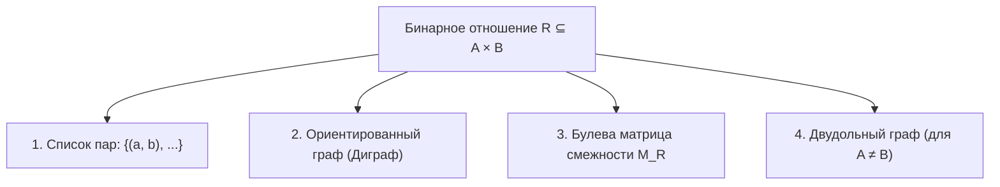
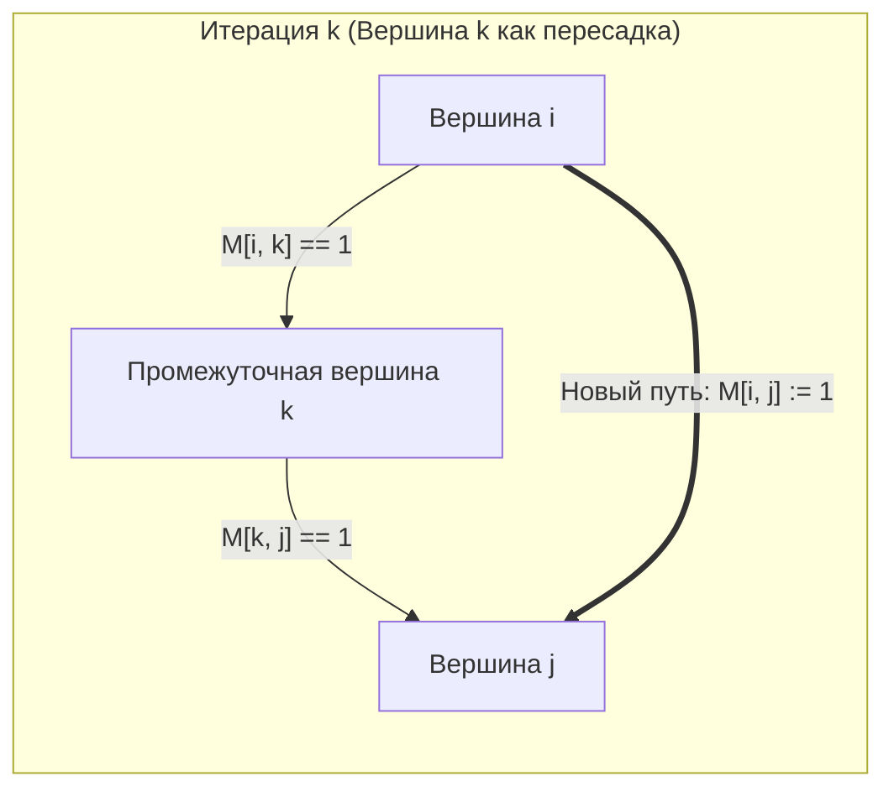

# 📌 Лекция 4: Отношения и эквивалентность

> [!abstract] О занятии
> - **Дисциплина:** [[Дискретная математика]] (1 семестр, Поток 2)
> - **Преподаватель (лектор):** Константин Чухарев ([@Lipen](https://github.com/Lipen), Университет ИТМО)
> - **Дата проведения:** 30 сентября 2026 года (среда, 09:50 — 11:20, ауд. 2342)
> - **Материалы курса:** Репозиторий [Lipen/discrete-math-course](https://github.com/Lipen/discrete-math-course), лекционная презентация `s1-lec04-relations.typ` (*«Отношения и эквивалентность»*), главы книги `m05` (*«Бинарные отношения»*, *«Отношения эквивалентности»*, *«Замыкания отношений»*).
> - **Эпиграфы занятия:**
>   - *«Пользователи больших банков данных должны быть защищены от необходимости знать, как данные организованы в машине.»* — Эдгар Кодд
>   - *«Порядок и связь идей те же, что порядок и связь вещей.»* — Бенедикт Спиноза
>   - *«Совокупность не есть груда: целое — нечто помимо частей.»* — Аристотель
>   - *«В наши дни ангел топологии и дьявол абстрактной алгебры борются за душу каждой отдельной математической области.»* — Герман Вейль
>   - *«Равные одному и тому же равны между собой.»* — Евклид
> - **Ключевые темы:** Бинарные отношения и способы задания (матрицы, орграфы, двудольные графы); 7 фундаментальных свойств (рефлексивность, иррефлексивность, симметричность, антисимметричность, асимметричность, транзитивность, тотальность); алгебра отношений (обращение, композиция, степени и пути); замыкания ($R^=, s(R), R^+, R^*$) и их алгебраические законы; алгоритм Уоршелла за $O(n^3)$ с инвариантом и пошаговой трассировкой; отношения эквивалентности, классы эквивалентности и их свойства; разбиение множества и фундаментальная теорема о биекции эквивалентностей и разбиений; фактор-множество, индекс отношения; сравнение по модулю $m$ и корректность модульной арифметики (well-definedness); комбинаторика отношений; минимальные контрпримеры; транзитивное сокращение (редукция); эквивалентное замыкание и компоненты связности; каноническая проекция и ядро отображения $\ker f$; конструкция поля $\mathbb{Q}$ как фактор-множества пар; решетка эквивалентностей («тоньше/грубее») и числа Белла; практические приложения (`GROUP BY` в SQL, хеш-таблицы, минимизация автоматов, Rust `PartialEq`/`Eq`, C++20 `std::equality_comparable`).

---

## 📌 Краткое резюме (TL;DR)

1. **Бинарное отношение** между $A$ и $B$ — это любое подмножество $R \subseteq A \times B$. Если $A = B$, то $R$ — отношение *на* множестве $A$. Задается 4 эквивалентными представлениями: списком упорядоченных пар, ориентированным графом (диграфом), логической булевой матрицей смежности $M_R \in \{0, 1\}^{|A| \times |B|}$ и двудольным графом.
2. **Фундаментальные свойства отношений:**
   - *Рефлексивность:* $\forall a : a R a \iff \mathrm{id}_A \subseteq R$ (главная диагональ матрицы состоит из $1$, у каждой вершины диграфа есть петля).
   - *Иррефлексивность:* $\forall a : \neg(a R a)$ (на главной диагонали только $0$, петель нет вообще). **Ловушка Липеня:** «не рефлексивно» (есть хотя бы один нуль) $\ne$ «иррефлексивно» (строго все нули).
   - *Симметричность:* $a R b \implies b R a \iff R = R^{-1}$ (матрица симметрична $M_R = M_R^T$, все ребра двунаправлены).
   - *Антисимметричность:* $a R b \land b R a \implies a = b$ (нет симметричных единиц вне диагонали). Симметричность и антисимметричность **не противоположны**: отношение тождества $\mathrm{id}_A$ симметрично и антисимметрично одновременно!
   - *Асимметричность:* $a R b \implies \neg(b R a) \iff$ **иррефлексивно $\land$ антисимметрично** (нет петель и нет взаимных ребер).
   - *Транзитивность:* $a R b \land b R c \implies a R c \iff R \circ R \subseteq R$. **Ловушка Липеня:** транзитивность требует замкнутости абсолютно всех доступных цепочек длины 2.
   - *Тотальность:* $\forall a \ne b : a R b \lor b R a$ (любые два различных элемента сравнимы).
3. **Композиция и степени:**
   - Композиция $S \circ R = \{(a, c) \mid \exists b : a R b \land b S c\}$ читается справа налево (сначала $R$, затем $S$) и соответствует булеву произведению матриц $M_{S \circ R} = M_R \odot M_S$. Ассоциативна: $(T \circ S) \circ R = T \circ (S \circ R)$. Обращение меняет порядок: $(S \circ R)^{-1} = R^{-1} \circ S^{-1}$.
   - Степень $R^k$ состоит из пар $(a, b)$, соединенных в диграфе ориентированным путем длины *ровно* $k$.
4. **Замыкания отношений:**
   - Замыкание по свойству $P$ — наименьшее по включению надмножество, обладающее свойством $P$. Корректно определено через пересечение надмножеств.
   - Рефлексивное: $R^= = R \cup \mathrm{id}_A$. Симметричное: $s(R) = R \cup R^{-1}$.
   - Транзитивное: $R^+ = \bigcup_{k=1}^n R^k$ (на конечном множестве мощности $n$ простые пути не длиннее $n-1$, поэтому объединение обрывается на $n$-й степени). Рефлексивно-транзитивное: $R^* = \bigcup_{k=0}^n R^k$.
   - **Порядок применения замыканий:** транзитивное замыкание применяется **строго последним**, так как оно не коммутирует с симметричным: $s(R^+) \ne (s(R))^+$.
5. **Алгоритм Уоршелла (Warshall):**
   - Вычисляет транзитивное замыкание $R^+$ за $O(n^3)$ методом динамического программирования на месте. Внешняя итерация по $k$ от $1$ до $n$ проверяет возможность транзитивной «пересадки» через вершину $k$: $M[i, j] \gets M[i, j] \lor (M[i, k] \land M[k, j])$.
6. **Отношение эквивалентности и разбиения:**
   - Эквивалентность ($\sim$) — рефлексивное, симметричное и транзитивное отношение. Ослабление (без транзитивности) дает *толерантность*.
   - Классы эквивалентности $[a] = \{b \in A \mid a \sim b\}$ либо **полностью совпадают** ($[a] = [b] \iff a \sim b$), либо **попарно не пересекаются** ($[a] \cap [b] = \varnothing \iff a \not\sim b$).
   - **Фундаментальная теорема:** множество классов эквивалентности образует **разбиение** множества $A$. Обратно: любое разбиение порождает единственное отношение эквивалентности.
   - Фактор-множество $A/\sim = \{[a] \mid a \in A\}$. Число классов называется **индексом** отношения.
7. **Алгебра классов, ядра и конструкции:**
   - Кольцо вычетов $\mathbb{Z}_m$ и проверка корректности операций (well-definedness): результат сложения $[a] + [b] = [a + b]$ и умножения не зависит от выбора представителей.
   - Построение поля рациональных чисел $\mathbb{Q}$ как фактор-множества $\mathbb{Z} \times (\mathbb{Z} \setminus \{0\})$ по отношению $(a, b) \sim (c, d) \iff ad = bc$.
   - Каноническая проекция $\pi(a) = [a]$ и ядро отображения $\ker f = \{(a, b) \mid f(a) = f(b)\}$. Всякое ядро — эквивалентность, всякая эквивалентность — ядро своей проекции ($f = \bar{f} \circ \pi$).
   - Число разбиений $n$-элементного множества задается **числами Белла** $B_n$ ($B_1=1, B_2=2, B_3=5, B_4=15, B_5=52$).

---

## 1. 🌐 Бинарные отношения и способы их представления

Объекты в дискретной математике и программировании редко существуют изолированно:
- Студент записан на определенный курс;
- Город соединен автомобильной или железной дорогой с другим городом;
- Одно целое число без остатка делит другое число;
- Пакет в пакетном менеджере зависит от сторонней библиотеки.

Множество отвечает на вопрос **«что есть»**, а отношение — на вопрос **«как они связаны»**.

> [!info] Определение бинарного отношения
> **Бинарным отношением** $R$ между множествами $A$ и $B$ называется любое подмножество их декартова произведения:
> $$R \subseteq A \times B$$
> Факт принадлежности пары $(a, b) \in R$ содержательно означает наличие связи между $a$ и $b$ и традиционно записывается в инфиксной нотации:
> $$a \, R \, b \iff (a, b) \in R$$
> Если множества совпадают ($A = B$), то подмножество $R \subseteq A \times A = A^2$ называется **бинарным отношением на множестве $A$**.

### Особые отношения на множестве $A$
На любом множестве $A$ выделяют три тривиальных отношения, задаваемых без дополнительных содержательных условий:
1. **Пустое отношение** $\varnothing \subseteq A \times A$: не содержит ни одной пары ($\forall a, b \in A : (a, b) \notin \varnothing$).
2. **Тождественное отношение (диагональ)** $\mathrm{id}_A = \Delta_A = \{(a, a) \mid a \in A\}$: каждый элемент связан строго с самим собой и ни с кем другим.
3. **Полное (универсальное) отношение** $A \times A$: содержит абсолютно все упорядоченные пары элементов множества $A$.

Любое бинарное отношение $R$ на множестве $A$ ограничено снизу и сверху по включению:
$$\varnothing \subseteq R \subseteq A \times A$$

На конечном множестве $A = \{1, 2, 3\}$ логические матрицы этих трех отношений наглядно демонстрируют границы включения:
$$M_{\varnothing} = \begin{pmatrix} 0 & 0 & 0 \\ 0 & 0 & 0 \\ 0 & 0 & 0 \end{pmatrix}, \quad M_{\mathrm{id}} = \begin{pmatrix} 1 & 0 & 0 \\ 0 & 1 & 0 \\ 0 & 0 & 1 \end{pmatrix}, \quad M_{A \times A} = \begin{pmatrix} 1 & 1 & 1 \\ 1 & 1 & 1 \\ 1 & 1 & 1 \end{pmatrix}$$

---

### Четыре способа представления отношений

Для конечных множеств используются четыре взаимодополняющих представления:



1. **Список пар (теоретико-множественное задание):**  
   Явное перечисление всех элементов подмножества: $R = \{(1, 1), (1, 2), (1, 5), (2, 3), (2, 4), (3, 1), (4, 2), (5, 3), (5, 5)\}$ на множестве $A = \{1, 2, 3, 4, 5\}$.
2. **Ориентированный граф (Диграф):**  
   Вершинами графа являются элементы множества $A$. Ориентированная дуга $u \to v$ проводится тогда и только тогда, когда $(u, v) \in R$. Пары вида $(u, u)$ изображаются петлями у вершины $u$.
3. **Логическая булева матрица отношения (Матрица смежности):**  
   Матрица $M_R$ размера $|A| \times |B|$ над булевым полукольцом $(\{0, 1\}, \lor, \land)$:
   $$M_R[i, j] = \begin{cases} 1, & (a_i, b_j) \in R \\ 0, & (a_i, b_j) \notin R \end{cases}$$
   - **Строка $i$** показывает, с кем связан элемент $a_i$ (исходящие дуги).
   - **Столбец $j$** показывает, кто связан с элементом $b_j$ (входящие дуги).
   - Единичная матрица $I_n$ соответствует тождественному отношению $\mathrm{id}_A$.
4. **Двудольный граф:**  
   Применяется, когда $A$ и $B$ различны. Элементы $A$ выписываются в левый столбец, элементы $B$ — в правый; ребра соединяют вершины левой доли с вершинами правой.

---

### Теоретико-множественные операции и обратное отношение

Поскольку отношения являются подмножествами, к ним напрямую применимы операции теории множеств:
- **Объединение:** $(a, b) \in R \cup S \iff (a, b) \in R \lor (a, b) \in S$;
- **Пересечение:** $(a, b) \in R \cap S \iff (a, b) \in R \land (a, b) \in S$;
- **Разность:** $(a, b) \in R \setminus S \iff (a, b) \in R \land (a, b) \notin S$;
- **Дополнение:** $\overline{R} = (A \times B) \setminus R$.

> [!info] Обратное отношение ($R^{-1}$)
> Отношение $R^{-1} \subseteq B \times A$ называется **обратным** к отношению $R \subseteq A \times B$, если оно состоит из всех пар $R$, прочитанных в обратном порядке:
> $$R^{-1} = \{(b, a) \in B \times A \mid (a, b) \in R\}$$

**Свойства обратного отношения:**
1. Инволютивность: $(R^{-1})^{-1} = R$.
2. Матрица обратного отношения является транспонированной: $M_{R^{-1}} = (M_R)^T$.
3. Сохранение теоретико-множественных операций: $(R \cup S)^{-1} = R^{-1} \cup S^{-1}$, $(R \cap S)^{-1} = R^{-1} \cap S^{-1}$.

---

## 2. 💎 Фундаментальные свойства бинарных отношений

Пусть $R \subseteq A \times A$ — бинарное отношение на множестве $A$. Классификация отношений базируется на 7 ключевых свойствах.

### 1. Рефлексивность
Отношение $R$ называется **рефлексивным**, если каждый элемент множества $A$ связан сам с собой:
$$\forall a \in A : a \, R \, a$$
*На матрице:* на всей главной диагонали стоят единицы ($M_R[i, i] = 1$).  
*На графе:* у каждой вершины есть петля.

### 2. Иррефлексивность
Отношение $R$ называется **иррефлексивным**, если ни один элемент множества $A$ не связан сам с собой:
$$\forall a \in A : \neg(a \, R \, a)$$
*На матрице:* на всей главной диагонали стоят нули ($M_R[i, i] = 0$).  
*На графе:* нет ни одной петли.

> [!warning] Ловушка Липеня: «Не рефлексивно» $\ne$ «Иррефлексивно»
> Иррефлексивность — это **не** просто отрицание рефлексивности!
> $$\text{Не рефлексивно} \iff \exists a \in A : \neg(a \, R \, a)$$
> $$\text{Иррефлексивно} \iff \forall a \in A : \neg(a \, R \, a)$$
> В первом случае петли могут присутствовать у части вершин (но не у всех), во втором — петли категорически запрещены у всех вершин. Большинство отношений не являются ни рефлексивными, ни иррефлексивными.

### 3. Симметричность
Отношение $R$ называется **симметричным**, если наличие связи в одну сторону влечет связь в обратную сторону:
$$\forall a, b \in A : a \, R \, b \implies b \, R \, a$$
*На матрице:* матрица симметрична относительно главной диагонали: $M_R = M_R^T$.  
*На графе:* каждое ориентированное ребро двунаправлено ($u \leftrightarrow v$).

### 4. Антисимметричность
Отношение $R$ называется **антисимметричным**, если взаимная связь возможна только для совпадающих элементов:
$$\forall a, b \in A : (a \, R \, b \land b \, R \, a) \implies a = b$$
*На матрице:* для любых $i \ne j$ элементы $M_R[i, j]$ и $M_R[j, i]$ не могут быть одновременно равны $1$.  
*На графе:* между любыми двумя различными вершинами существует не более одной направленной дуги (нет ориентированных циклов длины 2).

> [!important] Важнейший факт Липеня
> Симметричность и антисимметричность — **не противоположности**!
> Отношение равенства $\mathrm{id}_A = \{(a, a) \mid a \in A\}$ **одновременно симметрично и антисимметрично**! Отношение может быть симметричным, антисимметричным, обладать обоими свойствами сразу или не обладать ни одним из них.

### 5. Асимметричность
Отношение $R$ называется **асимметричным**, если связь в одну сторону категорически исключает связь в обратную сторону (включая петли):
$$\forall a, b \in A : a \, R \, b \implies \neg(b \, R \, a)$$

> [!important] Теорема (Критерий асимметричности)
> Бинарное отношение $R$ асимметрично тогда и только тогда, когда оно одновременно **иррефлексивно** и **антисимметрично**:
> $$\text{Асимметричность} \iff \text{Иррефлексивность} \land \text{Антисимметричность}$$

> [!note] Доказательство
> **$(\implies)$ Необходимость:**
> 1. Пусть $R$ асимметрично. Если предположить, что $\exists a : a R a$, то по асимметричности должно следовать $\neg(a R a)$, что дает противоречие $a R a \land \neg(a R a)$. Значит, $\forall a : \neg(a R a)$, то есть $R$ иррефлексивно.
> 2. Проверим антисимметричность. Пусть $a R b$ и $b R a$. Если $a \ne b$, то по асимметричности из $a R b$ следует $\neg(b R a)$, что противоречит наличию пары $b R a$. Значит, случай $a \ne b$ невозможен, и $a = b$. Отношение антисимметрично.
>
> **$(\impliedby)$ Достаточность:**
> Пусть $R$ иррефлексивно и антисимметрично. Возьмем произвольную пару $a R b$. Предположим от противного, что $b R a$ истинно. Тогда в силу антисимметричности $a = b$. Но тогда пара $a R b$ превращается в петлю $a R a$, что прямо противоречит иррефлексивности ($\forall a : \neg(a R a)$). Следовательно, $b R a$ ложно ($\neg(b R a)$), и $R$ асимметрично. $\blacksquare$

### 6. Транзитивность
Отношение $R$ называется **транзитивным**, если связь передается по цепочке длины 2:
$$\forall a, b, c \in A : (a \, R \, b \land b \, R \, c) \implies a \, R \, c$$
*На матрице:* $M_R^2 \le M_R$ (в смысле покомпонентного сравнения в булевой арифметике).  
*На графе:* для любого пути $u \to v \to w$ обязательно существует замыкающая хорда $u \to w$.

> [!warning] Ловушка Липеня: «Одной тройки мало»
> Транзитивность — строгое универсальное требование. Наличие замыкающих ребер для 99 троек вершин не делает отношение транзитивным, если хотя бы для одной тройки $(x, y, z)$ при $x R y$ и $y R z$ отсутствует ребро $x R z$!

### 7. Тотальность (Линейность)
Отношение $R$ называется **тотальным** (или линейным, связным), если любые два различных элемента множества $A$ сравнимы хотя бы в одном направлении:
$$\forall a, b \in A : a \ne b \implies (a \, R \, b \lor b \, R \, a)$$

---

### Алгебраическая характеризация свойств через операции

Свойства отношений приобретают максимальную строгость, когда они формулируются как алгебраические включения:

> [!important] Теоремы алгебраической характеризации
> 1. **Рефлексивность:** $R \text{ рефлексивно} \iff \mathrm{id}_A \subseteq R$.  
>    *Доказательство:* $\forall a : (a, a) \in \mathrm{id}_A \implies (a, a) \in R \iff a R a$. $\blacksquare$
> 2. **Симметричность:** $R \text{ симметрично} \iff R = R^{-1}$.  
>    *Доказательство:* Если $(a, b) \in R$, то по симметричности $(b, a) \in R \iff (a, b) \in R^{-1} \implies R \subseteq R^{-1}$. Аналогично из $(a, b) \in R^{-1}$ следует $(b, a) \in R \implies (a, b) \in R \implies R^{-1} \subseteq R$. Взаимное включение дает $R = R^{-1}$. $\blacksquare$
> 3. **Транзитивность:** $R \text{ транзитивно} \iff R \circ R \subseteq R$.  
>    *Доказательство:* $(a, c) \in R \circ R \iff \exists b : a R b \land b R c$. По транзитивности отсюда следует $a R c$, то есть $(a, c) \in R$. Обратно, если $a R b$ и $b R c$, то $(a, c) \in R \circ R \subseteq R \implies a R c$. $\blacksquare$

---

### Сводная аналитическая таблица фундаментальных свойств

| Свойство | Кванторное определение | Вид на матрице $M_R$ | Вид на ориентированном графе | Алгебраический критерий |
| :--- | :--- | :--- | :--- | :--- |
| **Рефлексивность** | $\forall a \in A : a R a$ | На главной диагонали строго единицы ($M[i, i] = 1$) | Петля у абсолютно каждой вершины | $\mathrm{id}_A \subseteq R$ |
| **Иррефлексивность** | $\forall a \in A : \neg(a R a)$ | На главной диагонали строго нули ($M[i, i] = 0$) | Полное отсутствие петель у всех вершин | $R \cap \mathrm{id}_A = \varnothing$ |
| **Симметричность** | $\forall a, b : a R b \implies b R a$ | Матрица строго симметрична: $M_R = M_R^T$ | Все направленные ребра взаимны ($u \leftrightarrow v$) | $R = R^{-1}$ |
| **Антисимметричность** | $\forall a, b : a R b \land b R a \implies a = b$ | Вне диагонали нет симметричных единиц: $M[i,j] \land M[j,i] = 0$ ($i \ne j$) | Нет ориентированных циклов длины 2 | $R \cap R^{-1} \subseteq \mathrm{id}_A$ |
| **Асимметричность** | $\forall a, b : a R b \implies \neg(b R a)$ | На диагонали нули, вне диагонали нет симметричных единиц | Нет петель и нет двусторонних стрелок | $R \cap R^{-1} = \varnothing$ |
| **Транзитивность** | $\forall a, b, c : a R b \land b R c \implies a R c$ | Булев квадрат матрицы не превосходит исходную: $M_R^2 \le M_R$ | Любой путь из 2 ребер стянут замыкающей хордой | $R \circ R \subseteq R$ |
| **Тотальность** | $\forall a \ne b : a R b \lor b R a$ | Для всех $i \ne j$ выполнено $M[i, j] \lor M[j, i] = 1$ | Между любыми двумя вершинами есть хотя бы одна стрелка | $R \cup R^{-1} \cup \mathrm{id}_A = A \times A$ |

---

### Практический разбор проверки свойств на примере Липеня
Пусть $A = \{1, 2, 3\}$, а отношение задано списком:
$$R = \{(1, 1), (1, 2), (2, 1), (2, 2), (3, 3)\}$$

1. **Рефлексивность:** Истинно. Пары $(1, 1), (2, 2), (3, 3)$ присутствуют.
2. **Иррефлексивность:** Ложно. Все три петли присутствуют.
3. **Симметричность:** Истинно. Недиагональная пара $(1, 2)$ сбалансирована парой $(2, 1)$. Матрица $M_R = \begin{pmatrix} 1 & 1 & 0 \\ 1 & 1 & 0 \\ 0 & 0 & 1 \end{pmatrix}$ симметрична.
4. **Антисимметричность:** Ложно. Присутствуют пары $(1, 2)$ и $(2, 1)$, однако $1 \ne 2$.
5. **Асимметричность:** Ложно (нарушены и иррефлексивность, и антисимметричность).
6. **Транзитивность:** Истинно. Проверим нетривиальные цепочки:
   - $(1, 2) \land (2, 1) \implies (1, 1) \in R$ (верно);
   - $(2, 1) \land (1, 2) \implies (2, 2) \in R$ (верно).
7. **Тотальность:** Ложно. Элементы $1$ и $3$ не сравнимы: $(1, 3) \notin R$ и $(3, 1) \notin R$.

---

## 3. ⛓️ Композиция отношений и степени

> [!info] Определение композиции отношений
> Пусть $R \subseteq A \times B$ и $S \subseteq B \times C$. **Композицией отношений** называется отношение $S \circ R \subseteq A \times C$, связывающее элементы через промежуточный элемент множества $B$:
> $$S \circ R = \{(a, c) \in A \times C \mid \exists b \in B : (a, b) \in R \land (b, c) \in S\}$$

> [!warning] Внимание к порядку записи!
> В курсе К. Чухарева принята стандартная математическая нотация (аналогичная композиции функций $(g \circ f)(x) = g(f(x))$): запись $S \circ R$ читается **справа налево**: сначала применяется отношение $R$, затем отношение $S$.
> *Параллель из жизни:* если $R$ — отношение «быть родителем», то $R \circ R$ — отношение «быть дедушкой или бабушкой» ($a$ родитель $b$, а $b$ родитель $c$).

### Композиция как склейка путей и булево умножение матриц
В ориентированном графе промежуточный элемент $b$ выступает «пересадкой»: путь из двух звеньев $a \to b \to c$ сжимается композицией в одно ребро $a \to c$.  
На матрицах смежности операция композиции точно соответствует **булеву умножению матриц**:
$$M_{S \circ R} = M_R \odot M_S$$
где элемент результирующей матрицы вычисляется через дизъюнкцию конъюнкций:
$$M_{S \circ R}[i, j] = \bigvee_{k=1}^{|B|} (M_R[i, k] \land M_S[k, j])$$

> [!example] Числовой пример композиции
> Для $R = \{(1, 2), (2, 3)\}$ на множестве $\{1, 2, 3\}$:
> $$M_R = \begin{pmatrix} 0 & 1 & 0 \\ 0 & 0 & 1 \\ 0 & 0 & 0 \end{pmatrix}, \quad M_{R \circ R} = M_R \odot M_R = \begin{pmatrix} 0 & 0 & 1 \\ 0 & 0 & 0 \\ 0 & 0 & 0 \end{pmatrix}$$
> Результирующее отношение содержит единственную пару: $R \circ R = \{(1, 3)\}$.

---

### Фундаментальные теоремы композиции

> [!important] Теорема (Ассоциативность композиции)
> Композиция отношений ассоциативна:
> $$(T \circ S) \circ R = T \circ (S \circ R)$$

> [!note] Доказательство
> Докажем равенство через взаимное включение подмножеств:
> 1. Пусть $(a, d) \in (T \circ S) \circ R$. По определению композиции существует $c \in C$ такое, что $(a, c) \in R$ и $(c, d) \in T \circ S$. Из условия $(c, d) \in T \circ S$ следует существование элемента $b \in B$ такого, что $(c, b) \in S$ и $(b, d) \in T$.
>    Рассмотрим пару $(a, b)$: так как $(a, c) \in R$ и $(c, b) \in S$, по определению композиции $(a, b) \in S \circ R$. Имея $(a, b) \in S \circ R$ и $(b, d) \in T$, получаем $(a, d) \in T \circ (S \circ R)$. Значит, $(T \circ S) \circ R \subseteq T \circ (S \circ R)$.
> 2. Обратное включение $T \circ (S \circ R) \subseteq (T \circ S) \circ R$ доказывается абсолютно симметрично.
> Взаимное включение доказывает строгое равенство. $\blacksquare$

> [!important] Теорема (Обращение композиции)
> Для любых отношений $R \subseteq A \times B$ и $S \subseteq B \times C$:
> $$(S \circ R)^{-1} = R^{-1} \circ S^{-1}$$

> [!note] Доказательство
> Проведем цепочку эквивалентных преобразований:
> $$(a, c) \in (S \circ R)^{-1} \iff (c, a) \in S \circ R \iff \exists b \in B : (c, b) \in R \land (b, a) \in S$$
> $$(c, b) \in R \iff (b, c) \in R^{-1}, \quad (b, a) \in S \iff (a, b) \in S^{-1}$$
> Значит: $\exists b \in B : (a, b) \in S^{-1} \land (b, c) \in R^{-1} \iff (a, c) \in R^{-1} \circ S^{-1}$. $\blacksquare$

---

### Степени отношения и пути в графе

Благодаря ассоциативности определено понятие целой положительной степени отношения:
$$R^1 = R, \quad R^{k+1} = R^k \circ R$$

> [!important] Теорема (Связь степеней отношения и путей в диграфе)
> Пара $(a, b)$ принадлежит $k$-й степени отношения $R^k$ тогда и только тогда, когда в ориентированном графе отношения существует ориентированный путь из вершины $a$ в вершину $b$, состоящий **ровно из $k$ ребер**.

> [!note] Доказательство индукцией по $k$
> - **База индукции ($k = 1$):** $(a, b) \in R^1 = R \iff$ в графе существует ребро $a \to b$, то есть ориентированный путь длины 1.
> - **Индукционный переход ($k \to k+1$):** Пусть утверждение доказано для степени $k$.
>   Пара $(a, c) \in R^{k+1} = R^k \circ R$ по определению означает:
>   $$\exists b \in A : (a, b) \in R \land (b, c) \in R^k$$
>   По предположению индукции пара $(b, c) \in R^k$ задает путь из $b$ в $c$ длины ровно $k$. Пара $(a, b) \in R$ задает первое ребро $a \to b$ длины 1. Объединение ребра $a \to b$ и пути $b \rightsquigarrow c$ длины $k$ дает ориентированный путь из $a$ в $c$ длины ровно $k + 1$. Переход доказан. $\blacksquare$

## 4. 🔄 Замыкания отношений и алгоритм Уоршелла

Иногда бинарное отношение «почти» обладает требуемым свойством, и для его выполнения не хватает некоторого минимального набора пар.

> [!info] Определение замыкания отношения
> **Замыканием** отношения $R$ относительно свойства $P$ (обозначается $\mathrm{Cl}_P(R)$ или $R_P$) называется **наименьшее по включению** отношение, которое содержит $R$ и обладает свойством $P$:
> 1. $R \subseteq \mathrm{Cl}_P(R)$;
> 2. $\mathrm{Cl}_P(R)$ обладает свойством $P$;
> 3. Для любого отношения $T \subseteq A \times A$, обладающего свойством $P$: если $R \subseteq T$, то $\mathrm{Cl}_P(R) \subseteq T$.

> [!important] Теорема (Корректность и единственность замыкания)
> Для рефлексивности, симметричности и транзитивности пересечение любого непустого семейства отношений, содержащих $R$ и обладающих свойством $P$, само содержит $R$ и обладает свойством $P$:
> $$\mathrm{Cl}_P(R) = \bigcap_{\substack{R \subseteq T \\ T \text{ обладает } P}} T$$

> [!note] Доказательство
> 1. Поскольку каждое $T$ семейства содержит $R$, их пересечение $\bigcap T$ также обязательно содержит $R$.
> 2. **Рефлексивность:** $\forall T : \mathrm{id}_A \subseteq T \implies \mathrm{id}_A \subseteq \bigcap T$.
> 3. **Симметричность:** Если $(a, b) \in \bigcap T$, то $\forall T : (a, b) \in T \implies (b, a) \in T \implies (b, a) \in \bigcap T$.
> 4. **Транзитивность:** Если $(a, b) \in \bigcap T$ и $(b, c) \in \bigcap T$, то в каждом $T$ выполнено $a T b \land b T c \implies (a, c) \in T \implies (a, c) \in \bigcap T$.
> Пересечение надмножеств является наименьшим по включению, что гарантирует существование и единственность замыкания. $\blacksquare$

---

### Три базовых замыкания

1. **Рефлексивное замыкание ($R^=$):**  
   Добавляются только недостающие диагональные петли:
   $$R^= = R \cup \mathrm{id}_A = R \cup \{(a, a) \mid a \in A\}$$
2. **Симметричное замыкание ($s(R)$):**  
   Добавляются недостающие обратные ребра:
   $$s(R) = R \cup R^{-1}$$
3. **Транзитивное замыкание ($R^+$):**  
   Объединение всех натуральных степеней отношения (пути любой ненулевой длины):
   $$R^+ = \bigcup_{k=1}^\infty R^k = R \cup R^2 \cup R^3 \cup \dots$$
4. **Рефлексивно-транзитивное замыкание ($R^*$):**  
   Включает пути длины 0 (диагональ $\mathrm{id}_A$):
   $$R^* = R^= \cup R^+ = \bigcup_{k=0}^\infty R^k, \quad \text{где } R^0 = \mathrm{id}_A$$

---

### Теорема о конечной границе транзитивного замыкания

На бесконечных множествах ряд объединения степеней может быть бесконечным. Однако для конечных множеств процесс всегда обрывается:

> [!important] Теорема (Конечная граница Липеня)
> Если мощность множества $|A| = n$, то транзитивное замыкание полностью исчерпывается первыми $n$ степенями:
> $$R^+ = \bigcup_{k=1}^n R^k$$
> А для любых двух различных элементов $a \ne b$ пара $(a, b) \in R^+$ соединена простым путем длины не более $n - 1$.

> [!note] Доказательство через исключение циклов
> Пусть $(a, b) \in R^+$, то есть между $a$ и $b$ в графе отношения существует ориентированный путь. Рассмотрим **кратчайший** ориентированный путь $\pi: a = v_0 \to v_1 \to v_2 \to \dots \to v_m = b$.
> Если длина пути $m \ge n$, то в последовательности вершин $(v_0, v_1, \dots, v_m)$ присутствует ровно $m + 1 \ge n + 1$ вершин.  
> По принципу Дирихле среди них найдутся две совпадающие вершины: $\exists i < j : v_i = v_j$.  
> Участок пути $v_i \to v_{i+1} \to \dots \to v_j$ образует ориентированный цикл. Удалив этот цикл, мы получаем путь из $a$ в $b$ строго меньшей длины $m - (j - i) < m$, что противоречит предположению о минимальности длины пути $\pi$.  
> Следовательно, кратчайший путь не может содержать повторяющихся вершин (является простым). Число промежуточных вершин простого пути не превосходит $n - 1$, а число ребер — не более $n - 1$ (при $a \ne b$) или не более $n$ (при $a = b$). Таким образом, объединение степеней свыше $n$ не добавляет новых пар. $\blacksquare$

---

### Почему одного прохода добавления пар недостаточно?

> [!warning] Принцип каскадного распространения связей
> Наивная попытка «замкнуть отношение за один шаг», добавив пары $(a, c)$ для всех исходных цепочек $a R b \land b R c$, **не дает** транзитивного замыкания!  
> *Пример:* Рассмотрим ориентированную цепь $R = \{(1, 2), (2, 3), (3, 4)\}$.
> - Первый проход свяжет элементы через 1 шаг: добавятся $(1, 3)$ и $(2, 4)$.
> - Но пара $(1, 3)$ — новое ребро! Теперь возникает цепочка $(1, 3)$ и $(3, 4)$, требующая добавления пары $(1, 4)$. Это произойдет только на **втором** проходе.  
> Для цепочки из $n$ звеньев потребуется ровно $n - 1$ последовательных проходов.

---

### Алгебраические законы и порядок применения замыканий

Операторы замыкания удовлетворяют трем классическим свойствам оператора замыкания Куратовского:
1. **Экстенсивность:** $R \subseteq R^=$, $R \subseteq s(R)$, $R \subseteq R^+$;
2. **Идемпотентность:** повторное замыкание нейтрально: $\mathrm{Cl}_P(\mathrm{Cl}_P(R)) = \mathrm{Cl}_P(R)$;
3. **Монотонность:** если $R_1 \subseteq R_2$, то $\mathrm{Cl}_P(R_1) \subseteq \mathrm{Cl}_P(R_2)$.

> [!important] Теорема (Дистрибутивность замыканий)
> Рефлексивное и симметричное замыкания дистрибутивны относительно объединения:
> $$s(R_1 \cup R_2) = s(R_1) \cup s(R_2), \quad (R_1 \cup R_2)^= = R_1^= \cup R_2^=$$
> **Транзитивное замыкание дистрибутивностью по объединению НЕ обладает:**
> $$(R_1 \cup R_2)^+ \supset R_1^+ \cup R_2^+$$

> [!example] Контрпример к дистрибутивности транзитивного замыкания
> Возьмем $R_1 = \{(1, 2)\}$ и $R_2 = \{(2, 3)\}$.  
> По отдельности путей длины 2 нет: $R_1^+ = R_1$ и $R_2^+ = R_2$, их объединение $R_1^+ \cup R_2^+ = \{(1, 2), (2, 3)\}$.  
> Однако в объединении $R_1 \cup R_2$ возникает сцепка $1 \to 2 \to 3$, порождающая транзитивное замыкание:
> $$(R_1 \cup R_2)^+ = \{(1, 2), (2, 3), (1, 3)\} \ne R_1^+ \cup R_2^+$$

> [!caution] Критическое правило Липеня: Транзитивное замыкание выполняется строго последним!
> Операторы рефлексивного и симметричного замыкания коммутируют: $s(R^=) = (s(R))^=$.  
> Однако транзитивное замыкание **не коммутирует** с симметричным:
> $$s(R^+) \ne (s(R))^+$$
> *Контрпример Липеня:* Пусть $R = \{(1, 2), (1, 3)\}$ на $\{1, 2, 3\}$.
> - Порядок $s(R^+)$: путей длины 2 в $R$ нет, поэтому $R^+ = R$. Затем симметричное замыкание дает $s(R^+) = \{(1, 2), (2, 1), (1, 3), (3, 1)\}$.
> - Порядок $(s(R))^+$: сначала $s(R) = \{(1, 2), (2, 1), (1, 3), (3, 1)\}$. В графе появляются пути $2 \to 1 \to 3$ и $3 \to 1 \to 2$. Транзитивное замыкание обязано добавить $(2, 3)$ и $(3, 2)$, а также петли $(1, 1), (2, 2), (3, 3)$. Итог: **полное отношение** $\{1, 2, 3\}^2$!  
> **Вывод:** если отношение достраивается до эквивалентности, транзитивное замыкание применяется в самом конце: $e(R) = (s(R^=))^+ = (R \cup R^{-1} \cup \mathrm{id}_A)^+$.

---

### Алгоритм Уоршелла (Warshall's Algorithm) за $O(n^3)$

Наивное вычисление $R^+ = \bigcup_{k=1}^n R^k$ через матричное умножение требует вычисления $n$ степеней матрицы: каждое булево умножение размера $n \times n$ стоит $O(n^3)$, суммарно — $O(n^4)$ операций.  
Стивен Уоршелл (1962) предложил алгоритм динамического программирования, вычисляющий $R^+$ за **$O(n^3)$ шагов на месте** (in-place).



#### Академический псевдокод в нотации CLRS:
$$\begin{array}{ll}
\textsc{Warshall-Transitive-Closure}(M, n): \\
\mathbf{1} & \textbf{for } k \leftarrow 1 \textbf{ to } n \\
\mathbf{2} & \quad \textbf{for } i \leftarrow 1 \textbf{ to } n \\
\mathbf{3} & \quad\quad \textbf{for } j \leftarrow 1 \textbf{ to } n \\
\mathbf{4} & \quad\quad\quad M[i, j] \leftarrow M[i, j] \lor (M[i, k] \land M[k, j]) \\
\mathbf{5} & \textbf{return } M
\end{array}$$

#### Реализация на Rust (из презентации Липеня):
```rust
for k in 1..=n {
    for i in 1..=n {
        for j in 1..=n {
            m[i][j] |= m[i][k] && m[k][j];
        }
    }
}
```

#### Эталонная компилируемая реализация на Modern C++20:
```cpp
#include <vector>
#include <cstddef>
#include <concepts>

// Вычисление транзитивного замыкания графа/отношения алгоритмом Уоршелла
[[nodiscard]] std::vector<std::vector<bool>> warshall_transitive_closure(
    std::vector<std::vector<bool>> reach, 
    std::size_t n
) noexcept {
    for (std::size_t k = 0; k < n; ++k) {
        for (std::size_t i = 0; i < n; ++i) {
            // Оптимизация: если из i нет пути в k, проверять j бессмысленно
            if (!reach[i][k]) continue;
            for (std::size_t j = 0; j < n; ++j) {
                reach[i][j] = reach[i][j] || reach[k][j];
            }
        }
    }
    return reach;
}
```

---

### Теорема об инварианте алгоритма Уоршелла

> [!important] Теорема (Инвариант внешнего цикла)
> Пусть $M^{(k)}[i, j]$ — значение ячейки матрицы после завершения внешней итерации с параметром $k$.  
> Тогда $M^{(k)}[i, j] = 1$ тогда и только тогда, когда в ориентированном графе существует ориентированный путь из вершины $i$ в вершину $j$, **все промежуточные вершины которого принадлежат подмножеству $\{1, 2, \dots, k\}$**.

> [!note] Доказательство индукцией по номеру фазы $k$
> - **База индукции ($k = 0$):** До начала циклов подмножество промежуточных вершин пусто. Путь без промежуточных вершин — это непосредственное ориентированное ребро $i \to j$. Матрица $M^{(0)}$ в точности совпадает с исходной матрицей смежности $M_R$. База верна.
> - **Индукционный переход ($k-1 \to k$):**  
>   Пусть инвариант выполнен для шага $k-1$. Рассмотрим путь из $i$ в $j$ с промежуточными вершинами из множества $\{1, 2, \dots, k\}$:
>   1. *Случай 1 (путь не проходит через вершину $k$):* Все промежуточные вершины лежат в $\{1, \dots, k-1\}$. По предположению индукции уже на шаге $k-1$ было $M^{(k-1)}[i, j] = 1$. Операция дизъюнкции $M[i, j] \lor \dots$ сохраняет значение 1.
>   2. *Случай 2 (путь проходит через вершину $k$):* Кратчайший такой путь проходит через вершину $k$ ровно один раз. Он разбивается на префикс $i \rightsquigarrow k$ и суффикс $k \rightsquigarrow j$. Все промежуточные вершины префикса и суффикса строго принадлежат подмножеству $\{1, \dots, k-1\}$. По предположению индукции $M^{(k-1)}[i, k] = 1$ и $M^{(k-1)}[k, j] = 1$.  
>   Строка 4 алгоритма выполняет $M[i, j] \gets M[i, j] \lor (1 \land 1) = 1$.  
> На шаге $k=n$ множество промежуточных вершин разрешает любые вершины $\{1, \dots, n\}$, то есть $M^{(n)}$ содержит все достижимые пары. $\blacksquare$

---

### Пошаговая трассировка алгоритма Уоршелла (Пример Липеня)

Рассмотрим отношение $R = \{(1, 2), (2, 3)\}$ на множестве трех вершин $\{1, 2, 3\}$.

Исходная матрица $M^{(0)}$:
$$M^{(0)} = \begin{pmatrix} 0 & 1 & 0 \\ 0 & 0 & 1 \\ 0 & 0 & 0 \end{pmatrix}$$

1. **Итерация $k = 1$ (пересадка через вершину 1):**  
   Входящих ребер в вершину 1 нет (столбец 1 пуст: $M[i, 1] = 0$ для всех $i$). Никаких новых путей через вершину 1 не открывается:
   $$M^{(1)} = \begin{pmatrix} 0 & 1 & 0 \\ 0 & 0 & 1 \\ 0 & 0 & 0 \end{pmatrix}$$
2. **Итерация $k = 2$ (пересадка через вершину 2):**  
   Проверяем пары с участием 2: $M^{(1)}[1, 2] = 1$ и $M^{(1)}[2, 3] = 1$.  
   Алгоритм вычисляет: $M^{(2)}[1, 3] \gets M^{(1)}[1, 3] \lor (M^{(1)}[1, 2] \land M^{(1)}[2, 3]) = 0 \lor (1 \land 1) = 1$.
   $$M^{(2)} = \begin{pmatrix} 0 & 1 & \mathbf{1} \\ 0 & 0 & 1 \\ 0 & 0 & 0 \end{pmatrix}$$
3. **Итерация $k = 3$ (пересадка через вершину 3):**  
   Из вершины 3 нет исходящих ребер (строка 3 пуста: $M[3, j] = 0$ для всех $j$). Матрица не меняется:
   $$M^{(3)} = \begin{pmatrix} 0 & 1 & 1 \\ 0 & 0 & 1 \\ 0 & 0 & 0 \end{pmatrix}$$
Итог: транзитивное замыкание $R^+ = \{(1, 2), (2, 3), (1, 3)\}$.

## 5. 🧩 Отношения эквивалентности, классы и фактор-множества

> [!abstract] Философия эквивалентности: «Что считать одним и тем же?»
> В математике и Computer Science идеальное равенство ($a = b$) зачастую избыточно жестко: объект равен строго только самому себе.  
> **Эквивалентность** — это то же понятие «равно», но *по выбранному существенному признаку* с намеренным игнорированием несущественных различий:
> - Записи $10 \pmod 3$, $7 \pmod 3$ и $13 \pmod 3$ визуально различны, но по признаку остатка деления на 3 представляют один и тот же математический объект.
> - Дроби $\frac{1}{2}$, $\frac{2}{4}$, $\frac{3}{6}$ записаны разными числами, но выражают одну и ту же величину.
> - Два состояния конечного автомата могут иметь разные номера, но вести себя одинаково для всех входных слов.

> [!info] Определение отношения эквивалентности
> Бинарное отношение $\sim$ на множестве $A$ называется **отношением эквивалентности**, если оно удовлетворяет трем фундаментальным аксиомам:
> 1. **Рефлексивность:** $\forall a \in A : a \sim a$;
> 2. **Симметричность:** $\forall a, b \in A : a \sim b \implies b \sim a$;
> 3. **Транзитивность:** $\forall a, b, c \in A : (a \sim b \land b \sim c) \implies a \sim c$.

> [!note] Отношение толерантности (сходства)
> Если отношение рефлексивно и симметрично, но **не транзитивно**, оно называется **отношением толерантности**.  
> *Пример толерантности:* «Расстояние между городами не более 50 км» или «Коэффициент сходства Жаккара $J(A, B) = \frac{|A \cap B|}{|A \cup B|} \ge \theta$». Элемент $A$ близок к $B$, $B$ близок к $C$, но $A$ и $C$ могут отстоять далеко. Толерантность порождает пересекающиеся кластеры, но **не способна разбить множество на непересекающиеся блоки**!

---

### Классы эквивалентности и их структура

Склейка элементов в новые агрегированные объекты формализуется через классы эквивалентности:

> [!info] Определение класса эквивалентности
> Пусть $\sim$ — отношение эквивалентности на множестве $A$. **Классом эквивалентности** элемента $a \in A$ называется подмножество всех элементов множества $A$, эквивалентных элементу $a$:
> $$[a]_\sim = \{x \in A \mid a \sim x\}$$
> Сам элемент $a$ (как и любой другой элемент $x \in [a]$) называется **представителем** данного класса.

> [!important] Теорема (Фундаментальные свойства классов эквивалентности)
> Для любого отношения эквивалентности $\sim$ на множестве $A$:
> 1. $\forall a \in A : a \in [a]$ (каждый элемент принадлежит собственному классу);
> 2. $[a] = [b] \iff a \sim b$ (классы двух элементов совпадают тогда и только тогда, когда элементы эквивалентны);
> 3. $[a] \cap [b] = \varnothing \iff a \not\sim b$ (**два класса эквивалентности либо полностью совпадают, либо попарно не пересекаются**).

> [!note] Доказательство
> 1. По рефлексивности $a \sim a$, следовательно, по определению класса $a \in [a]$.
> 2. **$(\implies)$** Пусть $[a] = [b]$. Так как $b \in [b]$, то $b \in [a]$, откуда по определению класса $a \sim b$.  
>    **$(\impliedby)$** Пусть $a \sim b$. Возьмем произвольный $x \in [b] \implies b \sim x$. По транзитивности из $a \sim b$ и $b \sim x$ следует $a \sim x \implies x \in [a]$, то есть $[b] \subseteq [a]$. В силу симметричности $b \sim a$, аналогично получаем $[a] \subseteq [b]$. Значит, $[a] = [b]$.
> 3. Предположим, что $[a] \cap [b] \ne \varnothing$, то есть существует общий элемент $c \in [a] \cap [b]$.  
>    Тогда $a \sim c$ и $b \sim c$. По симметричности $c \sim b$, а по транзитивности $a \sim b$. Но по пункту 2 отсюда следует $[a] = [b]$.  
>    Таким образом, если классы пересеклись хотя бы по одному элементу, они обязаны полностью совпасть. Если же $a \not\sim b$, пересечение гарантированно пусто. $\blacksquare$

---

### Матричный и графовый вид отношения эквивалентности

Если упорядочить элементы множества $A$ по классам эквивалентности (сначала все элементы первого класса, затем второго и т.д.):
- **В матрице смежности:** матрица $M_\sim$ принимает строгий **блочно-диагональный вид**: на главной диагонали расположены сплошные блоки из единиц размера $|[a_k]| \times |[a_k]|$, а вне этих блоков стоят строго нули.
- **В графе отношения:** граф распадается на несвязное объединение **полных ориентированных клик с петлями у каждой вершины**. Между различными кликами нет ни одного ориентированного ребра!

```
    Класс 1          Класс 2
  [ 1  1  1 ]       [ 0  0 ]
  [ 1  1  1 ]       [ 0  0 ]
  [ 1  1  1 ]       [ 0  0 ]
  --------------------------
  [ 0  0  0 ]       [ 1  1 ]
  [ 0  0  0 ]       [ 1  1 ]
```

---

### Разбиения множества и Фундаментальная теорема соответствия

> [!info] Определение разбиения множества (Partition)
> **Разбиением** множества $A$ называется семейство непустых подмножеств $\mathcal{P} = \{B_i\}_{i \in I}$ ($B_i \subseteq A$), удовлетворяющее трем условиям:
> 1. Все блоки непусты: $\forall i \in I : B_i \ne \varnothing$;
> 2. Блоки попарно не пересекаются: $\forall i \ne j : B_i \cap B_j = \varnothing$;
> 3. Блоки в объединении покрывают все исходное множество: $\bigcup_{i \in I} B_i = A$.

> [!important] Фундаментальная теорема (Взаимно-однозначное соответствие эквивалентностей и разбиений)
> 1. Для любого отношения эквивалентности $\sim$ на множестве $A$ семейство всех его классов эквивалентности $A/\sim = \{[a]_\sim \mid a \in A\}$ является разбиением множества $A$.
> 2. Обратно: для любого разбиения $\mathcal{P} = \{B_i\}_{i \in I}$ множества $A$ бинарное отношение $R_\mathcal{P}$, заданное правилом:
>    $$a \, R_\mathcal{P} \, b \iff \exists i \in I : a \in B_i \land b \in B_i \quad \text{(«лежать в одном блоке»)}$$
>    является отношением эквивалентности на $A$, причем разбиение на классы по отношению $R_\mathcal{P}$ в точности совпадает с исходным разбиением $\mathcal{P}$.

> [!note] Доказательство
> 1. **От эквивалентности к разбиению:**
>    - Непустота: для любого $[a]$ имеем $a \in [a] \implies [a] \ne \varnothing$.
>    - Непересекаемость: доказано выше — различные классы попарно не пересекаются.
>    - Покрытие: так как $\forall a \in A : a \in [a]$, то $A = \bigcup_{a \in A} \{a\} \subseteq \bigcup_{a \in A} [a] \subseteq A \implies \bigcup [a] = A$.
> 2. **От разбиения к эквивалентности:**
>    - Рефлексивность: так как $\bigcup B_i = A$, каждый $a \in A$ лежит в некотором $B_i \implies a \, R_\mathcal{P} \, a$.
>    - Симметричность: $a, b \in B_i \iff b, a \in B_i$.
>    - Транзитивность: пусть $a \, R_\mathcal{P} \, b$ и $b \, R_\mathcal{P} \, c$. Тогда $\exists B_i : a, b \in B_i$ и $\exists B_j : b, c \in B_j$. Элемент $b$ принадлежит пересечению: $b \in B_i \cap B_j$. Но по определению разбиения различные блоки не пересекаются $\implies B_i = B_j$. Значит, $a, c \in B_i \implies a \, R_\mathcal{P} \, c$. $\blacksquare$

---

### Фактор-множество и индекс отношения

> [!info] Определение фактор-множества
> Множество, элементами которого являются **сами классы эквивалентности** отношения $\sim$ на множестве $A$, называется **фактор-множеством** множества $A$ по отношению $\sim$ и обозначается:
> $$A/\sim \; = \{[a]_\sim \mid a \in A\}$$
> Мощность фактор-множества $|A/\sim|$ называется **индексом** отношения эквивалентности $\sim$ (обозначается $[A : \sim]$ или $\mathrm{ind}(\sim)$).

*Физический смысл индекса:* индекс показывает, сколько принципиально различных сущностей осталось в системе после склейки эквивалентных элементов.

---

### Кольцо вычетов $\mathbb{Z}_m$ и корректность операций (Well-Definedness)

Рассмотрим классическое отношение сравнения по фиксированному модулю $m \in \mathbb{N}$ на множестве целых чисел $\mathbb{Z}$:
$$a \equiv b \pmod m \iff m \mid (a - b)$$

> [!important] Теорема (Корректность отношения сравнения по модулю)
> Сравнение по модулю $m$ является отношением эквивалентности на $\mathbb{Z}$.
> - **Рефлексивность:** $a - a = 0 = 0 \cdot m \implies m \mid (a - a) \implies a \equiv a \pmod m$.
> - **Симметричность:** если $m \mid (a - b)$, то $a - b = k m \implies b - a = (-k)m \implies m \mid (b - a)$.
> - **Транзитивность:** если $m \mid (a - b)$ и $m \mid (b - c)$, то $a - b = k m$ и $b - c = l m$. Складывая: $a - c = (k + l)m \implies m \mid (a - c)$.

Фактор-множество целых чисел по модулю $m$ состоит ровно из $m$ классов вычетов:
$$\mathbb{Z}/m\mathbb{Z} = \mathbb{Z}_m = \{[0], [1], [2], \dots, [m-1]\}$$

#### Корректность арифметических операций над классами (Well-Definedness):
Мы хотим определить сложение и умножение классов через произвольно выбранных представителей:
$$[a] + [b] \stackrel{\text{def}}{=} [a + b], \quad [a] \cdot [b] \stackrel{\text{def}}{=} [a \cdot b]$$

> [!important] Теорема (Корректность сложения и умножения вычетов)
> Операции сложения и умножения классов вычетов определены корректно (well-defined), то есть результат не зависит от того, каких именно представителей мы выбрали из классов $[a]$ и $[b]$.

> [!note] Доказательство
> Выберем других представителей тех же классов: $a' \in [a]$ и $b' \in [b]$.  
> Это означает, что $a' \equiv a \pmod m$ и $b' \equiv b \pmod m$, то есть $a' = a + k m$ и $b' = b + l m$ при некоторых $k, l \in \mathbb{Z}$.
> 1. **Сложение:**
>    $$a' + b' = (a + k m) + (b + l m) = (a + b) + (k + l)m$$
>    Следовательно, $(a' + b') - (a + b) = (k + l)m \implies a' + b' \equiv a + b \pmod m \implies [a' + b'] = [a + b]$.
> 2. **Умножение:**
>    $$a' \cdot b' = (a + km)(b + lm) = ab + a lm + b km + kl m^2 = ab + (al + bk + klm)m$$
>    Разность $a' b' - ab$ делится на $m \implies a' b' \equiv ab \pmod m \implies [a' \cdot b'] = [a \cdot b]$.  
> Результат полностью инвариантен к выбору представителей. $\blacksquare$

> [!example] Контрпример некорректного определения на классах
> Попробуем определить функцию $f: \mathbb{Z}_3 \to \mathbb{Z}$ формулой $f([x]) = x^2$.  
> - Возьмем представителя $1 \in [1]$: получаем $f([1]) = 1^2 = 1$.  
> - Возьмем другого представителя того же класса $4 \in [1]$ ($4 \equiv 1 \pmod 3$): получаем $f([1]) = 4^2 = 16 \ne 1$.  
> Одному и тому же классу $[1]$ сопоставляются два разных значения $1$ и $16$. Данное правило **не является корректно определенным**!

## 6. 🔬 Дополнительный углубленный материал (Курс Липеня)

### 1. Комбинаторика отношений на $n$-элементном множестве

Пусть $|A| = n$. Декартово произведение $A \times A$ содержит ровно $n^2$ упорядоченных пар.  
Так как отношение — это любое подмножество $A \times A$, всего существует:
$$|\mathcal{P}(A \times A)| = 2^{n^2} \text{ бинарных отношений}$$

| Свойство | Число свободных ячеек в матрице | Формула количества | $n = 3$ | $n = 4$ | $n = 5$ |
| :--- | :--- | :--- | :--- | :--- | :--- |
| **Всего отношений** | $n^2$ | $2^{n^2}$ | $2^9 = 512$ | $2^{16} = 65\,536$ | $2^{25} = 33\,554\,432$ |
| **Рефлексивные** | $n^2 - n$ (диагональ фиксирована единицами) | $2^{n^2 - n}$ | $2^6 = 64$ | $2^{12} = 4096$ | $2^{20} \approx 1.05 \cdot 10^6$ |
| **Иррефлексивные** | $n^2 - n$ (диагональ фиксирована нулями) | $2^{n^2 - n}$ | $2^6 = 64$ | $2^{12} = 4096$ | $2^{20} \approx 1.05 \cdot 10^6$ |
| **Симметричные** | $n$ (диагональ) $+ \frac{n(n-1)}{2}$ (верхний треугольник) | $2^{\frac{n(n+1)}{2}}$ | $2^6 = 64$ | $2^{10} = 1024$ | $2^{15} = 32\,768$ |
| **Антисимметричные** | $n$ диагональных пар $+ \frac{n(n-1)}{2}$ пар вне диагонали | $2^n \cdot 3^{\frac{n(n-1)}{2}}$ | $2^3 \cdot 3^3 = 216$ | $2^4 \cdot 3^6 = 11\,664$ | $2^5 \cdot 3^{10} = 1\,889\,568$ |
| **Асимметричные** | диагональ нули, вне диагонали 3 варианта: $(1,0),(0,1),(0,0)$ | $3^{\frac{n(n-1)}{2}}$ | $3^3 = 27$ | $3^6 = 729$ | $3^{10} = 59\,049$ |

> [!important] Замечание Липеня о совпадении при $n = 3$
> Для множества из $n = 3$ элементов число рефлексивных ($2^6 = 64$), иррефлексивных ($2^6 = 64$) и симметричных ($2^6 = 64$) отношений случайно совпало. Начиная с $n = 4$ формулы дают принципиально разные числа ($4096$ против $1024$).

---

### 2. Минимальные контрпримеры (Матрицы, ломающие ровно одно свойство)

На множестве $A = \{1, 2, 3\}$ следующие матрицы служат каноническими контрпримерами, нарушающими строго одно из трех базовых свойств эквивалентности:

$$M_{\text{не рефл.}} = \begin{pmatrix} 1 & 0 & 0 \\ 0 & 0 & 0 \\ 0 & 0 & 1 \end{pmatrix}, \quad M_{\text{не симм.}} = \begin{pmatrix} 1 & 1 & 0 \\ 0 & 1 & 0 \\ 0 & 0 & 1 \end{pmatrix}, \quad M_{\text{не транз.}} = \begin{pmatrix} 1 & 1 & 0 \\ 1 & 1 & 1 \\ 0 & 1 & 1 \end{pmatrix}$$

1. $M_{\text{не рефл.}}$: Симметрично и транзитивно, но нарушена рефлексивность: отсутствует петля $(2, 2)$.
2. $M_{\text{не симм.}}$: Рефлексивно и транзитивно (отношение порядка), но нарушена симметричность: присутствует пара $(1, 2)$, но отсутствует $(2, 1)$.
3. $M_{\text{не транз.}}$: Рефлексивно и симметрично (отношение толерантности), но нарушена транзитивность: присутствуют $(1, 2)$ и $(2, 3)$, но отсутствует замыкающая хорда $(1, 3)$.

---

### 3. Транзитивное сокращение (Транзитивная редукция $R^-$)

> [!info] Определение транзитивного сокращения
> Для ацикличного бинарного отношения $R$ его **транзитивным сокращением** (редукцией) $R^-$ называется наименьшее по включению отношение, имеющее то же самое транзитивное замыкание:
> $$(R^-)^+ = R^+$$
> Формула вычисления транзитивного сокращения исключает ребра, составленные из более длинных обходных путей:
> $$R^- = R \setminus (R \circ R^+)$$

*Пример Липеня:* Отношение $R = \{(1, 2), (2, 3), (1, 3)\}$ сокращается до $R^- = \{(1, 2), (2, 3)\}$, так как пара $(1, 3)$ избыточна и полностью порождается цепочкой $1 \to 2 \to 3$. Транзитивное замыкание добавляет минимально недостающее, а транзитивное сокращение удаляет максимально избыточное (используется при построении диаграмм Хассе).

---

### 4. Эквивалентное замыкание и компоненты связности

Если к произвольному отношению применить рефлексивное, симметричное и транзитивное замыкания:
$$e(R) = (R \cup R^{-1} \cup \mathrm{id}_A)^+$$
мы получаем минимальное отношение эквивалентности, содержащее $R$.

> [!important] Геометрический смысл эквивалентного замыкания
> Если рассматривать исходное отношение $R$ как граф связей между сущностями (например, транзакции, социальные контакты, дороги), то **классы эквивалентности отношения $e(R)$ в точности совпадают с компонентами связности** соответствующего неориентированного графа!

---

### 5. Каноническая проекция и ядро отображения

> [!info] Каноническая проекция
> Пусть $\sim$ — отношение эквивалентности на множестве $A$. Отображение $\pi: A \to A/\sim$, сопоставляющее каждому элементу его класс эквивалентности:
> $$\pi(a) = [a]_\sim$$
> называется **канонической сюръекцией (проекцией)**.
> - Проекция $\pi$ **всегда сюръективна** (каждый класс фактор-множества непуст и имеет хотя бы один прообраз).
> - Проекция $\pi$ **инъективна тогда и только тогда, когда $\sim$ является отношением равенства** $\mathrm{id}_A$ (то есть каждый класс состоит ровно из одного элемента).

> [!info] Ядро отображения ($\ker f$)
> **Ядром** произвольного отображения $f: A \to B$ называется бинарное отношение $\ker f$ на множестве $A$, объявляющее эквивалентными элементы с одинаковыми образами:
> $$a \, (\ker f) \, b \iff f(a) = f(b)$$

> [!important] Теорема (Двустороннее соответствие ядер и эквивалентностей)
> 1. Ядро любого отображения $f: A \to B$ является отношением эквивалентности на множестве $A$.
> 2. Любое отношение эквивалентности $\sim$ на $A$ является ядром своей канонической проекции: $\sim \; = \ker \pi$.

> [!important] Универсальное свойство факторизации отображений
> Для любого отображения $f: A \to B$, согласованного с эквивалентностью $\sim$ (то есть $a \sim b \implies f(a) = f(b)$), **существует единственное** отображение $\bar{f}: A/\sim \to B$, коммутирующее с канонической проекцией:
> $$f = \bar{f} \circ \pi, \quad \text{где } \bar{f}([a]) = f(a)$$

---

### 6. Строгая алгебраическая конструкция поля $\mathbb{Q}$

Конструкция рациональных чисел из целых строится как факторизация декартова произведения $\mathbb{Z} \times (\mathbb{Z} \setminus \{0\})$:

> [!important] Теорема (Рациональные числа как фактор-множество)
> На множестве пар $\mathbb{Z} \times (\mathbb{Z} \setminus \{0\})$ отношение:
> $$(a, b) \sim (c, d) \iff a \cdot d = b \cdot c \quad \text{(правило перекрестного умножения)}$$
> является отношением эквивалентности.

> [!note] Доказательство трех аксиом:
> 1. **Рефлексивность:** $a \cdot b = b \cdot a \implies (a, b) \sim (a, b)$.
> 2. **Симметричность:** $a \cdot d = b \cdot c \iff c \cdot b = d \cdot a \implies (c, d) \sim (a, b)$.
> 3. **Транзитивность:** пусть $(a, b) \sim (c, d)$ и $(c, d) \sim (e, f)$.  
>    Тогда $a d = b c$ и $c f = d e$. Домножим первое равенство на $f$, второе на $b$:
>    $$a d f = b c f, \quad b c f = b d e \implies a d f = b d e \implies (a f - b e) d = 0$$
>    Поскольку пара $(c, d)$ взята из $\mathbb{Z} \times (\mathbb{Z} \setminus \{0\})$, знаменатель $d \ne 0$. Деля на $d$, получаем $a f = b e \implies (a, b) \sim (e, f)$. $\blacksquare$

- **Рациональное число** — это целый класс эквивалентности: $\frac{1}{2} = [(1, 2)] = \{(1, 2), (2, 4), (3, 6), (-1, -2), \dots\}$.
- **Канонический представитель:** пара $(p, q)$, где $\gcd(p, q) = 1$ и $q > 0$.
- **Корректность сложения дробей:**
  $$[(a, b)] + [(c, d)] \stackrel{\text{def}}{=} [(a d + b c, \, b d)]$$
  *Доказательство корректности:* Пусть $(a', b') \in [(a, b)]$ и $(c', d') \in [(c, d)]$, то есть $a b' = b a'$ и $c d' = d c'$.  
  Требуется доказать, что $(a' d' + b' c', b' d') \sim (a d + b c, b d)$, то есть:
  $$(a' d' + b' c') b d = b' d' (a d + b c)$$
  Раскрываем скобки: $a' b d d' + c' d b b' = a b' b d' + c d' b b'$. Так как $a' b = a b'$ и $c' d = c d'$, равенство тождественно выполнено. Операция строго корректна! $\blacksquare$

---

### 7. Сравнение эквивалентностей и решетка разбиений

> [!info] Понятия «тоньше» и «грубее»
> Пусть $\sim_1$ и $\sim_2$ — два отношения эквивалентности на одном множестве $A$.  
> Эквивалентность $\sim_1$ называется **тоньше** $\sim_2$ (а $\sim_2$ — **грубее** $\sim_1$), если:
> $$\sim_1 \; \subseteq \; \sim_2 \iff (\forall a, b : a \sim_1 b \implies a \sim_2 b)$$
> Геометрически: классы эквивалентности $\sim_1$ мельче и целиком вложены в классы $\sim_2$ (каждый блок разбиения $\sim_2$ составлен из объединения нескольких блоков $\sim_1$).
> - *Самая тонкая эквивалентность:* отношение равенства $\mathrm{id}_A$ (все классы одноэлементны).
> - *Самая грубая эквивалентность:* полное отношение $A \times A$ (ровно один класс, содержащий все элементы).

> [!important] Теорема (Пересечение и объединение эквивалентностей)
> 1. **Пересечение** $\sim_1 \cap \sim_2$ двух отношений эквивалентности **всегда** является отношением эквивалентности (наибольшая эквивалентность, которая тоньше обеих).
> 2. **Объединение** $\sim_1 \cup \sim_2$ двух отношений эквивалентности **НЕ всегда** является отношением эквивалентности, так как может теряться транзитивность. Чтобы получить наименьшую эквивалентность, содержащую обе, необходимо взять их **эквивалентное замыкание**: $(\sim_1 \cup \sim_2)^+$.

---

### 8. Числа Белла (Комбинаторика разбиений)

Число всех возможных отношений эквивалентности на множестве из $n$ элементов равно числу всех разбиений этого множества и задается **числами Белла** $B_n$:

| Число элементов $n$ | Число разбиений / эквивалентностей $B_n$ | Разбор разбиений |
| :---: | :---: | :--- |
| **1** | **1** | $\{1\}$ |
| **2** | **2** | $\{1, 2\}$, $\{1\}\{2\}$ |
| **3** | **5** | $\{1, 2, 3\}$, $\{1, 2\}\{3\}$, $\{1, 3\}\{2\}$, $\{2, 3\}\{1\}$, $\{1\}\{2\}\{3\}$ |
| **4** | **15** | 1 блок из 4 ($1$), 1 блок из 3 + 1 блок из 1 ($4$), 2 блока по 2 ($3$), 1 блок из 2 + 2 блока по 1 ($6$), 4 блока по 1 ($1$) |
| **5** | **52** | Сумма по числам Стирлинга второго рода: $\sum_{k=1}^5 \left\{ \begin{matrix} 5 \\ k \end{matrix} \right\} = 1 + 15 + 25 + 10 + 1 = 52$ |

---

### 9. Практические применения в Software Engineering

1. **SQL и реляционные базы данных (`GROUP BY`):**  
   Предложение `GROUP BY department_id` разбивает таблицу кортежей на непересекающиеся классы эквивалентности по значению атрибута. Агрегатные функции (`COUNT`, `SUM`, `AVG`) вычисляются над каждым классом как над элементом фактор-множества.
2. **Хеш-таблицы и коллизии:**  
   Хеш-функция $h: \mathrm{Key} \to \{0, 1, \dots, m-1\}$ индуцирует на пространстве ключей отношение эквивалентности $\ker h$. Класс эквивалентности — это корзина (bucket). Возникновение двух различных ключей с одинаковым хешем ($k_1 \ne k_2$, но $h(k_1) = h(k_2)$) — это попадание в один класс ядра $\ker h$ (коллизия).
3. **Минимизация конечных автоматов:**  
   Два состояния $p$ и $q$ автомата объявляются неразличимыми ($p \sim q$), если для любого входного слова $w$ автомат либо из обоих переходит в допускающие состояния, либо из обоих в недопускающие. Отношение неразличимости Нероуда является эквивалентностью. Склеивая состояния в классы эквивалентности, мы получаем канонический минимальный ДКА.
4. **Трейты и концепты в современных языках программирования:**  
   - **Rust:** Трейт `PartialEq` реализует частичную эквивалентность (симметричность + транзитивность без обязательной рефлексивности, пример — числа с плавающей точкой `f64`, где `NaN != NaN`). Трейт `Eq` является маркерным трейтом честной эквивалентности (гарантирует $x == x$).
   - **Modern C++20:** Концепт `std::equivalence_relation<R, T, U>` требует выполнения всех трех аксиом рефлексивности, симметричности и транзитивности.

## 7. ⚠️ Предупреждения и академические ловушки Липеня

> [!warning] Ловушка 1: Не путать «не рефлексивно» и «иррефлексивно»
> «Не рефлексивно» означает, что $\exists x : (x, x) \notin R$ (хотя бы у одного элемента нет петли).  
> «Иррефлексивно» означает, что $\forall x : (x, x) \notin R$ (петель нет вообще ни у одного элемента).  
> Большинство реальных отношений не являются ни рефлексивными, ни иррефлексивными.

> [!warning] Ловушка 2: Симметричность и антисимметричность — не антонимы
> Отношение равенства $\mathrm{id}_A$ симметрично и антисимметрично одновременно. Не думайте, что антисимметричность означает «не симметрично». Асимметричность же строго требует отсутствия и петель, и встречных ребер ($\text{иррефлексивно} \land \text{антисимметрично}$).

> [!warning] Ловушка 3: Порядок применения замыканий
> При достройке отношения до эквивалентности транзитивное замыкание обязано выполняться **строго в последнюю очередь**: $e(R) = (s(R^=))^+$. Нарушение порядка (например, $s(R^+)$) не восстановит транзитивность для встречных цепочек!

> [!important] Ловушка 4: Корректность операций над классами (Well-definedness)
> Нельзя просто объявить операцию на классах формулой над их представителями. Обязательно требуется строгое математическое доказательство того, что подстановка любых других представителей тех же классов приведет к тому же результирующему классу!

---

## ❓ Вопросы для самопроверки с эталонными решениями (Слайды 95 и 96 Липеня)

### 🔹 Базовый блок (Слайд 95)

- [ ] **Вопрос 1:** Для $R = \{(1, 2), (2, 3), (3, 1)\}$ на множестве $\{1, 2, 3\}$ проверьте рефлексивность, симметричность и транзитивность.
  > [!note] Решение
  > 1. *Рефлексивность:* Ложно. Нет ни одной петли: $(1, 1) \notin R, (2, 2) \notin R, (3, 3) \notin R$ (более того, отношение иррефлексивно).
  > 2. *Симметричность:* Ложно. Присутствует пара $(1, 2)$, но отсутствует обратная $(2, 1)$.
  > 3. *Транзитивность:* Ложно. Присутствуют пары $(1, 2) \in R$ и $(2, 3) \in R$, однако замыкающая пара $(1, 3) \notin R$.

- [ ] **Вопрос 2:** Постройте отношение на $\{1, 2, 3\}$, являющееся рефлексивным и симметричным, но не транзитивным. Выпишите его матрицу.
  > [!note] Решение
  > Возьмем петли и пары связей в виде незамкнутого пути:
  > $$R = \{(1, 1), (2, 2), (3, 3), (1, 2), (2, 1), (2, 3), (3, 2)\}$$
  > Пары $(1, 2)$ и $(2, 3)$ присутствуют, но $(1, 3) \notin R$. Отношение не транзитивно (толерантность).
  > Матрица отношения:
  > $$M_R = \begin{pmatrix} 1 & 1 & 0 \\ 1 & 1 & 1 \\ 0 & 1 & 1 \end{pmatrix}$$

- [ ] **Вопрос 3:** Чем антисимметричность отличается от асимметричности? Приведите отношение, антисимметричное, но не асимметричное.
  > [!note] Решение
  > Антисимметричность разрешает диагональные петли $(a, a) \in R$, запрещая взаимные пары лишь для различных элементов ($a \ne b$). Асимметричность категорически запрещает любые петли ($\forall a : a R a \implies \neg(a R a)$ ложно). Критерий: $\text{Асимметрично} \iff \text{Антисимметрично} \land \text{Иррефлексивно}$.  
  > *Пример:* Отношение равенства $\mathrm{id}_{\{1, 2\}} = \{(1, 1), (2, 2)\}$ или нестрогий порядок $\le$ на числах: антисимметрично, но не асимметрично.

- [ ] **Вопрос 4:** Постройте транзитивное замыкание отношения $R = \{(a, b), (b, c), (c, d), (d, b)\}$.
  > [!note] Решение
  > Вершины $b, c, d$ образуют ориентированный цикл $b \to c \to d \to b$. Следовательно, в транзитивном замыкании все эти три вершины достижимы друг из друга и имеют петли: $\{b, c, d\} \times \{b, c, d\} \subseteq R^+$. Вершина $a$ ведет в $b$, а значит, из нее достижимы все вершины цикла: $(a, b), (a, c), (a, d) \in R^+$.  
  > Итог: $R^+ = \{(a, b), (a, c), (a, d), (b, b), (b, c), (b, d), (c, b), (c, c), (c, d), (d, b), (d, c), (d, d)\}$. Всего 12 пар.

- [ ] **Вопрос 5:** Почему одного прохода добавления пар для транзитивного замыкания недостаточно?
  > [!note] Решение
  > Потому что добавленные на первом проходе хорды образуют новые ориентированные цепочки со старыми ребрами и между собой. Для цепи $1 \to 2 \to 3 \to \dots \to n$ за первый проход добавляются только пары расстояния 2, за второй — расстояния 3 и 4, и для полного насыщения требуется $\lceil \log_2 (n-1) \rceil$ или $n - 1$ проходов в зависимости от алгоритма.

- [ ] **Вопрос 6:** Как по матрице смежности увидеть, что отношение симметрично?
  > [!note] Решение
  > Матрица смежности обязана быть строго симметричной относительно главной диагонали: $M_R = M_R^T$, то есть для любых индексов $i, j$ выполнено $M_R[i, j] = M_R[j, i]$.

---

### 🔹 Углубленный блок (Слайд 96)

- [ ] **Вопрос 7:** Сколько существует рефлексивных отношений на множестве из 4 элементов?
  > [!note] Решение
  > Всего пар в декартовом произведении $4^2 = 16$. В рефлексивном отношении все 4 диагональные пары обязательно должны присутствовать (выбор детерминирован, 1 вариант). Остается $16 - 4 = 12$ недиагональных пар, каждая из которых может либо входить, либо не входить в отношение независимо от других:
  > $$2^{4^2 - 4} = 2^{12} = 4096 \text{ отношений}$$

- [ ] **Вопрос 8:** Почему $(R_1 \cup R_2)^+$ может быть строго больше, чем $R_1^+ \cup R_2^+$?
  > [!note] Решение
  > Потому что ребра из $R_1$ и $R_2$ могут соединяться «внахлест», образуя составной путь, отсутствовавший в обоих отношениях по отдельности. Например, при $R_1 = \{(1, 2)\}$ и $R_2 = \{(2, 3)\}$ имеем $R_1^+ = \{(1, 2)\}$, $R_2^+ = \{(2, 3)\}$, а их объединение содержит лишь 2 пары. В то же время $(R_1 \cup R_2)^+$ содержит путь $1 \to 2 \to 3$ и порождает замыкающую хорду $(1, 3)$.

- [ ] **Вопрос 9:** Докажите, что отношение $a \, R \, b \iff a + b \equiv 0 \pmod 2$ является отношением эквивалентности на $\mathbb{Z}$.
  > [!note] Решение
  > 1. *Рефлексивность:* $a + a = 2a$, делится на 2 $\implies a R a$.
  > 2. *Симметричность:* $a + b = b + a \implies a R b \iff b R a$.
  > 3. *Транзитивность:* Пусть $a + b = 2k$ и $b + c = 2l$. Сложим: $a + 2b + c = 2(k + l) \implies a + c = 2(k + l - b)$, делится на 2 $\implies a R c$.  
  > Разбивает $\mathbb{Z}$ на 2 класса: четные и нечетные числа.

- [ ] **Вопрос 10:** Пусть $A \sim B \iff J(A, B) = \frac{|A \cap B|}{|A \cup B|} \ge \theta$ при пороге $\theta < 1$. Найдите множества $A, B, C$, для которых $A \sim B$ и $B \sim C$, но $A \not\sim C$.
  > [!note] Решение
  > Пусть порог $\theta = 0.5$. Возьмем:
  > $A = \{1, 2\}$, $B = \{2, 3\}$, $C = \{3, 4\}$.
  > - $J(A, B) = \frac{|\{2\}|}{|\{1, 2, 3\}|} = \frac{1}{3} < 0.5$.  
  > Скорректируем мощности: пусть $A = \{1, 2, 3\}$, $B = \{2, 3, 4\}$, $C = \{3, 4, 5\}$ при $\theta = 0.5$:
  > - $J(A, B) = \frac{|\{2, 3\}|}{|\{1, 2, 3, 4\}|} = \frac{2}{4} = 0.5 \ge 0.5 \implies A \sim B$;
  > - $J(B, C) = \frac{|\{3, 4\}|}{|\{2, 3, 4, 5\}|} = \frac{2}{4} = 0.5 \ge 0.5 \implies B \sim C$;
  > - $A \cap C = \{3\}$, $A \cup C = \{1, 2, 3, 4, 5\} \implies J(A, C) = \frac{1}{5} = 0.2 < 0.5 \implies A \not\sim C$.  
  > Транзитивность нарушена.

- [ ] **Вопрос 11:** На булеане множества $\{x, y, z\}$ положим $A \sim B \iff |A| = |B|$. Сколько существует классов эквивалентности и из каких элементов они состоят?
  > [!note] Решение
  > Мощность булеана $2^3 = 8$. Размеры подмножеств могут принимать значения $0, 1, 2, 3$. Всего ровно **4 класса эквивалентности**:
  > - $[0] = \{\varnothing\}$ (размер 1);
  > - $[1] = \{\{x\}, \{y\}, \{z\}\}$ (размер 3);
  > - $[2] = \{\{x, y\}, \{x, z\}, \{y, z\}\}$ (размер 3);
  > - $[3] = \{\{x, y, z\}\}$ (размер 1).

- [ ] **Вопрос 12:** Почему определение сложения дробей $[(a, b)] + [(c, d)] = [(ad + bc, bd)]$ требует строгой проверки корректности (well-definedness)?
  > [!note] Решение
  > Потому что один и тот же класс дробей имеет бесконечно много различных представлений (например, $[(1, 2)] = [(2, 4)] = [(3, 6)]$). Если бы результат операции зависел от того, какого именно представителя взяли из класса, сложение не являлось бы отображением из $(\mathbb{Q} \times \mathbb{Q})$ в $\mathbb{Q}$. Проверка корректности доказывает, что результат инвариантен к замене $(a, b) \to (a', b')$ при $a b' = b a'$.

---

## 🔗 Связанные материалы
- [[Дискретная математика]] — главный хаб дисциплины
- [[03. Лекция - Множества, операции, булеан, декартово произведение, парадокс Рассела и ZFC (2026-09-23)]]
- [[05. Лекция - Отношение порядка, диаграммы Хассе, цепи, антицепи и решетки (2026-10-07)]]
- [[06. Лекция - Функции и отображения, инъекция, сюръекция, биекция и композиция (2026-10-14)]]
- [[Теорминимум 1 - Коллоквиум по теории множеств и отношениям (2026-10-28)]]
