# 📝 Практика 4: Бинарные отношения, свойства, фактор-множества, замыкания и композиция

> [!abstract] О занятии
> - **Дисциплина:** [[Дискретная математика]] (1 семестр, 2026/27 уч. год)
> - **Поток:** Поток 2 (Software Engineering, Университет ИТМО, группы M3107)
> - **Дата проведения:** `2026-09-30` (5-я неделя, среда, 13:30–15:00, ауд. 2412 / 2316)
> - **Преподаватель практики:** Бебяков Артем Михайлович
> - **Лектор курса:** Константин Чухарев ([@Lipen](https://github.com/Lipen))
> - **Связанная лекция:** [[04. Лекция - Отношения и эквивалентность (2026-09-30)]]
> - **Материалы занятия:** Практический листок №2 (*«Бинарные отношения: свойства, операции, эквивалентность, порядок и замыкания»* — Задания I.BB, II.A – II.K)
> - **Ключевые темы:** Аксиоматика разбиений множеств; 8 базовых свойств бинарных отношений (рефлексивность, иррефлексивность, симметричность, антисимметричность, асимметричность, транзитивность, антитранзитивность/интранзитивность, связность/тотальность, всюду определенность); эквивалентность двух определений антисимметричности; экстремальная мощность антисимметричных отношений; синтез транзитивных антирефлексивных отношений; алгебра операций над отношениями ($\cap, \cup, \setminus, ^{-1}$) и их отображение в прямоугольной системе координат (ПСК); детальный графовый анализ 9 отношений на трехвершинных структурах; функциональные пространства $\{f: \mathbb{Z} \to \mathbb{Z}\}$, ядра функционалов и толерантность; классификация фактор-множеств и классов эквивалентности (модульная арифметика, последние цифры квадратов, степенные окрестности); алгебра замыканий ($s(R^+)$ vs $(s(R))^+$, некоммутативность $s$ и $+$); композиция отношений ($S \circ R$), закон обращения композиции $(S \circ R)^{-1} = R^{-1} \circ S^{-1}$, степени циклов ($R^k$) и их графовые представления.

---

## 📌 Краткое резюме (TL;DR)

1. **Разбиение множества vs Отношение эквивалентности:**
   - Семейство подмножеств $\{B_i\}$ образует разбиение $A$, если все $B_i \ne \emptyset$, они попарно не пересекаются ($B_i \cap B_j = \emptyset$ при $i \ne j$) и их объединение дает все $A$ ($\bigcup B_i = A$).
   - По фундаментальной теореме факторизации существует естественная биекция между всеми разбиениями множества $A$ и всеми отношениями эквивалентности на $A$: $\mathrm{Part}(A) \cong \mathrm{Equiv}(A)$.
2. **Свойства бинарных отношений $R \subseteq A \times A$:**
   - **Рефлексивность:** $\forall x \in A : (x, x) \in R \iff \mathrm{id}_A \subseteq R$ (главная диагональ заполнена единицами, петли у всех вершин).
   - **Иррефлексивность (антирефлексивность):** $\forall x \in A : (x, x) \notin R \iff R \cap \mathrm{id}_A = \emptyset$ (на главной диагонали только нули, петель нет вообще).
   - **Симметричность:** $\forall x, y : (x, y) \in R \implies (y, x) \in R \iff R = R^{-1}$ (матрица симметрична, все ребра ненаправленные или двунаправленные).
   - **Антисимметричность:** $(x, y) \in R \land (y, x) \in R \implies x = y \iff R \cap R^{-1} \subseteq \mathrm{id}_A$ (нет симметричных ребер вне диагонали).
   - **Асимметричность:** $(x, y) \in R \implies (y, x) \notin R \iff R \cap R^{-1} = \emptyset \iff$ **иррефлексивно $\land$ антисимметрично**.
   - **Транзитивность:** $(x, y) \in R \land (y, z) \in R \implies (x, z) \in R \iff R \circ R \subseteq R$.
   - **Антитранзитивность (интранзитивность):** $(x, y) \in R \land (y, z) \in R \implies (x, z) \notin R \iff (R \circ R) \cap R = \emptyset$.
   - **Связность (тотальность по неравным):** $\forall x \ne y : (x, y) \in R \lor (y, x) \in R$.
   - **Всюду определенность:** $\forall x \in A \ \exists y \in A : (x, y) \in R \iff \mathrm{Dom}(R) = A$.
3. **Антисимметричность — эквивалентные формы:**
   $$\forall a, b : ((a, b) \in R \land (b, a) \in R \to a = b) \iff \forall a, b : ((a, b) \in R \land a \ne b \to (b, a) \notin R)$$
   Обе формы логически тождественны дизъюнкции $\neg((a, b) \in R) \lor \neg((b, a) \in R) \lor (a = b)$.
4. **Экстремальная мощность антисимметричного отношения:**
   Для $|A| = n$ отношение $R \subseteq A^2$ антисимметрично тогда и только тогда, когда оно содержит не более одной пары из каждой пары взаимных внедиагональных элементов. Максимальная мощность $|R|_{\max} = n + \frac{n(n - 1)}{2} = \frac{n(n + 1)}{2}$. Для $n = 3$ максимум равен 6.
5. **Некоммутативность замыканий ($s \circ + \ne + \circ s$):**
   Симметричное замыкание транзитивного замыкания $s(R^+)$ **строго содержится** в транзитивном замыкании симметричного замыкания $(s(R))^+$:
   $$s(R^+) \subseteq (s(R))^+$$
   Равенство достигается не всегда! В $(s(R))^+$ возникают пути через обращенные ребра, которых не существовало в исходном графе.
6. **Алгебра композиции:**
   - $(S \circ R)^{-1} = R^{-1} \circ S^{-1}$ (обращение меняет порядок сомножителей).
   - Для орцикла длины $n$ степени $R^k$ соответствуют путям длины $k$. В частности, $R^n = \mathrm{id}_A$, $R^{n-1} = R^{-1}$.

---

## 🧭 Навигация по материалам практики

- [1. Теория разбиений множеств (Задание I.BB)](#1-теория-разбиений-множеств-задание-ibb)
- [2. Фундаментальные свойства бинарных отношений (Задания II.A — II.D)](#2-фундаментальные-свойства-бинарных-отношений-задания-iia--iid)
  - [Задание II.A: Анализ отношений S, T, U, V и асимметричность V \\ S](#задание-iia-анализ-отношений-s-t-u-v-и-асимметричность-v--s)
  - [Задание II.B': Доказательство эквивалентности определений антисимметричности](#задание-iib-доказательство-эквивалентности-определений-антисимметричности)
  - [Задание II.B: Экстремальная мощность антисимметричного отношения и поиск X](#задание-iib-экстремальная-мощность-антисимметричного-отношения-и-поиск-x)
  - [Задание II.C: Синтез транзитивного антирефлексивного отношения](#задание-iic-синтез-транзитивного-антирефлексивного-отношения)
  - [Задание II.D: Анализ антитранзитивности содержательных отношений](#задание-iid-анализ-антитранзитивности-содержательных-отношений)
- [3. Операции над отношениями и представление в ПСК (Задание II.E)](#3-операции-над-отношениями-и-представление-в-пск-задание-iie)
  - [I. Аналитическое построение отношений Q, S, T и матрицы в ПСК](#i-аналитическое-построение-отношений-q-s-t-и-матрицы-в-пск)
  - [II. Вычисление образов и прообразов подмножеств](#ii-вычисление-образов-и-прообразов-подмножеств)
- [4. Графический анализ и классификация отношений (Задание II.F)](#4-графический-анализ-и-классификация-отношений-задание-iif)
  - [Пошаговый разбор всех 9 графов](#пошаговый-разбор-всех-9-графов)
  - [Сводная матрица свойств и итоговая классификация](#сводная-матрица-свойств-и-итоговая-классификация)
- [5. Отношения на функциональных пространствах и толерантность (Задание II.G)](#5-отношения-на-функциональных-пространствах-и-толерантность-задание-iig)
- [6. Отношения эквивалентности и фактор-множества (Задание II.H)](#6-отношения-эквивалентности-и-фактор-множества-задание-iih)
- [7. Алгебра замыканий отношений: s(R⁺) против (s(R))⁺ (Задание II.I)](#7-алгебра-замыканий-отношений-sr-против-sr-задание-iii)
- [8. Композиция и степени отношений (Задания II.J, II.K)](#8-композиция-и-степени-отношений-задания-iij-iik)
  - [Задание II.J: Композиция S ∘ R и обращение R⁻¹ ∘ S⁻¹](#задание-iij-композиция-s--r-и-обращение-r-1--s-1)
  - [Задание II.K: Степени циклического отношения и объединения путей](#задание-iik-степени-циклического-отношения-и-объединения-путей)
- [9. Сводные теоретические таблицы](#9-сводные-теоретические-таблицы)
- [❓ Вопросы для самопроверки к коллоквиуму / экзамену](#-вопросы-для-самопроверки-к-коллоквиуму--экзамену)

---

## 1. Теория разбиений множеств (Задание I.BB)

### Теоретический базис: аксиоматика разбиения множества

> [!info] Определение разбиения
> Пусть $A$ — непустое множество. Семейство подмножеств $E = \{B_i\}_{i \in I}$, где $B_i \subseteq A$, называется **разбиением** множества $A$, если выполнены три фундаментальных условия:
> 1. **Непустота блоков (Non-emptiness):** $\forall i \in I : B_i \ne \emptyset$.
> 2. **Попарное непересечение (Disjointness):** $\forall i, j \in I, i \ne j : B_i \cap B_j = \emptyset$.
> 3. **Исчерпывающее покрытие (Completeness / Coverage):** $\bigcup_{i \in I} B_i = A$.
>
> Элементы семейства $B_i$ называются **блоками** (или *классами*) разбиения.

---

### Анализ Задания I.BB

Дано универсальное множество из 8 элементов:
$$A = \{a, b, c, d, e, f, g, h\}, \quad |A| = 8$$

Проверим 6 предложенных семейств подмножеств на соответствие аксиомам разбиения.

#### Семейство $E_1 = \{\{c\}, \{a, d, f, h\}, \{b, e, g\}\}$
1. **Непустота:** Блоки имеют мощности $1, 4, 3$ — все блоки непусты.
2. **Попарное непересечение:**
   - $\{c\} \cap \{a, d, f, h\} = \emptyset$
   - $\{c\} \cap \{b, e, g\} = \emptyset$
   - $\{a, d, f, h\} \cap \{b, e, g\} = \emptyset$
   Общих элементов между блоками нет.
3. **Покрытие:**
   $$\{c\} \cup \{a, d, f, h\} \cup \{b, e, g\} = \{a, b, c, d, e, f, g, h\} = A$$
   Сумма мощностей: $1 + 4 + 3 = 8 = |A|$.
- **Вердикт:** $E_1$ **является разбиением** множества $A$.

#### Семейство $E_2 = \{\{a, c, g\}, \{d, f, h\}, \{b, c, e\}\}$
1. **Непустота:** Блоки мощности $3, 3, 3$ — непусты.
2. **Попарное непересечение:**
   - Проверим пересечение первого и третьего блоков:
     $$\{a, c, g\} \cap \{b, c, e\} = \{c\} \ne \emptyset$$
   - Элемент $c$ принадлежит одновременно двум различным блокам семейства.
- **Вердикт:** $E_2$ **НЕ является разбиением** множества $A$ (нарушена аксиома попарного непересечения блоков).

#### Семейство $E_3 = \{\{b, d, f\}, \{a, e\}, \{d, g, h\}\}$
1. **Непустота:** Блоки мощности $3, 2, 3$ — непусты.
2. **Попарное непересечение:**
   - Первый и третий блоки пересекаются:
     $$\{b, d, f\} \cap \{d, g, h\} = \{d\} \ne \emptyset$$
   - Элемент $d$ продублирован.
3. **Покрытие:**
   - Объединение блоков: $\{a, b, d, e, f, g, h\} \ne A$.
   - В объединении отсутствует элемент $c \in A$ ($c \notin \bigcup B_i$).
- **Вердикт:** $E_3$ **НЕ является разбиением** множества $A$ (нарушены условия непересечения и исчерпывающего покрытия).

#### Семейство $E_4 = \{\{c, g\}, \{e\}, \{b, f, h\}\}$
1. **Непустота:** Блоки мощности $2, 1, 3$ — непусты.
2. **Попарное непересечение:** Все пары блоков не пересекаются.
3. **Покрытие:**
   - Объединение: $\{b, c, e, f, g, h\}$.
   - Мощность объединения равна $2 + 1 + 3 = 6 \ne 8$.
   - Элементы $a$ и $d$ не входят ни в один из блоков семейства ($a, d \notin \bigcup B_i$).
- **Вердикт:** $E_4$ **НЕ является разбиением** множества $A$ (неполное покрытие универсума).

#### Семейство $E_5 = \{\{d, e\}, \{b, c, g, h\}, \{a, f\}\}$
1. **Непустота:** Блоки имеют мощности $2, 4, 2$ — непусты.
2. **Попарное непересечение:**
   - $\{d, e\} \cap \{b, c, g, h\} = \emptyset$
   - $\{d, e\} \cap \{a, f\} = \emptyset$
   - $\{b, c, g, h\} \cap \{a, f\} = \emptyset$
3. **Покрытие:**
   $$\{d, e\} \cup \{b, c, g, h\} \cup \{a, f\} = \{a, b, c, d, e, f, g, h\} = A$$
   Сумма мощностей: $2 + 4 + 2 = 8 = |A|$.
- **Вердикт:** $E_5$ **является разбиением** множества $A$.

#### Семейство $E_6 = \{\{a, d, e\}, \{c, g\}, \{b, f, h\}\}$
1. **Непустота:** Блоки имеют мощности $3, 2, 3$ — непусты.
2. **Попарное непересечение:**
   - $\{a, d, e\} \cap \{c, g\} = \emptyset$
   - $\{a, d, e\} \cap \{b, f, h\} = \emptyset$
   - $\{c, g\} \cap \{b, f, h\} = \emptyset$
3. **Покрытие:**
   $$\{a, d, e\} \cup \{c, g\} \cup \{b, f, h\} = \{a, b, c, d, e, f, g, h\} = A$$
   Сумма мощностей: $3 + 2 + 3 = 8 = |A|$.
- **Вердикт:** $E_6$ **является разбиением** множества $A$.

### Сводная таблица анализа разбиений

| Семейство | Состав блоков | $\forall i : B_i \ne \emptyset$ | $\forall i \ne j : B_i \cap B_j = \emptyset$ | $\bigcup B_i = A$ | Итоговый статус |
| :---: | :--- | :---: | :---: | :---: | :---: |
| **$E_1$** | $\{\{c\}, \{a, d, f, h\}, \{b, e, g\}\}$ | Выполнено | Выполнено | Выполнено ($8/8$) | **Разбиение** |
| **$E_2$** | $\{\{a, c, g\}, \{d, f, h\}, \{b, c, e\}\}$ | Выполнено | Нарушено ($c \in B_1 \cap B_3$) | Выполнено ($8/8$) | **Не разбиение** |
| **$E_3$** | $\{\{b, d, f\}, \{a, e\}, \{d, g, h\}\}$ | Выполнено | Нарушено ($d \in B_1 \cap B_3$) | Нарушено (нет $c$) | **Не разбиение** |
| **$E_4$** | $\{\{c, g\}, \{e\}, \{b, f, h\}\}$ | Выполнено | Выполнено | Нарушено (нет $a, d$) | **Не разбиение** |
| **$E_5$** | $\{\{d, e\}, \{b, c, g, h\}, \{a, f\}\}$ | Выполнено | Выполнено | Выполнено ($8/8$) | **Разбиение** |
| **$E_6$** | $\{\{a, d, e\}, \{c, g\}, \{b, f, h\}\}$ | Выполнено | Выполнено | Выполнено ($8/8$) | **Разбиение** |

**Ответ к Заданию I.BB:** Разбиениями являются семейства **$E_1$**, **$E_5$** и **$E_6$**.

## 2. Фундаментальные свойства бинарных отношений (Задания II.A — II.D)

### Теоретический справочник свойств бинарных отношений

Пусть $R \subseteq A \times A$ — бинарное отношение на множестве $A$.

| Свойство | Формальное кванторное определение | Теоретико-множественный критерий | Матричный критерий ($M_R$) |
| :--- | :--- | :--- | :--- |
| **1. Рефлексивность** | $\forall x \in A : (x, x) \in R$ | $\mathrm{id}_A \subseteq R$ | $\forall i : M_{ii} = 1$ |
| **2. Иррефлексивность** | $\forall x \in A : (x, x) \notin R$ | $R \cap \mathrm{id}_A = \emptyset$ | $\forall i : M_{ii} = 0$ |
| **3. Симметричность** | $\forall x, y \in A : (x, y) \in R \to (y, x) \in R$ | $R = R^{-1}$ | $M = M^T$ |
| **4. Антисимметричность** | $\forall x, y \in A : ((x, y) \in R \land (y, x) \in R \to x = y)$ | $R \cap R^{-1} \subseteq \mathrm{id}_A$ | $i \ne j \implies \neg(M_{ij} = 1 \land M_{ji} = 1)$ |
| **— Асимметричность** | $\forall x, y \in A : ((x, y) \in R \to (y, x) \notin R)$ | $R \cap R^{-1} = \emptyset$ | $M \land M^T = 0$ |
| **5. Транзитивность** | $\forall x, y, z \in A : ((x, y) \in R \land (y, z) \in R \to (x, z) \in R)$ | $R \circ R \subseteq R$ | $M^2 \le M$ (в булевой матричной алгебре) |
| **6. Интранзитивность** | $\forall x, y, z \in A : ((x, y) \in R \land (y, z) \in R \to (x, z) \notin R)$ | $(R \circ R) \cap R = \emptyset$ | $M^2 \land M = 0$ |

> [!important] Различие «не» и «анти» (Ловушка Липеня)
> - **«Не рефлексивно» $\ne$ «Иррефлексивно»:** Если у отношения есть хотя бы одна вершина без петли, оно уже *не рефлексивно*. Но *иррефлексивным* оно будет только тогда, когда петель нет **ни у одной** вершины!
> - **«Не симметрично» $\ne$ «Антисимметрично»:** Отношение тождества $\mathrm{id}_A$ симметрично и антисимметрично одновременно.
> - **«Асимметричность» = «Иррефлексивность» + «Антисимметричность»:** В асимметричном отношении запрещены и взаимные ребра между разными вершинами, и любые петли.

---

### Задание II.A: Анализ отношений S, T, U, V и асимметричность V \ S

Дано множество $A = \{a, b, c, d\}$ ($|A| = 4$). Четыре бинарных отношения на $A$:
- $S = \{(b, b), (b, c), (b, d), (c, b), (c, c), (c, d), (d, d)\}$
- $T = \{(b, d), (d, b)\}$
- $U = \{(a, a), (b, b), (c, c), (d, d)\} = \mathrm{id}_A$
- $V = \{(a, c), (b, c), (c, b), (c, d), (d, a), (d, c)\}$

#### 1. Анализ отношения $S$
- **Рефлексивность:** **Нет**, отсутствует диагональная пара $(a, a) \notin S$.
- **Иррефлексивность:** **Нет**, присутствуют петли $(b, b), (c, c), (d, d) \in S$.
- **Симметричность:** **Нет**, пары $(b, d), (c, d) \in S$, но $(d, b) \notin S$ и $(d, c) \notin S$.
- **Антисимметричность:** **Нет**, присутствуют взаимные пары $(b, c) \in S$ и $(c, b) \in S$ при $b \ne c$.
- **Транзитивность:** **Да**. Проверим все пары композиции $(x, y) \in S \land (y, z) \in S$:
  - $(b, c) \land (c, b) \implies (b, b) \in S$ (верно)
  - $(c, b) \land (b, c) \implies (c, c) \in S$ (верно)
  - $(b, c) \land (c, d) \implies (b, d) \in S$ (верно)
  - $(c, b) \land (b, d) \implies (c, d) \in S$ (верно)
  - Взаимодействия с петлями сохраняют пары: $(b, d) \land (d, d) \implies (b, d) \in S$.
  Все цепочки длины 2 замкнуты внутри $S$: $S \circ S \subseteq S$.
- **Интранзитивность:** **Нет**, цепочка $(b, c) \land (c, b)$ дает $(b, b) \in S$, что опровергает интранзитивность.

#### 2. Анализ отношения $T = \{(b, d), (d, b)\}$
- **Рефлексивность:** **Нет**, на диагонали нет ни одного элемента.
- **Иррефлексивность:** **Да**, $\forall x \in A : (x, x) \notin T$.
- **Симметричность:** **Да**, $(b, d) \in T \iff (d, b) \in T$.
- **Антисимметричность:** **Нет**, взаимные ребра между различными вершинами $b \ne d$.
- **Транзитивность:** **Нет**, цепочка $(b, d) \in T \land (d, b) \in T$ требует $(b, b) \in T$, но $(b, b) \notin T$.
- **Интранзитивность:** **Да**!
  Проверим единственные возможные цепочки длины 2:
  - $(b, d) \in T \land (d, b) \in T \implies (b, b) \notin T$ (требование выполнено);
  - $(d, b) \in T \land (b, d) \in T \implies (d, d) \notin T$ (требование выполнено).
  Других цепочек в отношении нет. Следовательно, во всех существующих путях длины 2 результирующая хорда отсутствует!

#### 3. Анализ отношения $U = \mathrm{id}_A$
- **Рефлексивность:** **Да**, все 4 диагональных элемента присутствуют.
- **Иррефлексивность:** **Нет**.
- **Симметричность:** **Да**, $M_U = I_4 = I_4^T$.
- **Антисимметричность:** **Да**, вне диагонали единиц нет, поэтому условие $(x, y) \in U \land (y, x) \in U \implies x = y$ истинно для всех пар.
- **Транзитивность:** **Да**, $\mathrm{id}_A \circ \mathrm{id}_A = \mathrm{id}_A \subseteq \mathrm{id}_A$.
- **Интранзитивность:** **Нет**, $(a, a) \land (a, a) \implies (a, a) \in U$.

#### 4. Анализ отношения $V$
- **Рефлексивность:** **Нет**, петель нет.
- **Иррефлексивность:** **Да**, $\forall x : (x, x) \notin V$.
- **Симметричность:** **Нет**, $(a, c) \in V$, но $(c, a) \notin V$; $(d, a) \in V$, но $(a, d) \notin V$.
- **Антисимметричность:** **Нет**, есть симметричная пара $(b, c) \in V$ и $(c, b) \in V$ при $b \ne c$.
- **Транзитивность:** **Нет**, $(a, c) \in V \land (c, b) \in V$, но $(a, b) \notin V$.
- **Интранзитивность:** **Нет**, рассмотрим путь:
  $$(d, a) \in V \quad \text{и} \quad (a, c) \in V$$
  Для интранзитивности требуется $(d, c) \notin V$. Однако пара $(d, c)$ **принадлежит** отношению $V$! Следовательно, свойство интранзитивности нарушено.

#### Сводная таблица свойств для $S, T, U, V$

| Отношение | Рефлексивно | Иррефлексивно | Симметрично | Антисимметрично | Транзитивно | Интранзитивно |
| :---: | :---: | :---: | :---: | :---: | :---: | :---: |
| **$S$** | Нет | Нет | Нет | Нет | **Да** | Нет |
| **$T$** | Нет | **Да** | **Да** | Нет | Нет | **Да** |
| **$U$** | **Да** | Нет | **Да** | **Да** | **Да** | Нет |
| **$V$** | Нет | **Да** | Нет | Нет | Нет | Нет |

> [!success] Итоговые ответы к Заданию II.A
> По результатам анализа свойства отношений $S, T, U, V$ распределены следующим образом:
> 1. **Рефлексивно:** **$U$** (тождественное отношение $\mathrm{id}_A$ на множестве $A$).
> 2. **Иррефлексивно:** **$T$** и **$V$** (главная диагональ пуста, нет ни одной петли).
> 3. **Симметрично:** **$T$** и **$U$** (матрицы симметричны относительно главной диагонали).
> 4. **Антисимметрично:** **$U$** (нет взаимных ребер между различными вершинами).
> 5. **Транзитивно:** **$S$** и **$U$** (для любых цепочек длины 2 существует замыкающая хорда).
> 6. **Интранзитивно:** **$T$** (все существующие цепочки длины 2 ведут в незамкнутые вершины).

#### Исследование разности $V \setminus S$ на асимметричность

Вычислим теоретико-множественную разность $V \setminus S$:
$$V = \{(a, c), (b, c), (c, b), (c, d), (d, a), (d, c)\}$$
$$S = \{(b, b), (b, c), (b, d), (c, b), (c, c), (c, d), (d, d)\}$$

Исключаем из $V$ общие элементы:
- $(a, c) \in V, \notin S \implies (a, c)$ сохраняется;
- $(b, c) \in V, \in S \implies$ удаляется;
- $(c, b) \in V, \in S \implies$ удаляется;
- $(c, d) \in V, \in S \implies$ удаляется;
- $(d, a) \in V, \notin S \implies (d, a)$ сохраняется;
- $(d, c) \in V, \notin S \implies (d, c)$ сохраняется.

Получаем:
$$V \setminus S = \{(a, c), (d, a), (d, c)\}$$

Проверим критерий асимметричности:
$$R \text{ асимметрично} \iff R \cap R^{-1} = \emptyset$$
Найдем обратное отношение $(V \setminus S)^{-1}$:
$$(V \setminus S)^{-1} = \{(c, a), (a, d), (c, d)\}$$
Пересечение:
$$(V \setminus S) \cap (V \setminus S)^{-1} = \{(a, c), (d, a), (d, c)\} \cap \{(c, a), (a, d), (c, d)\} = \emptyset$$
Ни одна пара не имеет обратной, диагональные элементы отсутствуют.

**Вывод:** Отношение $V \setminus S$ **является асимметричным**.

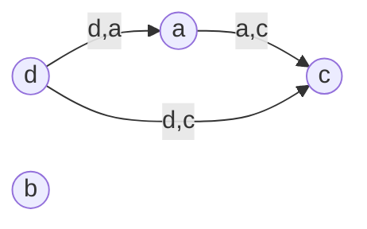

---

### Задание II.B': Доказательство эквивалентности определений антисимметричности

Требуется строго доказать равносильность двух определений антисимметричности отношения $R \subseteq A \times A$:
1. $\forall a, b \in A : ((a, b) \in R \land (b, a) \in R \to a = b)$;
2. $\forall a, b \in A : ((a, b) \in R \land a \ne b \to (b, a) \notin R)$.

#### Формальное логическое доказательство

Зафиксируем произвольные элементы $a, b \in A$. Обозначим элементарные высказывания:
- $P \equiv ((a, b) \in R)$
- $Q \equiv ((b, a) \in R)$
- $E \equiv (a = b)$

Тогда подкванторные формулы принимают вид:
- Формула 1: $(P \land Q) \to E$
- Формула 2: $(P \land \neg E) \to \neg Q$

**Метод 1: Через базовые законы булевой логики**
Преобразуем импликацию по определению ($X \to Y \equiv \neg X \lor Y$):
$$(P \land Q) \to E \equiv \neg(P \land Q) \lor E \equiv (\neg P \lor \neg Q) \lor E \equiv \neg P \lor \neg Q \lor E$$

Преобразуем вторую формулу аналогично:
$$(P \land \neg E) \to \neg Q \equiv \neg(P \land \neg E) \lor \neg Q \equiv (\neg P \lor \neg\neg E) \lor \neg Q \equiv \neg P \lor E \lor \neg Q$$

В силу коммутативности и ассоциативности дизъюнкции:
$$\neg P \lor \neg Q \lor E \equiv \neg P \lor E \lor \neg Q$$
Обе формулы тождественно равны одному и тому же дизъюнкту $\neg P \lor \neg Q \lor E$.

**Метод 2: Через закон контрапозиции и каррирование (экспортацию)**
В исчислении высказываний верен закон экспортации:
$$(P \land Q) \to E \equiv P \to (Q \to E)$$
Применим закон контрапозиции к подформуле $(Q \to E)$:
$$(Q \to E) \equiv (\neg E \to \neg Q)$$
Подставляя обратно:
$$P \to (\neg E \to \neg Q) \equiv (P \land \neg E) \to \neg Q$$

Поскольку эквивалентность доказана для произвольной фиксированной пары $(a, b)$, навешивание квантора всеобщности $\forall a, b \in A$ сохраняет истинность:
$$\forall a, b \in A : ((a, b) \in R \land (b, a) \in R \to a = b) \iff \forall a, b \in A : ((a, b) \in R \land a \ne b \to (b, a) \notin R) \quad \blacksquare$$

---

### Задание II.B: Экстремальная мощность антисимметричного отношения и поиск X

Дано антисимметричное отношение $R \subseteq A^2$ на множестве $A = \{1, 2, 3\}$ ($|A| = 3$), причем мощность отношения строго равна $|R| = 6$.
Известно 5 элементов:
$$R = \{(1, 1), (2, 2), (1, 2), (2, 3), (3, 1), X\}$$
Требуется найти недостающий элемент $X$.

#### Теорема о максимальной мощности антисимметричного отношения

> [!tip] Теорема об оценке мощности
> На конечном множестве из $n$ элементов $|A| = n$ декартово произведение $A^2$ состоит из $n^2$ упорядоченных пар, которые разбиваются на:
> 1. $n$ диагональных пар вида $(u, u)$;
> 2. $\frac{n(n - 1)}{2}$ неупорядоченных пар взаимно противоположных элементов $\{(u, v), (v, u)\}$ при $u \ne v$.
>
> В антисимметричном отношении $R$:
> - Диагональные пары могут входить все без ограничений (максимум $n$ штук);
> - Из каждой пары $\{(u, v), (v, u)\}$ может присутствовать **не более одного** элемента (иначе возникнет противоречие с определением антисимметричности).
>
> Следовательно, максимальная мощность антисимметричного отношения:
> $$|R|_{\max} = n + \frac{n(n - 1)}{2} = \frac{n(n + 1)}{2}$$

Для $n = 3$:
$$|R|_{\max} = 3 + \frac{3 \cdot 2}{2} = 3 + 3 = 6$$

#### Нахождение $X$

По условию задачи мощность $|R| = 6 = |R|_{\max}$. Это означает, что отношение $R$ обязано содержать:
1. **Все 3 диагональных элемента:** $(1, 1), (2, 2), (3, 3)$.
2. **Ровно по одному элементу из каждой пары противоположных:**
   - Из $\{(1, 2), (2, 1)\}$ в $R$ входит $(1, 2)$ $\implies (2, 1) \notin R$;
   - Из $\{(2, 3), (3, 2)\}$ в $R$ входит $(2, 3)$ $\implies (3, 2) \notin R$;
   - Из $\{(3, 1), (1, 3)\}$ в $R$ входит $(3, 1)$ $\implies (1, 3) \notin R$.

В списке элементов $R$ уже присутствуют диагональные пары $(1, 1)$ и $(2, 2)$, а также три внедиагональные пары $(1, 2), (2, 3), (3, 1)$.
Единственным допустимым и необходимым оставшимся элементом декартова квадрата $A^2$ является третья диагональная пара:
$$X = (3, 3)$$

**Ответ:** $X = (3, 3)$.

---

### Задание II.C: Синтез транзитивного антирефлексивного отношения

Требуется построить транзитивное иррефлексивное (антирефлексивное) отношение $R \subseteq A^2$ на множестве $A = \{1, 2, 3, 4\}$ мощности $|R| = 6$, удовлетворяющее условию:
$$\{(1, 4), (3, 4), (4, 2)\} \subseteq R$$

#### Конструктивный анализ и транзитивное замыкание

1. **Иррефлексивность:** $\forall x \in \{1, 2, 3, 4\} : (x, x) \notin R$.
2. **Транзитивность обязательных пар:**
   - $(1, 4) \in R \land (4, 2) \in R \implies (1, 2) \in R$;
   - $(3, 4) \in R \land (4, 2) \in R \implies (3, 2) \in R$.
3. Получаем минимальное транзитивное подмножество из 5 пар:
   $$R_5 = \{(1, 4), (3, 4), (4, 2), (1, 2), (3, 2)\}$$
   Проверим его транзитивность:
   - Входящие в 4: вершины 1 и 3;
   - Исходящее из 4: вершина 2;
   - Все возможные пути длины 2 проходят через вершину 4 и замкнуты парами $(1, 2)$ и $(3, 2)$;
   - Из вершины 2 исходящих ребер нет;
   - Петель нет: $1 \ne 2, 3 \ne 2, 1 \ne 4, 3 \ne 4, 4 \ne 2$.
   Отношение $R_5$ транзитивно и иррефлексивно, его мощность $|R_5| = 5$.

4. **Выбор шестой пары:**
   Нам необходимо добавить ровно одну пару $(u, v)$, чтобы мощность стала $|R| = 6$. При этом:
   - $u \ne v$ (сохранение иррефлексивности);
   - Нельзя создавать циклы (любой цикл в транзитивном отношении порождает петли: $u R v \land v R u \implies u R u$, что уничтожит антирефлексивность);
   - Добавление ребра не должно порождать незамкнутых цепочек длины 2, требующих седьмой пары.

Рассмотрим вершины 1 и 3. Между ними сейчас нет ориентированного ребра.
- **Вариант 1 (добавляем ребро $3 \to 1$):**
  Положим $X = (3, 1)$.
  Проверим новые цепочки с участием $(3, 1)$:
  - $(3, 1) \land (1, 4) \implies (3, 4)$ (уже принадлежит $R$);
  - $(3, 1) \land (1, 2) \implies (3, 2)$ (уже принадлежит $R$).
  Никаких других цепочек не возникает!
  Итоговое отношение:
  $$R = \{(1, 4), (3, 4), (4, 2), (1, 2), (3, 2), (3, 1)\}$$
  Мощность $|R| = 6$. Отношение представляет собой строгий частичный порядок (ациклический орграф DAG со слоями: $3 \to 1 \to 4 \to 2$).

- **Вариант 2 (симметричный — добавляем ребро $1 \to 3$):**
  Положим $X = (1, 3)$.
  Аналогично цепочки $(1, 3) \land (3, 4) \implies (1, 4) \in R$ и $(1, 3) \land (3, 2) \implies (1, 2) \in R$ уже присутствуют.
  $$R' = \{(1, 4), (3, 4), (4, 2), (1, 2), (3, 2), (1, 3)\}$$

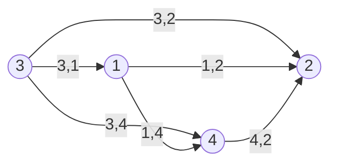

**Ответ:** Искомым отношением является, например:
$$R = \{(1, 2), (1, 4), (3, 1), (3, 2), (3, 4), (4, 2)\}$$

---

### Задание II.D: Анализ антитранзитивности содержательных отношений

Отношение $R$ называется **антитранзитивным (интранзитивным)**, если:
$$\forall x, y, z : ((x, y) \in R \land (y, z) \in R \implies (x, z) \notin R)$$

Проанализируем все 6 приведенных отношений:

#### a) «Квадратный корень» (на $\mathbb{R}$)
$x R y \iff x = \sqrt{y}$ (где $y \ge 0, x \ge 0$).
Если $x R y$ и $y R z$, то $x = \sqrt{y} = \sqrt{\sqrt{z}} = z^{1/4}$.
Может ли выполняться $(x, z) \in R$?
$$(x, z) \in R \iff x = \sqrt{z} \iff z^{1/4} = z^{1/2}$$
Решим уравнение на области определения $\mathbb{R}_{\ge 0}$:
$$z^{1/4}(z^{1/4} - 1) = 0 \implies z = 0 \quad \text{или} \quad z = 1$$
- При $z = 1$: $y = \sqrt{1} = 1$ и $x = \sqrt{1} = 1$. Имеем $(1, 1) \in R$, $(1, 1) \in R$ и $(1, 1) \in R$ — прямое нарушение антитранзитивности.
- При $z = 0$: $y = \sqrt{0} = 0$ и $x = \sqrt{0} = 0$. Имеем $(0, 0) \in R$, $(0, 0) \in R$ и $(0, 0) \in R$ — также контрпример.
Таким образом, неподвижные точки операции извлечения корня ($0$ и $1$) порождают транзитивные петли.
- **Вердикт:** **Не антитранзитивно**.

> [!tip] Академический инсайт к пунктам a) и c)
> Обратите внимание на тонкость условия: в пункте **c)** автор задания намеренно исключил ноль ($\mathbb{R} \setminus \{0\}$), поскольку точка $0$ являлась бы неподвижной точкой ($0 = 3 \cdot 0$) и разрушила бы антитранзитивность! В пункте **a)** ноль и единица не были исключены из $\mathbb{R}$, поэтому наличие неподвижных точек $0$ и $1$ опровергает антитранзитивность на $\mathbb{R}$. (Если бы универсум сузили до $\mathbb{R} \setminus \{0, 1\}$, отношение стало бы антитранзитивным).

#### b) «Старше, чем»
$x R y \iff \mathrm{age}(x) > \mathrm{age}(y)$.
Если $x$ старше $y$, а $y$ старше $z$, то в силу строгой транзитивности числового порядка $>$ на $\mathbb{R}$:
$$\mathrm{age}(x) > \mathrm{age}(y) > \mathrm{age}(z) \implies \mathrm{age}(x) > \mathrm{age}(z) \implies (x, z) \in R$$
Отношение транзитивно, и пара $(x, z)$ всегда принадлежит отношению.
- **Вердикт:** **Не антитранзитивно** (строго транзитивно).

#### c) «Больше в три раза» (на $\mathbb{R} \setminus \{0\}$)
$x R y \iff x = 3y$.
Пусть $x R y$ и $y R z$. Тогда:
$$x = 3y = 3(3z) = 9z$$
Проверим, может ли выполниться $(x, z) \in R$:
$$(x, z) \in R \iff x = 3z \iff 9z = 3z \iff 6z = 0 \iff z = 0$$
Однако универсум отношения объявлен как $\mathbb{R} \setminus \{0\}$, поэтому $z \ne 0$!
Следовательно, на данном носителе равенство $9z = 3z$ невозможно в принципе.
Значит, для любых $x, y, z \in \mathbb{R} \setminus \{0\}$ из посылки $x R y \land y R z$ всегда следует $x \ne 3z$, то есть $(x, z) \notin R$.
- **Вердикт:** **Является антитранзитивным**!

#### d) «Дружит»
Если $x$ дружит с $y$, а $y$ дружит с $z$, то $x$ вполне может дружить с $z$ (например, в треугольнике общих друзей).
Поскольку условие $(x, z) \notin R$ выполняется не всегда, отношение не является антитранзитивным.
- **Вердикт:** **Не антитранзитивно**.

#### e) «Является предком»
Отношение предка является транзитивным замыканием отношения прямого родительства: если $x$ предок $y$ (дедушка), а $y$ предок $z$ (отец), то $x$ обязательно является предком $z$ (прадедушка).
- **Вердикт:** **Не антитранзитивно** (транзитивно).

#### f) «Является матерью»
$x R y \iff x \text{ — биологическая мать } y$.
Пусть $x R y$ ($x$ — мать $y$) и $y R z$ ($y$ — мать $z$).
Кем приходится $x$ для $z$?
Женщина $x$ приходится $z$ бабушкой по материнской линии (предком 2-го поколения).
В силу дискретности поколений и уникальности биологической матери одного человека, бабушка никогда не может быть матерью своей внучки:
$$(x, z) \notin R$$
Следовательно, для любых индивидов условие антитранзитивности выполняется безупречно.
- **Вердикт:** **Является антитранзитивным**!

**Ответ к Заданию II.D:** Антитранзитивными являются отношения **c) больше в три раза (на $\mathbb{R} \setminus \{0\}$)** и **f) является матерью**.

## 3. Операции над отношениями и представление в ПСК (Задание II.E)

Дано множество $A = \{1, 2, 3, 4, 5\}$ ($|A| = 5$).
На $A$ заданы четыре базовых отношения:
1. $a R_1 b \iff |a - b| = 1$ (соседство на числовой прямой);
2. $a R_2 b \iff 0 < a - b < 3 \iff a - b \in \{1, 2\}$;
3. $a R_3 b \iff a \ge b^2$;
4. $a R_4 b \iff \mathrm{НОД}(a, b) = 1$ (взаимная простота).

### I. Аналитическое построение отношений Q, S, T и матрицы в ПСК

#### 1. Явные списки пар базовых отношений

- **$R_1$:**
  $$R_1 = \{(1, 2), (2, 1), (2, 3), (3, 2), (3, 4), (4, 3), (4, 5), (5, 4)\} \quad (|R_1| = 8)$$
- **$R_2$:**
  - $a - b = 1$: $(2, 1), (3, 2), (4, 3), (5, 4)$
  - $a - b = 2$: $(3, 1), (4, 2), (5, 3)$
  $$R_2 = \{(2, 1), (3, 1), (3, 2), (4, 2), (4, 3), (5, 3), (5, 4)\} \quad (|R_2| = 7)$$
- **$R_3$:**
  - $b = 1 \implies a \ge 1^2 = 1 \implies a \in \{1, 2, 3, 4, 5\}$
  - $b = 2 \implies a \ge 2^2 = 4 \implies a \in \{4, 5\}$
  - $b \ge 3 \implies b^2 \ge 9 > 5$ (нет решений на $A$)
  $$R_3 = \{(1, 1), (2, 1), (3, 1), (4, 1), (5, 1), (4, 2), (5, 2)\} \quad (|R_3| = 7)$$
  Обратное отношение $R_3^{-1}$:
  $$R_3^{-1} = \{(1, 1), (1, 2), (1, 3), (1, 4), (1, 5), (2, 4), (2, 5)\}$$
- **$R_4$:**
  - $a = 1$: $(1, 1), (1, 2), (1, 3), (1, 4), (1, 5)$
  - $a = 2$: $(2, 1), (2, 3), (2, 5)$
  - $a = 3$: $(3, 1), (3, 2), (3, 4), (3, 5)$
  - $a = 4$: $(4, 1), (4, 3), (4, 5)$
  - $a = 5$: $(5, 1), (5, 2), (5, 3), (5, 4)$
  Всего в $R_4$ ровно 19 пар.

#### 2. Построение результирующих отношений

##### Отношение $Q = R_1 \cap R_2$
Пересечение содержит пары, где одновременно $|a - b| = 1$ и $a - b \in \{1, 2\}$, то есть строго $a - b = 1$:
$$Q = \{(2, 1), (3, 2), (4, 3), (5, 4)\} \quad (|Q| = 4)$$

##### Отношение $S = R_1 \cup R_2$
Объединение содержит все пары с $|a - b| = 1$ плюс пары из $R_2$ с $a - b = 2$:
$$S = \{(1, 2), (2, 1), (2, 3), (3, 1), (3, 2), (3, 4), (4, 2), (4, 3), (4, 5), (5, 3), (5, 4)\} \quad (|S| = 11)$$

##### Отношение $T = R_4 \setminus R_3^{-1}$
Исключаем из $R_4$ элементы множества $R_3^{-1}$:
- При $a = 1$: вся строка $\{(1, 1), (1, 2), (1, 3), (1, 4), (1, 5)\}$ целиком входит в $R_3^{-1}$, поэтому при $a = 1$ удаляются все пары!
- При $a = 2$: удаляется пара $(2, 5) \in R_3^{-1}$. Пары $(2, 1)$ и $(2, 3)$ остаются.
- При $a \in \{3, 4, 5\}$: в $R_3^{-1}$ нет пар с первой координатой $\ge 3$, поэтому все пары из $R_4$ сохраняются.
Итого:
$$T = \{(2, 1), (2, 3), (3, 1), (3, 2), (3, 4), (3, 5), (4, 1), (4, 3), (4, 5), (5, 1), (5, 2), (5, 3), (5, 4)\} \quad (|T| = 13)$$

#### 3. Графическое представление в ПСК ($a$ — ось абсцисс, $b$ — ось ординат)

Обозначения на координатной сетке: `●` — упорядоченная пара $(a, b)$ принадлежит отношению; `·` — пара не принадлежит отношению. Ось абсцисс $a$ направлена слева направо ($1 \dots 5$), ось ординат $b$ направлена снизу вверх ($1 \dots 5$).

##### График отношения $Q = R_1 \cap R_2$ в ПСК

| $b \uparrow \backslash a \rightarrow$ | $a = 1$ | $a = 2$ | $a = 3$ | $a = 4$ | $a = 5$ |
| :---: | :---: | :---: | :---: | :---: | :---: |
| **$b = 5$** | · | · | · | · | · |
| **$b = 4$** | · | · | · | · | ● |
| **$b = 3$** | · | · | · | ● | · |
| **$b = 2$** | · | · | ● | · | · |
| **$b = 1$** | · | ● | · | · | · |

$$M_Q = \begin{pmatrix} 0 & 0 & 0 & 0 & 0 \\ 1 & 0 & 0 & 0 & 0 \\ 0 & 1 & 0 & 0 & 0 \\ 0 & 0 & 1 & 0 & 0 \\ 0 & 0 & 0 & 1 & 0 \end{pmatrix}, \quad M_Q[a, b] = 1 \iff (a, b) \in Q$$

##### График отношения $S = R_1 \cup R_2$ в ПСК

| $b \uparrow \backslash a \rightarrow$ | $a = 1$ | $a = 2$ | $a = 3$ | $a = 4$ | $a = 5$ |
| :---: | :---: | :---: | :---: | :---: | :---: |
| **$b = 5$** | · | · | · | ● | · |
| **$b = 4$** | · | · | ● | · | ● |
| **$b = 3$** | · | ● | · | ● | ● |
| **$b = 2$** | ● | · | ● | ● | · |
| **$b = 1$** | · | ● | ● | · | · |

$$M_S = \begin{pmatrix} 0 & 1 & 0 & 0 & 0 \\ 1 & 0 & 1 & 0 & 0 \\ 1 & 1 & 0 & 1 & 0 \\ 0 & 1 & 1 & 0 & 1 \\ 0 & 0 & 1 & 1 & 0 \end{pmatrix}, \quad M_S[a, b] = 1 \iff (a, b) \in S$$

##### График отношения $T = R_4 \setminus R_3^{-1}$ в ПСК

| $b \uparrow \backslash a \rightarrow$ | $a = 1$ | $a = 2$ | $a = 3$ | $a = 4$ | $a = 5$ |
| :---: | :---: | :---: | :---: | :---: | :---: |
| **$b = 5$** | · | · | ● | ● | · |
| **$b = 4$** | · | · | ● | · | ● |
| **$b = 3$** | · | ● | · | ● | ● |
| **$b = 2$** | · | · | ● | · | ● |
| **$b = 1$** | · | ● | ● | ● | ● |

$$M_T = \begin{pmatrix} 0 & 0 & 0 & 0 & 0 \\ 1 & 0 & 1 & 0 & 0 \\ 1 & 1 & 0 & 1 & 1 \\ 1 & 0 & 1 & 0 & 1 \\ 1 & 1 & 1 & 1 & 0 \end{pmatrix}, \quad M_T[a, b] = 1 \iff (a, b) \in T$$

---

### II. Вычисление образов и прообразов подмножеств

По определению для отношения $R \subseteq A \times A$ и подмножества $X \subseteq A$:
- **Прямой образ:** $R(X) = \{y \in A \mid \exists x \in X : (x, y) \in R\}$
- **Полный прообраз:** $R^{-1}(Y) = \{x \in A \mid \exists y \in Y : (x, y) \in R\}$

#### 1. Вычисление $S(\{2, 3\})$
Ищем вторые координаты пар из $S$, у которых первая координата равна 2 или 3:
- Из $x = 2$: $(2, 1), (2, 3) \implies y \in \{1, 3\}$;
- Из $x = 3$: $(3, 1), (3, 2), (3, 4) \implies y \in \{1, 2, 4\}$.
Объединяем:
$$S(\{2, 3\}) = \{1, 3\} \cup \{1, 2, 4\} = \{1, 2, 3, 4\}$$

#### 2. Вычисление $S^{-1}(\{2, 3\})$
Ищем первые координаты пар из $S$, у которых вторая координата равна 2 или 3:
- При $y = 2$: пары $(1, 2), (3, 2), (4, 2) \implies x \in \{1, 3, 4\}$;
- При $y = 3$: пары $(2, 3), (4, 3), (5, 3) \implies x \in \{2, 4, 5\}$.
Объединяем:
$$S^{-1}(\{2, 3\}) = \{1, 3, 4\} \cup \{2, 4, 5\} = \{1, 2, 3, 4, 5\} = A$$

#### 3. Вычисление $T(\{1, 2\})$
Ищем вторые координаты пар из $T$, у которых первая координата равна 1 или 2:
- При $x = 1$: в отношении $T$ нет ни одной пары с $x = 1$ (первая строка пуста) $\implies \emptyset$;
- При $x = 2$: пары $(2, 1), (2, 3) \implies y \in \{1, 3\}$.
Объединяем:
$$T(\{1, 2\}) = \emptyset \cup \{1, 3\} = \{1, 3\}$$

**Ответ к Заданию II.E:**
- $Q = \{(2, 1), (3, 2), (4, 3), (5, 4)\}$
- $S = \{(1, 2), (2, 1), (2, 3), (3, 1), (3, 2), (3, 4), (4, 2), (4, 3), (4, 5), (5, 3), (5, 4)\}$
- $T = \{(2, 1), (2, 3), (3, 1), (3, 2), (3, 4), (3, 5), (4, 1), (4, 3), (4, 5), (5, 1), (5, 2), (5, 3), (5, 4)\}$
- $S(\{2, 3\}) = \{1, 2, 3, 4\}$
- $S^{-1}(\{2, 3\}) = \{1, 2, 3, 4, 5\}$
- $T(\{1, 2\}) = \{1, 3\}$

---

## 4. Графический анализ и классификация отношений (Задание II.F)

В задании приведены 9 ориентированных графов на базовом множестве вершин $A = \{1, 2, 3\}$.
Для каждого графа требуется определить обладание:
1. Основными свойствами: рефлексивность, иррефлексивность, симметричность, антисимметричность, асимметричность, транзитивность, интранзитивность.
2. Дополнительными свойствами:
   - **а) Связность (тотальность по парам $x \ne y$):** $\forall x \ne y : (x R y \lor y R x)$.
   - **б) Всюду определенность:** $\forall x \in A \ \exists y \in A : (x, y) \in R$ (из каждой вершины выходит хотя бы одно ребро/петля).
3. Классификацией: является ли отношением **эквивалентности** или отношением **порядка** (частичного/линейного).

---

### Пошаговый разбор всех 9 графов

#### Граф 1

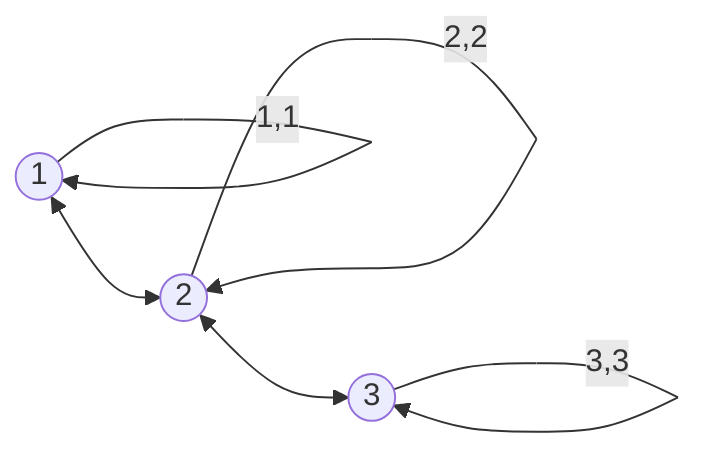

- **Множество пар:** $R_1 = \{(1, 1), (2, 2), (3, 3), (1, 2), (2, 1), (2, 3), (3, 2)\}$.
- **Анализ свойств:**
  - *Рефлексивность:* **Да**, петли на всех трех вершинах.
  - *Иррефлексивность:* **Нет**.
  - *Симметричность:* **Да**, ребра двунаправлены.
  - *Антисимметричность:* **Нет**, $(1, 2) \land (2, 1) \in R_1$.
  - *Асимметричность:* **Нет**.
  - *Транзитивность:* **Нет**, цепочка $(1, 2) \land (2, 3) \in R_1$, но хорда $(1, 3) \notin R_1$.
  - *Интранзитивность:* **Нет**, $(1, 2) \land (2, 1) \implies (1, 1) \in R_1$.
  - *а) Связность:* **Нет**, вершины 1 и 3 не соединены ни в какую сторону.
  - *б) Всюду определенность:* **Да**, у всех вершин есть исходящие ребра.
- **Тип отношения:** Отношение **толерантности** (рефлексивно и симметрично). Не эквивалентность, не порядок.

---

#### Граф 2

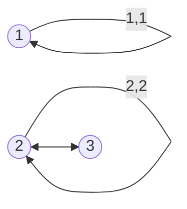

- **Множество пар:** $R_2 = \{(1, 1), (2, 2), (2, 3), (3, 2)\}$.
- **Анализ свойств:**
  - *Рефлексивность:* **Нет**, у вершины 3 нет петли ($(3, 3) \notin R_2$).
  - *Иррефлексивность:* **Нет**, есть петли на 1 и 2.
  - *Симметричность:* **Да**, все ребра симметричны.
  - *Антисимметричность:* **Нет**, $(2, 3) \land (3, 2) \in R_2$.
  - *Асимметричность:* **Нет**.
  - *Транзитивность:* **Нет**, цепочка $(3, 2) \land (2, 3) \in R_2$ требует $(3, 3) \in R_2$, но петля на 3 отсутствует.
  - *Интранзитивность:* **Нет**, $(2, 3) \land (3, 2) \implies (2, 2) \in R_2$.
  - *а) Связность:* **Нет**, вершина 1 изолирована от $\{2, 3\}$.
  - *б) Всюду определенность:* **Да**, из 1 есть $(1, 1)$, из 2 есть $(2, 2)$ и $(2, 3)$, из 3 есть $(3, 2)$.
- **Тип отношения:** Симметричное отношение общего вида. Не эквивалентность, не порядок.

---

#### Граф 3

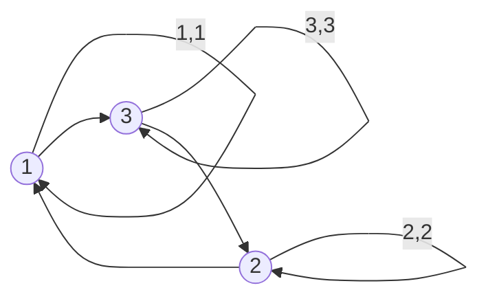

- **Множество пар:** $R_3 = \{(1, 1), (2, 2), (3, 3), (2, 1), (1, 3), (3, 2)\}$.
- **Анализ свойств:**
  - *Рефлексивность:* **Да**, петли на всех вершинах.
  - *Иррефлексивность:* **Нет**.
  - *Симметричность:* **Нет**, ребра ориентированы по циклу в одну сторону.
  - *Антисимметричность:* **Да**, нет ни одной пары взаимных противоположных ребер.
  - *Асимметричность:* **Нет** (из-за петель).
  - *Транзитивность:* **Нет**, цепочка $(2, 1) \land (1, 3) \in R_3$, но $(2, 3) \notin R_3$ (присутствует только обратное ребро $(3, 2)$).
  - *Интранзитивность:* **Нет**, петля $(2, 2) \land (2, 1) \implies (2, 1) \in R_3$.
  - *а) Связность:* **Да**! Для любых двух вершин: между 1 и 2 есть $(2, 1)$; между 1 и 3 есть $(1, 3)$; между 2 и 3 есть $(3, 2)$. Турнир с петлями!
  - *б) Всюду определенность:* **Да**.
- **Тип отношения:** Связное рефлексивное антисимметричное отношение (циклический турнир). Не эквивалентность, не порядок (нарушена транзитивность).

---

#### Граф 4

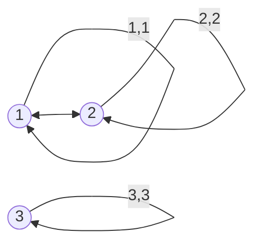

- **Множество пар:** $R_4 = \{(1, 1), (2, 2), (3, 3), (1, 2), (2, 1)\}$.
- **Анализ свойств:**
  - *Рефлексивность:* **Да**, все 3 петли есть.
  - *Иррефлексивность:* **Нет**.
  - *Симметричность:* **Да**.
  - *Антисимметричность:* **Нет**, $(1, 2) \land (2, 1) \in R_4$.
  - *Асимметричность:* **Нет**.
  - *Транзитивность:* **Да**, компонента $\{1, 2\}$ образует полный граф, а $\{3\}$ изолирована.
  - *Интранзитивность:* **Нет**.
  - *а) Связность:* **Нет**, вершина 3 не связана с 1 и 2.
  - *б) Всюду определенность:* **Да**.
- **Тип отношения:** **Отношение эквивалентности!** Фактор-множество $A / R_4 = \{\{1, 2\}, \{3\}\}$.

---

#### Граф 5

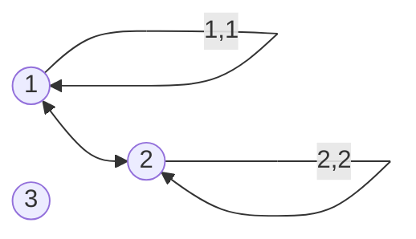

- **Множество пар:** $R_5 = \{(1, 1), (2, 2), (1, 2), (2, 1)\}$.
- **Анализ свойств:**
  - *Рефлексивность:* **Нет**, вершина 3 полностью изолирована ($(3, 3) \notin R_5$).
  - *Иррефлексивность:* **Нет**.
  - *Симметричность:* **Да**.
  - *Антисимметричность:* **Нет**.
  - *Асимметричность:* **Нет**.
  - *Транзитивность:* **Да**, на носителе $\{1, 2\}$ все цепочки замкнуты, а с 3 цепочек нет.
  - *Интранзитивность:* **Нет**.
  - *а) Связность:* **Нет**.
  - *б) Всюду определенность:* **Нет!** У вершины 3 полустепень исхода $\mathrm{deg}^+(3) = 0$, поэтому $\mathrm{Dom}(R_5) = \{1, 2\} \ne A$.
- **Тип отношения:** Частичная эквивалентность (эквивалентность на собственном подмножестве $\{1, 2\}$). На всем $A$ не является эквивалентностью из-за нерефлексивности. Не порядок.

---

#### Граф 6

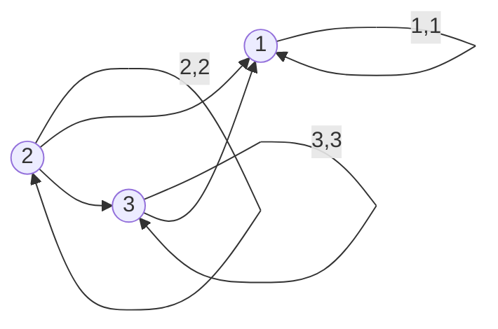

- **Множество пар:** $R_6 = \{(1, 1), (2, 2), (3, 3), (2, 1), (2, 3), (3, 1)\}$.
- **Анализ свойств:**
  - *Рефлексивность:* **Да**, все 3 петли есть.
  - *Иррефлексивность:* **Нет**.
  - *Симметричность:* **Нет**.
  - *Антисимметричность:* **Да**, все внедиагональные ребра однонаправлены.
  - *Асимметричность:* **Нет** (есть петли).
  - *Транзитивность:* **Да!** Цепочка $2 \to 3 \land 3 \to 1$ замкнута ребром $2 \to 1$.
  - *Интранзитивность:* **Нет**.
  - *а) Связность:* **Да!** Любые две различные вершины сравнимы: $(2, 1) \in R_6$, $(2, 3) \in R_6$, $(3, 1) \in R_6$.
  - *б) Всюду определенность:* **Да**.
- **Тип отношения:** **Отношение нестрогого линейного (полного) порядка!** Цепь порядка: $2 \succ 3 \succ 1$.

---

#### Граф 7

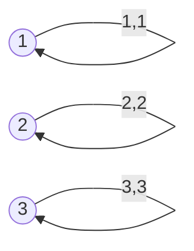

- **Множество пар:** $R_7 = \{(1, 1), (2, 2), (3, 3)\} = \mathrm{id}_A$.
- **Анализ свойств:**
  - *Рефлексивность:* **Да**.
  - *Иррефлексивность:* **Нет**.
  - *Симметричность:* **Да**.
  - *Антисимметричность:* **Да!**
  - *Асимметричность:* **Нет**.
  - *Транзитивность:* **Да**.
  - *Интранзитивность:* **Нет**.
  - *а) Связность:* **Нет**, никакие две различные вершины не связаны.
  - *б) Всюду определенность:* **Да**.
- **Тип отношения:**
  - **Отношение эквивалентности!** Классы эквивалентности — синглетоны: $A / R_7 = \{\{1\}, \{2\}, \{3\}\}$.
  - **Отношение частичного порядка!** Тривиальный дискретный порядок (антицепь из 3 элементов).

---

#### Граф 8

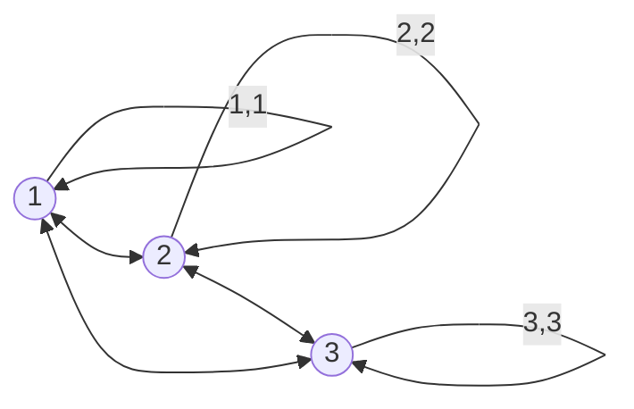

- **Множество пар:** $R_8 = A \times A = A^2$ (универсальное отношение, все 9 пар).
- **Анализ свойств:**
  - *Рефлексивность:* **Да**.
  - *Иррефлексивность:* **Нет**.
  - *Симметричность:* **Да**.
  - *Антисимметричность:* **Нет**, все ребра двунаправлены.
  - *Асимметричность:* **Нет**.
  - *Транзитивность:* **Да**.
  - *Интранзитивность:* **Нет**.
  - *а) Связность:* **Да**.
  - *б) Всюду определенность:* **Да**.
- **Тип отношения:** **Отношение эквивалентности!** Все элементы неразличимы, один общий класс эквивалентности: $A / R_8 = \{\{1, 2, 3\}\}$. Не порядок.

---

#### Граф 9

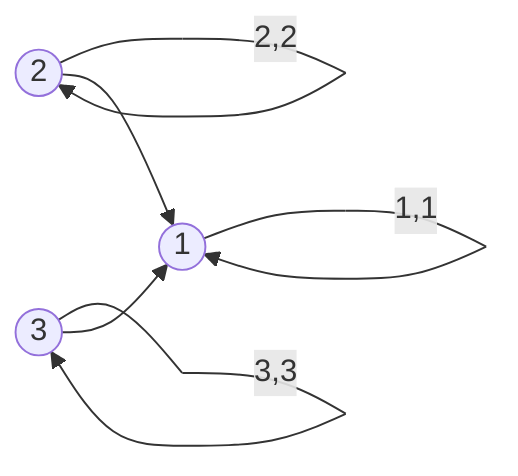

- **Множество пар:** $R_9 = \{(1, 1), (2, 2), (3, 3), (2, 1), (3, 1)\}$.
- **Анализ свойств:**
  - *Рефлексивность:* **Да**, все 3 петли есть.
  - *Иррефлексивность:* **Нет**.
  - *Симметричность:* **Нет**.
  - *Антисимметричность:* **Да**.
  - *Асимметричность:* **Нет**.
  - *Транзитивность:* **Да!** Из вершины 1 ребер нет, поэтому составных цепочек длины 2 между разными вершинами не возникает (свойство выполнено вакуумно).
  - *Интранзитивность:* **Нет**.
  - *а) Связность:* **Нет**, вершины 2 и 3 не сравнимы между собой.
  - *б) Всюду определенность:* **Да**.
- **Тип отношения:** **Отношение частичного порядка!** (Нелинейный порядок: вершина 1 — наименьший элемент, а вершины 2 и 3 — несравнимые максимальные элементы).

---

### Сводная матрица свойств и итоговая классификация

| Граф | Рефл. | Иррефл. | Симм. | Антисимм. | Транз. | Интранз. | а) Связность | б) Всюду опред. | Отношение эквивалентности | Отношение порядка |
| :---: | :---: | :---: | :---: | :---: | :---: | :---: | :---: | :---: | :---: | :---: |
| **1** | **Да** | Нет | **Да** | Нет | Нет | Нет | Нет | **Да** | Нет (толерантность) | Нет |
| **2** | Нет | Нет | **Да** | Нет | Нет | Нет | Нет | **Да** | Нет | Нет |
| **3** | **Да** | Нет | Нет | **Да** | Нет | Нет | **Да** | **Да** | Нет | Нет (турнир) |
| **4** | **Да** | Нет | **Да** | Нет | **Да** | Нет | Нет | **Да** | **ДА** ($\{\{1, 2\}, \{3\}\}$) | Нет |
| **5** | Нет | Нет | **Да** | Нет | **Да** | Нет | Нет | Нет | Нет | Нет |
| **6** | **Да** | Нет | Нет | **Да** | **Да** | Нет | **Да** | **Да** | Нет | **ДА (линейный)** |
| **7** | **Да** | Нет | **Да** | **Да** | **Да** | Нет | Нет | **Да** | **ДА** ($\{\{1\}, \{2\}, \{3\}\}$) | **ДА (дискретный)** |
| **8** | **Да** | Нет | **Да** | Нет | **Да** | Нет | **Да** | **Да** | **ДА** ($\{\{1, 2, 3\}\}$) | Нет |
| **9** | **Да** | Нет | Нет | **Да** | **Да** | Нет | Нет | **Да** | Нет | **ДА (частичный)** |

**Ответ к Заданию II.F:**
- **Отношениями эквивалентности являются:** Графы **4, 7, 8**.
- **Отношениями порядка являются:** Графы **6** (нестрогий линейный порядок), **7** (тривиальный дискретный частичный порядок), **9** (нестрогий частичный порядок с несравнимыми элементами).

## 5. Отношения на функциональных пространствах и толерантность (Задание II.G)

Рассматривается бесконечное функциональное множество $F = \{f \mid f: \mathbb{Z} \to \mathbb{Z}\}$ (все отображения из $\mathbb{Z}$ в $\mathbb{Z}$).
На $F$ заданы четыре бинарных отношения:
1. $Q = \{(f, g) \mid f(0) = g(0) \lor f(1) = g(1)\}$
2. $R = \{(f, g) \mid \forall x \in \mathbb{Z} : |f(x) - g(x)| \le 1\}$
3. $S = \{(f, g) \mid f(1) = g(1)\}$
4. $T = \{(f, g) \mid \exists C \in \mathbb{Z} \ (\forall x \in \mathbb{Z} : f(x) - g(x) = C)\}$

Требуется:
1. Указать отношения **эквивалентности** (рефлексивные, симметричные, транзитивные).
2. Указать отношения **толерантности** (рефлексивные, симметричные).

---

### Детальное математическое исследование каждого отношения

#### 1. Исследование отношения $Q$
- **Рефлексивность:** $\forall f \in F$, $f(0) = f(0) \lor f(1) = f(1)$ истинно $\implies (f, f) \in Q$.
- **Симметричность:** В силу коммутативности равенства и логической связки $\lor$:
  $$(f(0) = g(0) \lor f(1) = g(1)) \iff (g(0) = f(0) \lor g(1) = f(1)) \implies (g, f) \in Q$$
- **Транзитивность:** **Нарушается!**
  *Контрпример:* Построим три функции $f, g, h \in F$:
  - $f(x) = 0$ тождественно (в частности $f(0) = 0, f(1) = 0$);
  - $g(x)$: зададим $g(0) = 0$, но $g(1) = 5$;
  - $h(x)$: зададим $h(0) = 7$, но $h(1) = 5$.
  Проверим выполнимость условий:
  - $f(0) = g(0) = 0 \implies (f, g) \in Q$;
  - $g(1) = h(1) = 5 \implies (g, h) \in Q$;
  - Для пары $(f, h)$:
    $$f(0) = 0 \ne h(0) = 7 \quad \text{и} \quad f(1) = 0 \ne h(1) = 5$$
    Значения не совпадают ни в точке 0, ни в точке 1!
    Следовательно, $(f, h) \notin Q$.
- **Вывод для $Q$:** Отношение $Q$ **не является отношением эквивалентности**, но **является отношением толерантности**.

---

#### 2. Исследование отношения $R$
- **Рефлексивность:** $\forall f \in F, \forall x \in \mathbb{Z} : |f(x) - f(x)| = 0 \le 1 \implies (f, f) \in R$.
- **Симметричность:** В силу четности абсолютной величины $|f(x) - g(x)| = |g(x) - f(x)| \le 1 \implies (g, f) \in R$.
- **Транзитивность:** **Нарушается!**
  *Контрпример:* Рассмотрим три постоянные функции:
  - $f(x) = 0$ для всех $x \in \mathbb{Z}$;
  - $g(x) = 1$ для всех $x \in \mathbb{Z}$;
  - $h(x) = 2$ для всех $x \in \mathbb{Z}$.
  Проверяем:
  - $\forall x : |f(x) - g(x)| = |0 - 1| = 1 \le 1 \implies (f, g) \in R$;
  - $\forall x : |g(x) - h(x)| = |1 - 2| = 1 \le 1 \implies (g, h) \in R$;
  - Но $\forall x : |f(x) - h(x)| = |0 - 2| = 2 > 1 \implies (f, h) \notin R$!
- **Вывод для $R$:** Отношение $R$ описывает «1-окрестность» в равномерной метрике $L_\infty$. Отношение $R$ **не транзитивно**, следовательно, **не является отношением эквивалентности**, но **является классическим отношением толерантности**.

---

#### 3. Исследование отношения $S$
Отношение $S$ задается условием $f(1) = g(1)$.
Это отношение представляет собой ядро функционала вычисления в точке $x = 1$: $\mathrm{ev}_1(f) = f(1)$.
- **Рефлексивность:** $f(1) = f(1) \implies (f, f) \in S$.
- **Симметричность:** $f(1) = g(1) \implies g(1) = f(1) \implies (g, f) \in S$.
- **Транзитивность:** $f(1) = g(1) \land g(1) = h(1) \implies f(1) = h(1) \implies (f, h) \in S$.
- **Вывод для $S$:** Отношение $S$ **является отношением эквивалентности** (а также отношением толерантности).
  Фактор-множество $F / S$ изоморфно $\mathbb{Z}$: каждый класс эквивалентности состоит из всех функций, принимающих фиксированное целочисленное значение в точке 1.

---

#### 4. Исследование отношения $T$
Отношение $T$ задается условием: разность $f - g$ тождественно равна целочисленной константе сдвига.
- **Рефлексивность:** $\forall x \in \mathbb{Z} : f(x) - f(x) = 0$. Константа $C = 0 \in \mathbb{Z} \implies (f, f) \in T$.
- **Симметричность:** Если $\forall x : f(x) - g(x) = C$, то $\forall x : g(x) - f(x) = -C$. Поскольку $C \in \mathbb{Z} \implies -C \in \mathbb{Z}$, пара $(g, f) \in T$.
- **Транзитивность:**
  Пусть $(f, g) \in T \implies \exists C_1 \in \mathbb{Z} : f(x) - g(x) = C_1$.
  Пусть $(g, h) \in T \implies \exists C_2 \in \mathbb{Z} : g(x) - h(x) = C_2$.
  Сложим два равенства:
  $$(f(x) - g(x)) + (g(x) - h(x)) = f(x) - h(x) = C_1 + C_2$$
  Поскольку $C_1, C_2 \in \mathbb{Z}$, величина $C_3 = C_1 + C_2 \in \mathbb{Z}$ является целочисленной константой, не зависящей от $x$.
  Следовательно, $(f, h) \in T$.
- **Вывод для $T$:** Отношение $T$ **является отношением эквивалентности** (факторизация по аддитивным параллельным переносам графиков вдоль оси ординат).

### Итоговый вердикт по Заданию II.G

| Отношение | Описание | Рефлексивность | Симметричность | Транзитивность | Отношение эквивалентности | Отношение толерантности |
| :---: | :--- | :---: | :---: | :---: | :---: | :---: |
| **$Q$** | $f(0) = g(0) \lor f(1) = g(1)$ | Да | Да | **Нет** | Нет | **ДА** |
| **$R$** | $\forall x : \vert f(x) - g(x) \vert \le 1$ | Да | Да | **Нет** | Нет | **ДА** |
| **$S$** | $f(1) = g(1)$ | Да | Да | **Да** | **ДА** | **ДА** |
| **$T$** | $f(x) - g(x) = C$ | Да | Да | **Да** | **ДА** | **ДА** |

**Ответ:**
- **Отношениями эквивалентности являются:** **3 ($S$) и 4 ($T$)**.
- **Отношениями толерантности являются:**
  - В строгом математическом смысле (любое рефлексивное и симметричное отношение): **все 4 отношения $Q, R, S, T$**.
  - В смысле «собственной толерантности» (толерантность, не являющаяся эквивалентностью): **1 ($Q$) и 2 ($R$)**.

---

## 6. Отношения эквивалентности и фактор-множества (Задание II.H)

Отношения заданы на конечном множестве десятичных цифр:
$$A = \{0, 1, 2, 3, 4, 5, 6, 7, 8, 9\}, \quad |A| = 10$$

Требуется:
1. Проверить каждое из отношений $R_1, R_2, R_1 \cap R_2, R_3, R_4, R_1 \cap R_4$ на свойство эквивалентности.
2. Для каждого отношения эквивалентности найти его фактор-множество $A / R$.

---

### Анализ каждого отношения

#### 1. Отношение $R_1 = \{(a, b) \mid a \equiv b \pmod 3\}$
- Классическое отношение сравнимости по модулю 3.
- Проверка свойств:
  - Рефлексивность: $a - a = 0 = 3 \cdot 0 \implies a \equiv a \pmod 3$.
  - Симметричность: $a - b = 3k \implies b - a = 3(-k)$.
  - Транзитивность: $(a - b) + (b - c) = a - c = 3(k + m)$.
- $R_1$ — **отношение эквивалентности**.
- Классы вычетов на $A = \{0, 1, \dots, 9\}$:
  - $[0]_3 = \{x \in A \mid x \equiv 0 \pmod 3\} = \{0, 3, 6, 9\}$;
  - $[1]_3 = \{x \in A \mid x \equiv 1 \pmod 3\} = \{1, 4, 7\}$;
  - $[2]_3 = \{x \in A \mid x \equiv 2 \pmod 3\} = \{2, 5, 8\}$.
- **Фактор-множество:**
  $$A / R_1 = \{\{0, 3, 6, 9\}, \{1, 4, 7\}, \{2, 5, 8\}\}$$

---

#### 2. Отношение $R_2 = \{(a, b) \mid a^2 \equiv b^2 \pmod{10}\}$
- Условие означает совпадение последних цифр квадратов чисел.
- Вычислим последние цифры квадратов для всех $x \in A$:
  - $0^2 = 0 \equiv 0 \pmod{10}$
  - $1^2 = 1 \equiv 1 \pmod{10}$, $9^2 = 81 \equiv 1 \pmod{10}$
  - $2^2 = 4 \equiv 4 \pmod{10}$, $8^2 = 64 \equiv 4 \pmod{10}$
  - $3^2 = 9 \equiv 9 \pmod{10}$, $7^2 = 49 \equiv 9 \pmod{10}$
  - $4^2 = 16 \equiv 6 \pmod{10}$, $6^2 = 36 \equiv 6 \pmod{10}$
  - $5^2 = 25 \equiv 5 \pmod{10}$
- Отношение $R_2$ является ядром отображения $\varphi(x) = x^2 \pmod{10}$, следовательно, $R_2$ — **отношение эквивалентности**.
- **Фактор-множество:**
  $$A / R_2 = \{\{0\}, \{1, 9\}, \{2, 8\}, \{3, 7\}, \{4, 6\}, \{5\}\}$$

---

#### 3. Отношение $R_1 \cap R_2$
- Пересечение двух отношений эквивалентности всегда является отношением эквивалентности.
- Классы эквивалентности $R_1 \cap R_2$ получаются попарным пересечением классов $A / R_1$ и $A / R_2$:
  - $\{0\} \cap [0]_3 = \{0\}$
  - $\{1, 9\}$: $1 \in [1]_3$, $9 \in [0]_3$ $\implies$ расщепляется на $\{1\}$ и $\{9\}$;
  - $\{2, 8\}$: $2 \in [2]_3$, $8 \in [2]_3$ $\implies$ оба элемента принадлежат одному классу $[2]_3$, класс $\{2, 8\}$ сохраняется;
  - $\{3, 7\}$: $3 \in [0]_3$, $7 \in [1]_3$ $\implies$ расщепляется на $\{3\}$ и $\{7\}$;
  - $\{4, 6\}$: $4 \in [1]_3$, $6 \in [0]_3$ $\implies$ расщепляется на $\{4\}$ и $\{6\}$;
  - $\{5\} \cap [2]_3 = \{5\}$.
- **Фактор-множество:**
  $$A / (R_1 \cap R_2) = \{\{0\}, \{1\}, \{2, 8\}, \{3\}, \{4\}, \{5\}, \{6\}, \{7\}, \{9\}\}$$
  (состоит из одного двухэлементного класса $\{2, 8\}$ и восьми синглетонов).

---

#### 4. Отношение $R_3 = \{(a, b) \mid |2^a - 2^b| < 16\}$
- Вычислим значения функции $f(x) = 2^x$ для $x \in \{0, 1, \dots, 9\}$:
  - $2^0 = 1$
  - $2^1 = 2$
  - $2^2 = 4$
  - $2^3 = 8$
  - $2^4 = 16$
  - $2^5 = 32$
  - $2^6 = 64$
  - $2^7 = 128$
  - $2^8 = 256$
  - $2^9 = 512$
- Проверим разности:
  - На подмножестве $B = \{0, 1, 2, 3, 4\}$:
    Максимальная возможная разность достигается на крайних элементах:
    $$|2^4 - 2^0| = 16 - 1 = 15 < 16$$
    Следовательно, **любые два элемента** из $\{0, 1, 2, 3, 4\}$ попарно связаны в $R_3$. Это подмножество образует полную клику (полный граф с петлями).
  - Для элементов $x \ge 5$:
    - Для $x = 5$: $2^5 = 32$. Ближайшие степени: $2^4 = 16$ (разность $32 - 16 = 16 \not< 16$) и $2^6 = 64$ (разность $64 - 32 = 32 > 16$).
      Следовательно, элемент 5 связан **только с самим собой**: $(5, 5) \in R_3$.
    - Для $x = 6, 7, 8, 9$: разности со всеми другими степенями превосходят $64 - 32 = 32 > 16$. Каждый из них связан исключительно с собой.
- Транзитивность:
  - Внутри блока $\{0, 1, 2, 3, 4\}$ связаны все пары со всеми (полный граф) $\implies$ транзитивность выполнена.
  - Вне блока находятся изолированные вершины с петлями $\implies$ цепочек длины 2 с другими элементами нет.
- $R_3$ — **отношение эквивалентности**!
- **Фактор-множество:**
  $$A / R_3 = \{\{0, 1, 2, 3, 4\}, \{5\}, \{6\}, \{7\}, \{8\}, \{9\}\}$$

---

#### 5. Отношение $R_4 = \{(a, b) \mid |2^a - 2^b| \le 16\}$
- Обратите внимание на нестрогий знак неравенства $\le 16$:
  - При $a = 4, b = 5$: $|2^5 - 2^4| = |32 - 16| = 16 \le 16 \implies (4, 5) \in R_4$ и $(5, 4) \in R_4$.
  - При $a = 3, b = 4$: $|2^4 - 2^3| = |16 - 8| = 8 \le 16 \implies (3, 4) \in R_4$.
- Проверим условие транзитивности:
  $$(3, 4) \in R_4 \quad \text{и} \quad (4, 5) \in R_4$$
  Для транзитивности обязана присутствовать пара $(3, 5)$:
  $$|2^5 - 2^3| = |32 - 8| = 24 > 16 \implies (3, 5) \notin R_4$$
  Транзитивность грубо нарушена на цепочке $3 \to 4 \to 5$!
  Аналогично: $(0, 4) \in R_4$ ($|16 - 1| = 15 \le 16$), но $(0, 5) \notin R_4$ ($|32 - 1| = 31 > 16$).
- **Вывод для $R_4$:** Отношение $R_4$ **НЕ ЯВЛЯЕТСЯ отношением эквивалентности** (оно является отношением толерантности). Фактор-множество для него не существует.

---

#### 6. Отношение $R_1 \cap R_4$
Отношение состоит из пар, одновременно удовлетворяющих условиям:
1. $a \equiv b \pmod 3$;
2. $|2^a - 2^b| \le 16$.

Проверим, какие внедиагональные пары ($a \ne b$) могут войти в пересечение:
- Так как $a \equiv b \pmod 3$ и $a \ne b$, разность $|a - b| \ge 3$.
- Пусть $a < b \implies b \ge a + 3$. Тогда:
  $$2^b - 2^a = 2^a (2^{b - a} - 1) \ge 2^a (2^3 - 1) = 7 \cdot 2^a$$
  Требуется: $7 \cdot 2^a \le 16$:
  - При $a = 0$: $7 \cdot 2^0 = 7 \le 16$.
    Кандидаты $b \in \{3, 6, 9\}$:
    - $b = 3$: $2^3 - 2^0 = 8 - 1 = 7 \le 16$ — **подходит**! Пары: $(0, 3), (3, 0)$.
    - $b = 6$: $2^6 - 2^0 = 64 - 1 = 63 > 16$ — не подходит.
  - При $a = 1$: $7 \cdot 2^1 = 14 \le 16$.
    Кандидаты $b \in \{4, 7\}$:
    - $b = 4$: $2^4 - 2^1 = 16 - 2 = 14 \le 16$ — **подходит**! Пары: $(1, 4), (4, 1)$.
    - $b = 7$: $2^7 - 2^1 = 126 > 16$ — не подходит.
  - При $a = 2$: $7 \cdot 2^2 = 28 > 16$ — решений нет для всех $b > a$.
  - При $a \ge 3$: тем более $> 16$.

Таким образом, вне диагонали в $R_1 \cap R_4$ входят **только две пары связей**:
$$\{(0, 3), (3, 0)\} \quad \text{и} \quad \{(1, 4), (4, 1)\}$$
Остальные вершины $\{2, 5, 6, 7, 8, 9\}$ изолированы (содержат только рефлексивные петли).
Проверка транзитивности:
- На подмножестве $\{0, 3\}$: $(0, 3) \land (3, 0) \implies (0, 0)$ и $(3, 3)$ — есть;
- На подмножестве $\{1, 4\}$: $(1, 4) \land (4, 1) \implies (1, 1)$ и $(4, 4)$ — есть;
- Между разными блоками цепочек нет.
Следовательно, отношение $R_1 \cap R_4$ **является отношением эквивалентности**!
- **Фактор-множество:**
  $$A / (R_1 \cap R_4) = \{\{0, 3\}, \{1, 4\}, \{2\}, \{5\}, \{6\}, \{7\}, \{8\}, \{9\}\}$$

### Сводная таблица эквивалентностей и фактор-множеств

| Отношение | Статус эквивалентности | Фактор-множество |
| :---: | :---: | :--- |
| **$R_1$** | **Эквивалентность** | $\{\{0, 3, 6, 9\}, \{1, 4, 7\}, \{2, 5, 8\}\}$ |
| **$R_2$** | **Эквивалентность** | $\{\{0\}, \{1, 9\}, \{2, 8\}, \{3, 7\}, \{4, 6\}, \{5\}\}$ |
| **$R_1 \cap R_2$** | **Эквивалентность** | $\{\{0\}, \{1\}, \{2, 8\}, \{3\}, \{4\}, \{5\}, \{6\}, \{7\}, \{9\}\}$ |
| **$R_3$** | **Эквивалентность** | $\{\{0, 1, 2, 3, 4\}, \{5\}, \{6\}, \{7\}, \{8\}, \{9\}\}$ |
| **$R_4$** | **НЕ эквивалентность** | Фактор-множество не существует (нарушена транзитивность на $3 \to 4 \to 5$) |
| **$R_1 \cap R_4$** | **Эквивалентность** | $\{\{0, 3\}, \{1, 4\}, \{2\}, \{5\}, \{6\}, \{7\}, \{8\}, \{9\}\}$ |

---

## 7. Алгебра замыканий отношений: s(R⁺) против (s(R))⁺ (Задание II.I)

Дано базовое отношение на множестве $A = \{1, 2, 3, 4\}$:
$$R = \{(1, 2), (1, 4), (3, 3), (4, 1)\}$$

Требуется:
1. Вычислить $s(R^+)$ — симметричное замыкание транзитивного замыкания.
2. Вычислить $(s(R))^+$ — транзитивное замыкание симметричного замыкания.
3. Сопоставить результаты и объяснить алгебраическую причину их несовпадения.

---

### Шаг 1: Вычисление $s(R^+)$

#### А. Построение транзитивного замыкания $R^+$
По определению: $R^+ = \bigcup_{k=1}^\infty R^k$.
- $R^1 = \{(1, 2), (1, 4), (3, 3), (4, 1)\}$.
- Вычисляем $R^2 = R \circ R$ (пути длины ровно 2):
  - $1 \to 4 \to 1 \implies (1, 1) \in R^2$;
  - $4 \to 1 \to 2 \implies (4, 2) \in R^2$;
  - $4 \to 1 \to 4 \implies (4, 4) \in R^2$;
  - $3 \to 3 \to 3 \implies (3, 3) \in R^2$.
  Итого: $R^2 = \{(1, 1), (4, 2), (4, 4), (3, 3)\}$.
- Вычисляем $R^3 = R^2 \circ R$ (пути длины 3):
  - $1 \to 4 \to 1 \to 2 \implies (1, 2) \in R^3$ (уже есть в $R^1$);
  - $1 \to 4 \to 1 \to 4 \implies (1, 4) \in R^3$ (уже есть в $R^1$);
  - $4 \to 1 \to 4 \to 1 \implies (4, 1) \in R^3$ (уже есть в $R^1$).
  Новых пар не возникает.
- Объединяем степени:
  $$R^+ = R^1 \cup R^2 = \{(1, 1), (1, 2), (1, 4), (3, 3), (4, 1), (4, 2), (4, 4)\} \quad (|R^+| = 7)$$

#### Б. Построение симметричного замыкания $s(R^+)$
По определению: $s(X) = X \cup X^{-1}$.
- Обратим пары из $R^+$:
  - $(1, 1)^{-1} = (1, 1)$, $(4, 4)^{-1} = (4, 4)$, $(3, 3)^{-1} = (3, 3)$;
  - $(1, 4)^{-1} = (4, 1)$ и $(4, 1)^{-1} = (1, 4)$ (уже в $R^+$);
  - $(1, 2)^{-1} = (2, 1)$ (добавляется);
  - $(4, 2)^{-1} = (2, 4)$ (добавляется).
Итого:
$$s(R^+) = \{(1, 1), (1, 2), (1, 4), (2, 1), (2, 4), (3, 3), (4, 1), (4, 2), (4, 4)\} \quad (|s(R^+)| = 9)$$

---

### Шаг 2: Вычисление $(s(R))^+$

#### А. Построение симметричного замыкания $s(R)$
$$s(R) = R \cup R^{-1}$$
Обратные пары: $(1, 2)^{-1} = (2, 1)$, $(1, 4)^{-1} = (4, 1)$, $(4, 1)^{-1} = (1, 4)$, $(3, 3)^{-1} = (3, 3)$.
$$s(R) = \{(1, 2), (2, 1), (1, 4), (4, 1), (3, 3)\} \quad (|s(R)| = 5)$$

В графе $s(R)$ вершины 1, 2, 4 соединены ненаправленными ребрами в связную структуру вида «звезда» с центром в 1:
$$2 \longleftrightarrow 1 \longleftrightarrow 4$$

#### Б. Построение транзитивного замыкания $(s(R))^+$
В силу симметричности графа $s(R)$, транзитивное замыкание связной компоненты превращает ее в **полный граф с петлями** (полную клику):
$$\{1, 2, 4\} \times \{1, 2, 4\}$$
Проверим пошагово:
- Пути длины 2:
  - $2 \to 1 \to 2 \implies (2, 2)$ — **Внимание!** Появляется петля $(2, 2)$!
  - $2 \to 1 \to 4 \implies (2, 4)$;
  - $4 \to 1 \to 2 \implies (4, 2)$;
  - $4 \to 1 \to 4 \implies (4, 4)$;
  - $1 \to 2 \to 1 \implies (1, 1)$;
  - $1 \to 4 \to 1 \implies (1, 1)$.
- Все 9 пар декартова квадрата $\{1, 2, 4\}^2$ порождены:
  $$\{(1, 1), (1, 2), (1, 4), (2, 1), (2, 2), (2, 4), (4, 1), (4, 2), (4, 4)\}$$
- Плюс изолированная петля $(3, 3)$.
Итого:
$$(s(R))^+ = \{(1, 1), (1, 2), (1, 4), (2, 1), (2, 2), (2, 4), (3, 3), (4, 1), (4, 2), (4, 4)\} \quad (|(s(R))^+| = 10)$$

---

### Анализ некоммутативности операций замыкания

Сравним два полученных множества:
$$s(R^+) = \{(1, 1), (1, 2), (1, 4), (2, 1), (2, 4), (3, 3), (4, 1), (4, 2), (4, 4)\}$$
$$(s(R))^+ = \{(1, 1), (1, 2), (1, 4), (2, 1), \mathbf{(2, 2)}, (2, 4), (3, 3), (4, 1), (4, 2), (4, 4)\}$$

Разность множеств:
$$(s(R))^+ \setminus s(R^+) = \{(2, 2)\}$$

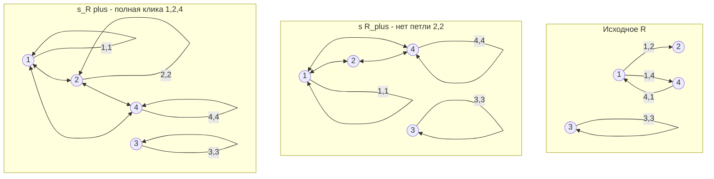

> [!warning] Фундаментальная теорема некоммутативности замыканий
> Операторы симметричного замыкания $s$ и транзитивного замыкания $+$ **НЕ КОММУТИРУЮТ**:
> $$s(R^+) \subseteq (s(R))^+$$
> Включение может быть **строгим**, что и продемонстрировано в данном задании!
> **Причина:** При вычислении $(s(R))^+$ мы сначала добавляем обратное ребро $(2, 1)$, которое открывает путь $2 \to 1 \to 2$, порождающий петлю $(2, 2)$. При вычислении $s(R^+)$ в исходном ориентированном графе пути из 2 не существовало, поэтому петля $(2, 2)$ не могла возникнуть в $R^+$, а последующее симметричное замыкание $s$ лишь зеркалит существующие ребра и не способно породить петлю на вершине с нулевой исходной степенью исхода.

## 8. Композиция и степени отношений (Задания II.J, II.K)

### Задание II.J: Композиция S ∘ R и обращение R⁻¹ ∘ S⁻¹

Даны три множества:
$$A = \{1, 2, 3\}, \quad B = \{1, 2, 3, 4\}, \quad C = \{1, 2\}$$

Заданы два разнородных бинарных отношения:
$$R \subseteq A \times B, \quad R = \{(1, 2), (1, 3), (2, 1), (2, 4), (3, 1)\}$$
$$S \subseteq B \times C, \quad S = \{(2, 2), (3, 1), (3, 2), (4, 2)\}$$

Требуется найти:
1. Композицию $S \circ R \subseteq A \times C$.
2. Композицию обратных отношений $R^{-1} \circ S^{-1} \subseteq C \times A$.

---

#### 1. Вычисление $S \circ R$

По стандартному соглашению (принятому на лекциях Липеня и в университетском курсе):
$$(x, z) \in S \circ R \iff \exists y \in B : ((x, y) \in R \land (y, z) \in S)$$
(отношение $R$ действует первым из $A$ в $B$, затем $S$ — из $B$ в $C$).

Проследим пути для каждого $x \in A$:
- **Для $x = 1$:**
  - $(1, 2) \in R \xrightarrow{y=2} (2, 2) \in S \implies (1, 2) \in S \circ R$;
  - $(1, 3) \in R \xrightarrow{y=3} (3, 1) \in S \implies (1, 1) \in S \circ R$;
  - $(1, 3) \in R \xrightarrow{y=3} (3, 2) \in S \implies (1, 2) \in S \circ R$ (уже учтено).
- **Для $x = 2$:**
  - $(2, 1) \in R \xrightarrow{y=1}$ в $S$ нет пар, начинающихся с 1 $\implies$ путь обрывается;
  - $(2, 4) \in R \xrightarrow{y=4} (4, 2) \in S \implies (2, 2) \in S \circ R$.
- **Для $x = 3$:**
  - $(3, 1) \in R \xrightarrow{y=1}$ в $S$ нет пар с первой координатой 1 $\implies$ путь обрывается.

Итоговое отношение:
$$S \circ R = \{(1, 1), (1, 2), (2, 2)\} \subseteq A \times C$$

---

#### 2. Матричное представление через булево произведение

Зададим логические булевы матрицы отношений:
$$M_R = \begin{pmatrix} 0 & 1 & 1 & 0 \\ 1 & 0 & 0 & 1 \\ 1 & 0 & 0 & 0 \end{pmatrix}_{3 \times 4}, \quad M_S = \begin{pmatrix} 0 & 0 \\ 0 & 1 \\ 1 & 1 \\ 0 & 1 \end{pmatrix}_{4 \times 2}$$

Вычислим булево матричное произведение $M_{S \circ R} = M_R \odot M_S$:
$$M_{S \circ R} = \begin{pmatrix} (0\cdot 0 \lor 1\cdot 0 \lor 1\cdot 1 \lor 0\cdot 0) & (0\cdot 0 \lor 1\cdot 1 \lor 1\cdot 1 \lor 0\cdot 1) \\ (1\cdot 0 \lor 0\cdot 0 \lor 0\cdot 1 \lor 1\cdot 0) & (1\cdot 0 \lor 0\cdot 1 \lor 0\cdot 1 \lor 1\cdot 1) \\ (1\cdot 0 \lor 0\cdot 0 \lor 0\cdot 1 \lor 0\cdot 0) & (1\cdot 0 \lor 0\cdot 1 \lor 0\cdot 1 \lor 0\cdot 1) \end{pmatrix} = \begin{pmatrix} 1 & 1 \\ 0 & 1 \\ 0 & 0 \end{pmatrix}$$
Единицы стоят на позициях $(1, 1), (1, 2), (2, 2)$, что в точности соответствует полученному списку пар!

---

#### 3. Вычисление $R^{-1} \circ S^{-1}$

> [!tip] Фундаментальный алгебраический закон обращения композиции
> Для любых двух бинарных отношений $R \subseteq A \times B$ и $S \subseteq B \times C$:
> $$(S \circ R)^{-1} = R^{-1} \circ S^{-1}$$
> Операция обращения меняет порядок сомножителей на противоположный (антиизоморфизм полугрупп).

Применяя теорему к нашему результату $S \circ R = \{(1, 1), (1, 2), (2, 2)\}$:
$$R^{-1} \circ S^{-1} = (S \circ R)^{-1} = \{(1, 1), (2, 1), (2, 2)\} \subseteq C \times A$$

Проверим этот факт **прямым вычислением**:
- $S^{-1} = \{(2, 2), (1, 3), (2, 3), (2, 4)\} \subseteq C \times B$
- $R^{-1} = \{(2, 1), (3, 1), (1, 2), (4, 2), (1, 3)\} \subseteq B \times A$

Прослеживаем пути из $C$ в $A$:
- Из $z = 1 \in C$: пара $(1, 3) \in S^{-1} \xrightarrow{y=3} (3, 1) \in R^{-1} \implies (1, 1) \in R^{-1} \circ S^{-1}$;
- Из $z = 2 \in C$:
  - $(2, 2) \in S^{-1} \xrightarrow{y=2} (2, 1) \in R^{-1} \implies (2, 1) \in R^{-1} \circ S^{-1}$;
  - $(2, 3) \in S^{-1} \xrightarrow{y=3} (3, 1) \in R^{-1} \implies (2, 1) \in R^{-1} \circ S^{-1}$ (уже учтено);
  - $(2, 4) \in S^{-1} \xrightarrow{y=4} (4, 2) \in R^{-1} \implies (2, 2) \in R^{-1} \circ S^{-1}$.

Прямой расчет дал абсолютно тождественный результат:
$$R^{-1} \circ S^{-1} = \{(1, 1), (2, 1), (2, 2)\}$$

---

### Задание II.K: Степени циклического отношения и объединения путей

Дано множество $A = \{a, b, c, d\}$ ($|A| = 4$) и отношение простого 4-цикла:
$$R = \{(a, b), (b, c), (c, d), (d, a)\} \subseteq A \times A$$

Требуется:
1. Найти степени отношения: $R^2, R^3, R^4$.
2. Найти объединения: $R \cup R^2$ и $R \cup R^2 \cup R^3$.
3. Изобразить каждое отношение на графах.

---

#### 1. Вычисление степеней $R^k$

Степень отношения $R^k$ состоит из всех пар вершин $(u, v)$, между которыми в орграфе $R$ существует ориентированный путь длины **ровно** $k$.

- **$R^1$ (пути длины 1):**
  $$R = \{(a, b), (b, c), (c, d), (d, a)\}$$

- **$R^2 = R \circ R$ (пути длины 2):**
  - $a \to b \to c \implies (a, c)$
  - $b \to c \to d \implies (b, d)$
  - $c \to d \to a \implies (c, a)$
  - $d \to a \to b \implies (d, b)$
  $$R^2 = \{(a, c), (b, d), (c, a), (d, b)\}$$
  *Свойство:* Отношение $R^2$ симметрично ($R^2 = (R^2)^{-1}$). Оно соединяет пары противоположных вершин квадрата $a \leftrightarrow c$ и $b \leftrightarrow d$.

- **$R^3 = R^2 \circ R$ (пути длины 3):**
  - $a \to b \to c \to d \implies (a, d)$
  - $b \to c \to d \to a \implies (b, a)$
  - $c \to d \to a \to b \implies (c, b)$
  - $d \to a \to b \to c \implies (d, c)$
  $$R^3 = \{(a, d), (b, a), (c, b), (d, c)\}$$
  *Свойство:* Степень $R^3$ в точности совпадает с обратным отношением: $R^3 = R^{-1}$ (цикл в противоположном направлении).

- **$R^4 = R^3 \circ R$ (пути длины 4):**
  - $a \to b \to c \to d \to a \implies (a, a)$
  - $b \to c \to d \to a \to b \implies (b, b)$
  - $c \to d \to a \to b \to c \implies (c, c)$
  - $d \to a \to b \to c \to d \implies (d, d)$
  $$R^4 = \{(a, a), (b, b), (c, c), (d, d)\} = \mathrm{id}_A$$
  *Свойство:* Отношение вернулось в исходную точку — тождественное отношение.

---

#### 2. Вычисление объединений степеней

- **Объединение $R \cup R^2$ (пути длины 1 или 2):**
  $$R \cup R^2 = \{(a, b), (b, c), (c, d), (d, a), (a, c), (b, d), (c, a), (d, b)\} \quad (|R \cup R^2| = 8)$$
  Граф содержит 4 ребра исходного цикла и 4 диагональных ребра (две взаимные хорды).

- **Объединение $R \cup R^2 \cup R^3$ (пути длины от 1 до 3):**
  Поскольку $R^3 = R^{-1}$, объединение $R \cup R^3$ делает все ребра цикла ненаправленными (двунаправленными). Добавляя $R^2$, получаем:
  $$R \cup R^2 \cup R^3 = \{(x, y) \in A^2 \mid x \ne y\} = A^2 \setminus \mathrm{id}_A \quad (|R \cup R^2 \cup R^3| = 12)$$
  Это **полный орграф без петель** (все возможные 12 пар различных вершин).

> [!info] Замыкания циклического отношения
> - Транзитивное замыкание: $R^+ = R \cup R^2 \cup R^3 \cup R^4 = A \times A$ (универсальное отношение, все 16 пар).
> - Рефлексивно-транзитивное замыкание: $R^* = \mathrm{id}_A \cup R^+ = A \times A$.

---

#### 3. Графическое представление отношений (Mermaid)

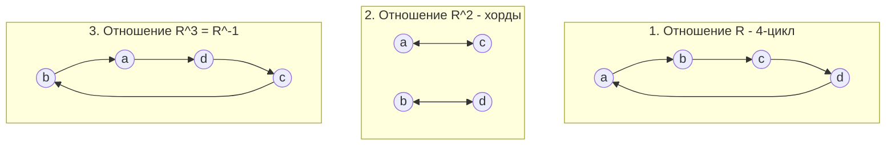

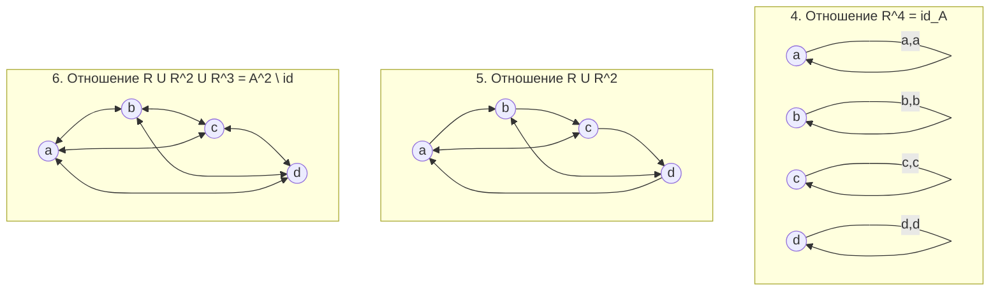

---

## 9. Сводные теоретические таблицы

### Классификация важнейших типов бинарных отношений

| Тип отношения | Рефлексивность | Симметричность | Антисимметричность | Транзитивность | Связность (тотальность) | Канонический пример |
| :--- | :---: | :---: | :---: | :---: | :---: | :--- |
| **Эквивалентность** | **Да** | **Да** | Нет | **Да** | Нет | Сравнение по модулю $a \equiv b \pmod m$, равенство длин |
| **Толерантность** | **Да** | **Да** | Не обязательно | Не обязательно | Нет | Знакомство людей, расстояние $\le \varepsilon$ |
| **Предпорядок (квазипорядок)** | **Да** | Нет | Не обязательно | **Да** | Нет | Отношение делимости на $\mathbb{Z}$, топологическая сравнимость |
| **Частичный порядок (poset)** | **Да** | Нет | **Да** | **Да** | Нет | Включение подмножеств $\subseteq$, делимость на $\mathbb{N}$ |
| **Строгий частичный порядок** | **Иррефл.** | **Асимм.** | **Да** | **Да** | Нет | Строгое подмножество $\subset$, строгий предок |
| **Линейный порядок (цепь)** | **Да** | Нет | **Да** | **Да** | **Да** | Числовое отношение $\le$ на $\mathbb{R}$ |
| **Строгий линейный порядок** | **Иррефл.** | **Асимм.** | **Да** | **Да** | **Да** | Числовое отношение $<$ на $\mathbb{R}$ |

---

### Алгебраические законы операций над отношениями

| Закон | Формулировка | Пояснение |
| :--- | :--- | :--- |
| **Двойное обращение (Инволюция)** | $(R^{-1})^{-1} = R$ | Повторный разворот ребер возвращает исходный орграф |
| **Антидистрибутивность обращения** | $(S \circ R)^{-1} = R^{-1} \circ S^{-1}$ | Разворот составного маршрута разворачивает порядок этапов |
| **Ассоциативность композиции** | $(T \circ S) \circ R = T \circ (S \circ R)$ | Скобки в цепочке переходов можно опускать |
| **Обращение операций над множествами** | $(R \cup S)^{-1} = R^{-1} \cup S^{-1}$ | Обращение дистрибутивно относительно объединения и пересечения |
| **Симметричное замыкание** | $s(R) = R \cup R^{-1}$ | Добавление обратных ребер для всех существующих |
| **Рефлексивное замыкание** | $R^= = R \cup \mathrm{id}_A$ | Добавление всех диагональных петель |
| **Транзитивное замыкание** | $R^+ = \bigcup_{k=1}^\infty R^k$ | Добавление хорд для путей произвольной длины |
| **Некоммутативность замыканий** | $s(R^+) \subseteq (s(R))^+$ | Порядок применения $s$ и $+$ принципиален |

---

## ❓ Вопросы для самопроверки к коллоквиуму / экзамену

- [ ] 1. Сформулируйте три аксиомы разбиения множества. В чем заключается фундаментальная теорема о биекции между разбиениями и отношениями эквивалентности?
- [ ] 2. Докажите эквивалентность двух определений антисимметричности отношения: через посылку $(a, b) \in R \land (b, a) \in R$ и через посылку $(a, b) \in R \land a \ne b$.
- [ ] 3. Чему равна максимально возможная мощность антисимметричного отношения на конечном множестве из $n$ элементов? Докажите точную формулу $|R|_{\max} = \frac{n(n + 1)}{2}$.
- [ ] 4. В чем разница между свойствами «иррефлексивность» и «нерефлексивность»? Приведите пример отношения, не являющегося ни рефлексивным, ни иррефлексивным.
- [ ] 5. Что такое отношение асимметричности? Как оно связано с иррефлексивностью и антисимметричностью?
- [ ] 6. Дайте определение интранзитивности (антитранзитивности). Приведите пример отношения, которое одновременно симметрично и интранзитивно.
- [ ] 7. Почему отношение $R = \{(f, g) \mid \forall x : |f(x) - g(x)| \le 1\}$ на пространстве функций не является транзитивным? К какому классу отношений оно относится?
- [ ] 8. Какова геометрическая структура отношения эквивалентности на плоскости $\mathbb{R}^2$ и в матричном представлении?
- [ ] 9. Докажите, что пересечение двух отношений эквивалентности всегда является эквивалентностью. Верно ли аналогичное утверждение для объединения отношений эквивалентности? Приведите контрпример.
- [ ] 10. Докажите алгебраический закон обращения композиции отношений: $(S \circ R)^{-1} = R^{-1} \circ S^{-1}$.
- [ ] 11. Почему операторы симметричного замыкания $s$ и транзитивного замыкания $+$ не коммутируют? Постройте минимальный орграф, на котором $s(R^+) \ne (s(R))^+$.
- [ ] 12. Пусть $R$ — простой цикл длины $n$ в орграфе. Чему равны степени отношения $R^{n-1}$ и $R^n$? Чему равно транзитивное замыкание такого цикла?
