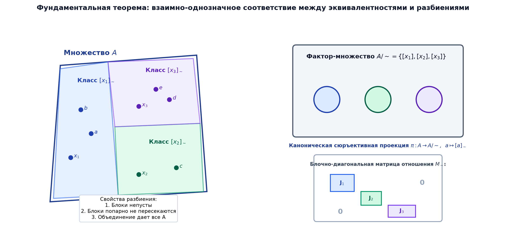

# 📌 Лекция 5: Отношения эквивалентности, фактор-множества и разбиения

> [!abstract] О лекции
> - **Дисциплина:** [[Дискретная математика]] (1 семестр)
> - **Лектор:** Константин Чухарев (@Lipen)
> - **Ключевые концепции:** Отношение эквивалентности ($\sim$), классы эквивалентности $[x]_\sim$, фактор-множество $A/\sim$, разбиение множества (Partition), фундаментальная теорема о взаимно-однозначном соответствии между эквивалентностями и разбиениями, каноническая проекция $\pi$, факторизация отображений, корректность операций над классами (Well-definedness).

---

## 1. Отношение эквивалентности

> [!info] Определение
> Бинарное отношение $\sim$ на множестве $A$ называется **отношением эквивалентности**, если оно одновременно:
> 1. **Рефлексивно:** $\forall x \in A : x \sim x$.
> 2. **Симметрично:** $\forall x, y \in A : x \sim y \implies y \sim x$.
> 3. **Транзитивно:** $\forall x, y, z \in A : x \sim y \land y \sim z \implies x \sim z$.

### Классические примеры:
- Отношение равенства: $x = y$.
- Сравнение по модулю $m$ на $\mathbb{Z}$: $x \equiv y \pmod m \iff m \mid (x - y)$.
- Отношение подобия геометрических треугольников на плоскости.
- Отношение одинаковой длины строк: $|s_1| = |s_2|$.

---

## 2. Классы эквивалентности и фактор-множество

> [!info] Класс эквивалентности
> **Классом эквивалентности** элемента $x \in A$ по отношению $\sim$ называется подмножество всех элементов $A$, эквивалентных $x$:
> $$[x]_\sim = \{y \in A \mid x \sim y\}$$
> Сам элемент $x$ называется **представителем** класса $[x]_\sim$.

### Лемма о совпадении классов:
Для любых двух элементов $x, y \in A$:
$$[x]_\sim = [y]_\sim \iff x \sim y$$
$$[x]_\sim \cap [y]_\sim = \varnothing \iff x \not\sim y$$
*Два класса эквивалентности либо полностью совпадают, либо не пересекаются вовсе!*

### Определение фактор-множества
> [!info] Фактор-множество (Quotient Set)
> Множество всех классов эквивалентности элементов $A$ по отношению $\sim$ называется **фактор-множеством** множества $A$ по отношению $\sim$ и обозначается:
> $$A/\sim = \{[x]_\sim \mid x \in A\}$$

---

## 3. Разбиения множества и Основная теорема

> [!info] Разбиение множества (Partition)
> Семейство непустых подмножеств $\mathcal{P} = \{B_i\}_{i \in I}$ множества $A$ называется **разбиением множества $A$**, если:
> 1. Все блоки непусты: $\forall i \in I : B_i \ne \varnothing$.
> 2. Блоки попарно не пересекаются: $\forall i \ne j : B_i \cap B_j = \varnothing$.
> 3. Объединение всех блоков дает исходное множество: $\bigcup_{i \in I} B_i = A$.

### Фундаментальная теорема о соответствии
> [!important] Теорема (Эквивалентность $\leftrightarrow$ Разбиение)
> 1. Для любого отношения эквивалентности $\sim$ на множестве $A$ фактор-множество $A/\sim$ является разбиением множества $A$.
> 2. Обратно: для любого разбиения $\mathcal{P} = \{B_i\}$ множества $A$ отношение $R_\mathcal{P}$, заданное правилом:
>    $$x \, R_\mathcal{P} \, y \iff \exists i : x, y \in B_i$$
>    является отношением эквивалентности на $A$, причем его фактор-множество совпадает с $\mathcal{P}$.

---

## 4. Корректность определения операций (Well-definedness)

Когда мы определяем операции над классами эквивалентности через действия над их представителями, критически важно доказать **независимость результата от выбора конкретного представителя** (корректность / well-definedness).

### Пример корректного определения: сложение в $\mathbb{Z}/m\mathbb{Z}$
Определим операцию сложения классов:
$$[a] + [b] \stackrel{\text{def}}{=} [a + b]$$
**Проверка корректности:**
Пусть мы выбрали других представителей: $a' \in [a]$ и $b' \in [b]$, то есть $a' = a + k m$ и $b' = b + l m$.
Тогда:
$$a' + b' = (a + b) + (k + l)m \implies a' + b' \equiv a + b \pmod m \implies [a' + b'] = [a + b]$$
Результат не зависит от выбора представителей $\implies$ операция **корректно определена**! $\blacksquare$

### Пример некорректного определения:
Попытка определить функцию $f: \mathbb{Z}_3 \to \mathbb{Z}$ формулой $f([x]) = x^2$.
- Если взять представителя $1 \in [1]$, то $f([1]) = 1^2 = 1$.
- Если взять представителя $4 \in [1]$, то $f([1]) = 4^2 = 16 \ne 1$.
Одному и тому же классу сопоставляются разные значения $\implies$ операция **НЕ является корректной**!

---

## 5. 🔬 Категорные свойства факторизации и конструкция Гротендика

### Универсальное свойство коуравнителя (Coequalizer)
Каноническая сюръекция $\pi: X \to X/\sim$ сопоставляет $x \mapsto [x]_\sim$.  
Для любого отображения $f: X \to Y$, согласованного с $\sim$, **существует единственное** индуцированное отображение $\bar{f}: X/\sim \to Y$, такое что:
$$f = \bar{f} \circ \pi$$

---

### 💡 Научный пример: Построение кольца $\mathbb{Z}$ как фактор-множества $\mathbb{N} \times \mathbb{N}$
На множестве пар натуральных чисел введем отношение:
$$(a, b) \sim (c, d) \iff a + d = b + c$$
Определим операцию сложения классов: $[(a, b)] + [(c, d)] = [(a + c, b + d)]$.  
Если $(a, b) \sim (a', b')$ и $(c, d) \sim (c', d')$, то $a + b' = b + a'$ и $c + d' = d + c'$.  
Складывая: $(a + c) + (b' + d') = (b + d) + (a' + c') \implies (a+c, b+d) \sim (a'+c', b'+d')$.  
Операция строго корректна (well-defined) и задает строгое построение кольца $\mathbb{Z}$!

---

## 🚀 Фундаментальная связь с будущими дисциплинами и технологиями (ИТМО Curriculum)

1. **Теория типов и Языки программирования (Сем 4, 5):**
   - Типы данных в компиляторах задаются как фактор-множества термов по отношению бисимуляции (поведенческой эквивалентности).
2. **Криптография (Сем 3):**
   - Фактор-кольца вычетов $\mathbb{Z}/n\mathbb{Z}$ и поля Галуа $\mathbb{F}_{p^k}$ лежат в основе RSA и эллиптической криптографии.

---

## 🔗 Связанные материалы
- [[Дискретная математика]] — страница курса
- [[04. Лекция - Бинарные отношения, свойства, матрицы отношений и транзитивное замыкание (2026-09-30)]]
- [[06. Лекция - Отношения порядка, диаграммы Хассе, цепи, антицепи и решетки (2026-10-14)]]
- [[Теорминимум 1 - Коллоквиум по теории множеств и отношениям (2026-10-28)]]
