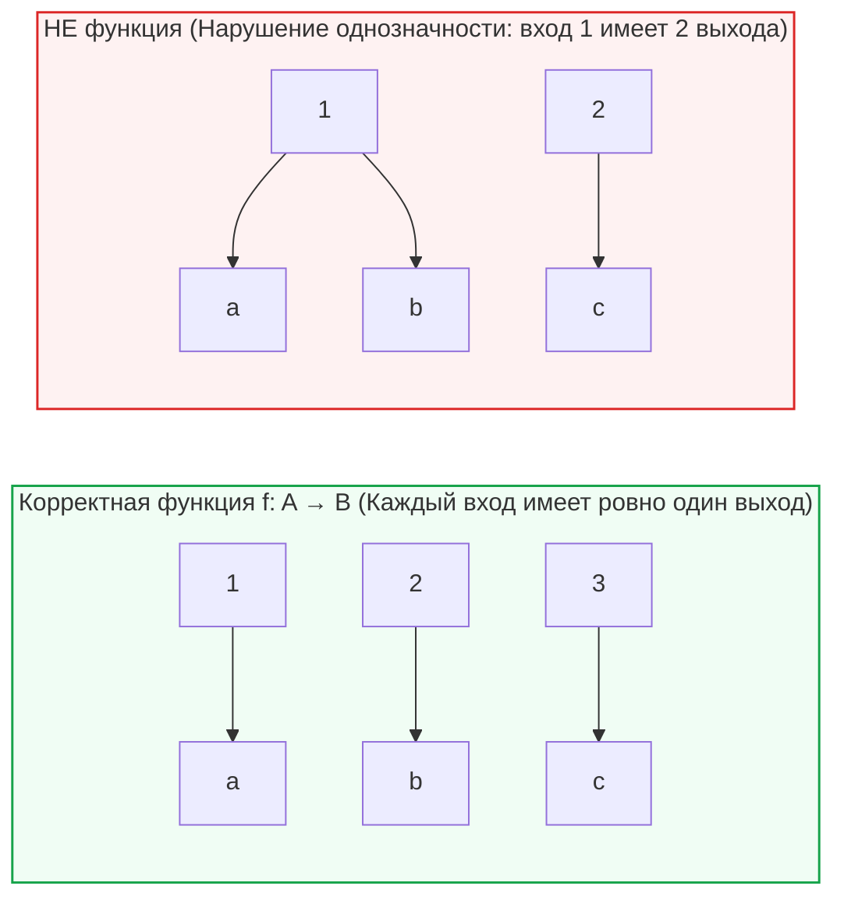
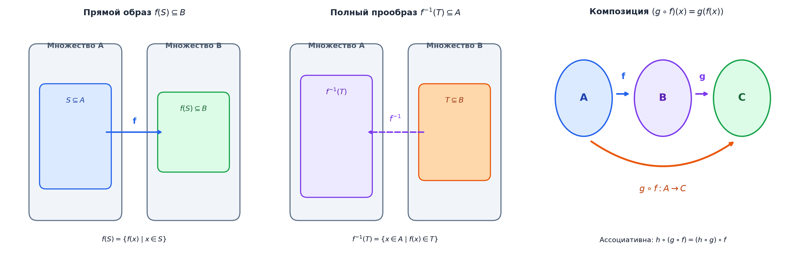
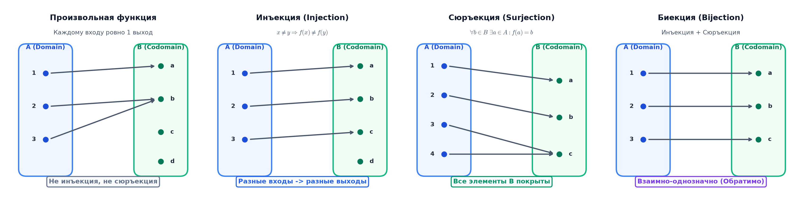

# 📝 Лекция 7: Функции и отображения, инъекция, сюръекция, биекция, композиция и обратные функции

> **Дата:** `2026-09-12` (7-я неделя)  
> **Предмет:** Дискретная математика (1 семестр, 2026/27 уч. год)  
> **Преподаватель (лектор):** Константин Чухарев ([@Lipen](https://github.com/Lipen), Университет ИТМО)  
> **Модуль 2:** Бинарные отношения, порядки и функции  
> **Материалы курса:** [github.com/Lipen/discrete-math-course](https://github.com/Lipen/discrete-math-course) • Главы книги: `m06` • Слайды: `s1-lec07-functions.pdf`

---

## 🧭 Навигация по лекции
1. [Введение: Функция как фундаментальная абстракция вычисления](#1-введение-функция-как-фундаментальная-абстракция-вычисления)
2. [Строгое теоретико-множественное определение функции](#2-строгое-теоретико-множественное-определение-функции)
3. [Анатомия функции: Область определения, кодомен и образ](#3-анатомия-функции)
4. [Образ и полный прообраз подмножеств](#4-образ-и-полный-прообраз-подмножеств)
5. [Классификация отображений: Инъекция, сюръекция, биекция](#5-классификация-отображений)
6. [Композиция функций и её алгебраические свойства](#6-композиция-функций)
7. [Обратные отображения: Левая, правая и двусторонняя обратная](#7-обратные-отображения)
8. [Комбинаторика функций: Подсчет числа отображений](#8-комбинаторика-функций)
9. [Связь с Computer Science: Чистые функции, хеширование и каррирование](#9-связь-с-computer-science)
10. [Вопросы для самопроверки](#10-вопросы-для-самопроверки)

---

## 1. Введение: Функция как фундаментальная абстракция вычисления

В программировании любая вычислительная процедура — это черный ящик: она принимает входные данные (input), выполняет детерминированное преобразование по заданному правилу и выдает единственный результат (output). 

В математике этот процесс формализуется концепцией **функции (отображения)**. В отличие от произвольного бинарного отношения (где одному объекту может соответствовать несколько других или не соответствовать вовсе), функция подчиняется строжайшим ограничениям детерминизма и полноты.

---

## 2. Строгое теоретико-множественное определение функции

В наивном понимании функция — это «правило» или «формула». Однако в основаниях математики (ZFC) формул может не быть вовсе (например, неизмеримые функции или случайные таблицы). Поэтому функция формализуется исключительно как специальное **бинарное отношение**.

> [!definition] Определение: Функция (Отображение)
> Пусть $A$ и $B$ — множества. Бинарное отношение $f \subseteq A \times B$ называется **функцией (отображением)** из $A$ в $B$ (обозначается $f: A \to B$), если выполнены два аксиоматических условия:
> 1. **Всюду определенность (Тотальность):** для любого элемента $a \in A$ найдется хотя бы один элемент $b \in B$, такой что $(a, b) \in f$:
>    $$\forall a \in A \; \exists b \in B : (a, b) \in f.$$
> 2. **Однозначность (Функциональность / Детерминизм):** каждый вход имеет **не более одного** выхода:
>    $$\forall a \in A \; \forall b_1, b_2 \in B \; \Big(\big((a, b_1) \in f \land (a, b_2) \in f\big) \implies b_1 = b_2\Big).$$

Объединяя оба свойства, получаем: **для каждого входа $a \in A$ существует ровно один выход $b \in B$**, который обозначают $b = f(a)$.

### Тотальные и частичные функции
* **Тотальная функция ($f: A \to B$):** определена на всем исходном множестве $A$. В классической математике под словом «функция» всегда понимают тотальную функцию.
* **Частичная функция ($f: A \rightharpoonup B$):** определена лишь на некотором подмножестве $\text{dom}(f) \subseteq A$.  
  *Пример в CS:* операция деления $f(x, y) = x / y$ является частичной функцией на $\mathbb{R} \times \mathbb{R}$, так как не определена при $y = 0$ (вызывает исключение `DivisionByZero`).

---

## 3. Анатомия функции

Каждая функция $f: A \to B$ состоит из трех неразрывных компонент:
1. **Область определения (Domain):** множество входов $\text{dom}(f) = A$.
2. **Область прибытия / Кодомен (Codomain):** множество потенциальных выходов $B$.
3. **Область значений / Образ функции (Range / Image):** множество фактически достигаемых выходов:
   $$\text{im}(f) = f(A) = \{b \in B \mid \exists a \in A : f(a) = b\} \subseteq B.$$

> [!important] Различие кодомена и области значений
> Функции $f_1: \mathbb{R} \to \mathbb{R}$ и $f_2: \mathbb{R} \to [0, +\infty)$, заданные одной и той же формулой $f(x) = x^2$, формально являются **разными функциями**, поскольку у них не совпадают кодомены! Функция $f_2$ сюръективна, а $f_1$ — нет.

---

## 4. Образ и полный прообраз подмножеств

Функция $f: A \to B$ индуцирует естественные операции над целыми подмножествами пространств $A$ и $B$.

> [!definition] Определение: Прямой образ
> Пусть $X \subseteq A$. **Образом подмножества** $X$ называется множество всех значений $f(x)$ для элементов $x \in X$:
> $$f(X) = \{f(x) \mid x \in X\} = \{b \in B \mid \exists x \in X : f(x) = b\}.$$

> [!definition] Определение: Полный прообраз
> Пусть $Y \subseteq B$. **Полным прообразом подмножества** $Y$ называется множество всех аргументов из $A$, значения функции на которых попадают в $Y$:
> $$f^{-1}(Y) = \{a \in A \mid f(a) \in Y\}.$$
> *Внимание:* Обозначение $f^{-1}(Y)$ имеет смысл даже тогда, когда обратная функция $f^{-1}$ не существует!

### Теорема о свойствах прообраза
Прообраз подмножеств обладает исключительным математическим изяществом: он идеально коммутирует со **всеми** теоретико-множественными операциями (в отличие от прямого образа, который не сохраняет дополнение и разность):
1. **Сохранение объединения:** $f^{-1}(Y_1 \cup Y_2) = f^{-1}(Y_1) \cup f^{-1}(Y_2)$.
2. **Сохранение пересечения:** $f^{-1}(Y_1 \cap Y_2) = f^{-1}(Y_1) \cap f^{-1}(Y_2)$.
3. **Сохранение дополнения и разности:** $f^{-1}(B \setminus Y) = A \setminus f^{-1}(Y)$.

---

## 5. Классификация отображений

### 5.1. Инъекция (Инъективное отображение, «Один в один»)

> [!definition] Определение: Инъекция
> Отображение $f: A \to B$ называется **инъективным (инъекцией)**, если различные элементы области определения переходят в различные элементы кодомена:
> $$\forall x_1, x_2 \in A \; (x_1 \ne x_2 \implies f(x_1) \ne f(x_2)).$$
> **Эквивалентное определение через контрапозицию:**
> $$\forall x_1, x_2 \in A \; (f(x_1) = f(x_2) \implies x_1 = x_2).$$

*Геометрический критерий:* Любая горизонтальная прямая $y = y_0$ пересекает график функции $y = f(x)$ **не более чем в одной** точке.  
*Необходимое условие для конечных множеств:* $|A| \le |B|$.

### 5.2. Сюръекция (Сюръективное отображение, «На»)

> [!definition] Определение: Сюръекция
> Отображение $f: A \to B$ называется **сюръективным (сюръекцией, отображением на $B$)**, если каждый элемент кодомена $B$ имеет хотя бы один прообраз:
> $$\forall b \in B \; \exists a \in A : f(a) = b \iff \text{im}(f) = B.$$

*Геометрический критерий:* Любая горизонтальная прямая $y = y_0$ ($y_0 \in B$) пересекает график функции **хотя бы в одной** точке.  
*Необходимое условие для конечных множеств:* $|A| \ge |B|$.

### 5.3. Биекция (Взаимно-однозначное соответствие)

> [!definition] Определение: Биекция
> Отображение $f: A \to B$ называется **биективным (биекцией)**, если оно одновременно **инъективно** и **сюръективно**.

Биекция спаривает элементы множества $A$ с элементами множества $B$ в непересекающиеся пары: каждому $a \in A$ отвечает ровно один $b \in B$, и наоборот.  
*Критерий для конечных множеств:* Биекция между конечными множествами существует тогда и только тогда, когда $|A| = |B|$.

---

## 6. Композиция функций

Поскольку функции являются бинарными отношениями, для них естественным образом определена операция композиции.

> [!definition] Определение: Композиция
> Пусть даны отображения $f: A \to B$ и $g: B \to C$. **Композицией (суперпозицией)** функций называется функция $(g \circ f): A \to C$, действующая по правилу:
> $$(g \circ f)(x) = g(f(x)), \quad \forall x \in A.$$

> [!tip] Геометрия композиции
> Элемент $x \in A$ сначала переводится отображением $f$ в промежуточный образ $f(x) \in B$, а затем отображение $g$ переводит его в итоговое значение $g(f(x)) \in C$ (см. графическую диаграмму на рис. выше).

> [!important] Порядок применения композиции
> В записи $(g \circ f)(x)$ первой применяется функция $f$, а затем $g$ (чтение справа налево).

### Алгебраические свойства композиции:
1. **Ассоциативность:** для любых $f: A \to B, g: B \to C, h: C \to D$:
   $$h \circ (g \circ f) = (h \circ g) \circ f.$$
2. **Некоммутативность:** в общем случае $g \circ f \ne f \circ g$ (даже когда обе композиции определены при $A = B = C$).
3. **Сохранение свойств отображений:**
   * Если $f$ и $g$ инъективны $\implies (g \circ f)$ инъективна.
   * Если $f$ и $g$ сюръективны $\implies (g \circ f)$ сюръективна.
   * Если $f$ и $g$ биективны $\implies (g \circ f)$ биективна.
4. **Свойства компонент при композиции:**
   * Если $(g \circ f)$ инъективна $\implies f$ обязательно инъективна.
   * Если $(g \circ f)$ сюръективна $\implies g$ обязательно сюръективна.

---

## 7. Обратные отображения

> [!definition] Определение: Тождественное отображение
> Отображение $\text{id}_A: A \to A$, определяемое как $\text{id}_A(x) = x$ для всех $x \in A$, называется **тождественным отображением (единичным)**.

### 7.1. Левая и правая обратная

> [!definition] Определения
> Пусть $f: A \to B$.
> * Функция $g: B \to A$ называется **левой обратной** для $f$, если $g \circ f = \text{id}_A$.
> * Функция $h: B \to A$ называется **правой обратной** для $f$, если $f \circ h = \text{id}_B$.

> [!theorem] Фундаментальная теорема об обратимости
> Пусть $A \ne \emptyset$ и $f: A \to B$. Тогда:
> 1. $f$ имеет **левую обратную** тогда и только тогда, когда $f$ **инъективна**.
> 2. $f$ имеет **правую обратную** тогда и только тогда, когда $f$ **сюръективна** (эквивалентно аксиоме выбора ZFC!).

### 7.2. Двусторонняя обратная функция

> [!definition] Определение: Обратимая функция
> Отображение $f: A \to B$ называется **обратимым**, если существует функция $f^{-1}: B \to A$, которая одновременно является и левой, и правой обратной:
> $$f^{-1} \circ f = \text{id}_A \quad \text{и} \quad f \circ f^{-1} = \text{id}_B.$$

> [!theorem] Критерий обратимости функции
> Отображение $f: A \to B$ обратимо тогда и только тогда, когда оно **биективно**. При этом обратное отображение $f^{-1}$ определено **единственным образом**.

---

## 8. Комбинаторика функций

Пусть $A$ и $B$ — конечные множества с мощностями $|A| = m$ и $|B| = n$.

| Тип отображения $f: A \to B$ | Ограничение на мощности | Количество различных отображений |
|---|:---:|:---:|
| **Все тотальные функции** | Любые $m, n \ge 0$ | $n^m = |B|^{|A|}$ |
| **Инъекции** | $m \le n$ | $(n)_m = \frac{n!}{(n-m)!} = n(n-1)\dots(n-m+1)$ |
| **Биекции** | $m = n$ | $n!$ |
| **Сюръекции** | $m \ge n$ | $n! \cdot S(m, n) = \sum_{k=0}^n (-1)^{n-k} \binom{n}{k} k^m$ |

*(где $S(m, n)$ — числа Стирлинга второго рода, выражающие число способов разбить $m$-элементное множество на $n$ непустых блоков).*

---

## 9. Связь с Computer Science

### 1. Хеширование и коллизии
Хеш-функция $h: \text{Keys} \to \text{Buckets}$ сопоставляет бесконечное или огромное множество ключей ограниченному массиву хеш-таблицы:
* Поскольку $|\text{Keys}| \gg |\text{Buckets}|$, по принципу Дирихле функция $h$ **не может быть инъективной**.
* Существование $k_1 \ne k_2$, таких что $h(k_1) = h(k_2)$, называется **коллизией**.
* Идеальное хеширование (Perfect Hashing) строит инъекцию для заранее известного статического набора ключей.

### 2. Криптография и обратимость
* **Симметричные шифры (AES, DES):** алгоритм шифрования $E_k: \text{Block} \to \text{Block}$ обязан быть строгой **биекцией**, иначе расшифровка $D_k = E_k^{-1}$ была бы неоднозначной.
* **Односторонние функции (One-Way Functions):** функции $y = f(x)$, которые легко вычислить за полиномиальное время, но обращение которых (нахождение $x \in f^{-1}(y)$) вычислительно нереализуемо (основа RSA, хэш-функций SHA-256).

### 3. Функциональное программирование
* **Чистая функция (Pure Function):** функция без побочных эффектов, реализующая истинное математическое соответствие $x \mapsto f(x)$ (идемпотентность, ссылочная прозрачность / referential transparency).
* **Композиция (Pipelining):** построение сложных конвейеров обработки данных через цепочку функций: `data.map(f).filter(p).reduce(g)`.
* **Каррирование (Currying):** изоморфизм между функциями от нескольких аргументов и функциями высшего порядка:
  $$f: (A \times B) \to C \quad \cong \quad \text{curry}(f): A \to (B \to C).$$

---

## 10. Вопросы для самопроверки

1. Является ли функция $f: \mathbb{R} \to \mathbb{R}$, заданная формулой $f(x) = x^3 - x$, инъективной? Сюръективной?
2. Докажите, что если композиция $g \circ f$ инъективна, то функция $f$ обязательно инъективна. Приведите контрпример, показывающий, что $g$ при этом может не быть инъективной.
3. Сколько существует различных инъективных отображений из множества $\{1, 2, 3\}$ в множество $\{a, b, c, d, e\}$?
4. Найдите полный прообраз $f^{-1}([0, 1])$ для функции $f: \mathbb{R} \to \mathbb{R}, f(x) = \sin x$.
5. Почему существование правой обратной функции для любого сюръективного отображения требует аксиомы выбора ZFC?
6. В чем заключается математическая суть каррирования функций?
