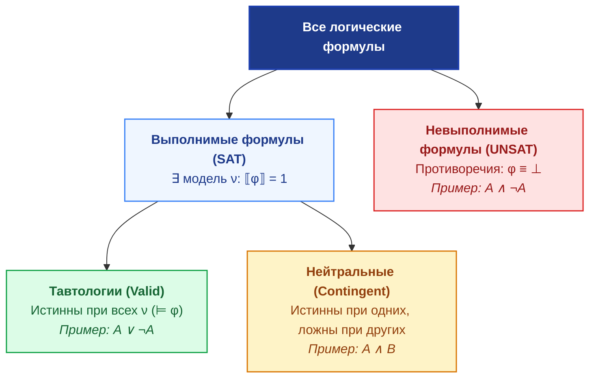
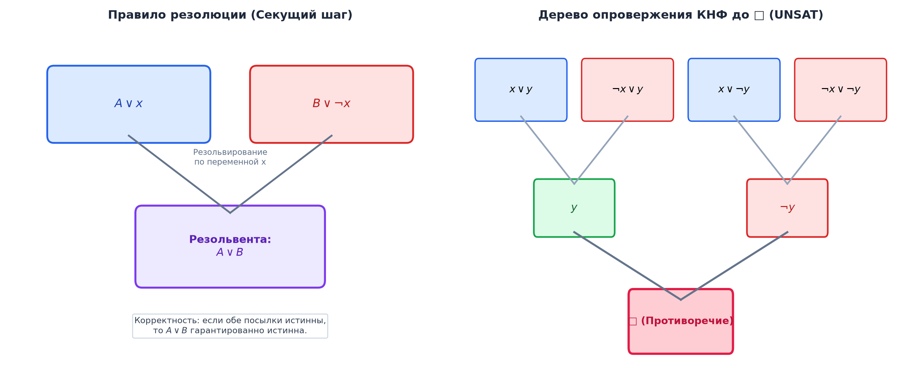

# 📝 Лекция 9: Логика высказываний, тавтологии, семантическое следование, КНФ, ДНФ и резолюция

> **Дата:** `2026-09-12` (9-я неделя)  
> **Предмет:** Дискретная математика (1 семестр, 2026/27 уч. год)  
> **Преподаватель (лектор):** Константин Чухарев ([@Lipen](https://github.com/Lipen), Университет ИТМО)  
> **Модуль 3:** Формальная логика и дедукция  
> **Материалы курса:** [github.com/Lipen/discrete-math-course](https://github.com/Lipen/discrete-math-course) • Главы книги: `m01`, `m02`, `m14` • Слайды: `s1-lec09-propositional.pdf`

---

## 🧭 Навигация по лекции
1. [Введение: От инструмента к математической теории](#1-введение)
2. [Строгая семантика: Интерпретации и истинностные оценки](#2-строгая-семантика-интерпретации)
3. [Классификация формул: Общезначимость, выполнимость, противоречия](#3-классификация-формул)
4. [Семантическое следствие и Теорема о дедукции](#4-семантическое-следствие-и-теорема-о-дедукции)
5. [Нормальные формы: Литералы, дизъюнкты, КНФ и ДНФ](#5-нормальные-формы)
6. [Алгоритмы приведения к КНФ/ДНФ и преобразование Цейтина](#6-алгоритмы-приведения-к-нормальным-формам)
7. [Метод пропозициональной резолюции Робинсона](#7-метод-пропозициональной-резолюции-робинсона)
8. [Хорновские дизъюнкты и логическое программирование (Prolog)](#8-хорновские-дизъюнкты-и-логическое-программирование)
9. [Вопросы для самопроверки](#9-вопросы-для-самопроверки)

---

## 1. Введение

В первой части курса логические связки рассматривались интуитивно как рабочий инструмент программирования. В третьем модуле логика высказываний становится самостоятельным объектом строгого математического исследования:
* Что значит, что утверждение следует из набора гипотез?
* Как машина может автоматически проверять математические доказательства?
* Каковы канонические форматы представления логических утверждений для алгоритмической обработки?

---

## 2. Строгая семантика: Интерпретации

Пусть $\mathcal{V} = \{p, q, r, \dots\}$ — счетное множество пропозициональных переменных (атомов). Формулы строятся по индуктивным правилам грамматики:
$$\varphi ::= p \mid \neg \varphi \mid (\varphi \land \varphi) \mid (\varphi \lor \varphi) \mid (\varphi \to \varphi) \mid (\varphi \iff \varphi).$$

> [!definition] Определение: Интерпретация (Оценка)
> **Интерпретацией (оценкой)** формулы называется функция $\nu: \mathcal{V} \to \{0, 1\}$, сопоставляющая каждой пропозициональной переменной логическое значение ($0$ — ложь, $1$ — истина).

Значение сложной формулы $\llbracket \varphi \rrbracket_\nu \in \{0, 1\}$ при заданной интерпретации $\nu$ вычисляется рекурсивно по дереву разбора формулы:
* $\llbracket p \rrbracket_\nu = \nu(p)$ для $p \in \mathcal{V}$;
* $\llbracket \neg \alpha \rrbracket_\nu = 1 - \llbracket \alpha \rrbracket_\nu$;
* $\llbracket \alpha \land \beta \rrbracket_\nu = \min(\llbracket \alpha \rrbracket_\nu, \llbracket \beta \rrbracket_\nu)$;
* $\llbracket \alpha \lor \beta \rrbracket_\nu = \max(\llbracket \alpha \rrbracket_\nu, \llbracket \beta \rrbracket_\nu)$;
* $\llbracket \alpha \to \beta \rrbracket_\nu = \max(1 - \llbracket \alpha \rrbracket_\nu, \llbracket \beta \rrbracket_\nu)$;
* $\llbracket \alpha \iff \beta \rrbracket_\nu = 1 - |\llbracket \alpha \rrbracket_\nu - \llbracket \beta \rrbracket_\nu|$.

---

## 3. Классификация формул

> [!definition] Основные семантические категории
> Пусть $\varphi$ — формула логики высказываний:
> 1. **Тавтология (Общезначимая формула, Valid):** истинна при абсолютно любой интерпретации: $\forall \nu \; (\llbracket \varphi \rrbracket_\nu = 1)$. Обозначается $\models \varphi$.
> 2. **Выполнимая формула (Satisfiable):** существует хотя бы одна интерпретация $\nu$, при которой $\llbracket \varphi \rrbracket_\nu = 1$. Такая интерпретация называется **моделью** формулы.
> 3. **Противоречие (Невыполнимая формула, Unsatisfiable):** ложна при всех возможных интерпретациях: $\forall \nu \; (\llbracket \varphi \rrbracket_\nu = 0)$.
> 4. **Опровержимая формула (Refutable / Falsifiable):** существует хотя бы одна интерпретация $\nu$, при которой $\llbracket \varphi \rrbracket_\nu = 0$.

> [!theorem] Связь выполнимости и общезначимости
> Формула $\varphi$ является тавтологией тогда и только тогда, когда ее отрицание $\neg \varphi$ является невыполнимым (противоречием):
> $$\models \varphi \iff (\neg \varphi \text{ невыполнима}).$$

---

## 4. Семантическое следствие и Теорема о дедукции

> [!definition] Определение: Отношение семантического следования ($\models$)
> Пусть $\Gamma = \{\varphi_1, \dots, \varphi_k\}$ — множество формул (посылок, гипотез), а $\psi$ — формула (заключение).  
> Говорят, что формула $\psi$ **логически следует** из посылок $\Gamma$ (обозначается $\Gamma \models \psi$), если в любой интерпретации $\nu$, где одновременно истинны все посылки из $\Gamma$, заключение $\psi$ также обязательно истинно:
> $$\Gamma \models \psi \iff \forall \nu \; \Big(\big(\forall \varphi \in \Gamma : \llbracket \varphi \rrbracket_\nu = 1\big) \implies \llbracket \psi \rrbracket_\nu = 1\Big).$$

> [!theorem] Фундаментальная теорема о дедукции (семантическая версия)
> Формула $\psi$ семантически следует из множества гипотез $\Gamma \cup \{\varphi\}$ тогда и только тогда, когда импликация $\varphi \to \psi$ следует из $\Gamma$:
> $$\Gamma, \varphi \models \psi \iff \Gamma \models (\varphi \to \psi).$$
> *В частности, для конечного набора посылок:*
> $$A_1, A_2, \dots, A_n \models B \iff \models (A_1 \land A_2 \land \dots \land A_n) \to B.$$

---

## 5. Нормальные формы

Для автоматического доказательства теорем и решения задачи SAT формулы произвольного вида компилируются в канонические синтаксические структуры.

> [!definition] Определения структурных элементов
> * **Литерал:** переменная $p$ (позитивный литерал) или ее отрицание $\neg p$ (негативный литерал).
> * **Элементарная конъюнкция (Simple Conjunction / Minterm):** конъюнкция литералов: $l_1 \land l_2 \land \dots \land l_k$.
> * **Элементарный дизъюнкт (Clause / Maxterm):** дизъюнкция литералов: $l_1 \lor l_2 \lor \dots \lor l_m$.
> * **Дизъюнктивная нормальная форма (ДНФ / DNF):** дизъюнкция элементарных конъюнкций:
>   $$\bigvee_{i=1}^n \left(\bigwedge_{j=1}^{k_i} l_{i, j}\right).$$
> * **Конъюнктивная нормальная форма (КНФ / CNF):** конъюнкция элементарных дизъюнктов:
>   $$\bigwedge_{i=1}^m \left(\bigvee_{j=1}^{r_i} l_{i, j}\right).$$

> [!theorem] Теорема о существовании нормальных форм
> Для любой логической формулы $\varphi$ существуют эквивалентные ей формулы в КНФ и ДНФ.

---

## 6. Алгоритмы приведения к нормальным формам

Классический алгоритм эквивалентных преобразований состоит из трех фаз:
1. **Элиминация связок $\iff$ и $\to$:**
   $$A \to B \equiv \neg A \lor B, \qquad A \iff B \equiv (\neg A \lor B) \land (\neg B \lor A).$$
2. **Пронос отрицаний до литералов (Законы де Моргана и двойное отрицание):**
   $$\neg(A \land B) \equiv \neg A \lor \neg B, \qquad \neg(A \lor B) \equiv \neg A \land \neg B, \qquad \neg\neg A \equiv A.$$
   *(Формула переходит в Negative Normal Form, NNF).*
3. **Применение законов дистрибутивности:**
   * Для получения КНФ: $A \lor (B \land C) \equiv (A \lor B) \land (A \lor C)$.
   * Для получения ДНФ: $A \land (B \lor C) \equiv (A \land B) \lor (A \land C)$.

> [!warning] Экспоненциальный взрыв при дистрибутивности
> Приведение формулы вида $(x_1 \land y_1) \lor (x_2 \land y_2) \lor \dots \lor (x_n \land y_n)$ к КНФ через дистрибутивность порождает формулу размера $2^n$ дизъюнктов.
> **Решение (Преобразование Цейтина):** введение вспомогательных булевых переменных для каждого узла дерева разбора формулы. Оно строит КНФ линейного размера $O(n)$, которая **равновыполнима (equisatisfiable)** исходной формуле.

---

## 7. Метод пропозициональной резолюции Робинсона

Метод резолюций (Джон Алан Робинсон, 1965) — это фундаментальный алгоритм машинного доказательства теорем, лежащий в основе всех современных SAT- и SMT-решателей. Метод работает исключительно с формулами в виде **множества дизъюнктов** (КНФ).

> [!definition] Правило резолюции (Resolution Rule)
> Пусть даны два дизъюнкта, содержащие противоположные (контрарные) литералы $p$ и $\neg p$:
> $$\frac{C_1 \lor p \qquad C_2 \lor \neg p}{C_1 \lor C_2}$$
> Дизъюнкт $R = C_1 \lor C_2$ называется **резольвентой** исходных дизъюнктов по переменной $p$.

> [!theorem] Корректность и полнота опровержения метода резолюций
> 1. **Корректность:** Если из исходных дизъюнктов $S$ методом резолюций выводится пустой дизюнкт $\square$ (логический ноль $\bot$), то исходное множество дизъюнктов $S$ невыполнимо (противоречиво).
> 2. **Полнота опровержения (Refutation Completeness):** Множество дизъюнктов $S$ невыполнимо тогда и только тогда, когда из него за конечное число шагов резолюции выводим пустой дизюнкт $\square$:
>    $$S \models \bot \iff S \vdash_{\text{Res}} \square.$$

### Схема доказательства теорем методом резолюций:
Чтобы доказать, что из гипотез $\Gamma$ логически следует $\psi$ ($\Gamma \models \psi$):
1. Отрицаем заключение: берем $\neg \psi$.
2. Переводим формулу $\Gamma \land \neg \psi$ в КНФ (набор дизъюнктов $S$).
3. Применяем правило резолюции, добавляя новые резольвенты в $S$.
4. Как только получен пустой дизюнкт $\square = \bot$, факт $\Gamma \models \psi$ доказан от противного!

---

## 8. Хорновские дизъюнкты и логическое программирование

> [!definition] Определение: Хорновский дизъюнкт
> **Хорновским дизъюнктом** называется дизъюнкт, содержащий **не более одного** положительного литерала:
> $$\neg p_1 \lor \neg p_2 \lor \dots \lor \neg p_k \lor q \quad \equiv \quad (p_1 \land p_2 \land \dots \land p_k) \to q.$$
> * **Правило (Rule):** ровно один положительный литерал $q$ и хотя бы один отрицательный (импликация $P_1 \land \dots \land P_k \to Q$).
> * **Факт (Fact):** ровно один положительный литерал без отрицательных: $q$.
> * **Цель / Запрос (Query):** все литералы отрицательны: $\neg p_1 \lor \dots \lor \neg p_k \equiv (p_1 \land \dots \land p_k) \to \bot$.

*Значение в CS:* В отличие от общего случая SAT, который NP-полон, задача выполнимости для хорновских дизъюнктов (Horn-SAT) решается алгоритмом распространения единичных дизъюнктов (Unit Propagation) за **линейное время $O(N)$** и является основой языка **Prolog** и систем логического вывода.

---

## 9. Вопросы для самопроверки

1. Докажите, что отношение семантического следования обладает свойством транзитивности: если $A \models B$ и $B \models C$, то $A \models C$.
2. Приведите формулу $\varphi = (p \to q) \to r$ к конъюнктивной нормальной форме (КНФ).
3. Почему для произвольной булевой формулы эквивалентное преобразование в КНФ может привести к экспоненциальному росту длины, и как эту проблему решает метод Цейтина?
4. С помощью метода резолюций докажите невыполнимость набора дизъюнктов:
   $$S = \{p \lor q, \; \neg p \lor q, \; p \lor \neg q, \; \neg p \lor \neg q\}.$$
5. Сформулируйте семантическую теорему о дедукции и объясните ее прикладное значение для верификаторов программ.
