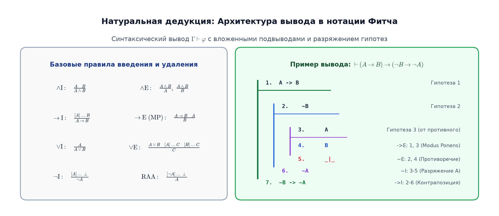

# 📝 Лекция 10: Натуральная дедукция, правила вывода, нотация Фитча, корректность и полнота

> **Дата:** `2026-09-12` (10-я неделя)  
> **Предмет:** Дискретная математика (1 семестр, 2026/27 уч. год)  
> **Преподаватель (лектор):** Константин Чухарев ([@Lipen](https://github.com/Lipen), Университет ИТМО)  
> **Модуль 3:** Формальная логика и дедукция  
> **Материалы курса:** [github.com/Lipen/discrete-math-course](https://github.com/Lipen/discrete-math-course) • Главы книги: `m02` • Слайды: `s1-lec10-deduction.pdf`

---

## 🧭 Навигация по лекции
1. [Введение: Два взгляда на истину — Семантика vs Синтаксис](#1-введение-семантика-vs-синтаксис)
2. [Архитектура систем формального вывода](#2-архитектура-систем-формального-вывода)
3. [Правила натуральной дедукции Генцена](#3-правила-натуральной-дедукции)
4. [Нотация Фитча и управление гипотезами](#4-нотация-фитча-и-управление-гипотезами)
5. [Пошаговый разбор эталонного вывода: Закон контрапозиции](#5-пошаговый-разбор-эталонного-вывода)
6. [Классическая и интуиционистская (конструктивная) логика](#6-классическая-и-интуиционистская-логика)
7. [Фундаментальные метатеоремы: Корректность и Полнота](#7-фундаментальные-метатеоремы)
8. [Исчисление секвенций и Теорема об устранении сечений](#8-исчисление-секвенций)
9. [Связь с Computer Science: Изоморфизм Карри—Говарда и верификаторы (Lean/Coq)](#9-связь-с-computer-science)
10. [Вопросы для самопроверки](#10-вопросы-для-самопроверки)

---

## 1. Введение: Семантика vs Синтаксис

До сих пор мы проверяли истинность логических утверждений перебором интерпретаций в таблицах истинности. Однако табличный метод страдает двумя непреодолимыми изъянами:
1. **Экспоненциальный тупик:** для формулы от $n$ переменных таблица требует $2^n$ строк, что делает перебор невозможным уже при $n \ge 60$.
2. **Немощь перед бесконечностью:** в логике предикатов и анализе предметная область часто бесконечна ($\mathbb{N}, \mathbb{R}$), и построить исчерпывающую таблицу физически невозможно.
3. **Отсутствие объяснения:** таблица сообщает *факт* («истинно»), но не раскрывает *причинно-следственную структуру* рассуждения («почему именно это верно»).

> [!important] Различие двух миров
> * **Семантическое следование ($\Gamma \models \varphi$):** мир моделей и вычислений. На любой интерпретации, где истинны гипотезы $\Gamma$, истинна формула $\varphi$.
> * **Синтаксическая выводимость ($\Gamma \vdash \varphi$):** мир символьных преобразований. Формула $\varphi$ механически получена из набора аксиом и гипотез $\Gamma$ чисто синтаксическим применением правил вывода.

---

## 2. Архитектура систем формального вывода

Существует два главных подхода к формализации вывода:
* **Аксиоматические исчисления Гильберта:** минимум правил вывода (обычно только Modus Ponens), но огромное число сложных аксиом-схем. Удобны для математиков, изучающих свойства самой логики, но крайне неестественны для построения реальных доказательств.
* **Натуральная дедукция (Герхард Генцен, 1935):** полное отсутствие аксиом. Вывод строится из временных допущений (гипотез), а для каждой связки вводятся парные правила: **введение (Introduction, I)** и **удаление (Elimination, E)**.

---

## 3. Правила натуральной дедукции

Каждая логическая связка обслуживается строго симметричной парой правил:

### 1. Конъюнкция ($\land$)
* **Введение ($\land\text{I}$):** если доказаны $A$ и $B$, то доказано $A \land B$:
  $$\frac{A \quad B}{A \land B} \quad (\land\text{I})$$
* **Удаление ($\land\text{E}$):** из конъюнкции $A \land B$ можно извлечь любой из конъюнктов:
  $$\frac{A \land B}{A} \quad (\land\text{E}_1) \qquad \frac{A \land B}{B} \quad (\land\text{E}_2)$$

### 2. Импликация ($\to$)
* **Введение ($\to\text{I}$):** если, временно предположив гипотезу $A$, мы смогли вывести утверждение $B$, то гипотеза $A$ *разряжается* (закрывается), и мы получаем безусловный вывод импликации $A \to B$:
  $$\frac{\begin{array}{c} [A] \\ \vdots \\ B \end{array}}{A \to B} \quad (\to\text{I})$$
* **Удаление ($\to\text{E}$, Modus Ponens):** если доказано $A \to B$ и доказана посылка $A$, то заключение $B$ истинно:
  $$\frac{A \to B \quad A}{B} \quad (\to\text{E})$$

### 3. Дизъюнкция ($\lor$)
* **Введение ($\lor\text{I}$):** зная истинность одного из членов, дизъюнкцию можно дополнить любой формулой:
  $$\frac{A}{A \lor B} \quad (\lor\text{I}_1) \qquad \frac{B}{A \lor B} \quad (\lor\text{I}_2)$$
* **Удаление ($\lor\text{E}$, метод разбора случаев):** если доказано $A \lor B$, и из гипотезы $A$ выводится $C$, и из альтернативной гипотезы $B$ также выводится то же самое $C$, то $C$ доказано безусловно:
  $$\frac{A \lor B \quad \begin{array}{c} [A] \\ \vdots \\ C \end{array} \quad \begin{array}{c} [B] \\ \vdots \\ C \end{array}}{C} \quad (\lor\text{E})$$

### 4. Отрицание ($\neg$) и абсурд ($\bot$)
* **Удаление отрицания ($\neg\text{E}$):** формула и ее прямое отрицание порождают логический абсурд / противоречие $\bot$:
  $$\frac{A \quad \neg A}{\bot} \quad (\neg\text{E})$$
* **Введение отрицания ($\neg\text{I}$):** если предположение гипотезы $A$ приводит к противоречию $\bot$, то гипотеза $A$ разряжается, и выводится $\neg A$:
  $$\frac{\begin{array}{c} [A] \\ \vdots \\ \bot \end{array}}{\neg A} \quad (\neg\text{I})$$
* **Правило взрыва ($\bot\text{E}$, Ex Falso Quodlibet):** из ложного утверждения (противоречия) выводимо абсолютно любое высказывание $A$:
  $$\frac{\bot}{A} \quad (\bot\text{E})$$

---

## 4. Нотация Фитча и управление гипотезами

Чтобы формальные выводы не превращались в запутанные графы, американский логик Фредерик Фитч (1952) предложил строгий построчный табличный синтаксис:
1. **Область видимости (Scope Line):** вертикальная линия слева обозначает время жизни текущей гипотезы.
2. **Ввод гипотезы (Assumption Line):** гипотеза пишется вверху блока и отделяется короткой горизонтальной чертой.
3. **Вложенность (Subproofs):** гипотезы могут открываться рекурсивно внутри других гипотез.
4. **Закон разряжения (Discharging):** при применении правил $\to\text{I}$ или $\neg\text{I}$ вертикальная линия подвывода завершается. **Строго запрещено** ссылаться на любые строки из закрытого подвывода снаружи!

---

## 5. Пошаговый разбор эталонного вывода

Докажем формально в системе натуральной дедукции закон контрапозиции:
$$\vdash (A \to B) \to (\neg B \to \neg A)$$

| № строки | Формула | Обоснование / Правило | Комментарий |
|---|---|---|---|
| **1** | $\quad A \to B$ | **Гипотеза 1** | Открываем внешний контекст |
| **2** | $\quad\quad \neg B$ | **Гипотеза 2** | Открываем подвывод |
| **3** | $\quad\quad\quad A$ | **Гипотеза 3** | Допущение от противного |
| **4** | $\quad\quad\quad B$ | $\to\text{E} : 1, 3$ | Modus Ponens из строк 1 и 3 |
| **5** | $\quad\quad\quad \bot$ | $\neg\text{E} : 4, 2$ | Противоречие между $B$ и $\neg B$ |
| **6** | $\quad\quad \neg A$ | $\neg\text{I} : 3–5$ | Разряжаем гипотезу $A$ |
| **7** | $\quad \neg B \to \neg A$ | $\to\text{I} : 2–6$ | Разряжаем гипотезу $\neg B$ |
| **8** | $(A \to B) \to (\neg B \to \neg A)$ | $\to\text{I} : 1–7$ | Разряжаем гипотезу 1 (Вывод завершен!) |

Вывод завершен без неразряженных гипотез: закон доказан строго синтаксически.

---

## 6. Классическая и интуиционистская логика

Правила натуральной дедукции, перечисленные в разделе 3, задают **интуиционистскую (конструктивную) логику**. В ней нельзя доказать факт существования объекта без предъявления эффективного алгоритма его построения.

Чтобы получить полную **классическую логику**, к правилам необходимо добавить одно из эквивалентных расширений:
1. **Снятие двойного отрицания (Double Negation Elimination, DNE):**
   $$\frac{\neg\neg A}{A} \quad (\neg\neg\text{E})$$
2. **Закон исключенного третьего (Law of Excluded Middle, LEM):** $\vdash A \lor \neg A$.
3. **Классическое рассуждение от противного (RAA):** если $\neg A \vdash \bot$, то $A$.

---

## 7. Фундаментальные метатеоремы

Натуральная дедукция связывает семантику и синтаксис двумя великими теоремами математической логики:

> [!theorem] Теорема о корректности (Soundness)
> Если формула $\varphi$ синтаксически выводима из гипотез $\Gamma$, то она гарантированно семантически следует из них:
> $$\Gamma \vdash \varphi \implies \Gamma \models \varphi.$$
> *Смысл:* Система натуральной дедукции надежна — в ней невозможно доказать ложь или получить противоречие из истинных предпосылок.

> [!theorem] Теорема о полноте (Completeness, Курт Гёдель, 1929)
> Если формула $\varphi$ семантически следует из множества гипотез $\Gamma$, то в натуральной дедукции обязательно существует конечный синтаксический вывод этой формулы:
> $$\Gamma \models \varphi \implies \Gamma \vdash \varphi.$$
> *Смысл:* Правил Генцена абсолютно достаточно — любая логическая истина может быть доказана формально механической манипуляцией символами.

Объединяя обе теоремы, получаем тождество:
$$\Gamma \vdash \varphi \iff \Gamma \models \varphi.$$

---

## 8. Исчисление секвенций

Наряду с натуральной дедукцией Генцен разработал **исчисление секвенций** ($\mathbf{LK}$ для классической, $\mathbf{LJ}$ для интуиционистской логики). Секвенция имеет вид:
$$\Gamma \vdash \Delta \quad \equiv \quad (\varphi_1 \land \dots \land \varphi_n) \to (\psi_1 \lor \dots \lor \psi_m).$$

> [!theorem] Главная теорема Генцена (Hauptsatz / Cut Elimination, 1935)
> Всякое доказательство в исчислении секвенций с правилом сечения (Cut Rule) может быть конструктивно перестроено в прямое доказательство **без правила сечения**.

### Свойство подформульности (Subformula Property):
В доказательстве без сечений все промежуточные формулы являются подформулами конечного заключения. Это свойство превращает поиск математических доказательств в алгоритмически разрешимую синтаксическую процедуру (базис автоматических Prover-систем).

---

## 9. Связь с Computer Science

### Изоморфизм Карри—Говарда (Propositions-as-Types)
Между формальной логикой и теорией языков программирования существует глубокий изоморфизм:
* **Высказывание (Формула)** $\longleftrightarrow$ **Тип данных (Type)**.
* **Доказательство формулы** $\longleftrightarrow$ **Программа / Терм (Program / Term)**.
* **Правило введения связки** $\longleftrightarrow$ **Конструктор типа**.
* **Правило удаления связки** $\longleftrightarrow$ **Деструктор / Pattern Matching**.
* **Устранение сечений Генцена** $\longleftrightarrow$ **$\beta$-редукция (вычисление программы)**.

| Логическая связка | Тип в языке программирования (Rust / Scala / Haskell) |
|---|---|
| $A \land B$ (Конъюнкция) | Кортеж / структура пар: `(A, B)` |
| $A \lor B$ (Дизъюнкция) | Тип-сумма / размеченное объединение: `Result<A, B>` / `Either A B` |
| $A \to B$ (Импликация) | Функция / замыкание: `fn(A) -> B` |
| $\bot$ (Ложь / Абсурд) | Пустой тип: `!` (never type в Rust, `Void` в Haskell) |
| $\neg A \equiv A \to \bot$ | Функция, возвращающая невозможный тип: `fn(A) -> !` |

Современные среды верификации ПО и доказательства математических теорем (**Lean 4, Coq, Agda**) работают в точности по этому принципу: компилятор проверяет типизацию кода, тем самым строго доказывая математическую теорему!

---

## 10. Вопросы для самопроверки

1. Чем синтаксический вывод $\Gamma \vdash \varphi$ принципиально отличается от семантического следования $\Gamma \models \varphi$?
2. Постройте вывод формулы $(A \land B) \to (B \land A)$ в правилах натуральной дедукции.
3. Почему в нотации Фитча категорически запрещено ссылаться на формулы, находящиеся внутри закрытого подвывода?
4. Сформулируйте суть теоремы Гёделя о полноте и объясните, почему она важна для компиляторов верифицируемых языков.
5. Приведите аналогию изоморфизма Карри—Говарда для правила Modus Ponens в терминах вызова функций.
