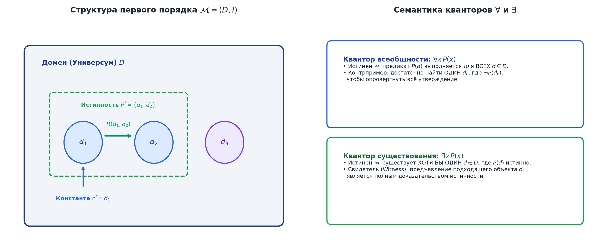

# 📝 Лекция 11: Логика первого порядка (FOL), сигнатуры, термы, структуры, модели и силлогистика

> **Дата:** `2026-09-12` (11-я неделя)  
> **Предмет:** Дискретная математика (1 семестр, 2026/27 уч. год)  
> **Преподаватель (лектор):** Константин Чухарев ([@Lipen](https://github.com/Lipen), Университет ИТМО)  
> **Модуль 3:** Формальная логика и дедукция  
> **Материалы курса:** [github.com/Lipen/discrete-math-course](https://github.com/Lipen/discrete-math-course) • Главы книги: `m03` • Слайды: `s1-lec11-fol.pdf`

---

## 🧭 Навигация по лекции
1. [Введение: Почему логики высказываний недостаточно?](#1-введение-почему-логики-высказываний-недостаточно)
2. [Синтаксис FOL: Сигнатура, термы и формулы](#2-синтаксис-fol)
3. [Свободные и связанные переменные, замкнутые формулы](#3-переменные-и-области-видимости)
4. [Семантика FOL: Алгебраические структуры и модели Тарского](#4-семантика-fol-структуры-и-модели-тарского)
5. [Общезначимость и выполнимость в модели](#5-общезначимость-и-выполнимость)
6. [Силлогистика Аристотеля: Категорические суждения и логический квадрат](#6-силлогистика-аристотеля)
7. [Фундаментальные метатеоремы FOL: Полнота, Компактность и Неразрешимость](#7-фундаментальные-метатеоремы-fol)
8. [Связь с Computer Science: SQL, онтологии и SMT-солверы](#8-связь-с-computer-science)
9. [Вопросы для самопроверки](#9-вопросы-для-самопроверки)

---

## 1. Введение: Почему логики высказываний недостаточно?

Рассмотрим классический античный силлогизм:
* Посылка 1: «Все люди смертны».
* Посылка 2: «Сократ — человек».
* Заключение: «Следовательно, Сократ смертен».

Если попытаться записать это рассуждение на языке логики высказываний, мы будем вынуждены обозначить каждую фразу отдельной атомарной переменной:
$$P_1 \land P_2 \implies Q.$$
Но в логике высказываний формула $(p \land q) \to r$ **не является тавтологией**! Логика высказываний «слепа» к внутреннему устройству атомов: она не видит конкретного объекта (*Сократ*), его принадлежности к множеству (*человек*) и отношения следования свойств (*смертен*).

Чтобы вдохнуть жизнь в предикаты и функции, создается **логика первого порядка (First-Order Logic, FOL)** — универсальный язык современной математики.

---

## 2. Синтаксис FOL

Синтаксис логики первого порядка строго разделяет язык на два уровня:
1. **Термы (Terms):** называют и конструируют *объекты* предметного мира.
2. **Формулы (Formulas):** формулируют *утверждения* об объектах (истинностные значения).

### 2.1. Сигнатура
> [!definition] Определение: Сигнатура
> **Сигнатурой** $\Sigma = (\mathcal{C}, \mathcal{F}, \mathcal{P})$ называется набор символов:
> * $\mathcal{C}$ — множество констант (имена фиксированных объектов, например, $0, 1, e$);
> * $\mathcal{F}$ — множество функциональных символов с указанием арности $n \ge 1$ (например, $+$, $\times$, $\sin$);
> * $\mathcal{P}$ — множество предикатных символов с указанием арности $k \ge 1$ (например, $=$, $<$, $\text{IsPrime}$).

### 2.2. Термы
> [!definition] Определение: Терм
> Множество **термов** над сигнатурой $\Sigma$ и счетным множеством переменных $\mathcal{V} = \{x, y, z, \dots\}$ определяется индуктивно:
> 1. Любая переменная $x \in \mathcal{V}$ есть терм.
> 2. Любая константа $c \in \mathcal{C}$ есть терм.
> 3. Если $f \in \mathcal{F}$ — функциональный символ арности $n$, и $t_1, t_2, \dots, t_n$ — термы, то $f(t_1, \dots, t_n)$ — терм.
> 
> *Терм не является утверждением! Он не может быть истинным или ложным.*

### 2.3. Формулы
> [!definition] Определение: Формула FOL
> 1. **Атомарная формула:** если $P \in \mathcal{P}$ — предикатный символ арности $k$, а $t_1, \dots, t_k$ — термы, то $P(t_1, \dots, t_k)$ есть атомарная формула. (Также часто в язык включают предикат равенства $t_1 = t_2$).
> 2. **Составная формула:** если $\varphi, \psi$ — формулы, а $x \in \mathcal{V}$ — переменная, то формулами являются:
>    $$\neg \varphi, \quad (\varphi \land \psi), \quad (\varphi \lor \psi), \quad (\varphi \to \psi), \quad (\varphi \iff \psi), \quad \forall x \, \varphi, \quad \exists x \, \varphi.$$

---

## 3. Переменные и области видимости

* **Связанное вхождение переменной:** вхождение переменной $x$ в подформулу квантора $\forall x$ или $\exists x$.
* **Свободное вхождение:** вхождение, не находящееся в области действия квантора по этой переменной.
* **Предложение (Замкнутая формула, Sentence):** формула, не содержащая свободных переменных. Значение истинности предложения не зависит от контекста вычисления.

---

## 4. Семантика FOL: Структуры и модели Тарского

Сам по себе синтаксический терм $+(x, 1)$ или предикат $P(x)$ не несет смысла, пока мы не задали интерпретацию.

> [!definition] Определение: Алгебраическая структура (Модель)
> **Структурой (моделью)** $\mathcal{M} = (D, \mathcal{I})$ сигнатуры $\Sigma$ называется пара:
> 1. **Носитель (Domain / Universe) $D$:** непустое множество объектов.
> 2. **Функция интерпретации $\mathcal{I}$:**
>    * Каждой константе $c \in \mathcal{C}$ сопоставляет конкретный элемент $c^\mathcal{M} \in D$;
>    * Каждому функциональному символу $f \in \mathcal{F}$ арности $n$ сопоставляет операцию $f^\mathcal{M}: D^n \to D$;
>    * Каждому предикатному символу $P \in \mathcal{P}$ арности $k$ сопоставляет отношение $P^\mathcal{M} \subseteq D^k$.

### Вычисление истинности (Семантика Тарского)
Пусть $\sigma: \mathcal{V} \to D$ — оценка переменных.
* Значение терма $\llbracket t \rrbracket_{\mathcal{M}, \sigma} \in D$ вычисляется подстановкой значений переменных.
* Атомарная формула истинна: $\mathcal{M}, \sigma \models P(t_1, \dots, t_k) \iff (\llbracket t_1 \rrbracket, \dots, \llbracket t_k \rrbracket) \in P^\mathcal{M}$.
* **Квантор всеобщности:** $\mathcal{M}, \sigma \models \forall x \, \varphi \iff$ для абсолютно любого элемента $d \in D$ выполнено $\mathcal{M}, \sigma[x \mapsto d] \models \varphi$.
* **Квантор существования:** $\mathcal{M}, \sigma \models \exists x \, \varphi \iff$ найдется хотя бы один элемент $d \in D$, такой что $\mathcal{M}, \sigma[x \mapsto d] \models \varphi$.

---

## 5. Общезначимость и выполнимость

> [!definition] Категории истинности в FOL
> * **Общезначимая формула (Valid):** истинна во **всех** возможных структурах $\mathcal{M}$ при всех оценках $\sigma$. Обозначается $\models \varphi$.
> * **Выполнимая формула (Satisfiable):** существует хотя бы одна структура $\mathcal{M}$ и оценка $\sigma$, в которой формула истинна ($\mathcal{M}$ называется **моделью** формулы).
> * **Невыполнимая формула (Unsatisfiable):** не имеет ни одной модели.

---

## 6. Силлогистика Аристотеля

Силлогистика, созданная Аристотелем в трактате «Первая аналитика» (IV век до н.э.), представляет собой исторически первый строгий фрагмент логики первого порядка.

### Четыре типа категорических суждений:
1. **$A$ (Общеутвердительное, *Affirmo*):** «Все $S$ суть $P$»
   $$\forall x \, (S(x) \to P(x))$$
2. **$E$ (Общеотрицательное, *Nego*):** «Ни одно $S$ не есть $P$»
   $$\forall x \, (S(x) \to \neg P(x))$$
3. **$I$ (Частноутвердительное):** «Некоторые $S$ суть $P$»
   $$\exists x \, (S(x) \land P(x))$$
4. **$O$ (Частноотрицательное):** «Некоторые $S$ не суть $P$»
   $$\exists x \, (S(x) \land \neg P(x))$$

### Логический квадрат (Square of Opposition)
* **Противоречие (Contradiction, по диагоналям):** $A$ и $O$, $E$ и $I$ — одно в точности отрицает другое: $\neg A \equiv O, \; \neg E \equiv I$.
* **Противоположность (Contrariety, верхняя грань):** $A$ и $E$ не могут быть одновременно истинными (при непустом $S$).
* **Подчинение (Subalternation, боковые грани):** $A \implies I, \quad E \implies O$.

### Модус Barbara (Первая фигура)
Формализация античного силлогизма о Сократе:
$$\frac{\forall x \, (M(x) \to P(x)) \quad \forall x \, (S(x) \to M(x))}{\forall x \, (S(x) \to P(x))} \quad (\text{Barbara})$$
Подставляя $M = \text{Человек}$, $P = \text{Смертен}$, $S(x) \equiv (x = \text{Сократ})$, получаем абсолютную корректность вывода.

---

## 7. Фундаментальные метатеоремы FOL

> [!theorem] Теорема Гёделя о полноте логики первого порядка (1929)
> Для исчисления предикатов первого порядка справедливо:
> $$\Gamma \models \varphi \iff \Gamma \vdash \varphi.$$
> Всякая общезначимая формула FOL выводима за конечное число механических шагов.

> [!theorem] Теорема компактности Мальцева (1936)
> Множество формул первого порядка $\Gamma$ имеет модель тогда и только тогда, когда каждое его **конечное** подмножество $\Gamma_0 \subseteq \Gamma$ имеет модель.

*Следствие компактности (Невыразимость конечности):* В логике первого порядка невозможно написать формулу, которая была бы истинна на всех конечных моделях и ложна на всех бесконечных!

> [!theorem] Неразрешимость логики первого порядка (Чёрч, Тьюринг, 1936)
> В отличие от логики высказываний (где выполнимость решается перебором таблицы истинности за $2^n$), в общей логике первого порядка **не существует алгоритма**, который для произвольной формулы $\varphi$ за конечное время определял бы, является ли она общезначимой. Множество общезначимых формул FOL полуразрешимо (перечислимо), но не разрешимо.

---

## 8. Связь с Computer Science

1. **Реляционные базы данных и реляционное исчисление кортежей (TRC):** Язык SQL декларативно основан на формулах первого порядка. Запрос `SELECT * FROM Users WHERE age > 18` — это предикатная формула $\{u \in \text{Users} \mid \text{age}(u) > 18\}$.
2. **Теорема Кодда:** Реляционная алгебра по выразительной силе эквивалентна безопасному фрагменту логики первого порядка.
3. **SMT-солверы (Satisfiability Modulo Theories):** Промышленные верификаторы (Z3 от Microsoft Research, CVC5) решают задачу выполнимости формул первого порядка над специализированными теориями (теория линейной арифметики над $\mathbb{Z}/\mathbb{R}$, теория неинтерпретируемых функций, теория битовых векторов, теория массивов). Применяются для поиска уязвимостей в ядре ОС и смарт-контрактах.

---

## 9. Вопросы для самопроверки

1. Чем отличается терм от формулы в логике первого порядка? Может ли терм иметь истинностное значение?
2. Переведите на язык FOL суждение: *«У каждого действительного числа, отличного от нуля, есть единственный обратный элемент по умножению»*.
3. Постройте модель, в которой формула $\forall x \exists y \, P(x, y)$ истинна, а формула $\exists y \forall x \, P(x, y)$ ложна.
4. В чем заключается принципиальное различие между теоремой Гёделя о полноте FOL и его же знаменитыми теоремами о неполноте арифметики?
5. Почему логика первого порядка не может выразить свойство графа «быть связным»? (Подсказка: используйте теорему компактности).
