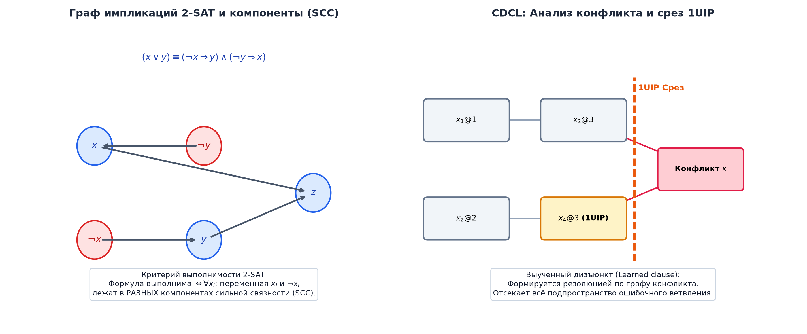

# 📝 Лекция 12: Булевы функции, совершенные формы, задача SAT, 2-SAT и алгоритмы DPLL и CDCL

> **Дата:** `2026-09-12` (12-я неделя)  
> **Предмет:** Дискретная математика (1 семестр, 2026/27 уч. год)  
> **Преподаватель (лектор):** Константин Чухарев ([@Lipen](https://github.com/Lipen), Университет ИТМО)  
> **Модуль 4:** Булева алгебра, схемы и теория кодирования  
> **Материалы курса:** [github.com/Lipen/discrete-math-course](https://github.com/Lipen/discrete-math-course) • Главы книги: `m10`, `m14` • Слайды: `s1-lec12-boolean-sat.pdf`

---

## 🧭 Навигация по лекции
1. [Введение: Дискретный базис цифровой цивилизации](#1-введение)
2. [Булевы функции: Пространство $\{0, 1\}^n \to \{0, 1\}$ и его колоссальный рост](#2-булевы-функции-и-их-пространство)
3. [Фиктивные и существенные переменные](#3-фиктивные-и-существенные-переменные)
4. [Совершенные нормальные формы: СДНФ и СКНФ](#4-совершенные-нормальные-формы-сднф-и-скнф)
5. [Проблема булевой выполнимости (SAT) и Теорема Кука—Левина](#5-проблема-булевой-выполнимости-sat)
6. [Линейный случай: Алгоритм 2-SAT на графах импликаций](#6-линейный-случай-алгоритм-2-sat)
7. [Современные SAT-решатели: Эволюция от DPLL к CDCL](#7-современные-sat-решатели-dpll-и-cdcl)
8. [Кодирование прикладных задач в SAT](#8-кодирование-прикладных-задач-в-sat)
9. [Вопросы для самопроверки](#9-вопросы-для-самопроверки)

---

## 1. Введение

Вся современная вычислительная техника — от простейшего микроконтроллера до суперкомпьютера — оперирует информацией, представленной в виде двоичных битов $\{0, 1\}$. 

Математическим аппаратом цифровых вычислений является **булева алгебра**, созданная Джорджем Булем в середине XIX века и превращенная Клодом Шенноном в 1937 году в инженерный язык проектирования интегральных микросхем. Четвертый модуль курса посвящен булевым функциям, алгоритмам их разрешения, минимизации и помехоустойчивому кодированию.

---

## 2. Булевы функции и их пространство

> [!definition] Определение: Булева функция
> **Булевой (логической) функцией** от $n$ переменных называется отображение:
> $$f: \{0, 1\}^n \to \{0, 1\}.$$
> Вектор $(x_1, x_2, \dots, x_n) \in \{0, 1\}^n$ называется **двоичным набором** (кортежем аргументов).

### Мощность пространства булевых функций
1. Число различных двоичных наборов длины $n$ равно числу вершин $n$-мерного булева куба: $|\{0, 1\}^n| = 2^n$.
2. Сама функция задается вектором своих значений длины $2^n$ (таблицей истинности).
3. Следовательно, общее число различных булевых функций от $n$ переменных равно:
   $$N(n) = 2^{2^n}.$$

| Число переменных $n$ | Число наборов $2^n$ | Общее число булевых функций $2^{2^n}$ | Комментарий |
|:---:|:---:|:---:|---|
| **0** | 1 | $2^1 = 2$ | Константы 0 и 1 |
| **1** | 2 | $2^2 = 4$ | $0, 1, x, \neg x$ |
| **2** | 4 | $2^4 = 16$ | AND, OR, XOR, NAND, NOR, $\to$, $\dots$ |
| **3** | 8 | $2^8 = 256$ | Умещается в байт |
| **4** | 16 | $2^{16} = 65\,536$ | Карты Карно |
| **5** | 32 | $2^{32} \approx 4{,}29 \times 10^9$ | Больше населения Земли в середине XX века |
| **6** | 64 | $2^{64} \approx 1{,}84 \times 10^{19}$ | Превосходит число песчинок на пляжах планеты |

Этот сверхэкспоненциальный рост демонстрирует, почему прямой перебор функций невозможен уже при скромных $n$.

---

## 3. Фиктивные и существенные переменные

> [!definition] Определения
> Переменная $x_i$ булевой функции $f(x_1, \dots, x_i, \dots, x_n)$ называется:
> * **Существенной:** если найдется такой набор значений остальных переменных $(\alpha_1, \dots, \alpha_{i-1}, \alpha_{i+1}, \dots, \alpha_n)$, при котором изменение значения $x_i$ с $0$ на $1$ меняет значение функции:
>   $$f(\alpha_1, \dots, 0, \dots, \alpha_n) \ne f(\alpha_1, \dots, 1, \dots, \alpha_n).$$
> * **Фиктивной:** если значение функции абсолютно не зависит от $x_i$ при любых значениях остальных аргументов. Фиктивные переменные можно удалять из таблицы и формулы функции без изменения ее семантики.

---

## 4. Совершенные нормальные формы (СДНФ и СКНФ)

Любая булева функция, не являющаяся тождественным нулем или единицей, может быть однозначно представлена в каноническом синтаксическом виде.

### 4.1. Минтермы и СДНФ
> [!definition] Определение: Минтерм (Конституента единицы)
> **Минтермом** $m_\alpha(x_1, \dots, x_n)$ набора $\alpha = (\alpha_1, \dots, \alpha_n)$ называется конъюнкция всех $n$ переменных, где переменная берется без отрицания, если $\alpha_i = 1$, и с отрицанием, если $\alpha_i = 0$:
> $$m_\alpha = \bigwedge_{i=1}^n x_i^{\alpha_i}, \quad \text{где } x^1 = x, \; x^0 = \neg x.$$
> *Свойство:* Минтерм $m_\alpha$ равен $1$ **ровно на одном** наборе $\alpha$ и равен $0$ на всех остальных $2^n - 1$ наборах.

> [!theorem] Совершенная дизъюнктивная нормальная форма (СДНФ)
> Каждая булева функция $f \not\equiv 0$ единственным образом представляется в виде дизъюнкции минтермов тех наборов $\alpha$, на которых функция принимает значение $1$:
> $$f(x_1, \dots, x_n) = \bigvee_{\alpha : f(\alpha) = 1} m_\alpha.$$

### 4.2. Макстермы и СКНФ
> [!definition] Определение: Макстерм (Конституента нуля)
> **Макстермом** $M_\alpha(x_1, \dots, x_n)$ набора $\alpha$ называется дизъюнкция всех $n$ переменных, где переменная входит с отрицанием, если $\alpha_i = 1$, и без отрицания, если $\alpha_i = 0$:
> $$M_\alpha = \bigvee_{i=1}^n x_i^{1 - \alpha_i}.$$
> *Свойство:* Макстерм $M_\alpha$ равен $0$ **ровно на одном** наборе $\alpha$.

> [!theorem] Совершенная конъюнктивная нормальная форма (СКНФ)
> Каждая булева функция $f \not\equiv 1$ единственным образом представляется в виде конъюнкции макстермов тех наборов $\beta$, на которых функция принимает значение $0$:
> $$f(x_1, \dots, x_n) = \bigwedge_{\beta : f(\beta) = 0} M_\beta.$$

---

## 5. Проблема булевой выполнимости (SAT)

> [!definition] Постановка задачи SAT
> Дана формула булевой логики $\Phi$ в конъюнктивной нормальной форме (КНФ). Требуется определить: существует ли такой набор булевых значений переменных $(x_1, \dots, x_n) \in \{0, 1\}^n$, при котором вся формула обращается в истину ($\Phi(x) = 1$), или доказать, что формула невыполнима.

> [!theorem] Теорема Кука—Левина (1971)
> Задача SAT является **NP-полной** (первая исторически доказанная NP-полная задача).
> * **$\text{SAT} \in \text{NP}$:** сертификат (выполняющий набор значений переменных) проверяется за полиномиальное время подстановкой в формулу.
> * **NP-трудность:** любая задача из класса $\text{NP}$ может быть за полиномиальное время сведена к решению задачи SAT (кодированием работы недетерминированной машины Тьюринга в логическую формулу).

---

## 6. Линейный случай: Алгоритм 2-SAT

Если каждый дизъюнкт формулы в КНФ содержит **не более двух** литералов, задача называется **2-SAT**. В отличие от 3-SAT (которая NP-полна), задача 2-SAT решается за строго **линейное время $O(V + E)$**!

### Граф импликаций (Implication Graph)
Каждый дизъюнкт длины 2 равносилен двум эквивалентным логическим импликациям:
$$(a \lor b) \quad \equiv \quad (\neg a \to b) \quad \equiv \quad (\neg b \to a).$$
Построим ориентированный граф $G = (V, E)$:
* Вершины $V$: все литералы $x_i$ и $\neg x_i$ ($2n$ вершин).
* Дуги $E$: для каждого дизъюнкта $(a \lor b)$ добавляем две направленные дуги: $(\neg a \to b)$ и $(\neg b \to a)$.

> [!theorem] Критерий Аспевалла, Плассика и Тарьяна (1979)
> Формула 2-SAT выполнима тогда и только тогда, когда ни для одной переменной $x$ вершины $x$ и $\neg x$ **не принадлежат одной компоненте сильной связности (SCC)** в графе импликаций $G$:
> $$\Phi \in \text{SAT} \iff \forall x \; \big(x \not\rightsquigarrow \neg x \lor \neg x \not\rightsquigarrow x\big).$$

### Алгоритм решения 2-SAT:
1. Построить граф импликаций $G$.
2. Выделить компоненты сильной связности алгоритмом Тарьяна или Косарайю за время $O(|V| + |E|)$.
3. Проверить: если для некоторой переменной $x$ компоненты $\text{SCC}(x) == \text{SCC}(\neg x)$, вернуть **UNSAT**.
4. Иначе топологически отсортировать конденсацию графа: переменной присваивается значение $1$, если ее компонента расположена позже компоненты ее отрицания в топологическом порядке.

---

## 7. Современные SAT-решатели: DPLL и CDCL

Хотя в худшем случае SAT экспоненциален ($2^n$), современные солверы (MiniSat, Glucose, CaDiCaL, Z3) легко решают промышленные задачи с миллионами переменных и ограничений!

| Характеристика | Алгоритм DPLL (1962) | Алгоритм CDCL (1996+) |
| :--- | :--- | :--- |
| **Основа** | Поиск с возвратом (DFS) | DPLL-каркас + динамический граф импликаций |
| **Упрощение** | Unit Propagation (BCP) + Pure Literal | Масштабный Two-Watched Literals BCP |
| **Откат при тупике** | Хронологический бэктрекинг (на 1 шаг назад) | **Нехронологический откат (Backjump)** через 1-UIP |
| **Обучение** | Нет (ошибки повторяются) | **Обучение дизъюнктам (Clause Learning)** |
| **Выбор ветвления** | Статические правила / случайный | Динамические эвристики наград (VSIDS, EVSIDS) |
| **Рестарты** | Отсутствуют | Периодические рестарты (Luby / Geometric) |

### 1. Алгоритм DPLL (Davis—Putnam—Logemann—Loveland, 1962)
Опирается на три фундаментальных правила:
1. **Распространение единичных дизъюнктов (Boolean Constraint Propagation, BCP):** если в формуле есть дизъюнкт из одного литерала $(l)$, то чтобы формула была истинной, мы обязаны положить $l = 1$. Это упрощает формулу: удаляет дизъюнкты с $l$ и вычеркивает литерал $\neg l$ из остальных дизъюнктов.
2. **Чистый литерал (Pure Literal Rule):** если переменная $p$ входит во все оставшиеся дизъюнкты только с одним знаком, присваиваем ей соответствующее значение.
3. **Ветвление (Decide & Backtrack):** выбираем свободную переменную, делаем предположение $x = 1$, рекурсивно проверяем. Если тупик — откатываемся и пробуем $x = 0$.

### 2. Революция CDCL (Conflict-Driven Clause Learning, 1996)
В CDCL хронологический перебор заменен интеллектуальным анализом причин конфликта:
* **Граф импликаций (Implication Graph):** динамически отслеживает, какие решения привели к обнулению всех литералов в некотором дизъюнкте (конфликт).
* **Обучение на конфликтах (Clause Learning):** через сечение графа в точке **1-UIP (First Unique Implication Point)** синтезируется новый дизюнкт-блокиратор (Learned Clause), который добавляется в базу знаний. Он навсегда предотвращает повторный вход солвера в аналогичную тупиковую область пространства поиска.
* **Нехронологический откат (Backjumping):** солвер перепрыгивает назад сразу через десятки уровней дерева решений в точку, где конфликтный дизюнкт становится унитарным.

---

## 8. Кодирование прикладных задач в SAT

Решение реальных инженерных задач состоит в переводе условий на язык КНФ.

> [!example] Кодирование раскраски графа в $k$ цветов
> Пусть дан граф $G = (V, E)$. Требуется раскрасить его вершины в $k$ цветов так, чтобы смежные вершины имели разные цвета.
> 1. **Переменные:** $x_{v, c} \in \{0, 1\}$ — вершина $v$ окрашена в цвет $c \in \{1, \dots, k\}$.
> 2. **Ограничение 1 (Каждая вершина имеет хотя бы один цвет):**
>    $$\forall v \in V : \bigvee_{c=1}^k x_{v, c}.$$
> 3. **Ограничение 2 (Вершина имеет не более одного цвета):**
>    $$\forall v \in V, \; \forall c_1 < c_2 : (\neg x_{v, c_1} \lor \neg x_{v, c_2}).$$
> 4. **Ограничение 3 (Смежные вершины разного цвета):**
>    $$\forall (u, v) \in E, \; \forall c \in \{1, \dots, k\} : (\neg x_{u, c} \lor \neg x_{v, c}).$$
> Полученная КНФ подается SAT-солверу. Если ответ SAT — модель задает валидную раскраску. Если UNSAT — граф невозможно раскрасить в $k$ цветов.

---

## 9. Вопросы для самопроверки

1. Сколько различных булевых функций существует от $n=4$ переменных? Сколько из них существенно зависят от всех 4 переменных?
2. Постройте СДНФ и СКНФ для функции импликации $f(x, y) = x \to y$.
3. В чем заключается принципиальная алгоритмическая разница между сложностью задач 2-SAT и 3-SAT?
4. Сформулируйте критерий выполнимости формулы 2-SAT в терминах сильной связности графа импликаций.
5. За счет каких трех ключевых эвристик современные CDCL-решатели способны справляться с задачами на миллионы переменных вопреки NP-полноте SAT?
