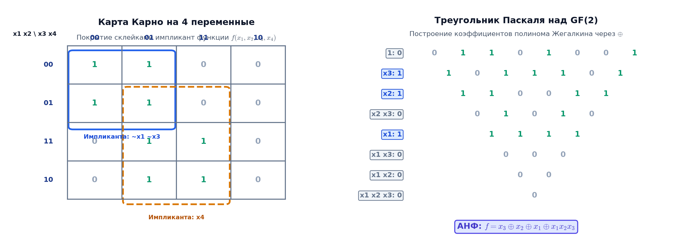

# 📝 Лекция 13: Минимизация булевых функций, карты Карно, полиномы Жегалкина и критерий Поста

> **Дата:** `2026-09-12` (13-я неделя)  
> **Предмет:** Дискретная математика (1 семестр, 2026/27 уч. год)  
> **Преподаватель (лектор):** Константин Чухарев ([@Lipen](https://github.com/Lipen), Университет ИТМО)  
> **Модуль 4:** Булева алгебра, схемы и теория кодирования  
> **Материалы курса:** [github.com/Lipen/discrete-math-course](https://github.com/Lipen/discrete-math-course) • Главы книги: `m10` • Слайды: `s1-lec13-zhegalkin.pdf`

---

## 🧭 Навигация по лекции
1. [Введение: Аппаратная цена избыточности](#1-введение-аппаратная-цена-избыточности)
2. [Аналитическая склейка и простые импликанты](#2-аналитическая-склейка-и-простые-импликанты)
3. [Карты Карно: Геометрия кода Грея на плоскости](#3-карты-карно-геометрия-кода-грея-на-плоскости)
4. [Алгоритм Квайна — МакКласки](#4-алгоритм-квайна-маккласки)
5. [Полином Жегалкина (АНФ): Единственность над $\mathbb{F}_2$](#5-полином-жегалкина-анф-единственность-над)
6. [Методы построения полинома Жегалкина](#6-методы-построения-полинома-жегалкина)
7. [Функциональная полнота и критерий Поста](#7-функциональная-полнота-и-критерий-поста)
8. [Применение в криптографии и криптоанализе](#8-применение-в-криптографии-и-криптоанализе)
9. [Вопросы для самопроверки](#9-вопросы-для-самопроверки)

---

## 1. Введение: Аппаратная цена избыточности

В [[12. Лекция - Булевы функции, совершенные формы, задача SAT, алгоритмы DPLL и CDCL (2026-11-25)|Лекции 12]] мы установили, что любая булева функция однозначно задается своей **совершенной дизъюнктивной нормальной формой (СДНФ)**. Однако СДНФ — это лишь теоретическая отправная точка, но крайне неэффективная схема в физической реализации:
- Каждый литерал в логическом выражении соответствует физическому проводу и входному транзистору вентиля.
- Избыточные вентили увеличивают площадь кристалла кремния, повышают рассеиваемую тепловую мощность (TDP) и увеличивают задержку распространения сигнала (критический путь).

> **Цель минимизации:** найти логическую формулу, логически эквивалентную исходной функции $f$, содержащую минимальное суммарное число конъюнктов и литералов.

### Пример: Функция большинства трех аргументов
Рассмотрим мажоритарную функцию $\text{Maj}(x, y, z)$, равную $1$, если хотя бы два из трех входов равны $1$:
- **СДНФ (4 минтерма, 12 литералов):**
  $$f(x, y, z) = \bar{x} y z \vee x \bar{y} z \vee x y \bar{z} \vee x y z$$
- **Минимизированная ДНФ (3 импликанты, 6 литералов):**
  $$f(x, y, z) = x y \vee x z \vee y z$$
Аппаратная сложность сократилась ровно в два раза.

---

## 2. Аналитическая склейка и простые импликанты

Базовой операцией минимизации является **правило склейки**:
$$A x \vee A \bar{x} = A(x \vee \bar{x}) = A \cdot 1 = A,$$
где $A$ — произвольная конъюнкция литералов, не зависящая от переменной $x$. Два минтерма, различающиеся значением ровно одной переменной, объединяются в одну конъюнкцию меньшего ранга.

> [!definition] Определение: Импликанта и простая импликанта
> 1. Конъюнкция $P$ называется **импликантой** функции $f$, если на любом наборе аргументов, где $P = 1$, выполняется $f = 1$ (то есть $P \implies f$ является тавтологией).
> 2. Импликанта $P$ называется **простой импликантой** (_prime implicant_), если вычеркивание любого входящего в нее литерала превращает ее в конъюнкцию, которая перестает быть импликантой $f$.
> 3. Простая импликанта называется **существенной** (_essential prime implicant_), если она покрывает хотя бы один минтерм (единицу функции), который не покрывается ни одной другой простой импликантой.

Минимальная ДНФ (МДНФ) всегда состоит из объединения некоторого набора простых импликант, обязательным ядром которого являются все существенные импликанты.

---

## 3. Карты Карно: Геометрия кода Грея на плоскости

> [!definition] Определение: Карта Карно
> **Картой Карно** (_Karnaugh map_) называется специальная таблица значений булевой функции, в которой строки и столбцы упорядочены в **коде Грея**.

Главное свойство кода Грея: соседние кодовые слова (включая первое и последнее) различаются ровно в **одном** бите. Благодаря этому соседние клетки таблицы по горизонтали и вертикали соответствуют соседним вершинам $n$-мерного булева куба, то есть минтермам, допускающим непосредственную склейку.

### Основные правила склейки по карте Карно:
1. **Тороидальная топология:** Карта Карно замкнута в тор. Крайняя левая колонка является соседней с крайней правой, а верхняя строка — с нижней. Угловые клетки таблицы из $4 \times 4$ клеток склеиваются в единый блок.
2. **Размеры блоков:** Объединять в группы можно только прямоугольные блоки, число клеток в которых является степенью двойки: $1, 2, 4, 8, 16, \dots$ ($2^k$ клеток).
3. **Ранг полученного терма:** Группа из $2^k$ клеток устраняет $k$ переменных, оставляя простую импликанту из $n - k$ литералов.
4. **Алгоритм покрытия:**
   - Найти все максимальные прямоугольные блоки $2^k$.
   - Определить **существенные импликанты** (блоки, содержащие хотя бы одну единицу, не входящую в другие блоки).
   - Выбрать минимальное число оставшихся блоков для покрытия оставшихся непокрытыми единиц.
   - Неопределенные состояния (**don't care**, обозначаемые $\times$) можно включать в блоки, если это увеличивает размер блока (уменьшая число литералов), либо игнорировать.

---

## 4. Алгоритм Квайна — МакКласки

Карты Карно наглядны для функций до 4–5 переменных. Для большего числа переменных используется точный алгоритм **Квайна — МакКласки** (_Quine–McCluskey_), алгоритмически выполняющий те же операции:

### Фаза 1: Систематическое склеивание (поиск простых импликант)
1. Все единичные наборы (минтермы) разбиваются на группы по числу единиц (по весу Хэмминга).
2. Склеиваться могут только элементы соседних групп, различающиеся ровно в одном бите. При склейке различающийся бит заменяется символом прочерка (`-`).
3. Процесс повторяется итеративно для термов с одним, двумя и более прочерками, пока склейки возможны.
4. Все термы, которые ни разу не участвовали в склейках, образуют полное множество **простых импликант**.

### Фаза 2: Покрытие минтермов (выбор минимального базиса)
Строится таблица покрытия, где строки соответствуют простым импликантам, а столбцы — исходным минтермам. На пересечении ставится метка, если импликанта покрывает минтерм.
1. Находятся столбцы с единственной меткой — соответствующие строки являются **существенными импликантами** и включаются в МДНФ безусловно.
2. Столбцы, покрытые существенными импликантами, вычеркиваются.
3. Оставшаяся матрица минимизируется эвристиками или точным решением задачи о покрытии множества (Set Cover).

---

## 5. Полином Жегалкина (АНФ): Единственность над $\mathbb{F}_2$

В 1927 году советский математик Иван Иванович Жегалкин предложил альтернативное представление булевой логики в терминах коммутативного ассоциативного кольца с единицей — поля Галуа $\mathbb{F}_2 = \text{GF}(2) = (\{0, 1\}, \oplus, \wedge)$.

> [!definition] Определение: Полином Жегалкина
> **Полиномом Жегалкина** (алгебраической нормальной формой, АНФ) булевой функции $f(x_1, \dots, x_n)$ называется полиномиальное выражение над полем $\mathbb{F}_2$:
> $$f(x_1, \dots, x_n) = \bigoplus_{S \subseteq \{1, \dots, n\}} a_S \prod_{i \in S} x_i, \quad a_S \in \{0, 1\},$$
> где операция сложения — это сложение по модулю 2 ($\text{XOR}$, $\oplus$), а умножение — конъюнкция ($\wedge$). При $S = \emptyset$ произведение полагается равным константе $1$, а слагаемое — $a_\emptyset \in \{0, 1\}$.

В полиноме Жегалкина отсутствуют знаки отрицания и дизъюнкции, а переменные входят только в первой степени (так как над $\mathbb{F}_2$ выполняется идемпотентность умножения: $x^2 = x \cdot x = x$).

### Теорема о существовании и единственности АНФ

> [!theorem] Теорема (Единственность представления Жегалкина)
> Всякая булева функция $f(x_1, \dots, x_n)$ обладает **единственным** полиномом Жегалкина.

> [!proof] Доказательство (комбинаторным подсчетом)
> Множество $\{1, \dots, n\}$ имеет ровно $2^n$ различных подмножеств $S$. Каждому подмножеству соответствует моном $\prod_{i \in S} x_i$. 
> Поскольку каждый коэффициент $a_S$ может принимать ровно два значения ($0$ или $1$), общее число различных полиномов Жегалкина равно:
> $$2^{2^n}.$$
> Число различных булевых функций от $n$ переменных также в точности равно $2^{2^n}$.
> Так как различные полиномы задают различные функции (разность двух несовпадающих полиномов над $\mathbb{F}_2$ дает ненулевой полином, имеющий хотя бы один ненулевой набор значений), отображение из множества полиномов в множество булевых функций является инъекцией между двумя конечными множествами одинаковой мощности. Следовательно, это отображение является **биекцией**: каждая булева функция представима полиномом Жегалкина, и притом ровно одним. $\blacksquare$

### Почему АНФ единственна, а МДНФ — нет?
- В булевой алгебре с дизъюнкцией действует закон идемпотентности сложения: $x \vee x = x$. Слагаемые могут дублироваться и по-разному склеиваться, порождая несколько эквивалентных минимальных ДНФ.
- В кольце Жегалкина сложение обладает свойством нильпотентности относительно нуля: $x \oplus x = 0$. Повторяющееся слагаемое самоуничтожается. Векторное пространство над полем $\mathbb{F}_2$ размерности $2^n$ имеет единственный базис из мономов.

---

## 6. Методы построения полинома Жегалкина

### Метод 1: Аналитический переход через тождества
Используются базовые соотношения выражения отрицания и дизъюнкции через сложение и умножение в $\mathbb{F}_2$:
$$\bar{x} = x \oplus 1,$$
$$x \vee y = x \oplus y \oplus x y.$$

**Пример: Построение АНФ для импликации $x \implies y$:**
$$x \implies y = \bar{x} \vee y = (x \oplus 1) \vee y$$
Применим тождество дизъюнкции $A \vee B = A \oplus B \oplus A B$:
$$= (x \oplus 1) \oplus y \oplus (x \oplus 1) y$$
$$= x \oplus 1 \oplus y \oplus x y \oplus y$$
Так как $y \oplus y = 0$, получаем канонический полином:
$$x \implies y = 1 \oplus x \oplus x y.$$

### Метод 2: Треугольник Паскаля над $\mathbb{F}_2$ (Быстрое преобразование Мебиуса)
Алгоритм позволяет механически получить коэффициенты АНФ из вектора значений таблицы истинности:
1. Выписать столбец значений функции $f$ по возрастанию двоичных наборов: $(00\dots0)$ до $(11\dots1)$.
2. Каждая следующая строка треугольника вычисляется как попарный $\text{XOR}$ соседних элементов предыдущей строки.
3. Первые элементы каждой полученной строки являются искомыми коэффициентами $a_S$ мономов полинома в лексикографическом порядке.

**Пример для $f(x, y) = x \implies y$ (вектор значений $[1, 1, 0, 1]$):**
$$\begin{array}{cccc}
\mathbf{1} & 1 & 0 & 1 \\
\mathbf{0} & 1 & 1 &   \\
\mathbf{1} & 0 &   &   \\
\mathbf{1} &   &   &   
\end{array}$$
Первый столбец коэффициентов: $a_\emptyset = 1, a_y = 0, a_x = 1, a_{xy} = 1$.
Итог: $f(x, y) = 1 \oplus x \oplus x y$. Результат идеально совпал с аналитическим выводом.

---

## 7. Функциональная полнота и критерий Поста

> [!definition] Определение: Функциональная полнота
> Система булевых функций $K = \{f_1, f_2, \dots, f_m\}$ называется **функционально полной** (или базисом), если любая булева функция от любого числа переменных может быть выражена формулой (суперпозицией), использующей только функции из $K$.

В 1941 году американский математик Эмиль Пост сформулировал и доказал универсальный критерий функциональной полноты, основанный на пяти замкнутых предполных классах.

### Пять предполных классов Поста:

1. **Класс $T_0$ (сохраняющие ноль):**
   Функции, значение которых на нулевом наборе равно нулю:
   $$f \in T_0 \iff f(0, 0, \dots, 0) = 0.$$
2. **Класс $T_1$ (сохраняющие единицу):**
   Функции, значение которых на единичном наборе равно единице:
   $$f \in T_1 \iff f(1, 1, \dots, 1) = 1.$$
3. **Класс $S$ (самодвойственные функции):**
   Функция называется самодвойственной, если на противоположных наборах она принимает противоположные значения:
   $$f \in S \iff f(\bar{x}_1, \bar{x}_2, \dots, \bar{x}_n) = \overline{f(x_1, x_2, \dots, x_n)}.$$
4. **Класс $M$ (монотонные функции):**
   Функция называется монотонной, если при возрастании аргументов ее значение не уменьшается:
   $$\forall \alpha, \beta \in \{0, 1\}^n: \alpha \le \beta \implies f(\alpha) \le f(\beta),$$
   где $\alpha \le \beta \iff \forall i: \alpha_i \le \beta_i$.
5. **Класс $L$ (линейные функции):**
   Функции, чей полином Жегалкина не содержит произведений двух и более переменных (состоит только из константы и одиночных переменных):
   $$f \in L \iff f(x_1, \dots, x_n) = c_0 \oplus c_1 x_1 \oplus \dots \oplus c_n x_n.$$

### Теорема Поста о функциональной полноте

> [!theorem] Критерий Поста
> Система булевых функций $K$ является функционально полной тогда и только тогда, когда она **не содержится целиком ни в одном** из пяти замкнутых классов Поста:
> $$K \not\subseteq T_0, \quad K \not\subseteq T_1, \quad K \not\subseteq S, \quad K \not\subseteq M, \quad K \not\subseteq L.$$

### Сводная таблица классов для базовых функций

| Функция | $T_0$ | $T_1$ | $S$ | $M$ | $L$ | Полная система? |
| :--- | :---: | :---: | :---: | :---: | :---: | :---: |
| $\neg x$ | ❌ | ❌ | ✅ | ❌ | ✅ | Нет (линейна, самодвойственна) |
| $x \wedge y$ | ✅ | ✅ | ❌ | ✅ | ❌ | Нет (сохраняет 0 и 1, монотонна) |
| $x \vee y$ | ✅ | ✅ | ❌ | ✅ | ❌ | Нет (сохраняет 0 и 1, монотонна) |
| $x \oplus y$ | ✅ | ❌ | ❌ | ❌ | ✅ | Нет (линейна) |
| $x \implies y$ | ❌ | ✅ | ❌ | ❌ | ❌ | Нет (сохраняет 1) |
| $\text{NAND}$ ($\bar{\wedge}$) | ❌ | ❌ | ❌ | ❌ | ❌ | **Да (шефферов базис)** |
| $\text{NOR}$ ($\bar{\vee}$) | ❌ | ❌ | ❌ | ❌ | ❌ | **Да (базис Пирса)** |
| $\{\neg, \wedge\}$ | ❌ | ❌ | ❌ | ❌ | ❌ | **Да** |
| $\{\oplus, \wedge, 1\}$ | ❌ | ❌ | ❌ | ❌ | ❌ | **Да (базис Жегалкина)** |

---

## 8. Применение в криптографии и криптоанализе

В современной криптографии полиномы Жегалкина играют критическую роль при проектировании и анализе симметричных блочных шифров (AES, Кузнечик, Магма):
1. **Алгебраическая степень нелинейности:**
   Степенью функции $\deg(f)$ называется максимальная степень монома в ее полиноме Жегалкина.
2. **Алгебраические атаки:**
   Если нелинейные узлы шифра (S-блоки замен) имеют низкую алгебраическую степень, шифр можно описать переопределенной системой полиномиальных уравнений над $\mathbb{F}_2$ и взломать с помощью алгоритмов вычисления базисов Грёбнера (алгоритмы F4, F5, XL).
3. **Требования к шифрам:**
   Координатные функции S-блока стандарта AES имеют максимальную степень нелинейности — степень $7$ при 8 входных битах, что полностью исключает возможность прямой алгебраической атаки.

---

## 9. Вопросы для самопроверки

1. **Минимизация по Карно:**
   Минимизируйте функцию четырех переменных:
   $$f(x, y, z, w) = \sum(0, 1, 2, 4, 5, 6, 8, 9, 10).$$
   *Решение:* 
   - Наборы $\{0, 1, 4, 5\}$ образуют группу $2^2 \implies \bar{x}\bar{z}$.
   - Наборы $\{0, 1, 8, 9\}$ образуют группу угловых колонок $2^2 \implies \bar{y}\bar{z}$.
   - Наборы $\{0, 2, 8, 10\}$ (четыре угла карты $4\times 4$) дают группу $2^2 \implies \bar{y}\bar{w}$. Наборы $\{0, 2, 4, 6\}$ дают $\bar{x}\bar{w}$.
   - Минимальное покрытие: $f = \bar{x}\bar{z} \vee \bar{y}\bar{z} \vee \bar{x}\bar{w} \vee \bar{y}\bar{w} = \bar{z}(\bar{x} \vee \bar{y}) \vee \bar{w}(\bar{x} \vee \bar{y}) = (\bar{x} \vee \bar{y})(\bar{z} \vee \bar{w})$.
2. **Почему АНФ единственна?**
   Объясните через свойства поля $\mathbb{F}_2$ и линейную независимость мономов над ним.
3. **Построение АНФ:**
   Найдите полином Жегалкина функции $f(x, y, z) = (x \vee y) \oplus z$ методом алгебраических преобразований.
   *Ответ:* $(x \oplus y \oplus x y) \oplus z = x \oplus y \oplus z \oplus x y$. Функция нелинейна из-за слагаемого $x y$.
4. **Проверка по критерию Поста:**
   Является ли система $\{x \oplus y \oplus z, \bar{x}\}$ функционально полной?
   *Решение:* Обе функции линейны ($x \oplus y \oplus z \in L$, $x \oplus 1 \in L$). Следовательно, вся система содержится в классе $L$ и функционально неполна.
