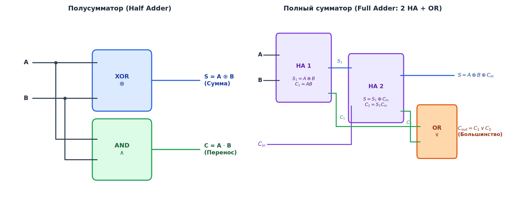
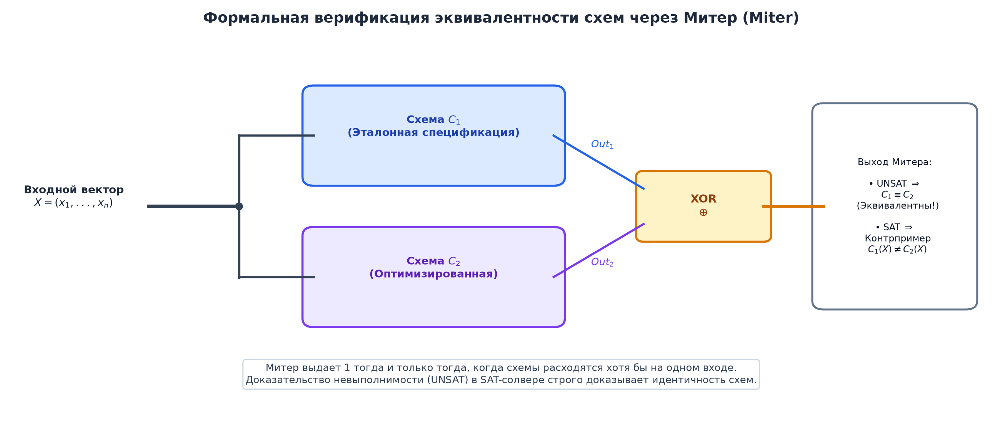

# 📝 Лекция 14: Логические схемы, функциональные элементы, сумматоры, схемная сложность и верификация

> **Дата:** `2026-09-12` (14-я неделя)  
> **Предмет:** Дискретная математика (1 семестр, 2026/27 уч. год)  
> **Преподаватель (лектор):** Константин Чухарев ([@Lipen](https://github.com/Lipen), Университет ИТМО)  
> **Модуль 4:** Булева алгебра, схемы и теория кодирования  
> **Материалы курса:** [github.com/Lipen/discrete-math-course](https://github.com/Lipen/discrete-math-course) • Главы книги: `m11`, `m14` • Слайды: `s1-lec14-circuits.pdf`

---

## 🧭 Навигация по лекции
1. [Введение: Физическая логика цифровых устройств](#1-введение-физическая-логика-цифровых-устройств)
2. [Логические схемы как ориентированные графы](#2-логические-схемы-как-ориентированные-графы)
3. [Метрики схемной сложности: Размер и глубина](#3-метрики-схемной-сложности-размер-и-глубина)
4. [Арифметика процессора: Полусумматор и полный сумматор](#4-арифметика-процессора-полусумматор-и-полный-сумматор)
5. [Каскады сумматоров: Ripple-Carry vs Carry-Lookahead](#5-каскады-сумматоров-ripple-carry-vs-carry-lookahead)
6. [Код Грея: Построение, свойства и преобразования](#6-код-грея-построение-свойства-и-преобразования)
7. [Формальная верификация схем: Конструкция Митера](#7-формальная-верификация-схем-конструкция-митера)
8. [Современные SAT-решатели (CDCL) в аппаратной верификации](#8-современные-sat-решатели-cdcl-в-аппаратной-верификации)
9. [Теорема Кука—Левина: Практика против худшего случая](#9-теорема-кука-левина-практика-против-худшего-случая)
10. [Вопросы для самопроверки](#10-вопросы-для-самопроверки)

---

## 1. Введение: Физическая логика цифровых устройств

Каждая математическая формула булевой алгебры находит свое материальное воплощение в кремниевом кристалле процессора. Элементарными исполнителями булевых операций выступают **логические вентили** (_logic gates_):

| Вентиль | Обозначение | Функция | Инженерный смысл |
| :--- | :---: | :---: | :--- |
| **NOT** | $\bar{x}$ | Инверсия | Меняет уровень напряжения на противоположный |
| **AND** | $x \wedge y$ | Конъюнкция | Высокий уровень только при всех активных входах |
| **OR** | $x \vee y$ | Дизъюнкция | Высокий уровень при наличии хотя бы одной единицы |
| **XOR** | $x \oplus y$ | Сложение по модулю 2 | Высокий уровень при различии сигналов |
| **NAND** | $\overline{x \wedge y}$ | Штрих Шеффера | Универсальный вентиль (функционально полный базис) |
| **NOR** | $\overline{x \vee y}$ | Стрелка Пирса | Универсальный вентиль (функционально полный базис) |

Благодаря универсальности базиса Шеффера ($\text{NAND}$), вся цифровая электроника (включая многомиллиардные процессоры архитектуры x86/ARM) может быть собрана исключительно из транзисторных вентилей одного-единственного типа.

---

## 2. Логические схемы как ориентированные графы

> [!definition] Определение: Комбинационная логическая схема
> **Комбинационной логической схемой** называется ориентированный ациклический граф (DAG) $C = (V, E)$, в котором:
> 1. Истоки (вершины с нулевой полустепенью захода) соответствуют **входным переменным** $x_1, \dots, x_n$ или константам $0, 1$.
> 2. Внутренние вершины помечены **логическими вентилями** (элементарными булевыми операциями из выбранного базиса).
> 3. Стоки (вершины с нулевой полустепенью исхода) соответствуют **выходам схемы** $y_1, \dots, y_m$.

Ацикличность гарантирует отсутствие зацикливаний и триггерных эффектов: схема является **комбинационной**, то есть ее выход однозначно определяется текущим вектором входных сигналов без эффекта памяти.

---

## 3. Метрики схемной сложности: Размер и глубина

При проектировании интегральных схем (VLSI) ключевую роль играют две фундаментальные метрики:

> [!definition] Определение: Размер и глубина схемы
> 1. **Размер схемы** $\text{Size}(C)$ — общее число логических вентилей (вершин графа). Метрика определяет площадь кристалла кремния, стоимость производства и энергопотребление.
> 2. **Глубина схемы** $\text{Depth}(C)$ — длина самого длинного пути (критического пути) от входных вершин к выходным стокам. Метрика определяет физическую задержку распространения сигнала и жестко ограничивает максимальную тактовую частоту процессора.

### Инженерный компромисс (Size-Depth Tradeoff)
Сигналы в параллельных ветвях графа вычисляются одновременно. Схему с малой глубиной можно построить за счет размножения вентилей и параллельных каскадов (большой размер), в то время как минимальная по числу вентилей схема может обладать длинным критическим путем (большая задержка).

---

## 4. Арифметика процессора: Полусумматор и полный сумматор

Вся цифровая арифметика процессоров — от сложения и вычитания до умножения и деления с плавающей точкой — собирается из элементарных схем сложения битов.

### Полусумматор (Half Adder)
Полусумматор выполняет сложение двух однобитных чисел $A$ и $B$ без учета входящего переноса:
- Бит суммы: $S = A \oplus B$.
- Бит исходящего переноса: $C = A \wedge B$.
Размер схемы: 2 вентиля ($\text{XOR}$ и $\text{AND}$), глубина: 1 такт вентиля.

### Полный сумматор (Full Adder)
Полный сумматор складывает три бита: два информационных разряда $A, B$ и входящий бит переноса из младшего разряда $C_{\text{in}}$:
- **Бит суммы:** $S = A \oplus B \oplus C_{\text{in}}$.
- **Бит исходящего переноса:** 
  $$C_{\text{out}} = (A \wedge B) \vee (C_{\text{in}} \wedge (A \oplus B)) = \text{Maj}(A, B, C_{\text{in}}).$$

> [!important] Важное свойство переноса
> Исходящий перенос полного сумматора $C_{\text{out}}$ равен $1$ тогда и только тогда, когда хотя бы два из трех входных битов равны единице. Таким образом, перенос в сумматоре — это в точности **мажоритарная функция (функция большинства)** $\text{Maj}(A, B, C_{\text{in}})$.

Полный сумматор строится из двух полусумматоров (HA1 и HA2) и одного вентиля $\text{OR}$ для объединения переносов.

---

## 5. Каскады сумматоров: Ripple-Carry vs Carry-Lookahead

### Сумматор с последовательным переносом (Ripple-Carry Adder)
Для сложения двух $n$-битных чисел соединяются $n$ полных сумматоров: исходящий перенос $i$-го сумматора подается на вход $C_{\text{in}}$ для $(i+1)$-го сумматора.
- **Сложность:**
  - Размер: $\text{Size}(n) = O(n)$ (ровно $n$ полных сумматоров).
  - Глубина: $\text{Depth}(n) = O(n)$ (в худшем случае перенос $111\dots1 + 000\dots1$ должен пробежать последовательно через все $n$ каскадов).
При $n = 64$ задержка в 64 каскада делает ripple-carry сумматор неприменимым в быстродействующих ALU современных CPU.

### Сумматор с опережающим переносом (Carry-Lookahead Adder — CLA)
Идея метода заключается в предварительном анализе разрядов без ожидания пробега переноса:
- Бит **генерации** переноса: $G_i = A_i \wedge B_i$ (разряд сам безусловно рождает перенос).
- Бит **распространения** переноса: $P_i = A_i \oplus B_i$ (разряд передает входящий перенос дальше).
Тогда переносы выражаются через многовходовые конъюнкции:
$$C_1 = G_0 \vee (P_0 \wedge C_0),$$
$$C_2 = G_1 \vee (P_1 \wedge G_0) \vee (P_1 \wedge P_0 \wedge C_0),$$
$$C_3 = G_2 \vee (P_2 \wedge G_1) \vee (P_2 \wedge P_1 \wedge G_0) \vee (P_2 \wedge P_1 \wedge P_0 \wedge C_0).$$
Используя древовидную параллельную схему (дерево Брента—Кунга или Когги—Стоуна), глубина сумматора снижается до:
$$\text{Depth}_{\text{CLA}} = O(\log n),$$
ценой увеличения размера до $O(n \log n)$.

---

## 6. Код Грея: Построение, свойства и преобразования

> [!definition] Определение: Код Грея
> **Кодом Грея** (_Gray code_) порядка $n$ называется упорядоченная последовательность всех $2^n$ двоичных векторов длины $n$, в которой любые два соседних вектора (а также последний и первый) различаются ровно в **одном** битовом разряде.

### Назначение и физический смысл
В стандартной двоичной системе переход от числа $3$ (`011`) к числу $4$ (`100`) требует одновременного переключения трех бит. Из-за микроскопических физических различий во времени срабатывания транзисторов сигналы переключаются не строго синхронно. В результате на долю наносекунды возникают ложные промежуточные значения (`010`, `111` и др.) — так называемые **гонки сигналов (glitches)**. 

В коде Грея переключается ровно один бит, что исключает сбои в оптических и магнитных датчиках угла поворота (энкодерах валов станков и роботов), а также обеспечивает корректность соседства в картах Карно.

### Рекурсивное построение (Зеркальный код Грея)
$$G_1 = [0, 1],$$
$$G_{n+1} = [0 \cdot G_n, \; 1 \cdot G_n^R],$$
где $G_n^R$ — последовательность $G_n$, записанная в обратном порядке.
- $G_1$: `0`, `1`
- $G_2$: `00`, `01`, `11`, `10`
- $G_3$: `000`, `001`, `011`, `010`, `110`, `111`, `101`, `100`

### Формулы аппаратного преобразования
Преобразование между обычным двоичным числом $b$ и кодом Грея $g$ выполняется параллельной схемой из вентилей $\text{XOR}$:
- **Из двоичного в код Грея:**
  $$g_i = b_i \oplus b_{i+1}, \quad g_{n-1} = b_{n-1}.$$
- **Из кода Грея в двоичный (накопительный XOR):**
  $$b_i = g_i \oplus b_{i+1} = \bigoplus_{j=i}^{n-1} g_j.$$

---

## 7. Формальная верификация схем: Конструкция Митера

В микроэлектронике критически важна задача **эквивалентности схем**: после применения оптимизаций синтезатором (уменьшение вентилей, перетрассировка) необходимо доказать, что оптимизированная схема $C_2$ функционально абсолютно тождественна эталонной схеме $C_1$.

Полный перебор всех $2^n$ входных комбинаций невозможен уже при $n \ge 64$. Задача решается сведением к проблеме выполнимости булевых формул (SAT).

> [!definition] Определение: Митер (Miter)
> **Митером** двух логических схем $C_1$ и $C_2$ с одинаковым набором входов называется схема, у которой:
> 1. Входы $C_1$ и $C_2$ объединены попарно.
> 2. Соответствующие выходы $C_1$ и $C_2$ подаются на двухвходовые вентили $\text{XOR}$.
> 3. Выходы всех вентилей $\text{XOR}$ подаются на общий логический элемент $\text{OR}$.

> [!theorem] Теорема эквивалентности схем через SAT
> Схемы $C_1$ и $C_2$ логически эквивалентны на всех возможных входных наборах тогда и только тогда, когда булева формула митера **невыполнима (UNSAT)**:
> $$C_1 \equiv C_2 \iff \text{SAT}(\text{CNF}(\text{Miter})) = \text{UNSAT}.$$

Если SAT-решатель возвращает:
- **UNSAT:** Математически строго доказано отсутствие ошибок во всем пространстве $2^n$ входов.
- **SAT:** Решатель мгновенно предъявляет конкретный набор входных бит $X$, на котором $C_1(X) \neq C_2(X)$ — готовый контрпример для отладки инженером.

---

## 8. Современные SAT-решатели (CDCL) в аппаратной верификации

Перевод схемы в КНФ осуществляется за линейное время с помощью **преобразования Цейтина**: для выхода каждого вентиля заводится промежуточная булева переменная и записываются дизъюнкты, кодирующие его таблицу истинности.

Индустриальные алгоритмы **CDCL** (_Conflict-Driven Clause Learning_) решают полученные КНФ с миллионами переменных благодаря трем ключевым компонентам:
1. **Unit Propagation (Распространение единичных дизъюнктов):** Если в дизъюнкте все литералы, кроме одного, стали ложными, оставшийся литерал вынужденно становится истинным без ветвления поиска.
2. **Обучение на конфликтах (Clause Learning):** При возникновении логического противоречия строится граф импликаций. Методом резолюции вычисляется **выученный дизъюнкт** (_learned clause_), отсекающий не просто одну ветвь дерева, а колоссальное экспоненциальное подпространство бесперспективных вариантов.
3. **Нехронологический возврат (Backjumping):** Решатель откатывается сразу на несколько уровней дерева решений назад, к непосредственной причине конфликта.
4. **Сертификаты невыполнимости (Proof Logging):** Результат UNSAT сопровождается трассой резолюционных шагов (формат DRAT/DRUP), которая за секунды механически проверяется независимым валидатором, исключая ошибки самого решателя.

---

## 9. Теорема Кука—Левина: Практика против худшего случая

> [!theorem] Теорема Кука—Левина (1971)
> Задача выполнимости булевых формул (SAT) является **NP-полной**. Любая задача из класса NP полиномиально сводится к SAT.

Теорема утверждает, что в худшем случае для SAT не существует полиномиального алгоритма (если $P \neq NP$). 

Однако NP-полнота — это свойство патологических худших случаев. Формулы, возникающие при проектировании реальных процессоров и верификации алгоритмов, обладают глубокой внутренней скрытой структурой. Алгоритм CDCL эффективно выявляет эту структуру, позволяя верифицировать микропроцессоры с сотнями миллионов транзисторов за минуты.

---

## 10. Вопросы для самопроверки

1. **Схемная сложность:**
   Постройте схему вычисления четности $n$ входных бит: $P(x_1, \dots, x_n) = x_1 \oplus x_2 \oplus \dots \oplus x_n$.
   - Каковы минимальный размер и минимальная глубина схемы на двухвходовых вентилях $\text{XOR}$?
   - *Ответ:* Размер равен $n - 1$ вентилей. Минимальная глубина достигается на сбалансированном бинарном дереве и равна $\lceil \log_2 n \rceil$.
2. **Формула полного сумматора:**
   Докажите алгебраически, что выражение для бита переноса $C_{\text{out}} = (A \wedge B) \vee (C_{\text{in}} \wedge (A \oplus B))$ эквивалентно функции большинства $\text{Maj}(A, B, C_{\text{in}})$.
3. **Код Грея:**
   Переведите двоичное число `10110` в код Грея и восстановите его обратно с помощью накопительного XOR.
   - *Прямое:* $g_4 = 1$, $g_3 = 1 \oplus 0 = 1$, $g_2 = 0 \oplus 1 = 1$, $g_1 = 1 \oplus 1 = 0$, $g_0 = 1 \oplus 0 = 1$. Итог: `11101`.
   - *Обратное:* $b_4 = 1$, $b_3 = 1 \oplus 1 = 0$, $b_2 = 0 \oplus 1 = 1$, $b_1 = 1 \oplus 0 = 1$, $b_0 = 1 \oplus 1 = 0$. Итог: `10110`.
4. **Конструкция митера:**
   Пусть схема $C_1$ реализует $x \vee y$, а схема $C_2$ реализует $x \oplus y$. Какой вердикт выдаст SAT-решатель для митера этих схем и какой контрпример он вернет?
   - *Ответ:* Вердикт SAT. Контрпример: $x = 1, y = 1$, на котором $C_1 = 1$, а $C_2 = 0$.
