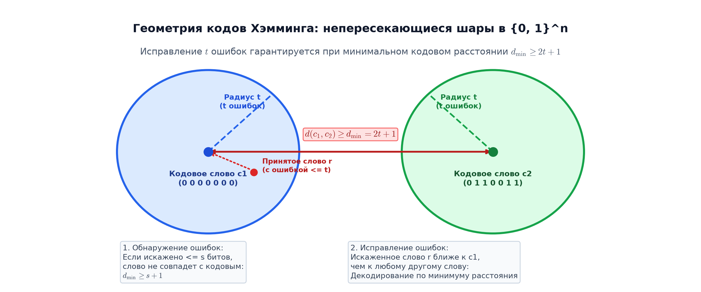

# 📝 Лекция 15: Теория кодирования, расстояние Хэмминга, код Хэмминга и линейные коды

> **Дата:** `2026-09-12` (15-я неделя)  
> **Предмет:** Дискретная математика (1 семестр, 2026/27 уч. год)  
> **Преподаватель (лектор):** Константин Чухарев ([@Lipen](https://github.com/Lipen), Университет ИТМО)  
> **Модуль 4:** Булева алгебра, схемы и теория кодирования  
> **Материалы курса:** [github.com/Lipen/discrete-math-course](https://github.com/Lipen/discrete-math-course) • Главы книги: `m13` • Слайды: `s1-lec15-codes.pdf`

---

## 🧭 Навигация по лекции
1. [Введение: Проблема передачи информации по зашумленным каналам](#1-введение-проблема-передачи-информации-по-зашумленным-каналам)
2. [Простейшие схемы: Бит четности и код-повторение](#2-простейшие-схемы-бит-четности-и-код-повторение)
3. [Метрика Хэмминга: Геометрия дискретного пространства](#3-метрика-хэмминга-геометрия-дискретного-пространства)
4. [Кодовое расстояние и корректирующая способность](#4-кодовое-расстояние-и-корректирующая-способность)
5. [Код Хэмминга $(7, 4)$: Конструкция и контрольные группы](#5-код-хэмминга-конструкция-и-контрольные-группы)
6. [Синдромное декодирование и локализация ошибок](#6-синдромное-декодирование-и-локализация-ошибок)
7. [Расширенный код $(8, 4, 4)$ и память SECDED](#7-расширенный-код-и-память-secded)
8. [Линейные коды над $\mathbb{F}_2$: Матричный формализм](#8-линейные-коды-над-матричный-формализм)
9. [Вопросы для самопроверки](#9-вопросы-для-самопроверки)

---

## 1. Введение: Проблема передачи информации по зашумленным каналам

Любая физическая среда передачи или долговременного хранения данных подвержена случайным помехам:
- Электромагнитные наводки и тепловой шум в кабелях Ethernet и оптоволокне.
- Альфа-частицы и космические лучи, инвертирующие биты в полупроводниковых ячейках памяти DRAM.
- Микроцарапины и деградация магнитных слоев жестких дисков (HDD) и флэш-памяти (SSD).

Даже процесс сохранения файла на диск представляет собой передачу данных по каналу связи — «из настоящего в будущее».

> **Две стороны обработки информации:**
> 1. **Сжатие данных (Compression):** устранение естественной избыточности для минимизации занимаемого объема.
> 2. **Помехоустойчивое кодирование (Error-Correction):** внесение строго контролируемой математической избыточности для гарантированного обнаружения и исправления ошибок.

Плата за надежность — снижение **скорости кода** $R = k / n$, где $k$ — число полезных бит данных, а $n$ — общая длина кодового слова ($n - k$ бит расходуется на защиту).

---

## 2. Простейшие схемы: Бит четности и код-повторение

### 1. Бит четности (Parity Bit)
К блоку из $k$ бит данных дописывается один контрольный бит, равный их сумме по модулю 2:
$$p = d_1 \oplus d_2 \oplus \dots \oplus d_k.$$
- Если в канале инвертируется ровно один бит, общая сумма бит станет нечетной — ошибка **обнаружена**.
- **Недостаток:** Код не позволяет определить позицию искаженного бита и не способен исправить ни одной ошибки. Если произойдут две ошибки, четность сойдется, и сбой останется незамеченным.

### 2. Код с тройным повторением (Repetition Code)
Каждый бит $b \in \{0, 1\}$ передается трижды: $0 \mapsto 000$, $1 \mapsto 111$.
- При получении слова решение принимается большинством голосов (мажоритарное декодирование): $001 \mapsto 0$.
- **Недостаток:** Одиночная ошибка исправляется, но скорость кода катастрофически мала: $R = 1/3 \approx 0.33$. Две трети пропускной способности канала сжигаются на дублирование.

---

## 3. Метрика Хэмминга: Геометрия дискретного пространства

В 1950 году Ричард Хэмминг сформулировал строгую геометрическую теорию помехоустойчивости, определив расстояние на множестве двоичных векторов $\{0, 1\}^n$.

> [!definition] Определение: Расстояние Хэмминга
> **Расстоянием Хэмминга** $d(x, y)$ между двумя двоичными векторами $x, y \in \{0, 1\}^n$ называется количество позиций, в которых координаты векторов различаются:
> $$d(x, y) = |\{i \in \{1, \dots, n\} \mid x_i \neq y_i\}|.$$

### Свойства метрики Хэмминга
Расстояние Хэмминга удовлетворяет всем трем аксиомам метрического пространства:
1. **Неотрицательность и невырожденность:** $d(x, y) \ge 0$, причем $d(x, y) = 0 \iff x = y$.
2. **Симметрия:** $d(x, y) = d(y, x)$.
3. **Неравенство треугольника:** 
   $$d(x, z) \le d(x, y) + d(y, z).$$

> [!definition] Определение: Вес Хэмминга
> **Весом Хэмминга** $\text{wt}(x)$ вектора $x$ называется число его ненулевых (единичных) координат:
> $$\text{wt}(x) = |\{i \mid x_i = 1\}|.$$

Связь расстояния и веса выражается через операцию побитового $\text{XOR}$:
$$d(x, y) = \text{wt}(x \oplus y).$$

---

## 4. Кодовое расстояние и корректирующая способность

> [!definition] Определение: Кодовое расстояние
> **Минимальным кодовым расстоянием** $d$ блокового кода $C \subseteq \{0, 1\}^n$ называется минимальное расстояние Хэмминга между любой парой различных кодовых слов:
> $$d = \min_{\substack{x, y \in C \\ x \neq y}} d(x, y).$$

Код с параметрами $(n, M, d)$ содержит $M$ кодовых слов длины $n$ с минимальным расстоянием $d$. Если кодовые слова порождены $k$ битами данных, то $M = 2^k$, а параметры записываются как $(n, k, d)$.

### Фундаментальная теорема о корректирующей способности

> [!theorem] Теорема (Корректирующая способность кода)
> 1. Код $C$ обнаруживает любые конфигурации до $s$ ошибок включительно тогда и только тогда, когда:
>    $$d \ge s + 1.$$
> 2. Код $C$ исправляет любые конфигурации до $t$ ошибок включительно тогда и только тогда, когда:
>    $$d \ge 2t + 1 \iff t = \left\lfloor \frac{d - 1}{2} \right\rfloor.$$

> [!proof] Доказательство
> 1. Если передано кодовое слово $x$, а в канале возникло $e \le s$ ошибок, принятый вектор $r$ отстоит от $x$ на расстояние $d(x, r) = e \le s < d$. Поскольку минимальное расстояние между любыми кодовыми словами не меньше $d$, вектор $r$ гарантированно не может совпасть ни с каким другим разрешенным кодовым словом $y \in C \setminus \{x\}$. Сбой обнаружен.
> 2. Рассмотрим замкнутые шары Хэмминга радиуса $t$ с центрами в кодовых словах:
>    $$B_t(x) = \{z \in \{0, 1\}^n \mid d(x, z) \le t\}.$$
>    Покажем, что при $d \ge 2t + 1$ любые два шара $B_t(x)$ и $B_t(y)$ для $x \neq y$ **не пересекаются**. Предположим противное: существует вектор $z \in B_t(x) \cap B_t(y)$. Тогда по неравенству треугольника:
>    $$d(x, y) \le d(x, z) + d(z, y) \le t + t = 2t.$$
>    Получили противоречие с условием $d(x, y) \ge d \ge 2t + 1$. Следовательно, шары не пересекаются. Любое искажение не более чем $t$ бит оставляет принятый вектор внутри шара вокруг истинного кодового слова, что позволяет алгоритму декодирования однозначно восстановить исходное сообщение. $\blacksquare$

---

## 5. Код Хэмминга $(7, 4)$: Конструкция и контрольные группы

Классический код Хэмминга $(7, 4, 3)$ передает $k = 4$ бита информации, добавляя $r = 3$ проверочных бита, формируя кодовые блоки длины $n = 7$. Минимальное расстояние $d = 3$ гарантирует исправление любой одиночной ошибки ($t = \lfloor (3 - 1) / 2 \rfloor = 1$).

### Размещение бит в кодовом слове
Позиции нумеруются от $1$ до $7$. Хэмминг предложил элегантное размещение:
- Позиции, являющиеся **степенями двойки** ($1, 2, 4$), отводятся под **проверочные биты** $p_1, p_2, p_4$.
- Оставшиеся позиции ($3, 5, 6, 7$) заполняются **информационными битами** $d_1, d_2, d_3, d_4$.

$$\begin{array}{|c|c|c|c|c|c|c|}
\hline
\mathbf{1} & \mathbf{2} & \mathbf{3} & \mathbf{4} & \mathbf{5} & \mathbf{6} & \mathbf{7} \\
\hline
p_1 & p_2 & d_1 & p_4 & d_2 & d_3 & d_4 \\
\hline
\end{array}$$

### Формирование проверочных групп
Каждый проверочный бит $p_i$ контролирует те позиции слова, в двоичной записи которых на $i$-м месте стоит единица:
- $p_1$ (позиция $1 = 001_2$) контролирует позиции с младшей единицей: $1, 3, 5, 7 \implies p_1 \oplus d_1 \oplus d_2 \oplus d_4 = 0$.
- $p_2$ (позиция $2 = 010_2$) контролирует позиции со второй единицей: $2, 3, 6, 7 \implies p_2 \oplus d_1 \oplus d_3 \oplus d_4 = 0$.
- $p_4$ (позиция $4 = 100_2$) контролирует позиции со старшей единицей: $4, 5, 6, 7 \implies p_4 \oplus d_2 \oplus d_3 \oplus d_4 = 0$.

Отсюда формулы кодирования:
$$p_1 = d_1 \oplus d_2 \oplus d_4,$$
$$p_2 = d_1 \oplus d_3 \oplus d_4,$$
$$p_4 = d_2 \oplus d_3 \oplus d_4.$$

---

## 6. Синдромное декодирование и локализация ошибок

При приеме вектора $r = (r_1, r_2, \dots, r_7)$ вычисляется трехбитный вектор **синдрома** $S = (s_4, s_2, s_1)$:
$$s_1 = r_1 \oplus r_3 \oplus r_5 \oplus r_7,$$
$$s_2 = r_2 \oplus r_3 \oplus r_6 \oplus r_7,$$
$$s_4 = r_4 \oplus r_5 \oplus r_6 \oplus r_7.$$

> [!important] Магическое свойство кода Хэмминга
> Если в канале произошла одиночная ошибка в позиции $j$, то синдром в двоичной записи в точности равен номеру этой позиции:
> $$(s_4 s_2 s_1)_2 = j.$$
> - Если $(s_4 s_2 s_1)_2 = 000$ — ошибок нет.
> - Если $(s_4 s_2 s_1)_2 = j \neq 0$ — для исправления достаточно инвертировать бит $r_j$.

### Пример исправления
Пусть передавалось кодовое слово $(0, 1, 1, 0, 0, 1, 1)$, соответствующее данным $(1, 0, 1, 1)$.  
Из-за помехи в 5-й позиции принято слово $r = (0, 1, 1, 0, \mathbf{1}, 1, 1)$.
- $s_1 = 0 \oplus 1 \oplus 1 \oplus 1 = 1$
- $s_2 = 1 \oplus 1 \oplus 1 \oplus 1 = 0$
- $s_4 = 0 \oplus 1 \oplus 1 \oplus 1 = 1$
Синдром: $(s_4, s_2, s_1) = (1, 0, 1)_2 = 5$.  
Декодер инвертирует пятый бит: $r_5 = 1 \oplus 1 = 0$. Исходное слово полностью восстановлено!

---

## 7. Расширенный код $(8, 4, 4)$ и память SECDED

Если в канале возникают две ошибки, стандартный код $(7, 4)$ ошибочно примет их за одну ошибку в третьей позиции и инвертирует здоровый бит, породив третью ошибку.

Для решения этой проблемы к кодовому слову добавляется **8-й бит общей четности** всего блока:
$$p_8 = \bigoplus_{i=1}^7 c_i.$$
Получается расширенный код с параметрами $(8, 4, 4)$. Минимальное расстояние $d = 4$ обеспечивает режим **SECDED** (_Single Error Correction, Double Error Detection_):

| Синдром $S$ | Общая четность $P$ | Интерпретация декодером | Действие |
| :---: | :---: | :--- | :--- |
| $= 0$ | Четно | Ошибок нет | Данные верны |
| $\neq 0$ | Нечетно | Одиночная ошибка в позиции $S$ | **Исправить** бит $r_S$ |
| $= 0$ | Нечетно | Искажен сам 8-й бит четности | **Исправить** бит $p_8$ |
| $\neq 0$ | Четно | **Двойная ошибка** | **Генерировать прерывание (ECC Kernel Panic)** |

Архитектура SECDED является обязательным стандартом во всей серверной оперативной памяти (ECC RAM) и процессорных кэшах L1/L2/L3.

---

## 8. Линейные коды над $\mathbb{F}_2$: Матричный формализм

> [!definition] Определение: Линейный код
> Код $C \subseteq \mathbb{F}_2^n$ называется **линейным блоковым кодом**, если он является векторным подпространством векторного пространства $\mathbb{F}_2^n$.
> Иными словами:
> 1. Нулевой вектор $\mathbf{0} \in C$.
> 2. Для любых двух кодовых слов $c_1, c_2 \in C$ их побитовая сумма $c_1 \oplus c_2 \in C$.

> [!theorem] Теорема о расстоянии линейного кода
> Минимальное кодовое расстояние любого линейного кода равно минимальному весу его ненулевых кодовых слов:
> $$d = \min_{\substack{c \in C \\ c \neq \mathbf{0}}} \text{wt}(c).$$

> [!proof] Доказательство
> Для любых $x, y \in C$ вектор $c = x \oplus y$ принадлежит коду $C$ в силу линейности, причем при $x \neq y$ имеем $c \neq \mathbf{0}$. Так как $d(x, y) = \text{wt}(x \oplus y) = \text{wt}(c)$, поиск минимума по всем парам эквивалентен поиску минимального веса среди ненулевых векторов подпространства. $\blacksquare$

### Порождающая матрица $G$
Линейный код размерности $k$ в пространстве размерности $n$ задается базисом из $k$ векторов-строк, образующих **порождающую матрицу** $G$ размера $k \times n$.
Операция кодирования сообщения $m \in \mathbb{F}_2^k$ представляет собой умножение вектора на матрицу в поле $\mathbb{F}_2$:
$$c = m \cdot G.$$

### Проверочная матрица $H$
Подпространство $C$ можно задать как ядро линейного оператора с помощью **проверочной матрицы** $H$ размера $(n - k) \times n$:
$$c \in C \iff H \cdot c^T = \mathbf{0}.$$

Для систематического кода, где $G = [I_k \mid P]$, проверочная матрица имеет вид:
$$H = [P^T \mid I_{n - k}].$$
Синдром принятого вектора $r$ вычисляется как:
$$s^T = H \cdot r^T.$$

---

## 9. Вопросы для самопроверки

1. **Метрика Хэмминга:**
   Вычислите расстояние Хэмминга между векторами $u = (1, 1, 0, 0, 1, 0)$ и $v = (0, 1, 0, 1, 0, 1)$. Чему равен вес их суммы?
   - *Ответ:* Различия в позициях 1, 4, 5, 6 $\implies d(u, v) = 4$. $\text{wt}(u \oplus v) = 4$.
2. **Корректирующая способность:**
   Код имеет минимальное расстояние $d = 6$. Сколько ошибок он гарантированно обнаруживает и сколько исправляет?
   - *Ответ:* Обнаруживает $s = d - 1 = 5$ ошибок. Исправляет $t = \lfloor (6 - 1) / 2 \rfloor = 2$ ошибки.
3. **Синдромное декодирование:**
   При приеме кода Хэмминга $(7, 4)$ получен вектор $r = (1, 1, 0, 0, 0, 1, 1)$. Вычислите синдром $(s_4, s_2, s_1)$ и назовите номер ошибочного бита.
   - *Вычисление:*
     - $s_1 = r_1 \oplus r_3 \oplus r_5 \oplus r_7 = 1 \oplus 0 \oplus 0 \oplus 1 = 0$.
     - $s_2 = r_2 \oplus r_3 \oplus r_6 \oplus r_7 = 1 \oplus 0 \oplus 1 \oplus 1 = 1$.
     - $s_4 = r_4 \oplus r_5 \oplus r_6 \oplus r_7 = 0 \oplus 0 \oplus 1 \oplus 1 = 0$.
     - Синдром: $(0, 1, 0)_2 = 2$. Ошибка во втором бите (проверочном бите $p_2$).
4. **Преимущество линейных кодов:**
   Почему свойство $d = \min_{c \neq \mathbf{0}} \text{wt}(c)$ существенно упрощает поиск параметров кода?
   - *Ответ:* Для кода с $2^{32}$ кодовыми словами полный перебор пар требует $\binom{2^{32}}{2} \approx 10^{19}$ операций, тогда как проверка веса требует перебора лишь $2^{32} \approx 4 \cdot 10^9$ слов (или рангового анализа матрицы проверок).
