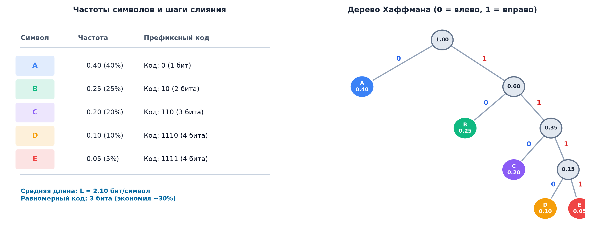

# 📝 Лекция 16: Сжатие данных, код Хаффмана, граница Шеннона, циклические коды и коды Рида-Соломона

> **Дата:** `2026-09-12` (16-я неделя)  
> **Предмет:** Дискретная математика (1 семестр, 2026/27 уч. год)  
> **Преподаватель (лектор):** Константин Чухарев ([@Lipen](https://github.com/Lipen), Университет ИТМО)  
> **Модуль 4:** Булева алгебра, схемы и теория кодирования  
> **Материалы курса:** [github.com/Lipen/discrete-math-course](https://github.com/Lipen/discrete-math-course) • Главы книги: `m13` • Слайды: `s1-lec16-compression.pdf`

---

## 🧭 Навигация по лекции
1. [Введение: Две стороны теории информации](#1-введение-две-стороны-теории-информации)
2. [Префиксные коды и условие однозначной декодируемости](#2-префиксные-коды-и-условие-однозначной-декодируемости)
3. [Алгоритм и дерево Хаффмана](#3-алгоритм-и-дерево-хаффмана)
4. [Энтропия Шеннона и фундаментальные границы сжатия](#4-энтропия-шеннона-и-фундаментальные-границы-сжатия)
5. [Граница Хэмминга и совершенные коды](#5-граница-хэмминга-и-совершенные-коды)
6. [Циклические коды и алгоритм CRC](#6-циклические-коды-и-алгоритм-crc)
7. [Коды Рида — Соломона: Алгебра над полями Галуа](#7-коды-рида-соломона-алгебра-над-полями-галуа)
8. [Итоги 1 семестра: Карта пройденных понятий](#8-итоги-1-семестра-карта-пройденных-понятий)
9. [Вопросы для самопроверки](#9-вопросы-для-самопроверки)

---

## 1. Введение: Две стороны теории информации

В [[15. Лекция - Теория кодирования, расстояние Хэмминга, код Хэмминга и линейные коды (2026-12-16)|Лекции 15]] мы изучили помехоустойчивое кодирование, которое защищает сигнал, целенаправленно добавляя избыточность. Сжатие данных решает противоположную инженерную задачу: **устранить избыточность** сырого сообщения для минимизации занимаемой памяти и времени передачи.

> **Стандартный конвейер цифровых коммуникаций:**
> $$\text{Сырые данные} \xrightarrow[\text{Хаффман / Deflate}]{\text{Сжатие (убрать избыточность)}} \text{Компактный поток} \xrightarrow[\text{Хэмминг / RS / LDPC}]{\text{Защита (добавить структуру)}} \text{Канал с шумом}$$

Сжатие убирает статистическую избыточность источника, а канальный код возвращает ее строго контролируемым и математически выверенным образом туда, где ее ожидает декодер.

---

## 2. Префиксные коды и условие однозначной декодируемости

При кодировании символов словами переменной длины ключевым требованием является возможность однозначно и без задержки восстановить исходный текст из непрерывного битового потока.

> [!definition] Определение: Префиксный код
> Код называется **префиксным** (или свободным от префиксов), если ни одно кодовое слово не является префиксом (началом) никакого другого кодового слова.

### Сравнение кодов:
- **Префиксный код:** $A = 0, B = 10, C = 110, D = 111$.  
  Поток `110010111` однозначно разбивается слева направо в момент прочтения последнего бита слова: `110` ($C$), затем `0` ($A$), затем `10` ($B$), затем `111` ($D$). Декодирование происходит **мгновенно** без заглядывания вперед.
- **Непрефиксный код:** $A = 0, B = 01, C = 011$.  
  Получив бит `0`, декодер не знает, завершился ли символ $A$ или передается начало символов $B$ или $C$.

> [!theorem] Неравенство Крафта — Макмиллана
> Для существования однозначно декодируемого (и префиксного) кода с длинами кодовых слов $l_1, l_2, \dots, l_m$ над $D$-ичным алфавитом необходимо и достаточно, чтобы выполнялось неравенство:
> $$\sum_{i=1}^m D^{-l_i} \le 1.$$

---

## 3. Алгоритм и дерево Хаффмана

В 1952 году Дэвид Хаффман предложил жадный алгоритм построения оптимального префиксного кода, использующий принцип: **частым символам — короткие коды, редким — длинные**.

### Пошаговый алгоритм Хаффмана:
1. Создать лес из листьев, каждый из которых представляет символ алфавита со своей частотой (вероятностью) $p_i$.
2. Найти два дерева с наименьшими суммарными весами $p_a$ и $p_b$.
3. Объединить их в новый родительский узел с весом $p_a + p_b$. Ребру к левому потомку присвоить бит $0$, к правому — $1$.
4. Повторять шаги 2–3, пока все узлы не объединятся в единое корневое дерево с весом $1.0$.
5. Кодовое слово каждого символа — это путь от корня к соответствующему листу.

### Расчет средней длины кода
Для алфавита с вероятностями $A: 0.40, B: 0.25, C: 0.20, D: 0.10, E: 0.05$:
- Кодовые слова: $A = 0$ (1 бит), $B = 10$ (2 бита), $C = 110$ (3 бита), $D = 1110$ (4 бита), $E = 1111$ (4 бита).
- **Средняя длина кода:**
  $$L = \sum_{i=1}^m p_i l_i = 0.40 \cdot 1 + 0.25 \cdot 2 + 0.20 \cdot 3 + 0.10 \cdot 4 + 0.05 \cdot 4 = 2.10 \text{ бит/символ}.$$
Для равномерного кода потребовалось бы $\lceil \log_2 5 \rceil = 3$ бита на символ. Код Хаффмана сжал данные на $30\%$.

> [!theorem] Оптимальность кода Хаффмана
> Для любого фиксированного распределения вероятностей символов код Хаффмана обладает **минимальной средней длиной** среди всех возможных префиксных кодов.

---

## 4. Энтропия Шеннона и фундаментальные границы сжатия

> [!definition] Определение: Информационная энтропия Шеннона
> **Энтропией** дискретного источника информации с вероятностями символов $p_1, \dots, p_m$ называется величина:
> $$H(X) = - \sum_{i=1}^m p_i \log_2 p_i.$$

Энтропия измеряет среднее количество неопределенности (информации), приходящееся на один символ источника.

> [!theorem] Первая теорема Шеннона (о кодировании источника)
> Никакой префиксный код без потерь не может иметь среднюю длину меньше энтропии источника:
> $$L \ge H(X).$$
> При этом код Хаффмана гарантирует выполнение неравенства:
> $$H(X) \le L_{\text{Huffman}} < H(X) + 1.$$

### Пропускная способность двоичного симметричного канала (BSC)
Если канал с вероятностью $p$ независимо инвертирует каждый бит, его **пропускная способность** равна:
$$C = 1 - H(p) = 1 + p \log_2 p + (1 - p) \log_2 (1 - p).$$
- При $p = 0$ (идеальный канал): $C = 1$ бит/символ.
- При $p = 0.5$ (чистый шум): $C = 0$ бит/символ. Передача информации принципиально невозможна.

> [!theorem] Вторая теорема Шеннона (о канале с шумом)
> При любой скорости передачи $R < C$ существуют коды, обеспечивающие вероятность ошибки, стремящуюся к нулю. При $R > C$ надежная передача невозможна.

---

## 5. Граница Хэмминга и совершенные коды

> [!theorem] Граница Хэмминга (сферическая граница упаковки)
> Любой блоковый двоичный код длины $n$, исправляющий до $t$ ошибок, удовлетворяет неравенству:
> $$|C| \cdot \sum_{i=0}^t \binom{n}{i} \le 2^n.$$

Величина $V_n(t) = \sum_{i=0}^t \binom{n}{i}$ представляет собой геометрический объем шара Хэмминга радиуса $t$. Так как шары вокруг кодовых слов не пересекаются, их суммарный объем не может превышать объем всего пространства $2^n$.

> [!definition] Определение: Совершенный код
> Код называется **совершенным** (_perfect code_), если шары Хэмминга радиуса $t$ вокруг его кодовых слов покрывают все пространство $\{0, 1\}^n$ целиком без зазоров и перекрытий (неравенство Хэмминга обращается в строгое равенство).

### Совершенность кода Хэмминга $(7, 4)$
Для кода Хэмминга $n = 7, k = 4, t = 1$:
$$|C| = 2^4 = 16,$$
$$V_7(1) = \binom{7}{0} + \binom{7}{1} = 1 + 7 = 8,$$
$$|C| \cdot V_7(1) = 16 \cdot 8 = 128 = 2^7.$$
Код Хэмминга $(7, 4)$ — **совершенный**. Все $2^7$ двоичных векторов принадлежат ровно одному шару Хэмминга радиуса $1$.

---

## 6. Циклические коды и алгоритм CRC

> [!definition] Определение: Циклический код
> Линейный код $C$ называется **циклическим**, если циклический сдвиг любого кодового слова снова является кодовым словом:
> $$(c_0, c_1, \dots, c_{n-1}) \in C \implies (c_{n-1}, c_0, \dots, c_{n-2}) \in C.$$

В циклическом коде слова отождествляются с полиномами $c(x) = c_0 + c_1 x + \dots + c_{n-1} x^{n-1}$ над полем $\mathbb{F}_2$ в кольце вычетов по модулю $x^n - 1$:
$$\mathbb{F}_2[x] / (x^n - 1).$$
Циклический сдвиг слова соответствует умножению полинома на $x$ по модулю $x^n - 1$.

### Порождающий многочлен $g(x)$
Каждый циклический код однозначно задается своим **порождающим многочленом** $g(x)$ степени $r = n - k$, который обязан являться **делителем** полинома $x^n - 1$ над полем $\mathbb{F}_2$.

### Алгоритм CRC (Cyclic Redundancy Check)
CRC — промышленный стандарт контроля целостности данных в протоколах Ethernet, Wi-Fi, USB, SATA, а также форматах файлов PNG и ZIP:
1. К сообщению $m(x)$ приписывается $r$ нулевых бит: $m(x) \cdot x^r$.
2. Вычисляется остаток от деления полинома сообщения на фиксированный стандартом полином $g(x)$ над полем $\mathbb{F}_2$:
   $$m(x) \cdot x^r = q(x) g(x) \oplus r(x).$$
3. В канал передается слово $c(x) = m(x) x^r \oplus r(x)$.
4. Приемник делит принятый полином на $g(x)$. Если остаток ненулевой — пакет поврежден и отбрасывается.

---

## 7. Коды Рида — Соломона: Алгебра над полями Галуа

Классические битовые коды неэффективны против **пакетных ошибок (burst errors)**: царапина на компакт-диске или пропадание радиосигнала повреждают десятки последовательных бит подряд.

В 1960 году Ирвинг Рид и Гюстав Соломон разработали недвоичные коды, оперирующие блоками бит — символами конечного поля Галуа $\mathbb{F}_{2^m}$ (чаще всего байтами над $\mathbb{F}_{256} = \text{GF}(2^8)$).

> [!definition] Определение: Код Рида — Соломона $\text{RS}(n, k)$
> Информационное сообщение $(m_0, m_1, \dots, m_{k-1})$ интерпретируется как многочлен степени не выше $k - 1$:
> $$M(x) = \sum_{i=0}^{k-1} m_i x^i.$$
> Кодовое слово длины $n \le 2^m - 1$ формируется как значения этого многочлена в $n$ различных фиксированных точках поля Галуа $\alpha_1, \dots, \alpha_n$:
> $$c = (M(\alpha_1), M(\alpha_2), \dots, M(\alpha_n)).$$

### Достижение границы Синглтона (MDS-код)
Два различных полинома степени $< k$ могут совпадать максимум в $k - 1$ точках. Следовательно, их кодовые слова совпадают не более чем в $k - 1$ позициях:
$$d = n - (k - 1) = n - k + 1.$$
Коды Рида—Соломона достигают абсолютного теоретического предела — **границы Синглтона** ($d \le n - k + 1$) и называются **максимально разделимыми кодами (MDS)**.

### Корректирующая способность:
Код исправляет до:
$$t = \left\lfloor \frac{n - k}{2} \right\rfloor \text{ символьных ошибок}.$$
Поскольку один искаженный байт содержит до 8 битовых ошибок, код $\text{RS}(255, 223)$ исправляет до $16$ поврежденных байтов, то есть до $128$ поврежденных бит подряд!

### Индустриальные применения кодов Рида — Соломона:
1. **QR-коды:** Уровни коррекции L (7%), M (15%), Q (25%), H (30% поврежденной площади).
2. **Компакт-диски (CD/DVD):** Каскадный код CIRC исправляет непрерывные царапины длиной до 2.5 мм.
3. **RAID 6:** Сохранение работоспособности хранилища при одновременном выходе из строя любых двух жестких дисков.
4. **Глубокий космос:** Межпланетные миссии Voyager, Cassini, Mars Curiosity.

---

## 8. Итоги 1 семестра: Карта пройденных понятий

За 16 лекций первого семестра мы построили строгий фундамент дискретных математических структур:

```mermaid
graph TD
    subgraph M1 ["Модуль 1: Язык математики"]
        L1["Лекция 1: Высказывания, истинность, связки"]
        L2["Лекция 2: Предикаты, кванторы, индукция, инварианты"]
        L3["Лекция 3: Множества, ZFC, парадокс Рассела"]
        L1 --> L2 --> L3
    end

    subgraph M2 ["Модуль 2: Структуры и бесконечность"]
        L4["Лекция 4: Бинарные отношения, свойства, замыкания"]
        L5["Лекция 5: Эквивалентность, фактор-множества, разбиения"]
        L6["Лекция 6: Отношения порядка, диаграммы Хассе, решетки"]
        L7["Лекция 7: Функции, инъекция, сюръекция, биекция, обратимость"]
        L8["Лекция 8: Мощности множеств, счетность, континуум, Кантор-Бернштейн"]
        L4 --> L5 --> L6 --> L7 --> L8
    end

    subgraph M3 ["Модуль 3: Формальные доказательства"]
        L9["Лекция 9: Логика высказываний, тавтологии, КНФ, ДНФ, резолюция"]
        L10["Лекция 10: Натуральная дедукция, нотация Фитча, Карри—Говард"]
        L11["Лекция 11: Логика первого порядка FOL, структуры, модели"]
        L9 --> L10 --> L11
    end

    subgraph M4 ["Модуль 4: Вычисления, аппаратура и помехоустойчивость"]
        L12["Лекция 12: Булевы функции, СДНФ, СКНФ, SAT, 2-SAT, DPLL, CDCL"]
        L13["Лекция 13: Минимизация, Карты Карно, Полиномы Жегалкина, Пост"]
        L14["Лекция 14: Логические схемы, сумматоры, сложность, Митер"]
        L15["Лекция 15: Теория кодирования, метрика Хэмминга, линейные коды"]
        L16["Лекция 16: Сжатие Хаффмана, Шеннон, CRC, Рид-Соломон"]
        L12 --> L13 --> L14 --> L15 --> L16
    end

    L3 --> L4
    L8 --> L9
    L11 --> L12

    style M1 fill:#eff6ff,stroke:#3b82f6,stroke-width:1.5px
    style M2 fill:#f5f3ff,stroke:#8b5cf6,stroke-width:1.5px
    style M3 fill:#f0fdf4,stroke:#22c55e,stroke-width:1.5px
    style M4 fill:#fffbeb,stroke:#f59e0b,stroke-width:1.5px
```

Во 2 семестре нас ждут: **Теория графов, конечные автоматы, регулярные выражения, машины Тьюринга, алгоритмическая неразрешимость и основы комбинаторики**.

---

## 9. Вопросы для самопроверки

1. **Код Хаффмана:**
   Постройте код Хаффмана для трех символов с вероятностями $p(A) = 0.7, p(B) = 0.2, p(C) = 0.1$. Чему равна его средняя длина и какова энтропия источника?
   - *Ответ:* Дерево: $B$ и $C$ сливаются в узел $0.3 \implies B = 10, C = 11, A = 0$. Средняя длина $L = 0.7 \cdot 1 + 0.2 \cdot 2 + 0.1 \cdot 2 = 1.30$ бит. Энтропия $H = -(0.7 \log_2 0.7 + 0.2 \log_2 0.2 + 0.1 \log_2 0.1) \approx 1.157$ бит. Неравенство $H \le L < H + 1$ строго соблюдено.
2. **Совершенный код:**
   Может ли код длины $n = 5$ с кодовым расстоянием $d = 3$ быть совершенным?
   - *Проверка:* Объем шара радиуса $t = 1$: $V_5(1) = 1 + 5 = 6$. Число слов $|C| \cdot 6 = 2^5 = 32 \implies |C| = 32 / 6 = 5.33 \dots$ не является целым числом. Совершенных кодов с такими параметрами не существует.
3. **Пакетные ошибки в кодах Рида — Соломона:**
   Почему для борьбы с царапинами на дисках предпочтительнее использовать код Рида—Соломона, а не код Хэмминга?
   - *Ответ:* Царапина повреждает десятки последовательных бит. Код Хэмминга гарантирует исправление лишь одной изолированной битовой ошибки и полностью разрушается при серийном сбое. Код Рида—Соломона оперирует байтовыми блоками: вся цепочка из 8 поврежденных бит засчитывается как одна символьная ошибка.
4. **Контрольная сумма CRC:**
   В чем ключевое эксплуатационное различие между контрольной суммой CRC и кодом, исправляющим ошибки?
   - *Ответ:* CRC предназначена исключительно для эффективного **обнаружения** ошибок с минимальными накладными расходами (пакет отбрасывается, и сетевой протокол TCP/Ethernet запрашивает повторную передачу). Коды исправления ошибок применяются там, где повторная передача невозможна или слишком дорога (радиосвязь с космическими аппаратами, дисковые носители, оперативная память).
